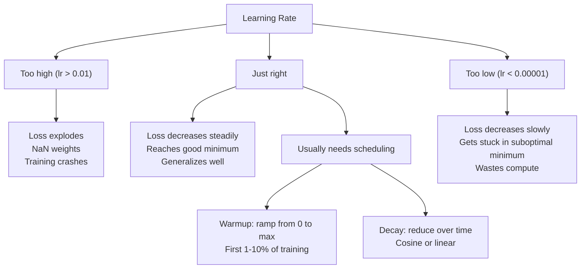
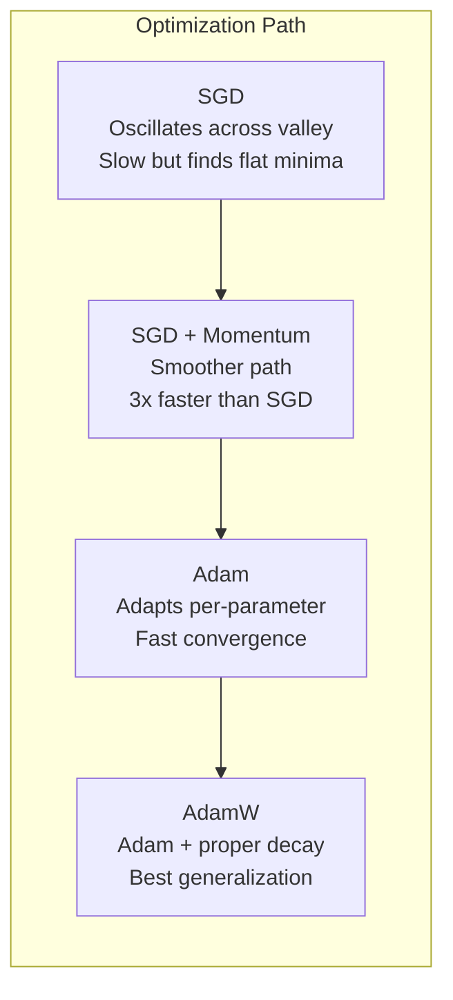
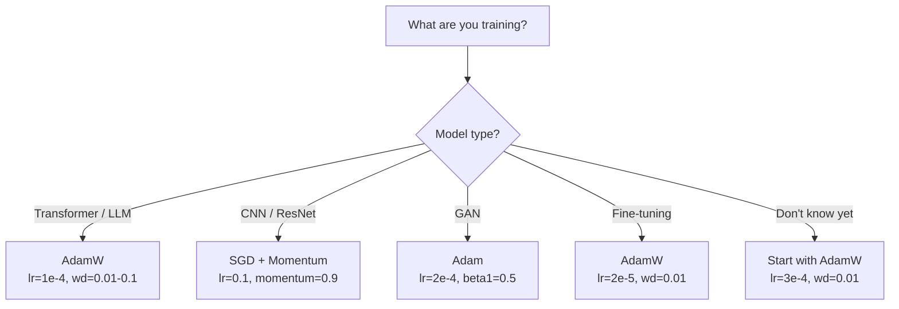

# Optimizers

> Gradient descent cho bạn biết nên di chuyển theo hướng nào. Nó không nói gì về khoảng cách hay tốc độ như thế nào. SGD là một la bàn. Adam là GPS với dữ liệu giao thông.

**Loại:** Xây dựng
**Ngôn ngữ:** Python
**Kiến thức tiên quyết:** Bài 03.05 (Loss Chức năng)
**Thời lượng:** ~75 phút

## Mục tiêu học tập

- Thực hiện SGD, SGD với động lượng, Adam và AdamW optimizers từ đầu trong Python
- Giải thích cách hiệu chỉnh bias của Adam bù cho các ước tính mômen khởi tạo bằng không trong các bước training đầu
- Chứng minh lý do tại sao AdamW tạo ra sự khái quát hóa tốt hơn Adam với chính quy hóa L2 trên cùng một nhiệm vụ
- Chọn optimizer thích hợp và hyperparameters mặc định cho transformers, CNN, GAN và fine-tuning

## Vấn đề

Bạn đã tính toán gradients. Bạn biết rằng trọng lượng # 4,721 nên giảm 0,003 để giảm loss. Nhưng 0.003 trong đơn vị nào? Mở rộng quy mô bởi cái gì? Và bạn có nên di chuyển cùng một số tiền ở bước 1 như ở bước 1.000 không?

Vanilla gradient descent áp dụng cùng một learning rate cho mọi parameter trên mỗi bước: w = w - lr * gradient. Điều này tạo ra ba vấn đề khiến mạng nơ-ron training trở nên đau đớn trong thực tế.

Đầu tiên, dao động. Cảnh quan loss hiếm khi có hình dạng như một chiếc bát nhẵn. Nó giống như một thung lũng dài và hẹp. Các gradient hướng ngang qua thung lũng (hướng dốc), không dọc theo thung lũng (hướng nông). Gradient descent nảy qua lại trên chiều không gian hẹp trong khi tạo ra những tiến bộ nhỏ dọc theo chiều hữu ích. Bạn đã thấy điều này: loss giảm nhanh sau đó ổn định, không phải vì model hội tụ mà vì nó dao động.

Thứ hai, một learning rate cho tất cả parameters là sai. Một số trọng lượng cần cập nhật lớn (chúng đang ở giai đoạn đầu, underfitting giai đoạn). Những người khác cần cập nhật nhỏ (chúng gần với giá trị tối ưu). Một learning rate hiệu quả cho cái trước sẽ phá hủy cái sau và ngược lại.

Thứ ba, điểm yên ngựa. Ở chiều cao, cảnh quan loss có các vùng bằng phẳng rộng lớn, nơi gradient gần bằng không. Vanilla SGD bò qua chúng với tốc độ của gradient, thực tế là bằng không. model có vẻ bị mắc kẹt. Nó không bị mắc kẹt - nó nằm trong một khu vực bằng phẳng với sự xuống dốc hữu ích ở phía bên kia. Nhưng SGD không có cơ chế để vượt qua.

Adam giải quyết cả ba. Nó duy trì hai mức trung bình chạy trên mỗi parameter - gradient trung bình (động lượng, xử lý dao động) và gradient bình phương trung bình (tốc độ thích ứng, xử lý các thang đo khác nhau). Kết hợp với bias chỉnh sửa cho vài bước đầu tiên, nó cung cấp cho bạn một optimizer duy nhất hoạt động trên 80% các vấn đề với hyperparameters mặc định. Bài học này xây dựng nó từ đầu để bạn hiểu chính xác khi nào và tại sao nó thất bại trên 20% còn lại.

## Khái niệm

### Gradient Descent ngẫu nhiên (SGD)

Đơn giản nhất optimizer. Tính toán gradient trên một batch nhỏ và bước theo hướng ngược lại.

```
w = w - lr * gradient
```

"Stochastic" có nghĩa là bạn sử dụng một tập hợp con ngẫu nhiên (mini-batch) dữ liệu để ước tính gradient, thay vì toàn bộ dataset. Nhiễu này thực sự hữu ích - nó giúp thoát khỏi mức tối thiểu cục bộ sắc nét. Nhưng nhiễu cũng gây ra dao động.

Learning rate là núm duy nhất. Quá cao: loss phân kỳ. Quá thấp: training mất mãi mãi. Giá trị tối ưu phụ thuộc vào kiến trúc, dữ liệu, kích thước batch và giai đoạn hiện tại của training. Đối với SGD vani trên các mạng hiện đại, các giá trị điển hình nằm trong khoảng từ 0,01 đến 0,1. Nhưng ngay cả trong một training chạy, learning rate lý tưởng vẫn thay đổi.

### Động lượng

Phép so sánh lăn bóng-xuống dốc bị lạm dụng nhưng chính xác. Thay vì bước qua gradient một mình, bạn duy trì một vận tốc tích lũy qua gradients.

```
m_t = beta * m_{t-1} + gradient
w = w - lr * m_t
```

Beta (thường là 0,9) kiểm soát lượng lịch sử cần lưu giữ. Với beta = 0,9, động lượng xấp xỉ mức trung bình của 10 gradients gần nhất (1 / (1 - 0,9) = 10).

Tại sao điều này cố định dao động: gradients điểm đó theo cùng một hướng tích lũy. Gradients hướng lật đó hủy bỏ. Trong thung lũng hẹp đó, thành phần "ngang" lật dấu mỗi bước và bị ẩm. Thành phần "along" vẫn nhất quán và được khuếch đại. Kết quả là tăng tốc mượt mà theo hướng hữu ích.

Con số thực: SGD một mình trên một cảnh quan loss có điều kiện tồi tệ có thể mất 10.000 bước. SGD có động lượng (beta = 0,9) thường mất 3.000-5.000 bước trên cùng một vấn đề. Tốc độ không phải là cận biên.

### RMSProp

Phương pháp learning rate thích ứng cho mỗi parameter đầu tiên thực sự hiệu quả. Được đề xuất bởi Hinton trong một bài giảng của Coursera (chưa bao giờ được xuất bản chính thức).

```
s_t = beta * s_{t-1} + (1 - beta) * gradient^2
w = w - lr * gradient / (sqrt(s_t) + epsilon)
```

s_t theo dõi mức trung bình chạy của gradients bình phương. Parameters có gradients lớn liên tục được chia cho một số lớn (learning rate hiệu quả nhỏ hơn). Parameters có gradients nhỏ được chia cho một số nhỏ (learning rate hiệu quả lớn hơn).

Điều này giải quyết được vấn đề "một learning rate cho tất cả parameters". Một trọng lượng đã nhận được các bản cập nhật lớn có lẽ đang ở gần mục tiêu của nó - làm chậm lại. Một trọng lượng đã nhận được các bản cập nhật nhỏ có thể bị huấn luyện kém - hãy tăng tốc độ của nó.

Epsilon (thường là 1e-8) ngăn phép chia bằng không khi parameter chưa được cập nhật.

### Adam: Động lượng + RMSProp

Adam kết hợp cả hai ý tưởng. Nó duy trì hai đường trung bình động hàm mũ mỗi parameter:

```
m_t = beta1 * m_{t-1} + (1 - beta1) * gradient        (first moment: mean)
v_t = beta2 * v_{t-1} + (1 - beta2) * gradient^2       (second moment: variance)
```

**Bias chỉnh sửa **là chi tiết chính mà hầu hết các giải thích bỏ qua. Ở bước 1, m_1 = (1 - beta1) * gradient. Với beta1 = 0,9, đó là 0,1 * gradient - quá nhỏ gấp mười lần. Đường trung bình động vẫn chưa ấm lên. Hiệu chỉnh Bias bù đắp:

```
m_hat = m_t / (1 - beta1^t)
v_hat = v_t / (1 - beta2^t)
```

Ở bước 1 với beta1 = 0,9: m_hat = m_1 / (1 - 0,9) = m_1 / 0,1 = gradient thực tế. Ở bước 100: (1 - 0,9^100) xấp xỉ 1,0, vì vậy sự điều chỉnh biến mất. Hiệu chỉnh Bias quan trọng đối với ~10 bước đầu tiên và không liên quan sau ~50.

Cập nhật:

```
w = w - lr * m_hat / (sqrt(v_hat) + epsilon)
```

Adam mặc định: LR = 0,001, beta1 = 0,9, beta2 = 0,999, epsilon = 1e-8. Các giá trị mặc định này hoạt động cho 80% vấn đề. Khi không, hãy thay đổi lr trước. Sau đó là beta2. Hầu như không bao giờ thay đổi beta1 hoặc epsilon.

### AdamW: Giảm cân đúng cách

Chính quy hóa L2 thêm lambda * w ^ 2 vào loss. Trong SGD vani, điều này tương đương với sự phân rã trọng lượng (trừ lambda * w từ trọng lượng ở mỗi bước). Trong Adam, sự tương đương này gặp lỗi.

Cái nhìn sâu sắc của Loshchilov & Hutter: khi bạn thêm L2 vào loss và sau đó Adam processes gradient, learning rate thích ứng cũng mở rộng thuật ngữ chính quy hóa. Parameters có gradient variance lớn sẽ ít được chính quy hóa hơn. Parameters với variance nhỏ nhận được nhiều hơn. Đây không phải là những gì bạn muốn - bạn muốn chính quy hóa thống nhất bất kể số liệu thống kê gradient.

AdamW khắc phục điều này bằng cách áp dụng phân rã trọng lượng trực tiếp lên quả tạ, sau khi cập nhật Adam:

```
w = w - lr * m_hat / (sqrt(v_hat) + epsilon) - lr * lambda * w
```

Thuật ngữ phân rã trọng lượng (lr * lambda * w) không được chia tỷ lệ bởi hệ số thích ứng của Adam. Mỗi parameter đều có độ co ngót theo tỷ lệ như nhau.

Đây có vẻ như là một chi tiết nhỏ. Không phải vậy. AdamW hội tụ các giải pháp tốt hơn so với chính quy hóa Adam + L2 trên hầu hết mọi tác vụ. Đây là optimizer mặc định trong PyTorch cho training transformers, models khuếch tán và hầu hết các kiến trúc hiện đại. BERT, GPT, LLaMA, Stable Diffusion - tất cả đều được huấn luyện với AdamW.

### Learning Rate: Hyperparameter quan trọng nhất



Nếu bạn điều chỉnh một hyperparameter, hãy điều chỉnh learning rate. Thay đổi gấp 10 lần learning rate quan trọng hơn bất kỳ quyết định kiến trúc nào bạn sẽ đưa ra. Các giá trị mặc định phổ biến:

- SGD: lr = 0,01 đến 0,1
- Adam/AdamW: LR = 1e-4 đến 3e-4
- Fine-tuning pretrained models: LR = 1e-5 đến 5e-5
- Learning rate khởi động: tuyến tính ramp trên 1-10% bước đầu tiên

### So sánh Optimizer



### Khi mỗi Optimizer chiến thắng



```figure
optimizer-trajectory
```

## Tự xây dựng

### Bước 1: SGD vani

```python
class SGD:
    def __init__(self, lr=0.01):
        self.lr = lr

    def step(self, params, grads):
        for i in range(len(params)):
            params[i] -= self.lr * grads[i]
```

### Bước 2: SGD với Momentum

```python
class SGDMomentum:
    def __init__(self, lr=0.01, beta=0.9):
        self.lr = lr
        self.beta = beta
        self.velocities = None

    def step(self, params, grads):
        if self.velocities is None:
            self.velocities = [0.0] * len(params)
        for i in range(len(params)):
            self.velocities[i] = self.beta * self.velocities[i] + grads[i]
            params[i] -= self.lr * self.velocities[i]
```

### Bước 3: Adam

```python
import math

class Adam:
    def __init__(self, lr=0.001, beta1=0.9, beta2=0.999, epsilon=1e-8):
        self.lr = lr
        self.beta1 = beta1
        self.beta2 = beta2
        self.epsilon = epsilon
        self.m = None
        self.v = None
        self.t = 0

    def step(self, params, grads):
        if self.m is None:
            self.m = [0.0] * len(params)
            self.v = [0.0] * len(params)

        self.t += 1

        for i in range(len(params)):
            self.m[i] = self.beta1 * self.m[i] + (1 - self.beta1) * grads[i]
            self.v[i] = self.beta2 * self.v[i] + (1 - self.beta2) * grads[i] ** 2

            m_hat = self.m[i] / (1 - self.beta1 ** self.t)
            v_hat = self.v[i] / (1 - self.beta2 ** self.t)

            params[i] -= self.lr * m_hat / (math.sqrt(v_hat) + self.epsilon)
```

### Bước 4: AdamW

```python
class AdamW:
    def __init__(self, lr=0.001, beta1=0.9, beta2=0.999, epsilon=1e-8, weight_decay=0.01):
        self.lr = lr
        self.beta1 = beta1
        self.beta2 = beta2
        self.epsilon = epsilon
        self.weight_decay = weight_decay
        self.m = None
        self.v = None
        self.t = 0

    def step(self, params, grads):
        if self.m is None:
            self.m = [0.0] * len(params)
            self.v = [0.0] * len(params)

        self.t += 1

        for i in range(len(params)):
            self.m[i] = self.beta1 * self.m[i] + (1 - self.beta1) * grads[i]
            self.v[i] = self.beta2 * self.v[i] + (1 - self.beta2) * grads[i] ** 2

            m_hat = self.m[i] / (1 - self.beta1 ** self.t)
            v_hat = self.v[i] / (1 - self.beta2 ** self.t)

            params[i] -= self.lr * m_hat / (math.sqrt(v_hat) + self.epsilon)
            params[i] -= self.lr * self.weight_decay * params[i]
```

### Bước 5: So sánh Training

Huấn luyện cùng một mạng hai lớp trên vòng tròn dataset từ bài 05 với cả bốn optimizers. So sánh sự hội tụ.

```python
import random

def sigmoid(x):
    x = max(-500, min(500, x))
    return 1.0 / (1.0 + math.exp(-x))

def make_circle_data(n=200, seed=42):
    random.seed(seed)
    data = []
    for _ in range(n):
        x = random.uniform(-2, 2)
        y = random.uniform(-2, 2)
        label = 1.0 if x * x + y * y < 1.5 else 0.0
        data.append(([x, y], label))
    return data


class OptimizerTestNetwork:
    def __init__(self, optimizer, hidden_size=8):
        random.seed(0)
        self.hidden_size = hidden_size
        self.optimizer = optimizer

        self.w1 = [[random.gauss(0, 0.5) for _ in range(2)] for _ in range(hidden_size)]
        self.b1 = [0.0] * hidden_size
        self.w2 = [random.gauss(0, 0.5) for _ in range(hidden_size)]
        self.b2 = 0.0

    def get_params(self):
        params = []
        for row in self.w1:
            params.extend(row)
        params.extend(self.b1)
        params.extend(self.w2)
        params.append(self.b2)
        return params

    def set_params(self, params):
        idx = 0
        for i in range(self.hidden_size):
            for j in range(2):
                self.w1[i][j] = params[idx]
                idx += 1
        for i in range(self.hidden_size):
            self.b1[i] = params[idx]
            idx += 1
        for i in range(self.hidden_size):
            self.w2[i] = params[idx]
            idx += 1
        self.b2 = params[idx]

    def forward(self, x):
        self.x = x
        self.z1 = []
        self.h = []
        for i in range(self.hidden_size):
            z = self.w1[i][0] * x[0] + self.w1[i][1] * x[1] + self.b1[i]
            self.z1.append(z)
            self.h.append(max(0.0, z))

        self.z2 = sum(self.w2[i] * self.h[i] for i in range(self.hidden_size)) + self.b2
        self.out = sigmoid(self.z2)
        return self.out

    def compute_grads(self, target):
        eps = 1e-15
        p = max(eps, min(1 - eps, self.out))
        d_loss = -(target / p) + (1 - target) / (1 - p)
        d_sigmoid = self.out * (1 - self.out)
        d_out = d_loss * d_sigmoid

        grads = [0.0] * (self.hidden_size * 2 + self.hidden_size + self.hidden_size + 1)
        idx = 0
        for i in range(self.hidden_size):
            d_relu = 1.0 if self.z1[i] > 0 else 0.0
            d_h = d_out * self.w2[i] * d_relu
            grads[idx] = d_h * self.x[0]
            grads[idx + 1] = d_h * self.x[1]
            idx += 2

        for i in range(self.hidden_size):
            d_relu = 1.0 if self.z1[i] > 0 else 0.0
            grads[idx] = d_out * self.w2[i] * d_relu
            idx += 1

        for i in range(self.hidden_size):
            grads[idx] = d_out * self.h[i]
            idx += 1

        grads[idx] = d_out
        return grads

    def train(self, data, epochs=300):
        losses = []
        for epoch in range(epochs):
            total_loss = 0.0
            correct = 0
            for x, y in data:
                pred = self.forward(x)
                grads = self.compute_grads(y)
                params = self.get_params()
                self.optimizer.step(params, grads)
                self.set_params(params)

                eps = 1e-15
                p = max(eps, min(1 - eps, pred))
                total_loss += -(y * math.log(p) + (1 - y) * math.log(1 - p))
                if (pred >= 0.5) == (y >= 0.5):
                    correct += 1
            avg_loss = total_loss / len(data)
            accuracy = correct / len(data) * 100
            losses.append((avg_loss, accuracy))
            if epoch % 75 == 0 or epoch == epochs - 1:
                print(f"    Epoch {epoch:3d}: loss={avg_loss:.4f}, accuracy={accuracy:.1f}%")
        return losses
```

## Ứng dụng

PyTorch optimizers xử lý parameter nhóm, cắt gradient và lên lịch learning rate:

```python
import torch
import torch.optim as optim

model = torch.nn.Sequential(
    torch.nn.Linear(784, 256),
    torch.nn.ReLU(),
    torch.nn.Linear(256, 10),
)

optimizer = optim.AdamW(model.parameters(), lr=3e-4, weight_decay=0.01)

scheduler = optim.lr_scheduler.CosineAnnealingLR(optimizer, T_max=100)

for epoch in range(100):
    optimizer.zero_grad()
    output = model(torch.randn(32, 784))
    loss = torch.nn.functional.cross_entropy(output, torch.randint(0, 10, (32,)))
    loss.backward()
    torch.nn.utils.clip_grad_norm_(model.parameters(), max_norm=1.0)
    optimizer.step()
    scheduler.step()
```

Mô hình luôn là: zero_grad, tiến, loss, lùi, (clip), bước, (lịch trình). Ghi nhớ thứ tự này. Làm sai (ví dụ: gọi scheduler.step() trước optimizer.step()) là một nguồn phổ biến của các lỗi tinh vi.

Đối với CNN, nhiều học viên vẫn thích SGD + động lượng (lr = 0,1, động lượng = 0,9, weight_decay = 1e-4) với một bước hoặc lịch trình cosin. SGD tìm thấy mức tối thiểu phẳng hơn, thường khái quát hóa tốt hơn. Đối với transformers và LLMs, AdamW với khởi động + phân rã cosin là mặc định phổ biến. Đừng chống lại sự đồng thuận mà không có lý do chính đáng.

## Sản phẩm bàn giao

Bài học này tạo ra:
- `outputs/prompt-optimizer-selector.md` - một quyết định prompt để chọn optimizer và learning rate phù hợp cho bất kỳ kiến trúc nào

## Bài tập

1. Thực hiện động lượng Nesterov, trong đó bạn tính toán gradient ở vị trí "nhìn trước" (w - lr * beta * v) thay vì vị trí hiện tại. So sánh sự hội tụ với động lượng tiêu chuẩn trên dataset vòng tròn.

2. Thực hiện lịch trình khởi động learning rate: đường dốc tuyến tính từ 0 đến max_lr trong 10% bước training đầu tiên, sau đó phân rã cosin về 0. Tập luyện với Adam + khởi động so với Adam không khởi động. Đo lường cần bao nhiêu epochs để đạt được 90% accuracy trên vòng tròn dataset.

3. Theo dõi learning rate hiệu quả cho từng parameter trong quá trình Adam training. Tỷ lệ hiệu quả là lr * m_hat / (sqrt (v_hat) + eps). Vẽ biểu đồ phân phối tỷ lệ hiệu quả sau 10, 50 và 200 bước. Tất cả parameters có được cập nhật với cùng một tốc độ không?

4. Thực hiện cắt gradient (clip theo tiêu chuẩn toàn cầu). Đặt định mức gradient tối đa thành 1.0. Huấn luyện có và không cắt bằng cách sử dụng learning rate cao (lr = 0.01 cho Adam). Đếm số lần chạy phân kỳ (loss thuộc về NaN) có và không cắt hơn 10 hạt ngẫu nhiên.

5. So sánh Adam và AdamW trên mạng có trọng số lớn. Khởi tạo tất cả các trọng số thành các giá trị ngẫu nhiên trong [-5, 5] (lớn hơn nhiều so với bình thường). Tập luyện trong 200 epochs với weight_decay = 0.1. Vẽ định mức L2 của trọng số trên training cho cả hai optimizers. AdamW sẽ cho thấy sự co ngót trọng lượng nhanh hơn.

## Thuật ngữ chính

| Thuật ngữ | Những gì mọi người nói | Ý nghĩa thực sự của nó |
|------|----------------|----------------------|
| Learning rate | "Kích thước bước" | Hệ số vô hướng trên bản cập nhật gradient; hyperparameter có ảnh hưởng nhất ở training |
| SGD | "gradient descent cơ bản" | Stochastic gradient descent: cập nhật trọng số bằng cách trừ lr * gradient, được tính trên một batch nhỏ |
| Động lượng | "Tương tự bóng lăn" | Đường trung bình động hàm mũ của gradients trước; giảm dao động và tăng tốc các hướng nhất quán |
| RMSProp | "learning rate thích ứng" | Chia gradient của mỗi parameter cho RMS đang chạy của gradients gần đây của nó; cân bằng tỷ lệ học tập |
| Adam | "optimizer mặc định" | Kết hợp động lượng (khoảnh khắc đầu tiên) và RMSProp (khoảnh khắc thứ hai) với bias điều chỉnh cho các bước đầu tiên |
| AdamW | "Adam làm đúng" | Adam với trọng lượng phân rã tách rời; áp dụng chính quy hóa trực tiếp cho trọng số thay vì thông qua gradient |
| Chỉnh sửa Bias | "Khởi động cho người chạy trung bình" | Chia cho (1 - beta^t) để bù cho sự khởi tạo bằng không của ước tính mômen của Adam |
| Giảm cân | "Thu nhỏ trọng lượng" | Trừ một phần giá trị trọng số ở mỗi bước; một bộ điều chỉnh hình phạt trọng lượng lớn |
| Learning rate lịch trình | "Thay đổi lr theo thời gian" | Một chức năng điều chỉnh learning rate trong quá trình training; khởi động + phân rã cosin là mặc định hiện đại |
| Gradient cắt | "Giới hạn tiêu chuẩn gradient" | Thu hẹp quy mô gradient vector khi định mức của nó vượt quá ngưỡng; Ngăn chặn các bản cập nhật gradient bùng nổ |

## Đọc thêm

- Kingma & Ba, "Adam: A Method for Stochastic Optimization" (2014) - bài báo gốc của Adam với phân tích hội tụ và dẫn xuất hiệu chỉnh bias
- Loshchilov & Hutter, "Quy tắc hóa phân rã trọng lượng tách rời" (2017) - đã chứng minh rằng chính quy hóa L2 và phân rã trọng lượng không tương đương về Adam, và đề xuất AdamW
- Smith, "Tỷ lệ học tập theo chu kỳ cho Training mạng nơ-ron" (2017) - giới thiệu kiểm tra phạm vi LR và lịch trình theo chu kỳ giúp loại bỏ nhu cầu điều chỉnh learning rate cố định
- Ruder, "Tổng quan về các thuật toán tối ưu hóa Gradient Descent" (2016) - cuộc khảo sát đơn lẻ tốt nhất trong tất cả các biến thể optimizer, với các so sánh và trực giác rõ ràng
