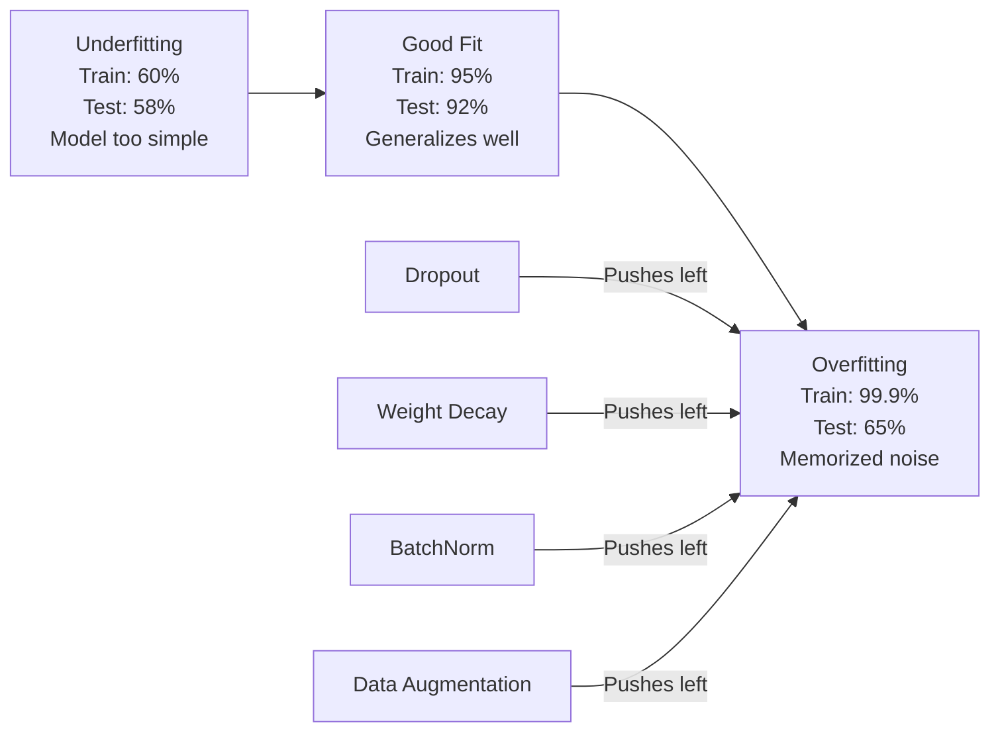
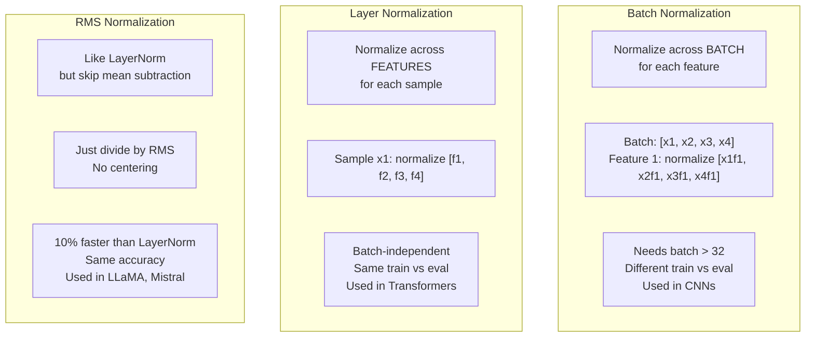
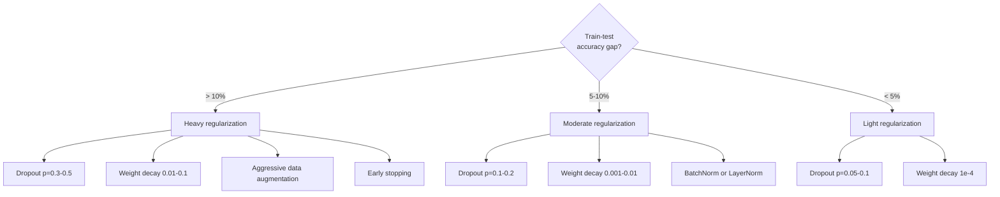

# Chính quy hóa

> model của bạn nhận được 99% dữ liệu training và 60% dữ liệu thử nghiệm. Nó ghi nhớ thay vì học. Chính quy hóa là thuế bạn áp đặt vào sự phức tạp để buộc khái quát hóa.

**Loại:** Xây dựng
**Ngôn ngữ:** Python
**Kiến thức tiên quyết:** Bài 03.06 (Optimizers)
**Thời lượng:** ~75 phút

## Mục tiêu học tập

- Triển khai dropout với tỷ lệ đảo ngược, giảm trọng lượng L2, chuẩn hóa batch, chuẩn hóa lớp và RMSNorm từ đầu
- Đo khoảng cách accuracy kiểm tra huấn luyện và chẩn đoán overfitting bằng cách sử dụng các thí nghiệm chính quy hóa
- Giải thích lý do tại sao transformers sử dụng LayerNorm thay vì BatchNorm và tại sao LLMs hiện đại thích RMSNorm
- Áp dụng sự kết hợp chính xác của các kỹ thuật chính quy hóa dựa trên mức độ nghiêm trọng của overfitting

## Vấn đề

Một mạng nơ-ron có đủ parameters có thể ghi nhớ bất kỳ dataset nào. Đây không phải là một giả thuyết - Zhang et al. (2017) đã chứng minh điều đó bằng training mạng tiêu chuẩn trên ImageNet với các nhãn ngẫu nhiên. Các mạng đạt đến mức gần như bằng không training loss trên các chỉ định nhãn hoàn toàn ngẫu nhiên. Họ ghi nhớ một triệu cặp đầu vào-đầu ra ngẫu nhiên mà không có mẫu để học. Training loss thật hoàn hảo. Thử nghiệm accuracy bằng không.

Đây là vấn đề overfitting, và nó trở nên tồi tệ hơn khi models lớn hơn. GPT-3 có 175 tỷ parameters. Bộ training có khoảng 500 tỷ tokens. Với nhiều parameters như vậy, model có đủ dung lượng để ghi nhớ nguyên văn các phần đáng kể của dữ liệu training. Nếu không có quy tắc hóa, nó sẽ chỉ nôn ra các ví dụ training thay vì học các mẫu có thể khái quát hóa.

Khoảng cách giữa hiệu suất training và hiệu suất thử nghiệm là khoảng cách overfitting. Mọi kỹ thuật trong bài học này đều tấn công khoảng trống đó từ một góc độ khác nhau. Dropout buộc mạng không phải dựa vào bất kỳ tế bào thần kinh đơn lẻ nào. Sự phân rã trọng lượng ngăn không cho bất kỳ trọng lượng đơn lẻ nào phát triển quá lớn. Batch chuẩn hóa làm mịn cảnh quan loss để optimizer tìm thấy mức tối thiểu phẳng hơn, có thể khái quát hóa hơn. Chuẩn hóa lớp cũng làm điều tương tự nhưng hoạt động khi chuẩn hóa batch không thành công (trình tự batches nhỏ, độ dài thay đổi). RMSNorm làm điều đó nhanh hơn 10% bằng cách bỏ phép tính trung bình. Mỗi kỹ thuật đều đơn giản. Cùng với nhau, chúng là sự khác biệt giữa một model ghi nhớ và một  khái quát.

## Khái niệm

### Quang phổ Overfitting

Mỗi model nằm ở đâu đó trên quang phổ từ underfitting (quá đơn giản để nắm bắt mẫu) đến overfitting (phức tạp đến mức thu được nhiễu). Điểm ngọt ngào nằm ở giữa, và việc chính quy hóa đẩy models về phía nó từ phía quá phù hợp.



### Dropout

Kỹ thuật chính quy hóa đơn giản nhất với cách giải thích trang nhã nhất. Trong quá trình training, đặt ngẫu nhiên đầu ra của mỗi tế bào thần kinh về không với xác suất p.

```
output = activation(z) * mask    where mask[i] ~ Bernoulli(1 - p)
```

Với p = 0,5, một nửa số tế bào thần kinh được tính bằng không trên mỗi forward pass. Mạng phải học các biểu diễn dư thừa vì nó không thể dự đoán tế bào thần kinh nào sẽ có sẵn. Điều này ngăn cản sự đồng thích nghi - các tế bào thần kinh học cách dựa vào các tế bào thần kinh cụ thể khác hiện diện.

Giải thích tổng hợp: một mạng lưới với N tế bào thần kinh và dropout tạo ra 2 ^ N mạng con có thể có (mọi sự kết hợp của các tế bào thần kinh được bật hoặc tắt). Training với dropout xấp xỉ huấn luyện tất cả 2 ^ N mạng con đồng thời, mỗi mạng trên các batches nhỏ khác nhau. Tại thời điểm thử nghiệm, bạn sử dụng tất cả các tế bào thần kinh (không có dropout) và tỷ lệ đầu ra theo (1 - p) để khớp với giá trị mong đợi trong quá trình training. Điều này tương đương với việc tính trung bình các dự đoán của 2^N mạng con - một tập hợp khổng lồ từ một model duy nhất.

Trong thực tế, tỷ lệ được áp dụng trong quá trình training thay vì thử nghiệm (dropout đảo ngược):

```
During training:  output = activation(z) * mask / (1 - p)
During testing:   output = activation(z)   (no change needed)
```

Điều này sạch sẽ hơn vì mã kiểm tra hoàn toàn không cần biết về dropout.

Tỷ lệ vỡ nợ: p = 0,1 đối với transformers, p = 0,5 đối với MLP, p = 0,2-0,3 đối với CNN. dropout cao hơn = chính quy hóa mạnh hơn = rủi ro underfitting nhiều hơn.

### Phân rã trọng lượng (Chính quy hóa L2)

Thêm độ lớn bình phương của tất cả các trọng số vào loss:

```
total_loss = task_loss + (lambda / 2) * sum(w_i^2)
```

Điểm gradient của thuật ngữ chính quy hóa là lambda * w. Điều này có nghĩa là ở mỗi bước, mỗi trọng lượng được thu nhỏ về không theo một phần tỷ lệ thuận với độ lớn của nó. Trọng lượng lớn bị phạt nhiều hơn. Sự model được đẩy sang các giải pháp mà không có trọng lượng nào chiếm ưu thế.

Tại sao điều này giúp khái quát hóa: các models quá khớp có xu hướng có trọng số lớn khuếch đại nhiễu trong dữ liệu training. Sự phân rã trọng lượng giữ cho trọng lượng nhỏ, điều này hạn chế khả năng hiệu quả của model và buộc nó phải dựa vào các features mạnh mẽ, có thể khái quát hóa hơn là những điều kỳ quặc được ghi nhớ.

Lambda hyperparameter kiểm soát sức mạnh. Các giá trị tiêu biểu:

- 0.01 cho AdamW trên transformers
- 1e-4 cho SGD trên CNN
- 0.1 Đối với models quá khớp

Như đã thảo luận trong bài 06: phân rã trọng lượng và chính quy hóa L2 tương đương về SGD nhưng không tương đương trong Adam. Luôn sử dụng AdamW (phân rã trọng lượng tách rời) khi training với Adam.

### Batch Chuẩn hóa

Chuẩn hóa đầu ra của mỗi layer trên mini-batch trước khi chuyển nó sang layer tiếp theo.

Đối với một batch kích hoạt nhỏ ở một số lớp:

```
mu = (1/B) * sum(x_i)           (batch mean)
sigma^2 = (1/B) * sum((x_i - mu)^2)   (batch variance)
x_hat = (x_i - mu) / sqrt(sigma^2 + eps)   (normalize)
y = gamma * x_hat + beta        (scale and shift)
```

Gamma và beta có thể học được parameters cho phép mạng hoàn tác việc chuẩn hóa nếu điều đó là tối ưu. Nếu không có chúng, bạn sẽ buộc đầu ra của mọi lớp phải là đơn vị trung bình bằng không, variance này có thể không phải là những gì mạng muốn.

**Training vs inference split: **Trong training, mu và sigma đến từ mini-batch hiện tại. Trong inference, bạn sử dụng đường trung bình chạy tích lũy trong training (đường trung bình động hàm mũ với động lượng = 0,1, nghĩa là 90% cũ + 10% mới).

Tại sao BatchNorm hoạt động vẫn còn đang được tranh luận. Bài báo ban đầu tuyên bố nó làm giảm "sự dịch chuyển hiệp biến bên trong" (sự phân bố của các đầu vào lớp thay đổi khi các lớp trước đó cập nhật). Santurkar et al. (2018) cho thấy lời giải thích này là sai. Lý do thực tế: BatchNorm làm cho cảnh quan loss mượt mà hơn. Các gradients dự đoán tốt hơn, hằng số Lipschitz nhỏ hơn và optimizer có thể thực hiện các bước lớn hơn một cách an toàn. Đây là lý do tại sao BatchNorm cho phép bạn sử dụng tốc độ học tập cao hơn và hội tụ nhanh hơn.

BatchNorm có một hạn chế cơ bản: nó phụ thuộc vào số liệu thống kê batch. Với batch cỡ 1, giá trị trung bình và variance là vô nghĩa. Với batches nhỏ (< 32), các số liệu thống kê ồn ào và ảnh hưởng đến hiệu suất. Điều này quan trọng đối với các tác vụ như phát hiện đối tượng (trong đó bộ nhớ giới hạn kích thước batch) và mô hình hóa ngôn ngữ (trong đó độ dài trình tự khác nhau).

### Chuẩn hóa lớp

Chuẩn hóa trên features thay vì trên batch. Đối với một mẫu:

```
mu = (1/D) * sum(x_j)           (feature mean)
sigma^2 = (1/D) * sum((x_j - mu)^2)   (feature variance)
x_hat = (x_j - mu) / sqrt(sigma^2 + eps)
y = gamma * x_hat + beta
```

D là chiều feature. Mỗi mẫu được chuẩn hóa độc lập - không phụ thuộc vào kích thước batch. Đây là lý do tại sao transformers sử dụng LayerNorm thay vì BatchNorm. Các chuỗi có độ dài thay đổi, kích thước batch thường nhỏ (hoặc 1 trong quá trình tạo) và tính toán giống hệt nhau giữa training và inference.

LayerNorm trong transformers được áp dụng sau mỗi khối self-attention và mỗi khối chuyển tiếp (Post-LN) hoặc trước chúng (Pre-LN, ổn định hơn cho training).

### RMSNorm

LayerNorm mà không có phép trừ trung bình. Đề xuất bởi Zhang & Sennrich (2019).

```
rms = sqrt((1/D) * sum(x_j^2))
y = gamma * x / rms
```

Đó là nó. Không có tính toán trung bình, không có parameter beta. Quan sát: việc định tâm lại (trừ trung bình) trong LayerNorm đóng góp rất ít vào hiệu suất của model, nhưng chi phí tính toán. Loại bỏ nó sẽ mang lại accuracy tương tự với chi phí thấp hơn khoảng 10%.

LLaMA, LLaMA 2, LLaMA 3, Mistral và hầu hết các LLMs hiện đại đều sử dụng RMSNorm thay vì LayerNorm. Với quy mô hàng tỷ parameters và hàng nghìn tỷ tokens, khoản tiết kiệm 10% đó là đáng kể.

### So sánh chuẩn hóa



### Tăng cường dữ liệu dưới dạng chính quy hóa

Không phải là sửa đổi model mà là sửa đổi dữ liệu. Chuyển đổi đầu vào training trong khi vẫn giữ nhãn:

- Hình ảnh: cắt ngẫu nhiên, lật, xoay, chập chờn màu, cắt
- Văn bản: thay thế từ đồng nghĩa, dịch ngược, xóa ngẫu nhiên
- Âm thanh: kéo dài thời gian, dịch chuyển cao độ, thêm nhiễu

Hiệu ứng giống hệt với chính quy hóa: nó làm tăng kích thước hiệu quả của tập training, khiến model khó ghi nhớ các ví dụ cụ thể hơn. Một model chỉ nhìn thấy mỗi hình ảnh một lần ở dạng ban đầu có thể ghi nhớ nó. Một model nhìn thấy 50 phiên bản tăng cường của mỗi hình ảnh buộc phải tìm hiểu cấu trúc bất biến.

### Dừng sớm

Công cụ chính quy đơn giản nhất: dừng training khi loss xác thực bắt đầu tăng. model vẫn chưa quá thể lực vào thời điểm đó. Trong thực tế, bạn theo dõi xác thực loss mỗi epoch, lưu model tốt nhất và tiếp tục training trong khoảng thời gian "kiên nhẫn" (thường là 5-20 epochs). Nếu xác thực loss không cải thiện trong khoảng thời gian kiên nhẫn, bạn dừng lại và tải model đã lưu tốt nhất.

### Khi nào áp dụng những gì



```figure
l2-regularization
```

## Tự xây dựng

### Bước 1: Dropout (Chế độ huấn luyện và đánh giá)

```python
import random
import math


class Dropout:
    def __init__(self, p=0.5):
        self.p = p
        self.training = True
        self.mask = None

    def forward(self, x):
        if not self.training:
            return list(x)
        self.mask = []
        output = []
        for val in x:
            if random.random() < self.p:
                self.mask.append(0)
                output.append(0.0)
            else:
                self.mask.append(1)
                output.append(val / (1 - self.p))
        return output

    def backward(self, grad_output):
        grads = []
        for g, m in zip(grad_output, self.mask):
            if m == 0:
                grads.append(0.0)
            else:
                grads.append(g / (1 - self.p))
        return grads
```

### Bước 2: Phân rã trọng lượng L2

```python
def l2_regularization(weights, lambda_reg):
    penalty = 0.0
    for w in weights:
        penalty += w * w
    return lambda_reg * 0.5 * penalty

def l2_gradient(weights, lambda_reg):
    return [lambda_reg * w for w in weights]
```

### Bước 3: Chuẩn hóa Batch

```python
class BatchNorm:
    def __init__(self, num_features, momentum=0.1, eps=1e-5):
        self.gamma = [1.0] * num_features
        self.beta = [0.0] * num_features
        self.eps = eps
        self.momentum = momentum
        self.running_mean = [0.0] * num_features
        self.running_var = [1.0] * num_features
        self.training = True
        self.num_features = num_features

    def forward(self, batch):
        batch_size = len(batch)
        if self.training:
            mean = [0.0] * self.num_features
            for sample in batch:
                for j in range(self.num_features):
                    mean[j] += sample[j]
            mean = [m / batch_size for m in mean]

            var = [0.0] * self.num_features
            for sample in batch:
                for j in range(self.num_features):
                    var[j] += (sample[j] - mean[j]) ** 2
            var = [v / batch_size for v in var]

            for j in range(self.num_features):
                self.running_mean[j] = (1 - self.momentum) * self.running_mean[j] + self.momentum * mean[j]
                self.running_var[j] = (1 - self.momentum) * self.running_var[j] + self.momentum * var[j]
        else:
            mean = list(self.running_mean)
            var = list(self.running_var)

        self.x_hat = []
        output = []
        for sample in batch:
            normalized = []
            out_sample = []
            for j in range(self.num_features):
                x_h = (sample[j] - mean[j]) / math.sqrt(var[j] + self.eps)
                normalized.append(x_h)
                out_sample.append(self.gamma[j] * x_h + self.beta[j])
            self.x_hat.append(normalized)
            output.append(out_sample)
        return output
```

### Bước 4: Chuẩn hóa lớp

```python
class LayerNorm:
    def __init__(self, num_features, eps=1e-5):
        self.gamma = [1.0] * num_features
        self.beta = [0.0] * num_features
        self.eps = eps
        self.num_features = num_features

    def forward(self, x):
        mean = sum(x) / len(x)
        var = sum((xi - mean) ** 2 for xi in x) / len(x)

        self.x_hat = []
        output = []
        for j in range(self.num_features):
            x_h = (x[j] - mean) / math.sqrt(var + self.eps)
            self.x_hat.append(x_h)
            output.append(self.gamma[j] * x_h + self.beta[j])
        return output
```

### Bước 5: RMSNorm

```python
class RMSNorm:
    def __init__(self, num_features, eps=1e-6):
        self.gamma = [1.0] * num_features
        self.eps = eps
        self.num_features = num_features

    def forward(self, x):
        rms = math.sqrt(sum(xi * xi for xi in x) / len(x) + self.eps)
        output = []
        for j in range(self.num_features):
            output.append(self.gamma[j] * x[j] / rms)
        return output
```

### Bước 6: Training có và không có quy tắc hóa

```python
def sigmoid(x):
    x = max(-500, min(500, x))
    return 1.0 / (1.0 + math.exp(-x))


def make_circle_data(n=200, seed=42):
    random.seed(seed)
    data = []
    for _ in range(n):
        x = random.uniform(-2, 2)
        y = random.uniform(-2, 2)
        label = 1.0 if x * x + y * y < 1.5 else 0.0
        data.append(([x, y], label))
    return data


class RegularizedNetwork:
    def __init__(self, hidden_size=16, lr=0.05, dropout_p=0.0, weight_decay=0.0):
        random.seed(0)
        self.hidden_size = hidden_size
        self.lr = lr
        self.dropout_p = dropout_p
        self.weight_decay = weight_decay
        self.dropout = Dropout(p=dropout_p) if dropout_p > 0 else None

        self.w1 = [[random.gauss(0, 0.5) for _ in range(2)] for _ in range(hidden_size)]
        self.b1 = [0.0] * hidden_size
        self.w2 = [random.gauss(0, 0.5) for _ in range(hidden_size)]
        self.b2 = 0.0

    def forward(self, x, training=True):
        self.x = x
        self.z1 = []
        self.h = []
        for i in range(self.hidden_size):
            z = self.w1[i][0] * x[0] + self.w1[i][1] * x[1] + self.b1[i]
            self.z1.append(z)
            self.h.append(max(0.0, z))

        if self.dropout and training:
            self.dropout.training = True
            self.h = self.dropout.forward(self.h)
        elif self.dropout:
            self.dropout.training = False
            self.h = self.dropout.forward(self.h)

        self.z2 = sum(self.w2[i] * self.h[i] for i in range(self.hidden_size)) + self.b2
        self.out = sigmoid(self.z2)
        return self.out

    def backward(self, target):
        eps = 1e-15
        p = max(eps, min(1 - eps, self.out))
        d_loss = -(target / p) + (1 - target) / (1 - p)
        d_sigmoid = self.out * (1 - self.out)
        d_out = d_loss * d_sigmoid

        for i in range(self.hidden_size):
            d_relu = 1.0 if self.z1[i] > 0 else 0.0
            d_h = d_out * self.w2[i] * d_relu
            self.w2[i] -= self.lr * (d_out * self.h[i] + self.weight_decay * self.w2[i])
            for j in range(2):
                self.w1[i][j] -= self.lr * (d_h * self.x[j] + self.weight_decay * self.w1[i][j])
            self.b1[i] -= self.lr * d_h
        self.b2 -= self.lr * d_out

    def evaluate(self, data):
        correct = 0
        total_loss = 0.0
        for x, y in data:
            pred = self.forward(x, training=False)
            eps = 1e-15
            p = max(eps, min(1 - eps, pred))
            total_loss += -(y * math.log(p) + (1 - y) * math.log(1 - p))
            if (pred >= 0.5) == (y >= 0.5):
                correct += 1
        return total_loss / len(data), correct / len(data) * 100

    def train_model(self, train_data, test_data, epochs=300):
        history = []
        for epoch in range(epochs):
            total_loss = 0.0
            correct = 0
            for x, y in train_data:
                pred = self.forward(x, training=True)
                self.backward(y)
                eps = 1e-15
                p = max(eps, min(1 - eps, pred))
                total_loss += -(y * math.log(p) + (1 - y) * math.log(1 - p))
                if (pred >= 0.5) == (y >= 0.5):
                    correct += 1
            train_loss = total_loss / len(train_data)
            train_acc = correct / len(train_data) * 100
            test_loss, test_acc = self.evaluate(test_data)
            history.append((train_loss, train_acc, test_loss, test_acc))
            if epoch % 75 == 0 or epoch == epochs - 1:
                gap = train_acc - test_acc
                print(f"    Epoch {epoch:3d}: train_acc={train_acc:.1f}%, test_acc={test_acc:.1f}%, gap={gap:.1f}%")
        return history
```

## Ứng dụng

PyTorch cung cấp tất cả chuẩn hóa và chính quy hóa dưới dạng mô-đun:

```python
import torch
import torch.nn as nn

model = nn.Sequential(
    nn.Linear(784, 256),
    nn.BatchNorm1d(256),
    nn.ReLU(),
    nn.Dropout(0.3),
    nn.Linear(256, 128),
    nn.BatchNorm1d(128),
    nn.ReLU(),
    nn.Dropout(0.3),
    nn.Linear(128, 10),
)

model.train()
out_train = model(torch.randn(32, 784))

model.eval()
out_test = model(torch.randn(1, 784))
```

Công tắc `model.train()` / `model.eval()` là rất quan trọng. Nó chuyển đổi dropout on/off và yêu cầu BatchNorm sử dụng số liệu thống kê batch so với số liệu thống kê đang chạy. Quên `model.eval()` trước inference là một trong những lỗi phổ biến nhất trong deep learning. accuracy thử nghiệm của bạn sẽ dao động ngẫu nhiên vì dropout vẫn đang hoạt động và BatchNorm đang sử dụng số liệu thống kê batch nhỏ.

Đối với transformers, mô hình là khác nhau:

```python
class TransformerBlock(nn.Module):
    def __init__(self, d_model=512, nhead=8, dropout=0.1):
        super().__init__()
        self.attention = nn.MultiheadAttention(d_model, nhead, dropout=dropout)
        self.norm1 = nn.LayerNorm(d_model)
        self.ff = nn.Sequential(
            nn.Linear(d_model, d_model * 4),
            nn.GELU(),
            nn.Linear(d_model * 4, d_model),
            nn.Dropout(dropout),
        )
        self.norm2 = nn.LayerNorm(d_model)
        self.dropout = nn.Dropout(dropout)

    def forward(self, x):
        attended, _ = self.attention(x, x, x)
        x = self.norm1(x + self.dropout(attended))
        x = self.norm2(x + self.ff(x))
        return x
```

LayerNorm, không phải BatchNorm. Dropout p = 0,1, không phải p = 0,5. Đây là những mặc định transformer.

## Sản phẩm bàn giao

Bài học này tạo ra:
- `outputs/prompt-regularization-advisor.md` -- một prompt chẩn đoán overfitting và đề xuất chiến lược chính quy hóa phù hợp

## Bài tập

1. Triển khai dropout không gian cho dữ liệu 2D: thay vì thả các tế bào thần kinh riêng lẻ, hãy bỏ toàn bộ kênh feature. Mô phỏng điều này bằng cách coi các nhóm features liên tiếp làm kênh và loại bỏ toàn bộ nhóm. So sánh khoảng cách thử nghiệm tàu với dropout tiêu chuẩn trên dataset vòng tròn với hidden_size=32.

2. Thực hiện làm mịn nhãn từ bài 05 kết hợp với dropout từ bài học này. Huấn luyện với bốn cấu hình: không, chỉ dropout, chỉ làm mịn nhãn, cả hai. Đo khoảng cách accuracy thử nghiệm tàu cuối cùng cho mỗi loại. Sự kết hợp nào cho khoảng cách nhỏ nhất?

3. Thêm một lớp BatchNorm giữa lớp ẩn và kích hoạt trong mạng dataset vòng tròn của bạn. Huấn luyện có và không có BatchNorm với tỷ lệ học 0,01, 0,05 và 0,1. BatchNorm nên cho phép training ổn định ở tốc độ học tập cao hơn khi mạng vani phân kỳ.

4. Thực hiện dừng sớm: theo dõi kiểm tra loss mỗi epoch, lưu trọng lượng tốt nhất và dừng lại nếu loss kiểm tra không cải thiện trong 20 epochs. Chạy mạng chính quy trong 1000 epochs. Báo cáo epoch nào có accuracy kiểm tra tốt nhất và bạn đã tiết kiệm được bao nhiêu epochs tính toán.

5. So sánh LayerNorm và RMSNorm trên mạng 4 lớp (không chỉ 2). Khởi tạo cả hai với cùng trọng số. Tập luyện trong 200 epochs và so sánh accuracy cuối cùng, tốc độ training (thời gian trên epoch) và cường độ gradient ở lớp đầu tiên. Xác minh rằng RMSNorm nhanh hơn với cùng một accuracy.

## Thuật ngữ chính

| Thuật ngữ | Những gì mọi người nói | Ý nghĩa thực sự của nó |
|------|----------------|----------------------|
| Overfitting | "Model ghi nhớ dữ liệu" | Khi hiệu suất training của model vượt quá đáng kể hiệu suất thử nghiệm của nó, cho thấy nó đã học được nhiễu chứ không phải tín hiệu |
| Chính quy hóa | "Ngăn chặn overfitting" | Bất kỳ kỹ thuật nào hạn chế độ phức tạp model để cải thiện khái quát hóa: dropout, giảm cân, chuẩn hóa, tăng cường |
| Dropout | "Xóa tế bào thần kinh ngẫu nhiên" | Không các tế bào thần kinh ngẫu nhiên trong quá trình training với xác suất p, buộc các biểu diễn dư thừa; tương đương với training một bản hòa tấu |
| Giảm cân | "Hình phạt L2" | Thu nhỏ tất cả các trọng lượng về không bằng cách trừ lambda * w ở mỗi bước; trừng phạt sự phức tạp thông qua độ lớn trọng lượng |
| Batch chuẩn hóa | "Chuẩn hóa mỗi batch" | Chuẩn hóa đầu ra lớp trên chiều batch bằng cách sử dụng số liệu thống kê batch trong training và chạy trung bình trong inference |
| Chuẩn hóa lớp | "Chuẩn hóa mỗi mẫu" | Chuẩn hóa trên các features trong mỗi mẫu; batch độc lập, được sử dụng ở transformers nơi kích thước batch khác nhau |
| RMSNorm | "LayerNorm mà không có ý nghĩa" | Chuẩn hóa bình phương trung bình gốc; Giảm phép trừ trung bình từ LayerNorm để tăng tốc 10% với accuracy bằng nhau |
| Dừng sớm | "Dừng lại trước khi quá vắng" | Tạm dừng training khi xác thực loss ngừng cải thiện; bộ điều chỉnh đơn giản nhất, thường được sử dụng cùng với những người khác |
| Tăng cường dữ liệu | "Nhiều dữ liệu hơn từ ít hơn" | Chuyển đổi đầu vào training (lật, cắt, nhiễu) để tăng kích thước dataset hiệu quả và buộc học bất biến |
| Khoảng cách tổng quát hóa | "Phân chia thử nghiệm tàu hỏa" | Sự khác biệt giữa hiệu suất training và thử nghiệm; Chính quy hóa nhằm mục đích giảm thiểu khoảng cách này |

## Đọc thêm

- Srivastava và cộng sự, "Dropout: Một cách đơn giản để ngăn chặn mạng nơ-ron khỏi Overfitting" (2014) - bài báo gốc dropout với cách giải thích tổng hợp và các thí nghiệm mở rộng
- Ioffe & Szegedy, "Chuẩn hóa Batch: Tăng tốc Training mạng sâu bằng cách giảm sự thay đổi hiệp biến bên trong" (2015) - giới thiệu BatchNorm và quy trình training của nó, một trong những bài báo học sâu được trích dẫn nhiều nhất
- Zhang & Sennrich, "Chuẩn hóa lớp vuông trung bình gốc" (2019) - cho thấy RMSNorm phù hợp với LayerNorm accuracy tính toán giảm; được LLaMA và Mistral nhận nuôi
- Zhang và cộng sự, "Hiểu về học sâu đòi hỏi phải suy nghĩ lại về khái quát hóa" (2017) - bài báo mang tính bước ngoặt cho thấy mạng nơ-ron có thể ghi nhớ các nhãn ngẫu nhiên, thách thức quan điểm truyền thống về khái quát hóa
