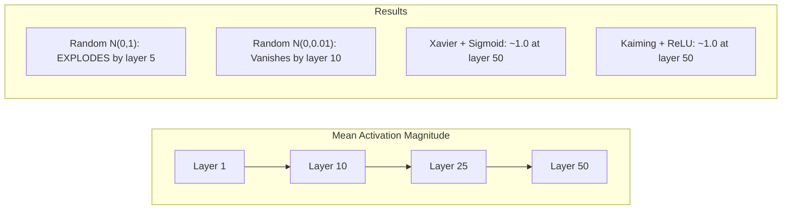
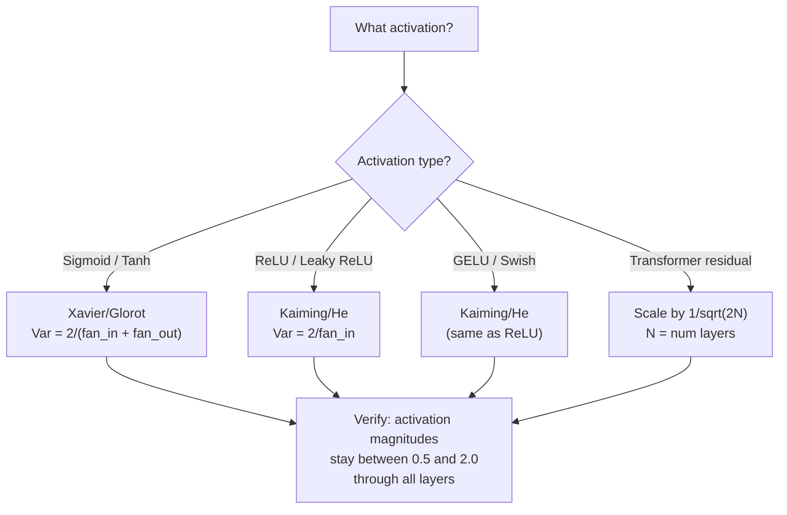

# Khởi tạo trọng lượng và ổn định Training

> Khởi tạo sai và training không bao giờ khởi động. Khởi tạo bên phải và 50 layer huấn luyện mượt mà như 3.

**Loại:** Xây dựng
**Ngôn ngữ:** Python
**Kiến thức tiên quyết:** Bài 03.04 (Chức năng kích hoạt), Bài 03.07 (Chính quy hóa)
**Thời lượng:** ~90 phút

## Mục tiêu học tập

- Thực hiện các chiến lược khởi tạo zero, random, Xavier/Glorot và Kaiming/He và đo lường ảnh hưởng của chúng đối với cường độ kích hoạt thông qua 50 lớp
- Suy ra lý do tại sao Xavier init sử dụng Var(w) = 2/(fan_in + fan_out) và Kaiming sử dụng Var(w) = 2/fan_in
- Chứng minh bài toán đối xứng với khởi tạo bằng không và giải thích tại sao chỉ tỷ lệ ngẫu nhiên là không đủ
- Khớp chiến lược khởi tạo chính xác với chức năng kích hoạt: Xavier cho sigmoid/tanh, Kaiming cho ReLU/GELU

## Vấn đề

Khởi tạo tất cả trọng số về không. Không có gì học được. Mỗi tế bào thần kinh tính toán cùng một chức năng, nhận cùng một gradient và cập nhật giống hệt nhau. Sau 10.000 epochs, lớp ẩn 512 tế bào thần kinh của bạn vẫn là 512 bản sao của cùng một tế bào thần kinh. Bạn đã trả 512 parameters và nhận được 1.

Khởi tạo chúng quá lớn. Kích hoạt bùng nổ thông qua mạng. Đến layer 10, các giá trị đạt 1e15. Đến lớp 20, chúng tràn đến vô cực. Gradients đi theo cùng một quỹ đạo ngược lại.

Khởi tạo chúng một cách ngẫu nhiên từ một phân phối chuẩn chuẩn. Hoạt động cho 3 lớp. Ở 50 lớp, tín hiệu thu gọn về 0 hoặc phát nổ đến vô cực tùy thuộc vào việc thang đo ngẫu nhiên hơi quá nhỏ hay hơi quá lớn. Ranh giới giữa "tác phẩm" và "gặp lỗi" rất mỏng.

Khởi tạo trọng số là quyết định bị đánh giá thấp nhất trong deep learning. Kiến trúc có giấy tờ. Optimizers nhận các bài đăng trên blog. Khởi tạo nhận được chú thích. Nhưng hãy làm sai và không có gì khác quan trọng - mạng của bạn đã chết trước khi training bắt đầu.

## Khái niệm

### Vấn đề đối xứng

Mỗi tế bào thần kinh trong một lớp có cùng cấu trúc: nhân đầu vào với trọng số, thêm bias, áp dụng kích hoạt. Nếu tất cả các trọng số bắt đầu ở cùng một giá trị (không là trường hợp cực đoan), mọi tế bào thần kinh sẽ tính toán cùng một đầu ra. Trong quá trình backpropagation, mọi tế bào thần kinh nhận được cùng một gradient. Trong bước cập nhật, mọi tế bào thần kinh thay đổi theo cùng một lượng.

Bạn bị mắc kẹt. Mạng lưới có hàng trăm parameters, nhưng tất cả đều di chuyển cùng nhau. Điều này được gọi là đối xứng và khởi tạo ngẫu nhiên là cách vũ phu để phá vỡ nó. Mỗi tế bào thần kinh bắt đầu ở một điểm khác nhau trong không gian trọng lượng, vì vậy mỗi tế bào thần kinh học một feature khác nhau.

Nhưng "ngẫu nhiên" là không đủ. * Quy mô * của tính ngẫu nhiên xác định liệu mạng có huấn luyện hay không.

### Variance Nhân giống qua các lớp

Hãy xem xét một lớp duy nhất với fan_in đầu vào:

```
z = w1*x1 + w2*x2 + ... + w_n*x_n
```

Nếu mỗi trọng số wi được rút ra từ một phân phối có variance Var(w) và mỗi đầu vào xi có variance Var(x), variance đầu ra là:

```
Var(z) = fan_in * Var(w) * Var(x)
```

Nếu Var (w) = 1 và fan_in = 512, variance đầu ra là 512 lần variance đầu vào. Sau 10 lớp: 512 ^ 10 = 1,2e27. Tín hiệu của bạn đã phát nổ.

Nếu Var (w) = 0,001, variance đầu ra sẽ thu nhỏ 0,001 * 512 = 0,512 mỗi lớp. Sau 10 lớp: 0,512 ^ 10 = 0,00013. Tín hiệu của bạn đã biến mất.

Mục tiêu: chọn Var(w) sao cho Var(z) = Var(x). Độ lớn tín hiệu không đổi giữa các lớp.

### Xavier/Glorot Khởi tạo

Glorot và Bengio (2010) đã rút ra giải pháp cho các hoạt hóa sigmoid và tanh. Để giữ variance không đổi ở cả chuyển tiếp và backward pass:

```
Var(w) = 2 / (fan_in + fan_out)
```

Trong thực tế, trọng số được rút ra từ:

```
w ~ Uniform(-limit, limit)  where limit = sqrt(6 / (fan_in + fan_out))
```

hoặc:

```
w ~ Normal(0, sqrt(2 / (fan_in + fan_out)))
```

Điều này hoạt động vì sigmoid và tanh gần như tuyến tính gần không, nơi các kích hoạt được khởi tạo đúng cách tồn tại. variance vẫn ổn định qua hàng chục lớp.

### Kaiming/He Khởi tạo

ReLU giết chết một nửa đầu ra (mọi thứ âm đều trở thành không). fan_in hiệu quả giảm một nửa vì trung bình một nửa số đầu vào bằng không. Xavier init không tính đến điều này - nó đánh giá thấp variance cần thiết.

Ông và cộng sự (2015) đã điều chỉnh công thức:

```
Var(w) = 2 / fan_in
```

Trọng lượng được lấy từ:

```
w ~ Normal(0, sqrt(2 / fan_in))
```

Hệ số 2 bù đắp cho ReLU zero một nửa số kích hoạt. Nếu không có nó, tín hiệu sẽ co lại ~0,5 lần mỗi lớp. Với 50 lớp: 0,5 ^ 50 = 8,8e-16. Kaiming init ngăn chặn điều này.

### Transformer Khởi tạo

GPT-2 giới thiệu một mô hình khác. Các kết nối còn lại thêm đầu ra của mỗi lớp con vào đầu vào của nó:

```
x = x + sublayer(x)
```

Mỗi lần bổ sung tăng variance. Với N lớp dư, variance phát triển tỷ lệ thuận với N. GPT-2 chia trọng số của các lớp còn lại theo 1/sqrt(2N), trong đó N là số lớp. Điều này giữ cho cường độ tín hiệu tích lũy ổn định.

Llama 3 (405B parameters, 126 lớp) sử dụng sơ đồ tương tự. Nếu không có quy mô này, dòng chảy còn lại sẽ phát triển không giới hạn thông qua 126 lớp khối attention và feedforward.

```mermaid
flowchart TD
    subgraph "Zero Init"
        Z1["Layer 1<br/>All weights = 0"] --> Z2["Layer 2<br/>All neurons identical"]
        Z2 --> Z3["Layer 3<br/>Still identical"]
        Z3 --> ZR["Result: 1 effective neuron<br/>regardless of width"]
    end

    subgraph "Xavier Init"
        X1["Layer 1<br/>Var = 2/(fan_in+fan_out)"] --> X2["Layer 2<br/>Signal stable"]
        X2 --> X3["Layer 50<br/>Signal stable"]
        X3 --> XR["Result: Trains with<br/>sigmoid/tanh"]
    end

    subgraph "Kaiming Init"
        K1["Layer 1<br/>Var = 2/fan_in"] --> K2["Layer 2<br/>Signal stable"]
        K2 --> K3["Layer 50<br/>Signal stable"]
        K3 --> KR["Result: Trains with<br/>ReLU/GELU"]
    end
```



### Độ lớn kích hoạt qua 50 lớp



### Chọn Init phù hợp



```figure
weight-init-variance
```

## Tự xây dựng

### Bước 1: Chiến lược khởi tạo

Bốn cách để khởi tạo ma trận trọng số. Mỗi danh sách trả về danh sách (ma trận 2D) với fan_in cột và fan_out hàng.

```python
import math
import random


def zero_init(fan_in, fan_out):
    return [[0.0 for _ in range(fan_in)] for _ in range(fan_out)]


def random_init(fan_in, fan_out, scale=1.0):
    return [[random.gauss(0, scale) for _ in range(fan_in)] for _ in range(fan_out)]


def xavier_init(fan_in, fan_out):
    std = math.sqrt(2.0 / (fan_in + fan_out))
    return [[random.gauss(0, std) for _ in range(fan_in)] for _ in range(fan_out)]


def kaiming_init(fan_in, fan_out):
    std = math.sqrt(2.0 / fan_in)
    return [[random.gauss(0, std) for _ in range(fan_in)] for _ in range(fan_out)]
```

### Bước 2: Chức năng kích hoạt

Chúng ta cần sigmoid, tanh và ReLU để kiểm tra từng chiến lược init với sự kích hoạt dự định của nó.

```python
def sigmoid(x):
    x = max(-500, min(500, x))
    return 1.0 / (1.0 + math.exp(-x))


def tanh_act(x):
    return math.tanh(x)


def relu(x):
    return max(0.0, x)
```

### Bước 3: Forward Pass qua 50 lớp

Truyền dữ liệu ngẫu nhiên qua mạng sâu và đo cường độ kích hoạt trung bình ở mỗi lớp.

```python
def forward_deep(init_fn, activation_fn, n_layers=50, width=64, n_samples=100):
    random.seed(42)
    layer_magnitudes = []

    inputs = [[random.gauss(0, 1) for _ in range(width)] for _ in range(n_samples)]

    for layer_idx in range(n_layers):
        weights = init_fn(width, width)
        biases = [0.0] * width

        new_inputs = []
        for sample in inputs:
            output = []
            for neuron_idx in range(width):
                z = sum(weights[neuron_idx][j] * sample[j] for j in range(width)) + biases[neuron_idx]
                output.append(activation_fn(z))
            new_inputs.append(output)
        inputs = new_inputs

        magnitudes = []
        for sample in inputs:
            magnitudes.append(sum(abs(v) for v in sample) / width)
        mean_mag = sum(magnitudes) / len(magnitudes)
        layer_magnitudes.append(mean_mag)

    return layer_magnitudes
```

### Bước 4: Thử nghiệm

Chạy tất cả các kết hợp: không khởi tạo, N ngẫu nhiên (0,1), N ngẫu nhiên (0,0.01), Xavier với sigmoid, Xavier với tanh, Kaiming với ReLU. In độ lớn tại các lớp chính.

```python
def run_experiment():
    configs = [
        ("Zero init + Sigmoid", lambda fi, fo: zero_init(fi, fo), sigmoid),
        ("Random N(0,1) + ReLU", lambda fi, fo: random_init(fi, fo, 1.0), relu),
        ("Random N(0,0.01) + ReLU", lambda fi, fo: random_init(fi, fo, 0.01), relu),
        ("Xavier + Sigmoid", xavier_init, sigmoid),
        ("Xavier + Tanh", xavier_init, tanh_act),
        ("Kaiming + ReLU", kaiming_init, relu),
    ]

    print(f"{'Strategy':<30} {'L1':>10} {'L5':>10} {'L10':>10} {'L25':>10} {'L50':>10}")
    print("-" * 80)

    for name, init_fn, act_fn in configs:
        mags = forward_deep(init_fn, act_fn)
        row = f"{name:<30}"
        for idx in [0, 4, 9, 24, 49]:
            val = mags[idx]
            if val > 1e6:
                row += f" {'EXPLODED':>10}"
            elif val < 1e-6:
                row += f" {'VANISHED':>10}"
            else:
                row += f" {val:>10.4f}"
        print(row)
```

### Bước 5: Trình diễn đối xứng

Cho thấy rằng zero init tạo ra các tế bào thần kinh giống hệt nhau.

```python
def symmetry_demo():
    random.seed(42)
    weights = zero_init(2, 4)
    biases = [0.0] * 4

    inputs = [0.5, -0.3]
    outputs = []
    for neuron_idx in range(4):
        z = sum(weights[neuron_idx][j] * inputs[j] for j in range(2)) + biases[neuron_idx]
        outputs.append(sigmoid(z))

    print("\nSymmetry Demo (4 neurons, zero init):")
    for i, out in enumerate(outputs):
        print(f"  Neuron {i}: output = {out:.6f}")
    all_same = all(abs(outputs[i] - outputs[0]) < 1e-10 for i in range(len(outputs)))
    print(f"  All identical: {all_same}")
    print(f"  Effective parameters: 1 (not {len(weights) * len(weights[0])})")
```

### Bước 6: Báo cáo độ lớn từng lớp

In biểu đồ thanh trực quan về độ lớn kích hoạt qua 50 lớp.

```python
def magnitude_report(name, magnitudes):
    print(f"\n{name}:")
    for i, mag in enumerate(magnitudes):
        if i % 5 == 0 or i == len(magnitudes) - 1:
            if mag > 1e6:
                bar = "X" * 50 + " EXPLODED"
            elif mag < 1e-6:
                bar = "." + " VANISHED"
            else:
                bar_len = min(50, max(1, int(mag * 10)))
                bar = "#" * bar_len
            print(f"  Layer {i+1:3d}: {bar} ({mag:.6f})")
```

## Ứng dụng

PyTorch cung cấp các chức năng này dưới dạng các chức năng tích hợp:

```python
import torch
import torch.nn as nn

layer = nn.Linear(512, 256)

nn.init.xavier_uniform_(layer.weight)
nn.init.xavier_normal_(layer.weight)

nn.init.kaiming_uniform_(layer.weight, nonlinearity='relu')
nn.init.kaiming_normal_(layer.weight, nonlinearity='relu')

nn.init.zeros_(layer.bias)
```

Khi bạn gọi `nn.Linear(512, 256)`, PyTorch mặc định là khởi tạo thống nhất Kaiming. Đó là lý do tại sao hầu hết các mạng đơn giản đều "hoạt động" - PyTorch đã đưa ra lựa chọn đúng đắn. Nhưng khi bạn xây dựng kiến trúc tùy chỉnh hoặc đi sâu hơn 20 lớp, bạn cần hiểu điều gì đang xảy ra và có khả năng ghi đè mặc định.

Đối với transformers, HuggingFace thường models xử lý quá trình khởi tạo trong phương thức `_init_weights` của họ. Việc triển khai của GPT-2 chia tỷ lệ dự báo còn lại theo 1/sqrt(N). Nếu bạn đang xây dựng một transformer từ đầu, bạn cần phải tự thêm điều này.

## Sản phẩm bàn giao

Bài học này tạo ra:
- `outputs/prompt-init-strategy.md` -- một prompt chẩn đoán các vấn đề khởi tạo cân nặng và đề xuất chiến lược phù hợp

## Bài tập

1. Thêm khởi tạo LeCun (Var = 1/fan_in, được thiết kế để kích hoạt SELU). Chạy thử nghiệm 50 lớp với LeCun init + tanh và so sánh với Xavier + tành.

2. Thực hiện tỷ lệ dư GPT-2: nhân đầu ra của mỗi lớp với 1/sqrt (2 * N) trước khi thêm vào luồng dư. Chạy 50 lớp có và không có tỷ lệ, đo tốc độ tăng cường độ dư.

3. Tạo một chức năng "kiểm tra tình trạng init" lấy kích thước lớp và loại kích hoạt của mạng, sau đó đề xuất khởi tạo chính xác và cảnh báo nếu init hiện tại sẽ gây ra sự cố.

4. Chạy thử nghiệm với fan_in = 16 so với fan_in = 1024. Xavier và Kaiming thích nghi với fan_in, nhưng init ngẫu nhiên thì không. Cho thấy khoảng cách giữa "works" và "breaks" mở rộng như thế nào với các layer lớn hơn.

5. Thực hiện khởi tạo trực giao (tạo ma trận ngẫu nhiên, tính SVD của nó, sử dụng ma trận trực giao U). So sánh với Kaiming cho các mạng ReLU ở 50 lớp.

## Thuật ngữ chính

| Thuật ngữ | Những gì mọi người nói | Ý nghĩa thực sự của nó |
|------|----------------|----------------------|
| Khởi tạo trọng lượng | "Đặt trọng lượng bắt đầu ngẫu nhiên" | Chiến lược chọn giá trị trọng số ban đầu xác định xem một mạng có thể huấn luyện hay không |
| Phá vỡ đối xứng | "Làm cho tế bào thần kinh khác biệt" | Sử dụng khởi tạo ngẫu nhiên để đảm bảo các tế bào thần kinh học các features riêng biệt thay vì tính toán các chức năng giống hệt nhau |
| Quạt vào | "Số lượng đầu vào cho một tế bào thần kinh" | Số lượng kết nối đến, xác định cách variance đầu vào tích lũy trong tổng trọng số |
| Quạt ra | "Số lượng đầu ra từ một tế bào thần kinh" | Số lượng kết nối đi, liên quan đến việc duy trì gradient variance trong quá trình backpropagation |
| Xavier/Glorot khởi tạo | "Khởi tạo sigmoid" | Var(w) = 2/(fan_in + fan_out), được thiết kế để bảo tồn variance thông qua kích hoạt sigmoid và tanh |
| Kaiming/He khởi tạo | "Khởi tạo ReLU" | Var(w) = 2/fan_in, chiếm ReLU một nửa số lần kích hoạt |
| Variance nhân giống | "Tín hiệu phát triển hoặc thu nhỏ như thế nào qua các lớp" | Phân tích toán học về cách kích hoạt variance thay đổi từng lớp dựa trên thang trọng lượng |
| Tỷ lệ còn lại | "GPT-2 là thủ thuật khởi đầu" | Chia tỷ lệ trọng lượng kết nối dư theo 1/sqrt (2N) để ngăn chặn sự phát triển variance qua các lớp transformer N |
| Mạng chết | "Không có gì tàu hỏa" | Một mạng mà khởi tạo kém khiến tất cả các gradients bằng không hoặc tất cả các kích hoạt bão hòa |
| Kích hoạt bùng nổ | "Giá trị đi đến vô tận" | Khi trọng lượng variance quá cao, khiến cường độ kích hoạt tăng theo cấp số nhân qua các lớp |

## Đọc thêm

- Glorot & Bengio, "Hiểu được sự khó khăn của training mạng nơ-ron chuyển tiếp sâu" (2010) - bài báo khởi tạo Xavier ban đầu với phân tích variance
- Ông và cộng sự, "Delving Deep into Rectifiers" (2015) - giới thiệu khởi tạo Kaiming cho các mạng ReLU
- Radford và cộng sự, "Models ngôn ngữ là người học đa nhiệm không giám sát" (2019) - GPT-2 bài báo với khởi tạo tỷ lệ còn lại
- Mishkin & Matas, "All You Need is a Good Init" (2016) - khởi tạo đơn vị variance tuần tự lớp, một giải pháp thay thế thực nghiệm cho các công thức phân tích
