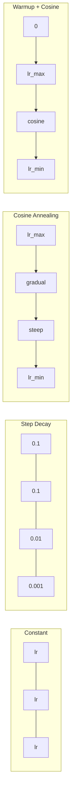
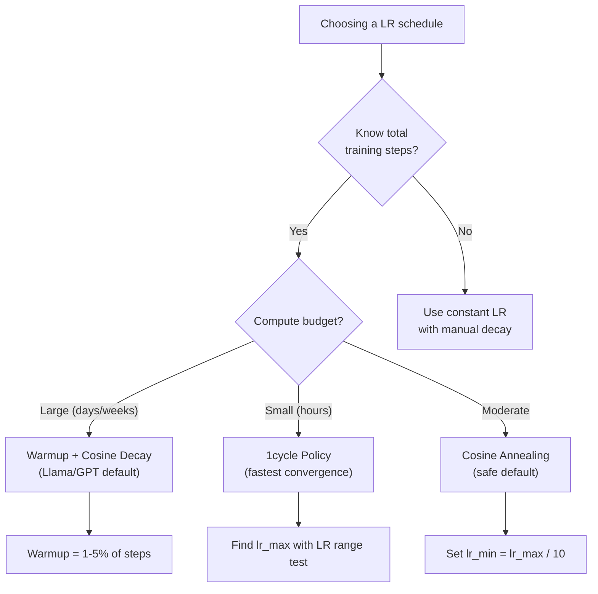
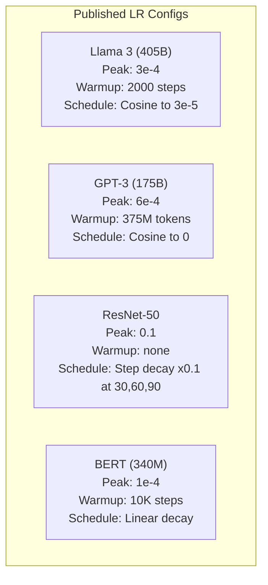

# Learning Rate Lịch trình và khởi động

> learning rate là hyperparameter quan trọng nhất. Không phải kiến trúc. Không phải là kích thước dataset. Không phải chức năng kích hoạt. Các learning rate. Nếu bạn không điều chỉnh gì khác, hãy điều chỉnh điều này.

**Loại:** Xây dựng
**Ngôn ngữ:** Python
**Kiến thức tiên quyết:** Bài 03.06 (Optimizers), Bài 03.08 (Khởi tạo trọng lượng)
**Thời lượng:** ~90 phút

## Mục tiêu học tập

- Thực hiện liên tục, phân rã bước, ủ cosin, khởi động + cosin và lịch trình learning rate 1 chu kỳ từ đầu
- Chứng minh ba chế độ thất bại của lựa chọn learning rate: phân kỳ (quá cao), đình trệ (quá thấp) và dao động (không phân rã)
- Giải thích lý do tại sao khởi động là cần thiết cho optimizers dựa trên Adam và cách nó ổn định sớm training
- So sánh tốc độ hội tụ trên cả năm lịch trình trên cùng một nhiệm vụ và chọn lịch trình thích hợp cho ngân sách training nhất định

## Vấn đề

Đặt learning rate thành 0.1. Training phân kỳ - loss nhảy đến vô cực trong 3 bước. Đặt nó thành 0,0001. Training bò - sau 100 epochs, model hầu như không di chuyển từ ngẫu nhiên. Đặt nó thành 0,01. Training hoạt động trong 50 epochs, thì loss dao động xung quanh mức tối thiểu mà nó không bao giờ có thể đạt được vì các bước quá lớn.

Mức learning rate tối ưu không phải là hằng số. Nó thay đổi trong quá trình training. Ngay từ đầu, bạn muốn có những bậc thang lớn để lấp mặt đất nhanh chóng. Cuối training, bạn muốn các bước nhỏ để ổn định ở mức tối thiểu. Sự khác biệt giữa model chính xác 90% và model chính xác 95% thường chỉ là lịch trình.

Mọi model chính được xuất bản trong ba năm qua đều sử dụng một lịch trình learning rate. Llama 3 sử dụng đỉnh LR = 3E-4 với 2000 bước khởi động và phân rã cosin thành 3E-5. GPT-3 sử dụng LR = 6E-4 với khởi động hơn 375 triệu tokens. Đây không phải là những lựa chọn tùy tiện. Chúng là kết quả của các cuộc càn quét hyperparameter rộng rãi tiêu tốn hàng triệu đô la.

Bạn cần hiểu lịch trình vì mặc định sẽ không phù hợp với vấn đề của bạn. Khi bạn fine-tune một pretrained model, lịch trình phù hợp sẽ khác với training từ đầu. Khi bạn tăng kích thước batch, thời gian khởi động cần thay đổi. Khi training nghỉ ở bước 10.000, bạn cần biết đó là vấn đề lịch trình hay điều gì khác.

## Khái niệm

### Learning Rate liên tục

Cách tiếp cận đơn giản nhất. Chọn một số, sử dụng nó cho mỗi bước.

```
lr(t) = lr_0
```

Hiếm khi tối ưu. Nó quá cao đối với cuối training (dao động xung quanh mức tối thiểu) hoặc quá thấp đối với phần đầu (tính toán lãng phí trên các bước nhỏ). Hoạt động tốt cho các models nhỏ và gỡ lỗi. Một sự lựa chọn khủng khiếp cho bất cứ thứ gì tập luyện trong hơn một giờ.

### Phân rã bước

Cách tiếp cận kiểu cũ từ thời ResNet. Cắt learning rate theo hệ số (thường là 10x) ở epochs cố định.

```
lr(t) = lr_0 * gamma^(floor(epoch / step_size))
```

Trong đó gamma = 0.1 và step_size = 30 có nghĩa là: lr giảm 10 lần sau mỗi 30 epochs. ResNet-50 đã sử dụng điều này -- lr = 0,1, giảm 10 lần ở epochs 30, 60 và 90.

Vấn đề: các điểm phân rã tối ưu phụ thuộc vào dataset và kiến trúc. Chuyển sang một vấn đề khác và bạn cần điều chỉnh lại khi nào nên rơi. Quá trình chuyển đổi đột ngột - loss có thể tăng đột biến khi tỷ giá đột ngột thay đổi.

### Ủ cosine

Phân rã mịn từ learning rate tối đa đến mức tối thiểu, theo đường cong cosin:

```
lr(t) = lr_min + 0.5 * (lr_max - lr_min) * (1 + cos(pi * t / T))
```

Trong đó t là bước hiện tại và T là tổng số bước.

Tại t = 0, số hạng cosin là 1, vì vậy lr = lr_max. Tại t = T, số hạng cosin là -1, vì vậy lr = lr_min. Sự thối rữa lúc đầu nhẹ nhàng, tăng tốc ở giữa và trở nên nhẹ nhàng trở lại ở gần cuối.

Đây là mặc định cho hầu hết các lần chạy training hiện đại. Không có hyperparameters để điều chỉnh ngoài lr_max và lr_min. Hình dạng cosin phù hợp với quan sát thực nghiệm rằng hầu hết việc học xảy ra vào giữa training - bạn muốn có kích thước bước hợp lý trong giai đoạn quan trọng đó.

### Khởi động: Tại sao bạn bắt đầu từ nhỏ

Adam và các optimizers thích ứng khác duy trì ước tính chạy của gradient trung bình và variance. Ở bước 0, các ước tính này được khởi tạo về không. Một vài bản cập nhật gradient đầu tiên dựa trên số liệu thống kê về rác. Nếu learning rate của bạn lớn trong giai đoạn này, model sẽ có những bước đi lớn, định hướng kém.

Khởi động khắc phục điều này. Bắt đầu với một learning rate nhỏ (thường là lr_max / warmup_steps hoặc thậm chí không) và tăng tuyến tính lên đến lr_max trong N bước đầu tiên. Khi bạn đạt đến learning rate đầy đủ, số liệu thống kê của Adam đã ổn định.

```
lr(t) = lr_max * (t / warmup_steps)     for t < warmup_steps
```

Khởi động điển hình: 1-5% tổng số training bước. Llama 3 được huấn luyện trong ~1,8 nghìn tỷ tokens và khởi động cho 2000 bước. GPT-3 đã ấm lên hơn 375 triệu tokens.

### Khởi động tuyến tính + Phân rã Cosin

Mặc định hiện đại. Tăng tuyến tính, sau đó phân rã với cosin:

```
if t < warmup_steps:
    lr(t) = lr_max * (t / warmup_steps)
else:
    progress = (t - warmup_steps) / (total_steps - warmup_steps)
    lr(t) = lr_min + 0.5 * (lr_max - lr_min) * (1 + cos(pi * progress))
```

Đây là những gì Llama, GPT, PaLM và hầu hết các transformers hiện đại sử dụng. Việc khởi động ngăn ngừa sự bất ổn sớm. Sự phân rã cosin lắng xuống mức tối thiểu model.

### 1 chu kỳ Policy

Khám phá của Leslie Smith (2018): tăng learning rate từ giá trị thấp lên giá trị cao trong nửa đầu năm training, sau đó giảm lại trong nửa sau. Phản trực giác - tại sao bạn lại *tăng* learning rate giữa chừng?

Lý thuyết: learning rate cao hoạt động như chính quy hóa bằng cách thêm nhiễu vào quỹ đạo tối ưu hóa. model khám phá thêm cảnh quan loss trong giai đoạn tăng cường, tìm ra các lưu vực tốt hơn. Giai đoạn giảm dốc sau đó tinh chỉnh trong lưu vực tốt nhất được tìm thấy.

```
Phase 1 (0 to T/2):    lr ramps from lr_max/25 to lr_max
Phase 2 (T/2 to T):    lr ramps from lr_max to lr_max/10000
```

1cycle thường huấn luyện nhanh hơn ủ cosine với ngân sách tính toán cố định. Sự đánh đổi: bạn phải biết trước tổng số bước.

### Lên lịch hình dạng



### Sơ đồ quyết định



### Số thực từ Models đã xuất bản



```figure
lr-schedule
```

## Tự xây dựng

### Bước 1: Lên lịch chức năng

Mỗi hàm thực hiện bước hiện tại và trả về learning rate ở bước đó.

```python
import math


def constant_schedule(step, lr=0.01, **kwargs):
    return lr


def step_decay_schedule(step, lr=0.1, step_size=100, gamma=0.1, **kwargs):
    return lr * (gamma ** (step // step_size))


def cosine_schedule(step, lr=0.01, total_steps=1000, lr_min=1e-5, **kwargs):
    if step >= total_steps:
        return lr_min
    return lr_min + 0.5 * (lr - lr_min) * (1 + math.cos(math.pi * step / total_steps))


def warmup_cosine_schedule(step, lr=0.01, total_steps=1000, warmup_steps=100, lr_min=1e-5, **kwargs):
    if total_steps <= warmup_steps:
        return lr * (step / max(warmup_steps, 1))
    if step < warmup_steps:
        return lr * step / warmup_steps
    progress = (step - warmup_steps) / (total_steps - warmup_steps)
    return lr_min + 0.5 * (lr - lr_min) * (1 + math.cos(math.pi * progress))


def one_cycle_schedule(step, lr=0.01, total_steps=1000, **kwargs):
    mid = max(total_steps // 2, 1)
    if step < mid:
        return (lr / 25) + (lr - lr / 25) * step / mid
    else:
        progress = (step - mid) / max(total_steps - mid, 1)
        return lr * (1 - progress) + (lr / 10000) * progress
```

### Bước 2: Trực quan hóa tất cả các lịch trình

In biểu đồ dựa trên văn bản cho thấy mỗi lịch trình phát triển như thế nào qua training.

```python
def visualize_schedule(name, schedule_fn, total_steps=500, **kwargs):
    steps = list(range(0, total_steps, total_steps // 20))
    if total_steps - 1 not in steps:
        steps.append(total_steps - 1)

    lrs = [schedule_fn(s, total_steps=total_steps, **kwargs) for s in steps]
    max_lr = max(lrs) if max(lrs) > 0 else 1.0

    print(f"\n{name}:")
    for s, lr_val in zip(steps, lrs):
        bar_len = int(lr_val / max_lr * 40)
        bar = "#" * bar_len
        print(f"  Step {s:4d}: lr={lr_val:.6f} {bar}")
```

### Bước 3: Training mạng

Một mạng hai lớp đơn giản trên vòng tròn dataset, giống như các bài học trước, nhưng bây giờ chúng tôi thay đổi lịch trình.

```python
import random


def sigmoid(x):
    x = max(-500, min(500, x))
    return 1.0 / (1.0 + math.exp(-x))


def relu(x):
    return max(0.0, x)


def relu_deriv(x):
    return 1.0 if x > 0 else 0.0


def make_circle_data(n=200, seed=42):
    random.seed(seed)
    data = []
    for _ in range(n):
        x = random.uniform(-2, 2)
        y = random.uniform(-2, 2)
        label = 1.0 if x * x + y * y < 1.5 else 0.0
        data.append(([x, y], label))
    return data


def train_with_schedule(schedule_fn, schedule_name, data, epochs=300, base_lr=0.05, **kwargs):
    random.seed(0)
    hidden_size = 8
    total_steps = epochs * len(data)

    std = math.sqrt(2.0 / 2)
    w1 = [[random.gauss(0, std) for _ in range(2)] for _ in range(hidden_size)]
    b1 = [0.0] * hidden_size
    w2 = [random.gauss(0, std) for _ in range(hidden_size)]
    b2 = 0.0

    step = 0
    epoch_losses = []

    for epoch in range(epochs):
        total_loss = 0
        correct = 0

        for x, target in data:
            lr = schedule_fn(step, lr=base_lr, total_steps=total_steps, **kwargs)

            z1 = []
            h = []
            for i in range(hidden_size):
                z = w1[i][0] * x[0] + w1[i][1] * x[1] + b1[i]
                z1.append(z)
                h.append(relu(z))

            z2 = sum(w2[i] * h[i] for i in range(hidden_size)) + b2
            out = sigmoid(z2)

            error = out - target
            d_out = error * out * (1 - out)

            for i in range(hidden_size):
                d_h = d_out * w2[i] * relu_deriv(z1[i])
                w2[i] -= lr * d_out * h[i]
                for j in range(2):
                    w1[i][j] -= lr * d_h * x[j]
                b1[i] -= lr * d_h
            b2 -= lr * d_out

            total_loss += (out - target) ** 2
            if (out >= 0.5) == (target >= 0.5):
                correct += 1
            step += 1

        avg_loss = total_loss / len(data)
        accuracy = correct / len(data) * 100
        epoch_losses.append(avg_loss)

    return epoch_losses
```

### Bước 4: So sánh tất cả các lịch trình

Huấn luyện cùng một mạng với mỗi lịch trình và so sánh loss cuối cùng và hành vi hội tụ.

```python
def compare_schedules(data):
    configs = [
        ("Constant", constant_schedule, {}),
        ("Step Decay", step_decay_schedule, {"step_size": 15000, "gamma": 0.1}),
        ("Cosine", cosine_schedule, {"lr_min": 1e-5}),
        ("Warmup+Cosine", warmup_cosine_schedule, {"warmup_steps": 3000, "lr_min": 1e-5}),
        ("1cycle", one_cycle_schedule, {}),
    ]

    print(f"\n{'Schedule':<20} {'Start Loss':>12} {'Mid Loss':>12} {'End Loss':>12} {'Best Loss':>12}")
    print("-" * 70)

    for name, schedule_fn, extra_kwargs in configs:
        losses = train_with_schedule(schedule_fn, name, data, epochs=300, base_lr=0.05, **extra_kwargs)
        mid_idx = len(losses) // 2
        best = min(losses)
        print(f"{name:<20} {losses[0]:>12.6f} {losses[mid_idx]:>12.6f} {losses[-1]:>12.6f} {best:>12.6f}")
```

### Bước 5: LR quá cao và quá thấp

Thể hiện ba chế độ lỗi: quá cao (phân kỳ), quá thấp (thu thập dữ liệu) và vừa phải.

```python
def lr_sensitivity(data):
    learning_rates = [1.0, 0.1, 0.01, 0.001, 0.0001]

    print("\nLR Sensitivity (constant schedule, 100 epochs):")
    print(f"  {'LR':>10} {'Start Loss':>12} {'End Loss':>12} {'Status':>15}")
    print("  " + "-" * 52)

    for lr in learning_rates:
        losses = train_with_schedule(constant_schedule, f"lr={lr}", data, epochs=100, base_lr=lr)
        start = losses[0]
        end = losses[-1]

        if end > start or math.isnan(end) or end > 1.0:
            status = "DIVERGED"
        elif end > start * 0.9:
            status = "BARELY MOVED"
        elif end < 0.15:
            status = "CONVERGED"
        else:
            status = "LEARNING"

        end_str = f"{end:.6f}" if not math.isnan(end) else "NaN"
        print(f"  {lr:>10.4f} {start:>12.6f} {end_str:>12} {status:>15}")
```

## Ứng dụng

PyTorch cung cấp các bộ lập lịch trong `torch.optim.lr_scheduler`:

```python
import torch
import torch.optim as optim
from torch.optim.lr_scheduler import CosineAnnealingLR, OneCycleLR, StepLR

model = nn.Sequential(nn.Linear(10, 64), nn.ReLU(), nn.Linear(64, 1))
optimizer = optim.Adam(model.parameters(), lr=3e-4)

scheduler = CosineAnnealingLR(optimizer, T_max=1000, eta_min=1e-5)

for step in range(1000):
    loss = train_step(model, optimizer)
    scheduler.step()
```

Đối với khởi động + cosine, hãy sử dụng bộ lập lịch lambda hoặc `get_cosine_schedule_with_warmup` từ HuggingFace:

```python
from transformers import get_cosine_schedule_with_warmup

scheduler = get_cosine_schedule_with_warmup(
    optimizer,
    num_warmup_steps=2000,
    num_training_steps=100000,
)
```

Chức năng HuggingFace là thứ mà hầu hết Llama và GPT fine-tuning scripts sử dụng. Khi nghi ngờ, hãy sử dụng khởi động + cosine với khởi động = 3-5% tổng số bước. Nó hoạt động cho hầu hết mọi thứ.

## Sản phẩm bàn giao

Bài học này tạo ra:
- `outputs/prompt-lr-schedule-advisor.md` -- một prompt đề xuất lịch trình và hyperparameters learning rate phù hợp cho thiết lập training của bạn

## Bài tập

1. Thực hiện phân rã theo cấp số nhân: lr (t) = lr_0 * gamma ^ t trong đó gamma = 0.999. So sánh với ủ cosin trên vòng tròn dataset.

2. Thực hiện kiểm tra phạm vi learning rate (Leslie Smith): luyện tập vài trăm bước trong khi tăng LR theo cấp số nhân từ 1e-7 lên 1. Cốt truyện loss vs LR. LR tối đa tối ưu là ngay trước khi loss bắt đầu tăng.

3. Tập với khởi động + cosine nhưng thay đổi độ dài khởi động: 0%, 1%, 5%, 10%, 20% tổng số bước. Tìm điểm ngọt ngào nơi training ổn định nhất.

4. Thực hiện ủ cosin với khởi động lại ấm (SGDR): đặt lại learning rate để lr_max mỗi bước T và phân rã trở lại. So sánh với cosin tiêu chuẩn trên training dài hơn.

5. Xây dựng một "bác sĩ phẫu thuật theo lịch trình" theo dõi training loss và tự động chuyển từ khởi động sang cosine khi loss ổn định và giảm lr nếu loss ổn định quá lâu.

## Thuật ngữ chính

| Thuật ngữ | Những gì mọi người nói | Ý nghĩa thực sự của nó |
|------|----------------|----------------------|
| Learning rate | "model học nhanh như thế nào" | Vô hướng nhân gradient để xác định kích thước cập nhật parameter |
| Lịch trình | "Thay đổi LR theo thời gian" | Một hàm ánh xạ training bước đến learning rate, được thiết kế để tối ưu hóa sự hội tụ |
| Khởi động | "Bắt đầu với một chiếc LR nhỏ" | Tăng tuyến tính LR từ gần bằng không đến giá trị mục tiêu trong N bước đầu tiên để ổn định số liệu thống kê optimizer |
| Ủ cosine | "Phân rã LR mượt mà" | Giảm LR theo đường cong cosin từ lr_max xuống lr_min trên training |
| Phân rã bước | "Thả LR tại các cột mốc" | Nhân LR với một hệ số (thường là 0,1) ở các khoảng epoch cố định |
| 1 chu kỳ policy | "Lên rồi xuống" | Phương pháp tăng LR lên rồi xuống trong một chu kỳ duy nhất của Leslie Smith để hội tụ nhanh hơn |
| Kiểm tra phạm vi LR | "Tìm learning rate tốt nhất" | Training ngắn gọn trong khi tăng LR để tìm giá trị nơi loss bắt đầu phân kỳ |
| Cosine với khởi động lại ấm áp | "Đặt lại và lặp lại" | Định kỳ đặt lại LR về lr_max và phân rã trở lại (SGDR) |
| Eta min | "Sàn cho LR" | learning rate tối thiểu mà lịch trình giảm xuống |
| Đỉnh learning rate | "LR tối đa" | LR cao nhất đạt được trong training, thường là sau khi khởi động |

## Đọc thêm

- Loshchilov & Hutter, "SGDR: Stochastic Gradient Descent với Warm Restarts" (2017) - giới thiệu ủ cosine và khởi động lại ấm
- Smith, "Siêu hội tụ: Training rất nhanh của mạng nơ-ron sử dụng tốc độ học tập lớn" (2018) - bài báo 1cycle policy
- Touvron và cộng sự, "Llama 2: Open Foundation và Fine-Tuned Chat Models" (2023) -- ghi lại lịch trình khởi động + cosin được sử dụng trên quy mô lớn
- Goyal và cộng sự, "SGD Minibatch lớn, chính xác: Training ImageNet trong 1 giờ" (2017) -- quy tắc chia tỷ lệ tuyến tính và khởi động cho batch training lớn
