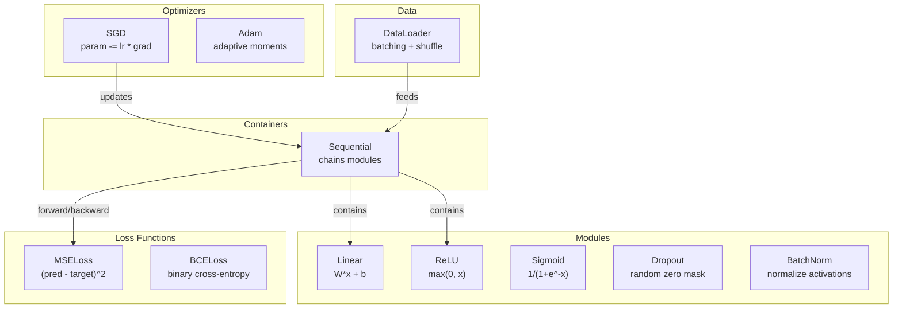
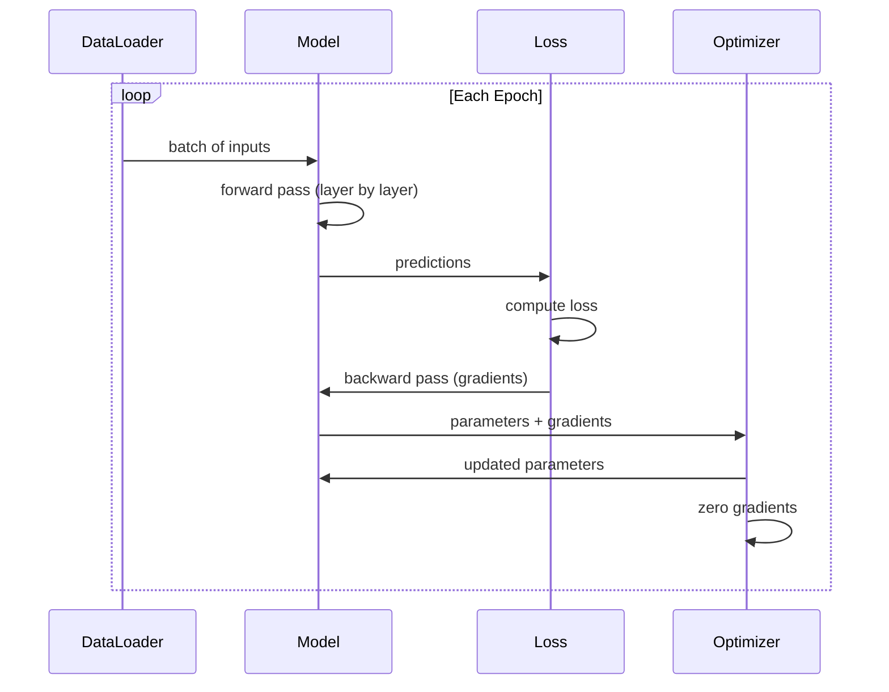
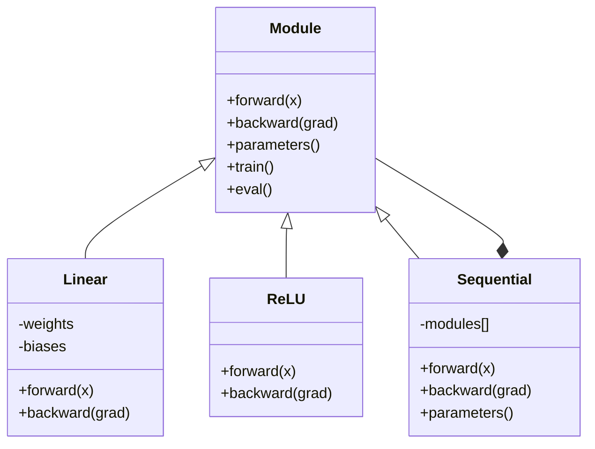

# Xây dựng Mini Framework của riêng bạn

> Bạn đã xây dựng các tế bào thần kinh, lớp, mạng, backprop, kích hoạt, chức năng loss, optimizers, chính quy hóa, khởi tạo và lịch trình LR. Tất cả dưới dạng các mảnh riêng biệt. Bây giờ nối chúng lại với nhau thành một framework. Không PyTorch. Không phải TensorFlow. Của bạn.

**Loại:** Xây dựng
**Ngôn ngữ:** Python
**Kiến thức tiên quyết:** Tất cả Giai đoạn 03 (Bài 01-09)
**Thời lượng:** ~120 phút

## Mục tiêu học tập

- Xây dựng một framework deep learning hoàn chỉnh (~500 dòng) với Module, Linear, ReLU, Sigmoid, Dropout, BatchNorm, Sequential, loss function, optimizers và DataLoader
- Giải thích trừu tượng hóa Mô-đun (tiến, lùi, parameters) và lý do tại sao cần chuyển đổi chế độ train/eval
- Nối tất cả các thành phần vào một vòng lặp training làm việc để huấn luyện mạng 4 lớp về phân loại vòng tròn
- Ánh xạ từng thành phần của framework của bạn với tương đương PyTorch của nó (nn. Mô-đun, nn. Tuần tự, tối ưu. Adam, DataLoader)

## Vấn đề

Bạn có mười bài học về các khối xây dựng nằm rải rác trên các tệp riêng biệt. Một `Value` class ở đây, một vòng lặp training ở đó, khởi tạo trọng lượng trong một tệp khác learning rate lịch trình trong một tệp khác. Để huấn luyện một mạng, bạn sao chép-dán từ năm bài học khác nhau và kết nối chúng lại với nhau bằng tay.

Đó là những gì frameworks giải quyết. PyTorch cung cấp cho bạn `nn.Module`, `nn.Sequential`, `optim.Adam`, `DataLoader` và một mẫu vòng lặp training liên kết chúng với nhau. TensorFlow cung cấp cho bạn `keras.Layer`, `keras.Sequential` `keras.optimizers.Adam`. Đây không phải là phép thuật. Chúng là các mô hình tổ chức giúp xác định, huấn luyện và đánh giá mạng mà không cần phát minh lại hệ thống ống nước mọi lúc.

Bạn sẽ xây dựng cùng một thứ trong ~500 dòng Python. Không numpy. Không phụ thuộc bên ngoài. Một framework có thể xác định bất kỳ mạng feedforward nào, huấn luyện nó với SGD hoặc Adam, batch dữ liệu, áp dụng dropout và chuẩn hóa batch, sử dụng bất kỳ kích hoạt nào và lên lịch learning rate.

Khi bạn hoàn thành, bạn sẽ hiểu chính xác điều gì sẽ xảy ra khi bạn viết `model = nn.Sequential(...)` vào PyTorch. Bạn sẽ hiểu tại sao `model.train()` và `model.eval()` tồn tại. Bạn sẽ hiểu tại sao `optimizer.zero_grad()` là một cuộc gọi riêng biệt. Bạn sẽ hiểu tất cả, bởi vì bạn đã xây dựng tất cả.

## Khái niệm

### Mô-đun trừu tượng hóa

Mỗi lớp trong PyTorch đều kế thừa từ `nn.Module`. Một mô-đun có ba trách nhiệm:

1. **forward()** -- tính toán đầu ra của các đầu vào đã cho
2. **parameters()** -- trả về tất cả các trọng lượng có thể huấn luyện
3. **backward()** -- gradients tính toán (được xử lý bởi Autograd trong PyTorch, rõ ràng trong của chúng tôi)

Một lớp tuyến tính là một Mô-đun. Kích hoạt ReLU là Mô-đun. Lớp dropout là Mô-đun. Một lớp chuẩn hóa batch là một Mô-đun. Tất cả chúng đều có giao diện giống nhau.

### Container tuần tự

`nn.Sequential` chuỗi Mô-đun. Forward pass: cung cấp dữ liệu qua Mô-đun 1, sau đó là Mô-đun 2, sau đó là Mô-đun 3. Backward pass: đảo ngược chuỗi. Bản thân container là một Module - nó có forward(), parameters() và backward(). Đây là mẫu tổng hợp: một chuỗi các Mô-đun tự nó là một Mô-đun.

### Training so với chế độ đánh giá

Dropout ngẫu nhiên không các tế bào thần kinh trong quá trình training nhưng chuyển mọi thứ qua trong quá trình đánh giá. Chuẩn hóa Batch sử dụng batch thống kê trong training nhưng chạy trung bình trong quá trình đánh giá. Phương thức `train()` và `eval()` chuyển đổi hành vi này. Mỗi Mô-đun đều có một cờ `training`.

### Optimizer

Các bản cập nhật optimizer parameters sử dụng gradients của họ. SGD: `param -= lr * grad`. Adam: duy trì động lượng và variance ước tính, sau đó cập nhật. optimizer không biết về kiến trúc mạng - nó chỉ thấy một danh sách phẳng các parameters và gradients của chúng.

### DataLoader

Vấn đề hàng loạt vì hai lý do. Đầu tiên, bạn không thể đưa toàn bộ dataset vào bộ nhớ cho các vấn đề lớn. Thứ hai, batch gradient descent mini cung cấp nhiễu giúp thoát khỏi mức tối thiểu cục bộ. DataLoader chia dữ liệu thành batches và tùy chọn xáo trộn giữa các epochs.

### Framework Kiến trúc



### Vòng lặp Training



### Hệ thống phân cấp mô-đun



```figure
gradient-clipping
```

## Tự xây dựng

### Bước 1: Cơ sở mô-đun Class

Giao diện trừu tượng mà mọi layer triển khai.

```python
class Module:
    def __init__(self):
        self.training = True

    def forward(self, x):
        raise NotImplementedError

    def backward(self, grad):
        raise NotImplementedError

    def parameters(self):
        return []

    def train(self):
        self.training = True

    def eval(self):
        self.training = False
```

### Bước 2: Lớp tuyến tính

Khối xây dựng cơ bản. Lưu trữ trọng số và sai lệch, tính Wx + b về phía trước và weight/input gradients lùi.

```python
import math
import random


class Linear(Module):
    def __init__(self, fan_in, fan_out):
        super().__init__()
        std = math.sqrt(2.0 / fan_in)
        self.weights = [[random.gauss(0, std) for _ in range(fan_in)] for _ in range(fan_out)]
        self.biases = [0.0] * fan_out
        self.weight_grads = [[0.0] * fan_in for _ in range(fan_out)]
        self.bias_grads = [0.0] * fan_out
        self.fan_in = fan_in
        self.fan_out = fan_out
        self.input = None

    def forward(self, x):
        self.input = x
        output = []
        for i in range(self.fan_out):
            val = self.biases[i]
            for j in range(self.fan_in):
                val += self.weights[i][j] * x[j]
            output.append(val)
        return output

    def backward(self, grad):
        input_grad = [0.0] * self.fan_in
        for i in range(self.fan_out):
            self.bias_grads[i] += grad[i]
            for j in range(self.fan_in):
                self.weight_grads[i][j] += grad[i] * self.input[j]
                input_grad[j] += grad[i] * self.weights[i][j]
        return input_grad

    def parameters(self):
        params = []
        for i in range(self.fan_out):
            for j in range(self.fan_in):
                params.append((self.weights, i, j, self.weight_grads))
            params.append((self.biases, i, None, self.bias_grads))
        return params
```

### Bước 3: Mô-đun kích hoạt

ReLU, sigmoid và Tanh làm mô-đun. Mỗi bộ nhớ đệm những gì nó cần cho backward pass.

```python
class ReLU(Module):
    def __init__(self):
        super().__init__()
        self.mask = None

    def forward(self, x):
        self.mask = [1.0 if v > 0 else 0.0 for v in x]
        return [max(0.0, v) for v in x]

    def backward(self, grad):
        return [g * m for g, m in zip(grad, self.mask)]


class Sigmoid(Module):
    def __init__(self):
        super().__init__()
        self.output = None

    def forward(self, x):
        self.output = []
        for v in x:
            v = max(-500, min(500, v))
            self.output.append(1.0 / (1.0 + math.exp(-v)))
        return self.output

    def backward(self, grad):
        return [g * o * (1 - o) for g, o in zip(grad, self.output)]


class Tanh(Module):
    def __init__(self):
        super().__init__()
        self.output = None

    def forward(self, x):
        self.output = [math.tanh(v) for v in x]
        return self.output

    def backward(self, grad):
        return [g * (1 - o * o) for g, o in zip(grad, self.output)]
```

### Bước 4: Mô-đun Dropout

Ngẫu nhiên số không các phần tử trong quá trình training. Chia tỷ lệ các phần tử còn lại theo 1/(1-p) để các giá trị kỳ vọng giữ nguyên. Không làm gì trong quá trình đánh giá.

```python
class Dropout(Module):
    def __init__(self, p=0.5):
        super().__init__()
        self.p = p
        self.mask = None

    def forward(self, x):
        if not self.training:
            return x
        self.mask = [0.0 if random.random() < self.p else 1.0 / (1 - self.p) for _ in x]
        return [v * m for v, m in zip(x, self.mask)]

    def backward(self, grad):
        if self.mask is None:
            return grad
        return [g * m for g, m in zip(grad, self.mask)]
```

### Bước 5: BatchNorm mô-đun

Chuẩn hóa các kích hoạt về trung bình bằng không và đơn vị variance trên feature trên batch. Duy trì số liệu thống kê đang chạy cho chế độ đánh giá.

```python
class BatchNorm(Module):
    def __init__(self, size, momentum=0.1, eps=1e-5):
        super().__init__()
        self.size = size
        self.gamma = [1.0] * size
        self.beta = [0.0] * size
        self.gamma_grads = [0.0] * size
        self.beta_grads = [0.0] * size
        self.running_mean = [0.0] * size
        self.running_var = [1.0] * size
        self.momentum = momentum
        self.eps = eps
        self.x_norm = None
        self.std_inv = None
        self.batch_input = None

    def forward_batch(self, batch):
        batch_size = len(batch)
        output_batch = []

        if self.training:
            mean = [0.0] * self.size
            for sample in batch:
                for j in range(self.size):
                    mean[j] += sample[j]
            mean = [m / batch_size for m in mean]

            var = [0.0] * self.size
            for sample in batch:
                for j in range(self.size):
                    var[j] += (sample[j] - mean[j]) ** 2
            var = [v / batch_size for v in var]

            self.std_inv = [1.0 / math.sqrt(v + self.eps) for v in var]

            self.x_norm = []
            self.batch_input = batch
            for sample in batch:
                normed = [(sample[j] - mean[j]) * self.std_inv[j] for j in range(self.size)]
                self.x_norm.append(normed)
                output = [self.gamma[j] * normed[j] + self.beta[j] for j in range(self.size)]
                output_batch.append(output)

            for j in range(self.size):
                self.running_mean[j] = (1 - self.momentum) * self.running_mean[j] + self.momentum * mean[j]
                self.running_var[j] = (1 - self.momentum) * self.running_var[j] + self.momentum * var[j]
        else:
            std_inv = [1.0 / math.sqrt(v + self.eps) for v in self.running_var]
            for sample in batch:
                normed = [(sample[j] - self.running_mean[j]) * std_inv[j] for j in range(self.size)]
                output = [self.gamma[j] * normed[j] + self.beta[j] for j in range(self.size)]
                output_batch.append(output)

        return output_batch

    def forward(self, x):
        result = self.forward_batch([x])
        return result[0]

    def backward(self, grad):
        if self.x_norm is None:
            return grad
        for j in range(self.size):
            self.gamma_grads[j] += self.x_norm[0][j] * grad[j]
            self.beta_grads[j] += grad[j]
        return [grad[j] * self.gamma[j] * self.std_inv[j] for j in range(self.size)]

    def parameters(self):
        params = []
        for j in range(self.size):
            params.append((self.gamma, j, None, self.gamma_grads))
            params.append((self.beta, j, None, self.beta_grads))
        return params
```

### Bước 6: Container tuần tự

Mô-đun chuỗi. Tiến đi từ trái sang phải, lùi đi từ phải sang trái.

```python
class Sequential(Module):
    def __init__(self, *modules):
        super().__init__()
        self.modules = list(modules)

    def forward(self, x):
        for module in self.modules:
            x = module.forward(x)
        return x

    def backward(self, grad):
        for module in reversed(self.modules):
            grad = module.backward(grad)
        return grad

    def parameters(self):
        params = []
        for module in self.modules:
            params.extend(module.parameters())
        return params

    def train(self):
        self.training = True
        for module in self.modules:
            module.train()

    def eval(self):
        self.training = False
        for module in self.modules:
            module.eval()
```

### Bước 7: Loss chức năng

MSE và Entropy chéo nhị phân. Mỗi giá trị trả về giá trị loss và cung cấp một backward() trả về gradient.

```python
class MSELoss:
    def __call__(self, predicted, target):
        self.predicted = predicted
        self.target = target
        n = len(predicted)
        self.loss = sum((p - t) ** 2 for p, t in zip(predicted, target)) / n
        return self.loss

    def backward(self):
        n = len(self.predicted)
        return [2 * (p - t) / n for p, t in zip(self.predicted, self.target)]


class BCELoss:
    def __call__(self, predicted, target):
        self.predicted = predicted
        self.target = target
        eps = 1e-7
        n = len(predicted)
        self.loss = 0
        for p, t in zip(predicted, target):
            p = max(eps, min(1 - eps, p))
            self.loss += -(t * math.log(p) + (1 - t) * math.log(1 - p))
        self.loss /= n
        return self.loss

    def backward(self):
        eps = 1e-7
        n = len(self.predicted)
        grads = []
        for p, t in zip(self.predicted, self.target):
            p = max(eps, min(1 - eps, p))
            grads.append((-t / p + (1 - t) / (1 - p)) / n)
        return grads
```

### Bước 8: SGD và Adam Optimizers

Cả hai đều lập danh sách parameter và cập nhật trọng số bằng gradients.

```python
class SGD:
    def __init__(self, parameters, lr=0.01):
        self.params = parameters
        self.lr = lr

    def step(self):
        for container, i, j, grad_container in self.params:
            if j is not None:
                container[i][j] -= self.lr * grad_container[i][j]
            else:
                container[i] -= self.lr * grad_container[i]

    def zero_grad(self):
        for container, i, j, grad_container in self.params:
            if j is not None:
                grad_container[i][j] = 0.0
            else:
                grad_container[i] = 0.0


class Adam:
    def __init__(self, parameters, lr=0.001, beta1=0.9, beta2=0.999, eps=1e-8):
        self.params = parameters
        self.lr = lr
        self.beta1 = beta1
        self.beta2 = beta2
        self.eps = eps
        self.t = 0
        self.m = [0.0] * len(parameters)
        self.v = [0.0] * len(parameters)

    def step(self):
        self.t += 1
        for idx, (container, i, j, grad_container) in enumerate(self.params):
            if j is not None:
                g = grad_container[i][j]
            else:
                g = grad_container[i]

            self.m[idx] = self.beta1 * self.m[idx] + (1 - self.beta1) * g
            self.v[idx] = self.beta2 * self.v[idx] + (1 - self.beta2) * g * g

            m_hat = self.m[idx] / (1 - self.beta1 ** self.t)
            v_hat = self.v[idx] / (1 - self.beta2 ** self.t)

            update = self.lr * m_hat / (math.sqrt(v_hat) + self.eps)

            if j is not None:
                container[i][j] -= update
            else:
                container[i] -= update

    def zero_grad(self):
        for container, i, j, grad_container in self.params:
            if j is not None:
                grad_container[i][j] = 0.0
            else:
                grad_container[i] = 0.0
```

### Bước 9: DataLoader

Chia dữ liệu thành batches, tùy chọn xáo trộn từng epoch.

```python
class DataLoader:
    def __init__(self, data, batch_size=32, shuffle=True):
        self.data = data
        self.batch_size = batch_size
        self.shuffle = shuffle

    def __iter__(self):
        indices = list(range(len(self.data)))
        if self.shuffle:
            random.shuffle(indices)
        for start in range(0, len(indices), self.batch_size):
            batch_indices = indices[start:start + self.batch_size]
            batch = [self.data[i] for i in batch_indices]
            inputs = [item[0] for item in batch]
            targets = [item[1] for item in batch]
            yield inputs, targets

    def __len__(self):
        return (len(self.data) + self.batch_size - 1) // self.batch_size
```

### Bước 10: Huấn luyện mạng 4 lớp về phân loại vòng tròn

Nối mọi thứ lại với nhau. Xác định một model, chọn một loss, chọn một optimizer, chạy vòng lặp training.

```python
def make_circle_data(n=500, seed=42):
    random.seed(seed)
    data = []
    for _ in range(n):
        x = random.uniform(-2, 2)
        y = random.uniform(-2, 2)
        label = 1.0 if x * x + y * y < 1.5 else 0.0
        data.append(([x, y], [label]))
    return data


def train():
    random.seed(42)

    model = Sequential(
        Linear(2, 16),
        ReLU(),
        Linear(16, 16),
        ReLU(),
        Linear(16, 8),
        ReLU(),
        Linear(8, 1),
        Sigmoid(),
    )

    criterion = BCELoss()
    optimizer = Adam(model.parameters(), lr=0.01)

    data = make_circle_data(500)
    split = int(len(data) * 0.8)
    train_data = data[:split]
    test_data = data[split:]

    loader = DataLoader(train_data, batch_size=16, shuffle=True)

    model.train()

    for epoch in range(100):
        total_loss = 0
        total_correct = 0
        total_samples = 0

        for batch_inputs, batch_targets in loader:
            batch_loss = 0
            for x, t in zip(batch_inputs, batch_targets):
                pred = model.forward(x)
                loss = criterion(pred, t)
                batch_loss += loss

                optimizer.zero_grad()
                grad = criterion.backward()
                model.backward(grad)
                optimizer.step()

                predicted_class = 1.0 if pred[0] >= 0.5 else 0.0
                if predicted_class == t[0]:
                    total_correct += 1
                total_samples += 1

            total_loss += batch_loss

        avg_loss = total_loss / total_samples
        accuracy = total_correct / total_samples * 100

        if epoch % 10 == 0 or epoch == 99:
            print(f"Epoch {epoch:3d} | Loss: {avg_loss:.6f} | Train Accuracy: {accuracy:.1f}%")

    model.eval()
    correct = 0
    for x, t in test_data:
        pred = model.forward(x)
        predicted_class = 1.0 if pred[0] >= 0.5 else 0.0
        if predicted_class == t[0]:
            correct += 1
    test_accuracy = correct / len(test_data) * 100
    print(f"\nTest Accuracy: {test_accuracy:.1f}% ({correct}/{len(test_data)})")

    return model, test_accuracy
```

## Ứng dụng

Đây là PyTorch tương đương với những gì bạn vừa xây dựng:

```python
import torch
import torch.nn as nn
from torch.utils.data import DataLoader, TensorDataset

model = nn.Sequential(
    nn.Linear(2, 16),
    nn.ReLU(),
    nn.Linear(16, 16),
    nn.ReLU(),
    nn.Linear(16, 8),
    nn.ReLU(),
    nn.Linear(8, 1),
    nn.Sigmoid(),
)

criterion = nn.BCELoss()
optimizer = torch.optim.Adam(model.parameters(), lr=0.01)

for epoch in range(100):
    model.train()
    for inputs, targets in dataloader:
        optimizer.zero_grad()
        predictions = model(inputs)
        loss = criterion(predictions, targets)
        loss.backward()
        optimizer.step()

    model.eval()
    with torch.no_grad():
        test_predictions = model(test_inputs)
```

Cấu trúc giống hệt nhau. `Sequential`, `Linear`, `ReLU`, `Sigmoid`, `BCELoss`, `Adam`, `zero_grad`, `backward`, `step`, `train`, `eval`. Mọi khái niệm đều lập bản đồ một-một. Sự khác biệt là PyTorch xử lý autograd tự động (không cần triển khai backward() trong mỗi mô-đun), chạy trên GPU và đã được tối ưu hóa trong nhiều năm. Nhưng xương giống nhau.

Bây giờ khi bạn nhìn thấy mã PyTorch, bạn biết chính xác những gì đang xảy ra ở mỗi dòng. Sự hiểu biết đó là toàn bộ vấn đề.

## Sản phẩm bàn giao

Bài học này tạo ra:
- `outputs/prompt-framework-architect.md` -- một prompt để thiết kế kiến trúc mạng nơ-ron bằng cách sử dụng framework trừu tượng

## Bài tập

1. Thêm `SoftmaxCrossEntropyLoss` class để phân loại nhiều class. Softmax các dự đoán, tính toán các loss entropy chéo và xử lý backward pass kết hợp. Kiểm tra nó trên một dataset xoắn ốc 3 class.

2. Thực hiện lập lịch learning rate trong optimizer: thêm phương pháp `set_lr()` và nối vào lịch trình cosin từ Bài 09. Huấn luyện bộ phân loại vòng tròn với khởi động + cosin và so sánh với LR không đổi.

3. Thêm phương thức `save()` và `load()` vào Sequential để tuần tự hóa tất cả trọng số vào tệp JSON và tải chúng trở lại. Xác minh rằng model đã tải tạo ra các dự đoán giống như bản gốc.

4. Thực hiện phân rã trọng lượng (chính quy hóa L2) trong Adam optimizer. Thêm một `weight_decay` parameter thu nhỏ trọng lượng về không mỗi bước. So sánh training với phân rã = 0 so với phân rã = 0,01.

5. Thay thế mỗi sample vòng lặp training bằng sự tích lũy batch gradient nhỏ thích hợp: tích lũy gradients trên tất cả các samples trong một batch, sau đó chia cho kích thước batch và thực hiện một bước optimizer. Đo lường xem điều này có làm thay đổi tốc độ hội tụ hay không.

## Thuật ngữ chính

| Thuật ngữ | Những gì mọi người nói | Ý nghĩa thực sự của nó |
|------|----------------|----------------------|
| Mô-đun | "Một lớp" | Trừu tượng cơ sở trong một framework -- bất cứ thứ gì có forward(), backward() và parameters() |
| Tuần tự | "Stack các lớp theo thứ tự" | Một container chuỗi các mô-đun, áp dụng chúng theo trình tự để tiến và lùi để lùi |
| Forward pass | "Chạy mạng" | Tính toán đầu ra bằng cách truyền đầu vào qua từng mô-đun theo thứ tự |
| Backward pass | "Tính toán gradients" | Lan truyền loss gradient qua từng mô-đun ngược lại để tính toán parameter gradients |
| Parameters | "Trọng lượng có thể huấn luyện" | Tất cả các giá trị trong mạng mà optimizer có thể cập nhật -- trọng số và sai lệch |
| Optimizer | "Thứ cập nhật trọng lượng" | Thuật toán sử dụng gradients để cập nhật parameters, triển khai SGD, Adam hoặc các quy tắc khác |
| DataLoader | "Thứ cung cấp dữ liệu" | Một trình lặp chia một dataset thành batches, tùy chọn xáo trộn giữa các epochs |
| Chế độ Training | "model.train()" | Một cờ cho phép hành vi ngẫu nhiên như chuẩn hóa dropout và batch với số liệu thống kê batch |
| Chế độ đánh giá | "model.eval()" | Cờ vô hiệu hóa dropout và sử dụng số liệu thống kê đang chạy để chuẩn hóa batch |
| Không tốt nghiệp | "Dọn dẹp gradients" | Đặt lại tất cả parameter gradients về không trước khi tính toán gradients của batch tiếp theo |

## Đọc thêm

- Paszke et al., "PyTorch: An Imperative Style, High-Performance Deep Learning Library" (2019) - bài báo mô tả các quyết định thiết kế của PyTorch
- Chollet, "Deep Learning with Python, Second Edition" (2021) - Chương 3 bao gồm nội bộ Keras với cùng một module/layer trừu tượng
- Johnson, "Tiny-DNN" (https://github.com/tiny-dnn/tiny-dnn) -- một framework học sâu C++ chỉ có tiêu đề để hiểu nội bộ framework
