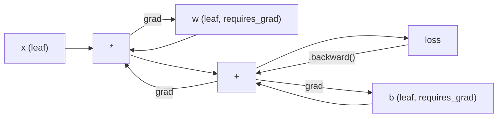
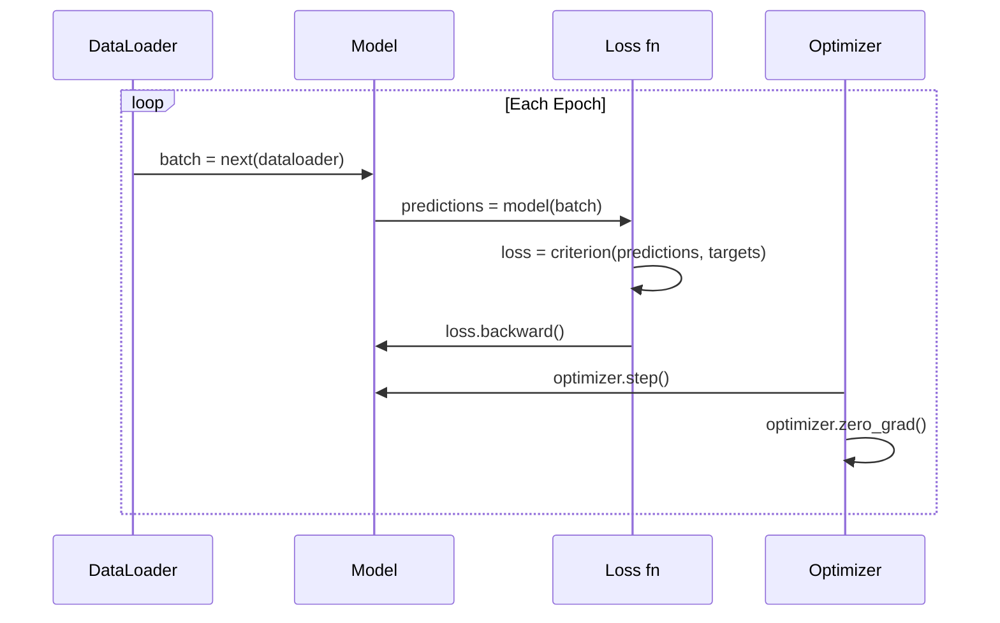

# Giới thiệu về PyTorch

> Bạn đã chế tạo động cơ từ piston và trục khuỷu. Bây giờ hãy tìm hiểu cái mà mọi người thực sự lái xe.

**Loại:** Xây dựng
**Ngôn ngữ:** Python
**Kiến thức tiên quyết:** Bài 03.10 (Xây dựng Mini Framework của riêng bạn)
**Thời lượng:** ~75 phút

## Mục tiêu học tập

- Xây dựng và huấn luyện mạng nơ-ron bằng cách sử dụng nn của PyTorch. Mô-đun, nn. Tuần tự và tự động
- Sử dụng PyTorch tensors, GPU gia tốc và vòng lặp training tiêu chuẩn (zero_grad, tiến, loss, lùi, bước)
- Chuyển đổi các thành phần framework mini từ đầu của bạn sang các thành phần tương đương PyTorch của chúng
- Lập hồ sơ và so sánh tốc độ training giữa Python framework thuần túy và PyTorch của bạn trên cùng một nhiệm vụ

## Vấn đề

Bạn có một framework mini đang hoạt động. Các lớp tuyến tính, ReLU, dropout, batch chuẩn, Adam, một DataLoader, một vòng lặp training. Nó huấn luyện một mạng 4 lớp về bài toán phân loại vòng tròn trong Python thuần túy.

Nó cũng chậm hơn 500 lần so với PyTorch trong cùng một vấn đề.

Mini framework processes của bạn từng mẫu một với các vòng lặp Python lồng nhau. PyTorch gửi các hoạt động tương tự đến các hạt nhân C++/CUDA được tối ưu hóa chạy trên GPU. Trên một NVIDIA A100, PyTorch huấn luyện ResNet-50 (25,6 triệu parameters) trên ImageNet (1,28 triệu hình ảnh) trong khoảng 6 giờ. framework của bạn sẽ mất khoảng 3.000 giờ cho cùng một nhiệm vụ - nếu nó không hết bộ nhớ trước.

Tốc độ không phải là khoảng cách duy nhất. framework của bạn không có hỗ trợ GPU. Không có sự khác biệt tự động -- bạn viết tay backward() cho mọi mô-đun. Không có số sê-ri. Không có training phân tán. Không mixed precision. Không có cách nào để gỡ lỗi quy trình gradient mà không có câu lệnh in.

PyTorch lấp đầy mọi khoảng trống này. Và nó làm như vậy trong khi vẫn giữ nguyên model tinh thần mà bạn đã xây dựng: Module, forward(), parameters(), backward(), optimizer.step(). Các khái niệm chuyển giao một-một. Cú pháp gần như giống hệt nhau. Sự khác biệt là PyTorch bao bọc một thập kỷ kỹ thuật hệ thống đằng sau cùng một giao diện mà bạn đã thiết kế từ đầu.

## Khái niệm

### Tại sao PyTorch thắng

Vào năm 2015, TensorFlow yêu cầu bạn xác định biểu đồ tính toán tĩnh trước khi chạy bất cứ thứ gì. Bạn đã xây dựng biểu đồ, biên dịch nó, sau đó cung cấp dữ liệu thông qua nó. Gỡ lỗi có nghĩa là nhìn chằm chằm vào trực quan hóa đồ thị. Thay đổi kiến trúc có nghĩa là xây dựng lại biểu đồ từ đầu.

PyTorch ra mắt vào năm 2017 với một triết lý khác: thực hiện háo hức. Bạn viết Python. Nó chạy ngay lập tức. `y = model(x)` thực sự tính y ngay bây giờ, không phải "thêm một nút vào biểu đồ sẽ tính y sau này". Điều này có nghĩa là các công cụ gỡ lỗi Python tiêu chuẩn hoạt động. print() đã hoạt động. PDB đã hoạt động. if/else trong forward pass của bạn đã hoạt động.

Đến năm 2020, thị trường đã lên tiếng. Thị phần của PyTorch trong các bài báo nghiên cứu ML đã tăng từ 7% (2017) lên hơn 75% (2022). Meta, Google DeepMind, OpenAI, Anthropic và Hugging Face đều sử dụng PyTorch làm framework chính của họ. TensorFlow 2.x đã áp dụng cách thực hiện háo hức để đáp lại - ngầm thừa nhận rằng thiết kế của PyTorch là chính xác.

Bài học: các hợp chất trải nghiệm của nhà phát triển. Một framework chậm hơn 10% nhưng nhanh hơn 50% để gỡ lỗi sẽ chiến thắng mọi lúc.

### Tensors

tensor là một mảng đa chiều với ba thuộc tính quan trọng: hình dạng, dtype và thiết bị.

```python
import torch

x = torch.zeros(3, 4)           # shape: (3, 4), dtype: float32, device: cpu
x = torch.randn(2, 3, 224, 224) # batch of 2 RGB images, 224x224
x = torch.tensor([1, 2, 3])     # from a Python list
```

**Hình dạng** là kích thước. Một vô hướng là hình dạng (), một vector là (n,), một ma trận là (m, n), một batch hình ảnh là (batch, kênh, chiều cao, chiều rộng).

**Dtype** điều khiển precision và bộ nhớ.

| dtype | Bit | Phạm vi | Trường hợp sử dụng |
|-------|------|-------|----------|
| Phao 32 | 32 | ~7 chữ số thập phân | training mặc định |
| Phao 16 | 16 | ~3,3 chữ số thập phân | Mixed precision |
| bfloat16 | 16 | Phạm vi tương tự như float32, ít precision hơn | LLM training |
| INT8 | 8 | -128 đến 127 | inference lượng tử hóa |

**Thiết bị** xác định nơi diễn ra tính toán.

```python
device = torch.device("cuda" if torch.cuda.is_available() else "cpu")
x = torch.randn(3, 4, device=device)
x = x.to("cuda")
x = x.cpu()
```

Mọi thao tác đều yêu cầu tất cả tensors trên cùng một thiết bị. Đây là lỗi # 1 PyTorch mà người mới bắt đầu gặp phải: `RuntimeError: Expected all tensors to be on the same device`. Khắc phục nó bằng cách di chuyển mọi thứ sang cùng một thiết bị trước khi tính toán.

**Reshaping** là thời gian không đổi - nó thay đổi siêu dữ liệu, không phải dữ liệu.

```python
x = torch.randn(2, 3, 4)
x.view(2, 12)      # reshape to (2, 12) -- must be contiguous
x.reshape(6, 4)    # reshape to (6, 4) -- works always
x.permute(2, 0, 1) # reorder dimensions
x.unsqueeze(0)     # add dimension: (1, 2, 3, 4)
x.squeeze()        # remove size-1 dimensions
```

### Autograd

framework mini của bạn yêu cầu bạn triển khai backward() cho mọi mô-đun. PyTorch không. Nó ghi lại mọi hoạt động trên tensors vào một đồ thị không tuần hoàn có hướng (đồ thị tính toán) và sau đó di chuyển ngược lại biểu đồ đó để tính toán gradients tự động.



Sự khác biệt chính so với framework của bạn: PyTorch sử dụng autodiff dựa trên băng. Mọi thao tác đều được thêm vào một "băng" trong quá trình forward pass. Gọi `.backward()` phát lại băng ngược lại.

```python
x = torch.randn(3, requires_grad=True)
y = x ** 2 + 3 * x
z = y.sum()
z.backward()
print(x.grad)  # dz/dx = 2x + 3
```

Ba quy tắc của autograd:

1. Chỉ những tensors lá có `requires_grad=True` tích tụ gradients
2. Gradients tích lũy theo mặc định -- gọi `optimizer.zero_grad()` trước mỗi backward pass
3. `torch.no_grad()` tắt tính năng theo dõi gradient (sử dụng trong quá trình đánh giá)

### nn. Mô-đun

`nn.Module` là class cơ sở cho mọi thành phần mạng nơ-ron trong PyTorch. Bạn đã xây dựng sự trừu tượng này trong Bài 10. Phiên bản của PyTorch bổ sung đăng ký parameter tự động, khám phá mô-đun đệ quy, quản lý thiết bị và tuần tự hóa chính tả trạng thái.

```python
import torch.nn as nn

class MLP(nn.Module):
    def __init__(self, input_dim, hidden_dim, output_dim):
        super().__init__()
        self.layer1 = nn.Linear(input_dim, hidden_dim)
        self.relu = nn.ReLU()
        self.layer2 = nn.Linear(hidden_dim, output_dim)

    def forward(self, x):
        x = self.layer1(x)
        x = self.relu(x)
        x = self.layer2(x)
        return x
```

Khi bạn chỉ định một `nn.Module` hoặc `nn.Parameter` làm thuộc tính trong `__init__`, PyTorch sẽ tự động đăng ký thuộc tính đó. `model.parameters()` đệ quy thu thập mọi parameter đã đăng ký. Đây là lý do tại sao bạn không bao giờ phải thu thập tạ theo cách thủ công như bạn đã làm trong mini framework.

Các khối xây dựng chính:

| Mô-đun | Chức năng | Parameters |
|--------|-------------|------------|
| nn. Tuyến tính (vào, ra) | Wx + b | Vào * Ra + Ra |
| nn. Conv2d(in_ch, out_ch, k) | Tích chập 2D | in_ch * out_ch * k * k + out_ch |
| nn. BatchNorm1d(features) | Chuẩn hóa kích hoạt | 2 * features |
| nn. Dropout(p) | Zeroing ngẫu nhiên | 0 |
| nn. ReLU() | Tối đa (0, x) | 0 |
| nn. GELU() | Tuyến tính lỗi Gaussian | 0 |
| nn. Embedding(từ vựng, mờ) | Bảng tra cứu | từ vựng * mờ |
| nn. LayerNorm (mờ) | Chuẩn hóa mỗi mẫu | 2 * mờ |

### Loss Chức năng và Optimizers

Phiên bản sẵn sàng PyTorch ships production của mọi thứ bạn đã xây dựng.

**Loss chức năng** (từ `torch.nn`):

| Loss | Nhiệm vụ | Đầu vào |
|------|------|-------|
| nn. MSELoss() | Hồi quy | Bất kỳ hình dạng nào |
| nn. CrossEntropyLoss() | Phân loại đa class | Logits (không phải softmax) |
| nn. BCEWithLogitsLoss() | Phân loại nhị phân | Logits (không phải sigmoid) |
| nn. L1Thua lỗ() | Hồi quy (mạnh mẽ) | Bất kỳ hình dạng nào |
| nn. CTCLoss() | Trình tự alignment | Log probabilities |

Lưu ý: `CrossEntropyLoss` kết hợp `LogSoftmax` + `NLLLoss` bên trong. Truyền logits thô, không phải đầu ra softmax. Đây là một sai lầm phổ biến tạo ra sai gradients âm thầm.

**Optimizers** (từ `torch.optim`):

| Optimizer | Trường hợp sử dụng | LR điển hình |
|-----------|-------------|-----------|
| SGD (tham số, lr, động lượng) | CNN, pipelines được điều chỉnh tốt | 0.01--0.1 |
| Adam (tham số, LR) | Điểm bắt đầu mặc định | 1e-3 · |
| AdamW (tham số, LR, weight_decay) | Transformers, fine-tuning | 1E-4--1E-3 · |
| LBFGS (tham số) | Quy mô nhỏ, bậc hai | 1.0 |

### Vòng lặp Training

Mỗi vòng lặp PyTorch training tuân theo cùng một mẫu 5 bước. Bạn đã biết điều này từ Bài 10.



Mẫu chuẩn:

```python
for epoch in range(num_epochs):
    model.train()
    for inputs, targets in train_loader:
        inputs, targets = inputs.to(device), targets.to(device)
        optimizer.zero_grad()
        outputs = model(inputs)
        loss = criterion(outputs, targets)
        loss.backward()
        optimizer.step()
```

Năm dòng bên trong vòng lặp batch. Năm dòng huấn luyện GPT-4, Khuếch tán ổn định và LLaMA. Kiến trúc thay đổi. Dữ liệu thay đổi. Năm dòng này thì không.

### Dataset và DataLoader

`Dataset` của PyTorch là một class trừu tượng với hai phương pháp: `__len__` và `__getitem__`. `DataLoader` bao bọc nó bằng cách tải dữ liệu hàng loạt, xáo trộn và nhiều process.

```python
from torch.utils.data import Dataset, DataLoader

class MNISTDataset(Dataset):
    def __init__(self, images, labels):
        self.images = images
        self.labels = labels

    def __len__(self):
        return len(self.labels)

    def __getitem__(self, idx):
        return self.images[idx], self.labels[idx]

loader = DataLoader(dataset, batch_size=64, shuffle=True, num_workers=4)
```

`num_workers=4` sinh ra 4 processes để tải dữ liệu song song trong khi GPU huấn luyện trên batch hiện tại. Trên khối lượng công việc gắn trên đĩa (hình ảnh lớn, âm thanh), chỉ riêng điều này có thể tăng gấp đôi tốc độ training.

### GPU Training

Di chuyển model sang GPU:

```python
device = torch.device("cuda" if torch.cuda.is_available() else "cpu")
model = model.to(device)
```

Điều này đệ quy di chuyển mọi parameter và bộ đệm đến GPU. Sau đó di chuyển từng batch trong khi training:

```python
inputs, targets = inputs.to(device), targets.to(device)
```

**Mixed precision** giảm một nửa mức sử dụng bộ nhớ và tăng gấp đôi thông lượng trên GPUs hiện đại (A100, H100, RTX 4090) bằng cách chạy forward/backward trong float16 trong khi vẫn giữ trọng lượng chính ở trạng thái float32:

```python
from torch.amp import autocast, GradScaler

scaler = GradScaler()
for inputs, targets in loader:
    with autocast(device_type="cuda"):
        outputs = model(inputs)
        loss = criterion(outputs, targets)
    scaler.scale(loss).backward()
    scaler.step(optimizer)
    scaler.update()
    optimizer.zero_grad()
```

### So sánh: Mini Framework vs PyTorch vs JAX

| Feature | Framework mini (L10) | PyTorch | JAX |
|---------|---------------------|---------|-----|
| Tự động khác biệt | Hướng dẫn sử dụng lùi () | Autograd dựa trên băng | Biến đổi chức năng |
| Thực hiện | Háo hức (Python vòng lặp) | Háo hức (hạt nhân C++) | Traced + JIT biên dịch |
| Hỗ trợ GPU | Không | Có (CUDA, ROCm, MPS) | Có (CUDA, TPU) |
| Tốc độ (MNIST MLP) | ~300s/epoch | ~0.5s/epoch | ~0.3s/epoch |
| Hệ thống mô-đun | Mô-đun tùy chỉnh class | nn. Mô-đun | Hàm không trạng thái (Flax/Equinox) |
| Gỡ lỗi | in() | print(), pdb, breakpoint() | Cứng hơn (theo dõi JIT phá vỡ bản in) |
| Hệ sinh thái | Không có | Hugging Face, Tia chớp, timm | Lanh, Optax, Orbax |
| Đường cong học tập | Bạn đã xây dựng nó | Trung bình | Dốc (mô hình chức năng) |
| Production sử dụng | Vấn đề đồ chơi | Meta, OpenAI, Anthropic, HF | Google DeepMind, Giữa hành trình |

```figure
dropout-mask
```

## Tự xây dựng

MLP 3 lớp được huấn luyện trên MNIST chỉ sử dụng PyTorch primitives. Không có trình bao bọc cấp cao. Không `torchvision.datasets`. Chúng ta tự tải xuống và phân tích cú pháp dữ liệu thô.

### Bước 1: Tải MNIST từ tệp thô

MNIST ships dưới dạng 4 tệp gnén: training hình ảnh (60.000 x 28 x 28), nhãn training, hình ảnh thử nghiệm (10.000 x 28 x 28), nhãn thử nghiệm. Chúng ta tải xuống và phân tích cú pháp định dạng nhị phân.

```python
import torch
import torch.nn as nn
import struct
import gzip
import urllib.request
import os

def download_mnist(path="./mnist_data"):
    base_url = "https://storage.googleapis.com/cvdf-datasets/mnist/"
    files = [
        "train-images-idx3-ubyte.gz",
        "train-labels-idx1-ubyte.gz",
        "t10k-images-idx3-ubyte.gz",
        "t10k-labels-idx1-ubyte.gz",
    ]
    os.makedirs(path, exist_ok=True)
    for f in files:
        filepath = os.path.join(path, f)
        if not os.path.exists(filepath):
            urllib.request.urlretrieve(base_url + f, filepath)

def load_images(filepath):
    with gzip.open(filepath, "rb") as f:
        magic, num, rows, cols = struct.unpack(">IIII", f.read(16))
        data = f.read()
        images = torch.frombuffer(bytearray(data), dtype=torch.uint8)
        images = images.reshape(num, rows * cols).float() / 255.0
    return images

def load_labels(filepath):
    with gzip.open(filepath, "rb") as f:
        magic, num = struct.unpack(">II", f.read(8))
        data = f.read()
        labels = torch.frombuffer(bytearray(data), dtype=torch.uint8).long()
    return labels
```

### Bước 2: Xác định Model

MLP 3 lớp: 784 -> 256 -> 128 -> 10. ReLU kích hoạt. Dropout để chính quy hóa. Không có tiêu chuẩn batch để giữ cho nó đơn giản.

```python
class MNISTModel(nn.Module):
    def __init__(self):
        super().__init__()
        self.net = nn.Sequential(
            nn.Linear(784, 256),
            nn.ReLU(),
            nn.Dropout(0.2),
            nn.Linear(256, 128),
            nn.ReLU(),
            nn.Dropout(0.2),
            nn.Linear(128, 10),
        )

    def forward(self, x):
        return self.net(x)
```

Lớp đầu ra tạo ra 10 logits thô (một trên mỗi chữ số). Không softmax - `CrossEntropyLoss` xử lý điều đó trong nội bộ.

Parameter đếm: 784 * 256 + 256 + 256 * 128 + 128 + 128 * 10 + 10 = 235,146. Nhỏ bé theo tiêu chuẩn hiện đại. GPT-2 nhỏ có 124 triệu. Điều này huấn luyện trong vài giây.

### Bước 3: Vòng lặp Training

Mô hình tiến loss lùi chuẩn

```python
def train_one_epoch(model, loader, criterion, optimizer, device):
    model.train()
    total_loss = 0
    correct = 0
    total = 0
    for images, labels in loader:
        images, labels = images.to(device), labels.to(device)
        optimizer.zero_grad()
        outputs = model(images)
        loss = criterion(outputs, labels)
        loss.backward()
        optimizer.step()
        total_loss += loss.item() * images.size(0)
        _, predicted = outputs.max(1)
        correct += predicted.eq(labels).sum().item()
        total += labels.size(0)
    return total_loss / total, correct / total


def evaluate(model, loader, criterion, device):
    model.eval()
    total_loss = 0
    correct = 0
    total = 0
    with torch.no_grad():
        for images, labels in loader:
            images, labels = images.to(device), labels.to(device)
            outputs = model(images)
            loss = criterion(outputs, labels)
            total_loss += loss.item() * images.size(0)
            _, predicted = outputs.max(1)
            correct += predicted.eq(labels).sum().item()
            total += labels.size(0)
    return total_loss / total, correct / total
```

Lưu ý `torch.no_grad()` trong quá trình đánh giá. Điều này sẽ vô hiệu hóa autograd, giảm mức sử dụng bộ nhớ và tăng tốc độ inference. Nếu không có nó, PyTorch xây dựng một biểu đồ tính toán mà bạn không bao giờ sử dụng.

### Bước 4: Nối mọi thứ lại với nhau

```python
def main():
    device = torch.device("cuda" if torch.cuda.is_available() else "cpu")

    download_mnist()
    train_images = load_images("./mnist_data/train-images-idx3-ubyte.gz")
    train_labels = load_labels("./mnist_data/train-labels-idx1-ubyte.gz")
    test_images = load_images("./mnist_data/t10k-images-idx3-ubyte.gz")
    test_labels = load_labels("./mnist_data/t10k-labels-idx1-ubyte.gz")

    train_dataset = torch.utils.data.TensorDataset(train_images, train_labels)
    test_dataset = torch.utils.data.TensorDataset(test_images, test_labels)
    train_loader = torch.utils.data.DataLoader(
        train_dataset, batch_size=64, shuffle=True
    )
    test_loader = torch.utils.data.DataLoader(
        test_dataset, batch_size=256, shuffle=False
    )

    model = MNISTModel().to(device)
    criterion = nn.CrossEntropyLoss()
    optimizer = torch.optim.Adam(model.parameters(), lr=1e-3)

    num_params = sum(p.numel() for p in model.parameters())
    print(f"Device: {device}")
    print(f"Parameters: {num_params:,}")
    print(f"Train samples: {len(train_dataset):,}")
    print(f"Test samples: {len(test_dataset):,}")
    print()

    for epoch in range(10):
        train_loss, train_acc = train_one_epoch(
            model, train_loader, criterion, optimizer, device
        )
        test_loss, test_acc = evaluate(
            model, test_loader, criterion, device
        )
        print(
            f"Epoch {epoch+1:2d} | "
            f"Train Loss: {train_loss:.4f} | Train Acc: {train_acc:.4f} | "
            f"Test Loss: {test_loss:.4f} | Test Acc: {test_acc:.4f}"
        )

    torch.save(model.state_dict(), "mnist_mlp.pt")
    print(f"\nModel saved to mnist_mlp.pt")
    print(f"Final test accuracy: {test_acc:.4f}")
```

Sản lượng dự kiến sau 10 epochs: ~97,8% accuracy thử nghiệm. Thời gian Training trên CPU: ~30 giây. Trên GPU: ~5 giây. Trên framework mini của bạn có cùng kiến trúc: ~45 phút.

## Ứng dụng

### So sánh nhanh: Mini Framework vs PyTorch

| Mini Framework (Bài 10) | PyTorch |
|---------------------------|---------|
| `model = Sequential(Linear(784, 256), ReLU(), ...)` | `model = nn.Sequential(nn.Linear(784, 256), nn.ReLU(), ...)` |
| `pred = model.forward(x)` | `pred = model(x)` |
| `optimizer.zero_grad()` | `optimizer.zero_grad()` |
| `grad = criterion.backward()` sau đó `model.backward(grad)` | `loss.backward()` |
| `optimizer.step()` | `optimizer.step()` |
| Không GPU | `model.to("cuda")` |
| Hướng dẫn lùi cho mọi mô-đun | Autograd xử lý mọi thứ |

Giao diện gần giống hệt nhau. Sự khác biệt là mọi thứ dưới mui xe.

### Lưu và tải Models

```python
torch.save(model.state_dict(), "model.pt")

model = MNISTModel()
model.load_state_dict(torch.load("model.pt", weights_only=True))
model.eval()
```

Luôn lưu `state_dict()` (từ điển parameter), không lưu đối tượng model. Lưu đối tượng model sử dụng pickle, sẽ bị hỏng khi bạn tái cấu trúc mã. Các câu lệnh của tiểu bang có thể di động.

### Learning Rate Lập lịch

```python
scheduler = torch.optim.lr_scheduler.CosineAnnealingLR(
    optimizer, T_max=10
)
for epoch in range(10):
    train_one_epoch(model, train_loader, criterion, optimizer, device)
    scheduler.step()
```

PyTorch ships 15+ bộ lập lịch: StepLR, ExponentialLR, CosineAnnealingLR, OneCycleLR, ReduceLROnPlateau. Tất cả cắm vào cùng một giao diện optimizer.

## Sản phẩm bàn giao

Bài học này tạo ra hai artifacts:

- `outputs/prompt-pytorch-debugger.md` - một prompt để chẩn đoán các lỗi PyTorch training thường gặp
- `outputs/skill-pytorch-patterns.md` -- một tài liệu tham khảo skill cho các mô hình PyTorch training

## Bài tập

1. **Thêm batch chuẩn hóa.** Chèn `nn.BatchNorm1d` sau mỗi lớp tuyến tính (trước khi kích hoạt). So sánh tốc độ accuracy và tốc độ training thử nghiệm so với phiên bản chỉ dành cho dropout. Batch mức sẽ đạt 98%+ trong ít epochs hơn.

2. **Triển khai công cụ tìm learning rate.** Huấn luyện cho một epoch với learning rate tăng theo cấp số nhân (từ 1e-7 lên 1.0). Cốt truyện loss vs LR. LR tối ưu là ngay trước khi loss bắt đầu leo lên. Sử dụng điều này để chọn LR tốt hơn cho model MNIST.

3. **Cổng vào GPU bằng mixed precision.** Thêm `torch.amp.autocast` và `GradScaler` vào vòng lặp training. Đo thông lượng (samples/second) có và không có mixed precision trên GPU. Trên A100, mong đợi tăng tốc ~2 lần.

4. **Xây dựng một Dataset tùy chỉnh. **Tải xuống Fashion-MNIST (cùng định dạng với MNIST nhưng với các mặt hàng quần áo). Thực hiện một `FashionMNISTDataset(Dataset)` class với `__getitem__` và `__len__`. Huấn luyện cùng một MLP và so sánh accuracy. Thời trang-MNIST khó hơn - mong đợi ~88% so với ~98%.

5. **Thay thế Adam bằng SGD + động lượng. **Tập luyện với `SGD(params, lr=0.01, momentum=0.9)`. So sánh các đường cong hội tụ. Sau đó, thêm bộ lập lịch `CosineAnnealingLR` và xem liệu SGD có bắt kịp Adam trước epoch 10 hay không.

## Thuật ngữ chính

| Thuật ngữ | Những gì mọi người nói | Ý nghĩa thực sự của nó |
|------|----------------|----------------------|
| Tensor | "Một mảng đa chiều" | Một mảng nhận biết thiết bị được gõ với hỗ trợ phân biệt tự động được đưa vào mọi hoạt động |
| Autograd | "Hỗ trợ tự động" | Một hệ thống dựa trên băng ghi lại các hoạt động trong quá trình forward pass, sau đó phát lại chúng ngược lại để tính toán chính xác gradients |
| nn. Mô-đun | "Một lớp" | class cơ sở cho bất kỳ khối tính toán có thể phân biệt nào -- đăng ký parameters, hỗ trợ lồng nhau, xử lý các chế độ train/eval |
| state_dict | "Trọng lượng model" | Ánh xạ OrderedDict parameter tên đến tensors - đại diện di động, có thể tuần tự hóa của một model được huấn luyện |
| .lùi () | "Tính toán gradients" | Duyệt ngược biểu đồ tính toán, tính toán và tích lũy gradients cho mỗi tensor lá với requires_grad=True |
| .to (thiết bị) | "Chuyển đến GPU" | Chuyển đệ quy tất cả parameters và bộ đệm sang thiết bị được chỉ định (CPU, CUDA, MPS) |
| DataLoader | "Dữ liệu pipeline" | Một trình lặp batches, xáo trộn và tùy chọn song song hóa việc tải dữ liệu từ một Dataset |
| Mixed precision | "Sử dụng float16" | Tập với phao16 forward/backward để tăng tốc trong khi vẫn giữ phao32 trọng lượng chính để ổn định số |
| Háo hức thực hiện | "Chạy ngay" | Các hoạt động thực thi ngay lập tức khi được gọi, không bị trì hoãn cho bước biên dịch sau này - lựa chọn thiết kế cốt lõi để phân biệt PyTorch với TF 1.x |
| zero_grad | "Đặt lại gradients" | Đặt tất cả parameter gradients về không trước backward pass tiếp theo, vì PyTorch tích lũy gradients theo mặc định |

## Đọc thêm

- Paszke et al., "PyTorch: An Imperative Style, High-Performance Deep Learning Library" (2019) - bài báo gốc giải thích sự đánh đổi thiết kế của PyTorch
- PyTorch Hướng dẫn: "Học PyTorch với các ví dụ" (https://pytorch.org/tutorials/beginner/pytorch_with_examples.html) - con đường chính thức từ tensors đến nn. Mô-đun
- PyTorch Hướng dẫn điều chỉnh hiệu suất (https://pytorch.org/tutorials/recipes/recipes/tuning_guide.html) -- mixed precision, DataLoader workers, bộ nhớ được ghim và các tối ưu hóa production khác
- Horace He, "Making Deep Learning Go Brrrr" (https://horace.io/brrr_intro.html) - tại sao GPU training nhanh, với các chiến lược tối ưu hóa dành riêng cho PyTorch
