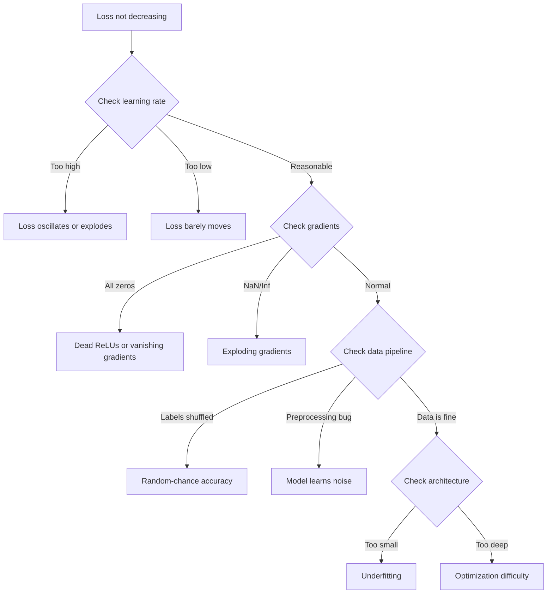
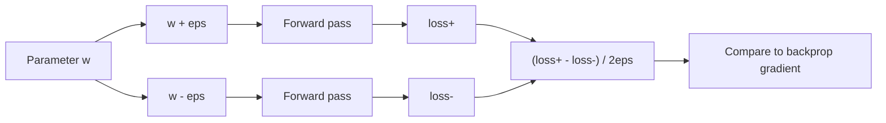
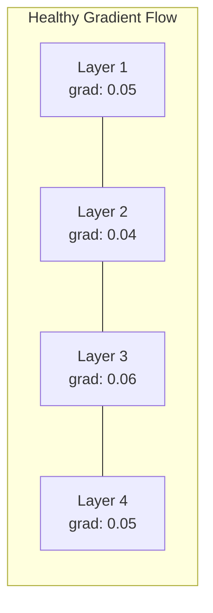
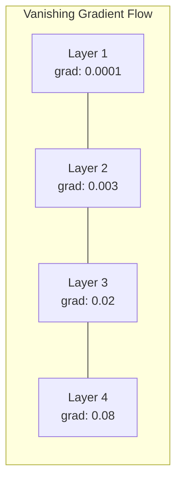
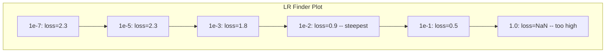

# Gỡ lỗi mạng nơ-ron

> Mạng của bạn đã được biên dịch. Nó chạy. Nó tạo ra một con số. Con số bị sai và không có gì bị sập. Chào mừng bạn đến với loại gỡ lỗi khó nhất - loại không có thông báo lỗi.

**Loại:** Xây dựng
**Ngôn ngữ:** Python, PyTorch
**Kiến thức tiên quyết:** Giai đoạn 03 Bài 01-10 (đặc biệt là backpropagation, loss chức năng, optimizers)
**Thời lượng:** ~90 phút

## Mục tiêu học tập

- Chẩn đoán các lỗi mạng nơ-ron phổ biến (NaN loss, đường cong loss phẳng, overfitting, dao động) bằng cách sử dụng các chiến lược gỡ lỗi có hệ thống
- Áp dụng kỹ thuật "overfit one batch" để xác minh rằng kiến trúc model và vòng lặp training của bạn là chính xác
- Kiểm tra cường độ gradient, phân bố kích hoạt và định mức trọng lượng để xác định các vấn đề vanishing/exploding gradient
- Xây dựng danh sách kiểm tra gỡ lỗi bao gồm các vấn đề về pipeline dữ liệu, kiến trúc model, chức năng loss, optimizer và learning rate

## Vấn đề

Phần mềm truyền thống gặp sự cố khi nó bị hỏng. Con trỏ rỗng ném một ngoại lệ. Một kiểu không khớp không thành công tại thời điểm biên dịch. Lỗi off-by-one tạo ra đầu ra sai rõ ràng.

Mạng nơ-ron không mang lại cho bạn sự xa xỉ đó.

Một mạng nơ-ron bị hỏng chạy đến khi hoàn thành, in một giá trị loss và xuất ra các dự đoán. loss có thể giảm. Các dự đoán có vẻ hợp lý. Nhưng model âm thầm sai - học các phím tắt, ghi nhớ nhiễu hoặc hội tụ đến mức tối thiểu cục bộ vô dụng. Các nhà nghiên cứu của Google ước tính rằng 60-70% thời gian gỡ lỗi ML được dành cho các lỗi "im lặng" không tạo ra lỗi nhưng làm giảm chất lượng model.

Sự khác biệt giữa một model đang hoạt động và một  bị hỏng thường là một dòng đơn lẻ bị đặt sai: một `zero_grad()` bị thiếu, một chiều chuyển vị, một learning rate lệch 10 lần. "Công thức cho Training mạng nơ-ron" (2019) mở đầu với điều này: "Các lỗi mạng nơ-ron phổ biến nhất là các lỗi không gặp sự cố."

Bài học này dạy bạn cách tìm ra những lỗi đó.

## Khái niệm

### Tư duy gỡ lỗi

Quên gỡ lỗi in và cầu nguyện. Gỡ lỗi mạng nơ-ron đòi hỏi một cách tiếp cận có hệ thống vì vòng phản hồi chậm (vài phút đến vài giờ mỗi training chạy) và các triệu chứng không rõ ràng (xấu loss có thể có nghĩa là 20 điều khác nhau).

Quy tắc vàng: **bắt đầu đơn giản, thêm độ phức tạp từng phần một và xác minh từng phần một cách độc lập.



### Triệu chứng 1: Loss không giảm

Đây là khiếu nại phổ biến nhất. Vòng lặp training chạy, epochs tích tắc và loss phẳng hoặc dao động dữ dội.

**Sai learning rate.** Quá cao: loss dao động hoặc nhảy đến NaN. Quá thấp: loss giảm chậm đến mức trông phẳng. Đối với Adam, hãy bắt đầu từ 1e-3. Đối với SGD, bắt đầu từ 1e-1 hoặc 1e-2. Luôn thử 3 tốc độ học tập kéo dài gấp 10 lần mỗi tỷ lệ (ví dụ: 1e-2, 1e-3, 1e-4) trước khi kết luận điều gì đó khác là sai.

**ReLU chết.** Nếu một tế bào thần kinh ReLU nhận được đầu vào âm lớn, nó sẽ xuất ra 0 và gradient của nó là 0. Nó không bao giờ kích hoạt lại. Nếu đủ tế bào thần kinh chết, mạng lưới không thể học hỏi. Kiểm tra: in phần kích hoạt chính xác là 0 sau mỗi lớp ReLU. Nếu >50% đã chết, hãy chuyển sang LeakyReLU hoặc giảm learning rate.

**gradients biến mất.** Trong các mạng sâu có kích hoạt sigmoid hoặc tanh, gradients co lại theo cấp số nhân khi chúng lan truyền ngược. Vào thời điểm chúng đến lớp đầu tiên, chúng là ~0. Các lớp đầu tiên ngừng học. Khắc phục: sử dụng ReLU/GELU, thêm các kết nối còn lại hoặc sử dụng batch chuẩn hóa.

**Bùng nổ gradients.** Vấn đề ngược lại - gradients phát triển theo cấp số nhân. Phổ biến trong RNN và mạng rất sâu. Loss nhảy sang NaN. Khắc phục: gradient cắt (`torch.nn.utils.clip_grad_norm_`), giảm learning rate hoặc thêm chuẩn hóa.

### Triệu chứng 2: Loss giảm nhưng Model là xấu

loss đi xuống. Training accuracy đạt 99%. Nhưng xét nghiệm accuracy là 55%. Hoặc model tạo ra đầu ra vô nghĩa trên dữ liệu thực.

**Overfitting.** model ghi nhớ dữ liệu training thay vì các mẫu học tập. Khoảng cách giữa training và xác thực loss tăng lên theo thời gian. Khắc phục: thêm dữ liệu, dropout, giảm trọng lượng, dừng sớm, tăng cường dữ liệu.

**Rò rỉ dữ liệu.** Dữ liệu thử nghiệm bị rò rỉ vào training. Accuracy cao một cách đáng ngờ. Nguyên nhân thường gặp: xáo trộn trước khi tách, tiền xử lý với số liệu thống kê từ toàn bộ dataset, trùng lặp mẫu qua các tách. Khắc phục: tách trước, xử lý trước, kiểm tra trùng lặp.

**Lỗi nhãn.** 5-10% nhãn trong hầu hết các datasets thực là sai (Northcutt và cộng sự, 2021 -- "Lỗi nhãn phổ biến trong bộ thử nghiệm"). Người model học nhiễu. Khắc phục: sử dụng khả năng học tập tự tin để tìm và sửa các ví dụ được gắn nhãn sai hoặc sử dụng loss cắt bớt để bỏ qua các mẫu có loss cao.

### Triệu chứng 3: NaN hoặc Inf trong Loss

Giá trị loss trở thành `nan` hoặc `inf`. Training đã chết.

**Learning rate quá cao.** Gradient cập nhật vượt quá mức trọng lượng phát nổ. Khắc phục: giảm 10 lần.

**log(0) hoặc log(âm).** loss entropy chéo tính toán `log(p)`. Nếu model của bạn xuất ra chính xác 0 hoặc xác suất âm, nhật ký sẽ phát nổ. Khắc phục: kẹp dự đoán để `[eps, 1-eps]` nơi `eps=1e-7`.

**Chia cho không.** Chuẩn hóa Batch chia cho độ lệch chuẩn. Một batch có giá trị hằng số có std = 0. Khắc phục: thêm epsilon vào mẫu số (PyTorch thực hiện điều này theo mặc định, nhưng triển khai tùy chỉnh có thể không).

**Tràn số.** Các hoạt hóa lớn được đưa vào `exp()` tạo ra Inf. Softmax đặc biệt dễ xảy ra. Khắc phục: trừ tối đa trước khi cấp số nhân (thủ thuật log-sum-exp).

### Kỹ thuật 1: Kiểm tra Gradient

So sánh gradients phân tích của bạn (từ backprop) với gradients số (từ sự khác biệt hữu hạn). Nếu họ không đồng ý, backward pass của bạn có lỗi.

gradient số cho parameter `w`:

```
grad_numerical = (loss(w + eps) - loss(w - eps)) / (2 * eps)
```

Chỉ số thỏa thuận (chênh lệch tương đối):

```
rel_diff = |grad_analytical - grad_numerical| / max(|grad_analytical|, |grad_numerical|, 1e-8)
```

Nếu `rel_diff < 1e-5`: đúng. Nếu `rel_diff > 1e-3`: gần như chắc chắn là một lỗi.



### Kỹ thuật 2: Thống kê kích hoạt

Theo dõi giá trị trung bình và độ lệch chuẩn của các hoạt động sau mỗi lớp trong quá trình training. Các mạng lưới lành mạnh duy trì các hoạt động với giá trị trung bình gần 0 và std gần 1 (sau khi bình thường hóa) hoặc ít nhất là có giới hạn.

| Chỉ số sức khỏe | Trung bình | Tiêu chuẩn | Chẩn đoán |
|-----------------|------|-----|-----------|
| Khỏe mạnh | ~0 | ~1 | Mạng đang học bình thường |
| Bão hòa | >>0 hoặc <<0 | ~0 | Kích hoạt bị kẹt ở các giá trị cực trị |
| Chết | 0 | 0 | Các tế bào thần kinh đã chết (tất cả các số không) |
| Bùng nổ | >>10 | >>10 | Kích hoạt phát triển không giới hạn |

### Kỹ thuật 3: Trực quan hóa luồng Gradient

Vẽ độ lớn gradient trung bình cho mỗi lớp. Trong một mạng lưới lành mạnh, cường độ gradient phải gần giống nhau giữa các lớp. Nếu các lớp ban đầu nhỏ hơn gradients 1000 lần so với các lớp sau, bạn có gradients biến mất.





### Kỹ thuật 4: Thử nghiệm Overfit-One-Batch

Kỹ thuật gỡ lỗi quan trọng nhất trong deep learning.

Lấy một batch nhỏ (8-32 mẫu). Huấn luyện trên nó cho 100+ lần lặp. loss sẽ gần bằng không và training accuracy sẽ đạt 100%. Nếu không, vòng lặp model hoặc training của bạn có một lỗi cơ bản -- đừng tiến hành training đầy đủ.

Thử nghiệm này nắm bắt:
- Chức năng loss bị hỏng
- Đường chuyền ngược bị hỏng
- Kiến trúc quá nhỏ để thể hiện dữ liệu
- Optimizer không được kết nối với model parameters
- Dữ liệu và nhãn bị lệch

Quá trình này mất 30 giây để chạy và tiết kiệm hàng giờ gỡ lỗi toàn bộ training chạy.

### Kỹ thuật 5: Công cụ tìm Learning Rate

Leslie Smith (2017) đề xuất quét learning rate từ rất nhỏ (1e-7) đến rất lớn (10) trong một epoch trong khi ghi lại loss. Cốt truyện loss vs learning rate. learning rate tối ưu nhỏ hơn khoảng 10 lần so với tốc độ loss bắt đầu giảm nhanh nhất.



LR tốt nhất trong ví dụ này: ~1e-3 (một bậc độ lớn trước điểm dốc nhất).

### Lỗi PyTorch thường gặp

Đây là những lỗi lãng phí nhiều giờ tập thể nhất trong cộng đồng PyTorch:

| Lỗi | Triệu chứng | Sửa chữa |
|-----|---------|-----|
| Quên `optimizer.zero_grad()` | Gradients tích lũy trên batches, loss dao động | Thêm `optimizer.zero_grad()` trước khi `loss.backward()` |
| Quên `model.eval()` tại thời điểm thi | Dropout và batch chuẩn hoạt động khác nhau, kiểm tra accuracy thay đổi giữa các lần chạy | Thêm `model.eval()` và `torch.no_grad()` |
| Hình dạng tensor sai | Phát sóng im lặng tạo ra kết quả sai, không có lỗi | In hình dạng sau mỗi thao tác trong quá trình gỡ lỗi |
| CPU/GPU không khớp | `RuntimeError: expected CUDA tensor` | Sử dụng `.to(device)` trên dữ liệu model AND |
| Không tháo rời tensors | Biểu đồ tính toán phát triển mãi mãi, OOM | Sử dụng `.detach()` hoặc `with torch.no_grad()` |
| Các hoạt động tại chỗ phá vỡ autograd | `RuntimeError: modified by in-place operation` | Thay thế `x += 1` bằng `x = x + 1` |
| Dữ liệu không được chuẩn hóa | Loss bị mắc kẹt ở mức cơ hội ngẫu nhiên | Chuẩn hóa đầu vào thành mean=0, std=1 |
| Nhãn là dtype sai | Entropy chéo mong đợi `Long`, `Float` | Nhãn đúc: `labels.long()` |

### Bảng gỡ lỗi chính

| Triệu chứng | Nguyên nhân có thể | Điều đầu tiên cần thử |
|---------|-------------|-------------------|
| Loss bị kẹt ở -log(1/num_classes) | Model dự đoán phân bố đồng đều | Kiểm tra pipeline dữ liệu, xác minh nhãn khớp với đầu vào |
| Loss NaN sau vài bước | Learning rate quá cao | Giảm LR gấp 10 lần |
| Loss NaN ngay lập tức | log(0) hoặc chia cho không | Thêm epsilon vào hoạt động log/division |
| Loss dao động dữ dội | LR quá cao hoặc kích thước batch quá nhỏ | Giảm LR, tăng kích thước batch |
| Loss giảm sau đó cao nguyên | LR quá cao cho pha fine-tuning | Thêm lịch trình LR (cosin hoặc phân rã bước) |
| Training acc cao, kiểm tra acc thấp | Overfitting | Thêm dropout, giảm trọng lượng, thêm dữ liệu |
| Training acc = thử nghiệm acc = cơ hội | Model không học được gì | Chạy thử nghiệm overfit-one-batch |
| Training acc = kiểm tra acc nhưng đều thấp | Underfitting | model lớn hơn, nhiều lớp hơn, features hơn |
| Gradients tất cả số không | ReLU chết hoặc đồ thị tính toán tách rời | Chuyển sang LeakyReLU, kiểm tra `.requires_grad` |
| Hết bộ nhớ trong khi training | Batch quá lớn hoặc đồ thị không được giải phóng | Giảm kích thước batch, sử dụng `torch.no_grad()` để đánh giá |

```figure
learning-curves
```

## Tự xây dựng

Bộ công cụ chẩn đoán theo dõi các đường cong kích hoạt, gradients và loss. Bạn sẽ cố tình phá vỡ mạng và sử dụng bộ công cụ để chẩn đoán từng vấn đề.

### Bước 1: Trình gỡ lỗi NetworkDebugger Class

Hooks vào một PyTorch model để ghi lại số liệu thống kê kích hoạt và gradient trên mỗi lớp.

```python
import torch
import torch.nn as nn
import math


class NetworkDebugger:
    def __init__(self, model):
        self.model = model
        self.activation_stats = {}
        self.gradient_stats = {}
        self.loss_history = []
        self.lr_losses = []
        self.hooks = []
        self._register_hooks()

    def _register_hooks(self):
        for name, module in self.model.named_modules():
            if isinstance(module, (nn.Linear, nn.Conv2d, nn.ReLU, nn.LeakyReLU)):
                hook = module.register_forward_hook(self._make_activation_hook(name))
                self.hooks.append(hook)
                hook = module.register_full_backward_hook(self._make_gradient_hook(name))
                self.hooks.append(hook)

    def _make_activation_hook(self, name):
        def hook(module, input, output):
            with torch.no_grad():
                out = output.detach().float()
                self.activation_stats[name] = {
                    "mean": out.mean().item(),
                    "std": out.std().item(),
                    "fraction_zero": (out == 0).float().mean().item(),
                    "min": out.min().item(),
                    "max": out.max().item(),
                }
        return hook

    def _make_gradient_hook(self, name):
        def hook(module, grad_input, grad_output):
            if grad_output[0] is not None:
                with torch.no_grad():
                    grad = grad_output[0].detach().float()
                    self.gradient_stats[name] = {
                        "mean": grad.mean().item(),
                        "std": grad.std().item(),
                        "abs_mean": grad.abs().mean().item(),
                        "max": grad.abs().max().item(),
                    }
        return hook

    def record_loss(self, loss_value):
        self.loss_history.append(loss_value)

    def check_loss_health(self):
        if len(self.loss_history) < 2:
            return "NOT_ENOUGH_DATA"
        recent = self.loss_history[-10:]
        if any(math.isnan(v) or math.isinf(v) for v in recent):
            return "NAN_OR_INF"
        if len(self.loss_history) >= 20:
            first_half = sum(self.loss_history[:10]) / 10
            second_half = sum(self.loss_history[-10:]) / 10
            if second_half >= first_half * 0.99:
                return "NOT_DECREASING"
        if len(recent) >= 5:
            diffs = [recent[i+1] - recent[i] for i in range(len(recent)-1)]
            if max(diffs) - min(diffs) > 2 * abs(sum(diffs) / len(diffs)):
                return "OSCILLATING"
        return "HEALTHY"

    def check_activations(self):
        issues = []
        for name, stats in self.activation_stats.items():
            if stats["fraction_zero"] > 0.5:
                issues.append(f"DEAD_NEURONS: {name} has {stats['fraction_zero']:.0%} zero activations")
            if abs(stats["mean"]) > 10:
                issues.append(f"EXPLODING_ACTIVATIONS: {name} mean={stats['mean']:.2f}")
            if stats["std"] < 1e-6:
                issues.append(f"COLLAPSED_ACTIVATIONS: {name} std={stats['std']:.2e}")
        return issues if issues else ["HEALTHY"]

    def check_gradients(self):
        issues = []
        grad_magnitudes = []
        for name, stats in self.gradient_stats.items():
            grad_magnitudes.append((name, stats["abs_mean"]))
            if stats["abs_mean"] < 1e-7:
                issues.append(f"VANISHING_GRADIENT: {name} abs_mean={stats['abs_mean']:.2e}")
            if stats["abs_mean"] > 100:
                issues.append(f"EXPLODING_GRADIENT: {name} abs_mean={stats['abs_mean']:.2e}")
        if len(grad_magnitudes) >= 2:
            first_mag = grad_magnitudes[0][1]
            last_mag = grad_magnitudes[-1][1]
            if last_mag > 0 and first_mag / last_mag > 100:
                issues.append(f"GRADIENT_RATIO: first/last = {first_mag/last_mag:.0f}x (vanishing)")
        return issues if issues else ["HEALTHY"]

    def print_report(self):
        print("\n=== NETWORK DEBUGGER REPORT ===")
        print(f"\nLoss health: {self.check_loss_health()}")
        if self.loss_history:
            print(f"  Last 5 losses: {[f'{v:.4f}' for v in self.loss_history[-5:]]}")
        print("\nActivation diagnostics:")
        for item in self.check_activations():
            print(f"  {item}")
        print("\nGradient diagnostics:")
        for item in self.check_gradients():
            print(f"  {item}")
        print("\nPer-layer activation stats:")
        for name, stats in self.activation_stats.items():
            print(f"  {name}: mean={stats['mean']:.4f} std={stats['std']:.4f} zero={stats['fraction_zero']:.1%}")
        print("\nPer-layer gradient stats:")
        for name, stats in self.gradient_stats.items():
            print(f"  {name}: abs_mean={stats['abs_mean']:.2e} max={stats['max']:.2e}")

    def remove_hooks(self):
        for hook in self.hooks:
            hook.remove()
        self.hooks.clear()
```

### Bước 2: Kiểm tra Overfit-One-Batch

```python
def overfit_one_batch(model, x_batch, y_batch, criterion, lr=0.01, steps=200):
    optimizer = torch.optim.Adam(model.parameters(), lr=lr)
    model.train()
    print("\n=== OVERFIT ONE BATCH TEST ===")
    print(f"Batch size: {x_batch.shape[0]}, Steps: {steps}")

    for step in range(steps):
        optimizer.zero_grad()
        output = model(x_batch)
        loss = criterion(output, y_batch)
        loss.backward()
        optimizer.step()

        if step % 50 == 0 or step == steps - 1:
            with torch.no_grad():
                preds = (output > 0).float() if output.shape[-1] == 1 else output.argmax(dim=1)
                targets = y_batch if y_batch.dim() == 1 else y_batch.squeeze()
                acc = (preds.squeeze() == targets).float().mean().item()
            print(f"  Step {step:3d} | Loss: {loss.item():.6f} | Accuracy: {acc:.1%}")

    final_loss = loss.item()
    if final_loss > 0.1:
        print(f"\n  FAIL: Loss did not converge ({final_loss:.4f}). Model or training loop is broken.")
        return False
    print(f"\n  PASS: Loss converged to {final_loss:.6f}")
    return True
```

### Bước 3: Learning Rate Finder

```python
def find_learning_rate(model, x_data, y_data, criterion, start_lr=1e-7, end_lr=10, steps=100):
    import copy
    original_state = copy.deepcopy(model.state_dict())
    optimizer = torch.optim.SGD(model.parameters(), lr=start_lr)
    lr_mult = (end_lr / start_lr) ** (1 / steps)

    model.train()
    results = []
    best_loss = float("inf")
    current_lr = start_lr

    print("\n=== LEARNING RATE FINDER ===")

    for step in range(steps):
        optimizer.zero_grad()
        output = model(x_data)
        loss = criterion(output, y_data)

        if math.isnan(loss.item()) or loss.item() > best_loss * 10:
            break

        best_loss = min(best_loss, loss.item())
        results.append((current_lr, loss.item()))

        loss.backward()
        optimizer.step()

        current_lr *= lr_mult
        for param_group in optimizer.param_groups:
            param_group["lr"] = current_lr

    model.load_state_dict(original_state)

    if len(results) < 10:
        print("  Could not complete LR sweep -- loss diverged too quickly")
        return results

    min_loss_idx = min(range(len(results)), key=lambda i: results[i][1])
    suggested_lr = results[max(0, min_loss_idx - 10)][0]

    print(f"  Swept {len(results)} steps from {start_lr:.0e} to {results[-1][0]:.0e}")
    print(f"  Minimum loss {results[min_loss_idx][1]:.4f} at lr={results[min_loss_idx][0]:.2e}")
    print(f"  Suggested learning rate: {suggested_lr:.2e}")

    return results
```

### Bước 4: Trình kiểm tra Gradient

```python
def _flat_to_multi_index(flat_idx, shape):
    multi_idx = []
    remaining = flat_idx
    for dim in reversed(shape):
        multi_idx.insert(0, remaining % dim)
        remaining //= dim
    return tuple(multi_idx)


def gradient_check(model, x, y, criterion, eps=1e-4):
    model.train()
    x_double = x.double()
    y_double = y.double()
    model_double = model.double()

    print("\n=== GRADIENT CHECK ===")
    overall_max_diff = 0
    checked = 0

    for name, param in model_double.named_parameters():
        if not param.requires_grad:
            continue

        layer_max_diff = 0

        model_double.zero_grad()
        output = model_double(x_double)
        loss = criterion(output, y_double)
        loss.backward()
        analytical_grad = param.grad.clone()

        num_checks = min(5, param.numel())
        for i in range(num_checks):
            idx = _flat_to_multi_index(i, param.shape)
            original = param.data[idx].item()

            param.data[idx] = original + eps
            with torch.no_grad():
                loss_plus = criterion(model_double(x_double), y_double).item()

            param.data[idx] = original - eps
            with torch.no_grad():
                loss_minus = criterion(model_double(x_double), y_double).item()

            param.data[idx] = original

            numerical = (loss_plus - loss_minus) / (2 * eps)
            analytical = analytical_grad[idx].item()

            denom = max(abs(numerical), abs(analytical), 1e-8)
            rel_diff = abs(numerical - analytical) / denom

            layer_max_diff = max(layer_max_diff, rel_diff)
            checked += 1

        overall_max_diff = max(overall_max_diff, layer_max_diff)
        status = "OK" if layer_max_diff < 1e-5 else "MISMATCH"
        print(f"  {name}: max_rel_diff={layer_max_diff:.2e} [{status}]")

    model.float()

    print(f"\n  Checked {checked} parameters")
    if overall_max_diff < 1e-5:
        print("  PASS: Gradients match (rel_diff < 1e-5)")
    elif overall_max_diff < 1e-3:
        print("  WARN: Small differences (1e-5 < rel_diff < 1e-3)")
    else:
        print("  FAIL: Gradient mismatch detected (rel_diff > 1e-3)")
    return overall_max_diff
```

### Bước 5: Cố tình phá vỡ mạng

Bây giờ áp dụng bộ công cụ cho các mạng bị hỏng và chẩn đoán từng mạng.

```python
def demo_broken_networks():
    torch.manual_seed(42)
    x = torch.randn(64, 10)
    y = (x[:, 0] > 0).long()

    print("\n" + "=" * 60)
    print("BUG 1: Learning rate too high (lr=10)")
    print("=" * 60)
    model1 = nn.Sequential(nn.Linear(10, 32), nn.ReLU(), nn.Linear(32, 2))
    debugger1 = NetworkDebugger(model1)
    optimizer1 = torch.optim.SGD(model1.parameters(), lr=10.0)
    criterion = nn.CrossEntropyLoss()
    for step in range(20):
        optimizer1.zero_grad()
        out = model1(x)
        loss = criterion(out, y)
        debugger1.record_loss(loss.item())
        loss.backward()
        optimizer1.step()
    debugger1.print_report()
    debugger1.remove_hooks()

    print("\n" + "=" * 60)
    print("BUG 2: Dead ReLUs from bad initialization")
    print("=" * 60)
    model2 = nn.Sequential(nn.Linear(10, 32), nn.ReLU(), nn.Linear(32, 32), nn.ReLU(), nn.Linear(32, 2))
    with torch.no_grad():
        for m in model2.modules():
            if isinstance(m, nn.Linear):
                m.weight.fill_(-1.0)
                m.bias.fill_(-5.0)
    debugger2 = NetworkDebugger(model2)
    optimizer2 = torch.optim.Adam(model2.parameters(), lr=1e-3)
    for step in range(50):
        optimizer2.zero_grad()
        out = model2(x)
        loss = criterion(out, y)
        debugger2.record_loss(loss.item())
        loss.backward()
        optimizer2.step()
    debugger2.print_report()
    debugger2.remove_hooks()

    print("\n" + "=" * 60)
    print("BUG 3: Missing zero_grad (gradients accumulate)")
    print("=" * 60)
    model3 = nn.Sequential(nn.Linear(10, 32), nn.ReLU(), nn.Linear(32, 2))
    debugger3 = NetworkDebugger(model3)
    optimizer3 = torch.optim.SGD(model3.parameters(), lr=0.01)
    for step in range(50):
        out = model3(x)
        loss = criterion(out, y)
        debugger3.record_loss(loss.item())
        loss.backward()
        optimizer3.step()
    debugger3.print_report()
    debugger3.remove_hooks()

    print("\n" + "=" * 60)
    print("HEALTHY NETWORK: Correct setup for comparison")
    print("=" * 60)
    model_good = nn.Sequential(nn.Linear(10, 32), nn.ReLU(), nn.Linear(32, 2))
    debugger_good = NetworkDebugger(model_good)
    optimizer_good = torch.optim.Adam(model_good.parameters(), lr=1e-3)
    for step in range(50):
        optimizer_good.zero_grad()
        out = model_good(x)
        loss = criterion(out, y)
        debugger_good.record_loss(loss.item())
        loss.backward()
        optimizer_good.step()
    debugger_good.print_report()
    debugger_good.remove_hooks()

    print("\n" + "=" * 60)
    print("OVERFIT-ONE-BATCH TEST (healthy model)")
    print("=" * 60)
    model_test = nn.Sequential(nn.Linear(10, 32), nn.ReLU(), nn.Linear(32, 2))
    overfit_one_batch(model_test, x[:8], y[:8], criterion)

    print("\n" + "=" * 60)
    print("LEARNING RATE FINDER")
    print("=" * 60)
    model_lr = nn.Sequential(nn.Linear(10, 32), nn.ReLU(), nn.Linear(32, 2))
    find_learning_rate(model_lr, x, y, criterion)

    print("\n" + "=" * 60)
    print("GRADIENT CHECK")
    print("=" * 60)
    model_grad = nn.Sequential(nn.Linear(10, 8), nn.ReLU(), nn.Linear(8, 2))
    gradient_check(model_grad, x[:4], y[:4], criterion)
```

## Ứng dụng

### PyTorch Công cụ tích hợp

```python
import torch
import torch.nn as nn

model = nn.Sequential(
    nn.Linear(768, 256),
    nn.ReLU(),
    nn.Linear(256, 10),
)

with torch.autograd.detect_anomaly():
    output = model(input_tensor)
    loss = criterion(output, target)
    loss.backward()

for name, param in model.named_parameters():
    if param.grad is not None:
        print(f"{name}: grad_mean={param.grad.abs().mean():.2e}")
```

### Tích hợp trọng lượng & thiên vị

```python
import wandb

wandb.init(project="debug-training")

for epoch in range(100):
    loss = train_one_epoch()
    wandb.log({
        "loss": loss,
        "lr": optimizer.param_groups[0]["lr"],
        "grad_norm": torch.nn.utils.clip_grad_norm_(model.parameters(), float("inf")),
    })

    for name, param in model.named_parameters():
        if param.grad is not None:
            wandb.log({f"grad/{name}": wandb.Histogram(param.grad.cpu().numpy())})
```

### Bảng TensorBoard

```python
from torch.utils.tensorboard import SummaryWriter

writer = SummaryWriter("runs/debug_experiment")

for epoch in range(100):
    loss = train_one_epoch()
    writer.add_scalar("Loss/train", loss, epoch)

    for name, param in model.named_parameters():
        writer.add_histogram(f"weights/{name}", param, epoch)
        if param.grad is not None:
            writer.add_histogram(f"gradients/{name}", param.grad, epoch)
```

### Danh sách kiểm tra gỡ lỗi (trước khi Training đầy đủ)

1. Chạy kiểm tra overfit-one-batch. Nếu nó không thành công, hãy dừng lại.
2. In model tóm tắt -- xác minh số lượng parameter hợp lý.
3. Chạy một forward pass duy nhất với dữ liệu ngẫu nhiên -- kiểm tra hình dạng đầu ra.
4. Tập luyện trong 5 epochs - xác minh loss giảm.
5. Kiểm tra số liệu thống kê kích hoạt - không có lớp chết, không có vụ nổ.
6. Kiểm tra dòng chảy gradient - không biến mất, không nổ.
7. Xác minh dữ liệu pipeline - in 5 mẫu ngẫu nhiên có nhãn.

## Sản phẩm bàn giao

Bài học này tạo ra:
- `outputs/prompt-nn-debugger.md` - một prompt để chẩn đoán các lỗi training mạng nơ-ron
- `outputs/skill-debug-checklist.md` -- danh sách kiểm tra cây quyết định để gỡ lỗi các vấn đề training

Các mẫu triển khai chính để gỡ lỗi:
- Thêm hooks giám sát vào production training scripts
- Ghi lại kích hoạt và gradient thống kê vào W&B hoặc TensorBoard sau mỗi N bước
- Triển khai cảnh báo tự động cho NaN loss, tế bào thần kinh chết (>80% không) hoặc gradient nổ
- Luôn chạy kiểm tra overfit-one-batch khi thay đổi kiến trúc hoặc pipelines dữ liệu

## Bài tập

1. **Thêm một máy dò gradient phát nổ.** Sửa đổi `NetworkDebugger` để phát hiện khi gradients vượt quá ngưỡng và tự động đề xuất giá trị cắt gradient. Kiểm tra nó trên mạng 20 lớp mà không cần chuẩn hóa.

2. **Xây dựng một bộ hồi sinh tế bào thần kinh đã chết.** Viết một hàm xác định các tế bào thần kinh ReLU đã chết (luôn xuất ra 0) và khởi tạo lại trọng số đến của chúng với khởi tạo Kaiming. Cho thấy rằng điều này khôi phục một mạng lưới nơi >70% tế bào thần kinh đã chết.

3. **Triển khai công cụ tìm learning rate với biểu đồ.** Mở rộng `find_learning_rate` để lưu kết quả dưới dạng CSV và viết một script riêng đọc CSV và hiển thị đường cong LR so với loss bằng cách sử dụng matplotlib. Xác định LR tối ưu cho ResNet-18 trên CIFAR-10.

4. **Tạo trình xác thực pipeline dữ liệu.** Viết một hàm kiểm tra: các mẫu trùng lặp trên train/test phân tách, mất cân bằng phân phối nhãn (tỷ lệ >10:1), chuẩn hóa đầu vào (trung bình gần 0, std gần 1) và các giá trị NaN/Inf trong dữ liệu. Chạy nó trên một dataset cố tình bị hỏng.

5. **Gỡ lỗi thực sự.** Lấy framework nhỏ từ Bài 10, đưa vào một lỗi tinh tế (ví dụ: chuyển ma trận trọng số ngược lại) và sử dụng kiểm tra gradient để xác định chính xác parameter nào có gradients không chính xác. Ghi lại process gỡ lỗi.

## Thuật ngữ chính

| Thuật ngữ | Những gì mọi người nói | Ý nghĩa thực sự của nó |
|------|----------------|----------------------|
| Lỗi im lặng | "Nó chạy nhưng cho kết quả xấu" | Một lỗi không tạo ra lỗi nhưng làm giảm chất lượng model - chế độ lỗi chủ yếu trong ML |
| Chết ReLU | "Các tế bào thần kinh đã chết" | Một tế bào thần kinh ReLU có đầu vào luôn âm, vì vậy nó xuất ra 0 và nhận 0 gradient vĩnh viễn |
| Biến mất gradients | "Lớp sớm ngừng học" | Gradients co lại theo cấp số nhân qua các lớp, làm cho trọng lượng ở các lớp ban đầu được đông lạnh hiệu quả |
| Bùng nổ gradients | "Loss đã đến NaN" | Gradients phát triển theo cấp số nhân qua các lớp, gây ra các cập nhật trọng lượng lớn đến mức tràn ra ngoài |
| Kiểm tra Gradient | "Xác minh backprop là chính xác" | So sánh gradients phân tích từ backprop đến số gradients từ sự khác biệt hữu hạn |
| Quá phù hợp một batch | "Kiểm tra gỡ lỗi quan trọng nhất" | Training trên một batch nhỏ duy nhất để xác minh model CÓ THỂ học được - nếu nó không thể, một cái gì đó về cơ bản đã bị hỏng |
| Công cụ tìm LR | "Quét để tìm đúng learning rate" | Tăng learning rate theo cấp số nhân trong một epoch và chọn tỷ lệ ngay trước khi loss phân kỳ |
| Rò rỉ dữ liệu | "Dữ liệu thử nghiệm bị rò rỉ vào training" | Khi thông tin từ bộ thử nghiệm làm ô nhiễm training, tạo ra accuracy cao nhân tạo |
| Thống kê kích hoạt | "Giám sát tình trạng lớp" | Theo dõi trung bình, tiêu chuẩn và không phân số đầu ra của mỗi lớp để phát hiện các tế bào thần kinh chết, bão hòa hoặc phát nổ |
| Gradient cắt | "Giới hạn cường độ gradient" | Thu nhỏ quy mô gradients khi tiêu chuẩn của chúng vượt quá ngưỡng, ngăn chặn sự bùng nổ gradient cập nhật |

## Đọc thêm

- Smith, "Tỷ lệ học tập theo chu kỳ cho Training mạng nơ-ron" (2017) - bài báo giới thiệu bài kiểm tra phạm vi learning rate (công cụ tìm LR)
- Northcutt và cộng sự, "Lỗi nhãn phổ biến trong các bộ thử nghiệm làm mất ổn định Machine Learning Benchmarks" (2021) - chứng minh rằng 3-6% nhãn trong ImageNet, CIFAR-10 và các benchmarks chính khác là sai
- Zhang và cộng sự, "Hiểu về học sâu đòi hỏi phải suy nghĩ lại về khái quát hóa" (2017) - bài báo cho thấy các mạng nơ-ron có thể ghi nhớ các nhãn ngẫu nhiên, đó là lý do tại sao bài kiểm tra overfit-one-batch hoạt động
- PyTorch tài liệu về `torch.autograd.detect_anomaly` và `torch.autograd.set_detect_anomaly` để phát hiện NaN/Inf tích hợp
