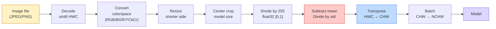
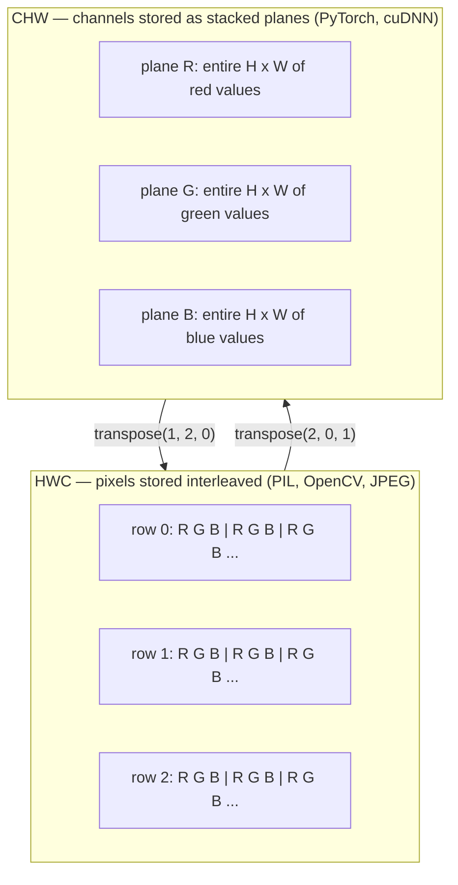

# Kiến thức cơ bản về hình ảnh — pixel, kênh, không gian màu

> Hình ảnh là một tensor của các mẫu ánh sáng. Mọi tầm nhìn model bạn sẽ sử dụng đều bắt đầu từ một thực tế này.

**Loại:** Xây dựng
**Ngôn ngữ:** Python
**Kiến thức tiên quyết:** Giai đoạn 1 Bài 12 (Thao tác Tensor), Giai đoạn 3 Bài 11 (Giới thiệu PyTorch)
**Thời lượng:** ~45 phút

## Mục tiêu học tập

- Giải thích cách một cảnh liên tục được rời rạc thành các pixel và tại sao các quyết định sampling/quantization đặt trần cho mọi model hạ lưu
- Đọc, cắt và kiểm tra hình ảnh dưới dạng mảng NumPy và chuyển đổi trôi chảy giữa bố cục HWC và CHW
- Chuyển đổi giữa RGB, thang độ xám, HSV và YCbCr và biện minh lý do tại sao mỗi không gian màu tồn tại
- Áp dụng tiền xử lý cấp pixel (chuẩn hóa, chuẩn hóa, thay đổi kích thước, ưu tiên kênh) chính xác như torchvision mong đợi

## Vấn đề

Mỗi bài báo bạn sẽ đọc, mỗi pretrained trọng lượng bạn sẽ tải xuống, mọi tầm nhìn API bạn sẽ gọi đều giả định một mã hóa cụ thể của đầu vào. Chuyển một hình ảnh `uint8` nơi model muốn `float32` và nó vẫn sẽ chạy - và âm thầm tạo ra rác. Cung cấp BGR cho một mạng được huấn luyện trên RGB và accuracy sụp đổ mười điểm. Đưa đầu vào model kênh-cuối cùng khi nó mong đợi các kênh đầu tiên và lớp chuyển đổi đầu tiên coi chiều cao là kênh feature. Không có điều nào trong số này đưa ra lỗi. Nó chỉ làm hỏng các chỉ số của bạn và bạn dành một tuần để tìm kiếm một lỗi tồn tại trong cách bạn tải tệp.

Một sự tích chập không phức tạp một khi bạn biết nó đang trượt qua cái gì. Phần khó khăn là "một hình ảnh" có ý nghĩa khác nhau đối với máy ảnh, JPEG decoder, PIL, OpenCV, torchvision và hạt nhân CUDA. Mỗi stack có thứ tự trục, phạm vi byte và quy ước kênh riêng. Một kỹ sư tầm nhìn không thể giữ cho những pipelines thẳng ships hỏng này.

Bài học này cố định nền tảng để rest của giai đoạn có thể xây dựng trên đó. Cuối cùng, bạn sẽ biết pixel là gì, tại sao có ba số trên mỗi pixel thay vì một, "chuẩn hóa với số liệu thống kê ImageNet" thực sự làm gì và làm thế nào để di chuyển giữa hai hoặc ba bố cục mà mọi bài học khác trong giai đoạn này sẽ giả định.

## Khái niệm

### Sơ chế đầy đủ pipeline trong nháy mắt

Mỗi hệ thống thị giác production là cùng một chuỗi biến đổi có thể đảo ngược. Sai một bước và model thấy một đầu vào khác với những gì nó đã được huấn luyện.



Hai hộp màu đỏ và xanh lam là nơi 80% thất bại thầm lặng: thiếu tiêu chuẩn hóa và bố trí sai.

### Pixel là mẫu, không phải hình vuông

Một cảm biến máy ảnh đếm các photon hạ cánh trên một mạng lưới các máy dò nhỏ. Mỗi máy dò tích hợp ánh sáng trong một phần của giây và phát ra điện áp tỷ lệ thuận với số lượng photon chạm vào nó. Sau đó, cảm biến rời rạc điện áp đó thành một số nguyên. Một máy dò trở thành một pixel.

```
Continuous scene                 Sensor grid                     Digital image
(infinite detail)                (H x W detectors)               (H x W integers)

    ~~~~~                        +--+--+--+--+--+                 210 198 180 155 120
~   ~   ~                     |  |  |  |  |  |                 205 195 178 152 118
~ ánh sáng ~ ----> +--+--+--+--+--+ ----> 200 190 175 150 115
   ~~~~~                         |  |  |  |  |  |                 195 185 170 148 112
                                 +--+--+--+--+--+                 188 180 165 145 108
```

Hai lựa chọn xảy ra ở bước này và họ cố định trần cho mọi thứ ở hạ lưu:

- **sampling không gian **quyết định số lượng máy dò trên mỗi độ của cảnh. Quá ít và các cạnh trở nên lởm chởm (răng cưa). Quá nhiều, và lưu trữ và điện toán bùng nổ.
- **Cường độ quantization **quyết định mức độ tinh tế của điện áp được xô vào. 8 bit cung cấp 256 mức và là tiêu chuẩn để hiển thị. 10, 12, 16 bit mang lại gradients mượt mà hơn và quan trọng cho hình ảnh y tế, HDR và pipelines cảm biến thô.

Một pixel không phải là một hình vuông màu có diện tích. Đó là một phép đo duy nhất. Khi bạn thay đổi kích thước hoặc xoay, bạn đang lấy mẫu lại lưới đo lường đó.

### Tại sao lại có ba kênh

Một máy dò đếm các photon trên toàn bộ quang phổ nhìn thấy được - đó là thang độ xám. Để có được màu sắc, cảm biến bao phủ lưới bằng một bức khảm các bộ lọc màu đỏ, xanh lá cây và xanh lam. Sau khi demosaicing, mỗi vị trí không gian có ba số nguyên: phản hồi của máy dò được lọc màu đỏ, được lọc màu xanh lá cây và được lọc màu xanh lam gần đó. Ba số nguyên đó là bộ ba RGB của một pixel.

```
One pixel in memory:

    (R, G, B) = (210, 140, 30)   <- reddish-orange

An H x W RGB image:

    shape (H, W, 3)     stored as   H rows of W pixels of 3 values
                                    each in [0, 255] for uint8
```

Ba không phải là phép thuật. Máy ảnh độ sâu thêm kênh Z. Vệ tinh thêm các dải hồng ngoại và tia cực tím. Chụp y tế thường có một kênh (X-quang, CT) hoặc nhiều kênh (siêu phổ). Số kênh là trục cuối cùng; Các lớp conv học cách trộn lẫn giữa nó.

### Hai quy ước bố trí: HWC và CHW

Cùng một tensor, hai thứ tự. Mỗi thư viện đều chọn một.

```
HWC (height, width, channels)           CHW (channels, height, width)

   W ->                                    H ->
  +-----+-----+-----+                     +-----+-----+
H |R G B|R G B|R G B|                   C |R R R R R R|
| +-----+-----+-----+                   | +-----+-----+
v |R G B|R G B|R G B|                   v |G G G G G G|
  +-----+-----+-----+                     +-----+-----+
                                          |B B B B B B|
                                          +-----+-----+

   PIL, OpenCV, matplotlib,              PyTorch, most deep learning
   almost every image file on disk       frameworks, cuDNN kernels
```

CHW tồn tại vì các hạt nhân tích chập trượt qua H và W. Giữ trục kênh trước có nghĩa là mỗi hạt nhân nhìn thấy một mặt phẳng 2D liền kề trên mỗi kênh, vectơ hóa rõ ràng. Các định dạng đĩa giữ HWC vì điều đó phù hợp với cách các đường quét thoát ra từ cảm biến.

Chuyển đổi một dòng bạn sẽ nhập hàng nghìn lần:

```
img_chw = img_hwc.transpose(2, 0, 1)      # NumPy
img_chw = img_hwc.permute(2, 0, 1)        # PyTorch tensor
```

Bố cục bộ nhớ, trực quan:



### Phạm vi byte và dtype

Ba quy ước chiếm ưu thế:

| Hội nghị | dtype | Phạm vi | Nơi bạn nhìn thấy nó |
|------------|-------|-------|------------------|
| Thô | `uint8` | [0, 255] | Tệp trên đĩa, PIL, đầu ra OpenCV |
| Chuẩn hóa | `float32` | [0.0, 1.0] | Sau `img.astype('float32') / 255` |
| Tiêu chuẩn hóa | `float32` | khoảng [-2, +2] | Sau khi trừ đi giá trị trung bình và chia cho std |

Các mạng tích chập được huấn luyện về đầu vào được tiêu chuẩn hóa. Số liệu thống kê của ImageNet `mean=[0.485, 0.456, 0.406]`, `std=[0.229, 0.224, 0.225]` là giá trị trung bình cộng và độ lệch chuẩn của ba kênh trên bộ training ImageNet đầy đủ, được tính toán trên [0, 1] pixel chuẩn hóa. Cho `uint8` thô vào một model mong đợi phao tiêu chuẩn hóa là lỗi thầm lặng phổ biến nhất trong thị giác ứng dụng.

### Không gian màu và lý do tại sao chúng tồn tại

RGB là định dạng chụp nhưng nó không phải lúc nào cũng là đại diện hữu ích nhất cho một model.

```
 RGB               HSV                       YCbCr / YUV

 R red             H hue (angle 0-360)       Y luminance (brightness)
 G green           S saturation (0-1)        Cb chroma blue-yellow
 B blue            V value/brightness (0-1)  Cr chroma red-green

 Linear to         Separates color from      Separates brightness from
 sensor output     brightness. Useful for    color. JPEG and most video
                   color thresholding, UI    codecs compress the chroma
                   sliders, simple filters   channels harder because the
                                             human eye is less sensitive
                                             to chroma detail than to Y.
```

Đối với hầu hết các CNN hiện đại, bạn cung cấp RGB. Bạn gặp các không gian khác khi:

- **HSV** — mã CV cổ điển, phân đoạn dựa trên màu sắc, cân bằng màu trắng.
- **YCbCr** — đọc nội bộ JPEG, pipelines video, models siêu phân giải chỉ hoạt động trên Y.
- **Thang độ xám** — OCR, tài liệu models, bất kỳ trường hợp nào mà màu sắc có thể thay đổi phiền toái hơn là tín hiệu.

Thang độ xám từ RGB là một tổng có trọng số, không phải là mức trung bình, bởi vì mắt người nhạy cảm với màu xanh lá cây hơn là màu đỏ hoặc xanh lam:

```
Y = 0.299 R + 0.587 G + 0.114 B       (ITU-R BT.601, the classic weights)
```

### Tỷ lệ khung hình, thay đổi kích thước và nội suy

Mỗi model có kích thước đầu vào cố định (224x224 đối với hầu hết các bộ phân loại ImageNet, 384x384 hoặc 512x512 đối với các máy dò hiện đại). Hình ảnh của bạn hiếm khi khớp. Ba lựa chọn thay đổi kích thước quan trọng:

- **Thay đổi kích thước cạnh ngắn hơn, sau đó cắt xén giữa** — công thức ImageNet tiêu chuẩn. Giữ nguyên tỷ lệ khung hình, vứt bỏ một dải pixel cạnh.
- **Thay đổi kích thước và pad** — giữ nguyên tỷ lệ khung hình và mọi pixel, thêm các thanh màu đen. Tiêu chuẩn phát hiện và OCR.
- **Thay đổi kích thước trực tiếp theo mục tiêu** — kéo dài hình ảnh. Rẻ, bóp méo hình học, tốt cho nhiều nhiệm vụ phân loại.

Phương pháp nội suy quyết định cách tính toán các pixel trung gian khi lưới mới không thẳng hàng với lưới cũ:

```
Nearest neighbour     fastest, blocky, only choice for masks/labels
Bilinear              fast, smooth, default for most image resizing
Bicubic               slower, sharper on upscaling
Lanczos               slowest, best quality, used for final display
```

Quy tắc ngón tay cái: bilinear cho training, bicubic hoặc lanczos cho các tài sản bạn sẽ xem, gần nhất cho bất kỳ thứ gì chứa số nguyên class ID.

```figure
conv-output-size
```

## Tự xây dựng

### Bước 1: Tải hình ảnh và kiểm tra hình dạng của nó

Sử dụng Pillow để tải bất kỳ JPEG hoặc PNG nào, chuyển đổi sang NumPy và in những gì bạn có. Đối với một ví dụ xác định chạy ngoại tuyến, hãy tổng hợp một ví dụ.

```python
import numpy as np
from PIL import Image

def synthetic_rgb(h=128, w=192, seed=0):
    rng = np.random.default_rng(seed)
    yy, xx = np.meshgrid(np.linspace(0, 1, h), np.linspace(0, 1, w), indexing="ij")
    r = (np.sin(xx * 6) * 0.5 + 0.5) * 255
    g = yy * 255
    b = (1 - yy) * xx * 255
    rgb = np.stack([r, g, b], axis=-1) + rng.normal(0, 6, (h, w, 3))
    return np.clip(rgb, 0, 255).astype(np.uint8)

arr = synthetic_rgb()
# Or load from disk:
# arr = np.asarray(Image.open("your_image.jpg").convert("RGB"))

print(f"type:   {type(arr).__name__}")
print(f"dtype:  {arr.dtype}")
print(f"shape:  {arr.shape}     # (H, W, C)")
print(f"min:    {arr.min()}")
print(f"max:    {arr.max()}")
print(f"pixel at (0, 0): {arr[0, 0]}")
```

Sản lượng dự kiến: `shape: (H, W, 3)`, `dtype: uint8`, phạm vi `[0, 255]`. Đó là biểu diễn chuẩn trên đĩa cho dù các byte đến từ máy ảnh, decoder JPEG hay máy phát tổng hợp.

### Bước 2: Chia kênh và sắp xếp lại bố cục

Kéo R, G, B ra riêng biệt, sau đó chuyển đổi từ HWC sang CHW cho PyTorch.

```python
R = arr[:, :, 0]
G = arr[:, :, 1]
B = arr[:, :, 2]
print(f"R shape: {R.shape}, mean: {R.mean():.1f}")
print(f"G shape: {G.shape}, mean: {G.mean():.1f}")
print(f"B shape: {B.shape}, mean: {B.mean():.1f}")

arr_chw = arr.transpose(2, 0, 1)
print(f"\nHWC shape: {arr.shape}")
print(f"CHW shape: {arr_chw.shape}")
```

Ba mặt phẳng thang độ xám, một mặt phẳng mỗi kênh. CHW chỉ sắp xếp lại các trục; Không cần sao chép dữ liệu khi bố cục bộ nhớ cho phép.

### Bước 3: Chuyển đổi thang độ xám và HSV

Thang độ xám có tổng trọng số, sau đó là RGB sang HSV thủ công.

```python
def rgb_to_grayscale(rgb):
    weights = np.array([0.299, 0.587, 0.114], dtype=np.float32)
    return (rgb.astype(np.float32) @ weights).astype(np.uint8)

def rgb_to_hsv(rgb):
    rgb_f = rgb.astype(np.float32) / 255.0
    r, g, b = rgb_f[..., 0], rgb_f[..., 1], rgb_f[..., 2]
    cmax = np.max(rgb_f, axis=-1)
    cmin = np.min(rgb_f, axis=-1)
    delta = cmax - cmin

    h = np.zeros_like(cmax)
    mask = delta > 0
    rmax = mask & (cmax == r)
    gmax = mask & (cmax == g)
    bmax = mask & (cmax == b)
    h[rmax] = ((g[rmax] - b[rmax]) / delta[rmax]) % 6
    h[gmax] = ((b[gmax] - r[gmax]) / delta[gmax]) + 2
    h[bmax] = ((r[bmax] - g[bmax]) / delta[bmax]) + 4
    h = h * 60.0

    s = np.where(cmax > 0, delta / cmax, 0)
    v = cmax
    return np.stack([h, s, v], axis=-1)

gray = rgb_to_grayscale(arr)
hsv = rgb_to_hsv(arr)
print(f"gray shape: {gray.shape}, range: [{gray.min()}, {gray.max()}]")
print(f"hsv   shape: {hsv.shape}")
print(f"hue range: [{hsv[..., 0].min():.1f}, {hsv[..., 0].max():.1f}] degrees")
print(f"sat range: [{hsv[..., 1].min():.2f}, {hsv[..., 1].max():.2f}]")
print(f"val range: [{hsv[..., 2].min():.2f}, {hsv[..., 2].max():.2f}]")
```

Hue xuất hiện theo độ, độ bão hòa và giá trị trong [0, 1]. Điều đó phù hợp với quy ước `hsv_full` OpenCV.

### Bước 4: Chuẩn hóa, chuẩn hóa và đảo ngược nó

Chuyển từ byte thô đến tensor chính xác mà ImageNet pretrained model mong đợi, sau đó quay lại.

```python
mean = np.array([0.485, 0.456, 0.406], dtype=np.float32)
std = np.array([0.229, 0.224, 0.225], dtype=np.float32)

def preprocess_imagenet(rgb_uint8):
    x = rgb_uint8.astype(np.float32) / 255.0
    x = (x - mean) / std
    x = x.transpose(2, 0, 1)
    return x

def deprocess_imagenet(chw_float32):
    x = chw_float32.transpose(1, 2, 0)
    x = x * std + mean
    x = np.clip(x * 255.0, 0, 255).astype(np.uint8)
    return x

x = preprocess_imagenet(arr)
print(f"preprocessed shape: {x.shape}     # (C, H, W)")
print(f"preprocessed dtype: {x.dtype}")
print(f"preprocessed mean per channel:  {x.mean(axis=(1, 2)).round(3)}")
print(f"preprocessed std  per channel:  {x.std(axis=(1, 2)).round(3)}")

roundtrip = deprocess_imagenet(x)
max_diff = np.abs(roundtrip.astype(int) - arr.astype(int)).max()
print(f"roundtrip max pixel diff: {max_diff}    # should be 0 or 1")
```

Giá trị trung bình trên mỗi kênh phải gần bằng không, std gần một. Cặp preprocess/deprocess chính xác là những gì mọi cuộc gọi torchvision `transforms.Normalize` đang làm dưới mui xe.

### Bước 5: Thay đổi kích thước bằng ba phương pháp nội suy

So sánh gần nhất, hai tuyến tính và bicubic trên cao cấp để có thể nhìn thấy sự khác biệt.

```python
target = (arr.shape[0] * 3, arr.shape[1] * 3)

nearest = np.asarray(Image.fromarray(arr).resize(target[::-1], Image.NEAREST))
bilinear = np.asarray(Image.fromarray(arr).resize(target[::-1], Image.BILINEAR))
bicubic = np.asarray(Image.fromarray(arr).resize(target[::-1], Image.BICUBIC))

def local_roughness(x):
    gy = np.diff(x.astype(float), axis=0)
    gx = np.diff(x.astype(float), axis=1)
    return float(np.abs(gy).mean() + np.abs(gx).mean())

for name, out in [("nearest", nearest), ("bilinear", bilinear), ("bicubic", bicubic)]:
    print(f"{name:>8}  shape={out.shape}  roughness={local_roughness(out):6.2f}")
```

Gần nhất đạt điểm cao nhất về độ nhám vì nó giữ các cạnh cứng. Bilinear là mượt mà nhất. Bicubic nằm ở giữa, duy trì độ sắc nét mà không cần artifacts bậc thang.

## Ứng dụng

`torchvision.transforms` gói mọi thứ ở trên thành một pipeline thành phần kết hợp duy nhất. Mã bên dưới tái tạo chính xác những gì `preprocess_imagenet` làm, cộng với việc thay đổi kích thước và cắt.

```python
import torch
from torchvision import transforms
from PIL import Image

img = Image.fromarray(synthetic_rgb(256, 256))

pipeline = transforms.Compose([
    transforms.Resize(256),
    transforms.CenterCrop(224),
    transforms.ToTensor(),
    transforms.Normalize(mean=[0.485, 0.456, 0.406], std=[0.229, 0.224, 0.225]),
])

x = pipeline(img)
print(f"tensor type:  {type(x).__name__}")
print(f"tensor dtype: {x.dtype}")
print(f"tensor shape: {tuple(x.shape)}      # (C, H, W)")
print(f"per-channel mean: {x.mean(dim=(1, 2)).tolist()}")
print(f"per-channel std:  {x.std(dim=(1, 2)).tolist()}")

batch = x.unsqueeze(0)
print(f"\nbatched shape: {tuple(batch.shape)}   # (N, C, H, W) — ready for a model")
```

Bốn bước, theo thứ tự chính xác sau: `Resize(256)` chia tỷ lệ cạnh ngắn hơn thành 256; `CenterCrop(224)` lấy một bản vá 224x224 từ giữa; `ToTensor()` chia cho 255 và hoán đổi HWC sang CHW; `Normalize` trừ đi giá trị trung bình của ImageNet và chia cho std. Đảo ngược trật tự đó âm thầm thay đổi những gì đạt đến model.

## Sản phẩm bàn giao

Bài học này tạo ra:

- `outputs/prompt-vision-preprocessing-audit.md` - một prompt biến bất kỳ thẻ model hoặc thẻ dataset nào thành danh sách kiểm tra các bất biến tiền xử lý chính xác mà một đội phải tôn trọng.
- `outputs/skill-image-tensor-inspector.md` — một skill, với bất kỳ tensor hoặc mảng hình ảnh nào, báo cáo dtype, bố cục, phạm vi và liệu nó trông thô, chuẩn hóa hay tiêu chuẩn hóa.

## Bài tập

1. **(Dễ dàng)** Tải JPEG bằng OpenCV (`cv2.imread`) và với Gối. In cả hình dạng và pixel ở `(0, 0)`. Giải thích sự khác biệt về thứ tự kênh, sau đó viết một chuyển đổi một dòng làm cho mảng OpenCV giống hệt với mảng Pillow.
2. **(Trung bình) **Viết `standardize(img, mean, std)` và nghịch đảo của nó cùng nhau vượt qua bài kiểm tra `roundtrip_max_diff <= 1` trên bất kỳ hình ảnh uint8 nào. Các hàm của bạn phải hoạt động trên một hình ảnh duy nhất trong HWC và trên một batch trong NCHW với cùng một lệnh gọi.
3. **(Cứng)** Lấy một tensor tiêu chuẩn hóa ImageNet 3 kênh và chạy nó thông qua một chuyển đổi 1x1 để học hỗn hợp RGB có trọng số thành một kênh thang độ xám duy nhất. Khởi tạo trọng số để `[0.299, 0.587, 0.114]`, đóng băng chúng và xác minh kết quả đầu ra khớp với `rgb_to_grayscale` thủ công của bạn trong lỗi dấu phẩy động. Những phép biến đổi không gian màu cổ điển nào khác có thể được viết dưới dạng tích chập 1x1?

## Thuật ngữ chính

| Thuật ngữ | Những gì mọi người nói | Ý nghĩa thực sự của nó |
|------|----------------|----------------------|
| Điểm ảnh | "Một hình vuông màu" | Một mẫu cường độ ánh sáng tại một vị trí lưới - ba số cho màu, một số cho thang độ xám |
| Kênh | "Màu sắc" | Một trong những lưới không gian song song xếp chồng lên nhau thành một tensor hình ảnh; trục cuối cùng trong HWC, đầu tiên trong CHW |
| HWC / CHW | "Hình dạng" | Thứ tự trục cho một tensor hình ảnh; đĩa và PIL sử dụng HWC, PyTorch và cuDNN sử dụng CHW |
| Chuẩn hóa | "Chia tỷ lệ hình ảnh" | Chia cho 255 để pixel sống trong [0, 1] - cần thiết nhưng không đủ |
| Chuẩn hóa | "Không trung tâm" | Trừ giá trị trung bình và chia cho std trên mỗi kênh để phân phối đầu vào khớp với những gì model đã được huấn luyện |
| Chuyển đổi thang độ xám | "Tính trung bình các kênh" | Tổng có trọng số với hệ số 0.299/0.587/0.114 phù hợp với nhận thức độ chói của con người |
| Nội suy | "Cách thay đổi kích thước chọn pixel" | Quy tắc quyết định giá trị đầu ra khi lưới mới không căn chỉnh với lưới cũ — gần nhất cho nhãn, hai tuyến tính cho training, hai lập phương cho hiển thị |
| Tỷ lệ khung hình | "Chiều rộng trên chiều cao" | Tỷ lệ phân biệt "thay đổi kích thước và pad" với "thay đổi kích thước và kéo dài" |

## Đọc thêm

- [Charles Poynton — A Guided Tour of Color Space](https://poynton.ca/PDFs/Guided_tour.pdf) - cách xử lý kỹ thuật rõ ràng nhất về lý do tại sao có rất nhiều không gian màu và khi nào mỗi không gian đều quan trọng
- [PyTorch Vision Transforms Docs](https://pytorch.org/vision/stable/transforms.html) - toàn bộ pipeline biến đổi mà bạn sẽ thực sự soạn trong production
- [How JPEG Works (Colt McAnlis)](https://www.youtube.com/watch?v=F1kYBnY6mwg) — một chuyến tham quan trực quan sắc nét về lấy mẫu phụ sắc độ, DCT và lý do tại sao JPEG mã hóa YCbCr thay vì RGB
- [ImageNet Preprocessing Conventions (torchvision models)](https://pytorch.org/vision/stable/models.html) - nguồn gốc của sự thật cho `mean=[0.485, 0.456, 0.406]` và tại sao mọi model trong vườn thú đều mong đợi điều đó
