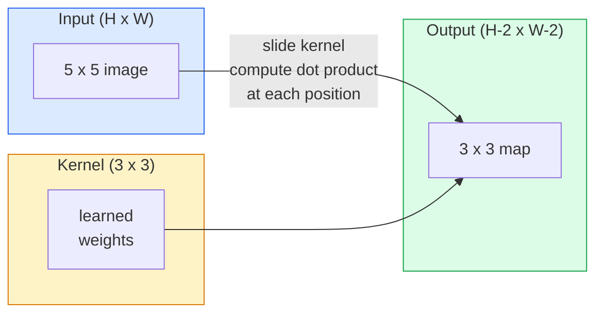
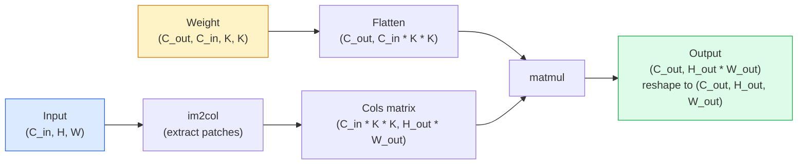

# Tích chập từ đầu

> Tích chập là một lớp dày đặc nhỏ mà bạn trượt trên một hình ảnh, chia sẻ cùng một trọng lượng ở mọi vị trí.

**Loại:** Xây dựng
**Ngôn ngữ:** Python
**Kiến thức tiên quyết:** Giai đoạn 3 (Deep Learning Core), Giai đoạn 4 Bài 01 (Kiến thức cơ bản về hình ảnh)
**Thời lượng:** ~75 phút

## Mục tiêu học tập

- Triển khai tích chập 2D từ đầu chỉ bằng cách sử dụng NumPy, bao gồm phiên bản vòng lặp lồng nhau và phiên bản `im2col` vector hóa
- Tính toán kích thước không gian đầu ra cho bất kỳ sự kết hợp nào giữa kích thước đầu vào, kích thước hạt nhân, đệm và sải chân và biện minh cho công thức `(H - K + 2P) / S + 1`
- Thiết kế hạt bằng tay (cạnh, mờ, mài, Sobel) và giải thích lý do tại sao mỗi hạt tạo ra mô hình kích hoạt mà nó thực hiện
- Stack tích chập vào một bộ trích xuất feature và kết nối độ sâu của stack với kích thước của trường tiếp nhận

## Vấn đề

Một lớp được kết nối đầy đủ trên hình ảnh RGB 224x224 sẽ cần 224 * 224 * 3 = 150.528 trọng số đầu vào cho mỗi tế bào thần kinh. Một lớp ẩn duy nhất với 1.000 đơn vị đã là 150 triệu parameters - trước khi bạn học được bất cứ điều gì hữu ích. Tệ hơn nữa, lớp đó không có khái niệm rằng một ở trên cùng bên trái và một ở dưới cùng bên phải là cùng một mẫu. Nó coi mọi vị trí pixel là độc lập, điều này hoàn toàn sai đối với hình ảnh: dịch một con mèo bằng ba pixel không nên buộc mạng phải học lại khái niệm này.

Hai thuộc tính mà hình ảnh model cần là **phương sai dịch **(đầu ra thay đổi khi đầu vào thay đổi) và **parameter chia sẻ** (cùng một máy dò feature chạy ở mọi nơi). Các lớp dày đặc không mang lại cho bạn cả hai. Convolution cung cấp cho bạn cả hai miễn phí.

Tích chập không được phát minh cho học sâu. Đây là thao tác tương tự hỗ trợ nén JPEG, làm mờ Gaussian trong Photoshop, phát hiện cạnh trong thị giác công nghiệp và mọi bộ lọc âm thanh từng shipped. Lý do CNN thống trị ImageNet từ năm 2012 đến năm 2020 là tích chập là prior chính xác cho dữ liệu có liên quan đến các giá trị lân cận và cùng một mẫu có thể xuất hiện ở bất cứ đâu.

## Khái niệm

### Một nhân, trượt

Tích chập 2D lấy một ma trận trọng lượng nhỏ được gọi là hạt nhân (hoặc bộ lọc), trượt nó qua đầu vào và tại mỗi vị trí tính tổng các sản phẩm theo phần tử. Tổng đó trở thành một pixel đầu ra.



Một ví dụ cụ thể 3x3 trên đầu vào 5x5 (không có đệm, sải chân 1):

```
Input X (5 x 5):                Kernel W (3 x 3):

  1  2  0  1  2                   1  0 -1
  0  1  3  1  0                   2  0 -2
  2  1  0  2  1                   1  0 -1
  1  0  2  1  3
  2  1  1  0  1

The kernel slides across every valid 3 x 3 window. Output Y is 3 x 3:

 Y[0,0] = sum( W * X[0:3, 0:3] )
 Y[0,1] = sum( W * X[0:3, 1:4] )
 Y[0,2] = sum( W * X[0:3, 2:5] )
 Y[1,0] = sum( W * X[1:4, 0:3] )
 ... and so on
```

Một công thức đó - **trọng lượng chia sẻ, địa phương, cửa sổ trượt** - là toàn bộ ý tưởng. Mọi thứ khác là sổ sách.

### Công thức kích thước đầu ra

Cho kích thước không gian đầu vào `H`, kích thước hạt nhân `K`, `P` đệm, `S` sải chân:

```
H_out = floor( (H - K + 2P) / S ) + 1
```

Hãy ghi nhớ điều này. Bạn sẽ tính toán nó hàng chục lần cho mỗi kiến trúc.

| Kịch bản | H | K | P | S | H_out |
|----------|---|---|---|---|-------|
| Conv hợp lệ, không có khoảng đệm | 32 | 3 | 0 | 1 | 30 |
| Cùng một chuyển đổi (kích thước bảo toàn) | 32 | 3 | 1 | 1 | 32 |
| Downsample lên 2 | 32 | 3 | 1 | 2 | 16 |
| Hồ bơi 2x2 | 32 | 2 | 0 | 2 | 16 |
| Trường tiếp nhận lớn | 32 | 7 | 3 | 2 | 16 |

"Cùng một khoảng đệm" có nghĩa là chọn P sao cho H_out == H khi S == 1. Đối với K lẻ, đó là P = (K - 1) / 2. Đó là lý do tại sao hạt nhân 3x3 chiếm ưu thế - chúng là hạt nhân lẻ nhỏ nhất vẫn có tâm.

### Đệm

Nếu không có đệm, mọi chập chập sẽ thu nhỏ bản đồ feature. Stack 20 trong số đó và hình ảnh 224x224 của bạn trở thành 184x184, điều này làm lãng phí điện toán ở biên giới và làm phức tạp các kết nối còn lại cần hình dạng phù hợp.

```
Zero padding (P = 1) on a 5 x 5 input:

  0  0  0  0  0  0  0
  0  1  2  0  1  2  0
  0  0  1  3  1  0  0
  0  2  1  0  2  1  0       Now the kernel can centre on pixel
  0  1  0  2  1  3  0       (0, 0) and still have three rows and
  0  2  1  1  0  1  0       three columns of values to multiply.
  0  0  0  0  0  0  0
```

Các chế độ bạn gặp trong thực tế: `zero` (phổ biến nhất), `reflect` (phản chiếu cạnh, tránh các đường viền cứng trong models tổng hợp), `replicate` (sao chép cạnh), `circular` (quấn quanh, được sử dụng trong các bài toán hình xuyến).

### Sải bước

Sải chân là kích thước bước của trang trượt. `stride=1` là mặc định. `stride=2` giảm một nửa kích thước không gian và là cách cổ điển để lấy mẫu bên trong CNN mà không cần lớp gộp riêng biệt - mọi kiến trúc hiện đại (ResNet, ConvNeXt, MobileNet) đều sử dụng các convs sải bước thay cho max-pool ở đâu đó.

```
Stride 1 on a 5 x 5 input, 3 x 3 kernel:

  starts: (0,0) (0,1) (0,2)        -> output row 0
          (1,0) (1,1) (1,2)        -> output row 1
          (2,0) (2,1) (2,2)        -> output row 2

  Output: 3 x 3

Stride 2 on the same input:

  starts: (0,0) (0,2)              -> output row 0
          (2,0) (2,2)              -> output row 1

  Output: 2 x 2
```

### Nhiều kênh đầu vào

Hình ảnh thực có ba kênh. Tích chập 3x3 trên đầu vào RGB thực sự là volume 3x3x3: một lát cắt 3x3 cho mỗi kênh đầu vào. Tại mỗi vị trí không gian, bạn nhân và cộng trên cả ba lát cắt và thêm một bias.

```
Input:   (C_in,  H,  W)        3 x 5 x 5
Kernel:  (C_in,  K,  K)        3 x 3 x 3 (one kernel)
Output:  (1,     H', W')       2D map

For a layer that produces C_out output channels, you stack C_out kernels:

Weight:  (C_out, C_in, K, K)   e.g. 64 x 3 x 3 x 3
Output:  (C_out, H', W')       64 x 3 x 3

Parameter count: C_out * C_in * K * K + C_out   (the + C_out is biases)
```

Dòng cuối cùng đó là dòng bạn sẽ tính toán khi lập kế hoạch model. Chuyển đổi 64x3 kênh trên đầu vào 3 kênh có `64 * 3 * 3 * 3 + 64 = 1,792` parameters. Giá rẻ.

### Thủ thuật im2col

Các vòng lặp lồng nhau rất dễ đọc nhưng chậm. GPUs muốn ma trận lớn nhân lên. Bí quyết: làm phẳng mọi cửa sổ trường tiếp nhận của đầu vào vào vào một cột của một ma trận lớn, làm phẳng hạt nhân thành một hàng và toàn bộ tích chập trở thành một matmul duy nhất.



Mỗi triển khai production conv là một số biến thể của điều này cộng với các thủ thuật xếp bộ nhớ cache (chuyển đổi trực tiếp, Winograd, FFT conv cho các hạt nhân lớn). Hiểu im2col và bạn hiểu cốt lõi.

### Trường tiếp nhận

Một conv 3x3 duy nhất nhìn vào 9 pixel đầu vào. Stack hai convs 3x3 và một tế bào thần kinh ở lớp thứ hai nhìn vào các pixel đầu vào 5x5. Ba convs 3x3 cho 7x7. Nói chung:

```
RF after L stacked K x K convs (stride 1) = 1 + L * (K - 1)

With strides:   RF grows multiplicatively with stride along each layer.
```

Toàn bộ lý do "3x3 all the way down" hoạt động (VGG, ResNet, ConvNeXt) là hai convs 3x3 nhìn thấy cùng một vùng đầu vào như một conv 5x5 nhưng có ít parameters hơn và thêm một phi tuyến tính ở giữa.

```figure
convolution-kernel
```

## Tự xây dựng

### Bước 1: Đệm một mảng

Bắt đầu với primitive nhỏ nhất: một hàm đệm với các số không xung quanh mảng H x W.

```python
import numpy as np

def pad2d(x, p):
    if p == 0:
        return x
    h, w = x.shape[-2:]
    out = np.zeros(x.shape[:-2] + (h + 2 * p, w + 2 * p), dtype=x.dtype)
    out[..., p:p + h, p:p + w] = x
    return out

x = np.arange(9).reshape(3, 3)
print(x)
print()
print(pad2d(x, 1))
```

Thủ thuật trục sau `x.shape[:-2]` có nghĩa là cùng một chức năng hoạt động trên `(H, W)`, `(C, H, W)` hoặc `(N, C, H, W)` mà không cần sửa đổi.

### Bước 2: Tích chập 2D với các vòng lặp lồng nhau

Việc triển khai tham khảo - chậm, nhưng rõ ràng. Đây là những gì `torch.nn.functional.conv2d` làm về nguyên tắc.

```python
def conv2d_naive(x, w, b=None, stride=1, padding=0):
    c_in, h, w_in = x.shape
    c_out, c_in_w, kh, kw = w.shape
    assert c_in == c_in_w

    x_pad = pad2d(x, padding)
    h_out = (h + 2 * padding - kh) // stride + 1
    w_out = (w_in + 2 * padding - kw) // stride + 1

    out = np.zeros((c_out, h_out, w_out), dtype=np.float32)
    for oc in range(c_out):
        for i in range(h_out):
            for j in range(w_out):
                hs = i * stride
                ws = j * stride
                patch = x_pad[:, hs:hs + kh, ws:ws + kw]
                out[oc, i, j] = np.sum(patch * w[oc])
        if b is not None:
            out[oc] += b[oc]
    return out
```

Bốn vòng lặp lồng nhau (kênh đầu ra, hàng, cột, cộng với tổng ngầm trên C_in, kh, kw). Đây là ground truth bạn sẽ kiểm tra mọi triển khai nhanh hơn.

### Bước 3: Xác minh bằng hạt nhân được thiết kế thủ công

Xây dựng một hạt nhân Sobel dọc, áp dụng nó cho hình ảnh bước tổng hợp và xem cạnh dọc sáng lên.

```python
def synthetic_step_image():
    img = np.zeros((1, 16, 16), dtype=np.float32)
    img[:, :, 8:] = 1.0
    return img

sobel_x = np.array([
    [[-1, 0, 1],
     [-2, 0, 2],
     [-1, 0, 1]]
], dtype=np.float32)[None]

x = synthetic_step_image()
y = conv2d_naive(x, sobel_x, padding=1)
print(y[0].round(1))
```

Mong đợi các giá trị dương lớn trên cột 7 (tăng độ sáng từ trái sang phải) và số không ở những nơi khác. Bản in duy nhất đó là kiểm tra sự tỉnh táo của bạn rằng toán học là đúng.

### Bước 4: im2col

Chuyển đổi mọi cửa sổ có kích thước hạt nhân trong đầu vào thành một cột của ma trận. Đối với `C_in=3, K=3`, mỗi cột là 27 số.

```python
def im2col(x, kh, kw, stride=1, padding=0):
    c_in, h, w = x.shape
    x_pad = pad2d(x, padding)
    h_out = (h + 2 * padding - kh) // stride + 1
    w_out = (w + 2 * padding - kw) // stride + 1

    cols = np.zeros((c_in * kh * kw, h_out * w_out), dtype=x.dtype)
    col = 0
    for i in range(h_out):
        for j in range(w_out):
            hs = i * stride
            ws = j * stride
            patch = x_pad[:, hs:hs + kh, ws:ws + kw]
            cols[:, col] = patch.reshape(-1)
            col += 1
    return cols, h_out, w_out
```

Nó vẫn là một vòng lặp Python, nhưng bây giờ công việc nặng nhọc sẽ là một matmul vector hóa duy nhất.

### Bước 5: Chuyển đổi nhanh qua im2col + matmul

Thay thế vòng lặp bốn bằng một phép nhân ma trận.

```python
def conv2d_im2col(x, w, b=None, stride=1, padding=0):
    c_out, c_in, kh, kw = w.shape
    cols, h_out, w_out = im2col(x, kh, kw, stride, padding)
    w_flat = w.reshape(c_out, -1)
    out = w_flat @ cols
    if b is not None:
        out += b[:, None]
    return out.reshape(c_out, h_out, w_out)
```

Kiểm tra tính đúng đắn: chạy cả hai triển khai và so sánh.

```python
rng = np.random.default_rng(0)
x = rng.normal(0, 1, (3, 16, 16)).astype(np.float32)
w = rng.normal(0, 1, (8, 3, 3, 3)).astype(np.float32)
b = rng.normal(0, 1, (8,)).astype(np.float32)

y_naive = conv2d_naive(x, w, b, padding=1)
y_im2col = conv2d_im2col(x, w, b, padding=1)

print(f"max abs diff: {np.max(np.abs(y_naive - y_im2col)):.2e}")
```

`max abs diff` nên ở khoảng `1e-5` - sự khác biệt là thứ tự tích lũy dấu phẩy động, không phải lỗi.

### Bước 6: Một ngân hàng hạt nhân được thiết kế thủ công

Năm bộ lọc hiển thị những gì một lớp conv có thể thể hiện trước bất kỳ training nào.

```python
KERNELS = {
    "identity": np.array([[0, 0, 0], [0, 1, 0], [0, 0, 0]], dtype=np.float32),
    "blur_3x3": np.ones((3, 3), dtype=np.float32) / 9.0,
    "sharpen": np.array([[0, -1, 0], [-1, 5, -1], [0, -1, 0]], dtype=np.float32),
    "sobel_x": np.array([[-1, 0, 1], [-2, 0, 2], [-1, 0, 1]], dtype=np.float32),
    "sobel_y": np.array([[-1, -2, -1], [0, 0, 0], [1, 2, 1]], dtype=np.float32),
}

def apply_kernel(img2d, kernel):
    x = img2d[None].astype(np.float32)
    w = kernel[None, None]
    return conv2d_im2col(x, w, padding=1)[0]
```

Áp dụng cho bất kỳ hình ảnh thang độ xám nào, làm mờ mờ, làm sắc nét các cạnh, Sobel-x chiếu sáng các cạnh dọc, Sobel-y chiếu sáng các cạnh ngang. Đây chính xác là các mẫu mà lớp conv được huấn luyện đầu tiên trong AlexNet và VGG cuối cùng đã học được - bởi vì một model hình ảnh tốt cần các máy dò cạnh và đốm màu bất kể nhiệm vụ nào xảy ra sau đó.

## Ứng dụng

`nn.Conv2d` của PyTorch bao bọc hoạt động tương tự với autograd, nhân CUDA và tối ưu hóa cuDNN. Ngữ nghĩa hình dạng giống hệt nhau.

```python
import torch
import torch.nn as nn

conv = nn.Conv2d(in_channels=3, out_channels=64, kernel_size=3, stride=1, padding=1)
print(conv)
print(f"weight shape: {tuple(conv.weight.shape)}   # (C_out, C_in, K, K)")
print(f"bias shape:   {tuple(conv.bias.shape)}")
print(f"param count:  {sum(p.numel() for p in conv.parameters())}")

x = torch.randn(8, 3, 224, 224)
y = conv(x)
print(f"\ninput  shape: {tuple(x.shape)}")
print(f"output shape: {tuple(y.shape)}")
```

Hoán đổi `padding=1` lấy `padding=0` và đầu ra giảm xuống 222x222. Hoán đổi `stride=1` lấy `stride=2` và nó giảm xuống 112x112. Cùng một công thức mà bạn đã ghi nhớ ở trên.

## Sản phẩm bàn giao

Bài học này tạo ra:

- `outputs/prompt-cnn-architect.md` - một prompt, với kích thước đầu vào, ngân sách parameter và trường tiếp nhận mục tiêu, thiết kế một stack các lớp `Conv2d` với K/S/P phù hợp ở mọi bước.
- `outputs/skill-conv-shape-calculator.md` — một skill đi theo thông số kỹ thuật mạng từng lớp và trả về hình dạng đầu ra, trường tiếp nhận và số lượng parameter cho mỗi khối.

## Bài tập

1. **(Dễ dàng)** Với đầu vào thang độ xám 128x128 và stack `[Conv3x3(s=1,p=1), Conv3x3(s=2,p=1), Conv3x3(s=1,p=1), Conv3x3(s=2,p=1)]`, hãy tính toán kích thước không gian đầu ra và trường tiếp nhận ở mỗi lớp bằng tay. Xác minh bằng một PyTorch `nn.Sequential` của các convs giả.
2. **(Trung bình)** Mở rộng `conv2d_naive` và `conv2d_im2col` để chấp nhận một đối số `groups`. Cho thấy rằng `groups=C_in=C_out` tái tạo một tích chập theo chiều sâu và số lượng parameter của nó là `C * K * K` thay vì `C * C * K * K`.
3. **(Cứng) **Thực hiện backward pass `conv2d_im2col` bằng tay: với gradient của đầu ra, tính gradient của `x` và `w`. Xác minh so với `torch.autograd.grad` trên cùng một đầu vào và trọng lượng. Bí quyết: gradient của im2col là `col2im` và nó phải tích lũy chồng lên nhau windows.

## Thuật ngữ chính

| Thuật ngữ | Những gì mọi người nói | Ý nghĩa thực sự của nó |
|------|----------------|----------------------|
| Tích chập | "Trượt bộ lọc" | Một sản phẩm chấm có thể học được áp dụng ở mọi vị trí không gian với trọng số được chia sẻ; về mặt toán học là một mối tương quan chéo, nhưng mọi người gọi nó là tích chập |
| Hạt nhân / bộ lọc | "Máy dò feature" | Một tensor có trọng lượng nhỏ có hình dạng (C_in, K, K) có tích chấm với cửa sổ đầu vào tạo ra một pixel đầu ra |
| Sải bước | "Bạn nhảy bao xa" | Kích thước bước giữa các vị trí hạt nhân liên tiếp; Sải chân 2 nửa mỗi chiều không gian |
| Đệm | "Số không trên các cạnh" | Các giá trị bổ sung được thêm vào xung quanh đầu vào để hạt nhân có thể tập trung vào các pixel đường viền; `same` đệm giữ kích thước đầu ra bằng với kích thước đầu vào |
| Trường tiếp nhận | "Tế bào thần kinh nhìn thấy bao nhiêu" | Bản vá đầu vào ban đầu mà một kích hoạt đầu ra nhất định phụ thuộc vào, phát triển theo chiều sâu và sải bước |
| im2col | "Thủ thuật GEMM" | Sắp xếp lại mọi cửa sổ tiếp nhận thành các cột để tích chập trở thành một ma trận lớn nhân lên - cốt lõi của mọi hạt nhân chuyển đổi nhanh |
| Chuyển đổi theo chiều sâu | "Một hạt nhân cho mỗi kênh" | Một conv với `groups == C_in`, tính toán từng kênh đầu ra chỉ từ kênh đầu vào phù hợp của nó; xương sống của MobileNet và ConvNeXt |
| Phương sai tương đương dịch thuật | "Chuyển vào, chuyển ra" | Thuộc tính rằng dịch chuyển đầu vào theo k pixel sẽ dịch chuyển đầu ra theo k pixel; đi kèm miễn phí với trọng lượng được chia sẻ |

## Đọc thêm

- [A guide to convolution arithmetic for deep learning (Dumoulin & Visin, 2016)](https://arxiv.org/abs/1603.07285) - các sơ đồ dứt khoát của padding/stride/dilation mà mọi khóa học đều lặng lẽ sao chép
- [CS231n: Convolutional Neural Networks for Visual Recognition](https://cs231n.github.io/convolutional-networks/) — các ghi chú bài giảng chính tắc, bao gồm cả lời giải thích ban đầu của IM2COL
- [The Annotated ConvNet (fast.ai)](https://nbviewer.org/github/fastai/fastbook/blob/master/13_convolutions.ipynb) — một sổ ghi chép đi từ tích chập thủ công sang bộ phân loại chữ số được huấn luyện
- [Receptive Field Arithmetic for CNNs (Dang Ha The Hien)](https://distill.pub/2019/computing-receptive-fields/) — công cụ giải thích tương tác chất lượng giấy về các tính toán trường tiếp nhận
