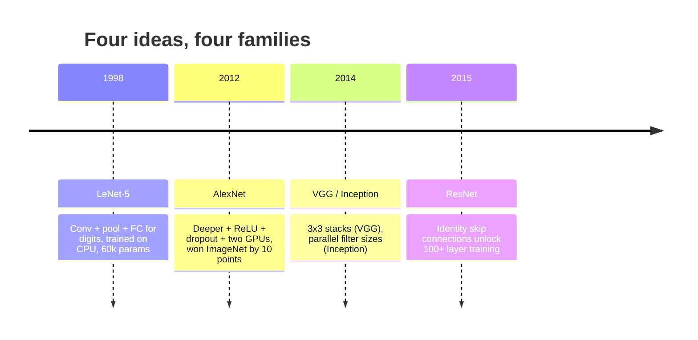
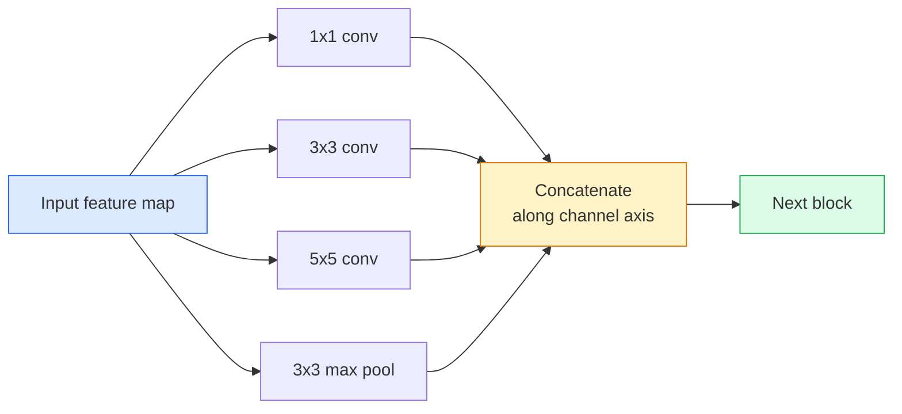
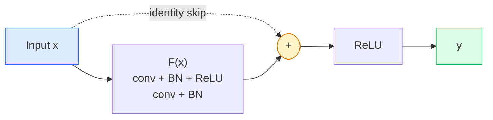

# CNN - LeNet đến ResNet

> Mọi CNN lớn trong ba mươi năm qua đều là cùng một công thức conv-phi tuyến tính-downsample với một ý tưởng mới được gắn kết. Tìm hiểu các ý tưởng theo thứ tự.

**Loại:** Tìm hiểu + Xây dựng
**Ngôn ngữ:** Python
**Kiến thức tiên quyết:** Giai đoạn 3 Bài 11 (PyTorch), Giai đoạn 4 Bài 01 (Kiến thức cơ bản về hình ảnh), Giai đoạn 4 Bài 02 (Tích chập từ đầu)
**Thời lượng:** ~75 phút

## Mục tiêu học tập

- Trace dòng kiến trúc LeNet-5 -> AlexNet -> VGG -> Inception -> ResNet và nêu ý tưởng mới duy nhất mà mỗi gia đình đóng góp
- Triển khai LeNet-5, một khối kiểu VGG và một ResNet BasicBlock trong PyTorch, mỗi khối dưới 40 dòng
- Giải thích lý do tại sao các kết nối còn lại biến mạng 1.000 lớp từ không thể huấn luyện thành hiện đại
- Đọc một đường trục hiện đại (ResNet-18, ResNet-50) và dự đoán hình dạng đầu ra, trường tiếp nhận và số lượng parameter của nó trước khi xem xét nguồn

## Vấn đề

Năm 2011, bộ phân loại ImageNet tốt nhất đạt khoảng 74% accuracy top 5. Năm 2012, AlexNet đạt 85%. Năm 2015, ResNet đạt 96%. Không có dữ liệu mới. Không có thế hệ GPU mới. Lợi ích đến từ ý tưởng kiến trúc. Một kỹ sư tầm nhìn làm việc phải biết ý tưởng nào đến từ tờ báo nào bởi vì mỗi xương sống production bạn ship vào năm 2026 là sự kết hợp lại của những phần tương tự - và bởi vì các ý tưởng tiếp tục chuyển giao: các convs được nhóm chuyển từ CNN sang transformers, các kết nối còn lại đi từ ResNet đến mọi LLM tồn tại batch bình thường hóa tồn tại trong models khuếch tán.

Nghiên cứu các mạng này theo thứ tự cũng giúp bạn tránh khỏi một sai lầm phổ biến: tiếp cận các model lớn nhất hiện có khi mạng có kích thước LeNet sẽ giải quyết vấn đề. MNIST không cần ResNet. Biết được đường cong tỷ lệ của mỗi gia đình cho bạn biết vị trí của nó.

## Khái niệm

### Bốn ý tưởng thay đổi tầm nhìn



Không có gì khác trong tầm nhìn cổ điển quan trọng bằng bốn bước nhảy này.

### LeNet-5 (1998) ·

Bộ nhận dạng chữ số của Yann LeCun. 60.000 parameters. Hai khối conv-pool, hai lớp được kết nối đầy đủ, kích hoạt tảnh. Nó xác định bản mẫu mà mọi CNN kế thừa:

```
input (1, 32, 32)
  conv 5x5 -> (6, 28, 28)
  avg pool 2x2 -> (6, 14, 14)
  conv 5x5 -> (16, 10, 10)
  avg pool 2x2 -> (16, 5, 5)
  flatten -> 400
  dense -> 120
  dense -> 84
  dense -> 10
```

Tất cả mọi thứ mà thế giới hiện đại gọi là CNN - xen kẽ các chập và lấy mẫu giảm cung cấp cho một đầu phân loại nhỏ - là LeNet với nhiều lớp hơn, kênh lớn hơn và kích hoạt tốt hơn.

### AlexNet (2012)

Ba thay đổi cùng nhau phá vỡ ImageNet:

1. **ReLU** thay vì Tanh. Gradients ngừng biến mất. Training tăng tốc lên gấp sáu lần.
2. **Dropout **trong đầu được kết nối hoàn toàn. Quy tắc hóa trở thành một lớp, không phải là một mánh khóe.
3. **Chiều sâu và chiều rộng**. Năm lớp conv, ba lớp dày đặc, 60M parameters, được huấn luyện trên hai GPUs với model chia ngang chúng.

Hình 2 của bài báo vẫn cho thấy sự phân tách GPU dưới dạng hai dòng song song. Sự song song đó là một giải pháp phần cứng, không phải là một cái nhìn sâu sắc về kiến trúc - nhưng ba ý tưởng trên vẫn còn trong mọi model bạn sử dụng.

### VGG (2014)

VGG hỏi: điều gì sẽ xảy ra nếu bạn chỉ sử dụng tích chập 3x3 và bạn đi sâu?

```
stack:   conv 3x3 -> conv 3x3 -> pool 2x2
repeat:  16 or 19 conv layers
```

Hai convs 3x3 nhìn thấy cùng một vùng đầu vào 5x5 như một conv 5x5 nhưng có ít parameters hơn (2*9*C^2 = 18C^2 vs 25*C^2) và thêm một ReLU ở giữa. VGG đã biến quan sát này thành một kiến trúc hoàn chỉnh. Sự đơn giản - một loại khối, lặp đi lặp lại - khiến nó trở thành điểm tham chiếu cho mọi thứ sau đó.

Chi phí: 138M parameters, huấn luyện chậm, đắt inference.

### Thành lập (2014, cùng năm)

Câu trả lời của Google cho câu hỏi "tôi nên sử dụng kích thước hạt nhân nào?" là: tất cả chúng, song song.



Mỗi branch chuyên biệt - 1x1 để trộn kênh, 3x3 cho kết cấu cục bộ, 5x5 cho các mẫu lớn hơn, gộp cho features bất biến dịch chuyển - và concat cho phép lớp tiếp theo chọn bất kỳ branch nào hữu ích. Inception v1 đã sử dụng tích chập 1x1 bên trong mỗi branch như một nút cổ chai để giữ cho số đếm parameter tỉnh táo.

### Vấn đề xuống cấp

Đến năm 2015, VGG-19 hoạt động còn VGG-32 thì không. Độ sâu được cho là sẽ hữu ích, nhưng qua ~20 lớp cả training và thử nghiệm loss trở nên tồi tệ hơn. Đó không phải là overfitting. Đó là công cụ tối ưu hóa không tìm thấy trọng lượng hữu ích vì gradients thu nhỏ nhân qua mỗi lớp.

```
Plain deep network:
  y = f_L( f_{L-1}( ... f_1(x) ... ) )

Gradient wrt early layer:
  dL/dW_1 = dL/dy * df_L/df_{L-1} * ... * df_2/df_1 * df_1/dW_1

Each multiplicative term has magnitude roughly (weight magnitude) * (activation gain).
Stack 100 of them with gains < 1 and the gradient is effectively zero.
```

VGG hoạt động ở 19 lớp vì batch chuẩn (được xuất bản đồng thời) giữ cho các hoạt động được mở rộng quy mô tốt. Nhưng ngay cả tiêu chuẩn batch cũng không thể cứu độ sâu vượt quá 30 lớp.

### ResNet (2015)

Ông, Trương, Nhậm, Tôn đã đề xuất một thay đổi để sửa chữa mọi thứ:

```
standard block:   y = F(x)
residual block:   y = F(x) + x
```

`+ x` có nghĩa là lớp luôn có thể chọn không làm gì bằng cách đưa `F(x)` về không. ResNet 1.000 lớp bây giờ nhiều nhất là tệ như mạng 1 lớp, bởi vì mỗi khối bổ sung đều có một cửa thoát tầm thường. Với sự đảm bảo đó, công cụ tối ưu hóa sẵn sàng làm cho mọi khối * một chút * hữu ích - và hơi hữu ích, xếp chồng lên nhau 100 lần, là hiện đại.



Hai biến thể của khối xuất hiện ở khắp mọi nơi:

- **BasicBlock** (ResNet-18, ResNet-34): hai convs 3x3, bỏ qua cả hai.
- **Nút thắt cổ chai **(ResNet-50, -101, -152): 1x1 xuống, 3x3 giữa, 1x1 lên, bỏ qua bộ ba. Rẻ hơn khi số lượng kênh cao.

Khi bỏ qua phải vượt qua một mẫu xuống (sải chân = 2), đường dẫn nhận dạng được thay thế bằng sải chân 1x1 = 2 chuyển đổi để khớp với các hình dạng.

### Tại sao dư lại quan trọng ngoài tầm nhìn

Ý tưởng không thực sự là về phân loại hình ảnh. Đó là về việc biến các mạng lưới sâu từ "bắt chéo ngón tay của bạn và hy vọng gradients tồn tại" thành một công cụ kỹ thuật đáng tin cậy, có thể mở rộng. Mỗi transformer bạn sẽ đọc về giai đoạn tiếp theo đều có kết nối bỏ qua giống hệt nhau trong mọi khối. Không có ResNet, không có GPT.

```figure
pooling
```

## Tự xây dựng

### Bước 1: LeNet-5

Một LeNet tối giản, trung thành. Kích hoạt Tánh, gộp trung bình. Sự nhượng bộ duy nhất cho tính hiện đại là chúng ta sử dụng `nn.CrossEntropyLoss` hạ lưu thay vì các kết nối Gaussian ban đầu.

```python
import torch
import torch.nn as nn
import torch.nn.functional as F

class LeNet5(nn.Module):
    def __init__(self, num_classes=10):
        super().__init__()
        self.conv1 = nn.Conv2d(1, 6, kernel_size=5)
        self.conv2 = nn.Conv2d(6, 16, kernel_size=5)
        self.pool = nn.AvgPool2d(2)
        self.fc1 = nn.Linear(16 * 5 * 5, 120)
        self.fc2 = nn.Linear(120, 84)
        self.fc3 = nn.Linear(84, num_classes)

    def forward(self, x):
        x = self.pool(torch.tanh(self.conv1(x)))
        x = self.pool(torch.tanh(self.conv2(x)))
        x = torch.flatten(x, 1)
        x = torch.tanh(self.fc1(x))
        x = torch.tanh(self.fc2(x))
        return self.fc3(x)

net = LeNet5()
x = torch.randn(1, 1, 32, 32)
print(f"output: {net(x).shape}")
print(f"params: {sum(p.numel() for p in net.parameters()):,}")
```

Sản lượng dự kiến: `output: torch.Size([1, 10])`, `params: 61,706`. Đó là toàn bộ bộ phân loại chữ số bắt đầu tầm nhìn hiện đại.

### Bước 2: Khối VGG

Một khối có thể tái sử dụng: hai 3x3 convs, ReLU, định mức batch, nhóm tối đa.

```python
class VGGBlock(nn.Module):
    def __init__(self, in_c, out_c):
        super().__init__()
        self.conv1 = nn.Conv2d(in_c, out_c, kernel_size=3, padding=1)
        self.bn1 = nn.BatchNorm2d(out_c)
        self.conv2 = nn.Conv2d(out_c, out_c, kernel_size=3, padding=1)
        self.bn2 = nn.BatchNorm2d(out_c)
        self.pool = nn.MaxPool2d(2)

    def forward(self, x):
        x = F.relu(self.bn1(self.conv1(x)))
        x = F.relu(self.bn2(self.conv2(x)))
        return self.pool(x)

class MiniVGG(nn.Module):
    def __init__(self, num_classes=10):
        super().__init__()
        self.stack = nn.Sequential(
            VGGBlock(3, 32),
            VGGBlock(32, 64),
            VGGBlock(64, 128),
        )
        self.head = nn.Sequential(
            nn.AdaptiveAvgPool2d(1),
            nn.Flatten(),
            nn.Linear(128, num_classes),
        )

    def forward(self, x):
        return self.head(self.stack(x))

net = MiniVGG()
x = torch.randn(1, 3, 32, 32)
print(f"output: {net(x).shape}")
print(f"params: {sum(p.numel() for p in net.parameters()):,}")
```

Ba khối VGG trên đầu vào có kích thước CIFAR, một nhóm thích ứng, một lớp tuyến tính. ~290k parameters. Rất nhiều cho CIFAR-10.

### Bước 3: ResNet BasicBlock

Khối xây dựng cốt lõi của ResNet-18 và ResNet-34.

```python
class BasicBlock(nn.Module):
    def __init__(self, in_c, out_c, stride=1):
        super().__init__()
        self.conv1 = nn.Conv2d(in_c, out_c, kernel_size=3, stride=stride, padding=1, bias=False)
        self.bn1 = nn.BatchNorm2d(out_c)
        self.conv2 = nn.Conv2d(out_c, out_c, kernel_size=3, stride=1, padding=1, bias=False)
        self.bn2 = nn.BatchNorm2d(out_c)
        if stride != 1 or in_c != out_c:
            self.shortcut = nn.Sequential(
                nn.Conv2d(in_c, out_c, kernel_size=1, stride=stride, bias=False),
                nn.BatchNorm2d(out_c),
            )
        else:
            self.shortcut = nn.Identity()

    def forward(self, x):
        out = F.relu(self.bn1(self.conv1(x)))
        out = self.bn2(self.conv2(out))
        out = out + self.shortcut(x)
        return F.relu(out)
```

`bias=False` trên các lớp conv là một quy ước batch - parameter beta của BN đã xử lý bias, vì vậy việc mang theo bias conv cũng là một sự lãng phí. `shortcut` chỉ cần một chuyển đổi thực sự khi sải chân hoặc số kênh thay đổi; nếu không thì đó là một danh tính không hoạt động.

### Bước 4: Một ResNet nhỏ

Stack bốn nhóm BasicBlocks để có được một ResNet hoạt động cho các đầu vào có kích thước CIFAR.

```python
class TinyResNet(nn.Module):
    def __init__(self, num_classes=10):
        super().__init__()
        self.stem = nn.Sequential(
            nn.Conv2d(3, 32, kernel_size=3, stride=1, padding=1, bias=False),
            nn.BatchNorm2d(32),
            nn.ReLU(inplace=True),
        )
        self.layer1 = self._make_group(32, 32, num_blocks=2, stride=1)
        self.layer2 = self._make_group(32, 64, num_blocks=2, stride=2)
        self.layer3 = self._make_group(64, 128, num_blocks=2, stride=2)
        self.layer4 = self._make_group(128, 256, num_blocks=2, stride=2)
        self.head = nn.Sequential(
            nn.AdaptiveAvgPool2d(1),
            nn.Flatten(),
            nn.Linear(256, num_classes),
        )

    def _make_group(self, in_c, out_c, num_blocks, stride):
        blocks = [BasicBlock(in_c, out_c, stride=stride)]
        for _ in range(num_blocks - 1):
            blocks.append(BasicBlock(out_c, out_c, stride=1))
        return nn.Sequential(*blocks)

    def forward(self, x):
        x = self.stem(x)
        x = self.layer1(x)
        x = self.layer2(x)
        x = self.layer3(x)
        x = self.layer4(x)
        return self.head(x)

net = TinyResNet()
x = torch.randn(1, 3, 32, 32)
print(f"output: {net(x).shape}")
print(f"params: {sum(p.numel() for p in net.parameters()):,}")
```

Bốn nhóm, mỗi nhóm hai khối. Sải bước 2 khi bắt đầu nhóm 2, 3, 4. Số kênh tăng gấp đôi ở mỗi lần xuống. Khoảng 2,8 triệu parameters. Đó là công thức tiêu chuẩn có thể mở rộng quy mô rõ ràng lên đến ResNet-152.

### Bước 5: So sánh hiệu quả parameter-feature

Chạy cùng một đầu vào qua cả ba mạng và so sánh số lượng parameter.

```python
def summary(name, net, x):
    y = net(x)
    params = sum(p.numel() for p in net.parameters())
    print(f"{name:12s}  input {tuple(x.shape)} -> output {tuple(y.shape)}  params {params:>10,}")

x = torch.randn(1, 3, 32, 32)
summary("LeNet5",     LeNet5(),       torch.randn(1, 1, 32, 32))
summary("MiniVGG",    MiniVGG(),      x)
summary("TinyResNet", TinyResNet(),   x)
```

Ba models, ba thời đại, ba bậc độ lớn trong parameter đếm. Đối với CIFAR-10 accuracy, bạn cần khoảng: LeNet 60%, MiniVGG 89%, TinyResNet 93% sau vài epochs training.

## Ứng dụng

`torchvision.models` cung cấp cho bạn pretrained phiên bản của tất cả những điều trên. Chữ ký cuộc gọi giống hệt nhau giữa các gia đình, đó chính xác là điểm trừu tượng xương sống.

```python
from torchvision.models import resnet18, ResNet18_Weights, vgg16, VGG16_Weights

r18 = resnet18(weights=ResNet18_Weights.IMAGENET1K_V1)
r18.eval()

print(f"ResNet-18 params: {sum(p.numel() for p in r18.parameters()):,}")
print(r18.layer1[0])
print()

v16 = vgg16(weights=VGG16_Weights.IMAGENET1K_V1)
v16.eval()
print(f"VGG-16   params: {sum(p.numel() for p in v16.parameters()):,}")
```

ResNet-18 có 11,7 triệu parameters. VGG-16 có 138 triệu. Tương tự ImageNet top 1 accuracy (69,8% so với 71,6%). Các kết nối còn lại mang lại cho bạn chiến thắng hiệu quả parameter gấp 12 lần. Đó là lý do tại sao các biến thể ResNet thống trị từ năm 2016 cho đến khi ViT xuất hiện vào năm 2021 - và vẫn thống trị các triển khai trong thế giới thực, nơi điện toán là hạn chế.

Đối với học chuyển giao, công thức luôn giống nhau: tải pretrained, đóng băng xương sống, thay đầu phân loại.

```python
for p in r18.parameters():
    p.requires_grad = False
r18.fc = nn.Linear(r18.fc.in_features, 10)
```

Ba dòng. Bây giờ bạn có một bộ phân loại CIFAR 10 class kế thừa các biểu diễn mà ImageNet đã trả tiền.

## Sản phẩm bàn giao

Bài học này tạo ra:

- `outputs/prompt-backbone-selector.md` - một prompt chọn đúng gia đình CNN (LeNet/VGG/ResNet/MobileNet/ConvNeXt) nhất định nhiệm vụ, kích thước dataset và ngân sách tính toán.
- `outputs/skill-residual-block-reviewer.md` — một skill đọc mô-đun PyTorch và gắn cờ các lỗi bỏ qua kết nối (thiếu phím tắt khi thay đổi sải chân, thứ tự kích hoạt phím tắt, vị trí BN liên quan đến phép cộng).

## Bài tập

1. **(Dễ)** Đếm parameters bằng tay cho `TinyResNet` từng lớp. So sánh với `sum(p.numel() for p in net.parameters())`. Phần lớn ngân sách parameter đi đâu - convs, BN hoặc người đứng đầu bộ phân loại?
2. **(Trung bình)** Triển khai khối Nút cổ chai (1x1 -> 3x3 -> 1x1 với bỏ qua) và sử dụng nó để xây dựng mạng kiểu ResNet-50 cho CIFAR. So sánh các tham số với `TinyResNet`.
3. **(Cứng) **Xóa kết nối bỏ qua khỏi `BasicBlock`, huấn luyện mạng "trơn" 34 khối và ResNet 34 khối trên CIFAR-10 trong 10 epochs mỗi mạng. Cốt truyện training loss vs epoch cho cả hai. Tái tạo He và cộng sự. Hình 1 kết quả trong đó mạng sâu đồng bằng hội tụ đến loss cao hơn so với cặp song sinh nông hơn của nó.

## Thuật ngữ chính

| Thuật ngữ | Những gì mọi người nói | Ý nghĩa thực sự của nó |
|------|----------------|----------------------|
| Xương sống | "Người model" | stack của các khối tích chập tạo ra bản đồ feature được đưa vào đầu nhiệm vụ |
| Kết nối còn lại | "Bỏ qua kết nối" | `y = F(x) + x`; cho phép trình tối ưu hóa tìm hiểu danh tính bằng cách đặt F thành không, điều này làm cho độ sâu tùy ý có thể huấn luyện được |
| Khối cơ bản | "Hai convs 3x3 với một lần bỏ qua" | Khối xây dựng ResNet-18/34: conv-BN-ReLU-conv-BN-add-ReLU |
| Nút thắt cổ chai | "1x1 xuống, 3x3, 1x1 lên" | Khối ResNet-50/101/152; rẻ ở số lượng kênh cao vì 3x3 chạy trên chiều rộng giảm |
| Vấn đề xuống cấp | "Sâu hơn là tồi tệ hơn" | Quá khứ ~20 lớp conv trơn, cả lỗi training và lỗi thử nghiệm đều tăng; được giải quyết bằng các kết nối còn lại, không phải bằng nhiều dữ liệu hơn |
| Thân cây | "Lớp đầu tiên" | Conv ban đầu chuyển đổi đầu vào 3 kênh thành chiều rộng feature cơ sở; thường là 7x7 sải chân 2 cho ImageNet, 3x3 sải chân 1 cho CIFAR |
| Cái đầu | "Bộ phân loại" | Các lớp sau khối xương sống cuối cùng: nhóm thích ứng, phẳng, tuyến tính |
| Chuyển giao học tập | "Pretrained trọng lượng" | Tải một đường trục được huấn luyện trên ImageNet và chỉ fine-tuning đầu vào nhiệm vụ của bạn |

## Đọc thêm

- [Deep Residual Learning for Image Recognition (He et al., 2015)](https://arxiv.org/abs/1512.03385) — bài báo ResNet; Mọi con số đều đáng để nghiên cứu
- [Very Deep Convolutional Networks (Simonyan & Zisserman, 2014)](https://arxiv.org/abs/1409.1556) — bài báo VGG; Vẫn là tài liệu tham khảo tốt nhất cho "Tại sao lại là 3x3"
- [ImageNet Classification with Deep CNNs (Krizhevsky et al., 2012)](https://papers.nips.cc/paper_files/paper/2012/hash/c399862d3b9d6b76c8436e924a68c45b-Abstract.html) - AlexNet; Giấy kết thúc kỷ nguyên feature thủ công
- [Going Deeper with Convolutions (Szegedy et al., 2014)](https://arxiv.org/abs/1409.4842) - Khởi đầu v1; Ý tưởng bộ lọc song song vẫn xuất hiện trong Vision transformers
