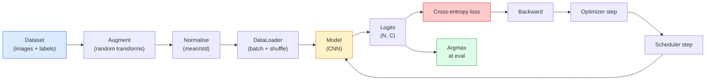

# Phân loại hình ảnh

> Bộ phân loại là một hàm từ pixel đến phân phối xác suất trên classes. Mọi thứ khác đều là hệ thống ống nước.

**Loại:** Xây dựng
**Ngôn ngữ:** Python
**Kiến thức tiên quyết:** Giai đoạn 2 Bài 09 (Đánh giá Model), Giai đoạn 3 Bài 10 (Framework nhỏ), Giai đoạn 4 Bài 03 (CNN)
**Thời lượng:** ~75 phút

## Mục tiêu học tập

- Xây dựng pipeline phân loại hình ảnh end-to-end trên CIFAR-10: dataset, tăng cường, model, vòng lặp training, đánh giá
- Giải thích vai trò của từng thành phần (dataloader, loss, optimizer, bộ lập lịch, tăng cường) và dự đoán việc phá vỡ bất kỳ thành phần nào trong số chúng biểu hiện như thế nào trong đường cong loss
- Thực hiện trộn, cắt và làm mịn nhãn từ đầu và biện minh khi mỗi loại đáng thêm vào
- Đọc ma trận nhầm lẫn và bảng mỗi class precision/recall để chẩn đoán các lỗi dataset và model ngoài tổng hợp accuracy

## Vấn đề

Mọi nhiệm vụ thị giác ships giảm xuống phân loại hình ảnh ở một mức độ nào đó. Phát hiện phân loại các khu vực. Phân đoạn phân loại pixel. Truy xuất xếp hạng theo sự tương đồng với class centroid. Phân loại đúng - vòng lặp dataset, policy tăng cường, loss, đánh giá - là skill chuyển sang mọi nhiệm vụ khác trong giai đoạn.

Hầu hết các lỗi phân loại không có trong model. Họ sống trong pipeline: chuẩn hóa gặp lỗi, tập training không xáo trộn, tăng cường bóp méo nhãn, phân chia xác thực bị ô nhiễm bởi dữ liệu training, learning rate âm thầm phân kỳ sau epoch 30. Một CNN đạt 93% trên CIFAR-10 với thiết lập chính xác thường đạt điểm 70-75% với một đường cong bị hỏng và đường cong loss có vẻ hợp lý trong suốt thời gian.

Bài học này nối dây toàn bộ pipeline bằng tay để mọi bộ phận đều có thể kiểm tra được. Bạn sẽ không sử dụng bất cứ thứ gì từ `torchvision.datasets` có thể che giấu lỗi.

## Khái niệm

### Phân loại pipeline



Mỗi dòng trong vòng lặp này là nơi một lỗi có thể tồn tại. Entropy chéo lấy logits thô, không phải đầu ra softmax, vì vậy bất kỳ `model(x).softmax()` nào trước loss đều lặng lẽ tính toán sai gradient. Tăng cường chỉ áp dụng cho đầu vào, không áp dụng cho nhãn - ngoại trừ hỗn hợp, kết hợp cả hai. `optimizer.zero_grad()` phải xảy ra một lần cho mỗi bước; bỏ qua nó tích tụ gradients và trông giống như một learning rate cực kỳ không ổn định. Mỗi lỗi đó làm phẳng đường cong học tập mà không gây ra lỗi.

### Entropy chéo, logits và softmax

Một bộ phân loại tạo ra `C` số cho mỗi hình ảnh được gọi là logits. Áp dụng softmax chuyển đổi chúng thành phân phối xác suất:

```
softmax(z)_i = exp(z_i) / sum_j exp(z_j)
```

Entropy chéo đo log probability âm của class đúng:

```
CE(z, y) = -log( softmax(z)_y )
        = -z_y + log( sum_j exp(z_j) )
```

Dạng bên phải là dạng ổn định về mặt số (log-sum-exp). `nn.CrossEntropyLoss` của PyTorch hợp nhất softmax + NLL trong một op và lấy trực tiếp logits thô. Áp dụng softmax bản thân trước hầu như luôn là một lỗi - bạn tính toán log(softmax(softmax(z))), một đại lượng vô nghĩa.

### Tại sao tăng cường hoạt động

CNN có bias quy nạp để dịch (từ chia sẻ trọng lượng) nhưng không có bất biến tích hợp đối với crop, lật, jitter màu sắc hoặc che khuất. Cách duy nhất để dạy nó những bất biến đó là hiển thị cho nó các pixel thực hiện chúng. Mỗi lần biến đổi ngẫu nhiên trong quá trình training là một cách nói: "hai hình ảnh này có cùng một nhãn; học features bỏ qua sự khác biệt."

```
Original crop:  "dog facing left"
Flip:           "dog facing right"       <- same label, different pixels
Rotate(+15):    "dog, slight tilt"
Colour jitter:  "dog in warmer light"
RandomErasing:  "dog with patch missing"
```

Quy tắc: tăng cường phải giữ gìn nhãn. Cắt và xoay trên một chữ số có thể lật "6" thành "9"; Đối với dataset đó, bạn sử dụng phạm vi xoay nhỏ hơn và chọn các bổ sung tôn trọng các bất biến cụ thể của chữ số.

### Trộn và cắt

Tăng cường thông thường biến đổi pixel nhưng giữ cho nhãn một nóng. **Mixup** và **cutmix** phá vỡ điều đó bằng cách nội suy cả hai.

```
Mixup:
  lambda ~ Beta(a, a)
  x = lambda * x_i + (1 - lambda) * x_j
  y = lambda * y_i + (1 - lambda) * y_j

Cutmix:
  paste a random rectangle of x_j into x_i
  y = area-weighted mix of y_i and y_j
```

Tại sao nó hữu ích: model ngừng ghi nhớ các mục tiêu một nóng gai và học cách nội suy giữa các classes. Training loss đi lên, thử nghiệm accuracy đi lên. Đây là bản nâng cấp độ bền rẻ nhất duy nhất cho bất kỳ bộ phân loại nào.

### Làm mịn nhãn

Một người anh em họ của sự trộn lẫn. Thay vì training chống lại `[0, 0, 1, 0, 0]`, hãy tập luyện với `[eps/C, eps/C, 1-eps, eps/C, eps/C]` với một `eps` nhỏ như 0,1. Ngăn model tạo ra logits sắc nét tùy ý và cải thiện hiệu chuẩn hầu như miễn phí. Được tích hợp vào `nn.CrossEntropyLoss(label_smoothing=0.1)` từ PyTorch 1.10.

### Đánh giá ngoài accuracy

Tổng accuracy che giấu sự mất cân bằng. Một bộ phân loại nhị phân 90-10 luôn dự đoán đa số class điểm 90%. Các công cụ thực sự cho bạn biết điều gì đang xảy ra:

- **Mỗi class accuracy** — một số mỗi class; ngay lập tức xuất hiện các danh mục hoạt động kém hiệu quả.
- **Ma trận nhầm lẫn** — Lưới C x C với hàng i col j = số lượng class thực i dự đoán là class j; đường chéo là chính xác, các đường chéo lệch là nơi model bạn sống.
- **Top-1 / Top-5** — liệu class chính xác nằm trong top 1 hay top 5 dự đoán; Top 5 quan trọng đối với ImageNet vì classes như "Norwich terrier" và "Norfolk terrier" thực sự mơ hồ.
- **Hiệu chuẩn (ECE)** — dự đoán độ tin cậy 0,8 có đúng 80% thời gian không? Các mạng hiện đại quá tự tin một cách có hệ thống; Sửa chữa bằng temperature tỷ lệ hoặc làm mịn nhãn.

```figure
receptive-field
```

## Tự xây dựng

### Bước 1: Một dataset tổng hợp xác định

CIFAR-10 sống trên đĩa. Để làm cho bài học này có thể tái tạo và nhanh chóng, chúng tôi xây dựng một dataset tổng hợp trông giống như CIFAR - hình ảnh RGB 32x32 với cấu trúc class cụ thể mà model phải học. Chính xác pipeline hoạt động không thay đổi trên CIFAR-10 thực.

```python
import numpy as np
import torch
from torch.utils.data import Dataset


def synthetic_cifar(num_per_class=1000, num_classes=10, seed=0):
    rng = np.random.default_rng(seed)
    X = []
    Y = []
    for c in range(num_classes):
        centre = rng.uniform(0, 1, (3,))
        freq = 2 + c
        for _ in range(num_per_class):
            yy, xx = np.meshgrid(np.linspace(0, 1, 32), np.linspace(0, 1, 32), indexing="ij")
            r = np.sin(xx * freq) * 0.5 + centre[0]
            g = np.cos(yy * freq) * 0.5 + centre[1]
            b = (xx + yy) * 0.5 * centre[2]
            img = np.stack([r, g, b], axis=-1)
            img += rng.normal(0, 0.08, img.shape)
            img = np.clip(img, 0, 1)
            X.append(img.astype(np.float32))
            Y.append(c)
    X = np.stack(X)
    Y = np.array(Y)
    idx = rng.permutation(len(X))
    return X[idx], Y[idx]


class ArrayDataset(Dataset):
    def __init__(self, X, Y, transform=None):
        self.X = X
        self.Y = Y
        self.transform = transform

    def __len__(self):
        return len(self.X)

    def __getitem__(self, i):
        img = self.X[i]
        if self.transform is not None:
            img = self.transform(img)
        img = torch.from_numpy(img).permute(2, 0, 1)
        return img, int(self.Y[i])
```

Mỗi class có bảng màu và mẫu tần số riêng, cộng với nhiễu Gaussian để buộc model học tín hiệu thay vì ghi nhớ các pixel. Mười classes, mỗi người một nghìn hình ảnh, hoán vị.

### Bước 2: Chuẩn hóa và tăng cường

Cả hai biến đổi mà mọi tầm nhìn pipeline có.

```python
def standardize(mean, std):
    mean = np.array(mean, dtype=np.float32)
    std = np.array(std, dtype=np.float32)
    def _fn(img):
        return (img - mean) / std
    return _fn


def random_hflip(p=0.5):
    def _fn(img):
        if np.random.random() < p:
            return img[:, ::-1, :].copy()
        return img
    return _fn


def random_crop(pad=4):
    def _fn(img):
        h, w = img.shape[:2]
        padded = np.pad(img, ((pad, pad), (pad, pad), (0, 0)), mode="reflect")
        y = np.random.randint(0, 2 * pad)
        x = np.random.randint(0, 2 * pad)
        return padded[y:y + h, x:x + w, :]
    return _fn


def compose(*fns):
    def _fn(img):
        for fn in fns:
            img = fn(img)
        return img
    return _fn
```

Reflect-pad trước khi cắt, không phải zero-pad, bởi vì đường viền màu đen là một tín hiệu mà model sẽ học cách bỏ qua theo cách không hữu ích.

### Bước 3: Trộn

Trộn hai hình ảnh và hai nhãn bên trong bước training. Được thực hiện như một biến đổi batch nên nó nằm bên cạnh forward pass chứ không phải bên trong dataset.

```python
def mixup_batch(x, y, num_classes, alpha=0.2):
    if alpha <= 0:
        return x, torch.nn.functional.one_hot(y, num_classes).float()
    lam = float(np.random.beta(alpha, alpha))
    idx = torch.randperm(x.size(0), device=x.device)
    x_mixed = lam * x + (1 - lam) * x[idx]
    y_onehot = torch.nn.functional.one_hot(y, num_classes).float()
    y_mixed = lam * y_onehot + (1 - lam) * y_onehot[idx]
    return x_mixed, y_mixed


def soft_cross_entropy(logits, soft_targets):
    log_probs = torch.log_softmax(logits, dim=-1)
    return -(soft_targets * log_probs).sum(dim=-1).mean()
```

`soft_cross_entropy` là entropy chéo chống lại phân phối nhãn mềm. Nó giảm xuống trường hợp một nóng thông thường khi mục tiêu chính xác là một nóng.

### Bước 4: Vòng lặp training

Công thức hoàn chỉnh: một lần truyền dữ liệu, gradients một lần mỗi batch, bộ lập lịch bước một lần mỗi epoch.

```python
import torch
import torch.nn as nn
from torch.utils.data import DataLoader
from torch.optim import SGD
from torch.optim.lr_scheduler import CosineAnnealingLR

def train_one_epoch(model, loader, optimizer, device, num_classes, use_mixup=True):
    model.train()
    total, correct, loss_sum = 0, 0, 0.0
    for x, y in loader:
        x, y = x.to(device), y.to(device)
        if use_mixup:
            x_m, y_soft = mixup_batch(x, y, num_classes)
            logits = model(x_m)
            loss = soft_cross_entropy(logits, y_soft)
        else:
            logits = model(x)
            loss = nn.functional.cross_entropy(logits, y, label_smoothing=0.1)
        optimizer.zero_grad()
        loss.backward()
        optimizer.step()
        loss_sum += loss.item() * x.size(0)
        total += x.size(0)
        # Training accuracy vs the un-mixed labels `y` is only an approximation
        # when mixup is on (the model saw soft targets, not y). Treat it as a
        # rough progress signal; rely on val accuracy for real performance.
        with torch.no_grad():
            pred = logits.argmax(dim=-1)
            correct += (pred == y).sum().item()
    return loss_sum / total, correct / total


@torch.no_grad()
def evaluate(model, loader, device, num_classes):
    model.eval()
    total, correct = 0, 0
    loss_sum = 0.0
    cm = torch.zeros(num_classes, num_classes, dtype=torch.long)
    for x, y in loader:
        x, y = x.to(device), y.to(device)
        logits = model(x)
        loss = nn.functional.cross_entropy(logits, y)
        pred = logits.argmax(dim=-1)
        for t, p in zip(y.cpu(), pred.cpu()):
            cm[t, p] += 1
        loss_sum += loss.item() * x.size(0)
        total += x.size(0)
        correct += (pred == y).sum().item()
    return loss_sum / total, correct / total, cm
```

Năm bất biến bạn kiểm tra mỗi khi bạn viết một vòng lặp training:

1. `model.train()` trước khi training, `model.eval()` trước khi đánh giá - lật ngược hành vi dropout và batchnorm.
2. `.zero_grad()` trước `.backward()`.
3. `.item()` khi tích lũy các chỉ số nên không có gì giữ cho biểu đồ tính toán tồn tại.
4. `@torch.no_grad()` trong quá trình đánh giá - tiết kiệm bộ nhớ và thời gian, ngăn ngừa tai nạn tinh tế.
5. Argmax chống lại logits thô, không phải softmax - cùng một kết quả, ít hơn một op.

### Bước 5: Kết hợp nó lại với nhau

Sử dụng `TinyResNet` từ bài trước, tập luyện trong vài epochs, đánh giá.

```python
from main import synthetic_cifar, ArrayDataset
from main import standardize, random_hflip, random_crop, compose
from main import mixup_batch, soft_cross_entropy
from main import train_one_epoch, evaluate
# TinyResNet comes from the previous lesson (03-cnns-lenet-to-resnet).
# Adjust the import path to wherever you stored the previous lesson's code.
from cnns_lenet_to_resnet import TinyResNet  # example placeholder

X, Y = synthetic_cifar(num_per_class=500)
split = int(0.9 * len(X))
X_train, Y_train = X[:split], Y[:split]
X_val, Y_val = X[split:], Y[split:]

mean = [0.5, 0.5, 0.5]
std = [0.25, 0.25, 0.25]
train_tf = compose(random_hflip(), random_crop(pad=4), standardize(mean, std))
eval_tf = standardize(mean, std)

train_ds = ArrayDataset(X_train, Y_train, transform=train_tf)
val_ds = ArrayDataset(X_val, Y_val, transform=eval_tf)

train_loader = DataLoader(train_ds, batch_size=128, shuffle=True, num_workers=0)
val_loader = DataLoader(val_ds, batch_size=256, shuffle=False, num_workers=0)

device = "cuda" if torch.cuda.is_available() else "cpu"
model = TinyResNet(num_classes=10).to(device)
optimizer = SGD(model.parameters(), lr=0.1, momentum=0.9, weight_decay=5e-4, nesterov=True)
scheduler = CosineAnnealingLR(optimizer, T_max=10)

for epoch in range(10):
    tr_loss, tr_acc = train_one_epoch(model, train_loader, optimizer, device, 10, use_mixup=True)
    va_loss, va_acc, _ = evaluate(model, val_loader, device, 10)
    scheduler.step()
    print(f"epoch {epoch:2d}  lr {scheduler.get_last_lr()[0]:.4f}  "
          f"train {tr_loss:.3f}/{tr_acc:.3f}  val {va_loss:.3f}/{va_acc:.3f}")
```

Trên dataset tổng hợp, điều này đạt được xác nhận gần như hoàn hảo accuracy trong vòng năm epochs, đó là vấn đề: pipeline đúng, model có thể học được những gì có thể học được. Hoán đổi dataset cho CIFAR-10 thực và cùng một vòng lặp đoàn tàu đến ~90% mà không cần thay đổi.

### Bước 6: Đọc ma trận nhầm lẫn

Một mình Accuracy không bao giờ cho bạn biết model đang thất bại ở đâu. Ma trận nhầm lẫn có.

```python
def print_confusion(cm, labels=None):
    c = cm.shape[0]
    labels = labels or [str(i) for i in range(c)]
    print(f"{'':>6}" + "".join(f"{l:>5}" for l in labels))
    for i in range(c):
        row = cm[i].tolist()
        print(f"{labels[i]:>6}" + "".join(f"{v:>5}" for v in row))
    print()
    tp = cm.diag().float()
    fp = cm.sum(dim=0).float() - tp
    fn = cm.sum(dim=1).float() - tp
    prec = tp / (tp + fp).clamp_min(1)
    rec = tp / (tp + fn).clamp_min(1)
    f1 = 2 * prec * rec / (prec + rec).clamp_min(1e-9)
    for i in range(c):
        print(f"{labels[i]:>6}  prec {prec[i]:.3f}  rec {rec[i]:.3f}  f1 {f1[i]:.3f}")

_, _, cm = evaluate(model, val_loader, device, 10)
print_confusion(cm)
```

Hàng là đúng classes, cột là dự đoán. Một cụm số đếm lệch đường chéo giữa classes 3 và 5 có nghĩa là model nhầm lẫn hai số này và cung cấp cho bạn điểm khởi đầu để thu thập dữ liệu được nhắm mục tiêu hoặc tăng cường cụ thể cho class.

## Ứng dụng

`torchvision` gói mọi thứ trên thành các thành phần. Đối với CIFAR-10 thực sự, pipeline đầy đủ là bốn dòng cộng với một vòng lặp training.

```python
from torchvision.datasets import CIFAR10
from torchvision.transforms import Compose, RandomCrop, RandomHorizontalFlip, ToTensor, Normalize

mean = (0.4914, 0.4822, 0.4465)
std = (0.2470, 0.2435, 0.2616)
train_tf = Compose([
    RandomCrop(32, padding=4, padding_mode="reflect"),
    RandomHorizontalFlip(),
    ToTensor(),
    Normalize(mean, std),
])
eval_tf = Compose([ToTensor(), Normalize(mean, std)])

train_ds = CIFAR10(root="./data", train=True,  download=True, transform=train_tf)
val_ds   = CIFAR10(root="./data", train=False, download=True, transform=eval_tf)
```

Hai điều cần lưu ý: mean/std là **dataset cụ thể** - được tính toán trên bộ training CIFAR-10, không phải ImageNet - và tấm phản xạ là policy cắt mặc định của cộng đồng. Sao chép-dán số liệu thống kê của ImageNet ở đây là một rò rỉ ~1% accuracy mà không ai phát hiện cho đến khi ai đó lập hồ sơ model.

## Sản phẩm bàn giao

Bài học này tạo ra:

- `outputs/prompt-classifier-pipeline-auditor.md` - một prompt kiểm tra training script cho năm bất biến ở trên và hiển thị vi phạm đầu tiên.
- `outputs/skill-classification-diagnostics.md` — một skill, với ma trận nhầm lẫn và danh sách các tên class, tóm tắt các lỗi trên mỗi class và đề xuất cách khắc phục có tác động nhất.

## Bài tập

1. **(Dễ dàng) **Huấn luyện cùng một model có và không có hỗn hợp trong năm epochs trên dataset tổng hợp. Cốt truyện tàu hỏa và val loss cho cả hai. Giải thích lý do tại sao huấn luyện loss có mixup cao hơn nhưng val accuracy tương tự hoặc tốt hơn.
2. **(Trung bình) **Triển khai Cutout - loại bỏ một hình vuông 8x8 ngẫu nhiên trong mỗi hình ảnh training - và chạy cắt bỏ so với không tăng cường, hflip + cắt, hflip + cắt + cắt, hflip + cắt + trộn lẫn. Báo cáo giá trị accuracy cho từng loại.
3. **(Cứng)** Xây dựng pipeline CIFAR-100 (100 classes, cùng kích thước đầu vào) và tái tạo chạy training ResNet-34 trong vòng 1% accuracy đã xuất bản. Bổ sung: quét ba tốc độ học tập và hai lần giảm trọng lượng, đăng nhập vào CSV cục bộ, tạo bảng nhầm lẫn-ma trận-nhầm lẫn cuối cùng.

## Thuật ngữ chính

| Thuật ngữ | Những gì mọi người nói | Ý nghĩa thực sự của nó |
|------|----------------|----------------------|
| Logits | "Đầu ra thô" | Việc softmax vector trước số C trên mỗi hình ảnh; entropy chéo mong đợi những giá trị này, không phải giá trị tối đa mềm |
| Entropy chéo | "Người loss" | Xác suất log âm của class chính xác; kết hợp log-softmax và NLL trong một hoạt động ổn định |
| DataLoader | "Người trộn" | Bọc một dataset bằng cách xáo trộn, trộn và tải nhiều worker (tùy chọn); bị đổ lỗi cho một nửa số lỗi training |
| Tăng cường | "Biến đổi ngẫu nhiên" | Bất kỳ phép biến đổi cấp pixel nào tại training thời điểm giữ nguyên nhãn; dạy các bất biến mà CNN không có bản địa |
| Trộn / Cắt | "Trộn hai hình ảnh" | Kết hợp cả đầu vào và nhãn để bộ phân loại học nội suy mượt mà thay vì ranh giới cứng |
| Làm mịn nhãn | "Mục tiêu mềm hơn" | Thay thế một nóng bằng (1-eps, eps/(C-1), ...); cải thiện hiệu chuẩn và tăng nhẹ accuracy |
| Top-k accuracy | "Top-5" | Các class chính xác nằm trong k dự đoán xác suất cao nhất; được sử dụng trên datasets với classes thực sự mơ hồ |
| Ma trận nhầm lẫn | "Nơi có lỗi" | Bảng C x C trong đó mục nhập (i, j) đếm hình ảnh của class thực i dự đoán là j; Đường chéo là bên phải, đường chéo cho bạn biết những gì cần sửa chữa |

## Đọc thêm

- [CS231n: Training Neural Networks](https://cs231n.github.io/neural-networks-3/) - vẫn là chuyến tham quan rõ ràng nhất của training pipeline trong một trang duy nhất
- [Bag of Tricks for Image Classification (He et al., 2019)](https://arxiv.org/abs/1812.01187) - mọi thủ thuật nhỏ cùng nhau thêm 3-4% vào accuracy ResNet trên ImageNet
- [mixup: Beyond Empirical Risk Minimization (Zhang et al., 2017)](https://arxiv.org/abs/1710.09412) - giấy trộn ban đầu; ba trang lý thuyết cộng với các thí nghiệm thuyết phục
- [Why temperature scaling matters (Guo et al., 2017)](https://arxiv.org/abs/1706.04599) - bài báo chứng minh các mạng hiện đại đã được hiệu chỉnh sai và sửa chữa nó bằng một parameter vô hướng
