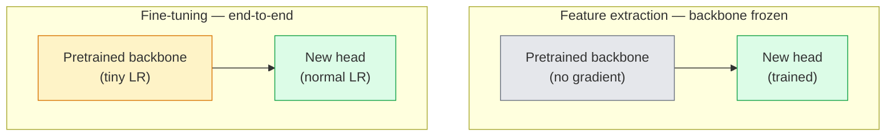

# Chuyển tiếp Học tập & Fine-Tuning

> Một người khác đã dành một triệu GPU giờ để dạy một mạng lưới các cạnh, kết cấu và các bộ phận đối tượng trông như thế nào. Bạn nên mượn những features đó trước khi training của riêng bạn.

**Loại:** Xây dựng
**Ngôn ngữ:** Python
**Kiến thức tiên quyết:** Giai đoạn 4 Bài 03 (CNN), Giai đoạn 4 Bài 04 (Phân loại hình ảnh)
**Thời lượng:** ~75 phút

## Mục tiêu học tập

- Phân biệt trích xuất feature với fine-tuning và chọn loại phù hợp dựa trên kích thước dataset, khoảng cách miền và ngân sách tính toán
- Tải một đường trục pretrained, thay thế đầu phân loại của nó và chỉ huấn luyện đầu đến đường cơ sở hoạt động dưới 20 dòng
- Dần dần giải phóng các lớp với tốc độ học tập phân biệt để các features chung sớm nhận được các bản cập nhật nhỏ hơn so với các lớp cụ thể về nhiệm vụ muộn
- Chẩn đoán ba lỗi phổ biến: feature trôi dạt từ LR quá cao trên các khối không bị đóng băng, thống kê BN sụp đổ trên datasets nhỏ và quên thảm khốc

## Vấn đề

Training ResNet-50 trên ImageNet có giá khoảng 2.000 GPU giờ. Rất ít nhóm có ngân sách đó cho mọi nhiệm vụ mà họ ship. Điều mà hầu hết mọi nhóm thực sự ships là một xương sống pretrained với một người đứng đầu mới được huấn luyện trên vài trăm hoặc vài nghìn hình ảnh cụ thể.

Đây không phải là một lối tắt. Khối conv đầu tiên của bất kỳ CNN nào được huấn luyện bởi ImageNet sẽ học các cạnh và các bộ lọc giống Gabor. Một vài khối tiếp theo học kết cấu và họa tiết đơn giản. Các khối giữa học các bộ phận của đối tượng. Các khối cuối cùng học các kết hợp bắt đầu trông giống như 1.000 danh mục ImageNet. 90% đầu tiên của hệ thống phân cấp đó chuyển gần như không thay đổi sang hình ảnh y tế, kiểm tra công nghiệp, dữ liệu vệ tinh và mọi nhiệm vụ thị giác khác - bởi vì thiên nhiên có vốn từ vựng hạn chế về các cạnh và kết cấu. 10% cuối cùng là những gì bạn thực sự tập luyện.

Chuyển đúng có ba lỗi đang chờ bạn: phá hủy pretrained features với learning rate quá cao, bỏ đói model thông tin bằng cách đóng băng quá nhiều và để số liệu thống kê chạy của BatchNorm trôi dạt về một dataset nhỏ mà rest của mạng không bao giờ học được. Bài học này hướng dẫn mỗi người trong số họ một cách có chủ đích.

## Khái niệm

### Trích xuất Feature so với fine-tuning

Hai chế độ, được chọn bởi mức độ tin tưởng của pretrained features và lượng dữ liệu bạn có.



Quy tắc ngón tay cái:

| Kích thước Dataset | Khoảng cách miền | Công thức |
|--------------|-----------------|--------|
| < 1k hình ảnh | gần ImageNet | Đóng băng xương sống, chỉ đầu tàu |
| 1K-10K | Đóng | Đông lạnh 2-3 giai đoạn đầu tiên, fine-tune rest |
| 10K-100K | bất kỳ | Fine-tune đầu cuối với LR phân biệt đối xử |
| 100 nghìn + | xa | Fine-tune mọi thứ; Cân nhắc training từ đầu nếu tên miền đủ xa |

"Gần với ImageNet" đại khái có nghĩa là ảnh RGB tự nhiên với nội dung giống như đối tượng. Chụp CT y tế, hình ảnh vệ tinh trên cao và kính hiển vi là những lĩnh vực xa xôi - features vẫn hữu ích, nhưng bạn sẽ cần để nhiều lớp thích ứng hơn.

### Tại sao đông lạnh hoạt động

ImageNet features CNN biết được không chuyên biệt về 1.000 danh mục. Chúng chuyên về số liệu thống kê hình ảnh tự nhiên: các cạnh ở các hướng cụ thể, kết cấu, mẫu tương phản, hình dạng primitives. Những số liệu thống kê đó ổn định trên hầu hết mọi miền hình ảnh mà con người có thể đặt tên. Đó là lý do tại sao một model được huấn luyện trên ImageNet và đánh giá zero-shot trên CIFAR-10 chỉ với một đầu tuyến tính mới (không fine-tuning xương sống) đạt 80%+ accuracy. Người đứng đầu đang học features nào đã học để cân cho nhiệm vụ này.

### Tỷ lệ học tập phân biệt đối xử

Khi bạn giải phóng, các lớp sớm sẽ huấn luyện chậm hơn các lớp muộn. Các lớp ban đầu mã hóa các features chung mà bạn muốn bảo tồn; Các lớp muộn mã hóa cấu trúc cụ thể của nhiệm vụ mà bạn cần di chuyển nhiều.

```
Typical recipe:

  stage 0 (stem + first group): lr = base_lr / 100    (mostly fixed)
  stage 1:                       lr = base_lr / 10
  stage 2:                       lr = base_lr / 3
  stage 3 (last backbone group): lr = base_lr
  head:                          lr = base_lr  (or slightly higher)
```

Trong PyTorch đây chỉ là danh sách các nhóm parameter được chuyển cho optimizer. Một model, năm tỷ lệ học tập, không có mã phụ.

### Vấn đề BatchNorm

Các lớp BN chứa các bộ đệm `running_mean` và `running_var` được tính toán trên ImageNet. Nếu tác vụ của bạn có sự phân bố pixel khác nhau - ánh sáng khác nhau, cảm biến khác nhau, không gian màu khác nhau - những bộ đệm đó sai. Ba tùy chọn theo thứ tự ưu tiên:

1. **Fine-tune với BN ở chế độ tàu hỏa.** Hãy để BN cập nhật số liệu thống kê chạy cùng với mọi thứ khác. Lựa chọn mặc định khi dataset tác vụ có kích thước trung bình (>= 5k ví dụ).
2. **Đóng băng BN ở chế độ đánh giá.** Giữ số liệu thống kê ImageNet và chỉ tập tạ. Sửa khi dataset của bạn đủ nhỏ để đường trung bình động của BN sẽ bị nhiễu.
3. **Thay thế BN bằng GroupNorm.** Loại bỏ hoàn toàn bài toán trung bình động. Được sử dụng trong các xương sống phát hiện và phân đoạn trong đó kích thước batch trên mỗi GPU rất nhỏ.

Làm sai điều này sẽ âm thầm tăng accuracy 5-15%.

### Thiết kế đầu

Đầu phân loại là 1-3 lớp tuyến tính cộng với một dropout tùy chọn. Mỗi đường trục torchvision ships một đầu mặc định mà bạn thay thế:

```
backbone.fc = nn.Linear(backbone.fc.in_features, num_classes)          # ResNet
backbone.classifier[1] = nn.Linear(..., num_classes)                    # EfficientNet, MobileNet
backbone.heads.head = nn.Linear(..., num_classes)                       # torchvision ViT
```

Đối với datasets nhỏ, một lớp tuyến tính duy nhất thường là đủ. Thêm một lớp ẩn (Linear -> ReLU -> Dropout -> Linear) sẽ giúp ích khi phân phối tác vụ xa hơn so với phân phối training của đường trục

### Phân rã LR theo lớp

Một phiên bản mượt mà hơn của LR phân biệt được sử dụng trong các fine-tuning hiện đại (các tinh chỉnh BEiT, DINOv2, ViT-B). Thay vì nhóm các layer thành các giai đoạn, hãy cung cấp cho mỗi layer một LR nhỏ hơn một chút so với LR phía trên nó:

```
lr_layer_k = base_lr * decay^(L - k)
```

Với phân rã = 0,75 và L = 12 khối transformer, khối đầu tiên huấn luyện ở `0.75^11 ≈ 0.04x` LR của đầu. Quan trọng hơn đối với các tinh chỉnh transformer hơn là đối với CNN, nơi các LR được nhóm theo sân khấu thường là đủ.

### Đánh giá những gì

Các lần chạy chuyển tiếp cần hai con số mà bạn sẽ không theo dõi khi chạy cào:

- **accuracy chỉ Pretrained **- accuracy đầu với xương sống bị đóng băng. Đây là tầng của bạn.
- **Fine-tuned accuracy **- model tương tự sau training đầu cuối. Đây là trần nhà của bạn.

Nếu fine-tuned chỉ dưới pretrained, bạn có lỗi tốc độ học hoặc BN. Luôn in cả hai.

## Tự xây dựng

### Bước 1: Tải đường trục pretrained và kiểm tra nó

```python
import torch
import torch.nn as nn
from torchvision.models import resnet18, ResNet18_Weights

backbone = resnet18(weights=ResNet18_Weights.IMAGENET1K_V1)
print(backbone)
print()
print("classifier head:", backbone.fc)
print("feature dim:", backbone.fc.in_features)
```

`ResNet18` có bốn giai đoạn (`layer1..layer4`) cộng với một thân và một đầu `fc`. Mỗi đường trục phân loại torchvision đều có cấu trúc tương tự.

### Bước 2: Feature chiết xuất - đông lạnh mọi thứ, thay đầu

```python
def make_feature_extractor(num_classes=10):
    model = resnet18(weights=ResNet18_Weights.IMAGENET1K_V1)
    for p in model.parameters():
        p.requires_grad = False
    model.fc = nn.Linear(model.fc.in_features, num_classes)
    return model

model = make_feature_extractor(num_classes=10)
trainable = sum(p.numel() for p in model.parameters() if p.requires_grad)
frozen = sum(p.numel() for p in model.parameters() if not p.requires_grad)
print(f"trainable: {trainable:>10,}")
print(f"frozen:    {frozen:>10,}")
```

Chỉ có `model.fc` mới có thể huấn luyện được. Xương sống là một máy chiết xuất feature đông lạnh.

### Bước 3: Phân biệt đối xử fine-tuning

Một tiện ích xây dựng các nhóm parameter với tốc độ học tập theo giai đoạn cụ thể.

```python
def discriminative_param_groups(model, base_lr=1e-3, decay=0.3):
    stages = [
        ["conv1", "bn1"],
        ["layer1"],
        ["layer2"],
        ["layer3"],
        ["layer4"],
        ["fc"],
    ]
    groups = []
    for i, names in enumerate(stages):
        lr = base_lr * (decay ** (len(stages) - 1 - i))
        params = [p for n, p in model.named_parameters()
                  if any(n.startswith(k) for k in names)]
        if params:
            groups.append({"params": params, "lr": lr, "name": "_".join(names)})
    return groups

model = resnet18(weights=ResNet18_Weights.IMAGENET1K_V1)
model.fc = nn.Linear(model.fc.in_features, 10)
for p in model.parameters():
    p.requires_grad = True

groups = discriminative_param_groups(model)
for g in groups:
    print(f"{g['name']:>10s}  lr={g['lr']:.2e}  params={sum(p.numel() for p in g['params']):>8,}")
```

`decay=0.3` có nghĩa là mỗi giai đoạn huấn luyện với tốc độ 30% so với giai đoạn tiếp theo. `fc` trở nên `base_lr`, `layer4` `0.3 * base_lr` `conv1` `0.3^5 * base_lr ≈ 0.00243 * base_lr`. Âm thanh cực cao; về mặt kinh nghiệm nó hoạt động.

### Bước 4: Xử lý BatchNorm

Người trợ giúp đóng băng số liệu thống kê chạy BN mà không đóng băng trọng số của nó.

```python
def freeze_bn_stats(model):
    for m in model.modules():
        if isinstance(m, (nn.BatchNorm1d, nn.BatchNorm2d, nn.BatchNorm3d)):
            m.eval()
            for p in m.parameters():
                p.requires_grad = False
    return model
```

Gọi nó sau khi bạn đặt `model.train()` vào đầu mỗi epoch. `model.train()` lật mọi thứ sang chế độ training; điều này chỉ đảo ngược nó đối với các lớp BN.

### Bước 5: Vòng lặp fine-tuning đầu cuối tối thiểu

```python
from torch.optim import SGD
from torch.utils.data import DataLoader
from torch.optim.lr_scheduler import CosineAnnealingLR
import torch.nn.functional as F

def fine_tune(model, train_loader, val_loader, device, epochs=5, base_lr=1e-3, freeze_bn=False):
    model = model.to(device)
    groups = discriminative_param_groups(model, base_lr=base_lr)
    optimizer = SGD(groups, momentum=0.9, weight_decay=1e-4, nesterov=True)
    scheduler = CosineAnnealingLR(optimizer, T_max=epochs)

    for epoch in range(epochs):
        model.train()
        if freeze_bn:
            freeze_bn_stats(model)
        tr_loss, tr_correct, tr_total = 0.0, 0, 0
        for x, y in train_loader:
            x, y = x.to(device), y.to(device)
            logits = model(x)
            loss = F.cross_entropy(logits, y, label_smoothing=0.1)
            optimizer.zero_grad()
            loss.backward()
            optimizer.step()
            tr_loss += loss.item() * x.size(0)
            tr_total += x.size(0)
            tr_correct += (logits.argmax(-1) == y).sum().item()
        scheduler.step()

        model.eval()
        va_total, va_correct = 0, 0
        with torch.no_grad():
            for x, y in val_loader:
                x, y = x.to(device), y.to(device)
                pred = model(x).argmax(-1)
                va_total += x.size(0)
                va_correct += (pred == y).sum().item()
        print(f"epoch {epoch}  train {tr_loss/tr_total:.3f}/{tr_correct/tr_total:.3f}  "
              f"val {va_correct/va_total:.3f}")
    return model
```

Năm epochs với công thức trên trên CIFAR-10 mất `ResNet18-IMAGENET1K_V1` từ ~70% zero-shot đầu dò tuyến tính accuracy đến ~93% fine-tuned accuracy. Chỉ riêng cái đầu sẽ ổn định khoảng 86% mà không bao giờ chạm vào xương sống.

### Bước 6: Giải phóng dần dần

Lịch trình giải phóng một giai đoạn mỗi epoch từ cuối đến đầu. Giảm thiểu feature trôi dạt với chi phí thêm một số epochs.

```python
def progressive_unfreeze_schedule(model):
    stages = ["layer4", "layer3", "layer2", "layer1"]
    yielded = set()

    def start():
        for p in model.parameters():
            p.requires_grad = False
        for p in model.fc.parameters():
            p.requires_grad = True

    def unfreeze(epoch):
        if epoch < len(stages):
            name = stages[epoch]
            yielded.add(name)
            for n, p in model.named_parameters():
                if n.startswith(name):
                    p.requires_grad = True
            return name
        return None

    return start, unfreeze
```

Gọi cho `start()` một lần trước epoch đầu tiên. Gọi `unfreeze(epoch)` vào đầu mỗi epoch. Xây dựng lại optimizer bất cứ khi nào tập hợp các parameters có thể huấn luyện thay đổi, nếu không, các tham số bị đóng băng vẫn giữ các khoảnh khắc được lưu trong bộ nhớ đệm gây nhầm lẫn cho nó.

## Ứng dụng

Đối với hầu hết các tác vụ thực tế, `torchvision.models` + ba dòng là đủ. Máy móc nặng hơn ở trên quan trọng khi bạn gặp phải các vấn đề mà mặc định thư viện không thể khắc phục.

```python
from torchvision.models import resnet50, ResNet50_Weights

model = resnet50(weights=ResNet50_Weights.IMAGENET1K_V2)
model.fc = nn.Linear(model.fc.in_features, num_classes)
optimizer = torch.optim.AdamW(model.parameters(), lr=1e-4, weight_decay=1e-4)
```

Hai mặc định cấp production khác:

- `timm` ships ~800 xương sống thị lực pretrained với API nhất quán (`timm.create_model("resnet50", pretrained=True, num_classes=10)`). Đối với bất kỳ fine-tune nào ngoài vườn thú torchvision, đó là tiêu chuẩn.
- Đối với transformers, `transformers.AutoModelForImageClassification.from_pretrained(name, num_labels=N)` cung cấp cho bạn ViT / BEiT / DeiT với ngữ nghĩa tải giống như models văn bản.

## Sản phẩm bàn giao

Bài học này tạo ra:

- `outputs/prompt-fine-tune-planner.md` — một prompt chọn fine-tuning trích xuất feature so với lũy tiến so với đầu cuối dựa trên kích thước dataset, khoảng cách miền và ngân sách điện toán.
- `outputs/skill-freeze-inspector.md` - một skill, với một PyTorch model, báo cáo parameters nào có thể huấn luyện được, lớp BatchNorm nào đang ở chế độ đánh giá và liệu optimizer có thực sự được cung cấp parameters có thể huấn luyện hay không.

## Bài tập

1. **(Dễ dàng) **Huấn luyện một `ResNet18` như một đầu dò tuyến tính (xương sống đông lạnh) và dưới dạng một fine-tune đầy đủ trên cùng một dataset CIFAR tổng hợp. Báo cáo cả hai độ chính xác song song. Giải thích khoảng trống nào cho bạn biết chuyển features tốt và khoảng trống nào cho bạn biết họ không.
2. **(Trung bình)** Cố tình đưa ra một lỗi: đặt `base_lr = 1e-1` trên sân khấu xương sống thay vì đầu. Cho thấy training loss phát nổ, sau đó khôi phục bằng cách áp dụng trình trợ giúp `discriminative_param_groups`. Ghi lại LR mà tại đó mỗi giai đoạn bắt đầu phân kỳ.
3. **(Cứng)** Lấy dataset hình ảnh y tế (ví dụ: CheXpert-small, PatchCamelyon hoặc HAM10000) và so sánh ba chế độ: (a) ImageNet-pretrained xương sống đông lạnh + đầu tuyến tính; (b) ImageNet-pretrained fine-tune đầu cuối; (c) training cào. Báo cáo accuracy và tính toán chi phí cho từng loại. Kích thước dataset nào thì training cào trở nên cạnh tranh?

## Thuật ngữ chính

| Thuật ngữ | Những gì mọi người nói | Ý nghĩa thực sự của nó |
|------|----------------|----------------------|
| Chiết xuất Feature | "Đóng băng và huấn luyện đầu" | Xương sống parameters đóng băng, chỉ có đầu phân loại mới nhận được gradient |
| Fine-tuning | "Huấn luyện lại từ đầu đến cuối" | Tất cả đều parameters huấn luyện được, thường với LR nhỏ hơn nhiều so với training cào |
| LR phân biệt đối xử | "LR nhỏ hơn cho các lớp đầu" | Optimizer parameter nhóm trong đó LR giai đoạn đầu là một phần nhỏ của LR giai đoạn cuối |
| Phân rã LR theo lớp | "LR gradient mượt mà" | LR trên mỗi lớp nhân với phân rã^(L - k); phổ biến trong các tinh chỉnh transformer |
| Quên thảm khốc | "The model đã mất ImageNet" | LR quá cao ghi đè lên pretrained features trước khi học tín hiệu tác vụ mới |
| Thống kê BN trôi dạt | "Chạy có ý nghĩa là sai" | BatchNorm running_mean/var tính toán trên một phân phối khác với nhiệm vụ hiện tại, âm thầm làm tổn thương accuracy |
| Đầu dò tuyến tính | "Xương sống đóng băng + đầu tuyến tính" | Đánh giá pretrained features - accuracy trong số các bộ phân loại tuyến tính tốt nhất trên biểu diễn đóng băng |
| Sự sụp đổ thảm khốc | "Mọi thứ đều dự đoán một class" | Xảy ra khi fine-tuning với LR đủ cao để phá hủy features trước khi gradients từ đầu có thể ổn định |

## Đọc thêm

- [How transferable are features in deep neural networks? (Yosinski et al., 2014)](https://arxiv.org/abs/1411.1792) — bài báo định lượng khả năng chuyển feature qua các lớp
- [Universal Language Model Fine-tuning (ULMFiT, Howard & Ruder, 2018)](https://arxiv.org/abs/1801.06146) - công thức phân biệt đối xử ban đầu LR / công thức giải đông lũy tiến; Ý tưởng chuyển trực tiếp sang tầm nhìn
- [timm documentation](https://huggingface.co/docs/timm) - tài liệu tham khảo cho các xương sống thị lực hiện đại và fine-tune mặc định chính xác mà họ đã được huấn luyện
- [A Simple Framework for Linear-Probe Evaluation (Kornblith et al., 2019)](https://arxiv.org/abs/1805.08974) - tại sao accuracy thăm dò tuyến tính lại quan trọng và làm thế nào để báo cáo nó một cách chính xác
