# Phát hiện đối tượng — YOLO từ đầu

> Phát hiện là phân loại cộng với hồi quy, chạy ở mọi vị trí trong bản đồ feature, sau đó được dọn dẹp với sự triệt tiêu không tối đa.

**Loại:** Xây dựng
**Ngôn ngữ:** Python
**Kiến thức tiên quyết:** Giai đoạn 4 Bài 03 (CNN), Giai đoạn 4 Bài 04 (Phân loại hình ảnh), Giai đoạn 4 Bài 05 (Chuyển tiếp)
**Thời lượng:** ~75 phút

## Mục tiêu học tập

- Giải thích thiết kế lưới và neo biến việc phát hiện thành một bài toán dự đoán dày đặc và nêu ý nghĩa của mọi số trong tensor đầu ra
- Tính toán giao điểm trên liên kết giữa các hộp và thực hiện triệt tiêu không tối đa từ đầu
- Xây dựng một cái đầu kiểu YOLO tối thiểu trên xương sống pretrained, bao gồm các tổn thất phân loại, tính khách quan và hồi quy hộp
- Đọc hàng chỉ số phát hiện (precision@0.5, recall, mAP@0.5, mAP@0.5:0.95) và chọn núm để xoay tiếp theo

## Vấn đề

Phân loại nói "hình ảnh này là một". Phát hiện cho biết "có một ở pixel (112, 40, 280, 210), có một con mèo ở (400, 180, 560, 310) và không có gì khác trong khung hình." Một thay đổi cấu trúc đó - dự đoán một số lượng thay đổi của các hộp được dán nhãn thay vì một nhãn cho mỗi hình ảnh - là điều mà mọi hệ thống tự động, mọi sản phẩm giám sát, mọi trình phân tích cú pháp bố cục tài liệu và mọi đường tầm nhìn của nhà máy phụ thuộc vào.

Phát hiện cũng là nơi mọi sự đánh đổi kỹ thuật trong thị lực hiển thị cùng một lúc. Bạn muốn các hộp chính xác (đầu hồi quy), bạn muốn class phù hợp cho mỗi hộp (đầu phân loại), bạn muốn model biết khi nào không có gì để phát hiện (điểm khách quan) và bạn muốn chính xác một dự đoán cho mỗi đối tượng thực (triệt tiêu không tối đa). Bỏ lỡ bất kỳ điều nào trong số này và pipeline hoặc bỏ lỡ các đối tượng, báo cáo các hộp bị ảo giác hoặc dự đoán cùng một đối tượng mười lăm lần ở các vị trí hơi khác nhau.

YOLO (You Only Look Once, Redmon et al. 2016) là thiết kế thực hiện tất cả những điều này trong thời gian thực bằng cách thực hiện nó với một forward pass duy nhất của mạng conv và các quyết định cấu trúc tương tự vẫn là xương sống của các máy dò hiện đại (YOLOv8, YOLOv9, YOLO-NAS, RT-DETR). Tìm hiểu cốt lõi và mọi biến thể trở thành sự sắp xếp lại của các bộ phận giống nhau.

## Khái niệm

### Phát hiện như dự đoán dày đặc

Bộ phân loại xuất ra số C cho mỗi hình ảnh. Máy dò kiểu YOLO xuất ra `(S x S x (5 + C))` số trên mỗi hình ảnh, trong đó S là kích thước lưới không gian.

```mermaid
flowchart LR
    IMG["Input 416x416 RGB"] --> BB["Backbone<br/>(ResNet, DarkNet, ...)"]
    BB --> FM["Feature map<br/>(C_feat, 13, 13)"]
    FM --> HEAD["Detection head<br/>(1x1 convs)"]
    HEAD --> OUT["Output tensor<br/>(13, 13, B * (5 + C))"]
    OUT --> DEC["Decode<br/>(grid + sigmoid + exp)"]
    DEC --> NMS["Non-max suppression"]
    NMS --> RESULT["Final boxes"]

    style IMG fill:#dbeafe,stroke:#2563eb
    style HEAD fill:#fef3c7,stroke:#d97706
    style NMS fill:#fecaca,stroke:#dc2626
    style RESULT fill:#dcfce7,stroke:#16a34a
```



Mỗi ô lưới `S * S` dự đoán `B` hộp. Đối với mỗi hộp:

- 4 số mô tả hình học: `tx, ty, tw, th`.
- 1 số là điểm khách quan: "Có một đối tượng tập trung trong ô này không?"
- Số C là class xác suất.

Tổng số mỗi ô: `B * (5 + C)`. Đối với VOC có `S=13, B=2, C=20`, đó là 50 số trên mỗi ô.

### Tại sao nên sử dụng lưới và neo

Hồi quy đơn giản sẽ dự đoán `(x, y, w, h)` cho mọi đối tượng dưới dạng tọa độ tuyệt đối. Điều đó rất khó đối với mạng conv vì việc dịch hình ảnh không nên dịch tất cả các dự đoán với cùng một lượng - mỗi đối tượng được neo về mặt không gian. Lưới trả lời điều này bằng cách gán từng hộp chân lý cơ bản cho ô lưới mà trung tâm của nó rơi vào; chỉ có tế bào đó chịu trách nhiệm về đối tượng đó.

Neo giải quyết vấn đề thứ hai. Một conv 3x3 không thể dễ dàng thoái lui một hộp rộng 500 pixel ra khỏi trường tiếp nhận 16 pixel feature ô. Thay vào đó, chúng tôi xác định trước `B` prior hình dạng hộp (neo) trên mỗi ô và dự đoán các delta nhỏ từ mỗi neo. Người model học cách chọn đúng mỏ neo và thúc đẩy nó thay vì thụt lùi từ con số không.

```
Anchor box priors (example for 416x416 input):

  small:   (30,  60)
  medium:  (75,  170)
  large:   (200, 380)

At each grid cell, every anchor emits (tx, ty, tw, th, obj, c_1, ..., c_C).
```

Các máy dò hiện đại thường sử dụng FPN với các bộ neo khác nhau cho mỗi độ phân giải - neo nhỏ trên bản đồ nông có độ phân giải cao, neo lớn trên bản đồ sâu có độ phân giải thấp. Cùng một ý tưởng, nhiều quy mô hơn.

### Giải mã dự đoán

Các `tx, ty, tw, th` thô không phải là tọa độ hộp; Chúng là các mục tiêu hồi quy cần được chuyển đổi trước khi vẽ biểu đồ:

```
centre x  = (sigmoid(tx) + cell_x) * stride
centre y  = (sigmoid(ty) + cell_y) * stride
width     = anchor_w * exp(tw)
height    = anchor_h * exp(th)
```

`sigmoid` giữ độ lệch tâm bên trong ô. `exp` cho phép chiều rộng mở rộng tự do từ mỏ neo mà không cần lật dấu hiệu. `stride` chia tỷ lệ tọa độ lưới trở lại pixel. Bước giải mã này giống nhau trong mọi phiên bản YOLO kể từ phiên bản 2.

### IoU

Chỉ số tương tự chung của phát hiện giữa hai hộp:

```
IoU(A, B) = area(A intersect B) / area(A union B)
```

IoU = 1 có nghĩa là giống hệt nhau; IoU = 0 có nghĩa là không chồng chéo. IoU giữa dự đoán và hộp chân lý cơ bản là yếu tố quyết định liệu dự đoán có được tính là dương tính thực sự hay không (thường là IoU >= 0,5). IoU giữa hai dự đoán là những gì NMS sử dụng để loại bỏ trùng lặp.

### Ngăn chặn không tối đa

Một mạng conv được huấn luyện trên các neo liền kề thường sẽ dự đoán các hộp chồng chéo cho cùng một đối tượng. NMS giữ dự đoán có độ tin cậy cao nhất và xóa bất kỳ dự đoán nào khác với IoU trên ngưỡng.

```
NMS(boxes, scores, iou_threshold):
    sort boxes by score descending
    keep = []
    while boxes not empty:
        pick the top-scoring box, add to keep
        remove every box with IoU > iou_threshold to the picked box
    return keep
```

Ngưỡng điển hình: 0,45 để phát hiện đối tượng. Các máy dò gần đây thay thế NMS tiêu chuẩn bằng `soft-NMS`, `DIoU-NMS` hoặc học triệt tiêu trực tiếp (RT-DETR) nhưng mục đích cấu trúc là như nhau.

### Các loss

YOLO loss là ba lần mất thêm trọng lượng:

```
L = lambda_coord * L_box(pred, target, where obj=1)
  + lambda_obj   * L_obj(pred, 1,     where obj=1)
  + lambda_noobj * L_obj(pred, 0,     where obj=0)
  + lambda_cls   * L_cls(pred, target, where obj=1)
```

Chỉ các ô chứa một đối tượng mới góp phần vào hồi quy hộp và mất phân loại. Các tế bào không có đối tượng chỉ góp phần vào tính khách quan loss (dạy model giữ im lặng). `lambda_noobj` thường nhỏ (~0,5) vì phần lớn các ô trống và nếu không sẽ chiếm ưu thế trong tổng số loss.

Các biến thể hiện đại hoán đổi loss hộp MSE cho CIoU / DIoU (tối ưu hóa trực tiếp IoU), sử dụng loss tiêu cự để class imbalance và cân bằng độ khách quan với loss tiêu cự chất lượng. Cấu trúc ba thành phần không thay đổi.

### Chỉ số phát hiện

Accuracy không chuyển sang phát hiện. Bốn con số làm:

- **Precision@IoU=0,5** — trong số các dự đoán được tính là tích cực, có bao nhiêu dự đoán thực sự đúng.
- **Recall@IoU=0,5** — trong số các đối tượng thực, chúng tôi đã tìm thấy bao nhiêu.
- **AP@0.5** — Vùng đường cong precision-recall ở ngưỡng IoU 0,5; một số mỗi class.
- **mAP@0,5:0,95** — trung bình của AP trên ngưỡng IoU 0,5, 0,55, ..., 0,95. Chỉ số COCO; nghiêm ngặt nhất và nhiều thông tin nhất.

Báo cáo cả bốn. Một máy dò mạnh trên mAP@0.5 nhưng yếu ở mAP@0.5: 0.95 đang định vị gần như nhưng không chặt chẽ; sửa chữa bằng loss hồi quy hộp tốt hơn. Máy dò có precision cao và recall thấp là quá bảo thủ; giảm ngưỡng tin cậy hoặc tăng trọng số đối tượng.

## Tự xây dựng

### Bước 1: IoU

Con ngựa làm việc của toàn bộ bài học. Hoạt động trên hai mảng hộp ở định dạng `(x1, y1, x2, y2)`.

```python
import numpy as np

def box_iou(boxes_a, boxes_b):
    ax1, ay1, ax2, ay2 = boxes_a[:, 0], boxes_a[:, 1], boxes_a[:, 2], boxes_a[:, 3]
    bx1, by1, bx2, by2 = boxes_b[:, 0], boxes_b[:, 1], boxes_b[:, 2], boxes_b[:, 3]

    inter_x1 = np.maximum(ax1[:, None], bx1[None, :])
    inter_y1 = np.maximum(ay1[:, None], by1[None, :])
    inter_x2 = np.minimum(ax2[:, None], bx2[None, :])
    inter_y2 = np.minimum(ay2[:, None], by2[None, :])

    inter_w = np.clip(inter_x2 - inter_x1, 0, None)
    inter_h = np.clip(inter_y2 - inter_y1, 0, None)
    inter = inter_w * inter_h

    area_a = (ax2 - ax1) * (ay2 - ay1)
    area_b = (bx2 - bx1) * (by2 - by1)
    union = area_a[:, None] + area_b[None, :] - inter
    return inter / np.clip(union, 1e-8, None)
```

Trả về ma trận `(N_a, N_b)` của IoU theo cặp. Sử dụng nó đối với một hộp sự thật cơ bản duy nhất bằng cách làm cho một trong các mảng có hình dạng `(1, 4)`.

### Bước 2: Ngăn chặn không tối đa

```python
def nms(boxes, scores, iou_threshold=0.45):
    order = np.argsort(-scores)
    keep = []
    while len(order) > 0:
        i = order[0]
        keep.append(i)
        if len(order) == 1:
            break
        rest = order[1:]
        ious = box_iou(boxes[[i]], boxes[rest])[0]
        order = rest[ious <= iou_threshold]
    return np.array(keep, dtype=np.int64)
```

Xác định, `O(N log N)` từ loại và phù hợp với hành vi của `torchvision.ops.nms` trên các đầu vào giống hệt nhau.

### Bước 3: Mã hóa và giải mã hộp

Chuyển đổi giữa tọa độ pixel và các mục tiêu `(tx, ty, tw, th)` mà mạng thực sự hồi quy.

```python
def encode(box_xyxy, cell_x, cell_y, stride, anchor_wh):
    x1, y1, x2, y2 = box_xyxy
    cx = 0.5 * (x1 + x2)
    cy = 0.5 * (y1 + y2)
    w = x2 - x1
    h = y2 - y1
    tx = cx / stride - cell_x
    ty = cy / stride - cell_y
    tw = np.log(w / anchor_wh[0] + 1e-8)
    th = np.log(h / anchor_wh[1] + 1e-8)
    return np.array([tx, ty, tw, th])


def decode(tx_ty_tw_th, cell_x, cell_y, stride, anchor_wh):
    tx, ty, tw, th = tx_ty_tw_th
    cx = (sigmoid(tx) + cell_x) * stride
    cy = (sigmoid(ty) + cell_y) * stride
    w = anchor_wh[0] * np.exp(tw)
    h = anchor_wh[1] * np.exp(th)
    return np.array([cx - w / 2, cy - h / 2, cx + w / 2, cy + h / 2])


def sigmoid(x):
    return 1.0 / (1.0 + np.exp(-x))
```

Kiểm tra: mã hóa một hộp sau đó giải mã - bạn sẽ lấy lại một cái gì đó rất gần với bản gốc (cho đến nghịch đảo sigmoid không hoàn toàn đảo ngược khi `tx` không nằm trong phạm vi post-sigmoid).

### Bước 4: Đầu YOLO tối thiểu

Một conv 1x1 trên bản đồ feature, định hình lại thành `(B, S, S, num_anchors, 5 + C)`.

```python
import torch
import torch.nn as nn

class YOLOHead(nn.Module):
    def __init__(self, in_c, num_anchors, num_classes):
        super().__init__()
        self.num_anchors = num_anchors
        self.num_classes = num_classes
        self.conv = nn.Conv2d(in_c, num_anchors * (5 + num_classes), kernel_size=1)

    def forward(self, x):
        n, _, h, w = x.shape
        y = self.conv(x)
        y = y.view(n, self.num_anchors, 5 + self.num_classes, h, w)
        y = y.permute(0, 3, 4, 1, 2).contiguous()
        return y
```

Hình dạng đầu ra: `(N, H, W, num_anchors, 5 + C)`. Chiều cuối cùng giữ `[tx, ty, tw, th, obj, cls_0, ..., cls_{C-1}]`.

### Bước 5: Phân công cơ sở

Đối với mỗi hộp sự thật cơ sở, hãy quyết định `(cell, anchor)` nào chịu trách nhiệm.

```python
def assign_targets(boxes_xyxy, classes, anchors, stride, grid_size, num_classes):
    num_anchors = len(anchors)
    target = np.zeros((grid_size, grid_size, num_anchors, 5 + num_classes), dtype=np.float32)
    has_obj = np.zeros((grid_size, grid_size, num_anchors), dtype=bool)

    for box, cls in zip(boxes_xyxy, classes):
        x1, y1, x2, y2 = box
        cx, cy = 0.5 * (x1 + x2), 0.5 * (y1 + y2)
        gx, gy = int(cx / stride), int(cy / stride)
        bw, bh = x2 - x1, y2 - y1

        ious = np.array([
            (min(bw, aw) * min(bh, ah)) / (bw * bh + aw * ah - min(bw, aw) * min(bh, ah))
            for aw, ah in anchors
        ])
        best = int(np.argmax(ious))
        aw, ah = anchors[best]

        target[gy, gx, best, 0] = cx / stride - gx
        target[gy, gx, best, 1] = cy / stride - gy
        target[gy, gx, best, 2] = np.log(bw / aw + 1e-8)
        target[gy, gx, best, 3] = np.log(bh / ah + 1e-8)
        target[gy, gx, best, 4] = 1.0
        target[gy, gx, best, 5 + cls] = 1.0
        has_obj[gy, gx, best] = True
    return target, has_obj
```

Lựa chọn neo là "IoU có hình dạng tốt nhất với ground truth" - một proxy rẻ phù hợp với nhiệm vụ YOLOv2/v3. V5 và sau đó sử dụng các chiến lược phức tạp hơn (đối sánh phù hợp với nhiệm vụ, K động) tinh chỉnh cùng một ý tưởng.

### Bước 6: Ba trận thua

```python
def yolo_loss(pred, target, has_obj, lambda_coord=5.0, lambda_obj=1.0, lambda_noobj=0.5, lambda_cls=1.0):
    has_obj_t = torch.from_numpy(has_obj).bool()
    target_t = torch.from_numpy(target).float()

    # box-regression loss: only on cells with objects
    box_pred = pred[..., :4][has_obj_t]
    box_true = target_t[..., :4][has_obj_t]
    loss_box = torch.nn.functional.mse_loss(box_pred, box_true, reduction="sum")

    # objectness loss
    obj_pred = pred[..., 4]
    obj_true = target_t[..., 4]
    loss_obj_pos = torch.nn.functional.binary_cross_entropy_with_logits(
        obj_pred[has_obj_t], obj_true[has_obj_t], reduction="sum")
    loss_obj_neg = torch.nn.functional.binary_cross_entropy_with_logits(
        obj_pred[~has_obj_t], obj_true[~has_obj_t], reduction="sum")

    # classification loss on cells with objects
    cls_pred = pred[..., 5:][has_obj_t]
    cls_true = target_t[..., 5:][has_obj_t]
    loss_cls = torch.nn.functional.binary_cross_entropy_with_logits(
        cls_pred, cls_true, reduction="sum")

    total = (lambda_coord * loss_box
             + lambda_obj * loss_obj_pos
             + lambda_noobj * loss_obj_neg
             + lambda_cls * loss_cls)
    return total, {"box": loss_box.item(), "obj_pos": loss_obj_pos.item(),
                   "obj_neg": loss_obj_neg.item(), "cls": loss_cls.item()}
```

Năm siêu parameters mà mọi hướng dẫn YOLO đều mã cứng hoặc quét. Các tỷ lệ quan trọng: `lambda_coord=5, lambda_noobj=0.5` phản ánh giấy YOLOv1 gốc và vẫn hoạt động như một mặc định hợp lý.

### Bước 7: Inference pipeline

Giải mã đầu ra thô, áp dụng sigmoid/exp, ngưỡng về khách quan và NMS.

```python
def postprocess(pred_tensor, anchors, stride, img_size, conf_threshold=0.25, iou_threshold=0.45):
    pred = pred_tensor.detach().cpu().numpy()
    grid_h, grid_w = pred.shape[1], pred.shape[2]
    num_anchors = len(anchors)

    boxes, scores, classes = [], [], []
    for gy in range(grid_h):
        for gx in range(grid_w):
            for a in range(num_anchors):
                tx, ty, tw, th, obj, *cls = pred[0, gy, gx, a]
                score = sigmoid(obj) * sigmoid(np.array(cls)).max()
                if score < conf_threshold:
                    continue
                cls_idx = int(np.argmax(cls))
                cx = (sigmoid(tx) + gx) * stride
                cy = (sigmoid(ty) + gy) * stride
                w = anchors[a][0] * np.exp(tw)
                h = anchors[a][1] * np.exp(th)
                boxes.append([cx - w / 2, cy - h / 2, cx + w / 2, cy + h / 2])
                scores.append(float(score))
                classes.append(cls_idx)

    if not boxes:
        return np.zeros((0, 4)), np.zeros((0,)), np.zeros((0,), dtype=int)
    boxes = np.array(boxes)
    scores = np.array(scores)
    classes = np.array(classes)
    keep = nms(boxes, scores, iou_threshold)
    return boxes[keep], scores[keep], classes[keep]
```

Đó là lộ trình đánh giá hoàn chỉnh: đầu -> giải mã -> ngưỡng -> NMS.

## Ứng dụng

`torchvision.models.detection` ships production máy dò có cùng cấu trúc khái niệm. Tải một pretrained model mất ba dòng.

```python
import torch
from torchvision.models.detection import fasterrcnn_resnet50_fpn_v2

model = fasterrcnn_resnet50_fpn_v2(weights="DEFAULT")
model.eval()
with torch.no_grad():
    predictions = model([torch.randn(3, 400, 600)])
print(predictions[0].keys())
print(f"boxes:  {predictions[0]['boxes'].shape}")
print(f"scores: {predictions[0]['scores'].shape}")
print(f"labels: {predictions[0]['labels'].shape}")
```

Đối với inference pipelines thời gian thực, `ultralytics` (YOLOv8/v9) là tiêu chuẩn: `from ultralytics import YOLO; model = YOLO('yolov8n.pt'); model(img)`. model xử lý giải mã và NMS trong nội bộ và trả về cùng một bộ ba `boxes / scores / labels` mà bạn đã xây dựng ở trên.

## Sản phẩm bàn giao

Bài học này tạo ra:

- `outputs/prompt-detection-metric-reader.md` - một prompt biến một hàng `precision, recall, AP, mAP@0.5:0.95` thành chẩn đoán một dòng và là thí nghiệm tiếp theo hữu ích nhất.
- `outputs/skill-anchor-designer.md` — một skill, với một dataset các hộp sự thật cơ sở, chạy k-means trên `(w, h)` và trả về các bộ neo trên mỗi cấp FPN cộng với số liệu thống kê phạm vi bạn cần để chọn đúng số lượng neo.

## Bài tập

1. **(Dễ dàng)** Triển khai `box_iou` và chạy nó với `torchvision.ops.box_iou` trên 1.000 cặp hộp ngẫu nhiên. Xác minh chênh lệch tuyệt đối tối đa dưới `1e-6`.
2. **(Trung bình)** Chuyển `yolo_loss` sang phiên bản sử dụng loss hộp `CIoU` thay vì MSE. Hiển thị trên dataset tổng hợp 100 hình ảnh rằng CIoU hội tụ đến mAP@0 cuối cùng tốt hơn ,5:0,95 so với MSE trong cùng một số epochs.
3. **(Khó)** Triển khai inference đa tỷ lệ: cung cấp cùng một hình ảnh ở ba độ phân giải thông qua model, kết hợp các dự đoán hộp và chạy một NMS duy nhất ở cuối. Đo độ nâng mAP so với inference thang đo đơn trên một bộ được giữ.

## Thuật ngữ chính

| Thuật ngữ | Những gì mọi người nói | Ý nghĩa thực sự của nó |
|------|----------------|----------------------|
| Mỏ neo | "Hộp prior" | Một hình dạng hộp được xác định trước tại mỗi ô lưới mà từ đó mạng dự đoán các delta thay vì tọa độ tuyệt đối |
| IoU | "Chồng chéo" | Giao lộ trên liên kết của hai hộp; Thước đo tương tự phổ quát trong phát hiện |
| NMS | "Khử trùng lặp" | Thuật toán tham lam giữ các dự đoán có điểm cao nhất và loại bỏ những dự đoán chồng chéo trên ngưỡng |
| Tính khách quan | "Có cái gì đó ở đây không?" | Vô hướng trên mỗi neo, trên mỗi ô dự đoán liệu một đối tượng có nằm chính giữa ô đó hay không |
| Sải chân lưới | "Yếu tố Downsample" | Pixel trên mỗi ô lưới; Đầu vào 416 px với đầu 13 lưới có sải chân 32 |
| mAP | "precision trung bình trung bình" | Trung bình của khu vực dưới đường cong precision-recall, tính trung bình trên classes và ngưỡng IoU (đối với COCO) |
| AP@0.5 | "PASCAL VOC AP" | precision trung bình với ngưỡng IoU 0,5; Phiên bản khoan dung của số liệu |
| mAP@0.5:0.95 | "COCO AP" | Trung bình trên ngưỡng IoU 0,5..0.95 bước 0.05; Phiên bản nghiêm ngặt và tiêu chuẩn cộng đồng hiện tại |

## Đọc thêm

- [YOLOv1: You Only Look Once (Redmon et al., 2016)](https://arxiv.org/abs/1506.02640) — giấy tờ sáng lập; mọi YOLO kể từ đó là một sự tinh chỉnh của cấu trúc này
- [YOLOv3 (Redmon & Farhadi, 2018)](https://arxiv.org/abs/1804.02767) — bài báo giới thiệu đầu kiểu FPN đa tỷ lệ; Vẫn là sơ đồ rõ ràng nhất
- [Ultralytics YOLOv8 docs](https://docs.ultralytics.com) — tham chiếu production hiện tại; bao gồm các định dạng dataset, tăng cường training công thức nấu ăn
- [The Illustrated Guide to Object Detection (Jonathan Hui)](https://jonathan-hui.medium.com/object-detection-series-24d03a12f904) - chuyến tham quan bằng tiếng Anh đơn giản tốt nhất của vườn thú dò đầy đủ; vô giá để hiểu DETR, RetinaNet, FCOS và YOLO liên quan như thế nào
