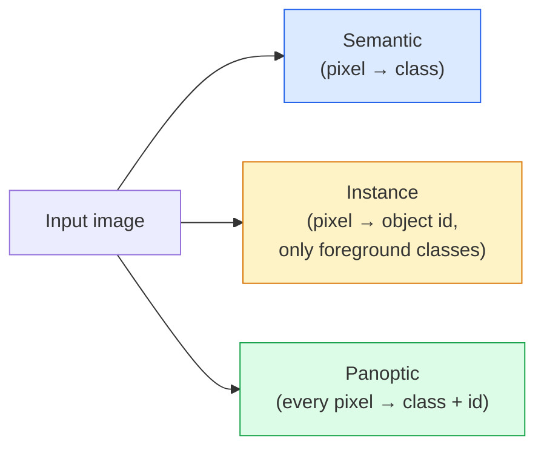
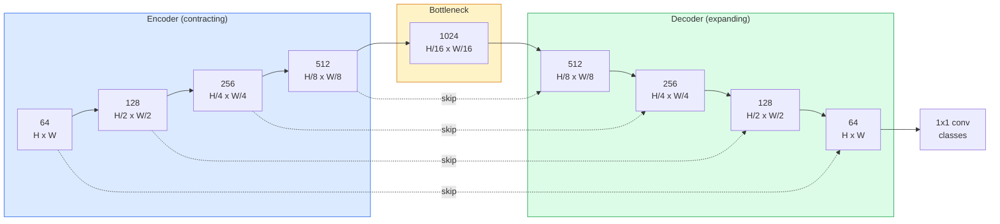

# Phân đoạn ngữ nghĩa - U-Net

> Phân đoạn là phân loại ở mỗi pixel. U-Net làm cho nó hoạt động bằng cách ghép nối encoder lấy mẫu xuống với decoder lấy mẫu lên và kết nối bỏ qua dây giữa chúng.

**Loại:** Xây dựng
**Ngôn ngữ:** Python
**Kiến thức tiên quyết:** Giai đoạn 4 Bài 03 (CNN), Giai đoạn 4 Bài 04 (Phân loại hình ảnh)
**Thời lượng:** ~75 phút

## Mục tiêu học tập

- Phân biệt phân đoạn ngữ nghĩa, thực thể và toàn cảnh và chọn nhiệm vụ phù hợp cho một vấn đề nhất định
- Xây dựng U-Net từ đầu trong PyTorch với các khối encoder, nút cổ chai, decoder với các tích chập chuyển vị và bỏ qua các kết nối
- Triển khai entropy chéo theo pixel, loss xúc xắc và loss kết hợp là mặc định hiện tại cho phân khúc y tế và công nghiệp
- Đọc các chỉ số IoU và Xúc xắc mỗi class và chẩn đoán xem điểm kém đến từ recall đối tượng nhỏ, accuracy ranh giới hay class imbalance

## Vấn đề

Phân loại xuất ra một nhãn cho mỗi hình ảnh. Phát hiện xuất ra một số hộp cho mỗi hình ảnh. Phân đoạn xuất ra một nhãn trên mỗi pixel. Đối với đầu vào có kích thước `H x W`, đầu ra là tensor hình dạng `H x W` (ngữ nghĩa) hoặc `H x W x N_instances` (ví dụ). Đó là hàng triệu dự đoán cho mỗi hình ảnh, không phải một.

Cấu trúc phân khúc là lý do tại sao nó cung cấp năng lượng cho hầu hết mọi sản phẩm thị giác dự đoán dày đặc: hình ảnh y tế (mặt nạ khối u), lái xe tự động (đường, làn đường, chướng ngại vật), vệ tinh (dấu chân tòa nhà, ranh giới cây trồng), phân tích cú pháp tài liệu (vùng bố trí), robot (vùng có thể nắm bắt). Không có nhiệm vụ nào trong số đó có thể được giải quyết bằng cách đặt một chiếc hộp xung quanh đối tượng; họ cần hình bóng chính xác.

Vấn đề kiến trúc rất đơn giản để nêu và không đơn giản để giải quyết: bạn cần mạng để xem ngữ cảnh toàn cầu của một hình ảnh (đây là loại cảnh nào) và chi tiết pixel cục bộ (chính xác pixel nào là đường và vỉa hè) đồng thời. Một CNN tiêu chuẩn nén không gian để có được bối cảnh, điều này làm mất đi chi tiết. U-Net là thiết kế có cả hai.

## Khái niệm

### Ngữ nghĩa so với phiên bản so với toàn cảnh



- **Ngữ nghĩa** nói "pixel này là đường, pixel đó là xe hơi." Hai chiếc xe cạnh nhau sụp đổ thành một đốm màu duy nhất.
- **Instance** nói "pixel này là xe #3, pixel đó là xe #5." Bỏ qua nội dung nền ("stuff" = bầu trời, đường, cỏ).
- **Panoptic** hợp nhất cả hai: mỗi pixel có một nhãn class, mỗi phiên bản có một id duy nhất, nội dung và những thứ đều được phân đoạn.

Bài học này bao gồm ngữ nghĩa. Bài học tiếp theo (Mặt nạ R-CNN) bao gồm trường hợp.

### Hình dạng U-Net



encoder giảm một nửa độ phân giải không gian bốn lần và tăng gấp đôi các kênh. decoder đảo ngược: tăng gấp đôi độ phân giải không gian bốn lần và giảm một nửa kênh. Các kết nối bỏ qua nối các encoder features phù hợp với decoder features ở mọi độ phân giải. Bản đồ conv 1x1 cuối cùng `64 -> num_classes` ở độ phân giải đầy đủ.

Tại sao các kết nối bỏ qua là cần thiết: decoder chỉ nhìn thấy các bản đồ feature nhỏ vào thời điểm nó cố gắng đưa ra các dự đoán ở cấp độ pixel. Nếu không có bỏ qua, nó không thể định vị các cạnh một cách chính xác vì thông tin đó đã bị nén đi trong encoder. Bỏ qua các kết nối cung cấp cho nó độ phân giải cao feature ánh xạ encoder được tính toán trên đường đi xuống.

### Chuyển vị so với mẫu lên hai tuyến tính

decoder phải mở rộng kích thước không gian. Hai lựa chọn:

- **Tích chập chuyển vị **(`nn.ConvTranspose2d`) — mẫu lên có thể học được. Mặc định U-Net trong lịch sử. Có thể tạo ra artifacts bàn cờ nếu sải chân và kích thước hạt không chia đều.
- **Mẫu lên hai tuyến tính + chuyển đổi 3x3** — mẫu lên mượt mà sau đó là chuyển đổi. Ít artifacts hơn, ít parameters hơn, bây giờ là mặc định hiện đại.

Cả hai đều xuất hiện trong tự nhiên. Đối với U-Net đầu tiên, hai tuyến tính an toàn hơn.

### Entropy chéo trên lưới pixel

Đối với phân đoạn ngữ nghĩa với C classes, đầu ra model là `(N, C, H, W)`. Mục tiêu được `(N, H, W)` với ID class số nguyên. Entropy chéo giống hệt với trường hợp phân loại, chỉ được áp dụng ở mọi vị trí không gian:

```
Loss = mean over (n, h, w) of -log( softmax(logits[n, :, h, w])[target[n, h, w]] )
```

`F.cross_entropy` in PyTorch xử lý hình dạng này một cách nguyên bản. Không cần định hình lại.

### Xúc xắc loss và tại sao bạn cần nó

Entropy chéo đối xử với mọi pixel như nhau. Điều đó là sai khi một class thống trị khung hình (hình ảnh y tế: 99% nền, 1% khối u). Mạng có thể ghi điểm 99% accuracy bằng cách dự đoán nền ở khắp mọi nơi mà vẫn vô dụng.

Dice loss giải quyết vấn đề này bằng cách tối ưu hóa trực tiếp sự chồng chéo giữa mặt nạ dự đoán và mặt nạ đúng:

```
Dice(p, y) = 2 * sum(p * y) / (sum(p) + sum(y) + epsilon)
Dice_loss = 1 - Dice
```

trong đó `p` là bản đồ xác suất sigmoid/softmax cho một class và `y` là mặt nạ sự thật nền tảng nhị phân. Độ loss chỉ bằng không khi sự chồng chéo là hoàn hảo. Bởi vì nó dựa trên tỷ lệ nên class imbalance không liên quan.

Trong thực tế, hãy sử dụng **loss kết hợp**:

```
L = L_cross_entropy + lambda * L_dice       (lambda ~ 1)
```

Entropy chéo cho gradients ổn định sớm trong training; Xúc xắc tập trung phần đuôi của training vào việc thực sự phù hợp với hình dạng mặt nạ. Sự kết hợp này là mặc định hình ảnh y tế và khó có thể đánh bại trên bất kỳ dataset mất cân bằng class nào.

### Chỉ số đánh giá

- **Pixel accuracy** — phần trăm pixel được dự đoán chính xác. Giá rẻ. Bị hỏng dữ liệu mất cân bằng vì lý do tương tự như accuracy trong phân loại.
- **IoU mỗi class **- giao điểm trên liên kết cho mỗi mặt nạ của class; trung bình trên classes = mIoU.
- **Xúc xắc (F1 trên pixel)** — tương tự như IoU; `Dice = 2 * IoU / (1 + IoU)`. Hình ảnh y tế thích Xúc xắc, cộng đồng lái xe thích IoU; chúng có liên quan đơn điệu.
- **Ranh giới F1** — đo lường mức độ gần của ranh giới dự đoán với ranh giới sự thật cơ sở, phạt ngay cả những thay đổi nhỏ. Quan trọng đối với các nhiệm vụ precision cao như kiểm tra chất bán dẫn.

Báo cáo IoU mỗi class, không chỉ mIoU. IoU trung bình ẩn một class ở mức 15% trong khi chín người khác ở mức 85%.

### Đánh đổi độ phân giải đầu vào

encoder của U-Net giảm một nửa độ phân giải bốn lần, vì vậy đầu vào phải chia hết cho 16. Hình ảnh y tế thường có kích thước 512x512 hoặc 1024x1024. Cây trồng tự động là 2048x1024. Chi phí bộ nhớ của U-Net tăng `H * W * C_max` và ở 1024x1024 với 1024 kênh tắc nghẽn, forward pass đã sử dụng hàng gigabyte VRAM.

Hai giải pháp tiêu chuẩn:
1. Xếp đầu vào - process các ô 256x256 có chồng lên nhau và khâu.
2. Thay thế nút cổ chai bằng các tích chập giãn nở để giữ cho độ phân giải không gian cao hơn nhưng mở rộng trường tiếp nhận (họ DeepLab).

Đối với model đầu tiên, đầu vào 256x256 với U-Net cơ sở 64 kênh hoạt động thoải mái trên VRAM 8 GB.

## Tự xây dựng

### Bước 1: Encoder chặn

Hai convs 3x3 với định mức và ReLU batch. Chuyển đổi đầu tiên thay đổi số kênh; người thứ hai giữ nó.

```python
import torch
import torch.nn as nn
import torch.nn.functional as F

class DoubleConv(nn.Module):
    def __init__(self, in_c, out_c):
        super().__init__()
        self.net = nn.Sequential(
            nn.Conv2d(in_c, out_c, kernel_size=3, padding=1, bias=False),
            nn.BatchNorm2d(out_c),
            nn.ReLU(inplace=True),
            nn.Conv2d(out_c, out_c, kernel_size=3, padding=1, bias=False),
            nn.BatchNorm2d(out_c),
            nn.ReLU(inplace=True),
        )

    def forward(self, x):
        return self.net(x)
```

Khối này được tái sử dụng xuyên suốt. `bias=False` vì bản beta của BN xử lý bias.

### Bước 2: Khối xuống và lên

```python
class Down(nn.Module):
    def __init__(self, in_c, out_c):
        super().__init__()
        self.net = nn.Sequential(
            nn.MaxPool2d(2),
            DoubleConv(in_c, out_c),
        )

    def forward(self, x):
        return self.net(x)


class Up(nn.Module):
    def __init__(self, in_c, out_c):
        super().__init__()
        self.up = nn.Upsample(scale_factor=2, mode="bilinear", align_corners=False)
        self.conv = DoubleConv(in_c, out_c)

    def forward(self, x, skip):
        x = self.up(x)
        if x.shape[-2:] != skip.shape[-2:]:
            x = F.interpolate(x, size=skip.shape[-2:], mode="bilinear", align_corners=False)
        x = torch.cat([skip, x], dim=1)
        return self.conv(x)
```

Kiểm tra hình dạng chỉ không gian (`shape[-2:]`) xử lý các đầu vào có kích thước không chia hết cho 16; Một `F.interpolate` an toàn căn chỉnh tensor trước concat. So sánh hình dạng đầy đủ cũng sẽ trigger sự khác biệt về số lượng kênh, đây phải là một lỗi lớn, không phải là một nội suy im lặng.

### Bước 3: U-Net

```python
class UNet(nn.Module):
    def __init__(self, in_channels=3, num_classes=2, base=64):
        super().__init__()
        self.inc = DoubleConv(in_channels, base)
        self.d1 = Down(base, base * 2)
        self.d2 = Down(base * 2, base * 4)
        self.d3 = Down(base * 4, base * 8)
        self.d4 = Down(base * 8, base * 16)
        self.u1 = Up(base * 16 + base * 8, base * 8)
        self.u2 = Up(base * 8 + base * 4, base * 4)
        self.u3 = Up(base * 4 + base * 2, base * 2)
        self.u4 = Up(base * 2 + base, base)
        self.outc = nn.Conv2d(base, num_classes, kernel_size=1)

    def forward(self, x):
        x1 = self.inc(x)
        x2 = self.d1(x1)
        x3 = self.d2(x2)
        x4 = self.d3(x3)
        x5 = self.d4(x4)
        x = self.u1(x5, x4)
        x = self.u2(x, x3)
        x = self.u3(x, x2)
        x = self.u4(x, x1)
        return self.outc(x)

net = UNet(in_channels=3, num_classes=2, base=32)
x = torch.randn(1, 3, 256, 256)
print(f"output: {net(x).shape}")
print(f"params: {sum(p.numel() for p in net.parameters()):,}")
```

Hình dạng đầu ra `(1, 2, 256, 256)` - cùng kích thước không gian với đầu vào `num_classes` kênh. Khoảng 7,7 triệu parameters tại `base=32`.

### Bước 4: Thua lỗ

```python
def dice_loss(logits, targets, num_classes, eps=1e-6):
    probs = F.softmax(logits, dim=1)
    targets_one_hot = F.one_hot(targets, num_classes).permute(0, 3, 1, 2).float()
    dims = (0, 2, 3)
    intersection = (probs * targets_one_hot).sum(dim=dims)
    denom = probs.sum(dim=dims) + targets_one_hot.sum(dim=dims)
    dice = (2 * intersection + eps) / (denom + eps)
    return 1 - dice.mean()


def combined_loss(logits, targets, num_classes, lam=1.0):
    ce = F.cross_entropy(logits, targets)
    dc = dice_loss(logits, targets, num_classes)
    return ce + lam * dc, {"ce": ce.item(), "dice": dc.item()}
```

Xúc xắc được tính trên mỗi class sau đó tính trung bình (Xúc xắc macro). `eps` ngăn chặn sự chia bằng không trên classes vắng mặt trong batch.

### Bước 5: Chỉ số IoU

```python
@torch.no_grad()
def iou_per_class(logits, targets, num_classes):
    preds = logits.argmax(dim=1)
    ious = torch.zeros(num_classes)
    for c in range(num_classes):
        pred_c = (preds == c)
        true_c = (targets == c)
        inter = (pred_c & true_c).sum().float()
        union = (pred_c | true_c).sum().float()
        ious[c] = (inter / union) if union > 0 else torch.tensor(float("nan"))
    return ious
```

Trả về một vector có độ dài C. `nan` đánh dấu classes vắng mặt trong batch - không trung bình hơn những điểm đó khi tính toán mIoU.

### Bước 6: dataset tổng hợp để xác minh từ đầu đến cuối

Tạo hình dạng trên nền màu để mạng phải học hình dạng chứ không phải màu pixel.

```python
import numpy as np
from torch.utils.data import Dataset, DataLoader

def synthetic_segmentation(num_samples=200, size=64, seed=0):
    rng = np.random.default_rng(seed)
    images = np.zeros((num_samples, size, size, 3), dtype=np.float32)
    masks = np.zeros((num_samples, size, size), dtype=np.int64)
    for i in range(num_samples):
        bg = rng.uniform(0, 1, (3,))
        images[i] = bg
        masks[i] = 0
        num_shapes = rng.integers(1, 4)
        for _ in range(num_shapes):
            cls = int(rng.integers(1, 3))
            color = rng.uniform(0, 1, (3,))
            cx, cy = rng.integers(10, size - 10, size=2)
            r = int(rng.integers(4, 12))
            yy, xx = np.meshgrid(np.arange(size), np.arange(size), indexing="ij")
            if cls == 1:
                mask = (xx - cx) ** 2 + (yy - cy) ** 2 < r ** 2
            else:
                mask = (np.abs(xx - cx) < r) & (np.abs(yy - cy) < r)
            images[i][mask] = color
            masks[i][mask] = cls
        images[i] += rng.normal(0, 0.02, images[i].shape)
        images[i] = np.clip(images[i], 0, 1)
    return images, masks


class SegDataset(Dataset):
    def __init__(self, images, masks):
        self.images = images
        self.masks = masks

    def __len__(self):
        return len(self.images)

    def __getitem__(self, i):
        img = torch.from_numpy(self.images[i]).permute(2, 0, 1).float()
        mask = torch.from_numpy(self.masks[i]).long()
        return img, mask
```

Ba classes: nền (0), hình tròn (1), hình vuông (2). Mạng lưới phải học cách phân biệt hình dạng.

### Bước 7: Training vòng lặp

```python
def train_one_epoch(model, loader, optimizer, device, num_classes):
    model.train()
    loss_sum, total = 0.0, 0
    iou_sum = torch.zeros(num_classes)
    for x, y in loader:
        x, y = x.to(device), y.to(device)
        logits = model(x)
        loss, _ = combined_loss(logits, y, num_classes)
        optimizer.zero_grad()
        loss.backward()
        optimizer.step()
        loss_sum += loss.item() * x.size(0)
        total += x.size(0)
        iou_sum += iou_per_class(logits, y, num_classes).nan_to_num(0)
    return loss_sum / total, iou_sum / len(loader)
```

Chạy điều này trong 10-30 epochs trên dataset tổng hợp và xem mIoU leo qua 0,9 để có hình dạng classes. Lưu ý rằng `nan_to_num(0)` coi classes vắng mặt trong batch là số không; để có IoU chính xác trên mỗi class, hãy che giấu theo sự hiện diện và sử dụng `torch.nanmean` trên batches tại thời điểm đánh giá thay vì tính trung bình ở đây.

## Ứng dụng

Đối với production, `segmentation_models_pytorch` ("smp") bao bọc mọi kiến trúc phân đoạn tiêu chuẩn với bất kỳ đường trục torchvision hoặc timm nào. Ba dòng:

```python
import segmentation_models_pytorch as smp

model = smp.Unet(
    encoder_name="resnet34",
    encoder_weights="imagenet",
    in_channels=3,
    classes=3,
)
```

Cũng đáng biết cho công việc thực tế:
- **DeepLabV3+** thay thế lấy mẫu giảm dựa trên nhóm tối đa bằng các convs giãn nở để nút cổ chai giữ độ phân giải; ranh giới nhanh hơn trên vệ tinh và dữ liệu lái xe.
- **SegFormer** hoán đổi encoder chuyển đổi cho một transformer phân cấp; SOTA hiện tại trên nhiều benchmarks.
- **Mask2Former** / **OneFormer** hợp nhất phân đoạn ngữ nghĩa, phiên bản và toàn cảnh trong một kiến trúc duy nhất.

Cả ba đều là sự thay thế thả vào trong `smp` hoặc `transformers` với cùng một bộ tải dữ liệu.

## Sản phẩm bàn giao

Bài học này tạo ra:

- `outputs/prompt-segmentation-task-picker.md` — một prompt chọn giữa phân đoạn ngữ nghĩa, thực thể và toàn cảnh và đặt tên cho kiến trúc cho một nhiệm vụ nhất định.
- `outputs/skill-segmentation-mask-inspector.md` — một skill báo cáo sự phân bố class, số liệu thống kê về mặt nạ dự đoán và classes bị dự đoán thấp hoặc mờ ranh giới.

## Bài tập

1. **(Dễ dàng)** Triển khai `bce_dice_loss` cho tác vụ phân đoạn nhị phân (nền trước so với nền). Xác minh trên hai class dataset tổng hợp rằng loss kết hợp hội tụ nhanh hơn BCE khi nền trước là 5% pixel.
2. **(Trung bình) **Thay thế khối lên `nn.Upsample + conv` bằng khối lên `nn.ConvTranspose2d`. Huấn luyện cả về dataset tổng hợp và so sánh mIoU. Quan sát vị trí bàn cờ artifacts xuất hiện trong phiên bản chuyển vị-conv.
3. **(Khó)** Lấy một dataset phân đoạn thực sự (Oxford-IIIT Pets, Cityscapes mini split hoặc một tập hợp con y tế) và huấn luyện U-Net trong phạm vi 2 điểm IoU của tham chiếu `smp.Unet`. Báo cáo IoU mỗi class và xác định classes nào được hưởng lợi nhiều nhất từ việc thêm Xúc xắc vào loss.

## Thuật ngữ chính

| Thuật ngữ | Những gì mọi người nói | Ý nghĩa thực sự của nó |
|------|----------------|----------------------|
| Phân đoạn ngữ nghĩa | "Gắn nhãn mọi pixel" | Phân loại trên mỗi pixel thành C classes; các trường hợp của cùng một class merge |
| Phân đoạn phiên bản | "Dán nhãn mọi đối tượng" | Tách các trường hợp riêng biệt của cùng một class; Chỉ ở nền trước |
| Phân đoạn toàn quang | "Ngữ nghĩa + phiên bản" | Mỗi pixel đều có một class; Mỗi phiên bản Thing cũng nhận được một ID duy nhất |
| Bỏ qua kết nối | "Cầu U-Net" | Nối encoder features thành decoder features độ phân giải phù hợp; Duy trì chi tiết tần số cao |
| Chuyển đổi | "Giải tích chập" | Lấy mẫu có thể học được; có thể sản xuất artifacts bàn cờ |
| Xúc xắc loss | "Chồng chéo loss" | 1 - 2 | A ∩ B | / ( | A | + | B | ); Tối ưu hóa mặt nạ chồng chéo trực tiếp và mạnh mẽ để class imbalance |
| mIoU | "Giao lộ trung bình trên công đoàn" | IoU trung bình trên classes; Chỉ số tiêu chuẩn cộng đồng để phân khúc |
| Ranh giới F1 | "Ranh giới accuracy" | F1 score chỉ được tính toán trên các pixel ranh giới; Các vấn đề đối với các nhiệm vụ quan trọng precision |

## Đọc thêm

- [U-Net: Convolutional Networks for Biomedical Image Segmentation (Ronneberger et al., 2015)](https://arxiv.org/abs/1505.04597) — bài báo gốc; Hình mà mọi người sao chép ở trang 2
- [Fully Convolutional Networks (Long et al., 2015)](https://arxiv.org/abs/1411.4038) — bài báo đầu tiên biến phân đoạn thành một bài toán conv từ đầu đến cuối
- [segmentation_models_pytorch](https://github.com/qubvel/segmentation_models.pytorch) — tài liệu tham khảo cho production phân đoạn; mọi kiến trúc tiêu chuẩn cộng với mọi loss tiêu chuẩn
- [Lessons learned from training SOTA segmentation (kaggle.com competitions)](https://www.kaggle.com/code/iafoss/carvana-unet-pytorch) — hướng dẫn về lý do tại sao TTA, ghi nhãn giả và trọng số class lại quan trọng đối với dữ liệu thực
