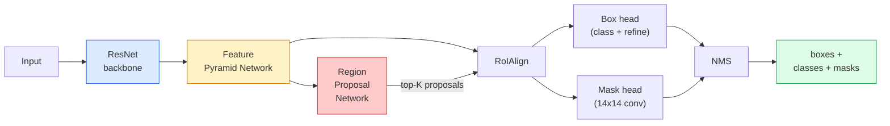

# Phân đoạn phiên bản — Mặt nạ R-CNN

> Thêm một mặt nạ nhỏ branch vào trình phát hiện R-CNN nhanh hơn và bạn có thể phân đoạn phiên bản. Phần khó là RoIAlign, và nó khó hơn vẻ ngoài của nó.

**Loại:** Xây dựng + Học hỏi
**Ngôn ngữ:** Python
**Kiến thức tiên quyết:** Giai đoạn 4 Bài 06 (YOLO), Giai đoạn 4 Bài 07 (U-Net)
**Thời lượng:** ~75 phút

## Mục tiêu học tập

- Trace kiến trúc Mask R-CNN từ đầu đến cuối: đường trục, FPN, RPN, RoIAlign, đầu hộp, đầu mặt nạ
- Triển khai RoIAlign từ đầu và giải thích lý do tại sao RoIPool không còn được sử dụng nữa
- Sử dụng torchvision `maskrcnn_resnet50_fpn_v2` pretrained model cho mặt nạ phiên bản chất lượng production và đọc chính xác định dạng đầu ra của nó
- Fine-tune Mặt nạ R-CNN trên một dataset tùy chỉnh nhỏ bằng cách thay thế hộp và đầu mặt nạ và giữ cho xương sống đóng băng

## Vấn đề

Phân đoạn ngữ nghĩa cung cấp cho bạn một mặt nạ mỗi class. Phân đoạn phiên bản cung cấp cho bạn một mặt nạ cho mỗi đối tượng, ngay cả khi hai đối tượng chia sẻ một class. Đếm cá nhân, theo dõi qua các khung và đo lường mọi thứ (hộp giới hạn của mỗi viên gạch trong tường, mỗi ô trong hình ảnh kính hiển vi) đều yêu cầu phân đoạn phiên bản.

Mask R-CNN (He et al., 2017) đã giải quyết vấn đề này bằng cách định hình lại phân đoạn cá thể dưới dạng detection-plus-a-mask. Thiết kế gọn gàng đến mức trong năm năm tiếp theo, hầu hết mọi giấy phân đoạn phiên bản đều là biến thể Mask R-CNN và việc triển khai torchvision vẫn là mặc định production cho các datasets vừa và nhỏ.

Vấn đề kỹ thuật khó khăn là sampling: làm thế nào để bạn cắt một vùng feature có kích thước cố định ra khỏi hộp đề xuất có các góc không thẳng hàng với ranh giới pixel? Làm sai điều đó sẽ tốn một phần mười điểm mAP ở khắp mọi nơi. RoIAlign là câu trả lời.

## Khái niệm

### Kiến trúc



Năm phần để hiểu:

1. **Xương sống** — ResNet-50 hoặc ResNet-101 được huấn luyện trên ImageNet. Tạo ra một hệ thống phân cấp các bản đồ feature ở các bước 4, 8, 16, 32.
2. **FPN (Feature Pyramid Network)** — kết nối từ trên xuống + ngang cung cấp cho mọi kênh cấp C của features giàu ngữ nghĩa. Phát hiện truy vấn mức FPN phù hợp với kích thước đối tượng.
3. **RPN (Region Proposal Network)** — một đầu conv nhỏ, ở mọi vị trí neo, dự đoán "có đối tượng ở đây không?" và "làm cách nào để tinh chỉnh hộp?". Tạo ra ~1000 đề xuất cho mỗi hình ảnh.
4. **RoIAlign** — lấy mẫu bản vá feature có kích thước cố định (ví dụ: 7x7) từ bất kỳ hộp nào ở bất kỳ cấp độ FPN nào. sampling lưỡng tuyến, không định lượng.
5. **Đầu** — đầu hộp hai lớp tinh chỉnh hộp và chọn một class, cộng với một đầu chuyển đổi nhỏ xuất ra mặt nạ nhị phân `28x28` cho mỗi đề xuất.

### Tại sao lại là RoIAlign, không phải RoIPool

Fast R-CNN ban đầu sử dụng RoIPool, chia hộp đề xuất thành một lưới, lấy feature tối đa trong mỗi ô và làm tròn tất cả các tọa độ thành số nguyên. Việc làm tròn đó làm sai lệch bản đồ feature từ tọa độ pixel đầu vào lên đến một pixel bản đồ feature đầy đủ - nhỏ trên hình ảnh 224x224, thảm họa khi bản đồ feature là sải chân 32.

```
RoIPool:
  box (34.7, 51.3, 98.2, 142.9)
  round -> (34, 51, 98, 142)
  split grid -> round each cell boundary
  misalignment accumulates at every step

RoIAlign:
  box (34.7, 51.3, 98.2, 142.9)
  sample at exact float coordinates using bilinear interpolation
  no rounding anywhere
```

RoIAlign nâng AP mặt nạ lên 3-4 điểm trên COCO miễn phí. Mọi máy dò quan tâm đến bản địa hóa hiện đều sử dụng nó - YOLOv7 seg, RT-DETR, Mask2Former giống nhau.

### RPN trong một đoạn văn

Tại mọi vị trí của bản đồ feature, hãy đặt các hộp neo K có kích thước và hình dạng khác nhau. Dự đoán điểm khách quan cho mỗi neo và độ lệch hồi quy để biến neo thành một hộp phù hợp hơn. Giữ ~1.000 ô hàng đầu theo điểm số, áp dụng NMS ở IoU 0.7 và đưa những người sống sót lên đầu. RPN được huấn luyện với mini-loss của riêng nó - cấu trúc tương tự như YOLO loss từ Bài 6, chỉ với hai classes (đối tượng / không có đối tượng).

### Đầu mặt nạ

Đối với mỗi đề xuất (sau RoIAlign), đầu mặt nạ là một FCN nhỏ: bốn convs 3x3, một deconv 2x, một conv 1x1 cuối cùng tạo ra `num_classes` kênh đầu ra ở độ phân giải `28x28`. Chỉ kênh tương ứng với class dự đoán được giữ lại; những người khác bị bỏ qua. Điều này tách dự đoán mặt nạ khỏi phân loại.

Lấy mẫu mặt nạ 28x28 thành kích thước pixel ban đầu của đề xuất để tạo mặt nạ nhị phân cuối cùng.

### Thua lỗ

Mặt nạ R-CNN có bốn khoản lỗ cộng lại với nhau:

```
L = L_rpn_cls + L_rpn_box + L_box_cls + L_box_reg + L_mask
```

- `L_rpn_cls`, `L_rpn_box` — tính khách quan + hồi quy hộp cho các đề xuất RPN.
- `L_box_cls` — entropy chéo trên (C + 1) classes (bao gồm cả nền) trên bộ phân loại của đầu.
- `L_box_reg` - L1 mịn trên tinh chỉnh hộp của đầu.
- `L_mask` — entropy chéo nhị phân trên mỗi pixel trên đầu ra mặt nạ 28x28.

Mỗi loss có trọng lượng mặc định riêng; Việc triển khai torchvision hiển thị chúng dưới dạng đối số hàm tạo.

### Định dạng đầu ra

`torchvision.models.detection.maskrcnn_resnet50_fpn_v2` trả về một danh sách các dict, một câu cho mỗi hình ảnh:

```
{
    "boxes":  (N, 4) in (x1, y1, x2, y2) pixel coordinates,
    "labels": (N,) class IDs, 0 = background so indices are 1-based,
    "scores": (N,) confidence scores,
    "masks":  (N, 1, H, W) float masks in [0, 1] — threshold at 0.5 for binary,
}
```

Mặt nạ đã có độ phân giải hình ảnh đầy đủ. Đầu ra đầu 28x28 đã được lấy mẫu nội bộ.

## Tự xây dựng

### Bước 1: RoIAlign từ đầu

Đây là một thành phần của Mask R-CNN đơn giản hơn để hiểu dưới dạng mã hơn là văn xuôi.

```python
import torch
import torch.nn.functional as F

def roi_align_single(feature, box, output_size=7, spatial_scale=1 / 16.0):
    """
    feature: (C, H, W) single-image feature map
    box: (x1, y1, x2, y2) in original image pixel coordinates
    output_size: side of the output grid (7 for box head, 14 for mask head)
    spatial_scale: reciprocal of the feature map stride
    """
    C, H, W = feature.shape
    x1, y1, x2, y2 = [c * spatial_scale - 0.5 for c in box]
    bin_w = (x2 - x1) / output_size
    bin_h = (y2 - y1) / output_size

    grid_y = torch.linspace(y1 + bin_h / 2, y2 - bin_h / 2, output_size)
    grid_x = torch.linspace(x1 + bin_w / 2, x2 - bin_w / 2, output_size)
    yy, xx = torch.meshgrid(grid_y, grid_x, indexing="ij")

    gx = 2 * (xx + 0.5) / W - 1
    gy = 2 * (yy + 0.5) / H - 1
    grid = torch.stack([gx, gy], dim=-1).unsqueeze(0)
    sampled = F.grid_sample(feature.unsqueeze(0), grid, mode="bilinear",
                            align_corners=False)
    return sampled.squeeze(0)
```

Mỗi số đều ở một vị trí lấy mẫu hai tuyến. Không làm tròn, không định lượng, không bỏ gradients.

### Bước 2: So sánh với RoIAlign của torchvision

```python
from torchvision.ops import roi_align

feature = torch.randn(1, 16, 50, 50)
boxes = torch.tensor([[0, 10, 20, 100, 90]], dtype=torch.float32)  # (batch_idx, x1, y1, x2, y2)

ours = roi_align_single(feature[0], boxes[0, 1:].tolist(), output_size=7, spatial_scale=1/4)
theirs = roi_align(feature, boxes, output_size=(7, 7), spatial_scale=1/4, sampling_ratio=1, aligned=True)[0]

print(f"shape ours:   {tuple(ours.shape)}")
print(f"shape theirs: {tuple(theirs.shape)}")
print(f"max|diff|:    {(ours - theirs).abs().max().item():.3e}")
```

Với `sampling_ratio=1` và `aligned=True`, cả hai phù hợp với `1e-5`.

### Bước 3: Tải mặt nạ pretrained R-CNN

```python
import torch
from torchvision.models.detection import maskrcnn_resnet50_fpn_v2, MaskRCNN_ResNet50_FPN_V2_Weights

model = maskrcnn_resnet50_fpn_v2(weights=MaskRCNN_ResNet50_FPN_V2_Weights.DEFAULT)
model.eval()
print(f"params: {sum(p.numel() for p in model.parameters()):,}")
print(f"classes (including background): {len(model.roi_heads.box_predictor.cls_score.out_features * [0])}")
```

46 triệu parameters, 91 classes (COCO). class đầu tiên (id 0) là nền; Mọi thứ mà model thực sự phát hiện bắt đầu từ ID 1.

### Bước 4: Chạy inference

```python
with torch.no_grad():
    x = torch.randn(3, 400, 600)
    predictions = model([x])
p = predictions[0]
print(f"boxes:  {tuple(p['boxes'].shape)}")
print(f"labels: {tuple(p['labels'].shape)}")
print(f"scores: {tuple(p['scores'].shape)}")
print(f"masks:  {tuple(p['masks'].shape)}")
```

Mặt nạ tensor là hình dạng `(N, 1, H, W)`. Ngưỡng ở 0,5 để nhận mặt nạ nhị phân cho mỗi đối tượng:

```python
binary_masks = (p['masks'] > 0.5).squeeze(1)  # (N, H, W) boolean
```

### Bước 5: Hoán đổi các đầu cho số lượng class tùy chỉnh

Công thức fine-tuning phổ biến: tái sử dụng xương sống, FPN và RPN; Thay thế hai đầu phân loại.

```python
from torchvision.models.detection.faster_rcnn import FastRCNNPredictor
from torchvision.models.detection.mask_rcnn import MaskRCNNPredictor

def build_custom_maskrcnn(num_classes):
    model = maskrcnn_resnet50_fpn_v2(weights=MaskRCNN_ResNet50_FPN_V2_Weights.DEFAULT)
    in_features = model.roi_heads.box_predictor.cls_score.in_features
    model.roi_heads.box_predictor = FastRCNNPredictor(in_features, num_classes)
    in_features_mask = model.roi_heads.mask_predictor.conv5_mask.in_channels
    hidden_layer = 256
    model.roi_heads.mask_predictor = MaskRCNNPredictor(in_features_mask, hidden_layer, num_classes)
    return model

custom = build_custom_maskrcnn(num_classes=5)
print(f"custom cls_score.out_features: {custom.roi_heads.box_predictor.cls_score.out_features}")
```

`num_classes` phải bao gồm class nền, vì vậy dataset có 4 đối tượng classes sử dụng `num_classes=5`.

### Bước 6: Đông lạnh những gì không cần training

Trên datasets nhỏ, đóng băng xương sống và FPN. Chỉ có tính khách quan RPN + hồi quy và hai cái đầu học.

```python
def freeze_backbone_and_fpn(model):
    # torchvision Mask R-CNN packs the FPN inside `model.backbone` (as
    # `model.backbone.fpn`), so iterating `model.backbone.parameters()` covers
    # both the ResNet feature layers and the FPN lateral/output convs.
    for p in model.backbone.parameters():
        p.requires_grad = False
    return model

custom = freeze_backbone_and_fpn(custom)
trainable = sum(p.numel() for p in custom.parameters() if p.requires_grad)
print(f"trainable after freeze: {trainable:,}")
```

Trên datasets 500 hình ảnh, đây là sự khác biệt giữa hội tụ và overfitting.

## Ứng dụng

Vòng lặp training đầy đủ cho Mask R-CNN trong torchvision là 40 dòng và không thay đổi có ý nghĩa giữa các tác vụ - hoán đổi datasets và đi.

```python
def train_step(model, images, targets, optimizer):
    model.train()
    loss_dict = model(images, targets)
    losses = sum(loss for loss in loss_dict.values())
    optimizer.zero_grad()
    losses.backward()
    optimizer.step()
    return {k: v.item() for k, v in loss_dict.items()}
```

Danh sách `targets` phải có các chỉ số cho mỗi hình ảnh với `boxes`, `labels` và `masks` (như `(num_instances, H, W)` tensors nhị phân). model trả về một chỉ số bốn trận thua trong training và một danh sách các dự đoán trong quá trình đánh giá, được đánh giá dựa trên `model.training`.

Công cụ đánh giá `pycocotools` tạo ra mAP@IoU = 0,5: 0,95 cho cả hộp và khẩu trang; Bạn cần cả hai số để biết đầu hộp hay đầu mặt nạ là nút thắt cổ chai.

## Sản phẩm bàn giao

Bài học này tạo ra:

- `outputs/prompt-instance-vs-semantic-router.md` - một prompt đặt ba câu hỏi và chọn trường hợp so với ngữ nghĩa so với toàn cảnh cộng với model chính xác để bắt đầu.
- `outputs/skill-mask-rcnn-head-swapper.md` — một skill tạo ra 10 dòng mã để hoán đổi đầu trên bất kỳ model phát hiện torchvision nào, với `num_classes` mới.

## Bài tập

1. **(Dễ dàng)** Xác minh RoIAlign của bạn so với `torchvision.ops.roi_align` trên 100 hộp ngẫu nhiên. Báo cáo chênh lệch tuyệt đối tối đa. Đồng thời chạy RoIPool (hành vi trước năm 2017) và hiển thị nó phân kỳ ~1-2 pixel bản đồ feature trên các hộp gần biên giới.
2. **(Trung bình)** Fine-tune `maskrcnn_resnet50_fpn_v2` trên dataset tùy chỉnh 50 hình ảnh (hai classes bất kỳ: bóng bay, cá, ổ gà, logo). Đóng băng xương sống, tập luyện trong 20 epochs, báo cáo mặt nạ AP@0.5.
3. **(Cứng) **Thay thế đầu mặt nạ của Mask R-CNN bằng đầu mặt nạ dự đoán ở 56x56 thay vì 28x28. Đo mAP@IoU = 0.75 trước và sau. Giải thích lý do tại sao mức tăng (hoặc thiếu một) khớp với sự cân bằng precision ranh giới / bộ nhớ dự kiến.

## Thuật ngữ chính

| Thuật ngữ | Những gì mọi người nói | Ý nghĩa thực sự của nó |
|------|----------------|----------------------|
| Mặt nạ R-CNN | "Phát hiện cộng với mặt nạ" | R-CNN nhanh hơn + một đầu FCN nhỏ dự đoán mặt nạ 28x28 cho mỗi đề xuất mỗi class |
| FPN | "Feature kim tự tháp" | Kết nối từ trên xuống + ngang cung cấp cho mọi sải chân cấp C các kênh features giàu ngữ nghĩa |
| RPN | "Người đề xuất khu vực" | Một đầu conv nhỏ tạo ra ~1000 đề xuất object/no-object cho mỗi hình ảnh |
| RoIAlign | "Cây trồng không làm tròn" | Lấy mẫu hai tuyến một lưới feature có kích thước cố định từ bất kỳ hộp tọa độ float nào |
| RoIPool | "Vụ mùa trước năm 2017" | Mục đích tương tự như RoIAlign nhưng làm tròn tọa độ hộp; lỗi thời |
| Mặt nạ AP | "Phiên bản mAP" | precision trung bình được tính bằng IoU mặt nạ thay vì IoU hộp; chỉ số phân đoạn phiên bản COCO |
| Đầu mặt nạ nhị phân | "Mặt nạ mỗi class" | Dự đoán một mặt nạ nhị phân mỗi class cho mỗi đề xuất; Chỉ kênh của class dự đoán được giữ lại |
| Bối cảnh class | "Class 0" | "không có đối tượng" class; Chỉ số cho classes thực bắt đầu từ 1 |

## Đọc thêm

- [Mask R-CNN (He et al., 2017)](https://arxiv.org/abs/1703.06870) - tờ giấy; phần 3 về RoIAlign là bài đọc quan trọng
- [FPN: Feature Pyramid Networks (Lin et al., 2017)](https://arxiv.org/abs/1612.03144) — bài báo FPN; Mọi máy dò hiện đại đều sử dụng nó
- [torchvision Mask R-CNN tutorial](https://pytorch.org/tutorials/intermediate/torchvision_tutorial.html) — tham chiếu cho vòng lặp fine-tuning
- [Detectron2 model zoo](https://github.com/facebookresearch/detectron2/blob/main/MODEL_ZOO.md) — triển khai production với trọng số được huấn luyện cho gần như mọi biến thể phát hiện và phân đoạn
