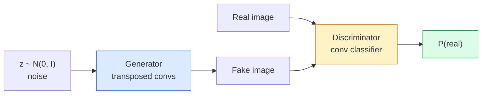
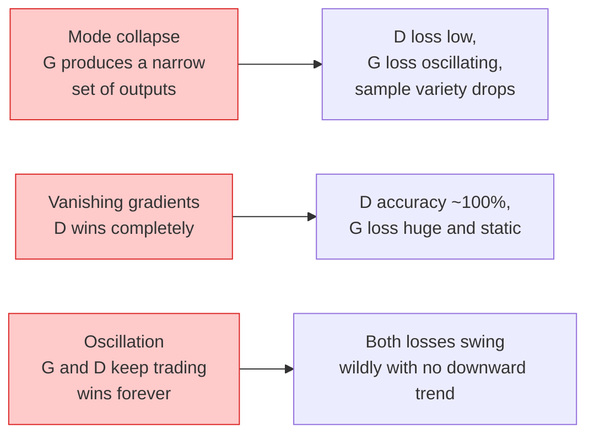

# Tạo hình ảnh - GAN

> GAN là hai mạng nơ-ron trong một trò chơi cố định. Một người hòa, một người chỉ trích. Họ trở nên tốt hơn với nhau cho đến khi những bức vẽ đánh lừa nhà phê bình.

**Loại:** Xây dựng
**Ngôn ngữ:** Python
**Kiến thức tiên quyết:** Giai đoạn 4 Bài 03 (CNN), Giai đoạn 3 Bài 06 (Optimizers), Giai đoạn 3 Bài 07 (Chính quy hóa)
**Thời lượng:** ~75 phút

## Mục tiêu học tập

- Giải thích trò chơi minimax giữa máy phát và bộ phân biệt và tại sao trạng thái cân bằng tương ứng với p_model = p_data
- Triển khai DCGAN trong PyTorch và làm cho nó tạo ra hình ảnh tổng hợp 32x32 mạch lạc trong vòng dưới 60 dòng
- Ổn định training GAN với ba thủ thuật tiêu chuẩn: loss không bão hòa, định mức phổ, TTUR (quy tắc cập nhật hai thang thời gian)
- Đọc training đường cong phân biệt hội tụ lành mạnh với sự sụp đổ chế độ, dao động và phân biệt chiến thắng hoàn toàn

## Vấn đề

Phân loại dạy một mạng ánh xạ hình ảnh với nhãn. Thế hệ đảo ngược vấn đề: lấy mẫu hình ảnh mới trông giống như chúng đến từ cùng một phân phối. Không có đầu ra "chính xác" nào mà bạn có thể so sánh; chỉ có một bản phân phối mà bạn muốn bắt chước.

Các hàm loss tiêu chuẩn (MSE, entropy chéo) không thể đo lường "mẫu này có đến từ phân phối thực không". Giảm thiểu lỗi trên mỗi điểm ảnh tạo ra mức trung bình mờ, không phải mẫu thực tế. Bước đột phá là tìm hiểu loss: huấn luyện một mạng lưới thứ hai có nhiệm vụ phân biệt thật giả và sử dụng phán đoán của nó để đẩy máy phát điện.

GAN (Goodfellow et al., 2014) định nghĩa framework đó. Đến năm 2018, StyleGAN đã sản xuất khuôn mặt 1024x1024 không thể phân biệt được với ảnh. Khuếch tán models kể từ đó đã lên ngôi về chất lượng và khả năng kiểm soát, nhưng mọi thủ thuật làm cho sự khuếch tán trở nên thực tế - các lựa chọn chuẩn hóa, không gian tiềm ẩn feature tổn thất - lần đầu tiên được hiểu trên GAN.

## Khái niệm

### Hai mạng



**máy phát điện **G lấy vector nhiễu `z` và xuất ra hình ảnh. **Bộ phân biệt **D lấy một hình ảnh và xuất ra một vô hướng duy nhất: xác suất mà hình ảnh là thật.

### Trò chơi

G muốn D sai. D muốn đúng. Về mặt chính thức:

```
min_G max_D  E_x[log D(x)] + E_z[log(1 - D(G(z)))]
```

Đọc từ phải sang trái: D đang tối đa hóa accuracy trên hình ảnh thật (`log D(real)`) và giả (`log (1 - D(fake))`). G đang giảm thiểu accuracy của D đối với hàng giả - họ muốn `D(G(z))` cao.

Goodfellow đã chứng minh rằng minimax này có một trạng thái cân bằng toàn cầu trong đó `p_G = p_data`, D xuất ra 0,5 ở khắp mọi nơi và phân kỳ Jensen-Shannon giữa phân phối được tạo ra và phân phối thực bằng không. Phần khó khăn là đạt được điều đó.

### loss không bão hòa

Biểu mẫu trên không ổn định về mặt số. Đầu năm training, `D(G(z))` gần như bằng không đối với mọi hàng giả, vì vậy `log(1 - D(G(z)))` đã biến mất gradients đối với G. Cách khắc phục: lật loss của G.

```
L_D = -E_x[log D(x)] - E_z[log(1 - D(G(z)))]
L_G = -E_z[log D(G(z))]                          # non-saturating
```

Bây giờ khi `D(G(z))` gần bằng không, loss của G lớn và gradient của nó là thông tin. Mọi GAN hiện đại đều huấn luyện với biến thể này.

### Quy tắc kiến trúc DCGAN

Radford, Metz, Chintala (2015) chắt lọc nhiều năm thí nghiệm thất bại thành năm quy tắc làm cho GAN training ổn định:

1. Thay thế gộp bằng các convs có sải chân (cả hai lưới).
2. Sử dụng định mức batch trong cả máy phát điện và bộ phân biệt, ngoại trừ đầu ra của G và đầu vào của D.
3. Loại bỏ các lớp được kết nối hoàn toàn trên các kiến trúc sâu hơn.
4. G sử dụng ReLU trên tất cả các lớp ngoại trừ đầu ra (tánh cho đầu ra trong [-1, 1]).
5. D sử dụng LeakyReLU (negative_slope = 0.2) trên tất cả các lớp.

Mọi GAN dựa trên chuyển đổi hiện đại (StyleGAN, BigGAN, GigaGAN) vẫn bắt đầu từ các quy tắc này và thay thế từng phần một.

### Chế độ thất bại và chữ ký của chúng



- **Thu gọn chế độ**: G tìm thấy một hình ảnh đánh lừa D và chỉ tạo ra hình ảnh đó. Khắc phục: thêm phân biệt lô nhỏ, định mức quang phổ hoặc điều hòa nhãn.
- **Người phân biệt chiến thắng**: D trở nên quá mạnh quá nhanh, gradients của G biến mất. Khắc phục: D nhỏ hơn, D learning rate thấp hơn hoặc áp dụng làm mịn nhãn trên nhãn thực.
- **Dao động**: hai lưới giao dịch chiến thắng mà không bao giờ tiếp cận trạng thái cân bằng. Khắc phục: TTUR (D học nhanh hơn G theo hệ số 2-4), hoặc chuyển sang Wasserstein loss.

### Đánh giá

GAN không có ground truth, vậy làm thế nào để bạn biết chúng đang hoạt động?

- **Kiểm tra mẫu** - chỉ cần nhìn vào 64 mẫu vào cuối mỗi epoch. Không thể thương lượng.
- **FID (Fréchet Inception Distance)** — khoảng cách giữa các phân phối Inception-v3 feature của các tập hợp thực và được tạo. Thấp hơn là tốt hơn. Tiêu chuẩn cộng đồng.
- **Điểm khởi đầu **- cũ hơn, giòn hơn; thích FID.
- **Precision/Recall đối với models tổng quát** - đo lường chất lượng (precision) và độ bao phủ (recall) riêng biệt. Nhiều thông tin hơn so với FID đơn thuần.

Đối với một lần chạy dữ liệu tổng hợp nhỏ, kiểm tra mẫu là đủ.

## Tự xây dựng

### Bước 1: Máy phát điện

Một máy phát DCGAN nhỏ lấy nhiễu 64 độ mờ và tạo ra hình ảnh 32x32.

```python
import torch
import torch.nn as nn

class Generator(nn.Module):
    def __init__(self, z_dim=64, img_channels=3, feat=64):
        super().__init__()
        self.net = nn.Sequential(
            nn.ConvTranspose2d(z_dim, feat * 4, kernel_size=4, stride=1, padding=0, bias=False),
            nn.BatchNorm2d(feat * 4),
            nn.ReLU(inplace=True),
            nn.ConvTranspose2d(feat * 4, feat * 2, kernel_size=4, stride=2, padding=1, bias=False),
            nn.BatchNorm2d(feat * 2),
            nn.ReLU(inplace=True),
            nn.ConvTranspose2d(feat * 2, feat, kernel_size=4, stride=2, padding=1, bias=False),
            nn.BatchNorm2d(feat),
            nn.ReLU(inplace=True),
            nn.ConvTranspose2d(feat, img_channels, kernel_size=4, stride=2, padding=1, bias=False),
            nn.Tanh(),
        )

    def forward(self, z):
        return self.net(z.view(z.size(0), -1, 1, 1))
```

Bốn conv chuyển vị, mỗi conv có `kernel_size=4, stride=2, padding=1` để chúng tăng gấp đôi kích thước không gian một cách rõ ràng. Kích hoạt đầu ra trong [-1, 1] thông qua tanh.

### Bước 2: Phân biệt đối xử

Gương của máy phát điện. LeakyReLU, các convs sải bước, kết thúc bằng một logit vô hướng.

```python
class Discriminator(nn.Module):
    def __init__(self, img_channels=3, feat=64):
        super().__init__()
        self.net = nn.Sequential(
            nn.Conv2d(img_channels, feat, kernel_size=4, stride=2, padding=1),
            nn.LeakyReLU(0.2, inplace=True),
            nn.Conv2d(feat, feat * 2, kernel_size=4, stride=2, padding=1, bias=False),
            nn.BatchNorm2d(feat * 2),
            nn.LeakyReLU(0.2, inplace=True),
            nn.Conv2d(feat * 2, feat * 4, kernel_size=4, stride=2, padding=1, bias=False),
            nn.BatchNorm2d(feat * 4),
            nn.LeakyReLU(0.2, inplace=True),
            nn.Conv2d(feat * 4, 1, kernel_size=4, stride=1, padding=0),
        )

    def forward(self, x):
        return self.net(x).view(-1)
```

Conv cuối cùng giảm bản đồ `4x4` feature xuống `1x1`. Đầu ra là một vô hướng duy nhất cho mỗi hình ảnh; Chỉ áp dụng sigmoid trong quá trình tính toán loss.

### Bước 3: Bước Training

Thay thế: cập nhật D một lần, sau đó cập nhật G một lần, mỗi batch.

```python
import torch.nn.functional as F

def train_step(G, D, real, z, opt_g, opt_d, device):
    real = real.to(device)
    bs = real.size(0)

    # D step
    opt_d.zero_grad()
    d_real = D(real)
    d_fake = D(G(z).detach())
    loss_d = (F.binary_cross_entropy_with_logits(d_real, torch.ones_like(d_real))
              + F.binary_cross_entropy_with_logits(d_fake, torch.zeros_like(d_fake)))
    loss_d.backward()
    opt_d.step()

    # G step
    opt_g.zero_grad()
    d_fake = D(G(z))
    loss_g = F.binary_cross_entropy_with_logits(d_fake, torch.ones_like(d_fake))
    loss_g.backward()
    opt_g.step()

    return loss_d.item(), loss_g.item()
```

`G(z).detach()` trong bước D rất quan trọng: chúng tôi không muốn gradients chảy vào G trong quá trình cập nhật. Quên mất đó là lỗi cổ điển dành cho người mới bắt đầu.

### Bước 4: Vòng lặp training đầy đủ trên các hình dạng tổng hợp

```python
from torch.utils.data import DataLoader, TensorDataset
import numpy as np

def synthetic_images(num=2000, size=32, seed=0):
    rng = np.random.default_rng(seed)
    imgs = np.zeros((num, 3, size, size), dtype=np.float32) - 1.0
    for i in range(num):
        r = rng.uniform(6, 12)
        cx, cy = rng.uniform(r, size - r, size=2)
        yy, xx = np.meshgrid(np.arange(size), np.arange(size), indexing="ij")
        mask = (xx - cx) ** 2 + (yy - cy) ** 2 < r ** 2
        color = rng.uniform(-0.5, 1.0, size=3)
        for c in range(3):
            imgs[i, c][mask] = color[c]
    return torch.from_numpy(imgs)

device = "cuda" if torch.cuda.is_available() else "cpu"
data = synthetic_images()
loader = DataLoader(TensorDataset(data), batch_size=64, shuffle=True)

G = Generator(z_dim=64, img_channels=3, feat=32).to(device)
D = Discriminator(img_channels=3, feat=32).to(device)
opt_g = torch.optim.Adam(G.parameters(), lr=2e-4, betas=(0.5, 0.999))
opt_d = torch.optim.Adam(D.parameters(), lr=2e-4, betas=(0.5, 0.999))

for epoch in range(10):
    for (batch,) in loader:
        z = torch.randn(batch.size(0), 64, device=device)
        ld, lg = train_step(G, D, batch, z, opt_g, opt_d, device)
    print(f"epoch {epoch}  D {ld:.3f}  G {lg:.3f}")
```

`Adam(lr=2e-4, betas=(0.5, 0.999))` là mặc định của DCGAN - beta1 thấp giữ cho thời hạn động lượng không ổn định trò chơi đối thủ quá nhiều.

### Bước 5: Sampling

```python
@torch.no_grad()
def sample(G, n=16, z_dim=64, device="cpu"):
    G.eval()
    z = torch.randn(n, z_dim, device=device)
    imgs = G(z)
    imgs = (imgs + 1) / 2
    return imgs.clamp(0, 1)
```

Luôn chuyển sang chế độ đánh giá trước khi sampling. Đối với DCGAN, điều này quan trọng vì batch số liệu thống kê chạy định mức được sử dụng thay vì số liệu thống kê của batch.

### Bước 6: Chuẩn hóa quang phổ

Một sự thay thế thả vào cho BN trong bộ phân biệt đối xử đảm bảo mạng là 1-Lipschitz. Sửa hầu hết các lỗi "D thắng quá khó".

```python
from torch.nn.utils import spectral_norm

def build_sn_discriminator(img_channels=3, feat=64):
    return nn.Sequential(
        spectral_norm(nn.Conv2d(img_channels, feat, 4, 2, 1)),
        nn.LeakyReLU(0.2, inplace=True),
        spectral_norm(nn.Conv2d(feat, feat * 2, 4, 2, 1)),
        nn.LeakyReLU(0.2, inplace=True),
        spectral_norm(nn.Conv2d(feat * 2, feat * 4, 4, 2, 1)),
        nn.LeakyReLU(0.2, inplace=True),
        spectral_norm(nn.Conv2d(feat * 4, 1, 4, 1, 0)),
    )
```

Hoán đổi `Discriminator` lấy `build_sn_discriminator()` và bạn thường không cần thủ thuật TTUR. Định mức quang phổ là nâng cấp độ bền đơn dễ dàng nhất mà bạn có thể áp dụng.

## Ứng dụng

Đối với thế hệ nghiêm trọng, hãy sử dụng trọng lượng pretrained hoặc chuyển sang khuếch tán. Hai thư viện tiêu chuẩn:

- `torch_fidelity` tính toán FID / IS trên trình tạo của bạn mà không cần viết mã đánh giá tùy chỉnh.
- `pytorch-gan-zoo` (kế thừa) và `StudioGAN` ship đã thử nghiệm triển khai DCGAN, WGAN-GP, SN-GAN, StyleGAN và BigGAN.

Vào năm 2026, GAN vẫn là lựa chọn tốt nhất cho: tạo hình ảnh theo thời gian thực (độ trễ <10 ms), chuyển kiểu, dịch hình ảnh thành hình ảnh với điều khiển chính xác (Pix2Pix, CycleGAN). Sự khuếch tán chiến thắng về chủ nghĩa hiện thực và text conditioning.

## Sản phẩm bàn giao

Bài học này tạo ra:

- `outputs/prompt-gan-training-triage.md` - một prompt đọc mô tả đường cong training và chọn chế độ lỗi (thu gọn chế độ, D-thắng, dao động) cộng với bản sửa lỗi được đề xuất duy nhất.
- `outputs/skill-dcgan-scaffold.md` — một skill viết giàn giáo DCGAN từ `z_dim`, `image_size` mục tiêu và `num_channels`, bao gồm vòng lặp training và trình tiết kiệm mẫu.

## Bài tập

1. **(Dễ dàng)** Huấn luyện DCGAN ở trên trên dataset vòng tròn tổng hợp và lưu một lưới gồm 16 mẫu vào cuối mỗi epoch. Bằng cách nào epoch các vòng tròn được tạo ra trở nên tròn rõ ràng?
2. **(Trung bình) **Thay thế định mức batch của bộ phân biệt bằng định mức quang phổ. Huấn luyện cả hai phiên bản cạnh nhau. Cái nào hội tụ nhanh hơn? Cái nào có variance thấp hơn trên ba hạt?
3. **(Cứng) **Thực hiện DCGAN có điều kiện: đưa nhãn class vào cả G và D (kết nối một nóng với nhiễu trong G, kết nối một kênh class embedding trong D). Huấn luyện về dataset tổng hợp "hình tròn so với hình vuông" từ bài 7 và cho thấy rằng điều kiện class hoạt động bằng cách sampling với các nhãn cụ thể.

## Thuật ngữ chính

| Thuật ngữ | Những gì mọi người nói | Ý nghĩa thực sự của nó |
|------|----------------|----------------------|
| Máy phát điện (G) | "Lưới rút thăm" | Ánh xạ nhiễu với hình ảnh; được huấn luyện để đánh lừa kẻ phân biệt đối xử |
| Phân biệt đối xử (D) | "Nhà phê bình" | Bộ phân loại nhị phân; được huấn luyện để phân biệt hình ảnh thật với hình ảnh được tạo ra |
| Tối đa | "Trò chơi" | tối thiểu trên G, tối đa trên D của loss đối nghịch; cân bằng là p_G = p_data |
| loss không bão hòa | "Phiên bản lành mạnh về mặt số" | loss của G là -log(D(G(z))) thay vì log(1 - D(G(z))) để tránh biến mất gradients sớm trong training |
| Thu gọn chế độ | "Máy phát điện tạo ra một thứ" | G chỉ tạo ra một tập hợp con nhỏ của phân phối dữ liệu; sửa chữa bằng SN, phân biệt lô nhỏ hoặc batch lớn hơn |
| TTUR | "Hai tỷ lệ học tập" | D học nhanh hơn G, thường là hệ số 2-4; ổn định training |
| Định mức quang phổ | "1-Lớp Lipschitz" | Chuẩn hóa trọng lượng giới hạn hằng số Lipschitz của mỗi lớp; ngăn D trở nên dốc tùy ý |
| FID | "Khoảng cách khởi đầu Fréchet" | Khoảng cách giữa các phân phối feature Inception-v3 của các tập hợp thực và tập hợp được tạo; Chỉ số đánh giá tiêu chuẩn |

## Đọc thêm

- [Generative Adversarial Networks (Goodfellow et al., 2014)](https://arxiv.org/abs/1406.2661) - tờ báo bắt đầu tất cả
- [DCGAN (Radford, Metz, Chintala, 2015)](https://arxiv.org/abs/1511.06434) — các quy tắc kiến trúc giúp GAN có thể huấn luyện được
- [Spectral Normalization for GANs (Miyato et al., 2018)](https://arxiv.org/abs/1802.05957) — thủ thuật ổn định hữu ích nhất
- [StyleGAN3 (Karras et al., 2021)](https://arxiv.org/abs/2106.12423) - SOTA GAN; đọc như một album ăn khách nhất của mọi thủ thuật trong thập kỷ qua
