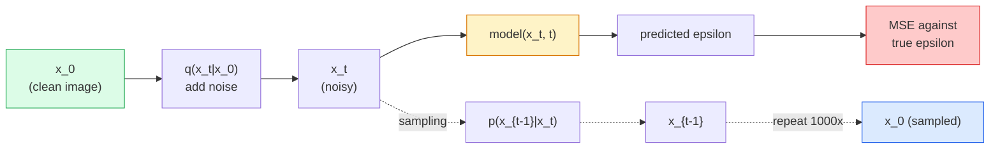

# Tạo hình ảnh - Models khuếch tán

> Một model khuếch tán học cách khử nhiễu. Huấn luyện nó để loại bỏ một chút nhiễu từ hình ảnh nhiễu, lặp lại điều đó ngược lại hàng nghìn lần và bạn có một trình tạo hình ảnh.

**Loại:** Xây dựng
**Ngôn ngữ:** Python
**Kiến thức tiên quyết:** Giai đoạn 4 Bài 07 (U-Net), Giai đoạn 1 Bài 06 (Xác suất), Giai đoạn 3 Bài 06 (Optimizers)
**Thời lượng:** ~75 phút

## Mục tiêu học tập

- Suy ra process `x_0 -> x_1 -> ... -> x_T` nhiễu về phía trước và giải thích lý do tại sao `q(x_t | x_0)` dạng đóng lại giữ cho bất kỳ t nào
- Triển khai mục tiêu training kiểu DDPM hồi quy nhiễu được thêm vào ở mỗi bước và bộ lấy mẫu quay trở lại từ nhiễu thuần túy sang hình ảnh
- Xây dựng U-Net có điều kiện thời gian (đủ nhỏ để luyện tập trên CPU) dự đoán nhiễu cho bất kỳ bước thời gian nào
- Giải thích sự khác biệt giữa DDPM và DDIM sampling và khi nào là phù hợp (Bài 23 đề cập đến việc khớp dòng chảy và chỉnh lưu theo chiều sâu)

## Vấn đề

GAN tạo ra one-shot: nhiễu vào, hình ảnh ra, một forward pass. Chúng nhanh và khó huấn luyện. Khuếch tán models tạo ra lặp đi lặp lại: bắt đầu từ nhiễu thuần túy, khử nhiễu trong các bước nhỏ, hình ảnh xuất hiện. Chúng chậm và dễ huấn luyện. Trong năm năm qua, tài sản thứ hai đã thống trị: bất kỳ nhóm nhỏ nào cũng có thể huấn luyện một model khuếch tán và lấy mẫu hợp lý; GAN training là một nghề mà bạn học được qua nhiều năm chạy thất bại.

Ngoài sự ổn định của training, cấu trúc lặp đi lặp lại của khuếch tán là thứ mở ra mọi thứ mà tạo hình ảnh hiện đại làm: text conditioning, vẽ tranh, chỉnh sửa hình ảnh, siêu phân giải, phong cách có thể điều khiển. Mỗi bước của vòng lặp sampling là một nơi để đưa vào một ràng buộc mới. Đó hook là lý do tại sao Stable Diffusion, Imagen, DALL-E 3, Midjourney và mọi hình ảnh có thể điều khiển model bạn sẽ sử dụng đều dựa trên khuếch tán.

Bài học này xây dựng DDPM tối thiểu: nhiễu tiến, khử nhiễu lùi training vòng lặp. Bài học tiếp theo (Khuếch tán ổn định) kết nối nó vào hệ thống production với VAE, encoder văn bản và classifier-free guidance.

## Khái niệm

### Tiền đạo process

Chụp ảnh `x_0`. Thêm một lượng nhỏ nhiễu Gaussian để có được `x_1`. Thêm một lượng nhỏ nữa để có được `x_2`. Tiếp tục thực hiện các bước T cho đến khi `x_T` gần như không thể phân biệt được với nhiễu Gaussian thuần túy.

```
q(x_t | x_{t-1}) = N(x_t; sqrt(1 - beta_t) * x_{t-1},  beta_t * I)
```

`beta_t` là một lịch trình variance nhỏ, thường tuyến tính từ 0,0001 đến 0,02 trên T = 1000 bước. Mỗi bước sẽ thu nhỏ tín hiệu một chút và tạo ra nhiễu mới.

### Bước nhảy dạng khép kín

Thêm nhiễu từng bước một là chuỗi Markov, nhưng phép toán gấp: bạn có thể lấy mẫu `x_t` trực tiếp từ `x_0` trong một bước.

```
Define alpha_t = 1 - beta_t
Define alpha_bar_t = prod_{s=1..t} alpha_s

Then:
  q(x_t | x_0) = N(x_t; sqrt(alpha_bar_t) * x_0,  (1 - alpha_bar_t) * I)

Equivalently:
  x_t = sqrt(alpha_bar_t) * x_0 + sqrt(1 - alpha_bar_t) * epsilon
  where epsilon ~ N(0, I)
```

Phương trình duy nhất này là toàn bộ lý do khuếch tán là thực tế. Trong training bạn chọn một `t` ngẫu nhiên, lấy mẫu `x_t` trực tiếp từ `x_0` và huấn luyện trong một bước - không cần mô phỏng chuỗi Markov đầy đủ.

### Ngược lại process

process chuyển tiếp được cố định. process `p(x_{t-1} | x_t)` ngược lại là những gì mạng nơ-ron học được. models khuếch tán không dự đoán trực tiếp `x_{t-1}`; Họ dự đoán nhiễu `epsilon` thêm vào ở bước T và toán học rút ra `x_{t-1}` từ đó.



### Các training loss

Đối với mỗi bước training:

1. Lấy mẫu một hình ảnh thực tế `x_0`.
2. Lấy mẫu một bước thời gian `t` đồng nhất từ [1, T].
3. Sample nhiễu `epsilon ~ N(0, I)`.
4. Tính toán `x_t = sqrt(alpha_bar_t) * x_0 + sqrt(1 - alpha_bar_t) * epsilon`.
5. Dự đoán `epsilon_theta(x_t, t)` với mạng.
6. Giảm thiểu `|| epsilon - epsilon_theta(x_t, t) ||^2`.

Đó là nó. Mạng nơ-ron học cách dự đoán nhiễu bất cứ lúc nào. loss là MSE. Không có trò chơi đối nghịch, không sụp đổ, không dao động.

### Bộ lấy mẫu (DDPM)

Để tạo: bắt đầu từ `x_T ~ N(0, I)` và đi lùi từng bước một.

```
for t = T, T-1, ..., 1:
    eps = model(x_t, t)
    x_{t-1} = (1 / sqrt(alpha_t)) * (x_t - (beta_t / sqrt(1 - alpha_bar_t)) * eps) + sqrt(beta_t) * z
    where z ~ N(0, I) if t > 1, else 0
return x_0
```

Điều quan trọng là mặc dù điều kiện ngược lại không được biết đến ở dạng đóng nói chung, nhưng đối với process chuyển tiếp Gaussian cụ thể này, nó là như vậy. Các hệ số trông xấu xí là những gì quy tắc Bayes mang lại cho bạn.

### Tại sao 1000 bước

Lịch trình nhiễu chuyển tiếp được chọn để mỗi bước thêm nhiễu vừa đủ để bước ngược lại gần như Gaussian. Quá ít bước và bước ngược lại khác xa Gaussian, mạng không thể model tốt. Quá nhiều bước và sampling trở nên đắt đỏ với lợi nhuận giảm dần. T = 1000 với lịch trình tuyến tính là mặc định DDPM.

### DDIM: sampling nhanh hơn 20 lần

Training cũng vậy. Sampling thay đổi. DDIM (Song và cộng sự, 2020) định nghĩa một process đảo ngược xác định bỏ qua các bước thời gian mà không cần huấn luyện lại. Sampling trong 50 bước với DDIM cho chất lượng DDPM gần 1000 bước. Mọi hệ thống production đều sử dụng DDIM hoặc một biến thể thậm chí nhanh hơn (DPM-Solver, tổ tiên Euler).

### Điều kiện thời gian

Mạng `epsilon_theta(x_t, t)` cần biết nó đang khử nhiễu ở bước thời gian nào. Khuếch tán hiện đại models tiêm `t` thông qua embeddings thời gian hình sin (ý tưởng tương tự như mã hóa vị trí trong transformers) được thêm vào bản đồ feature ở mọi cấp độ U-Net.

```
t_embedding = sinusoidal(t)
feature_map += MLP(t_embedding)
```

Nếu không có điều kiện thời gian, mạng phải đoán mức độ nhiễu từ chính hình ảnh, điều này hoạt động nhưng kém hiệu quả hơn nhiều so với mẫu.

## Tự xây dựng

### Bước 1: Lịch trình nhiễu

```python
import torch

def linear_beta_schedule(T=1000, beta_start=1e-4, beta_end=2e-2):
    return torch.linspace(beta_start, beta_end, T)


def precompute_schedule(betas):
    alphas = 1.0 - betas
    alphas_cumprod = torch.cumprod(alphas, dim=0)
    return {
        "betas": betas,
        "alphas": alphas,
        "alphas_cumprod": alphas_cumprod,
        "sqrt_alphas_cumprod": torch.sqrt(alphas_cumprod),
        "sqrt_one_minus_alphas_cumprod": torch.sqrt(1.0 - alphas_cumprod),
        "sqrt_recip_alphas": torch.sqrt(1.0 / alphas),
    }

schedule = precompute_schedule(linear_beta_schedule(T=1000))
```

Tính toán trước một lần, thu thập theo chỉ mục trong training và sampling.

### Bước 2: Khuếch tán chuyển tiếp (q_sample)

```python
def q_sample(x0, t, noise, schedule):
    sqrt_a = schedule["sqrt_alphas_cumprod"][t].view(-1, 1, 1, 1)
    sqrt_one_minus_a = schedule["sqrt_one_minus_alphas_cumprod"][t].view(-1, 1, 1, 1)
    return sqrt_a * x0 + sqrt_one_minus_a * noise
```

Biểu mẫu đóng một dòng. `t` là một batch các bước thời gian, một bước cho mỗi hình ảnh trong batch.

### Bước 3: Một U-Net nhỏ có điều kiện thời gian

```python
import torch.nn as nn
import torch.nn.functional as F
import math

def timestep_embedding(t, dim=64):
    half = dim // 2
    freqs = torch.exp(-math.log(10000) * torch.arange(half, device=t.device) / half)
    args = t[:, None].float() * freqs[None]
    emb = torch.cat([args.sin(), args.cos()], dim=-1)
    return emb


class TinyUNet(nn.Module):
    def __init__(self, img_channels=3, base=32, t_dim=64):
        super().__init__()
        self.t_mlp = nn.Sequential(
            nn.Linear(t_dim, base * 4),
            nn.SiLU(),
            nn.Linear(base * 4, base * 4),
        )
        self.t_dim = t_dim
        self.enc1 = nn.Conv2d(img_channels, base, 3, padding=1)
        self.enc2 = nn.Conv2d(base, base * 2, 4, stride=2, padding=1)
        self.mid = nn.Conv2d(base * 2, base * 2, 3, padding=1)
        self.dec1 = nn.ConvTranspose2d(base * 2, base, 4, stride=2, padding=1)
        self.dec2 = nn.Conv2d(base * 2, img_channels, 3, padding=1)
        self.time_proj = nn.Linear(base * 4, base * 2)

    def forward(self, x, t):
        t_emb = timestep_embedding(t, self.t_dim)
        t_emb = self.t_mlp(t_emb)
        t_proj = self.time_proj(t_emb)[:, :, None, None]

        h1 = F.silu(self.enc1(x))
        h2 = F.silu(self.enc2(h1)) + t_proj
        h3 = F.silu(self.mid(h2))
        d1 = F.silu(self.dec1(h3))
        d2 = torch.cat([d1, h1], dim=1)
        return self.dec2(d2)
```

U-Net hai cấp với điều hòa thời gian được tiêm vào nút thắt cổ chai. Mở rộng độ sâu và chiều rộng cho hình ảnh thực.

### Bước 4: Training vòng lặp

```python
def train_step(model, x0, schedule, optimizer, device, T=1000):
    model.train()
    x0 = x0.to(device)
    bs = x0.size(0)
    t = torch.randint(0, T, (bs,), device=device)
    noise = torch.randn_like(x0)
    x_t = q_sample(x0, t, noise, schedule)
    pred = model(x_t, t)
    loss = F.mse_loss(pred, noise)
    optimizer.zero_grad()
    loss.backward()
    optimizer.step()
    return loss.item()
```

Đó là toàn bộ vòng lặp training. Không có trò chơi GAN, không có loss chuyên biệt, một cuộc gọi MSE.

### Bước 5: Bộ lấy mẫu (DDPM)

```python
@torch.no_grad()
def sample(model, schedule, shape, T=1000, device="cpu"):
    model.eval()
    x = torch.randn(shape, device=device)
    betas = schedule["betas"].to(device)
    sqrt_one_minus_a = schedule["sqrt_one_minus_alphas_cumprod"].to(device)
    sqrt_recip_alphas = schedule["sqrt_recip_alphas"].to(device)

    for t in reversed(range(T)):
        t_batch = torch.full((shape[0],), t, dtype=torch.long, device=device)
        eps = model(x, t_batch)
        coef = betas[t] / sqrt_one_minus_a[t]
        mean = sqrt_recip_alphas[t] * (x - coef * eps)
        if t > 0:
            x = mean + torch.sqrt(betas[t]) * torch.randn_like(x)
        else:
            x = mean
    return x
```

1000 lần chuyển tiếp để tạo ra một batch mẫu. Trong mã thực, bạn sẽ hoán đổi nó cho bộ lấy mẫu 50 bước DDIM.

### Bước 6: Bộ lấy mẫu DDIM (xác định, nhanh hơn ~20 lần)

```python
@torch.no_grad()
def sample_ddim(model, schedule, shape, steps=50, T=1000, device="cpu", eta=0.0):
    model.eval()
    x = torch.randn(shape, device=device)
    alphas_cumprod = schedule["alphas_cumprod"].to(device)

    ts = torch.linspace(T - 1, 0, steps + 1).long()
    for i in range(steps):
        t = ts[i]
        t_prev = ts[i + 1]
        t_batch = torch.full((shape[0],), t, dtype=torch.long, device=device)
        eps = model(x, t_batch)
        a_t = alphas_cumprod[t]
        a_prev = alphas_cumprod[t_prev] if t_prev >= 0 else torch.tensor(1.0, device=device)
        x0_pred = (x - torch.sqrt(1 - a_t) * eps) / torch.sqrt(a_t)
        sigma = eta * torch.sqrt((1 - a_prev) / (1 - a_t) * (1 - a_t / a_prev))
        dir_xt = torch.sqrt(1 - a_prev - sigma ** 2) * eps
        noise = sigma * torch.randn_like(x) if eta > 0 else 0
        x = torch.sqrt(a_prev) * x0_pred + dir_xt + noise
    return x
```

`eta=0` hoàn toàn xác định (cùng một đầu vào nhiễu luôn tạo ra cùng một đầu ra). `eta=1` khôi phục DDPM.

## Ứng dụng

Đối với công việc production, hãy sử dụng `diffusers`:

```python
from diffusers import DDPMScheduler, UNet2DModel

unet = UNet2DModel(sample_size=32, in_channels=3, out_channels=3, layers_per_block=2)
scheduler = DDPMScheduler(num_train_timesteps=1000)
```

Thư viện ships các bộ lập lịch tạo sẵn (DDPM, DDIM, DPM-Solver, Euler, Heun), U-Nets có thể định cấu hình, pipelines cho chuyển văn bản thành hình ảnh và chuyển hình ảnh thành hình ảnh và LoRA fine-tuning trình trợ giúp.

Đối với nghiên cứu, `k-diffusion` (Katherine Crowson) có triển khai tham chiếu trung thực nhất và các biến thể sampling tốt nhất.

## Sản phẩm bàn giao

Bài học này tạo ra:

- `outputs/prompt-diffusion-sampler-picker.md` — một prompt chọn DDPM / DDIM / DPM-Solver / Euler dựa trên mục tiêu chất lượng, ngân sách độ trễ và loại điều hòa.
- `outputs/skill-noise-schedule-designer.md` — một skill tạo ra lịch trình beta tuyến tính, cosin hoặc sigmoid cho T và mức độ hỏng mục tiêu, cộng với các biểu đồ chẩn đoán về tỷ lệ tín hiệu trên nhiễu theo thời gian.

## Bài tập

1. **(Dễ dàng)** Hình dung process phía trước: chụp một hình ảnh và vẽ `x_t` ở `t in [0, 100, 250, 500, 750, 1000]`. Xác minh rằng `x_1000` trông giống như nhiễu Gaussian thuần túy.
2. **(Trung bình) **Huấn luyện TinyUNet trên các vòng tròn tổng hợp dataset trong 20 epochs và lấy mẫu 16 vòng tròn. So sánh DDPM (1000 bước) và DDIM (50 bước) sampling - chúng có tạo ra hình ảnh tương tự từ cùng một hạt nhiễu không?
3. **(Khó)** Thực hiện lịch trình nhiễu cosin (Nichol & Dhariwal, 2021): `alpha_bar_t = cos^2((t/T + s) / (1 + s) * pi / 2)`. Huấn luyện cùng một model với lịch trình tuyến tính và cosin và cho thấy rằng cosine cho mẫu tốt hơn ở số bước thấp.

## Thuật ngữ chính

| Thuật ngữ | Những gì mọi người nói | Ý nghĩa thực sự của nó |
|------|----------------|----------------------|
| Chuyển tiếp process | "Thêm nhiễu theo thời gian" | Sửa chuỗi Markov làm hỏng hình ảnh thành nhiễu Gaussian qua các bước T |
| Đảo ngược process | "Từng bước khử nhiễu" | Phân phối đã học được quay trở lại từ nhiễu sang hình ảnh |
| Dự đoán Epsilon | "Dự đoán nhiễu" | Mục tiêu training: `epsilon_theta(x_t, t)` dự đoán nhiễu được thêm vào ở bước t |
| Lịch trình beta | "Lượng nhiễu" | Dãy các phương sai nhỏ T xác định lượng nhiễu đi vào mỗi bước |
| alpha_bar_t | "Hệ số giữ lại tích lũy" | tích của (1 - beta_s) đến thời gian t; T lớn hơn có nghĩa là ít tín hiệu còn lại |
| Bộ lấy mẫu DDPM | "Tổ tiên, ngẫu nhiên" | Lấy mẫu mỗi x_{t-1} từ Gaussian có điều kiện của nó; 1000 bước |
| Bộ lấy mẫu DDIM | "Quyết định, nhanh chóng" | Viết lại sampling như một ODE xác định; 20-100 bước với chất lượng tương tự |
| Điều kiện thời gian | "Nói với model cái nào" | embedding hình sin của t được tiêm vào U-Net để nó biết mức độ nhiễu |

## Đọc thêm

- [Denoising Diffusion Probabilistic Models (Ho et al., 2020)](https://arxiv.org/abs/2006.11239) - bài báo đã làm cho sự khuếch tán trở nên thực tế và đánh bại GAN trên FID
- [Improved DDPM (Nichol & Dhariwal, 2021)](https://arxiv.org/abs/2102.09672) — Lịch trình cosin và tham số hóa V
- [DDIM (Song, Meng, Ermon, 2020)](https://arxiv.org/abs/2010.02502) — bộ lấy mẫu xác định giúp inference thời gian thực trở nên khả thi
- [Elucidating the Design Space of Diffusion (Karras et al., 2022)](https://arxiv.org/abs/2206.00364) - một cái nhìn thống nhất về mọi lựa chọn thiết kế khuếch tán; Tài liệu tham khảo tốt nhất hiện tại
