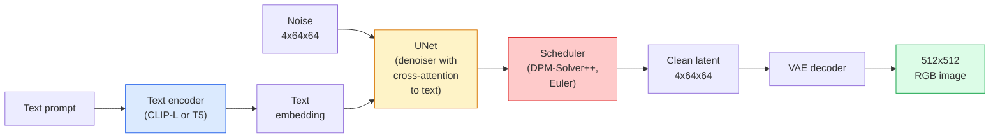

# Khuếch tán ổn định - Kiến trúc & Fine-Tuning

> Khuếch tán ổn định là DDPM chạy trong không gian tiềm ẩn của VAE pretrained, điều kiện dựa trên văn bản qua cross-attention, được lấy mẫu bằng bộ giải ODE xác định nhanh và được điều khiển bởi classifier-free guidance.

**Loại:** Tìm hiểu + Sử dụng
**Ngôn ngữ:** Python
**Kiến thức tiên quyết:** Giai đoạn 4 Bài 10 (Khuếch tán), Giai đoạn 7 Bài 02 (Self-Attention)
**Thời lượng:** ~75 phút

## Mục tiêu học tập

- Trace năm phần của pipeline khuếch tán ổn định: VAE, encoder văn bản, U-Net, bộ lập lịch, trình kiểm tra an toàn - và mỗi phần thực sự làm gì
- Giải thích sự khuếch tán tiềm ẩn và lý do tại sao training trong không gian tiềm ẩn 4x64x64 (thay vì hình ảnh 3x512x512) làm giảm điện toán xuống 48 lần nếu không có loss chất lượng
- Sử dụng `diffusers` để tạo hình ảnh, chạy hình ảnh thành hình ảnh, vẽ và tạo theo hướng dẫn của ControlNet
- Fine-tune Khuếch tán ổn định với LoRA trên một dataset tùy chỉnh nhỏ và tải bộ chuyển đổi LoRA ở inference

## Vấn đề

Training DDPM trực tiếp trên hình ảnh RGB 512x512 rất tốn kém. Mỗi training bước backprops thông qua U-Net nhìn thấy 3x512x512 = 786.432 giá trị đầu vào và sampling nhận 50+ chuyển tiếp đi qua cùng một U-Net đó. Ở mức chất lượng của Khuếch tán ổn định 1.5 (phát hành năm 2022), khuếch tán không gian pixel sẽ cần khoảng 256 GPU tháng training và 10-30 giây cho mỗi hình ảnh trên GPU tiêu dùng.

Thủ thuật làm cho văn bản thành hình ảnh có trọng lượng mở trở nên thực tế là **khuếch tán tiềm ẩn** (Rombach và cộng sự, CVPR 2022). Huấn luyện một VAE ánh xạ hình ảnh 3x512x512 với một tensor tiềm ẩn 4x64x64 và ngược lại, sau đó thực hiện khuếch tán trong không gian tiềm ẩn đó. Điện toán giảm `(3*512*512)/(4*64*64) = 48x`. Sampling giảm từ hàng chục giây xuống dưới hai giây trên cùng một GPU.

Hầu hết mọi model tạo hình ảnh hiện đại - SDXL, SD3, FLUX, HunyuanDiT, Wan-Video - đều là một model khuếch tán tiềm ẩn với các biến thể trên bộ mã hóa tự động, bộ khử nhiễu (U-Net hoặc DiT) và text conditioning. Tìm hiểu Khuếch tán ổn định và bạn đã tìm hiểu mẫu.

## Khái niệm

### Các pipeline



- **VAE** — bộ mã hóa tự động đóng băng. Encoder biến hình ảnh thành tiềm ẩn (được sử dụng cho img2img và training). Decoder biến tiềm ẩn trở lại thành hình ảnh.
- **encoder văn bản **- encoder văn bản CLIP (SD 1.x/2.x), CLIP-L + CLIP-G (SDXL) hoặc T5-XXL (SD3/FLUX). Tạo ra một chuỗi token embeddings.
- **U-Net** — chất khử trùng. Có cross-attention lớp tham dự từ tiềm ẩn đến văn bản embedding ở mọi cấp độ phân giải.
- **Scheduler** — thuật toán sampling (DDIM, Euler, DPM-Solver++). Chọn sigmas, pha trộn nhiễu dự đoán trở lại tiềm ẩn.
- **Trình kiểm tra an toàn** — bộ lọc NSFW / nội dung bất hợp pháp tùy chọn trên hình ảnh đầu ra.

### Classifier-free guidance (CFG)

Plain text conditioning học `epsilon_theta(x_t, t, c)` cho mỗi prompt `c`. CFG huấn luyện cùng một mạng với `c` giảm 10% thời gian (được thay thế bằng một embedding trống), đưa ra một model duy nhất dự đoán cả nhiễu có điều kiện và vô điều kiện. Tại thời điểm inference:

```
eps = eps_uncond + w * (eps_cond - eps_uncond)
```

`w` là thang đo hướng dẫn. `w=0` là vô điều kiện, `w=1` đơn giản là có điều kiện, `w>1` đẩy đầu ra theo hướng "có điều kiện hơn trên prompt" với cái giá phải trả là sự đa dạng. Mặc định SD là `w=7.5`.

CFG là lý do chuyển văn bản thành hình ảnh hoạt động ở chất lượng production. Nếu không có nó, prompts bias đầu ra yếu; với nó, prompts thống trị.

### Hình học không gian tiềm ẩn

Tiềm ẩn 4 kênh của VAE không chỉ là một hình ảnh nén. Nó là một đa dạng trong đó số học gần tương ứng với các chỉnh sửa ngữ nghĩa (prompt kỹ thuật + nội suy đều tồn tại ở đây), và nơi khuếch tán U-Net đã được huấn luyện để chi tiêu toàn bộ ngân sách mô hình hóa của nó. Giải mã một tiềm ẩn 4x64x64 ngẫu nhiên không tạo ra một hình ảnh trông ngẫu nhiên - nó tạo ra rác, bởi vì chỉ có một đa tạp phụ cụ thể của các tiềm ẩn được giải mã thành hình ảnh hợp lệ.

Hai hậu quả:

1. **Img2img** = mã hóa hình ảnh thành tiềm ẩn, thêm nhiễu một phần, chạy bộ khử nhiễu, giải mã. Cấu trúc hình ảnh tồn tại vì mã hóa gần như đảo ngược; nội dung thay đổi dựa trên prompt.
2. **Inpainting** = giống như img2img nhưng bộ khử nhiễu chỉ cập nhật các vùng được che nắng; Các vùng không được che giấu được giữ ở tiềm ẩn được mã hóa.

### Kiến trúc U-Net

SD U-Net là một phiên bản lớn của TinyUNet từ Bài 10 với ba bổ sung:

- **Transformer khối** ở mọi độ phân giải không gian, chứa self-attention + cross-attention cho embedding văn bản.
- **Thời gian embedding **thông qua MLP trên mã hóa hình sin.
- **Bỏ qua kết nối** giữa encoder và decoder ở độ phân giải phù hợp.

Tổng parameters trong SD 1.5: ~860M. SDXL: ~2.6B. THÔNG LƯỢNG: ~12B. Bước nhảy vọt về tham số chủ yếu là ở attention lớp.

### LoRA fine-tuning

Toàn bộ fine-tuning khuếch tán ổn định cần 20+ GB VRAM và cập nhật 860 triệu parameters. LoRA (Thích ứng cấp thấp) giữ cho cơ sở model đóng băng và tiêm các ma trận phân hủy cấp bậc nhỏ vào các lớp attention. Bộ chuyển đổi LoRA cho SD thường có dung lượng 10-50 MB, hoạt động trong 10-60 phút trên một GPU tiêu dùng duy nhất và tải tại thời điểm inference dưới dạng sửa đổi thả vào.

```
Original: W_q : (d_in, d_out)   frozen
LoRA:     W_q + alpha * (A @ B)   where A : (d_in, r), B : (r, d_out)

r is typically 4-32.
```

LoRA là cách hầu hết mọi fine-tune cộng đồng được phân phối. CivitAI và Hugging Face lưu trữ hàng triệu người trong số họ.

### Bộ lập lịch bạn sẽ thấy

- **DDIM** — xác định, ~50 bước, đơn giản.
- **Tổ tiên Euler** — ngẫu nhiên, 30-50 bước, các mẫu sáng tạo hơn một chút.
- **DPM-Solver++ 2M Karras** — xác định, 20-30 bước, production mặc định.
- **LCM / TCD / Turbo** — tính nhất quán models và các biến thể chưng cất; 1-4 bước với chi phí của một số chất lượng.

Hoán đổi bộ lập lịch trình là một thay đổi một dòng trong `diffusers` và đôi khi khắc phục các vấn đề mẫu mà không cần huấn luyện lại.

## Tự xây dựng

Bài học này sử dụng `diffusers` từ đầu đến cuối thay vì xây dựng lại Khuếch tán ổn định từ đầu. Các phần bạn cần xây dựng lại (VAE, text encoder, U-Net, scheduler) là chủ đề của các bài học riêng của chúng; ở đây mục tiêu là lưu loát với production API.

### Bước 1: Chuyển văn bản thành hình ảnh

```python
import torch
from diffusers import StableDiffusionPipeline

pipe = StableDiffusionPipeline.from_pretrained(
    "runwayml/stable-diffusion-v1-5",
    torch_dtype=torch.float16,
).to("cuda")

image = pipe(
    prompt="a dog riding a skateboard in tokyo, studio ghibli style",
    guidance_scale=7.5,
    num_inference_steps=25,
    generator=torch.Generator("cuda").manual_seed(42),
).images[0]
image.save("dog.png")
```

`float16` nửa VRAM không có chất lượng nhìn thấy loss. `num_inference_steps=25` với DPM-Solver ++ mặc định khớp với `num_inference_steps=50` với DDIM.

### Bước 2: Hoán đổi bộ lập lịch

```python
from diffusers import DPMSolverMultistepScheduler, EulerAncestralDiscreteScheduler

pipe.scheduler = DPMSolverMultistepScheduler.from_config(pipe.scheduler.config)
pipe.scheduler = EulerAncestralDiscreteScheduler.from_config(pipe.scheduler.config)
```

Trạng thái bộ lập lịch được tách rời khỏi trọng số U-Net. Bạn có thể huấn luyện về DDPM và lấy mẫu với bất kỳ bộ lập lịch nào.

### Bước 3: Chuyển hình ảnh thành hình ảnh

```python
from diffusers import StableDiffusionImg2ImgPipeline
from PIL import Image

img2img = StableDiffusionImg2ImgPipeline.from_pretrained(
    "runwayml/stable-diffusion-v1-5",
    torch_dtype=torch.float16,
).to("cuda")

init_image = Image.open("dog.png").convert("RGB").resize((512, 512))
out = img2img(
    prompt="a dog riding a skateboard, oil painting",
    image=init_image,
    strength=0.6,
    guidance_scale=7.5,
).images[0]
```

`strength` là lượng nhiễu cần thêm trước khi khử nhiễu (0.0 = không thay đổi, 1.0 = tái tạo hoàn toàn). 0,5-0,7 là phạm vi tiêu chuẩn để chuyển kiểu.

### Bước 4: Sơn lại

```python
from diffusers import StableDiffusionInpaintPipeline

inpaint = StableDiffusionInpaintPipeline.from_pretrained(
    "runwayml/stable-diffusion-inpainting",
    torch_dtype=torch.float16,
).to("cuda")

image = Image.open("dog.png").convert("RGB").resize((512, 512))
mask = Image.open("dog_mask.png").convert("L").resize((512, 512))

out = inpaint(
    prompt="a cat",
    image=image,
    mask_image=mask,
    guidance_scale=7.5,
).images[0]
```

Các điểm ảnh màu trắng trong mặt nạ là khu vực để tái tạo. Các pixel màu đen được giữ nguyên.

### Bước 5: Tải LoRA

```python
pipe.load_lora_weights("sayakpaul/sd-lora-ghibli")
pipe.fuse_lora(lora_scale=0.8)

image = pipe(prompt="a village square in ghibli style").images[0]
```

`lora_scale` kiểm soát sức mạnh; 0.0 = không có tác dụng, 1.0 = hiệu lực đầy đủ. `fuse_lora` nướng bộ chuyển đổi vào trọng lượng tại chỗ để tăng tốc độ, nhưng ngăn chặn việc hoán đổi. Gọi cho `pipe.unfuse_lora()` trước khi tải một bộ điều hợp khác.

### Bước 6: LoRA training (phác thảo)

Real LoRA training sống ở `peft` hoặc `diffusers.training`. Đề cương:

```python
# Pseudocode
for step, batch in enumerate(dataloader):
    images, prompts = batch
    latents = vae.encode(images).latent_dist.sample() * 0.18215

    t = torch.randint(0, num_train_timesteps, (batch_size,))
    noise = torch.randn_like(latents)
    noisy_latents = scheduler.add_noise(latents, noise, t)

    text_emb = text_encoder(tokenizer(prompts))

    pred_noise = unet(noisy_latents, t, text_emb)  # LoRA weights injected here

    loss = F.mse_loss(pred_noise, noise)
    loss.backward()
    optimizer.step()
```

Chỉ những ma trận LoRA mới nhận được gradient; U-Net, VAE và encoder văn bản cơ sở bị đóng băng. Với kích thước batch là 1 và gradient trạm kiểm soát, điều này phù hợp với 8 GB VRAM.

## Ứng dụng

Trong production, các quyết định bạn thực sự đưa ra:

- **Model họ**: SD 1.5 cho các tinh chỉnh cộng đồng mã nguồn mở, SDXL cho độ trung thực cao hơn, SD3 / FLUX cho các yêu cầu cấp phép hiện đại và nghiêm ngặt.
- **Scheduler**: DPM-Solver++ 2M Karras cho 20-30 bước, LCM-LoRA khi độ trễ dưới 1s.
- **Precision**: `float16` trên 4080/4090, `bfloat16` trên A100 và mới hơn, `int8` (qua `bitsandbytes` hoặc `compel`) khi VRAM chặt chẽ.
- **Điều hòa**: văn bản thuần túy hoạt động; để kiểm soát mạnh hơn, hãy thêm ControlNet (canny, depth, pose) lên trên pipeline cơ sở.

Đối với thế hệ batch, `AUTO1111` / `ComfyUI` là công cụ cộng đồng; cho production APIs, `diffusers` + `accelerate` hoặc `optimum-nvidia` với biên dịch TensorRT.

## Sản phẩm bàn giao

Bài học này tạo ra:

- `outputs/prompt-sd-pipeline-planner.md` — một prompt chọn bộ lập lịch SD 1.5 / SDXL / SD3 / FLUX plus và precision với ngân sách độ trễ, mục tiêu độ trung thực và hạn chế cấp phép.
- `outputs/skill-lora-training-setup.md` — một skill viết LoRA training config đầy đủ cho một dataset tùy chỉnh bao gồm chú thích, thứ hạng, kích thước batch và learning rate.

## Bài tập

1. **(Dễ)** Tạo cùng một prompt với `guidance_scale` trong `[1, 3, 5, 7.5, 10, 15]`. Mô tả cách hình ảnh thay đổi. Đồ tạo tác xuất hiện ở giá trị hướng dẫn nào?
2. **(Trung bình) **Chụp bất kỳ bức ảnh thực tế nào, chạy qua `StableDiffusionImg2ImgPipeline` tại `strength` trong `[0.2, 0.4, 0.6, 0.8, 1.0]`. Sức mạnh nào bảo toàn bố cục trong khi thay đổi phong cách? Tại sao 1.0 bỏ qua hoàn toàn đầu vào?
3. **(Khó)** Huấn luyện một LoRA trên 10-20 hình ảnh của một đối tượng duy nhất (thú cưng, logo, nhân vật) và tạo ra những cảnh mới lạ với đối tượng đó trong đó. Báo cáo xếp hạng LoRA và các bước training tạo ra việc bảo quản danh tính tốt nhất mà không cần overfitting đến hình ảnh đầu vào.

## Thuật ngữ chính

| Thuật ngữ | Những gì mọi người nói | Ý nghĩa thực sự của nó |
|------|----------------|----------------------|
| Khuếch tán tiềm ẩn | "Khuếch tán trong tiềm ẩn" | Chạy toàn bộ DDPM trong không gian tiềm ẩn VAE (4x64x64) thay vì không gian pixel (3x512x512); Tiết kiệm điện toán gấp 48 lần |
| Hệ số tỷ lệ VAE | "0.18215" | Hằng số điều chỉnh lại tiềm ẩn thô của VAE thành gần đơn vị variance; được mã hóa cứng trong mọi pipeline SD |
| Classifier-free guidance | "CFG" | Kết hợp dự đoán nhiễu có điều kiện và vô điều kiện; Núm inference có tác động mạnh nhất |
| Lập lịch trình | "Bộ lấy mẫu" | Thuật toán biến dự đoán nhiễu + model thành quỹ đạo tiềm ẩn khử nhiễu |
| LoRA | "Bộ chuyển đổi cấp thấp" | Ma trận phân hủy cấp bậc nhỏ fine-tune attention lớp mà không chạm vào trọng lượng cơ bản |
| Cross-attention | "attention văn bản-hình ảnh" | Attention từ tokens tiềm ẩn sang tokens văn bản; đưa thông tin prompt vào mọi cấp độ U-Net |
| Mạng kiểm soát | "Điều hòa cấu trúc" | Một bộ chuyển đổi được huấn luyện riêng để điều khiển SD với một đầu vào bổ sung (canny, depth, pose, segmentation) |
| Trình giải DPM ++ | "Bộ lập lịch mặc định" | Bộ giải ODE xác định bậc hai; Chất lượng tốt nhất với số bước thấp (20-30) vào năm 2026 |

## Đọc thêm

- [High-Resolution Image Synthesis with Latent Diffusion (Rombach et al., 2022)](https://arxiv.org/abs/2112.10752) - bài báo Khuếch tán ổn định; bao gồm mọi thao tác cắt bỏ phù hợp với thiết kế
- [Classifier-Free Diffusion Guidance (Ho & Salimans, 2022)](https://arxiv.org/abs/2207.12598) — bài báo CFG
- [LoRA: Low-Rank Adaptation of Large Language Models (Hu et al., 2021)](https://arxiv.org/abs/2106.09685) - LoRA là NLP đầu tiên; nó được chuyển sang SD mà hầu như không có thay đổi
- [diffusers documentation](https://huggingface.co/docs/diffusers) - tham chiếu cho mọi pipeline SD / SDXL / SD3 / FLUX
