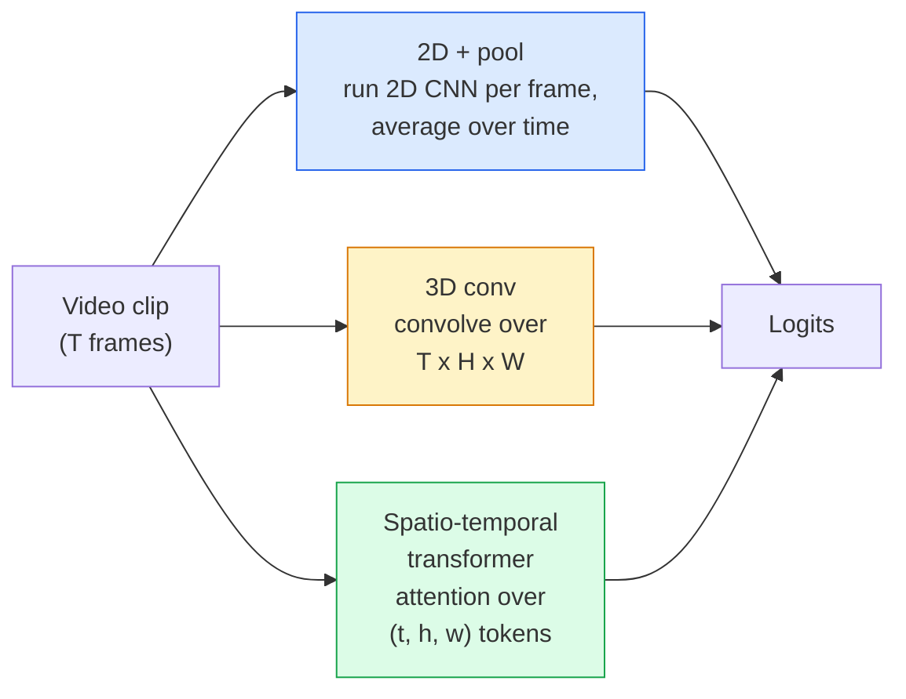

# Hiểu video - Mô hình thời gian

> Video là một chuỗi hình ảnh cộng với vật lý kết nối chúng. Mỗi video model coi thời gian như một trục phụ (chuyển đổi 3D), một trình tự để tham dự (transformer) hoặc một feature để trích xuất một lần và gộp (2D + pool).

**Loại:** Tìm hiểu + Xây dựng
**Ngôn ngữ:** Python
**Kiến thức tiên quyết:** Giai đoạn 4 Bài 03 (CNN), Giai đoạn 4 Bài 04 (Phân loại hình ảnh)
**Thời lượng:** ~45 phút

## Mục tiêu học tập

- Phân biệt ba phương pháp tiếp cận mô hình video chính (2D + pool, 3D conv, transformer không gian-thời gian) và dự đoán sự đánh đổi chi phí và accuracy của chúng
- Triển khai sampling khung, gộp thời gian và bộ phân loại đường cơ sở 2D + nhóm trong PyTorch
- Giải thích lý do tại sao các hạt nhân 3D "thổi phồng" của I3D truyền tốt từ trọng số ImageNet và conv D được thừa số (2 + 1) làm gì khác nhau
- Đọc các datasets và số liệu nhận dạng hành động tiêu chuẩn: Kinetics-400/600, UCF101, Something-Something V2; Top 1 accuracy ở cấp độ clip và video

## Vấn đề

Video 30 giây ở tốc độ 30 khung hình / giây là 900 hình ảnh. Ngây thơ, phân loại video là phân loại hình ảnh chạy 900 lần, sau đó là một số loại tổng hợp. Điều đó hoạt động khi hành động hiển thị trong hầu hết mọi khung hình (video thể thao, nấu ăn, tập thể dục) và thất bại nghiêm trọng khi hành động được xác định bởi chính chuyển động: "đẩy thứ gì đó từ trái sang phải" trông giống như hai đối tượng tĩnh trong mỗi khung hình.

Câu hỏi cốt lõi cho mọi kiến trúc video là: khi nào cấu trúc thời gian được mô hình hóa và làm thế nào? Câu trả lời thúc đẩy mọi thứ khác - chi phí tính toán, chiến lược pretraining, liệu bạn có thể sử dụng lại trọng số ImageNet hay không, datasets huấn luyện model nào.

Bài học này cố tình ngắn hơn các bài học về hình ảnh tĩnh. Bộ máy hình ảnh cốt lõi đã có sẵn và hiểu video chủ yếu là về câu chuyện thời gian: sampling, mô hình hóa và tổng hợp.

## Khái niệm

### Ba gia đình kiến trúc



### 2D + hồ bơi

Lấy CNN 2D (ResNet, EfficientNet, ViT). Chạy nó độc lập trên mọi khung hình được lấy mẫu. Trung bình (hoặc max-pool hoặc attention-pool) embeddings trên mỗi khung hình. Cho vector gộp vào bộ phân loại.

Ưu điểm:
- ImageNet pretraining truyền trực tiếp.
- Đơn giản nhất để thực hiện.
- Giá rẻ: Khung hình T * chi phí inference hình ảnh đơn.

Nhược điểm:
- Không thể model chuyển động. Hành động = tổng hợp của sự xuất hiện.
- Gộp thời gian là bất biến theo thứ tự; "Mở cửa" và "Đóng cửa" trông giống nhau.

Khi nào sử dụng: các nhiệm vụ nặng về ngoại hình, chuyển giao kiến thức trên datasets video nhỏ, đường cơ sở ban đầu.

### Tích chập 3D

Thay thế hạt nhân 2D (H, W) bằng hạt nhân 3D (T, H, W). Mạng lưới bao gồm cả không gian và thời gian. Gia đình đầu tiên: C3D, I3D, SlowFast.

Thủ thuật I3D: lấy một model ImageNet 2D pretrained, "thổi phồng" từng hạt nhân 2D bằng cách sao chép nó dọc theo một trục thời gian mới. Chuyển đổi 3x3 2D trở thành chuyển đổi 3D 3x3x3. Điều này mang lại cho 3D model trọng lượng pretrained mạnh mẽ thay vì training từ đầu.

Ưu điểm:
- Trực tiếp models chuyển động.
- Lạm phát I3D cho phép học chuyển tiếp miễn phí.

Nhược điểm:
- T/8 FLOPs hơn so với đối tác 2D (đối với hạt nhân thời gian 3 xếp chồng lên nhau 3 lần).
- Hạt thái dương nhỏ; Chuyển động tầm xa cần cách tiếp cận kim tự tháp hoặc luồng kép.

Khi nào sử dụng: nhận dạng hành động trong đó chuyển động là tín hiệu (Something-Something V2, Kinetics với chuyển động nặng classes).

### transformers không gian-thời gian

Mã hóa video thành một lưới các bản vá không-thời gian và tham gia trên tất cả chúng. TimeSformer, ViViT, Video Swin, VideoMAE.

Attention mẫu quan trọng:
- **Khớp **- một attention lớn (t, h, w). bậc hai trong `T*H*W`; đắt tiền.
- **Phân chia** — hai sự chú ý trên mỗi khối: một theo thời gian, một trên không gian. Tỷ lệ tuyến tính.
- **Thừa số** — thời gian attention xen kẽ với attention không gian giữa các khối.

Ưu điểm:
- SOTA accuracy trên mọi benchmark lớn.
- Truyền từ transformers hình ảnh (ViT) thông qua lạm phát bản vá.
- Hỗ trợ video ngữ cảnh dài thông qua attention thưa thớt.

Nhược điểm:
- Khao khát điện toán.
- Yêu cầu lựa chọn mẫu attention cẩn thận hoặc runtime bóng bay.

Khi nào sử dụng: datasets lớn, hiểu video có độ trung thực cao, tác vụ video + văn bản đa phương thức.

### Khung sampling

Clip 10 giây ở tốc độ 30 khung hình / giây là 300 khung hình; Cho tất cả 300 con ăn cho bất kỳ model nào là lãng phí. Chiến lược tiêu chuẩn:

- **sampling đồng nhất **- chọn khung chữ T đều trên clip. Mặc định cho 2D + pool.
- **sampling dày đặc **- cửa sổ khung chữ T liền kề ngẫu nhiên. Phổ biến cho các hình ảnh 3D vì chuyển động yêu cầu các khung hình lân cận.
- **Nhiều clip** — lấy mẫu nhiều windows T-frame từ cùng một video, phân loại từng dự đoán trung bình tại thời điểm thử nghiệm.

T thường là 8, 16, 32 hoặc 64. T cao hơn = nhiều tín hiệu thời gian hơn khi tính toán nhiều hơn.

### Đánh giá

Hai cấp độ:
- **accuracy cấp độ clip **- model nhìn thấy một clip khung hình chữ T, báo cáo top-k.
- **accuracy cấp độ video** — dự đoán mức clip trung bình trên nhiều clip trên mỗi video; cao hơn và ổn định hơn.

Luôn báo cáo cả hai. Một model đạt 78% clip / 82% video phụ thuộc nhiều vào tính trung bình thời gian thử nghiệm; một trong những điểm 80% / 81% mạnh mẽ hơn cho mỗi clip.

### Datasets bạn sẽ gặp

- **Kinetics-400 / 600 / 700 **— dataset hành động có mục đích chung. 400k clip; URL YouTube (nhiều URL hiện đã chết).
- **Something-Something V2** — hành động được xác định theo chuyển động ("di chuyển X từ trái sang phải"). Không thể giải quyết bằng 2D + pool.
- **UCF-101**, **HMDB-51** — cũ hơn, nhỏ hơn, vẫn được báo cáo.
- **AVA** — hành động *bản địa hóa* trong không gian và thời gian; khó hơn phân loại.

## Tự xây dựng

### Bước 1: Bộ lấy mẫu khung

Bộ lấy mẫu đồng nhất và dày đặc hoạt động trên danh sách khung hình (hoặc tensor video).

```python
import numpy as np

def sample_uniform(num_frames_total, T):
    if num_frames_total <= T:
        return list(range(num_frames_total)) + [num_frames_total - 1] * (T - num_frames_total)
    step = num_frames_total / T
    return [int(i * step) for i in range(T)]


def sample_dense(num_frames_total, T, rng=None):
    rng = rng or np.random.default_rng()
    if num_frames_total <= T:
        return list(range(num_frames_total)) + [num_frames_total - 1] * (T - num_frames_total)
    start = int(rng.integers(0, num_frames_total - T + 1))
    return list(range(start, start + T))
```

Cả hai đều trả về `T` chỉ mục mà bạn sử dụng để cắt tensor video.

### Bước 2: Đường cơ sở 2D + hồ bơi

Chạy 2D ResNet-18 trên mọi khung hình, features nhóm trung bình, phân loại.

```python
import torch
import torch.nn as nn
from torchvision.models import resnet18, ResNet18_Weights

class FramePool(nn.Module):
    def __init__(self, num_classes=400, pretrained=True):
        super().__init__()
        weights = ResNet18_Weights.IMAGENET1K_V1 if pretrained else None
        backbone = resnet18(weights=weights)
        self.features = nn.Sequential(*(list(backbone.children())[:-1]))  # global avg pool kept
        self.head = nn.Linear(512, num_classes)

    def forward(self, x):
        # x: (N, T, 3, H, W)
        N, T = x.shape[:2]
        x = x.view(N * T, *x.shape[2:])
        feats = self.features(x).view(N, T, -1)
        pooled = feats.mean(dim=1)
        return self.head(pooled)

model = FramePool(num_classes=10)
x = torch.randn(2, 8, 3, 224, 224)
print(f"output: {model(x).shape}")
print(f"params: {sum(p.numel() for p in model.parameters()):,}")
```

Mười một triệu parameters, ImageNet pretrained, chạy trên mỗi khung hình, trung bình, phân loại. Đường cơ sở này thường nằm trong khoảng 5-10 điểm của models 3D thích hợp cho các tác vụ nặng về ngoại hình - đôi khi tốt hơn, vì nó sử dụng lại đường trục ImageNet mạnh hơn.

### Bước 3: Chuyển đổi 3D thổi phồng theo phong cách I3D

Biến một chuyển đổi 2D thành chuyển đổi 3D bằng cách lặp lại trọng số dọc theo trục thời gian mới.

```python
def inflate_2d_to_3d(conv2d, time_kernel=3):
    out_c, in_c, kh, kw = conv2d.weight.shape
    weight_3d = conv2d.weight.data.unsqueeze(2)  # (out, in, 1, kh, kw)
    weight_3d = weight_3d.repeat(1, 1, time_kernel, 1, 1) / time_kernel
    conv3d = nn.Conv3d(in_c, out_c, kernel_size=(time_kernel, kh, kw),
                        padding=(time_kernel // 2, conv2d.padding[0], conv2d.padding[1]),
                        stride=(1, conv2d.stride[0], conv2d.stride[1]),
                        bias=False)
    conv3d.weight.data = weight_3d
    return conv3d

conv2d = nn.Conv2d(3, 64, kernel_size=3, padding=1, bias=False)
conv3d = inflate_2d_to_3d(conv2d, time_kernel=3)
print(f"2D weight shape:  {tuple(conv2d.weight.shape)}")
print(f"3D weight shape:  {tuple(conv3d.weight.shape)}")
x = torch.randn(1, 3, 8, 56, 56)
print(f"3D output shape:  {tuple(conv3d(x).shape)}")
```

Phép chia cho `time_kernel` giữ cho cường độ kích hoạt gần như không đổi - quan trọng để không phá vỡ số liệu thống kê tiêu chuẩn batch trong lần vượt qua đầu tiên.

### Bước 4: Chuyển đổi phân tích (2 + 1) D

Chia một chuyển đổi 3D thành một chuyển đổi 2D (không gian) và 1D (thời gian). Cùng một lĩnh vực tiếp thu, ít parameters hơn, tốt hơn accuracy trên một số benchmarks.

```python
class Conv2Plus1D(nn.Module):
    def __init__(self, in_c, out_c, kernel_size=3):
        super().__init__()
        mid_c = (in_c * out_c * kernel_size * kernel_size * kernel_size) \
                // (in_c * kernel_size * kernel_size + out_c * kernel_size)
        self.spatial = nn.Conv3d(in_c, mid_c, kernel_size=(1, kernel_size, kernel_size),
                                 padding=(0, kernel_size // 2, kernel_size // 2), bias=False)
        self.bn = nn.BatchNorm3d(mid_c)
        self.act = nn.ReLU(inplace=True)
        self.temporal = nn.Conv3d(mid_c, out_c, kernel_size=(kernel_size, 1, 1),
                                  padding=(kernel_size // 2, 0, 0), bias=False)

    def forward(self, x):
        return self.temporal(self.act(self.bn(self.spatial(x))))

c = Conv2Plus1D(3, 64)
x = torch.randn(1, 3, 8, 56, 56)
print(f"(2+1)D output: {tuple(c(x).shape)}")
```

Một mạng R (2 + 1) D đầy đủ giống như ResNet-18 với mỗi 3x3 chuyển đổi được thay thế bằng `Conv2Plus1D`.

## Ứng dụng

Hai thư viện bao gồm các tác phẩm video production:

- `torchvision.models.video` - R (2 + 1) D, MViT, Swin3D với trọng lượng pretrained Kinetics. Tương tự API như hình ảnh models.
- `pytorchvideo` (Meta) — model sở thú, bộ tải dữ liệu cho Kinetics / SSv2 / AVA, biến đổi tiêu chuẩn.

Đối với models video Ngôn ngữ Tầm nhìn (phụ đề video, QA video), hãy sử dụng `transformers` (`VideoMAE`, `VideoLLaMA`, `InternVideo`).

## Sản phẩm bàn giao

Bài học này tạo ra:

- `outputs/prompt-video-architecture-picker.md` — một prompt chọn 2D + pool / I3D / (2 + 1) D / transformer dựa trên giao diện so với chuyển động, kích thước dataset và ngân sách tính toán.
- `outputs/skill-frame-sampler-auditor.md` — một skill kiểm tra bộ lấy mẫu của pipeline video và gắn cờ các lỗi phổ biến: chỉ mục không đúng một, sampling không đồng đều khi `num_frames < T`, thiếu cắt giữ nguyên khía cạnh, v.v.

## Bài tập

1. **(Dễ dàng)** Tính toán FLOPs (gần đúng) cho FramePool với T=8 so với ResNet 3D kiểu I3D với T=8. Biện minh tại sao 2D + pool rẻ hơn 3-5 lần.
2. **(Trung bình)** Tạo dataset video tổng hợp: các quả bóng ngẫu nhiên di chuyển theo hướng ngẫu nhiên, được gắn nhãn theo hướng chuyển động ("trái sang phải", "phải sang trái", "chéo lên"). Huấn luyện FramePool trên đó. Cho thấy rằng nó đạt được accuracy gần như cơ hội, chứng minh rằng chỉ ngoại hình là không đủ cho các nhiệm vụ chuyển động.
3. **(Cứng)** Xây dựng R(2+1)D-18 bằng cách thay thế mọi Conv2d trong ResNet-18 bằng `Conv2Plus1D`. Thổi phồng trọng số của conv đầu tiên từ ImageNet-pretrained ResNet-18. Rèn luyện dataset chuyển động từ bài tập 2 và đánh bại FramePool.

## Thuật ngữ chính

| Thuật ngữ | Những gì mọi người nói | Ý nghĩa thực sự của nó |
|------|----------------|----------------------|
| 2D + hồ bơi | "Bộ phân loại trên mỗi khung hình" | Chạy CNN 2D trên mọi khung hình được lấy mẫu, features nhóm trung bình theo thời gian, phân loại |
| Tích chập 3D | "Hạt nhân không gian-thời gian" | Hạt nhân bao gồm (T, H, W); có thể model chuyển động nguyên bản |
| Lạm phát | "Nâng tạ 2D lên 3D" | Khởi tạo trọng số conv 3D bằng cách lặp lại trọng số của conv 2D dọc theo trục thời gian mới, sau đó chia cho kernel_T để duy trì thang kích hoạt |
| (2+1)D | "Conv nhân số" | Chia 3D thành không gian 2D + thời gian 1D; ít parameters hơn, thêm phi tuyến tính giữa |
| Chia attention | "Thời gian rồi không gian" | Transformer khối với hai chú ý trên mỗi lớp: một trên tokens ở cùng một khung hình, một trên tokens ở cùng một vị trí |
| Clip | "Cửa sổ khung chữ T" | Một dãy con được lấy mẫu của khung hình T; đơn vị mà video model tiêu thụ |
| Clip so với video accuracy | "Hai cài đặt đánh giá" | Clip = một mẫu cho mỗi video, video = trung bình trên nhiều clip được lấy mẫu |
| Động học | "ImageNet của video" | 400-700 classes hành động, 300k+ clip YouTube, kho dữ liệu pretraining video tiêu chuẩn |

## Đọc thêm

- [I3D: Quo Vadis, Action Recognition (Carreira & Zisserman, 2017)](https://arxiv.org/abs/1705.07750) - giới thiệu lạm phát và động học dataset
- [R(2+1)D: A Closer Look at Spatiotemporal Convolutions (Tran et al., 2018)](https://arxiv.org/abs/1711.11248) - conv nhân tố, vẫn là đường cơ sở mạnh mẽ
- [TimeSformer: Is Space-Time Attention All You Need? (Bertasius et al., 2021)](https://arxiv.org/abs/2102.05095) — video mạnh mẽ đầu tiên transformer
- [VideoMAE (Tong et al., 2022)](https://arxiv.org/abs/2203.12602) - bộ mã hóa tự động được che giấu pretraining cho video; Công thức pretraining thống trị hiện tại
