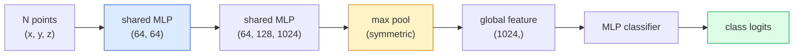

# Tầm nhìn 3D - Đám mây điểm và NeRF

> Tầm nhìn 3D có hai hương vị. Đám mây điểm là đầu ra thô của cảm biến. NeRF là trường thể tích đã học. Cả hai đều trả lời "cái gì ở đâu trong không gian".

**Loại:** Tìm hiểu + Xây dựng
**Ngôn ngữ:** Python
**Kiến thức tiên quyết:** Giai đoạn 4 Bài 03 (CNN), Giai đoạn 1 Bài 12 (Tensor Thao tác)
**Thời lượng:** ~45 phút

## Mục tiêu học tập

- Phân biệt biểu diễn 3D rõ ràng (điểm cloud, lưới, voxel) và ngầm (trường khoảng cách có dấu, NeRF) và khi nào mỗi biểu diễn được sử dụng
- Hiểu thủ thuật chức năng đối xứng của PointNet làm cho hoán vị mạng nơ-ron bất biến trên một tập hợp các điểm không có thứ tự
- Trace forward pass NeRF: đúc tia, kết xuất thể tích, mã hóa vị trí, mật độ MLP + đầu màu
- Sử dụng `nerfstudio` hoặc `instant-ngp` để tái tạo 3D pretrained từ một tập hợp nhỏ các hình ảnh tạo dáng

## Vấn đề

Một máy ảnh tạo ra hình ảnh 2D. LIDAR tạo ra một tập hợp các điểm 3D mà không có thứ tự. Một pipeline cấu trúc từ chuyển động tạo ra một cloud thưa các điểm chính 3D. NeRF tái tạo toàn bộ cảnh 3D từ một số hình ảnh tạo dáng. Tất cả những điều này đều là "tầm nhìn" nhưng không ai trong số chúng trông giống như tensor dày đặc mà CNN muốn.

Tầm nhìn 3D quan trọng vì hầu hết mọi tác vụ robot có giá trị cao đều chạy ở chế độ 3D: nắm, tránh chướng ngại vật, điều hướng, che giấu AR, chụp nội dung 3D. Một kỹ sư thị giác chỉ hiểu hình ảnh 2D bị khóa khỏi phần phát triển nhanh nhất của lĩnh vực này (nội dung AR/VR, robot, stacks lái xe tự động, tái tạo 3D dựa trên NeRF cho bất động sản hoặc xây dựng).

Hai đại diện chiếm ưu thế vì những lý do khác nhau. Đám mây điểm là những gì cảm biến cung cấp cho bạn miễn phí. NeRF và những người kế nhiệm của chúng (bắn tung tóe Gaussian 3D, SDF thần kinh) là những gì bạn nhận được khi yêu cầu mạng nơ-ron học một cảnh.

## Khái niệm

### Đám mây điểm

Một điểm cloud là một tập hợp các điểm không có thứ tự trong R^3, tùy chọn mỗi điểm có features (màu sắc, cường độ, bình thường).

```
cloud = [
  (x1, y1, z1, r1, g1, b1),
  (x2, y2, z2, r2, g2, b2),
  ...
  (xN, yN, zN, rN, gN, bN),
]
```

Không có lưới, không có kết nối. Hai thuộc tính làm cho điều này trở nên khó khăn đối với mạng nơ-ron:

- **Bất biến hoán vị **- đầu ra không được phụ thuộc vào thứ tự điểm.
- **Biến N** — một model duy nhất phải xử lý các đám mây có kích thước khác nhau.

PointNet (Qi et al., 2017) đã giải quyết cả hai bằng một ý tưởng: áp dụng MLP được chia sẻ cho mọi điểm, sau đó tổng hợp với một hàm đối xứng (max pool). Kết quả là một vector kích thước cố định không phụ thuộc vào thứ tự.

```
f(P) = max_{p in P} MLP(p)
```

Đây là toàn bộ cốt lõi của PointNet. Các biến thể sâu hơn (PointNet++, Point Transformer) thêm sampling phân cấp và tổng hợp cục bộ nhưng thủ thuật hàm đối xứng không thay đổi.

### Kiến trúc PointNet



"MLP được chia sẻ" có nghĩa là cùng một MLP chạy trên mọi điểm một cách độc lập. Được thực hiện dưới dạng chuyển đổi 1x1 trên kích thước điểm để đạt hiệu quả.

### Trường bức xạ thần kinh (NeRF)

NeRFs (Mildenhall et al., 2020) đã đưa ra câu hỏi "chúng ta có thể tái tạo cảnh 3D từ N ảnh không?" và trả lời bằng mạng nơ-ron là cảnh. Mạng ánh xạ `(x, y, z, viewing_direction)` đến `(density, colour)`. Hiển thị chế độ xem mới là một vòng lặp truyền tia qua mạng này.

```
NeRF MLP:  (x, y, z, theta, phi) -> (sigma, r, g, b)

To render a pixel (u, v) of a new view:
  1. Cast a ray from the camera through pixel (u, v)
  2. Sample points along the ray at distances t_1, t_2, ..., t_N
  3. Query the MLP at each point
  4. Composite the colours weighted by (1 - exp(-sigma * dt))
  5. The sum is the rendered pixel colour
```

Một loss so sánh pixel được kết xuất với pixel thực tế trên mặt đất trong training ảnh. Backprop thông qua bước kết xuất cập nhật MLP. Không có ground truth 3D, không có hình học rõ ràng - cảnh được lưu trữ trong trọng số MLP.

### Mã hóa vị trí trong NeRF

MLP vani trên `(x, y, z)` không thể đại diện cho các chi tiết tần số cao vì MLP thiên về mặt quang phổ đối với tần số thấp. NeRF khắc phục điều này bằng cách mã hóa mỗi tọa độ thành một feature vector Fourier trước MLP:

```
gamma(p) = (sin(2^0 pi p), cos(2^0 pi p), sin(2^1 pi p), cos(2^1 pi p), ...)
```

Lên đến L = 10 mức tần số. Đây là thủ thuật tương tự transformers sử dụng cho các vị trí và nó xuất hiện một lần nữa trong điều kiện thời gian khuếch tán (Bài 10). Nếu không có nó, NeRF trông mờ.

### Kết xuất thể tích

```
C(r) = sum_i T_i * (1 - exp(-sigma_i * delta_i)) * c_i

T_i  = exp(- sum_{j<i} sigma_j * delta_j)
delta_i = t_{i+1} - t_i
```

`T_i` là độ truyền - bao nhiêu ánh sáng tồn tại đến điểm i. `(1 - exp(-sigma_i * delta_i))` là độ mờ tại điểm i. `c_i` là màu sắc. Pixel cuối cùng là một tổng có trọng số dọc theo tia.

### Điều gì đã thay thế NeRF

NeRF thuần túy huấn luyện chậm (giờ) và hiển thị chậm (giây trên mỗi hình ảnh). Dòng truyền thừa từ:

- **Instant-NGP** (2022) — mã hóa lưới băm thay thế đầu vào vị trí của MLP; huấn luyện trong vài giây.
- **Mip-NeRF 360** — xử lý các cảnh không giới hạn và khử răng cưa.
- **3D Gaussian Splatting** (2023) — thay thế trường thể tích bằng hàng triệu Gaussian 3D; huấn luyện trong vài phút, kết xuất trong thời gian thực. production hiện tại mặc định.

Hầu hết mọi sản phẩm NeRF thực sự vào năm 2026 thực sự là bắn tung tóe Gaussian 3D. model tinh thần vẫn là NeRF.

### Datasets và benchmarks

- **ShapeNet** — phân loại và phân đoạn các models CAD 3D dưới dạng đám mây điểm.
- **ScanNet** — quét trong nhà thực để phân đoạn.
- **KITTI** — đám mây điểm LIDAR ngoài trời để lái xe tự động.
- **NeRF Synthetic** / **Blended MVS** — datasets hình ảnh tạo dáng để xem tổng hợp.
- **Mip-NeRF 360 **dataset - cảnh thực không giới hạn.

## Tự xây dựng

### Bước 1: Bộ phân loại PointNet

```python
import torch
import torch.nn as nn

class PointNet(nn.Module):
    def __init__(self, num_classes=10):
        super().__init__()
        self.mlp1 = nn.Sequential(
            nn.Conv1d(3, 64, 1),    nn.BatchNorm1d(64),   nn.ReLU(inplace=True),
            nn.Conv1d(64, 64, 1),   nn.BatchNorm1d(64),   nn.ReLU(inplace=True),
        )
        self.mlp2 = nn.Sequential(
            nn.Conv1d(64, 128, 1),  nn.BatchNorm1d(128),  nn.ReLU(inplace=True),
            nn.Conv1d(128, 1024, 1), nn.BatchNorm1d(1024), nn.ReLU(inplace=True),
        )
        self.head = nn.Sequential(
            nn.Linear(1024, 512),   nn.BatchNorm1d(512),  nn.ReLU(inplace=True),
            nn.Dropout(0.3),
            nn.Linear(512, 256),    nn.BatchNorm1d(256),  nn.ReLU(inplace=True),
            nn.Dropout(0.3),
            nn.Linear(256, num_classes),
        )

    def forward(self, x):
        # x: (N, 3, num_points) — transposed for Conv1d
        x = self.mlp1(x)
        x = self.mlp2(x)
        x = torch.max(x, dim=-1)[0]       # (N, 1024)
        return self.head(x)

pts = torch.randn(4, 3, 1024)
net = PointNet(num_classes=10)
print(f"output: {net(pts).shape}")
print(f"params: {sum(p.numel() for p in net.parameters()):,}")
```

Khoảng 1,6 triệu parameters. Chạy trên 1,024 điểm mỗi cloud.

### Bước 2: Mã hóa vị trí

```python
def positional_encoding(x, L=10):
    """
    x: (..., D) -> (..., D * 2 * L)
    """
    freqs = 2.0 ** torch.arange(L, dtype=x.dtype, device=x.device)
    args = x.unsqueeze(-1) * freqs * 3.141592653589793
    sinc = torch.cat([args.sin(), args.cos()], dim=-1)
    return sinc.reshape(*x.shape[:-1], -1)

x = torch.randn(5, 3)
y = positional_encoding(x, L=10)
print(f"input:  {x.shape}")
print(f"encoded: {y.shape}     # (5, 60)")
```

Nhân với `2^l * pi` cho tần số cao dần dần.

### Bước 3: NeRF MLP tí hon

```python
class TinyNeRF(nn.Module):
    def __init__(self, L_pos=10, L_dir=4, hidden=128):
        super().__init__()
        self.L_pos = L_pos
        self.L_dir = L_dir
        pos_dim = 3 * 2 * L_pos
        dir_dim = 3 * 2 * L_dir
        self.trunk = nn.Sequential(
            nn.Linear(pos_dim, hidden), nn.ReLU(inplace=True),
            nn.Linear(hidden, hidden),  nn.ReLU(inplace=True),
            nn.Linear(hidden, hidden),  nn.ReLU(inplace=True),
            nn.Linear(hidden, hidden),  nn.ReLU(inplace=True),
        )
        self.sigma = nn.Linear(hidden, 1)
        self.color = nn.Sequential(
            nn.Linear(hidden + dir_dim, hidden // 2), nn.ReLU(inplace=True),
            nn.Linear(hidden // 2, 3), nn.Sigmoid(),
        )

    def forward(self, x, d):
        x_enc = positional_encoding(x, self.L_pos)
        d_enc = positional_encoding(d, self.L_dir)
        h = self.trunk(x_enc)
        sigma = torch.relu(self.sigma(h)).squeeze(-1)
        rgb = self.color(torch.cat([h, d_enc], dim=-1))
        return sigma, rgb

nerf = TinyNeRF()
x = torch.randn(128, 3)
d = torch.randn(128, 3)
s, c = nerf(x, d)
print(f"sigma: {s.shape}   rgb: {c.shape}")
```

Nhỏ so với NeRF ban đầu (có 2 thân MLP có độ sâu 8). Đủ để chứng minh kiến trúc.

### Bước 4: Kết xuất thể tích dọc theo một tia

```python
def volumetric_render(sigma, rgb, t_vals):
    """
    sigma: (..., N_samples)
    rgb:   (..., N_samples, 3)
    t_vals: (N_samples,) distances along the ray
    """
    delta = torch.cat([t_vals[1:] - t_vals[:-1], torch.full_like(t_vals[:1], 1e10)])
    alpha = 1.0 - torch.exp(-sigma * delta)
    trans = torch.cumprod(torch.cat([torch.ones_like(alpha[..., :1]), 1.0 - alpha + 1e-10], dim=-1), dim=-1)[..., :-1]
    weights = alpha * trans
    rendered = (weights.unsqueeze(-1) * rgb).sum(dim=-2)
    depth = (weights * t_vals).sum(dim=-1)
    return rendered, depth, weights


N = 64
t_vals = torch.linspace(2.0, 6.0, N)
sigma = torch.rand(N) * 0.5
rgb = torch.rand(N, 3)
rendered, depth, weights = volumetric_render(sigma, rgb, t_vals)
print(f"rendered colour: {rendered.tolist()}")
print(f"depth:           {depth.item():.2f}")
```

Một tia, 64 mẫu, kết hợp thành một pixel RGB duy nhất và một độ sâu.

## Ứng dụng

Đối với công việc thực tế:

- `nerfstudio` (Tancik và cộng sự) — thư viện tham chiếu hiện tại cho NeRF / Instant-NGP / Gaussian Splatting. Dòng lệnh cộng với trình xem web.
- `pytorch3d` (Meta) — kết xuất có thể phân biệt, tiện ích cloud điểm, hoạt động lưới.
- `open3d` — xử lý điểm cloud, đăng ký, trực quan.

Để triển khai, 3D Gaussian splatting phần lớn đã thay thế các NeRF thuần túy vì nó hiển thị nhanh hơn 100 lần. Chất lượng tái tạo có thể so sánh được.

## Sản phẩm bàn giao

Bài học này tạo ra:

- `outputs/prompt-3d-task-router.md` — một prompt định tuyến đến biểu diễn 3D phù hợp (điểm cloud, lưới, voxel, NeRF, Gaussian splat) dựa trên dữ liệu tác vụ và đầu vào.
- `outputs/skill-point-cloud-loader.md` — một skill ghi PyTorch `Dataset` cho các tệp .ply / .pcd / .xyz với chuẩn hóa, định tâm và sampling điểm chính xác.

## Bài tập

1. **(Dễ)** Cho thấy rằng PointNet là hoán vị bất biến: chạy cùng một cloud hai lần, một lần với điểm bị xáo trộn. Xác minh đầu ra giống hệt nhau đến nhiễu dấu phẩy động.
2. **(Trung bình)** Triển khai chức năng tạo tia tối thiểu, dựa trên nội tại và tư thế của máy ảnh, tạo ra nguồn gốc và hướng tia cho mọi pixel của hình ảnh H x W.
3. **(Cứng)** Huấn luyện TinyNeRF trên một dataset tổng hợp các chế độ xem được kết xuất của một khối lập phương màu (được tạo thông qua kết xuất có thể phân biệt hoặc một bộ dò tia đơn giản). Báo cáo kết xuất loss ở epoch 1, 10 và 100. model tạo ra lượt xem dễ nhận biết ở epoch nào?

## Thuật ngữ chính

| Thuật ngữ | Những gì mọi người nói | Ý nghĩa thực sự của nó |
|------|----------------|----------------------|
| Điểm cloud | "Điểm 3D từ LIDAR" | Tập hợp không theo thứ tự (x, y, z) + features tùy chọn trên mỗi điểm |
| PointNet | "Mạng nơ-ron đầu tiên trên đám mây điểm" | MLP được chia sẻ trên mỗi điểm + nhóm đối xứng (tối đa); hoán vị-bất biến theo cấu trúc |
| NeRF | "MLP đó là cảnh" | Ánh xạ mạng (x, y, z, dir) thành (mật độ, màu sắc); Được hiển thị bằng cách đúc tia |
| Mã hóa vị trí | "Fourier features" | Mã hóa từng tọa độ thành sin/cos ở nhiều tần số để vượt qua bias tần số thấp MLP |
| Kết xuất thể tích | "Tích hợp tia" | Các mẫu tổng hợp dọc theo một tia thành một pixel duy nhất bằng cách sử dụng độ truyền và alpha |
| NGP tức thì | "Lưới băm NeRF" | Thay thế MLP tọa độ của NeRF bằng lưới băm đa độ phân giải; Nhanh hơn 100-1000 lần |
| Bắn tung tóe Gaussian 3D | "Hàng triệu người Gaussians" | Cảnh = bộ sưu tập Gaussian 3D; kết xuất trong thời gian thực, tàu trong vài phút |
| SDF | "Trường khoảng cách có dấu" | Chức năng trả về khoảng cách có dấu đến bề mặt gần nhất; Một đại diện ngầm khác |

## Đọc thêm

- [PointNet (Qi et al., 2017)](https://arxiv.org/abs/1612.00593) — bộ phân loại hoán vị-bất biến
- [NeRF (Mildenhall et al., 2020)](https://arxiv.org/abs/2003.08934) - bài báo đã làm cho việc tái tạo 3D từ ảnh trở thành một vấn đề mạng thần kinh
- [Instant-NGP (Müller et al., 2022)](https://arxiv.org/abs/2201.05989) - lưới băm, tăng tốc gấp 1000 lần
- [3D Gaussian Splatting (Kerbl et al., 2023)](https://arxiv.org/abs/2308.04079) - kiến trúc thay thế NeRF vào năm production
