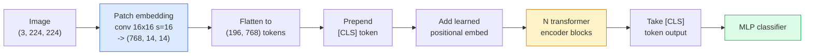

# Tầm nhìn Transformers (ViT)

> Cắt hình ảnh thành các bản vá, coi mỗi bản vá như một từ, chạy một transformer tiêu chuẩn. Đừng nhìn lại.

**Loại:** Xây dựng
**Ngôn ngữ:** Python
**Kiến thức tiên quyết:** Giai đoạn 7 Bài 02 (Self-Attention), Giai đoạn 4 Bài 04 (Phân loại hình ảnh)
**Thời lượng:** ~45 phút

## Mục tiêu học tập

- Triển khai embedding bản vá, các khối embedding, class token và transformer encoder vị trí đã học từ đầu để xây dựng ViT tối thiểu
- Giải thích lý do tại sao ViT được cho là cần dữ liệu pretraining khổng lồ cho đến khi DeiT và MAE chứng minh điều ngược lại
- So sánh ViT, Swin và ConvNeXt về priors kiến trúc của họ (không có, attention cửa sổ cục bộ, đường trục conv)
- Fine-tune ViT pretrained trên một dataset nhỏ bằng cách sử dụng `timm` và công thức đầu dò / fine-tune tuyến tính tiêu chuẩn

## Vấn đề

Trong một thập kỷ, tích chập đồng nghĩa với thị giác máy tính. CNN có những thành kiến quy nạp mạnh mẽ - địa phương, phương sai dịch thuật - mà không ai nghĩ rằng bạn có thể thay thế. Sau đó, Dosovitskiy et al. (2020) đã chỉ ra rằng một transformer đơn giản được áp dụng cho các bản vá hình ảnh phẳng, không có máy móc tích chập, có thể phù hợp hoặc đánh bại các CNN tốt nhất trên quy mô lớn.

Việc đánh bắt là "trên quy mô lớn". ViT trên ImageNet-1k thua ResNet. ViT pretrained trên ImageNet-21k hoặc JFT-300M sau đó fine-tuned trên ImageNet-1k đã đánh bại nó. Kết luận là transformers thiếu priors hữu ích nhưng có thể học chúng từ đủ dữ liệu. Nghiên cứu tiếp theo (DeiT, MAE, DINO) cho thấy rằng với các công thức training phù hợp - tăng cường mạnh mẽ, pretraining tự giám sát distillation - ViT cũng huấn luyện tốt trên dữ liệu nhỏ.

Đến năm 2026, CNN thuần túy vẫn cạnh tranh trên các thiết bị biên (ConvNeXt là mạnh nhất), nhưng transformers thống trị mọi thứ khác: phân đoạn (Mask2Former, SegFormer), phát hiện (DETR, RT-DETR), đa phương thức (CLIP, SigLIP), video (VideoMAE, VJEPA). Cấu trúc khối ViT là một trong những người cần biết.

## Khái niệm

### Các pipeline



Bảy bước. Bản vá -> tokens -> attention -> bộ phân loại. Mỗi biến thể (DeiT, Swin, ConvNeXt, MAE pretraining) thay đổi một hoặc hai trong số bảy biến thể và để yên rest.

### Bản vá embedding

Conv đầu tiên là bí mật. Kích thước hạt nhân 16, sải chân 16, vì vậy hình ảnh 224x224 trở thành lưới 14x14 gồm các mảng 16x16, mỗi mảng được chiếu đến embedding 768 mờ. Conv duy nhất đó vừa vá vừa vá các dự án tuyến tính.

```
Input:  (3, 224, 224)
Conv (3 -> 768, k=16, s=16, no padding):
Output: (768, 14, 14)
Flatten spatial: (196, 768)
```

196 bản vá = 196 tokens. Kích thước feature của mỗi token là 768 (ViT-B), 1024 (ViT-L) hoặc 1280 (ViT-H).

### Class token

Một vector đã học duy nhất được thêm vào trước trình tự:

```
tokens = [CLS; patch_1; patch_2; ...; patch_196]   shape (197, 768)
```

Sau N khối transformer, đầu ra `[CLS]` là biểu diễn hình ảnh toàn cục. Người đứng đầu phân loại chỉ đọc cái này vector.

### embedding vị trí

Transformers không có khái niệm tích hợp về vị trí không gian. Thêm một vector đã học vào mỗi token:

```
tokens = tokens + learned_pos_embedding   (also shape (197, 768))
```

embedding là một parameter của model; training dựa trên gradient điều chỉnh nó cho phù hợp với cấu trúc hình ảnh 2D. Các lựa chọn thay thế 2D hình sin tồn tại nhưng hiếm khi được sử dụng trong thực tế.

### Transformer encoder khối

Tiêu chuẩn. self-attention nhiều đầu, MLP, kết nối dư, LayerNorm trước.

```
x = x + MSA(LN(x))
x = x + MLP(LN(x))

MLP is two-layer with GELU: Linear(d -> 4d) -> GELU -> Linear(4d -> d)
```

ViT-B/16 stacks 12 trong số các khối này, mỗi khối có 12 đầu attention, tổng cộng 86 triệu parameters.

### Tại sao pre-LN

Early transformers sử dụng hậu LN (`x = LN(x + sublayer(x))`) và phải vật lộn để tập luyện qua 6-8 lớp mà không cần khởi động. Pre-LN (`x = x + sublayer(LN(x))`) huấn luyện mạng sâu hơn một cách ổn định mà không cần khởi động. Mọi ViT và mọi LLM hiện đại đều sử dụng pre-LN.

### Đánh đổi kích thước bản vá

- Bản vá 16x16 -> 196 tokens, tiêu chuẩn.
- Bản vá lỗi 32x32 -> 49 tokens, nhanh hơn nhưng độ phân giải thấp hơn.
- Các bản vá 8x8 -> 784 tokens, mịn hơn nhưng O (n ^ 2) attention chi phí tồi tệ.

Các bản vá lớn hơn = ít tokens hơn = nhanh hơn nhưng ít chi tiết không gian hơn. SwinV2 sử dụng các bản vá 4x4 trong windows phân cấp.

### Công thức của DeiT cho training ViT trên ImageNet-1k

ViT ban đầu cần JFT-300M để đánh bại CNN. DeiT (Touvron et al., 2020) đã huấn luyện ViT-B lên 81,8% top-1 chỉ trên ImageNet-1k với bốn thay đổi:

1. Tăng cường nặng: RandAugment, Mixup, CutMix, Random Erasing.
2. Độ sâu ngẫu nhiên (thả ngẫu nhiên toàn bộ khối trong training).
3. Tăng cường lặp đi lặp lại (cùng một hình ảnh được lấy mẫu 3 lần mỗi batch).
4. Distillation từ một giáo viên CNN (tùy chọn, nâng accuracy xa hơn).

Mọi công thức training ViT hiện đại đều bắt nguồn từ DeiT.

### Swin so với ConvNeXt

- **Swin** (Liu và cộng sự, 2021) — attention dựa trên cửa sổ. Mỗi khối tham dự trong một cửa sổ cục bộ; Các khối xen kẽ thay đổi cửa sổ để trộn thông tin trên windows. Mang lại một prior địa phương giống như CNN trong khi vẫn giữ nhà điều hành attention.
- **ConvNeXt** (Liu và cộng sự, 2022) — CNN được thiết kế lại phù hợp với các lựa chọn kiến trúc của Swin (convs theo chiều sâu, LayerNorm, GELU, nút cổ chai ngược). Cho thấy khoảng cách không phải là "attention và chập chập" mà là "công thức training hiện đại + kiến trúc".

Vào năm 2026, ConvNeXt-V2 và Swin-V2 đều là cấp production; sự lựa chọn phù hợp phụ thuộc vào inference stack của bạn (ConvNeXt biên dịch tốt hơn cho biên) và kho dữ liệu pretraining.

### MAE pretraining

Masked Autoencoder (He et al., 2022): che 75% bản vá một cách ngẫu nhiên, huấn luyện encoder chỉ process 25% có thể nhìn thấy, huấn luyện một decoder nhỏ để tái tạo các bản vá được che từ đầu ra của encoder. Sau khi pretraining, bỏ decoder và fine-tune encoder.

MAE làm cho ViT có thể huấn luyện được chỉ trên ImageNet-1k, đạt SOTA và là công thức tự giám sát mặc định hiện tại.

## Tự xây dựng

### Bước 1: Vá embedding

```python
import torch
import torch.nn as nn

class PatchEmbedding(nn.Module):
    def __init__(self, in_channels=3, patch_size=16, dim=192, image_size=64):
        super().__init__()
        assert image_size % patch_size == 0
        self.proj = nn.Conv2d(in_channels, dim, kernel_size=patch_size, stride=patch_size)
        num_patches = (image_size // patch_size) ** 2
        self.num_patches = num_patches

    def forward(self, x):
        x = self.proj(x)
        return x.flatten(2).transpose(1, 2)
```

Một conv, một phẳng, một chuyển vị. Đó là toàn bộ bước từ hình ảnh đến tokens.

### Bước 2: Transformer chặn

Pre-LN, self-attention nhiều đầu, MLP với GELU, kết nối dư.

```python
class Block(nn.Module):
    def __init__(self, dim, num_heads, mlp_ratio=4, dropout=0.0):
        super().__init__()
        self.ln1 = nn.LayerNorm(dim)
        self.attn = nn.MultiheadAttention(dim, num_heads, dropout=dropout, batch_first=True)
        self.ln2 = nn.LayerNorm(dim)
        self.mlp = nn.Sequential(
            nn.Linear(dim, dim * mlp_ratio),
            nn.GELU(),
            nn.Dropout(dropout),
            nn.Linear(dim * mlp_ratio, dim),
            nn.Dropout(dropout),
        )

    def forward(self, x):
        a, _ = self.attn(self.ln1(x), self.ln1(x), self.ln1(x), need_weights=False)
        x = x + a
        x = x + self.mlp(self.ln2(x))
        return x
```

`nn.MultiheadAttention` xử lý việc tách thành các đầu, sản phẩm chấm được chia tỷ lệ và phép chiếu đầu ra. `batch_first=True` vì vậy hình dạng `(N, seq, dim)`.

### Bước 3: ViT

```python
class ViT(nn.Module):
    def __init__(self, image_size=64, patch_size=16, in_channels=3,
                 num_classes=10, dim=192, depth=6, num_heads=3, mlp_ratio=4):
        super().__init__()
        self.patch = PatchEmbedding(in_channels, patch_size, dim, image_size)
        num_patches = self.patch.num_patches
        self.cls_token = nn.Parameter(torch.zeros(1, 1, dim))
        self.pos_embed = nn.Parameter(torch.zeros(1, num_patches + 1, dim))
        self.blocks = nn.ModuleList([
            Block(dim, num_heads, mlp_ratio) for _ in range(depth)
        ])
        self.ln = nn.LayerNorm(dim)
        self.head = nn.Linear(dim, num_classes)
        nn.init.trunc_normal_(self.pos_embed, std=0.02)
        nn.init.trunc_normal_(self.cls_token, std=0.02)

    def forward(self, x):
        x = self.patch(x)
        cls = self.cls_token.expand(x.size(0), -1, -1)
        x = torch.cat([cls, x], dim=1)
        x = x + self.pos_embed
        for blk in self.blocks:
            x = blk(x)
        x = self.ln(x[:, 0])
        return self.head(x)

vit = ViT(image_size=64, patch_size=16, num_classes=10, dim=192, depth=6, num_heads=3)
x = torch.randn(2, 3, 64, 64)
print(f"output: {vit(x).shape}")
print(f"params: {sum(p.numel() for p in vit.parameters()):,}")
```

Khoảng 2,8 triệu parameters - một chiếc ViT nhỏ có thể điều khiển được trên CPU. ViT-B thực là 86 triệu; Định nghĩa class tương tự với `dim=768, depth=12, num_heads=12`.

### Bước 4: Kiểm tra sự tỉnh táo - inference hình ảnh đơn lẻ

```python
logits = vit(torch.randn(1, 3, 64, 64))
print(f"logits: {logits}")
print(f"probs:  {logits.softmax(-1)}")
```

Nên chạy mà không có lỗi. Xác suất tổng thành 1.

## Ứng dụng

`timm` ships mọi biến thể ViT với trọng số ImageNet pretrained. Một dòng:

```python
import timm

model = timm.create_model("vit_base_patch16_224", pretrained=True, num_classes=10)
```

`timm` là production mặc định cho Vision transformers vào năm 2026. Hỗ trợ ViT, DeiT, Swin, Swin-V2, ConvNeXt, ConvNeXt-V2, MaxViT, MViT, EfficientFormer và hàng chục ứng dụng khác trong cùng một API.

Đối với công việc đa phương thức (hình ảnh + văn bản), `transformers` ships CLIP, SigLIP, BLIP-2, LLaVA. Hình ảnh encoder trong tất cả những thứ đó là một biến thể ViT.

## Sản phẩm bàn giao

Bài học này tạo ra:

- `outputs/prompt-vit-vs-cnn-picker.md` — một prompt chọn giữa ViT, ConvNeXt hoặc Swin dựa trên kích thước dataset, tính toán và inference stack.
- `outputs/skill-vit-patch-and-pos-embed-inspector.md` — một skill xác minh embedding bản vá của ViT và hình dạng embedding vị trí khớp với độ dài trình tự dự kiến của model, bắt các lỗi chuyển phổ biến nhất.

## Bài tập

1. **(Dễ dàng)** In hình dạng của mọi tensor trung gian để forward pass thông qua ViT nhỏ ở trên. Xác nhận: các bản vá lỗi `(N, 3, 64, 64)` -> đầu vào `(N, 16, 192)` -> với đầu vào bộ phân loại CLS `(N, 17, 192)` -> `(N, 192)` `(N, num_classes)` đầu ra ->.
2. **(Trung bình)** Fine-tune một pretrained `timm` ViT-S/16 về dataset CIFAR tổng hợp từ Bài 4. So sánh với ResNet-18 fine-tuning trên cùng một dữ liệu. Báo cáo thời gian training và accuracy cuối cùng.
3. **(Cứng)** Triển khai MAE pretraining cho ViT nhỏ: che 75% bản vá, huấn luyện encoder + một decoder nhỏ để tái tạo các bản vá mặt nạ. Đánh giá accuracy đầu dò tuyến tính trên dữ liệu tổng hợp trước và sau pretraining.

## Thuật ngữ chính

| Thuật ngữ | Những gì mọi người nói | Ý nghĩa thực sự của nó |
|------|----------------|----------------------|
| Bản vá embedding | "Chuyển đổi đầu tiên" | Một conv với kích thước hạt nhân = sải chân = kích thước bản vá; biến hình ảnh thành lưới token embeddings |
| Class token | "[CLS]" | Một vector học được đặt trước trình tự token; đầu ra cuối cùng của nó là biểu diễn hình ảnh toàn cầu |
| embedding vị trí | "Vị trí đã học" | Một vector học được thêm vào mọi token để transformer biết mỗi bản vá đến từ đâu |
| Trước LN | "LayerNorm trước lớp con" | Biến thể transformer ổn định: `x + sublayer(LN(x))` thay vì `LN(x + sublayer(x))` |
| Multi-head attention | "Song song attention" | transformer attention tiêu chuẩn được chia thành num_heads không gian con độc lập, được nối sau đó |
| ViT-B/16 | "Cơ sở, bản vá 16" | Kích thước chuẩn: mờ = 768, chiều sâu = 12, đầu = 12, patch_size = 16, hình ảnh = 224; ~86 triệu tham số |
| DeiT | "ViT hiệu quả dữ liệu" | ViT được huấn luyện chỉ trên ImageNet-1k với sự tăng cường mạnh mẽ; pretraining datasets lớn đã được chứng minh không được yêu cầu nghiêm ngặt |
| MAE | "Bộ mã hóa tự động mặt nạ" | pretraining tự giám sát: che 75% miếng dán, tái tạo; công thức ViT pretraining thống trị |

## Đọc thêm

- [An Image is Worth 16x16 Words (Dosovitskiy et al., 2020)](https://arxiv.org/abs/2010.11929) — bài báo ViT
- [DeiT: Data-efficient Image Transformers (Touvron et al., 2020)](https://arxiv.org/abs/2012.12877) - cách huấn luyện ViT trên ImageNet-1k một mình
- [Masked Autoencoders are Scalable Vision Learners (He et al., 2022)](https://arxiv.org/abs/2111.06377) - MAE pretraining
- [timm documentation](https://huggingface.co/docs/timm) — tài liệu tham khảo cho mọi tầm nhìn transformer bạn sẽ sử dụng trong production
