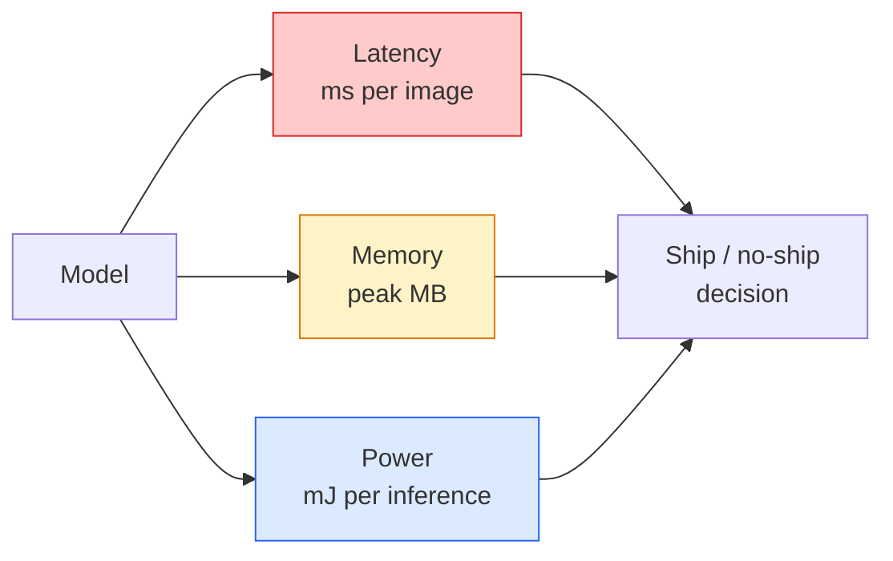

# Tầm nhìn thời gian thực — Triển khai biên

> Edge inference là kỷ luật làm cho 90-accuracy model chạy ở tốc độ 30 khung hình / giây trên thiết bị có 2 GB RAM. Mỗi điểm phần trăm của accuracy được giao dịch với độ trễ mili giây.

**Loại:** Tìm hiểu + Xây dựng
**Ngôn ngữ:** Python
**Kiến thức tiên quyết:** Giai đoạn 4 Bài 04 (Phân loại hình ảnh), Giai đoạn 10 Bài 11 (Quantization)
**Thời lượng:** ~75 phút

## Mục tiêu học tập

- Đo inference độ trễ, bộ nhớ cao nhất và thông lượng cho bất kỳ PyTorch model nào và đọc sự đánh đổi FLOPs / tham số / độ trễ
- Định lượng model thị lực thành INT8 bằng cách sử dụng định lượng sau training của PyTorch và xác minh accuracy loss < 1%
- Xuất sang ONNX và biên dịch bằng ONNX Runtime hoặc TensorRT; Kể tên ba lỗi xuất phổ biến nhất và cách khắc phục
- Giải thích khi nào nên chọn MobileNetV3, EfficientNet-Lite, ConvNeXt-Tiny hoặc MobileViT cho một ràng buộc biên

## Vấn đề

Một model tầm nhìn training thời gian là một con quái vật dấu phẩy động. 100 triệu parameters, 10 GFLOP mỗi forward pass, 2 GB VRAM. Không có thứ nào trong số đó phù hợp với điện thoại, thiết bị thông tin giải trí của ô tô, máy ảnh công nghiệp hoặc máy bay không người lái. Shipping hệ thống thị giác có nghĩa là đưa các dự đoán tương tự vào ngân sách nhỏ hơn 100 lần.

Ba núm thực hiện hầu hết công việc: lựa chọn model (kiến trúc nhỏ hơn với cùng một công thức), lượng tử hóa (INT8 thay vì FP32) và inference runtime (ONNX Runtime, TensorRT, Core ML, TFLite). Làm đúng chúng là sự khác biệt giữa bản demo chạy trên máy trạm và sản phẩm ships trên mô-đun máy ảnh 30 đô la.

Bài học này thiết lập kỷ luật đo lường trước (bạn không thể tối ưu hóa những gì bạn không thể đo lường), sau đó thực hiện ba núm. Mục tiêu không phải là tìm hiểu mọi khía cạnh runtime mà là để biết những đòn bẩy nào tồn tại và làm thế nào để xác minh mỗi đòn bẩy làm những gì bạn nghĩ.

## Khái niệm

### Ba ngân sách



- **Độ trễ**: tr50, tr95, tr99. Chỉ tính trung bình p50 che giấu hành vi đuôi quan trọng đối với các hệ thống thời gian thực.
- **Bộ nhớ đỉnh**: mức tối đa mà thiết bị từng thấy, không phải mức trung bình ở trạng thái ổn định. Vấn đề vì OOM gây tử vong trên các mục tiêu nhúng.
- **Công suất / năng lượng**: milijoules trên inference trên thiết bị chạy bằng pin. Thường được ủy quyền bởi CPU/GPU sử dụng * thời gian.

Bảng (model, độ trễ, bộ nhớ, accuracy) là những gì đưa ra quyết định biên. Mỗi ô được đo trên thiết bị mục tiêu, không phải máy trạm.

### Kỷ luật đo lường

Ba quy tắc mà mọi cấu hình cạnh nên tuân theo:

1. **Khởi động** model với 5-10 đường chuyền giả về phía trước trước khi đo. Bộ nhớ đệm lạnh và biên dịch JIT tạo ra các số đầu tiên không đại diện.
2. **Đồng bộ hóa** GPU khối lượng công việc với `torch.cuda.synchronize()` trước và sau khối hẹn giờ. Nếu không có điều này, bạn đo lường việc gửi hạt nhân, không phải thực thi hạt nhân.
3. **Cố định kích thước đầu vào** thành độ phân giải production. Độ trễ trên 224x224 không phải là độ trễ trên 512x512.

### FLOPs như một proxy

FLOPs (phép toán dấu phẩy động trên inference) là một proxy giá rẻ, không phụ thuộc vào thiết bị về độ trễ. Hữu ích cho việc so sánh kiến trúc, gây hiểu lầm như đồng hồ treo tường tuyệt đối. Một model có nhiều FLOPs hơn 10% có thể nhanh hơn gấp 2 lần trong thực tế vì nó sử dụng các hoạt động thân thiện với phần cứng (các convs theo chiều sâu biên dịch tốt, các convs lớn 7x7 thì không).

Quy tắc: sử dụng FLOPs để tìm kiếm kiến trúc, sử dụng độ trễ trên thiết bị cho các quyết định triển khai.

### Định lượng trong một đoạn văn

Thay thế trọng lượng và kích hoạt FP32 bằng INT8. Kích thước Model giảm 4 lần, băng thông bộ nhớ giảm 4 lần, tính toán giảm 2-4 lần trên phần cứng có nhân INT8 (mọi SoC di động hiện đại, mọi NVIDIA GPU có Tensor Core). Accuracy loss đối với các nhiệm vụ thị giác thường là 0,1-1 điểm phần trăm với lượng tử tĩnh sau training.

Các loại:

- **Động** — lượng tử hóa trọng số thành INT8, kích hoạt được tính bằng FP. Tăng tốc dễ dàng, nhỏ.
- **Tĩnh (sau training)** — lượng tử hóa quả cân + hiệu chỉnh phạm vi kích hoạt trên một bộ hiệu chuẩn nhỏ. Nhanh hơn nhiều so với động.
- **training nhận biết định lượng (QAT) **- mô phỏng lượng tử hóa trong quá trình training để model học xung quanh nó. Tốt nhất accuracy, cần dữ liệu được dán nhãn.

Đối với thị lực, định lượng tĩnh sau training mang lại 95% lợi ích với 5% nỗ lực. Chỉ sử dụng QAT khi accuracy loss từ PTQ là không thể chấp nhận được.

### Cắt tỉa và distillation

- **Cắt tỉa** — loại bỏ các trọng lượng không quan trọng (dựa trên độ lớn) hoặc các kênh (có cấu trúc). Hoạt động tốt trên models quá tham số; ít hữu ích hơn trên các kiến trúc vốn đã nhỏ gọn.
- **Distillation **- Huấn luyện một học sinh nhỏ bắt chước logits của một giáo viên lớn. Thường phục hồi hầu hết các accuracy bị mất bằng cách thu nhỏ model. Tiêu chuẩn cho models cạnh production.

### Các inference runtimes

- **PyTorch háo hức** - chậm, không phải để triển khai. Chỉ sử dụng để phát triển.
- **TorchScript** — di sản. Được thay thế bởi xuất khẩu `torch.compile` và ONNX.
- **ONNX Runtime** — runtime trung lập. CPU, CUDA, CoreML, TensorRT, OpenVINO đều có nhà cung cấp ONNX. Bắt đầu tại đây.
- **TensorRT** — trình biên dịch của NVIDIA. Độ trễ tốt nhất trên NVIDIA GPUs (máy trạm và Jetson). Tích hợp với ONNX Runtime hoặc độc lập.
- **Core ML** - runtime của Apple dành cho nhu cầu iOS/macOS. `.mlmodel` hoặc `.mlpackage`.
- **TFLite** - runtime của Google cho nhu cầu Android/ARM. `.tflite`.
- **OpenVINO** — runtime của Intel dành cho nhu cầu CPU/VPU. `.xml` + `.bin`.

Trong thực tế: xuất PyTorch -> ONNX -> chọn runtime cho mục tiêu. ONNX là ngôn ngữ chung.

### Bộ chọn kiến trúc biên

| Ngân sách | Model | Tại sao |
|--------|-------|-----|
| < tham số 3M | MobileNetV3-Nhỏ | Biên dịch ở khắp mọi nơi, đường cơ sở tốt |
| 3-10 triệu | Hiệu quảNet-Lite-B0 | accuracy tốt nhất trên mỗi tham số trên TFLite |
| 10-20 triệu | ConvNeXt-Tiny | accuracy trên mỗi thông số tốt nhất, thân thiện với CPU |
| 20-30 triệu | MobileViT-S hoặc EfficientViT | Transformer với ImageNet accuracy |
| 30-80 triệu | Swin-V2-Tí hon | Nếu stack hỗ trợ attention cửa sổ |

Định lượng tất cả những điều này thành INT8 trừ khi bạn có lý do cụ thể không làm như vậy.

```figure
cnn-param-count
```

## Tự xây dựng

### Bước 1: Đo độ trễ chính xác

```python
import time
import torch

def measure_latency(model, input_shape, device="cpu", warmup=10, iters=50):
    model = model.to(device).eval()
    x = torch.randn(input_shape, device=device)
    with torch.no_grad():
        for _ in range(warmup):
            model(x)
        if device == "cuda":
            torch.cuda.synchronize()
        times = []
        for _ in range(iters):
            if device == "cuda":
                torch.cuda.synchronize()
            t0 = time.perf_counter()
            model(x)
            if device == "cuda":
                torch.cuda.synchronize()
            times.append((time.perf_counter() - t0) * 1000)
    times.sort()
    return {
        "p50_ms": times[len(times) // 2],
        "p95_ms": times[int(len(times) * 0.95)],
        "p99_ms": times[int(len(times) * 0.99)],
        "mean_ms": sum(times) / len(times),
    }
```

Khởi động, đồng bộ, sử dụng `time.perf_counter()`. Báo cáo phần trăm, không chỉ trung bình.

### Bước 2: Số lượng Parameter và FLOP

```python
def parameter_count(model):
    return sum(p.numel() for p in model.parameters())

def flops_estimate(model, input_shape):
    """
    Rough FLOP count for a conv/linear-only model. For production use `fvcore` or `ptflops`.
    """
    total = 0
    def conv_hook(m, inp, out):
        nonlocal total
        c_out, c_in, kh, kw = m.weight.shape
        h, w = out.shape[-2:]
        total += 2 * c_in * c_out * kh * kw * h * w
    def linear_hook(m, inp, out):
        nonlocal total
        total += 2 * m.in_features * m.out_features
    hooks = []
    for m in model.modules():
        if isinstance(m, torch.nn.Conv2d):
            hooks.append(m.register_forward_hook(conv_hook))
        elif isinstance(m, torch.nn.Linear):
            hooks.append(m.register_forward_hook(linear_hook))
    model.eval()
    with torch.no_grad():
        model(torch.randn(input_shape))
    for h in hooks:
        h.remove()
    return total
```

Đối với các dự án thực tế sử dụng `fvcore.nn.FlopCountAnalysis` hoặc `ptflops`; Chúng xử lý mọi loại mô-đun một cách chính xác.

### Bước 3: Lượng tử tĩnh sau training

```python
def quantise_ptq(model, calibration_loader, backend="x86"):
    import torch.ao.quantization as tq
    model = model.eval().cpu()
    model.qconfig = tq.get_default_qconfig(backend)
    tq.prepare(model, inplace=True)
    with torch.no_grad():
        for x, _ in calibration_loader:
            model(x)
    tq.convert(model, inplace=True)
    return model
```

Ba bước: cấu hình, chuẩn bị (chèn người quan sát), hiệu chỉnh với dữ liệu thực, chuyển đổi (cầu chì + lượng tử). Yêu cầu model phải được hợp nhất (`Conv -> BN -> ReLU` -> `ConvBnReLU`), `torch.ao.quantization.fuse_modules` xử lý.

### Bước 4: Xuất sang ONNX

```python
def export_onnx(model, sample_input, path="model.onnx"):
    model = model.eval()
    torch.onnx.export(
        model,
        sample_input,
        path,
        input_names=["input"],
        output_names=["output"],
        dynamic_axes={"input": {0: "batch"}, "output": {0: "batch"}},
        opset_version=17,
    )
    return path
```

`opset_version=17` là mặc định an toàn vào năm 2026. `dynamic_axes` cho phép bạn chạy ONNX model với kích thước batch tùy ý.

### Bước 5: Benchmark và so sánh chế độ

```python
import torch.nn as nn
from torchvision.models import mobilenet_v3_small

def compare_regimes():
    model = mobilenet_v3_small(weights=None, num_classes=10)
    params = parameter_count(model)
    flops = flops_estimate(model, (1, 3, 224, 224))
    lat_fp32 = measure_latency(model, (1, 3, 224, 224), device="cpu")
    print(f"FP32 MobileNetV3-Small: {params:,} params  {flops/1e9:.2f} GFLOPs  "
          f"p50={lat_fp32['p50_ms']:.2f}ms  p95={lat_fp32['p95_ms']:.2f}ms")
```

Chạy cùng một hàm cho `resnet50`, `efficientnet_v2_s` và `convnext_tiny` và bạn có bảng so sánh cần thiết cho quyết định triển khai.

## Ứng dụng

Production stacks hội tụ trên một trong ba đường dẫn:

- **Web / serverless**: PyTorch -> ONNX -> ONNX Runtime (nhà cung cấp CPU hoặc CUDA). Dễ nhất, đủ tốt cho hầu hết mọi người.
- **NVIDIA cạnh (Jetson, GPU server)**: PyTorch -> ONNX -> TensorRT. Độ trễ tốt nhất, nỗ lực kỹ thuật lớn nhất.
- **Di động**: PyTorch -> ONNX -> Core ML (iOS) hoặc TFLite (Android). Định lượng trước khi xuất khẩu.

Đối với phép đo, `torch-tb-profiler`, `nvprof` / `nsys` và Dụng cụ trên macOS đưa ra phân tích từng lớp. `benchmark_app` (OpenVINO) và `trtexec` (TensorRT) đưa ra các số CLI độc lập.

## Sản phẩm bàn giao

Bài học này tạo ra:

- `outputs/prompt-edge-deployment-planner.md` — một prompt chọn xương sống, chiến lược định lượng và runtime SLA độ trễ và thiết bị mục tiêu nhất định.
- `outputs/skill-latency-profiler.md` — một skill viết một script đo điểm chuẩn độ trễ hoàn chỉnh với khởi động, đồng bộ hóa, phân vị và theo dõi bộ nhớ.

## Bài tập

1. **(Dễ dàng)** Đo độ trễ p50 cho `resnet18`, `mobilenet_v3_small`, `efficientnet_v2_s` và `convnext_tiny` ở 224x224 trên CPU. Báo cáo bảng và xác định kiến trúc nào có accuracy mỗi mili giây tốt nhất.
2. **(Trung bình)** Áp dụng lượng tử tĩnh sau training cho `mobilenet_v3_small`. Báo cáo độ trễ FP32 so với INT8 và accuracy loss trên một tập hợp con được giữ lại của CIFAR-10 hoặc tương tự.
3. **(Khó)** Xuất `convnext_tiny` sang ONNX, chạy qua `onnxruntime` với `CPUExecutionProvider` và so sánh độ trễ với đường cơ sở háo hức PyTorch. Xác định lớp đầu tiên mà ONNX Runtime nhanh hơn và giải thích lý do.

## Thuật ngữ chính

| Thuật ngữ | Những gì mọi người nói | Ý nghĩa thực sự của nó |
|------|----------------|----------------------|
| Độ trễ | "Nhanh như thế nào" | Thời gian từ đầu vào đến đầu ra; p50/p95/p99 phần trăm, không có nghĩa là |
| FLOPs | "Kích thước Model" | Hoạt động dấu phẩy động trên forward pass; Sơ proxy cho chi phí điện toán |
| Lượng tử INT8 | "8 bit" | Thay thế FP32 weights/activations bằng số nguyên 8 bit; ~ Nhỏ hơn 4 lần, nhanh hơn 2-4 lần |
| PTQ | "Định lượng sau training" | Định lượng một model được huấn luyện mà không cần huấn luyện lại; Dễ dàng, thường là đủ |
| QAT | "training nhận thức về định lượng" | Mô phỏng lượng tử hóa trong quá trình training; accuracy tốt nhất, yêu cầu dữ liệu được gắn nhãn |
| ONNX | "Định dạng trung lập" | Model định dạng trao đổi được hỗ trợ bởi mọi inference runtime chính thống |
| TensorRT | "Trình biên dịch NVIDIA" | Biên dịch ONNX thành một công cụ được tối ưu hóa cho NVIDIA GPUs |
| Distillation | "Giáo viên -> học sinh" | Huấn luyện một model nhỏ bắt chước logits của một model lớn; Phục hồi hầu hết các accuracy bị mất |

## Đọc thêm

- [EfficientNet (Tan & Le, 2019)](https://arxiv.org/abs/1905.11946) — mở rộng quy mô hỗn hợp cho kiến trúc hiệu quả
- [MobileNetV3 (Howard et al., 2019)](https://arxiv.org/abs/1905.02244) — kiến trúc ưu tiên thiết bị di động với H-Swish và Squeeze-Excite
- [A Practical Guide to TensorRT Optimization (NVIDIA)](https://developer.nvidia.com/blog/accelerating-model-inference-with-tensorrt-tips-and-best-practices-for-pytorch-users/) - làm thế nào để thực sự có được các con số thông lượng trong bài báo
- [ONNX Runtime docs](https://onnxruntime.ai/docs/) - định lượng hóa, tối ưu hóa đồ thị, lựa chọn nhà cung cấp
