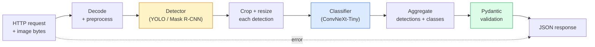

# Xây dựng một Pipeline tầm nhìn hoàn chỉnh - Capstone

> Hệ thống thị giác production là một chuỗi các models và quy tắc được khâu với các hợp đồng dữ liệu. Các mảnh đã ở giai đoạn này; capstone nối chúng lại với nhau từ đầu đến cuối.

**Loại:** Xây dựng
**Ngôn ngữ:** Python
**Kiến thức tiên quyết:** Giai đoạn 4 Bài học 01-15
**Thời lượng:** ~120 phút

## Mục tiêu học tập

- Thiết kế một pipeline tầm nhìn production phát hiện các đối tượng, phân loại chúng và phát ra JSON có cấu trúc - với mọi đường dẫn lỗi được xử lý
- Cắm một máy dò (Mặt nạ R-CNN hoặc YOLO), một bộ phân loại (ConvNeXt-Tiny) và một hợp đồng dữ liệu (Pydantic) vào một dịch vụ
- Benchmark pipeline đầu cuối và xác định nút cổ chai đầu tiên (thường là tiền xử lý, sau đó là máy dò)
- Ship một dịch vụ FastAPI tối thiểu chấp nhận tải lên hình ảnh, chạy pipeline và trả về các phát hiện có phân loại

## Vấn đề

Tầm nhìn cá nhân models rất hữu ích; Các sản phẩm thị giác là chuỗi của chúng. Kiểm toán kệ bán lẻ là một máy dò cộng với một bộ phân loại sản phẩm cộng với OCR pipeline giá. Lái xe tự động là một máy dò 2D cộng với một máy dò 3D cộng với một bộ phân đoạn cộng với một trình theo dõi cộng với một công cụ lập kế hoạch. Sàng lọc trước y tế là một phân đoạn cộng với một bộ phân loại vùng cộng với giao diện người dùng của bác sĩ lâm sàng.

Đấu dây các dây xích đó là bộ phận tách nguyên mẫu ML khỏi sản phẩm. Mỗi giao diện giữa models là một nơi mới cho lỗi. Mọi chuyển đổi tọa độ, mọi chuẩn hóa, mọi thay đổi kích thước mặt nạ đều là một ứng cử viên thất bại thầm lặng. Một pipeline mạnh như giao diện yếu nhất của nó.

Capstone này thiết lập pipeline khả thi tối thiểu: phát hiện + phân loại + đầu ra có cấu trúc + lớp phân phối. Mọi thứ khác trong Giai đoạn 4 vào khung xương này: hoán đổi Mặt nạ R-CNN cho YOLOv8, thêm đầu OCR, thêm branch phân đoạn, thêm trình theo dõi. Kiến trúc ổn định; các mảnh có thể cắm được.

## Khái niệm

### Các pipeline



Bảy giai đoạn. Hai giai đoạn model rất tốn kém; Năm giai đoạn khác là nơi bọ sinh sống.

### Hợp đồng dữ liệu với Pydantic

Mỗi ranh giới model trở thành một đối tượng được nhập. Điều này biến những thất bại thầm lặng thành những thất bại ồn ào.

```
Detection(
    box: tuple[float, float, float, float],   # (x1, y1, x2, y2), absolute pixels
    score: float,                              # [0, 1]
    class_id: int,                             # from detector's label map
    mask: Optional[list[list[int]]],           # RLE-encoded if present
)

PipelineResult(
    image_id: str,
    detections: list[Detection],
    classifications: list[Classification],
    inference_ms: float,
)
```

Khi một máy dò trả về các hộp trong `(cx, cy, w, h)` thay vì `(x1, y1, x2, y2)`, xác thực của Pydantic không thành công ở ranh giới và bạn phát hiện ra ngay lập tức thay vì gỡ lỗi một crop xuôi dòng âm thầm trả về các vùng trống.

### Độ trễ đi đến đâu

Ba lẽ thật có trong hầu hết mọi khải tượng pipeline:

1. **Tiền xử lý thường là khối đơn lẻ lớn nhất.** Giải mã JPEG, chuyển đổi không gian màu, thay đổi kích thước — những thứ này bị ràng buộc CPU và dễ quên.
2. **Máy dò chiếm ưu thế GPU thời gian.** 70-90% thời gian GPU nằm trong forward pass phát hiện.
3. **Xử lý hậu kỳ (NMS, RLE encode/decode) rẻ trên GPU, đắt trên CPU.** Luôn lập hồ sơ với mục tiêu thực tế.

Biết được phân phối là điều biến tối ưu hóa thành danh sách ưu tiên.

### Chế độ thất bại

- **Phát hiện trống** — trả về danh sách trống, không gặp sự cố. Nhật ký.
- **Hộp ngoài giới hạn** — kẹp vào kích thước hình ảnh trước khi cắt.
- **Cây trồng nhỏ** — bỏ qua phân loại cho các hộp nhỏ hơn đầu vào tối thiểu của bộ phân loại.
- **Tải lên bị hỏng** — 400 phản hồi với một mã lỗi cụ thể, không phải 500.
- **Model lỗi tải** — không thành công khi khởi động dịch vụ, không phải khi yêu cầu đầu tiên.

Một production pipeline xử lý từng điều này mà không cần viết `try/except` chung để che giấu lỗi. Mỗi thất bại đều nhận được một mã được đặt tên và một phản hồi.

### Lô

Một dịch vụ production phục vụ nhiều khách hàng. Phát hiện và phân loại hàng loạt trên các yêu cầu sẽ nhân lên thông lượng. Sự đánh đổi: độ trễ bổ sung do chờ đợi batch lấp đầy. Thiết lập điển hình: thu thập yêu cầu lên đến 20ms, batch cùng nhau process, phân phối phản hồi. `torchserve` và `triton` làm điều này một cách tự nhiên; các dịch vụ nhỏ với tải trọng có thể dự đoán cuộn vi mô của riêng họ.

## Tự xây dựng

### Bước 1: Hợp đồng dữ liệu

```python
from pydantic import BaseModel, Field
from typing import List, Optional, Tuple

class Detection(BaseModel):
    box: Tuple[float, float, float, float]
    score: float = Field(ge=0, le=1)
    class_id: int = Field(ge=0)
    mask_rle: Optional[str] = None


class Classification(BaseModel):
    detection_index: int
    class_id: int
    class_name: str
    score: float = Field(ge=0, le=1)


class PipelineResult(BaseModel):
    image_id: str
    detections: List[Detection]
    classifications: List[Classification]
    inference_ms: float
```

Năm giây mã giúp tiết kiệm một giờ gỡ lỗi trên bất kỳ pipeline nghiêm trọng nào.

### Bước 2: Một Pipeline class tối thiểu

```python
import time
import numpy as np
import torch
from PIL import Image

class VisionPipeline:
    def __init__(self, detector, classifier, class_names,
                 device="cpu", min_crop=32):
        self.detector = detector.to(device).eval()
        self.classifier = classifier.to(device).eval()
        self.class_names = class_names
        self.device = device
        self.min_crop = min_crop

    def preprocess(self, image):
        """
        image: PIL.Image or np.ndarray (H, W, 3) uint8
        returns: CHW float tensor on device
        """
        if isinstance(image, Image.Image):
            image = np.asarray(image.convert("RGB"))
        tensor = torch.from_numpy(image).permute(2, 0, 1).float() / 255.0
        return tensor.to(self.device)

    @torch.no_grad()
    def detect(self, image_tensor):
        return self.detector([image_tensor])[0]

    @torch.no_grad()
    def classify(self, crops):
        if len(crops) == 0:
            return []
        batch = torch.stack(crops).to(self.device)
        logits = self.classifier(batch)
        probs = logits.softmax(-1)
        scores, cls = probs.max(-1)
        return list(zip(cls.tolist(), scores.tolist()))

    def run(self, image, image_id="anonymous"):
        t0 = time.perf_counter()
        tensor = self.preprocess(image)
        det = self.detect(tensor)

        crops = []
        detections = []
        valid_indices = []
        for i, (box, score, cls) in enumerate(zip(det["boxes"], det["scores"], det["labels"])):
            x1, y1, x2, y2 = [max(0, int(b)) for b in box.tolist()]
            x2 = min(x2, tensor.shape[-1])
            y2 = min(y2, tensor.shape[-2])
            detections.append(Detection(
                box=(x1, y1, x2, y2),
                score=float(score),
                class_id=int(cls),
            ))
            if (x2 - x1) < self.min_crop or (y2 - y1) < self.min_crop:
                continue
            crop = tensor[:, y1:y2, x1:x2]
            crop = torch.nn.functional.interpolate(
                crop.unsqueeze(0),
                size=(224, 224),
                mode="bilinear",
                align_corners=False,
            )[0]
            crops.append(crop)
            valid_indices.append(i)

        class_preds = self.classify(crops)

        classifications = []
        for valid_idx, (cls_id, cls_score) in zip(valid_indices, class_preds):
            classifications.append(Classification(
                detection_index=valid_idx,
                class_id=int(cls_id),
                class_name=self.class_names[cls_id],
                score=float(cls_score),
            ))

        return PipelineResult(
            image_id=image_id,
            detections=detections,
            classifications=classifications,
            inference_ms=(time.perf_counter() - t0) * 1000,
        )
```

Mọi giao diện đều được nhập. Mỗi lộ trình hỏng hóc đều có một quyết định xử lý cụ thể.

### Bước 3: Nối dây máy dò và bộ phân loại

```python
from torchvision.models.detection import maskrcnn_resnet50_fpn_v2
from torchvision.models import convnext_tiny

# Use ImageNet-pretrained weights for a realistic pipeline without training
detector = maskrcnn_resnet50_fpn_v2(weights="DEFAULT")
classifier = convnext_tiny(weights="DEFAULT")
class_names = [f"imagenet_class_{i}" for i in range(1000)]

pipe = VisionPipeline(detector, classifier, class_names)

# Smoke test with a synthetic image
test_image = (np.random.rand(400, 600, 3) * 255).astype(np.uint8)
result = pipe.run(test_image, image_id="demo")
print(result.model_dump_json(indent=2)[:500])
```

### Bước 4: Dịch vụ FastAPI

```python
from fastapi import FastAPI, UploadFile, HTTPException
from io import BytesIO

app = FastAPI()
pipe = None  # initialised on startup

@app.on_event("startup")
def load():
    global pipe
    detector = maskrcnn_resnet50_fpn_v2(weights="DEFAULT").eval()
    classifier = convnext_tiny(weights="DEFAULT").eval()
    pipe = VisionPipeline(detector, classifier, class_names=[f"c{i}" for i in range(1000)])

@app.post("/detect")
async def detect_endpoint(file: UploadFile):
    if file.content_type not in {"image/jpeg", "image/png", "image/webp"}:
        raise HTTPException(status_code=400, detail="unsupported image type")
    data = await file.read()
    try:
        img = Image.open(BytesIO(data)).convert("RGB")
    except Exception:
        raise HTTPException(status_code=400, detail="cannot decode image")
    result = pipe.run(img, image_id=file.filename or "upload")
    return result.model_dump()
```

Chạy với `uvicorn main:app --host 0.0.0.0 --port 8000`. Kiểm tra với `curl -F 'file=@dog.jpg' http://localhost:8000/detect`.

### Bước 5: Benchmark pipeline

```python
import time

def benchmark(pipe, num_runs=20, image_size=(400, 600)):
    img = (np.random.rand(*image_size, 3) * 255).astype(np.uint8)
    pipe.run(img)  # warm up

    stages = {"preprocess": [], "detect": [], "classify": [], "total": []}
    for _ in range(num_runs):
        t0 = time.perf_counter()
        tensor = pipe.preprocess(img)
        t1 = time.perf_counter()
        det = pipe.detect(tensor)
        t2 = time.perf_counter()
        crops = []
        for box in det["boxes"]:
            x1, y1, x2, y2 = [max(0, int(b)) for b in box.tolist()]
            x2 = min(x2, tensor.shape[-1])
            y2 = min(y2, tensor.shape[-2])
            if (x2 - x1) >= pipe.min_crop and (y2 - y1) >= pipe.min_crop:
                crop = tensor[:, y1:y2, x1:x2]
                crop = torch.nn.functional.interpolate(
                    crop.unsqueeze(0), size=(224, 224), mode="bilinear", align_corners=False
                )[0]
                crops.append(crop)
        pipe.classify(crops)
        t3 = time.perf_counter()
        stages["preprocess"].append((t1 - t0) * 1000)
        stages["detect"].append((t2 - t1) * 1000)
        stages["classify"].append((t3 - t2) * 1000)
        stages["total"].append((t3 - t0) * 1000)

    for stage, times in stages.items():
        times.sort()
        print(f"{stage:12s}  p50={times[len(times)//2]:7.1f} ms  p95={times[int(len(times)*0.95)]:7.1f} ms")
```

Đầu ra điển hình trên CPU: tiền xử lý ~3 ms, phát hiện 300-500 ms, phân loại 20-40 ms, tổng cộng 350-550 ms. Trên GPU, phát hiện là 20-40 ms và quá trình tiền xử lý + phân loại bắt đầu quan trọng hơn về mặt tương đối.

## Ứng dụng

Production mẫu hội tụ vào cùng một cấu trúc, cộng với:

- **Model phiên bản** — luôn ghi lại tên model và hàm băm trọng số trong phản hồi.
- **Mỗi yêu cầu trace ID** — ghi lại mọi thời gian giai đoạn cho mọi yêu cầu để bạn có thể tương quan phản hồi chậm với các giai đoạn.
- **Đường dẫn dự phòng** — nếu bộ phân loại hết thời gian chờ, hãy trả về các phát hiện mà không có phân loại thay vì thất bại toàn bộ yêu cầu.
- **Bộ lọc an toàn** — Bộ lọc NSFW / PII chạy sau khi phân loại, trước khi phản hồi rời khỏi dịch vụ.
- **Batch endpoint** — `/detect_batch` chấp nhận danh sách URL hình ảnh để xử lý hàng loạt.

Đối với production phân phối, `torchserve`, `Triton Inference Server` và `BentoML` xử lý hàng loạt, lập phiên bản, chỉ số và kiểm tra tình trạng ngay lập tức. Chạy `FastAPI` trực tiếp là tốt cho các nguyên mẫu và sản phẩm quy mô nhỏ.

## Sản phẩm bàn giao

Bài học này tạo ra:

- `outputs/prompt-vision-service-shape-reviewer.md` — một prompt xem xét mã của dịch vụ thị giác để tìm các vi phạm định hình contract/response và nêu tên lỗi đột phá đầu tiên.
- `outputs/skill-pipeline-budget-planner.md` — một skill, với độ trễ và thông lượng mục tiêu, chỉ định ngân sách thời gian cho mọi giai đoạn pipeline và gắn cờ giai đoạn nào sẽ bỏ lỡ ngân sách trước.

## Bài tập

1. **(Dễ dàng) **Chạy pipeline trên 10 hình ảnh từ bất kỳ dataset nào đang mở. Báo cáo thời gian trung bình trên mỗi giai đoạn và phân phối số lần phát hiện trên mỗi hình ảnh.
2. **(Trung bình)** Thêm trường đầu ra mặt nạ vào `Detection` và mã hóa nó dưới dạng RLE. Xác minh JSON vẫn dưới 1MB ngay cả đối với hình ảnh 10 đối tượng.
3. **(Cứng)** Thêm một micro-batcher trước bộ phân loại: thu thập cây trồng trong tối đa 10 ms, phân loại tất cả chúng trong một cuộc gọi GPU, trả về kết quả cho mỗi yêu cầu. Đo mức tăng thông lượng ở 5 yêu cầu đồng thời mỗi giây và độ trễ được thêm vào.

## Thuật ngữ chính

| Thuật ngữ | Những gì mọi người nói | Ý nghĩa thực sự của nó |
|------|----------------|----------------------|
| Pipeline | "Hệ thống" | Một chuỗi các bước tiền xử lý, inference và hậu xử lý theo thứ tự với giao diện được gõ giữa mỗi cặp |
| Hợp đồng dữ liệu | "Người schema" | Định nghĩa Pydantic / dataclass mà mọi stage đầu vào và đầu ra tuân thủ; Bắt lỗi tích hợp tại ranh giới |
| Tiền xử lý | "Trước model" | Giải mã, chuyển đổi màu, thay đổi kích thước, chuẩn hóa; thường là bồn rửa thời gian CPU lớn nhất |
| Xử lý hậu kỳ | "Sau model" | NMS, thay đổi kích thước mặt nạ, ngưỡng, mã hóa RLE; rẻ trên GPU, đắt trên CPU |
| Máy trộn vi mô | "Thu thập rồi chuyển tiếp" | Trình tổng hợp chờ một cửa sổ cố định cho nhiều yêu cầu, chạy một forward pass hàng loạt duy nhất |
| Trace ID | "Mã yêu cầu" | Mã định danh cho mỗi yêu cầu được ghi lại ở mọi giai đoạn để các yêu cầu chậm có thể được theo dõi từ đầu đến cuối |
| Mã thất bại | "Lỗi được đặt tên" | Mã lỗi cụ thể cho mỗi lỗi class thay vì 500 chung; cho phép logic thử lại máy khách |
| Kiểm tra sức khỏe | "Đầu dò sẵn sàng" | endpoint giá rẻ báo cáo liệu dịch vụ có thể trả lời hay không; Cân bằng tải dựa vào điều này |

## Đọc thêm

- [Full Stack Deep Learning — Deploying Models](https://fullstackdeeplearning.com/course/2022/lecture-5-deployment/) — tổng quan chính tắc về việc triển khai production ML
- [BentoML docs](https://docs.bentoml.com) — phân phát framework với phân phối, lập phiên bản và số liệu
- [torchserve docs](https://pytorch.org/serve/) — Thư viện phục vụ chính thức của PyTorch
- [NVIDIA Triton Inference Server](https://developer.nvidia.com/triton-inference-server) — phân phối thông lượng cao với hỗ trợ hàng loạt và đa model
