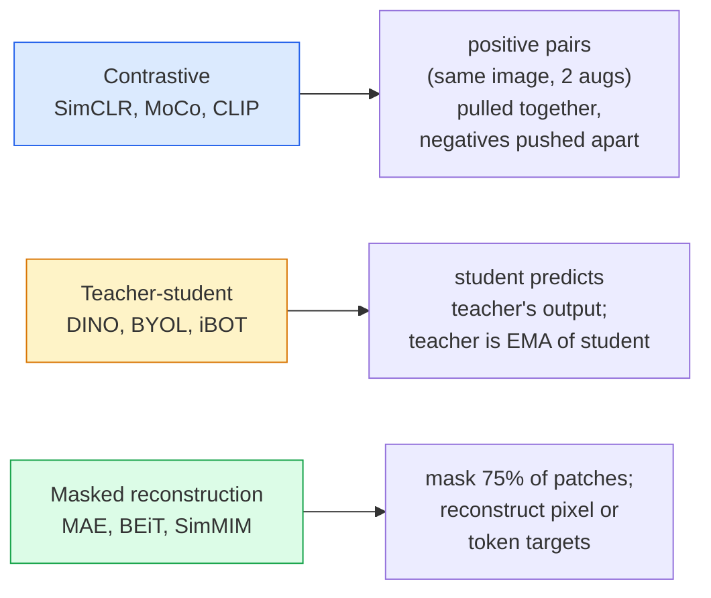

# Tầm nhìn tự giám sát - SimCLR, DINO, MAE

> Nhãn là nút thắt cổ chai của tầm nhìn có giám sát. pretraining tự giám sát loại bỏ chúng: tìm hiểu features trực quan từ 100 triệu hình ảnh không được gắn nhãn, fine-tune trên 10 nghìn hình ảnh được gắn nhãn.

**Loại:** Tìm hiểu + Xây dựng
**Ngôn ngữ:** Python
**Kiến thức tiên quyết:** Giai đoạn 4 Bài 04 (Phân loại hình ảnh), Giai đoạn 4 Bài 14 (ViT)
**Thời lượng:** ~75 phút

## Mục tiêu học tập

- Trace ba gia đình tự giám sát chính - tương phản (SimCLR), giáo viên-học sinh (DINO), tái tạo mặt nạ (MAE) - và nêu rõ những gì mỗi gia đình tối ưu hóa
- Triển khai loss InfoNCE từ đầu và giải thích lý do tại sao batch 512 hoạt động nhưng batch 32 không thành công
- Giải thích lý do tại sao tỷ lệ mặt nạ 75% của MAE không tùy tiện và nó khác với tỷ lệ 15% của BERT đối với văn bản như thế nào
- Sử dụng DINOv2 hoặc MAE ImageNet checkpoints để thăm dò tuyến tính và truy xuất zero-shot

## Vấn đề

ImageNet được giám sát có 1,3 triệu hình ảnh được gắn nhãn, chi phí ước tính 10 triệu đô la để chú thích. Các datasets y tế và công nghiệp nhỏ hơn và thậm chí còn đắt hơn để dán nhãn. Mọi nhóm tầm nhìn đều đặt câu hỏi: chúng ta có thể pretrain dữ liệu rẻ tiền không được gắn nhãn - khung hình YouTube, thu thập dữ liệu web, cảnh quay webcam, quét vệ tinh - và sau đó fine-tune trên một tập hợp nhỏ được dán nhãn không?

Học tập tự giám sát là câu trả lời. Một ViT tự giám sát hiện đại được huấn luyện trên LAION hoặc JFT đạt hoặc đánh bại ImageNet được giám sát accuracy khi fine-tuned. Nó cũng chuyển tốt hơn đến các tác vụ hạ nguồn (phát hiện, phân đoạn, độ sâu) so với pretraining được giám sát. DINOv2 (Meta, 2023) và MAE (Meta, 2022) là production mặc định hiện tại cho features thị lực có thể chuyển nhượng.

Sự thay đổi khái niệm là nhiệm vụ lấy cớ - điều mà model được huấn luyện để làm - không nhất thiết phải là nhiệm vụ xuôi dòng. Điều quan trọng là nó buộc model phải học những features hữu ích. Dự đoán màu sắc của hình ảnh thang độ xám, xoay hình ảnh và yêu cầu model phân loại xoay, che các bản vá và tái tạo chúng - tất cả đều hoạt động. Ba cách tiếp cận mở rộng quy mô là học tập tương phản, distillation giáo viên-học sinh và tái tạo mặt nạ.

## Khái niệm

### Ba gia đình



### Học tương phản (SimCLR)

Chụp một hình ảnh, áp dụng hai nâng cấp ngẫu nhiên, nhận hai chế độ xem. Nạp cả hai qua cùng một encoder cộng với một đầu chiếu. Giảm thiểu loss nói rằng "hai embeddings này nên gần nhau" và "embedding này nên cách xa embeddings của mọi hình ảnh khác trong batch".

```
Loss for positive pair (z_i, z_j) among 2N views per batch:

   L_ij = -log( exp(sim(z_i, z_j) / tau) / sum_k in batch \ {i} exp(sim(z_i, z_k) / tau) )

sim = cosine similarity
tau = temperature (0.1 standard)
```

Đây là loss InfoNCE. Nó yêu cầu nhiều âm tính cho mỗi dương tính, vì vậy kích thước batch quan trọng - SimCLR cần 512-8192. MoCo đã giới thiệu một hàng đợi động lượng của các batches trong quá khứ để tách số lượng âm khỏi kích thước batch.

### Giáo viên-học sinh (DINO)

Hai mạng lưới có cùng kiến trúc: sinh viên và giáo viên. Giáo viên là một đường trung bình động hàm mũ (EMA) của trọng số của học sinh. Cả hai đều thấy chế độ xem tăng cường của hình ảnh. Đầu ra của học sinh được huấn luyện để phù hợp với giáo viên - không có tiêu cực rõ ràng.

```
loss = CE( student_output(view_1),  teacher_output(view_2) )
     + CE( student_output(view_2),  teacher_output(view_1) )

teacher_weights = m * teacher_weights + (1 - m) * student_weights   (m ≈ 0.996)
```

Tại sao nó không sụp đổ để "dự đoán một hằng số": đầu ra của giáo viên được căn giữa (trừ giá trị trung bình trên mỗi chiều) và sắc nét (chia cho các temperature nhỏ). Định tâm ngăn không cho một chiều chiếm ưu thế; mài sắc ngăn chặn sự sụp đổ đầu ra đồng đều.

DINO là những gì DINOv2 mở rộng quy mô, trên 142 triệu hình ảnh được tuyển chọn. Kết quả features là SOTA hiện tại để truy xuất trực quan zero-shot và dự đoán dày đặc.

### Tái tạo mặt nạ (MAE)

Che 75% các bản vá của đầu vào ViT. Chỉ chuyển 25% có thể nhìn thấy qua encoder. Một decoder nhỏ nhận đầu ra của encoder cộng với tokens mặt nạ ở các vị trí được che và được huấn luyện để tái tạo các pixel của các bản vá được che giấu.

```
Encoder:  visible 25% of patches -> features
Decoder:  features + mask tokens at masked positions -> reconstructed pixels
Loss:     MSE between reconstructed and original pixels on masked patches only
```

Các lựa chọn thiết kế chính giúp MAE hoạt động:

- **Tỷ lệ mặt nạ 75% **- cao. Buộc encoder phải học features ngữ nghĩa; tái tạo 25% sẽ gần như tầm thường (các pixel lân cận tương quan đến mức CNN có thể đóng đinh nó).
- **encoder/decoder không đối xứng **- encoder ViT lớn chỉ nhìn thấy các mảng có thể nhìn thấy; Một decoder nhỏ (8 lớp, 512-mờ) xử lý tái tạo. pretraining nhanh hơn 3 lần so với BEiT ngây thơ.
- **Mục tiêu tái tạo không gian pixel** — đơn giản hơn mục tiêu mã hóa của BEiT và hoạt động tốt hơn trên ViT.

Sau khi pretraining, loại bỏ decoder. Đầu encoder là máy vắt feature.

### Tại sao lại là 75% chứ không phải 15%

BERT khẩu trang 15% tokens. Mặt nạ MAE 75%. Sự khác biệt là mật độ thông tin.

- Ngôn ngữ tự nhiên có entropy cao trên mỗi token. Dự đoán 15% tokens vẫn còn khó vì mỗi vị trí đeo mặt nạ đều có nhiều lần hoàn thành hợp lý.
- Các bản vá hình ảnh có entropy thấp - một vùng lân cận không được che mặt thường xác định các pixel của miếng dán mặt nạ gần như chính xác. Để dự đoán đòi hỏi sự hiểu biết ngữ nghĩa, bạn phải che giấu một cách tích cực.

75% là đủ cao để ngoại suy không gian đơn giản không thể giải quyết nhiệm vụ; encoder phải đại diện cho nội dung hình ảnh.

### Đánh giá đầu dò tuyến tính

Sau khi tự giám sát pretraining, đánh giá tiêu chuẩn là **đầu dò tuyến tính**: đóng băng encoder, huấn luyện một bộ phân loại tuyến tính duy nhất trên nhãn ImageNet. Báo cáo top 1 accuracy.

- SimCLR ResNet-50: ~71% (2020)
- ViT-S/16 khủng long: ~77% (2021)
- ViT-L/16 MAE: ~76% (2022)
- Công ViT-g/14 DINOv2: ~86% (2023)

Đầu dò tuyến tính là một thước đo thuần túy về chất lượng feature; fine-tuning thường thêm 2-5 điểm nhưng cũng pha trộn tác dụng của việc huấn luyện lại đầu.

## Tự xây dựng

### Bước 1: Tăng cường hai chế độ xem pipeline

```python
import torch
import torchvision.transforms as T

two_view_train = lambda: T.Compose([
    T.RandomResizedCrop(96, scale=(0.2, 1.0)),
    T.RandomHorizontalFlip(),
    T.ColorJitter(0.4, 0.4, 0.4, 0.1),
    T.RandomGrayscale(p=0.2),
    T.ToTensor(),
])


class TwoViewDataset(torch.utils.data.Dataset):
    def __init__(self, base):
        self.base = base
        self.aug = two_view_train()

    def __len__(self):
        return len(self.base)

    def __getitem__(self, i):
        img, _ = self.base[i]
        v1 = self.aug(img)
        v2 = self.aug(img)
        return v1, v2
```

Mỗi __getitem__ trả về hai chế độ xem tăng cường của cùng một hình ảnh; không cần nhãn.

### Bước 2: Thông tin NCE loss

```python
import torch.nn.functional as F

def info_nce(z1, z2, tau=0.1):
    """
    z1, z2: (N, D) L2-normalised embeddings of paired views
    """
    N, D = z1.shape
    z = torch.cat([z1, z2], dim=0)  # (2N, D)
    sim = z @ z.T / tau              # (2N, 2N)

    mask = torch.eye(2 * N, dtype=torch.bool, device=z.device)
    sim = sim.masked_fill(mask, float("-inf"))

    targets = torch.cat([torch.arange(N, 2 * N), torch.arange(0, N)]).to(z.device)
    return F.cross_entropy(sim, targets)
```

L2-chuẩn hóa embeddings trước khi gọi. `tau=0.1` là mặc định của SimCLR; Thấp hơn làm cho loss sắc nét hơn và yêu cầu nhiều âm bản hơn.

### Bước 3: Kiểm tra sự tỉnh táo InfoNCE

```python
z1 = F.normalize(torch.randn(16, 32), dim=-1)
z2 = z1.clone()
loss_same = info_nce(z1, z2, tau=0.1).item()
z2_random = F.normalize(torch.randn(16, 32), dim=-1)
loss_random = info_nce(z1, z2_random, tau=0.1).item()
print(f"InfoNCE with identical pairs:  {loss_same:.3f}")
print(f"InfoNCE with random pairs:     {loss_random:.3f}")
```

Các cặp giống hệt nhau nên cho loss thấp (gần bằng 0 đối với temperature batch lớn và lạnh). Các cặp ngẫu nhiên sẽ cho log(2N-1) = ~log(31) = ~3.4 với batch 16 cặp.

### Bước 4: Mặt nạ kiểu MAE

```python
def random_mask_indices(num_patches, mask_ratio=0.75, seed=0):
    g = torch.Generator().manual_seed(seed)
    n_keep = int(num_patches * (1 - mask_ratio))
    perm = torch.randperm(num_patches, generator=g)
    visible = perm[:n_keep]
    masked = perm[n_keep:]
    return visible.sort().values, masked.sort().values


num_patches = 196
visible, masked = random_mask_indices(num_patches, mask_ratio=0.75)
print(f"visible: {len(visible)} / {num_patches}")
print(f"masked:  {len(masked)} / {num_patches}")
```

Đơn giản, nhanh chóng và xác định cho một hạt giống nhất định. Triển khai MAE thực batch điều này và giữ mặt nạ cho mỗi mẫu.

## Ứng dụng

DINOv2 là tiêu chuẩn production nhất vào năm 2026:

```python
import torch
from transformers import AutoImageProcessor, AutoModel

processor = AutoImageProcessor.from_pretrained("facebook/dinov2-base")
model = AutoModel.from_pretrained("facebook/dinov2-base")
model.eval()

# Per-image embeddings for zero-shot retrieval
with torch.no_grad():
    inputs = processor(images=[pil_image], return_tensors="pt")
    outputs = model(**inputs)
    embedding = outputs.last_hidden_state[:, 0]  # CLS token
```

Kết quả là embedding mờ 768 là xương sống của việc truy xuất hình ảnh hiện đại, thư từ dày đặc và pipelines truyền zero-shot. Fine-tuning trên một nhiệm vụ xuôi dòng hiếm khi cần nhiều hơn một đầu tuyến tính.

Đối với embeddings văn bản hình ảnh, SigLIP hoặc OpenCLIP là tương đương; đối với fine-tuning kiểu MAE, `timm` repo ships mọi checkpoint MAE.

## Sản phẩm bàn giao

Bài học này tạo ra:

- `outputs/prompt-ssl-pretraining-picker.md` — một prompt chọn SimCLR / MAE / DINOv2 dựa dataset kích thước, tính toán và tác vụ xuôi dòng.
- `outputs/skill-linear-probe-runner.md` — một skill viết đánh giá đầu dò tuyến tính cho bất kỳ dataset encoder + được dán nhãn đông lạnh nào.

## Bài tập

1. **(Dễ dàng) **Xác minh rằng InfoNCE loss giảm khi bạn giảm temperature cho embeddings căn chỉnh tốt và tăng khi bạn giảm temperature cho embeddings ngẫu nhiên. Tạo ra một cốt truyện `tau in [0.05, 0.1, 0.2, 0.5]` vs loss.
2. **(Trung bình) **Thực hiện bộ đệm trung tâm kiểu DINO. Cho thấy rằng nếu không có sự tập trung, học sinh sẽ sụp đổ vào một vector liên tục trong vòng vài epochs.
3. **(Khó)** Huấn luyện MAE trên CIFAR-100 bằng cách sử dụng TinyUNet từ Bài 10 làm xương sống. Báo cáo accuracy thăm dò tuyến tính ở 10, 50 và 200 epochs. Cho thấy rằng một đầu dò tuyến tính MAE-pretrained đánh bại một đầu dò tuyến tính được giám sát từ đầu trên cùng một tập hợp con 1.000 hình ảnh.

## Thuật ngữ chính

| Thuật ngữ | Những gì mọi người nói | Ý nghĩa thực sự của nó |
|------|----------------|----------------------|
| Tự giám sát | "Không có nhãn" | Một nhiệm vụ giả tạo ra các biểu diễn hữu ích từ dữ liệu không được gắn nhãn |
| Nhiệm vụ lấy cớ | "Nhiệm vụ giả" | Mục tiêu được sử dụng trong SSL (tái tạo các bản vá, chế độ xem trận đấu); bị loại bỏ sau khi pretraining |
| Đầu dò tuyến tính | "encoder đông lạnh + đầu tuyến tính" | Đánh giá SSL tiêu chuẩn: chỉ huấn luyện một bộ phân loại tuyến tính trên features bị đóng băng |
| Thông tin NCE | "loss tương phản" | softmax về những điểm tương đồng cosin; Cặp dương là class mục tiêu, tất cả các cặp khác là tiêu cực |
| Giáo viên EMA | "Giáo viên trung bình di chuyển" | Giáo viên có trọng số là đường trung bình động hàm mũ của học sinh; được sử dụng bởi BYOL, MoCo, DINO |
| Tỷ lệ mặt nạ | "% các bản vá ẩn" | Phần nhỏ các bản vá được che trong MAE; 75% cho thị lực, 15% cho văn bản |
| Sự sụp đổ đại diện | "Đầu ra không đổi" | Lỗi SSL trong đó encoder xuất ra vector không đổi cho tất cả các đầu vào; bị ngăn chặn bằng cách định tâm, mài sắc hoặc tiêu cực |
| DINOv2 | "Production đường trục SSL" | ViT tự giám sát năm 2023 của Meta; features hình ảnh đa năng mạnh nhất vào năm 2026 |

## Đọc thêm

- [SimCLR (Chen et al., 2020)](https://arxiv.org/abs/2002.05709) - tham khảo học tập tương phản
- [DINO (Caron et al., 2021)](https://arxiv.org/abs/2104.14294) - giáo viên-học sinh với động lực, tập trung, mài giũa
- [MAE (He et al., 2022)](https://arxiv.org/abs/2111.06377) - pretraining bộ mã hóa tự động mặt nạ cho ViT
- [DINOv2 (Oquab et al., 2023)](https://arxiv.org/abs/2304.07193) - mở rộng quy mô ViT tự giám sát lên production features
