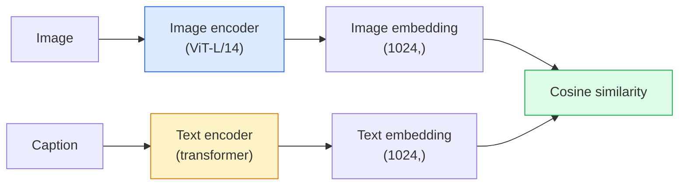

# Tầm nhìn từ vựng mở — CLIP

> Huấn luyện encoder hình ảnh và văn bản encoder với nhau để các cặp khớp (hình ảnh, chú thích) hạ cánh tại cùng một điểm trong không gian chung. Đó là toàn bộ mánh khóe.

**Loại:** Xây dựng + Sử dụng
**Ngôn ngữ:** Python
**Kiến thức tiên quyết:** Giai đoạn 4 Bài 14 (ViT), Giai đoạn 4 Bài 17 (Tự giám sát)
**Thời lượng:** ~45 phút

## Mục tiêu học tập

- Giải thích kiến trúc hai tháp của CLIP và mục tiêu training tương phản
- Sử dụng pretrained CLIP (hoặc SigLIP) để phân loại zero-shot mà không cần bất kỳ training cụ thể nào của nhiệm vụ
- Thực hiện phân loại zero-shot từ đầu: mã hóa class prompts, tính toán độ tương đồng cosin, lấy argmax
- Phân biệt CLIP, SigLIP, OpenCLIP và LLaVA/LLaMA-vision models - mỗi loại dùng để làm gì vào năm 2026

## Vấn đề

Các bộ phân loại truyền thống là từ vựng đóng: một model ImageNet 1000 class chỉ có thể dự đoán 1000 nhãn. Mỗi danh mục mới đều yêu cầu dữ liệu được gắn nhãn và một người đứng đầu được huấn luyện lại.

CLIP (Radford et al., OpenAI 2021) cho thấy rằng training trên 400 triệu cặp (hình ảnh, chú thích) được thu thập từ web tạo ra một model có thể phân loại thành bất kỳ tập hợp danh mục nào ở inference, được mô tả hoàn toàn bằng ngôn ngữ tự nhiên. Bạn tạo cho nó một class mới bằng cách viết một câu.

Khả năng đó - chuyển zero-shot - là lý do tại sao mọi hệ thống thị giác hiện đại đều bắt đầu với checkpoint dòng CLIP. Phát hiện (Grounding DINO, OWL-ViT), phân đoạn (CLIPSeg, SAM), truy xuất, kiểm duyệt nội dung, VLMs và tạo văn bản thành hình ảnh đều được xây dựng dựa trên embeddings chung kiểu CLIP.

## Khái niệm

### Hai tòa tháp



Cả hai encoders đều kết thúc bằng một phép chiếu tuyến tính đến cùng một chiều embedding (512 cho CLIP-B/32, 1024 cho CLIP-L/14). L2-chuẩn hóa và tính toán sự tương đồng cosin.

### Mục tiêu

Cho một batch của các cặp N (hình ảnh, chú thích), hãy xây dựng ma trận tương tự NxN. Huấn luyện cả hai encoders sao cho đường chéo (cặp phù hợp) có độ tương đồng cao và đường chéo (không khớp) có độ tương đồng thấp.

```
sim_matrix = image_embeddings @ text_embeddings.T / tau

loss_i2t = cross_entropy(sim_matrix,       targets=arange(N))
loss_t2i = cross_entropy(sim_matrix.T,     targets=arange(N))
loss = (loss_i2t + loss_t2i) / 2
```

Đối xứng vì cả truy xuất hình ảnh thành văn bản và chuyển văn bản thành hình ảnh đều hoạt động. `tau` (temperature) thường được học dưới dạng parameter vô hướng, được khởi tạo thành 0,07.

### SigLIP: một loss tốt hơn

SigLIP (Zhai và cộng sự, 2023) đã thay thế softmax bằng sigmoid mỗi cặp:

```
loss = mean over pairs of log(1 + exp(-y_ij * sim_ij))
y_ij = +1 if matching, -1 otherwise
```

loss mỗi cặp loại bỏ chuẩn hóa cấp batch mà CLIP yêu cầu. SigLIP huấn luyện tốt hơn ở kích thước batch nhỏ và phù hợp hoặc vượt quá CLIP ở dữ liệu bằng nhau.

### Phân loại Zero-shot

Được cung cấp một CLIP được huấn luyện:

1. Đối với mỗi class, hãy soạn một prompt: "ảnh của {class}".
2. Mã hóa tất cả class prompts bằng văn bản encoder hình dạng -> `T` (C, d).
3. Mã hóa hình ảnh thử nghiệm -> `I` hình dạng (1, d).
4. Tương tự = `I @ T.T` hình dạng (1, C).
5. Argmax -> dự đoán class.

Prompt vấn đề kỹ thuật. OpenAI đã xuất bản 80 bản mẫu prompt cho ImageNet ("ảnh của {}", "ảnh mờ của {}", "bản phác thảo của {}", ...). Tính trung bình embeddings của tất cả các mẫu mỗi class để có thêm 1-3% accuracy top 1.

### Nơi sử dụng models kiểu CLIP vào năm 2026

- **Zero-shot phân loại **- sử dụng trực tiếp.
- **Truy xuất hình ảnh** — mã hóa tất cả hình ảnh một lần, nhúng truy vấn ở inference.
- **Phát hiện có điều kiện văn bản** — Grounding DINO, OWL-ViT quấn tháp văn bản CLIP xung quanh máy dò.
- **Phân đoạn có điều kiện văn bản** — CLIPSeg; SAM sử dụng đầu vào prompt văn bản qua CLIP.
- **VLMs **- LLaVA, Qwen-VL, InternVL kết nối tầm nhìn gia đình CLIP encoder thành một LLM.
- **Tạo văn bản thành hình ảnh** — Khuếch tán ổn định, điều kiện DALL-E 3 trên embeddings văn bản CLIP.

Khi bạn có một không gian embedding chung, mọi nhiệm vụ tầm nhìn + ngôn ngữ sẽ trở thành một phép tính từ xa.

## Tự xây dựng

### Bước 1: Một model hai tháp nhỏ

CLIP thực là ViT + transformer. Đối với bài học này, các tháp là các MLP nhỏ trên features được trích xuất trước, vì vậy tín hiệu training có thể nhìn thấy trên CPU.

```python
import torch
import torch.nn as nn
import torch.nn.functional as F


class TwoTower(nn.Module):
    def __init__(self, img_in=128, txt_in=64, emb=64):
        super().__init__()
        self.image_proj = nn.Sequential(nn.Linear(img_in, 128), nn.ReLU(), nn.Linear(128, emb))
        self.text_proj = nn.Sequential(nn.Linear(txt_in, 128), nn.ReLU(), nn.Linear(128, emb))
        self.logit_scale = nn.Parameter(torch.ones([]) * 2.6592)  # ln(1/0.07)

    def forward(self, img_feats, txt_feats):
        i = F.normalize(self.image_proj(img_feats), dim=-1)
        t = F.normalize(self.text_proj(txt_feats), dim=-1)
        return i, t, self.logit_scale.exp()
```

Hai phép chiếu, đầu ra mờ được chia sẻ, học được temperature. Hình dạng giống như API CLIP thật.

### Bước 2: loss tương phản

```python
def clip_loss(image_emb, text_emb, logit_scale):
    N = image_emb.size(0)
    sim = logit_scale * image_emb @ text_emb.T
    targets = torch.arange(N, device=sim.device)
    l_i = F.cross_entropy(sim, targets)
    l_t = F.cross_entropy(sim.T, targets)
    return (l_i + l_t) / 2
```

Đối xứng. logit_scale cao hơn = sắc nét hơn softmax = tự tin hơn nhưng có nguy cơ bất ổn.

### Bước 3: Zero-shot bộ phân loại

```python
@torch.no_grad()
def zero_shot_classify(model, image_feats, class_text_feats, class_names):
    """
    image_feats:      (N, img_in)
    class_text_feats: (C, txt_in)   one averaged embedding per class
    """
    i = F.normalize(model.image_proj(image_feats), dim=-1)
    t = F.normalize(model.text_proj(class_text_feats), dim=-1)
    sim = i @ t.T
    pred = sim.argmax(dim=-1)
    return [class_names[p] for p in pred.tolist()]
```

Một dòng mỗi bước. Đây là quy trình zero-shot chính xác được sử dụng với checkpoint CLIP production.

### Bước 4: Kiểm tra sự tỉnh táo

```python
torch.manual_seed(0)
model = TwoTower()

img = torch.randn(8, 128)
txt = torch.randn(8, 64)
i, t, scale = model(img, txt)
loss = clip_loss(i, t, scale)
print(f"batch size: {i.size(0)}   loss: {loss.item():.3f}")
```

Loss phải gần với `log(N) = log(8) = 2.08` cho một model được khởi tạo ngẫu nhiên - mục tiêu entropy chéo đối xứng khi chưa có cấu trúc nào được học.

## Ứng dụng

OpenCLIP là mặc định của cộng đồng vào năm 2026:

```python
import open_clip
import torch
from PIL import Image

model, _, preprocess = open_clip.create_model_and_transforms("ViT-B-32", pretrained="laion2b_s34b_b79k")
tokenizer = open_clip.get_tokenizer("ViT-B-32")

image = preprocess(Image.open("dog.jpg")).unsqueeze(0)
text = tokenizer(["a photo of a dog", "a photo of a cat", "a photo of a car"])

with torch.no_grad():
    image_features = model.encode_image(image)
    text_features = model.encode_text(text)
    image_features = image_features / image_features.norm(dim=-1, keepdim=True)
    text_features = text_features / text_features.norm(dim=-1, keepdim=True)
    probs = (100.0 * image_features @ text_features.T).softmax(dim=-1)

print(probs)
```

SigLIP mới hơn, huấn luyện tốt hơn ở quy mô nhỏ và được ưa chuộng cho công việc mới: `google/siglip-base-patch16-224`. Hugging Face ships cả hai.

## Sản phẩm bàn giao

Bài học này tạo ra:

- `outputs/prompt-zero-shot-class-picker.md` — một prompt thiết kế các mẫu class cho zero-shot CLIP với danh sách classes và tên miền.
- `outputs/skill-image-text-retriever.md` — một skill xây dựng một hình ảnh embedding chỉ mục với bất kỳ checkpoint CLIP nào, hỗ trợ truy vấn theo văn bản và truy vấn theo hình ảnh.

## Bài tập

1. **(Dễ dàng)** Sử dụng ViT-B/32 OpenCLIP pretrained và thực hiện phân loại zero-shot trên CIFAR-10 với bộ prompt 80 mẫu. Báo cáo top 1 accuracy; nó phải vào khoảng 85-90%.
2. **(Trung bình)** So sánh một bản mẫu ("ảnh của một {}") với 80 bản mẫu embeddings trung bình trên cùng một nhiệm vụ CIFAR-10. Định lượng khoảng cách và giải thích lý do tại sao các mẫu hữu ích.
3. **(Cứng)** Xây dựng chỉ mục truy xuất hình ảnh zero-shot: nhúng 1.000 hình ảnh với CLIP, xây dựng chỉ mục FAISS, truy vấn với mô tả ngôn ngữ tự nhiên. recall@5 truy xuất báo cáo cho 20 truy vấn bị giữ lại mà bạn viết tay.

## Thuật ngữ chính

| Thuật ngữ | Những gì mọi người nói | Ý nghĩa thực sự của nó |
|------|----------------|----------------------|
| Hai tháp | "encoder kép" | Hình ảnh và văn bản riêng biệt encoders kết thúc bằng đầu chiếu được chia sẻ-mờ |
| Zero-shot | "Không có training cụ thể về nhiệm vụ" | Phân loại thành classes chỉ được mô tả bằng văn bản ở inference; Không chạm vào nhãn |
| Temperature / logit_scale | "Tàu" | Vô hướng đã học để chia tỷ lệ ma trận tương tự trước khi softmax |
| Mẫu Prompt | "Ảnh của một {}" | Trình bao bọc ngôn ngữ tự nhiên xung quanh tên class; Tính trung bình nhiều mẫu giúp tăng zero-shot accuracy |
| CLIP | "Hình ảnh + văn bản model" | OpenAI model năm 2021; Từ vựng của lĩnh vực này vào năm 2026 |
| SigLIP | "CLIP Sigmoid" | Hoán đổi softmax cho mỗi cặp sigmoid; Huấn luyện tốt hơn ở batches nhỏ |
| Mở CLIP | "Sao chép mở" | Các biến thể CLIP được cộng đồng huấn luyện trên LAION; production mặc định cho pipelines mã nguồn mở |
| VLM | "Ngôn ngữ tầm nhìn model" | Một encoder gia đình CLIP cộng với một LLM, được huấn luyện để trả lời các câu hỏi về hình ảnh |

## Đọc thêm

- [CLIP: Learning Transferable Visual Models from Natural Language Supervision (Radford et al., 2021)](https://arxiv.org/abs/2103.00020)
- [SigLIP: Sigmoid Loss for Language-Image Pre-Training (Zhai et al., 2023)](https://arxiv.org/abs/2303.15343)
- [OpenCLIP](https://github.com/mlfoundations/open_clip) — cơ sở mã cộng đồng
- [DINOv2 vs CLIP vs MAE: a features comparison](https://huggingface.co/blog/dinov2) - Hướng dẫn HF với các trường hợp sử dụng song song
