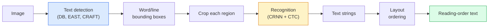

# OCR và hiểu tài liệu

> OCR là một pipeline ba giai đoạn - phát hiện các hộp văn bản, nhận dạng các ký tự, sau đó bố trí chúng. Mọi hệ thống OCR hiện đại đều sắp xếp lại các giai đoạn này hoặc merges chúng.

**Loại:** Tìm hiểu + Sử dụng
**Ngôn ngữ:** Python
**Kiến thức tiên quyết:** Giai đoạn 4 Bài 06 (Phát hiện), Giai đoạn 7 Bài 02 (Self-Attention)
**Thời lượng:** ~45 phút

## Mục tiêu học tập

- Trace OCR pipeline cổ điển (phát hiện -> nhận dạng -> bố cục) và các lựa chọn thay thế đầu cuối hiện đại (Donut, Qwen-VL-OCR)
- Triển khai CTC (Phân loại thời gian kết nối) loss cho OCR training trình tự
- Sử dụng PaddleOCR hoặc EasyOCR để phân tích cú pháp tài liệu production mà không cần training
- Phân biệt OCR, phân tích cú pháp bố cục và hiểu tài liệu — và chọn công cụ phù hợp cho mỗi tác vụ

## Vấn đề

Hình ảnh đầy văn bản ở khắp mọi nơi: biên lai, hóa đơn, ID, sách quét, biểu mẫu, bảng trắng, bảng hiệu, ảnh chụp màn hình. Trích xuất dữ liệu có cấu trúc từ chúng - không chỉ các ký tự, mà còn là "đây là tổng số tiền" - là một trong những vấn đề thị giác ứng dụng có giá trị cao nhất.

Trường được chia thành ba lớp skill:

1. **OCR thích hợp**: biến pixel thành văn bản.
2. **Phân tích cú pháp bố cục**: nhóm OCR đầu ra thành các vùng (tiêu đề, nội dung, bảng, tiêu đề).
3. **Hiểu tài liệu**: trích xuất các trường có cấu trúc ("invoice_total = $42,50") từ bố cục.

Mỗi layer có cách tiếp cận cổ điển và hiện đại, và khoảng cách giữa "Tôi muốn văn bản từ một hình ảnh" và "Tôi cần tổng số tiền từ biên lai này" lớn hơn hầu hết các nhóm nhận ra.

## Khái niệm

### pipeline cổ điển



- **Phát hiện văn bản** tạo ra tứ giác trên mỗi dòng hoặc mỗi từ.
- **Nhận dạng** cắt từng vùng đến một độ cao cố định, chạy CNN + BiLSTM + CTC để tạo ra một chuỗi ký tự.
- **Bố cục** xây dựng lại thứ tự đọc (từ trên xuống dưới, từ trái sang phải đối với tiếng Latinh; khác nhau đối với tiếng Ả Rập, tiếng Nhật).

### CTC trong một đoạn văn

Nhận dạng OCR tạo ra một chuỗi có độ dài thay đổi từ bản đồ feature có độ dài cố định. CTC (Graves et al., 2006) cho phép bạn huấn luyện điều này mà không cần alignment cấp nhân vật. model xuất ra một phân phối over (từ vựng + trống) tại mỗi bước thời gian; CTC loss bên lề trên tất cả các căn chỉnh giảm xuống văn bản đích sau khi hợp nhất các lần lặp lại và loại bỏ khoảng trống.

```
raw output: "h h h _ _ e e l l _ l l o _ _"
after merge repeats and remove blanks: "hello"
```

CTC là lý do CRNN làm việc vào năm 2015 và vẫn huấn luyện hầu hết production OCR models vào năm 2026.

### models đầu cuối hiện đại

- **Donut **(Kim và cộng sự, 2022) - một encoder ViT + một decoder văn bản; đọc hình ảnh và phát ra JSON trực tiếp. Không có trình phát hiện văn bản, không có mô-đun bố cục.
- **TrOCR** - ViT + transformer decoder cho OCR cấp đường truyền.
- **Qwen-VL-OCR / InternVL** — models fine-tuned ngôn ngữ thị giác đầy đủ cho các nhiệm vụ OCR; accuracy tốt nhất vào năm 2026 trên các tài liệu phức tạp.
- **PaddleOCR** — pipeline DB + CRNN cổ điển trong một gói production trưởng thành; vẫn là con ngựa mã nguồn mở.

models end-to-end cần nhiều dữ liệu và tính toán hơn nhưng bỏ qua sự tích lũy lỗi của pipelines nhiều giai đoạn.

### Phân tích cú pháp bố cục

Đối với tài liệu có cấu trúc, hãy chạy trình phát hiện bố cục (LayoutLMv3, DocLayNet) gắn nhãn cho từng vùng: Tiêu đề, Đoạn văn, Hình, Bảng, Chú thích. Thứ tự đọc sau đó trở thành "lặp lại qua các vùng theo thứ tự bố cục, nối".

Đối với biểu mẫu, hãy sử dụng models **Trích xuất khóa-Giá trị** (Donut cho tài liệu giàu hình ảnh, LayoutLMv3 cho quét thuần túy). Chúng lấy hình ảnh + văn bản được phát hiện + vị trí và dự đoán các cặp khóa-giá trị có cấu trúc.

### Chỉ số đánh giá

- **Tỷ lệ lỗi ký tự (CER)** — Khoảng cách Levenshtein / độ dài tham chiếu. Thấp hơn là tốt hơn. Mục tiêu Production: < 2% khi quét sạch.
- **Tỷ lệ lỗi từ (WER)** - giống nhau ở cấp độ từ.
- **F1 trên các trường có cấu trúc** — cho các tác vụ khóa-giá trị; đo lường xem `{invoice_total: 42.50}` có xuất hiện chính xác hay không.
- **Khoảng cách chỉnh sửa trên JSON** — để phân tích cú pháp tài liệu từ đầu đến cuối; bài Donut đã giới thiệu khoảng cách chỉnh sửa cây được chuẩn hóa.

## Tự xây dựng

### Bước 1: CTC loss + decoder tham lam

```python
import torch
import torch.nn as nn
import torch.nn.functional as F


def ctc_loss(log_probs, targets, input_lengths, target_lengths, blank=0):
    """
    log_probs:      (T, N, C) log-softmax over vocab including blank at index 0
    targets:        (N, S) int targets (no blanks)
    input_lengths:  (N,) per-sample time steps used
    target_lengths: (N,) per-sample target length
    """
    return F.ctc_loss(log_probs, targets, input_lengths, target_lengths,
                      blank=blank, reduction="mean", zero_infinity=True)


def greedy_ctc_decode(log_probs, blank=0):
    """
    log_probs: (T, N, C) log-softmax
    returns: list of index sequences (blanks removed, repeats merged)
    """
    preds = log_probs.argmax(dim=-1).transpose(0, 1).cpu().tolist()
    out = []
    for seq in preds:
        decoded = []
        prev = None
        for idx in seq:
            if idx != prev and idx != blank:
                decoded.append(idx)
            prev = idx
        out.append(decoded)
    return out
```

`F.ctc_loss` sử dụng triển khai CuDNN hiệu quả khi có sẵn. decoder tham lam đơn giản hơn beam search và thường nằm trong khoảng 1% CER của nó.

### Bước 2: Bộ nhận dạng CRNN tí hon

CNN + BiLSTM tối thiểu cho OCR dòng.

```python
class TinyCRNN(nn.Module):
    def __init__(self, vocab_size=40, hidden=128, feat=32):
        super().__init__()
        self.cnn = nn.Sequential(
            nn.Conv2d(1, feat, 3, 1, 1), nn.BatchNorm2d(feat), nn.ReLU(inplace=True),
            nn.MaxPool2d(2),
            nn.Conv2d(feat, feat * 2, 3, 1, 1), nn.BatchNorm2d(feat * 2), nn.ReLU(inplace=True),
            nn.MaxPool2d(2),
            nn.Conv2d(feat * 2, feat * 4, 3, 1, 1), nn.BatchNorm2d(feat * 4), nn.ReLU(inplace=True),
            nn.MaxPool2d((2, 1)),
            nn.Conv2d(feat * 4, feat * 4, 3, 1, 1), nn.BatchNorm2d(feat * 4), nn.ReLU(inplace=True),
            nn.MaxPool2d((2, 1)),
        )
        self.rnn = nn.LSTM(feat * 4, hidden, bidirectional=True, batch_first=True)
        self.head = nn.Linear(hidden * 2, vocab_size)

    def forward(self, x):
        # x: (N, 1, H, W)
        f = self.cnn(x)                # (N, C, H', W')
        f = f.mean(dim=2).transpose(1, 2)  # (N, W', C)
        h, _ = self.rnn(f)
        return F.log_softmax(self.head(h).transpose(0, 1), dim=-1)  # (W', N, vocab)
```

Đầu vào chiều cao cố định (chiều cao tối đa của CNN là 1). Chiều rộng là thứ nguyên thời gian cho CTC.

### Bước 3: OCR tổng hợp

Tạo chuỗi chữ số đen trên nền trắng để kiểm tra khói từ đầu đến cuối.

```python
import numpy as np

def synthetic_line(text, height=32, char_width=16):
    W = char_width * len(text)
    img = np.ones((height, W), dtype=np.float32)
    for i, c in enumerate(text):
        x = i * char_width
        shade = 0.0 if c.isalnum() else 0.5
        img[6:height - 6, x + 2:x + char_width - 2] = shade
    return img


def build_batch(strings, vocab):
    H = 32
    W = 16 * max(len(s) for s in strings)
    imgs = np.ones((len(strings), 1, H, W), dtype=np.float32)
    target_lengths = []
    targets = []
    for i, s in enumerate(strings):
        imgs[i, 0, :, :16 * len(s)] = synthetic_line(s)
        ids = [vocab.index(c) for c in s]
        targets.extend(ids)
        target_lengths.append(len(ids))
    return torch.from_numpy(imgs), torch.tensor(targets), torch.tensor(target_lengths)


vocab = ["_"] + list("0123456789abcdefghijklmnopqrstuvwxyz")
imgs, targets, lengths = build_batch(["hello", "world"], vocab)
print(f"images: {imgs.shape}   targets: {targets.shape}   lengths: {lengths.tolist()}")
```

Một OCR dataset thực thêm phông chữ, nhiễu, xoay, làm mờ và màu sắc. pipeline trên giống hệt nhau.

### Bước 4: Training phác thảo

```python
model = TinyCRNN(vocab_size=len(vocab))
opt = torch.optim.Adam(model.parameters(), lr=1e-3)

for step in range(200):
    strings = ["abc" + str(step % 10)] * 4 + ["xyz" + str((step + 1) % 10)] * 4
    imgs, targets, target_lens = build_batch(strings, vocab)
    log_probs = model(imgs)  # (W', 8, vocab)
    input_lens = torch.full((8,), log_probs.size(0), dtype=torch.long)
    loss = ctc_loss(log_probs, targets, input_lens, target_lens, blank=0)
    opt.zero_grad(); loss.backward(); opt.step()
```

Loss sẽ giảm từ ~3 xuống ~0,2 trong 200 bước trên dữ liệu tổng hợp tầm thường này.

## Ứng dụng

Ba con đường production:

- **PaddleOCR** — trưởng thành, nhanh chóng, đa ngôn ngữ. Sử dụng một dòng: `paddleocr.PaddleOCR(lang="en").ocr(image_path)`.
- **EasyOCR** — Python bản ngữ, đa ngôn ngữ PyTorch xương sống.
- **Tesseract** — cổ điển; vẫn hữu ích cho các tài liệu quét cũ khi models gặp khó khăn.

Để phân tích cú pháp tài liệu đầu cuối, hãy sử dụng Donut hoặc VLM:

```python
from transformers import DonutProcessor, VisionEncoderDecoderModel

processor = DonutProcessor.from_pretrained("naver-clova-ix/donut-base-finetuned-cord-v2")
model = VisionEncoderDecoderModel.from_pretrained("naver-clova-ix/donut-base-finetuned-cord-v2")
```

Đối với biên lai, hóa đơn, biểu mẫu có cấu trúc lặp lại, fine-tune Donut. Đối với các tài liệu tùy ý hoặc OCR có lý luận, một VLM như Qwen-VL-OCR là mặc định hiện tại.

## Sản phẩm bàn giao

Bài học này tạo ra:

- `outputs/prompt-ocr-stack-picker.md` — một prompt chọn Tesseract / PaddleOCR / Donut / VLM-OCR loại tài liệu, ngôn ngữ và cấu trúc nhất định.
- `outputs/skill-ctc-decoder.md` - một skill viết các decoders CTC tham lam và tìm kiếm chùm tia từ đầu, bao gồm cả chuẩn hóa độ dài.

## Bài tập

1. **(Dễ)** Huấn luyện TinyCRNN trên các chuỗi số ngẫu nhiên gồm 5 chữ số trong 500 bước. Báo cáo CER trên một trường hợp bị giữ lại.
2. **(Trung bình)** Thay thế giải mã tham lam bằng beam search (beam_width=5). Báo cáo CER delta. beam search giành chiến thắng trên những đầu vào nào?
3. **(Cứng)** Sử dụng PaddleOCR trên một tập hợp 20 biên lai, trích xuất mục hàng và tính toán F1 so với ground truth được gắn nhãn thủ công cho các cặp {item_name, price}.

## Thuật ngữ chính

| Thuật ngữ | Những gì mọi người nói | Ý nghĩa thực sự của nó |
|------|----------------|----------------------|
| OCR | "Văn bản từ pixel" | Biến vùng hình ảnh thành chuỗi ký tự |
| CTC | "loss không Alignment" | Loss huấn luyện một trình tự model không có nhãn theo từng bước thời gian; gạt ra ngoài lề vì liên kết |
| CRNN | "OCR model cổ điển" | Bộ trích xuất feature chuyển đổi + BiLSTM + CTC; Đường cơ sở năm 2015 vẫn được sử dụng vào năm production |
| Bánh rán | "OCR đầu cuối" | ViT encoder + decoder văn bản; Phát ra JSON trực tiếp từ hình ảnh |
| Phân tích cú pháp bố cục | "Tìm khu vực" | Phát hiện và gắn nhãn các vùng Title/Table/Figure/Paragraph trong tài liệu |
| Thứ tự đọc | "Chuỗi văn bản" | Sắp xếp các khu vực được công nhận thành một câu; tầm thường đối với tiếng Latinh, không tầm thường đối với bố cục hỗn hợp |
| CER / WER | "Tỷ lệ lỗi" | Khoảng cách Levenshtein / độ dài tham chiếu ở độ chi tiết ký tự hoặc từ |
| VLM-OCR | "LLM đọc" | Một ngôn ngữ thị giác model được huấn luyện hoặc nhắc nhở cho các nhiệm vụ OCR; SOTA hiện tại trên các tài liệu phức tạp |

## Đọc thêm

- [CRNN (Shi et al., 2015)](https://arxiv.org/abs/1507.05717) — kiến trúc CNN + RNN + CTC ban đầu
- [CTC (Graves et al., 2006)](https://www.cs.toronto.edu/~graves/icml_2006.pdf) — bài báo gốc của CTC; dày đặc với các ý tưởng thuật toán
- [Donut (Kim et al., 2022)](https://arxiv.org/abs/2111.15664) — transformer hiểu tài liệu miễn phí OCR
- [PaddleOCR](https://github.com/PaddlePaddle/PaddleOCR) — production OCR stack mã nguồn mở
