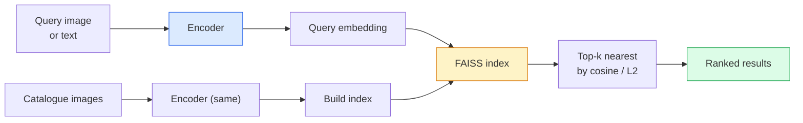

# Truy xuất hình ảnh và học số liệu

> Một hệ thống truy xuất xếp hạng các ứng viên theo khoảng cách trong không gian embedding. Học số liệu là kỷ luật định hình không gian đó để khoảng cách có nghĩa là những gì bạn muốn.

**Loại:** Xây dựng
**Ngôn ngữ:** Python
**Kiến thức tiên quyết:** Giai đoạn 4 Bài 14 (ViT), Giai đoạn 4 Bài 18 (CLIP)
**Thời lượng:** ~45 phút

## Mục tiêu học tập

- Giải thích các tổn thất học tập dựa trên bộ ba, tương phản và dựa trên proxy và chọn loại phù hợp cho một dataset nhất định
- Thực hiện chuẩn hóa L2 và tương tự cosin một cách chính xác và kiểm tra sự khác biệt giữa truy xuất "cùng một mục" và "cùng một class"
- Xây dựng chỉ mục FAISS, truy vấn bằng văn bản và hình ảnh, đồng thời báo cáo recall@K cho một tập hợp truy vấn được giữ lại
- Sử dụng DINOv2, CLIP và SigLIP làm xương sống embedding có sẵn và biết khi nào mỗi người chiến thắng

## Vấn đề

Truy xuất ở khắp mọi nơi trong tầm nhìn production: phát hiện trùng lặp, tìm kiếm hình ảnh ngược, tìm kiếm trực quan ("tìm sản phẩm tương tự"), nhận dạng lại khuôn mặt, nhận dạng lại người để giám sát, đối sánh cấp phiên bản cho thương mại điện tử. Câu hỏi về sản phẩm luôn giống nhau: "với hình ảnh truy vấn này, hãy xếp hạng danh mục của tôi".

Hai quyết định thiết kế định hình toàn bộ hệ thống. Sự embedding - những gì model tạo ra vectors. Chỉ số - làm thế nào để tìm những người hàng xóm gần nhất trên quy mô lớn. Cả hai đều là hàng hóa vào năm 2026 (DINOv2 cho embedding, FAISS cho chỉ số), điều này nâng cao tiêu chuẩn: phần khó là xác định *những gì được tính là tương tự* cho ứng dụng của bạn, sau đó định hình không gian embedding sao cho khoảng cách khớp nhau.

Định hình đó là học số liệu. Đây là một ngành học nhỏ nhưng có đòn bẩy cao.

## Khái niệm

### Truy xuất trong nháy mắt



### Bốn loss gia đình

| Loss | Yêu cầu | Ưu điểm | Nhược điểm |
|------|----------|------|------|
| **Tương phản** | (neo, tích cực) + tiêu cực | Đơn giản, hoạt động với bất kỳ nhãn cặp nào | Hội tụ chậm mà không có nhiều tiêu cực |
| **Sinh ba** | (neo, tích cực, tiêu cực) | Trực quan; Kiểm soát ký quỹ trực tiếp | Khai thác bộ ba khó tốn kém |
| **NT-Xent / Thông tin NCE** | Cặp + âm bản được khai thác batch | Quy mô thành batches lớn | Cần batch lớn hoặc hàng đợi động lượng |
| **Dựa trên Proxy (ProxyNCA)** | Chỉ Class nhãn | Nhanh chóng, ổn định, không khai thác | Có thể quá phù hợp với proxy trên datasets nhỏ |

Đối với hầu hết các trường hợp sử dụng production, hãy bắt đầu với đường trục pretrained và chỉ thêm fine-tune học chỉ số nếu embeddings có sẵn hoạt động kém hiệu quả trên nhóm thử nghiệm của bạn.

### Bộ ba loss chính thức

```
L = max(0, ||f(a) - f(p)||^2 - ||f(a) - f(n)||^2 + margin)
```

Kéo neo `a` gần `p` dương, đẩy nó ra khỏi `n` âm, với một `margin` đảm bảo khoảng trống. Cấu trúc ba hình ảnh khái quát hóa bất kỳ thứ tự tương tự nào.

Các vấn đề khai thác: bộ ba dễ dàng (`n` đã không `a`) đóng góp loss; Chỉ có bộ ba cứng mới dạy mạng. Khai thác bán cứng (`n` xa hơn `p` nhưng trong biên độ) là công thức FaceNet năm 2016 và vẫn chiếm ưu thế.

### Độ tương đồng cosin so với L2

Hai số liệu, hai quy ước:

- **Cosin**: góc giữa vectors. Yêu cầu embeddings chuẩn hóa L2.
- **L2**: Khoảng cách Euclid. Hoạt động trên embeddings thô hoặc chuẩn hóa, nhưng thường được ghép nối với L2 chuẩn hóa + L2 bình phương.

Đối với hầu hết các loại lưới hiện đại, cả hai đều tương đương: `||a - b||^2 = 2 - 2 cos(a, b)` khi `||a|| = ||b|| = 1`. Chọn quy ước phù hợp với embedding training của bạn; trộn chúng một cách âm thầm thay đổi ý nghĩa của "gần nhất".

### Recall@K

Chỉ số truy xuất tiêu chuẩn:

```
recall@K = fraction of queries where at least one correct match is in the top K results
```

Báo cáo recall@1, @5, @10 cạnh nhau. recall@10 trên 0,95 với recall@1 dưới 0,5 có nghĩa là không gian embedding có cấu trúc phù hợp nhưng xếp hạng ồn ào - hãy thử tinh chỉnh lâu hơn hoặc bước xếp hạng lại.

Đối với việc phát hiện trùng lặp, precision@K quan trọng hơn vì mọi trường hợp dương tính giả đều là lỗi mà người dùng có thể nhìn thấy. Đối với tìm kiếm trực quan, recall@K là tín hiệu sản phẩm.

### FAISS trong một đoạn văn

Facebook AI Tìm kiếm tương tự. Thư viện trên thực tế để tìm kiếm hàng xóm gần nhất. Ba lựa chọn chỉ mục:

- `IndexFlatIP` / `IndexFlatL2` — vũ phu, chính xác, không training. Sử dụng lên đến ~1 triệu vectors.
- `IndexIVFFlat` - phân vùng thành K ô, chỉ tìm kiếm một vài ô gần nhất. Gần đúng, nhanh chóng, cần dữ liệu training.
- `IndexHNSW` — dựa trên đồ thị, nhanh nhất cho nhiều truy vấn, kích thước chỉ mục lớn.

Đối với 100k vectors bạn có thể muốn `IndexFlatIP` về sự tương đồng cosin. Đối với 10 triệu bạn muốn `IndexIVFFlat`. Đối với 100M+ kết hợp với định lượng sản phẩm (`IndexIVFPQ`).

### Truy xuất cấp phiên bản so với cấp danh mục

Hai vấn đề rất khác nhau với cùng một tên:

- **Cấp danh mục** — "tìm mèo trong danh mục của tôi." Sự tương đồng Class điều kiện; CLIP / DINOv2 có sẵn embeddings hoạt động tốt.
- **Cấp phiên bản** — "tìm *sản phẩm chính xác này* trong danh mục của tôi." Cần phân biệt chi tiết giữa các đối tượng tương tự về mặt thị giác của cùng một class; có sẵn embeddings hoạt động kém; fine-tuning với việc học số liệu rất quan trọng.

Luôn hỏi bạn đang giải quyết cái nào trước khi chọn một model.

## Tự xây dựng

### Bước 1: loss bộ ba

```python
import torch
import torch.nn.functional as F

def triplet_loss(anchor, positive, negative, margin=0.2):
    d_ap = F.pairwise_distance(anchor, positive, p=2)
    d_an = F.pairwise_distance(anchor, negative, p=2)
    return F.relu(d_ap - d_an + margin).mean()
```

Một dòng. Hoạt động trên embeddings chuẩn hóa L2 hoặc thô.

### Bước 2: Khai thác bán cứng

Với một batch embeddings và nhãn, hãy tìm âm bản bán cứng khó nhất cho mỗi mỏ neo.

```python
def semi_hard_negatives(emb, labels, margin=0.2):
    dist = torch.cdist(emb, emb)
    same_class = labels[:, None] == labels[None, :]
    diff_class = ~same_class
    N = emb.size(0)

    positives = dist.clone()
    positives[~same_class] = float("-inf")
    positives.fill_diagonal_(float("-inf"))
    pos_idx = positives.argmax(dim=1)

    semi_hard = dist.clone()
    semi_hard[same_class] = float("inf")
    d_ap = dist[torch.arange(N), pos_idx].unsqueeze(1)
    semi_hard[dist <= d_ap] = float("inf")
    neg_idx = semi_hard.argmin(dim=1)

    fallback_mask = semi_hard[torch.arange(N), neg_idx] == float("inf")
    if fallback_mask.any():
        hardest = dist.clone()
        hardest[same_class] = float("inf")
        neg_idx = torch.where(fallback_mask, hardest.argmin(dim=1), neg_idx)
    return pos_idx, neg_idx
```

Mỗi mỏ neo nhận được tích cực khó nhất trong class và một tiêu cực bán cứng xa hơn tích cực nhưng nằm trong biên độ.

### Bước 3: Recall@K

```python
def recall_at_k(query_emb, gallery_emb, query_labels, gallery_labels, k=1):
    sim = query_emb @ gallery_emb.T
    _, top_k = sim.topk(k, dim=-1)
    matches = (gallery_labels[top_k] == query_labels[:, None]).any(dim=-1)
    return matches.float().mean().item()
```

Top-k bằng tích bên trong trên embeddings chuẩn hóa L2 bằng top-k cosin. Báo cáo tỷ lệ trung bình của các truy vấn với ít nhất một hàng xóm chính xác.

### Bước 4: Ghép nó lại với nhau

```python
import torch
import torch.nn as nn
from torch.optim import Adam

class Encoder(nn.Module):
    def __init__(self, in_dim=128, emb_dim=64):
        super().__init__()
        self.net = nn.Sequential(
            nn.Linear(in_dim, 128), nn.ReLU(),
            nn.Linear(128, emb_dim),
        )

    def forward(self, x):
        return F.normalize(self.net(x), dim=-1)

torch.manual_seed(0)
num_classes = 6
protos = F.normalize(torch.randn(num_classes, 128), dim=-1)

def sample_batch(bs=32):
    labels = torch.randint(0, num_classes, (bs,))
    x = protos[labels] + 0.15 * torch.randn(bs, 128)
    return x, labels

enc = Encoder()
opt = Adam(enc.parameters(), lr=3e-3)

for step in range(200):
    x, y = sample_batch(32)
    emb = enc(x)
    pos_idx, neg_idx = semi_hard_negatives(emb, y)
    loss = triplet_loss(emb, emb[pos_idx], emb[neg_idx])
    opt.zero_grad(); loss.backward(); opt.step()
```

Sau vài trăm bước, embedding cụm tạo thành một cụm mỗi class.

## Ứng dụng

Production stacks vào năm 2026:

- **DINOv2 + FAISS** — truy xuất trực quan có mục đích chung. Hoạt động có sẵn.
- **CLIP + FAISS** — khi truy vấn là văn bản.
- **Fine-tuned DINOv2 + FAISS** — truy xuất cấp phiên bản, nhận dạng lại khuôn mặt, thời trang, thương mại điện tử.
- **Milvus / Weaviate / Qdrant** — được quản lý vector trình bao bọc DB xung quanh FAISS hoặc HNSW.

Để truy xuất phiên bản SOTA, công thức là: đường trục DINOv2, thêm đầu embedding, fine-tune với bộ ba hoặc loss InfoNCE trên các cặp được gắn nhãn phiên bản, lập chỉ mục trong FAISS.

## Sản phẩm bàn giao

Bài học này tạo ra:

- `outputs/prompt-retrieval-loss-picker.md` — một prompt chọn bộ ba / InfoNCE / ProxyNCA cho một vấn đề truy xuất nhất định.
- `outputs/skill-recall-at-k-runner.md` — một skill viết một harness đánh giá rõ ràng cho recall@K với sự phân chia train/val/gallery và hợp đồng dữ liệu thích hợp.

## Bài tập

1. **(Dễ)** Chạy ví dụ đồ chơi ở trên. Vẽ embeddings với PCA trước và sau training để xem sáu cụm hình thành.
2. **(Trung bình) **Thêm triển khai loss ProxyNCA: một "proxy" đã học được trên mỗi class, entropy chéo tiêu chuẩn về sự tương đồng cosin. So sánh tốc độ hội tụ so với loss bộ ba trên dữ liệu đồ chơi.
3. **(Cứng)** Chụp 1.000 hình ảnh xác thực ImageNet, nhúng với DINOv2 thông qua HuggingFace, xây dựng chỉ mục phẳng FAISS và báo cáo recall@{1, 5, 10} đối với các hình ảnh giống như truy vấn (phải là 1.0) và chống lại sự phân tách với nhãn ImageNet là ground truth.

## Thuật ngữ chính

| Thuật ngữ | Những gì mọi người nói | Ý nghĩa thực sự của nó |
|------|----------------|----------------------|
| Học số liệu | "Định hình không gian" | Training một encoder để khoảng cách trong không gian đầu ra của nó phản ánh sự tương đồng của mục tiêu |
| Bộ ba loss | "Kéo và đẩy" | L = max(0, d(a, p) - d(a, n) + lề); loss học số liệu chuẩn |
| Khai thác bán cứng | "Tiêu cực hữu ích" | Tiêu cực xa mỏ neo hơn tích cực nhưng nằm trong biên độ; theo kinh nghiệm nhiều thông tin nhất |
| loss dựa trên Proxy | "Nguyên mẫu Class" | Một người học được proxy mỗi class; entropy chéo trên sự tương đồng với proxy; Không khai thác cặp |
| Recall@K | "Tỷ lệ trúng Top-K" | Phân số truy vấn có ít nhất một kết quả chính xác trong K trên cùng |
| Truy xuất phiên bản | "Tìm chính xác điều này" | Kết hợp hạt mịn; features có sẵn thường hoạt động kém hiệu quả |
| FAISS | "Thư viện NN" | Thư viện hàng xóm gần nhất của Facebook; Hỗ trợ các chỉ mục chính xác và gần đúng |
| HNSW | "Chỉ mục đồ thị" | Thế giới nhỏ có thể điều hướng theo thứ bậc; NN xấp xỉ nhanh với chi phí bộ nhớ nhỏ |

## Đọc thêm

- [FaceNet: A Unified Embedding for Face Recognition (Schroff et al., 2015)](https://arxiv.org/abs/1503.03832) - bộ ba loss / giấy khai thác bán cứng
- [In Defense of the Triplet Loss for Person Re-Identification (Hermans et al., 2017)](https://arxiv.org/abs/1703.07737) - hướng dẫn thực tế về fine-tuning sinh ba
- [FAISS documentation](https://github.com/facebookresearch/faiss/wiki) — mọi chỉ số, mọi sự đánh đổi
- [SMoT: Metric Learning Taxonomy (Kim et al., 2021)](https://arxiv.org/abs/2010.06927) - khảo sát về những mất mát hiện đại và mối liên hệ của chúng
