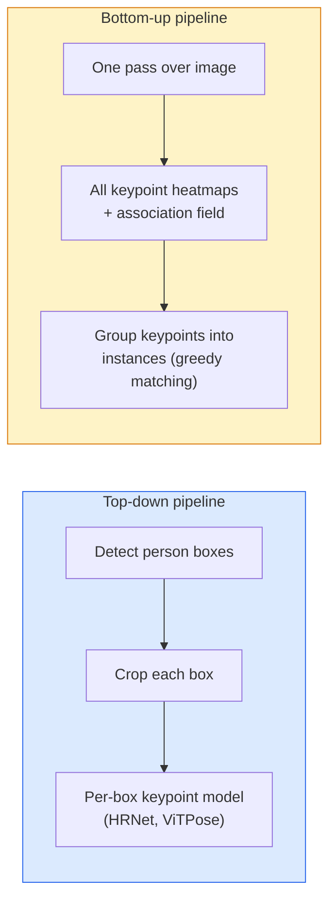

# Phát hiện điểm chính và ước tính tư thế

> Tư thế là một tập hợp các điểm chính được sắp xếp. Máy dò điểm chính là một hồi quy bản đồ nhiệt. Mọi thứ khác là sổ sách.

**Loại:** Xây dựng
**Ngôn ngữ:** Python
**Kiến thức tiên quyết:** Giai đoạn 4 Bài 06 (Phát hiện), Giai đoạn 4 Bài 07 (U-Net)
**Thời lượng:** ~45 phút

## Mục tiêu học tập

- Phân biệt ước tính và trạng thái tư thế từ trên xuống và từ dưới lên khi mỗi tư thế được sử dụng
- Hồi quy bản đồ nhiệt cho K điểm chính với mục tiêu Gaussian trên mỗi điểm khóa và trích xuất tọa độ điểm chính ở inference
- Giải thích Trường mối quan hệ phần (PAF) và cách pipelines từ dưới lên liên kết các điểm chính vào các phiên bản
- Sử dụng MediaPipe Pose hoặc MMPose để ước tính điểm chính production và hiểu định dạng đầu ra của chúng

## Vấn đề

Các nhiệm vụ Keypoint ẩn dưới nhiều tên: tư thế con người (17 khớp cơ thể), mốc khuôn mặt (68 hoặc 478 điểm), bàn tay (21 điểm), tư thế động vật, tư thế đối tượng robot, mốc giải phẫu y tế. Mỗi người trong số chúng đều có cùng một cấu trúc: phát hiện K điểm rời rạc trên một đối tượng và xuất ra tọa độ (x, y) của chúng.

Ước tính tư thế là nền tảng của chụp chuyển động, ứng dụng thể dục, phân tích thể thao, điều khiển cử chỉ, hoạt ảnh, thử AR và nắm bắt. Trường hợp 2D đã trưởng thành; Tư thế 3D (ước tính vị trí khớp trong tọa độ thế giới từ một máy ảnh duy nhất) là biên giới nghiên cứu hiện tại.

Câu hỏi kỹ thuật là quy mô. Tư thế một người, một hình ảnh là một vấn đề 20ms. Tạo dáng nhiều người trong đám đông ở tốc độ 30 khung hình / giây là một vấn đề khác với các kiến trúc khác nhau.

## Khái niệm

### Từ trên xuống so với từ dưới lên



- **Từ trên xuống** — phát hiện mọi người trước, sau đó chạy model điểm chính cho mỗi người trên mỗi vụ cắt. accuracy cao nhất; tỷ lệ tuyến tính với số lượng người.
- **Bottom-up** — một forward pass dự đoán tất cả các điểm chính cộng với một trường liên kết; nhóm họ. Thời gian không đổi bất kể quy mô đám đông.

Top-down (HRNet, ViTPose) dẫn đầu accuracy; từ dưới lên (OpenPose, HigherHRNet) là công cụ dẫn đầu thông lượng cho các cảnh đông đúc.

### Hồi quy bản đồ nhiệt

Thay vì thoái lui `(x, y)` trực tiếp, hãy dự đoán bản đồ nhiệt `H x W` cho mỗi điểm chính với một đốm màu Gaussian tập trung ở vị trí thực.

```
target[k, y, x] = exp(-((x - cx_k)^2 + (y - cy_k)^2) / (2 sigma^2))
```

Tại inference, argmax của mỗi bản đồ nhiệt là vị trí điểm chính được dự đoán.

Tại sao bản đồ nhiệt hoạt động tốt hơn hồi quy trực tiếp: cấu trúc không gian của mạng (conv feature map) phù hợp một cách tự nhiên với đầu ra không gian. Các mục tiêu Gaussian cũng chính quy hóa - một sai số cục bộ nhỏ tạo ra một loss nhỏ, không phải bằng không.

### Bản địa hóa pixel phụ

Argmax cho tọa độ số nguyên. Đối với precision điểm ảnh phụ, hãy tinh chỉnh bằng cách lắp một parabol vào argmax và các điểm lân cận của nó, hoặc sử dụng hướng `(dx, dy) = 0.25 * (heatmap[y, x+1] - heatmap[y, x-1], ...)` bù nổi tiếng.

### Trường mối quan hệ một phần (PAF)

Thủ thuật của OpenPose để liên kết từ dưới lên. Đối với mỗi cặp điểm chính được kết nối (ví dụ: vai trái đến khuỷu tay trái), hãy dự đoán một trường 2 kênh mã hóa đơn vị vector chỉ từ điểm này sang điểm khác. Để liên kết vai với khuỷu tay của nó, hãy tích hợp PAF dọc theo đường kết nối các cặp ứng cử viên; cặp có tích phân cao nhất được khớp.

```
For each connection (limb):
  PAF channels: 2 (unit vector x, y)
  Line integral: sum over sample points of (PAF . line_direction)
  Higher integral = stronger match
```

Thanh lịch và quy mô theo quy mô đám đông tùy ý mà không cần cây trồng cho mỗi người.

### Điểm chính của COCO

Tư thế cơ thể tiêu chuẩn dataset: 17 điểm chính cho mỗi người, PCK (Tỷ lệ phần trăm điểm chính xác) và OKS (Điểm tương đồng của điểm chính đối tượng) làm số liệu. OKS là điểm tương tự chính của IoU và là những gì COCO mAP@OKS báo cáo.

### 2D so với 3D

- **Tư thế 2D** — tọa độ hình ảnh; được giải quyết ở chất lượng production (MediaPipe, HRNet, ViTPose).
- **Tư thế 3D** — tọa độ thế giới / máy ảnh; vẫn đang nghiên cứu tích cực. Các cách tiếp cận phổ biến:
  - Nâng dự đoán 2D lên 3D với MLP nhỏ (VideoPose3D).
  - Hồi quy 3D trực tiếp từ hình ảnh (PyMAF, MHFormer).
  - Thiết lập đa chế độ xem (CMU Panoptic) cho ground truth.

## Tự xây dựng

### Bước 1: Mục tiêu bản đồ nhiệt Gaussian

```python
import numpy as np
import torch

def gaussian_heatmap(size, cx, cy, sigma=2.0):
    yy, xx = np.meshgrid(np.arange(size), np.arange(size), indexing="ij")
    return np.exp(-((xx - cx) ** 2 + (yy - cy) ** 2) / (2 * sigma ** 2)).astype(np.float32)

hm = gaussian_heatmap(64, 32, 32, sigma=2.0)
print(f"peak: {hm.max():.3f} at ({hm.argmax() % 64}, {hm.argmax() // 64})")
```

Bản đồ nhiệt trên mỗi điểm chính xếp chồng lên nhau dọc theo trục kênh cung cấp tensor mục tiêu đầy đủ.

### Bước 2: Đầu keypoint nhỏ

Một model kiểu U-Net xuất ra K kênh bản đồ nhiệt.

```python
import torch.nn as nn
import torch.nn.functional as F

class TinyKeypointNet(nn.Module):
    def __init__(self, num_keypoints=4, base=16):
        super().__init__()
        self.down1 = nn.Sequential(nn.Conv2d(3, base, 3, 2, 1), nn.ReLU(inplace=True))
        self.down2 = nn.Sequential(nn.Conv2d(base, base * 2, 3, 2, 1), nn.ReLU(inplace=True))
        self.mid = nn.Sequential(nn.Conv2d(base * 2, base * 2, 3, 1, 1), nn.ReLU(inplace=True))
        self.up1 = nn.ConvTranspose2d(base * 2, base, 2, 2)
        self.up2 = nn.ConvTranspose2d(base, num_keypoints, 2, 2)

    def forward(self, x):
        h1 = self.down1(x)
        h2 = self.down2(h1)
        h3 = self.mid(h2)
        u1 = self.up1(h3)
        return self.up2(u1)
```

`(N, 3, H, W)` đầu vào, `(N, K, H, W)` đầu ra. Loss là MSE trên mỗi pixel so với các mục tiêu Gaussian.

### Bước 3: Inference - trích xuất tọa độ điểm chính

```python
def heatmap_to_coords(heatmaps):
    """
    heatmaps: (N, K, H, W)
    returns:  (N, K, 2) float coordinates in image pixels
    """
    N, K, H, W = heatmaps.shape
    hm = heatmaps.reshape(N, K, -1)
    idx = hm.argmax(dim=-1)
    ys = (idx // W).float()
    xs = (idx % W).float()
    return torch.stack([xs, ys], dim=-1)

coords = heatmap_to_coords(torch.randn(2, 4, 32, 32))
print(f"coords: {coords.shape}")  # (2, 4, 2)
```

Một dòng ở inference. Để tinh chỉnh pixel phụ, hãy nội suy xung quanh argmax.

### Bước 4: Điểm chính tổng hợp dataset

Đơn giản: vẽ bốn điểm trên một bức tranh trắng và học cách dự đoán chúng.

```python
def make_synthetic_sample(size=64):
    img = np.ones((3, size, size), dtype=np.float32)
    rng = np.random.default_rng()
    kps = rng.integers(8, size - 8, size=(4, 2))
    for cx, cy in kps:
        img[:, cy - 2:cy + 2, cx - 2:cx + 2] = 0.0
    hms = np.stack([gaussian_heatmap(size, cx, cy) for cx, cy in kps])
    return img, hms, kps
```

Đủ dễ dàng để một model nhỏ học trong một phút.

### Bước 5: Training

```python
model = TinyKeypointNet(num_keypoints=4)
opt = torch.optim.Adam(model.parameters(), lr=3e-3)

for step in range(200):
    batch = [make_synthetic_sample() for _ in range(16)]
    imgs = torch.from_numpy(np.stack([b[0] for b in batch]))
    hms = torch.from_numpy(np.stack([b[1] for b in batch]))
    pred = model(imgs)
    # Upsample pred to full resolution
    pred = F.interpolate(pred, size=hms.shape[-2:], mode="bilinear", align_corners=False)
    loss = F.mse_loss(pred, hms)
    opt.zero_grad(); loss.backward(); opt.step()
```

## Ứng dụng

- **Tư thế MediaPipe** — Công cụ ước tính tư thế production của Google; ships runtimes di động WebGL + với độ trễ dưới 10ms.
- **MMPose** (OpenMMLab) — cơ sở mã nghiên cứu toàn diện; mọi kiến trúc SOTA với trọng số pretrained.
- **YOLOv8-pose** — tư thế nhiều người trong thời gian thực nhanh nhất với một forward pass.
- **transformers HumanDPT / PoseAnything** — các phương pháp tiếp cận ngôn ngữ tầm nhìn mới hơn cho tư thế từ vựng mở (bất kỳ đối tượng nào, bất kỳ bộ điểm chính nào).

## Sản phẩm bàn giao

Bài học này tạo ra:

- `outputs/prompt-pose-stack-picker.md` - một prompt chọn MediaPipe / YOLOv8-pose / HRNet / ViTPose dựa trên độ trễ, quy mô đám đông và nhu cầu 2D so với 3D.
- `outputs/skill-heatmap-to-coords.md` — một skill viết quy trình bản đồ nhiệt thành tọa độ pixel phụ được sử dụng bởi mọi model tư thế production.

## Bài tập

1. **(Dễ)** Huấn luyện model điểm chính nhỏ trên dataset 4 điểm tổng hợp. Báo cáo lỗi L2 trung bình giữa các điểm chính dự đoán và đúng sau 200 bước.
2. **(Trung bình)** Thêm tinh chỉnh pixel phụ: với vị trí argmax, lắp parabol 1D dọc theo x và y từ các pixel lân cận. Báo cáo mức tăng accuracy so với argmax số nguyên.
3. **(Khó)** Xây dựng một dataset tổng hợp 2 người, trong đó mỗi hình ảnh hiển thị hai trường hợp của mẫu 4 điểm khóa. Huấn luyện pipeline từ dưới lên với PAF dự đoán điểm chính nào thuộc về trường hợp nào và đánh giá OKS.

## Thuật ngữ chính

| Thuật ngữ | Những gì mọi người nói | Ý nghĩa thực sự của nó |
|------|----------------|----------------------|
| Điểm chính | "Một cột mốc" | Một điểm có thứ tự cụ thể trên một đối tượng (khớp, góc, feature) |
| Tư thế | "Bộ xương" | Một tập hợp các điểm khóa được sắp xếp theo thứ tự thuộc về một thực thể |
| Từ trên xuống | "Phát hiện rồi tạo dáng" | pipeline hai giai đoạn: máy dò người + model điểm chính trên mỗi cây trồng; accuracy cao nhất |
| Từ dưới lên | "Tạo dáng trước, nhóm sau" | Dự đoán + nhóm tất cả các điểm chính một lần; Thời gian không đổi trong quy mô đám đông |
| Bản đồ nhiệt | "Mục tiêu Gaussian" | H x W tensor trên mỗi điểm chính với đỉnh tại vị trí thực; Mục tiêu hồi quy ưu tiên |
| PAF | "Trường mối quan hệ một phần" | Đơn vị 2 kênh vector trường mã hóa hướng chi; được sử dụng để nhóm các điểm khóa thành các phiên bản |
| Đồng ý | "Điểm chính IoU" | Điểm tương đồng của đối tượng; chỉ số COCO cho tư thế |
| Nhân sự | "Mạng độ phân giải cao" | Kiến trúc điểm chính từ trên xuống thống trị; Duy trì features độ phân giải cao trong suốt |

## Đọc thêm

- [OpenPose (Cao et al., 2017)](https://arxiv.org/abs/1812.08008) — từ dưới lên với PAF; vẫn là bài viết tốt nhất về cách tiếp cận
- [HRNet (Sun et al., 2019)](https://arxiv.org/abs/1902.09212) — kiến trúc tham chiếu từ trên xuống
- [ViTPose (Xu et al., 2022)](https://arxiv.org/abs/2204.12484) - ViT đơn giản như một xương sống tư thế; SOTA hiện tại trên nhiều benchmarks
- [MediaPipe Pose](https://developers.google.com/mediapipe/solutions/vision/pose_landmarker) - production tư thế thời gian thực; stack triển khai nhanh nhất vào năm 2026
