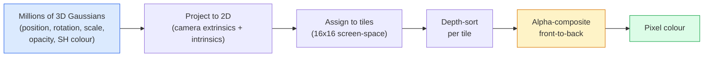

# 3D Gaussian Splatting từ đầu

> Một cảnh là một cloud của hàng triệu Gaussian 3D. Mỗi cái có một vị trí, hướng, tỷ lệ, độ mờ và màu sắc phụ thuộc vào hướng nhìn. Rasterize chúng, backprop thông qua rasterization, hoàn tất.

**Loại:** Xây dựng
**Ngôn ngữ:** Python
**Kiến thức tiên quyết:** Giai đoạn 4 Bài 13 (Tầm nhìn 3D & NeRF), Giai đoạn 1 Bài 12 (Hoạt động Tensor), Giai đoạn 4 Bài 10 (Kiến thức cơ bản về khuếch tán tùy chọn)
**Thời lượng:** ~90 phút

## Mục tiêu học tập

- Giải thích lý do tại sao 3D Gaussian Splatting thay thế NeRF làm production mặc định để tái tạo 3D chân thực vào năm 2026
- Nêu sáu parameters trên mỗi Gaussian (vị trí, quaternion quay, tỷ lệ, độ mờ, màu sóng hài hình cầu, feature tùy chọn) và số lượng phao mỗi lần đóng góp
- Triển khai trình rasterizer bắn tung tóe Gaussian 2D từ đầu bằng cách sử dụng tổng hợp `alpha`, sau đó hiển thị cách trường hợp 3D chiếu vào cùng một vòng lặp
- Sử dụng `nerfstudio`, `gsplat` hoặc `SuperSplat` để tái tạo cảnh từ 20-50 ảnh và xuất sang tiện ích mở rộng `KHR_gaussian_splatting` glTF hoặc OpenUSD 26.03 `UsdVolParticleField3DGaussianSplat` schema

## Vấn đề

NeRF lưu trữ một cảnh dưới dạng trọng lượng của MLP. Mỗi pixel được kết xuất là hàng trăm truy vấn MLP dọc theo một tia. Training mất hàng giờ, kết xuất mất vài giây và không thể chỉnh sửa trọng lượng - nếu bạn muốn di chuyển một chiếc ghế bên trong một cảnh, bạn phải huấn luyện lại.

3D Gaussian Splatting (Kerbl, Kopanas, Leimkühler, Drettakis, SIGGRAPH 2023) đã thay thế tất cả những điều đó. Một cảnh là một tập hợp rõ ràng của Gaussian 3D. Kết xuất là GPU rasterization ở tốc độ 100+ khung hình / giây. Training mất vài phút. Chỉnh sửa trực tiếp: dịch một tập hợp con của Gaussian và bạn đã di chuyển ghế. Đến năm 2026, Tập đoàn Khronos đã phê chuẩn phần mở rộng glTF cho Gaussian splats, OpenUSD 26,03 ships Gaussian splat schema, Zillow và Apartments.com render bất động sản với chúng, và hầu hết các tài liệu nghiên cứu mới về tái tạo 3D là các biến thể của ý tưởng cốt lõi 3DGS.

model tinh thần rất đơn giản, toán học có đủ các phần chuyển động mà hầu hết các phần giới thiệu bắt đầu ở rasterization và bỏ qua các phép chiếu và sóng hài hình cầu. Bài học này xây dựng toàn bộ - phiên bản 2D trước, sau đó là phần mở rộng 3D.

## Khái niệm

### Những gì một Gaussian mang theo

Một Gaussian 3D là một đốm tham số trong không gian với các thuộc tính sau:

```
position         mu         (3,)    centre in world coordinates
rotation         q          (4,)    unit quaternion encoding orientation
scale            s          (3,)    log-scales per axis (exponentiated at render time)
opacity          alpha      (1,)    post-sigmoid opacity [0, 1]
SH coefficients  c_lm       (3 * (L+1)^2,)   view-dependent colour
```

Xoay + thang đo xây dựng hiệp phương sai 3x3: `Sigma = R S S^T R^T`. Đó là hình dạng của Gaussian trong 3D. Sóng hài hình cầu cho phép màu sắc thay đổi theo hướng xem - điểm nổi bật gương, ánh sáng tinh tế, ánh sáng phụ thuộc vào chế độ xem - mà không lưu trữ kết cấu trên mỗi chế độ xem. Với SH độ 3, bạn nhận được 16 hệ số trên mỗi kênh màu, 48 phao cho mỗi Gaussian chỉ cho màu.

Một cảnh thường có 1-5 triệu Gaussian. Mỗi chiếc lưu trữ khoảng 60 chiếc phao (3 + 4 + 3 + 1 + 48 + linh tinh). Đó là 240 MB cho một cảnh năm triệu Gaussian - nhỏ hơn nhiều so với điểm tương đương cloud với kết cấu mỗi điểm và nhỏ hơn một bậc so với trọng lượng MLP của NeRF được hiển thị lại ở độ phân giải cao.

### Rasterization, không phải ray diễu hành



Năm bước, tất cả đều thân thiện với GPU. Không có truy vấn MLP trên mỗi pixel. Một RTX 3080 Ti duy nhất hiển thị 6 triệu lần bắn tung tóe ở tốc độ 147 khung hình / giây.

### Bước chiếu

Gaussian 3D ở vị trí thế giới `mu` với hiệp phương sai 3D `Sigma` chiếu đến Gaussian 2D ở vị trí màn hình `mu'` với hiệp phương sai 2D `Sigma'`:

```
mu' = project(mu)
Sigma' = J W Sigma W^T J^T          (2 x 2)

W = viewing transform (rotation + translation of camera)
J = Jacobian of the perspective projection at mu'
```

Dấu chân của Gaussian 2D là một hình elip có trục là vectơ riêng của `Sigma'`. Mỗi pixel bên trong hình elip đó nhận được sự đóng góp của Gaussian, có trọng số bằng `exp(-0.5 * (p - mu')^T Sigma'^-1 (p - mu'))`.

### Quy tắc tổng hợp alpha

Đối với một pixel, các Gaussian bao phủ nó được sắp xếp từ sau ra trước (hoặc tương đương từ trước ra sau với công thức đảo ngược). Màu sắc được tổng hợp với cùng một phương trình như mọi rasteriser bán trong suốt kể từ những năm 1980:

```
C_pixel = sum_i alpha_i * T_i * c_i

T_i = prod_{j < i} (1 - alpha_j)       transmittance up to i
alpha_i = opacity_i * exp(-0.5 * d^T Sigma'^-1 d)   local contribution
c_i = eval_SH(SH_i, view_direction)    view-dependent colour
```

Đây là **phương trình tương tự như kết xuất thể tích của NeRF**, chỉ trên một tập hợp Gaussian thưa thớt rõ ràng thay vì các mẫu dày đặc dọc theo một tia. Bản sắc đó là lý do tại sao chất lượng hiển thị phù hợp với NeRF - cả hai đều tích hợp cùng một phương trình trường bức xạ.

### Tại sao điều này có thể phân biệt được

Mỗi bước - phép chiếu, gán ô, tổng hợp alpha, đánh giá SH - đều có thể phân biệt được đối với parameters Gaussian. Cho một hình ảnh thực tế cơ sở, tính toán loss pixel được hiển thị, backprop thông qua rasteriser, cập nhật tất cả `(mu, q, s, alpha, c_lm)` theo gradient descent. Hơn ~30.000 lần lặp lại, người Gaussian tìm thấy vị trí, tỷ lệ và màu sắc phù hợp của họ.

### Mật độ và cắt tỉa

Một tập hợp cố định của Gaussian không thể bao quát một cảnh phức tạp. Training bao gồm hai cơ chế thích ứng:

- **Nhân bản** một Gaussian ở vị trí hiện tại khi cấp sao gradient của nó cao nhưng quy mô của nó nhỏ - việc tái tạo cần thêm chi tiết ở đây.
- **Tách **một Gaussian quy mô lớn thành hai cái nhỏ hơn khi gradient của nó cao - một Gaussian lớn quá mịn để phù hợp với khu vực.
- **Cắt tỉa** Gaussian có độ mờ giảm xuống dưới ngưỡng - họ không đóng góp.

Mật độ hóa chạy mỗi N lần lặp. Một cảnh thường phát triển từ ~100k Gaussian ban đầu (được gieo hạt từ điểm SfM) đến 1-5M vào cuối training.

### Sóng hài hình cầu trong một đoạn văn

Màu phụ thuộc vào chế độ xem là một chức năng `c(direction)` trên quả cầu đơn vị. Sóng hài hình cầu là cơ sở Fourier của hình cầu. Cắt bớt ở mức độ `L` và bạn nhận được `(L+1)^2` hàm cơ bản trên mỗi kênh. Đánh giá màu sắc cho một chế độ xem mới là một tích chấm giữa hệ số SH đã học và cơ sở được đánh giá ở hướng xem. Độ 0 = một hệ số = màu không đổi. Độ 3 = 16 hệ số = đủ để chụp bóng Lambertian, phản xạ gương và phản xạ nhẹ. Giấy SD Gaussian Splatting sử dụng độ 3 theo mặc định.

### The 2026 production stack

```
1. Capture         smartphone / DJI drone / handheld scanner
2. SfM / MVS       COLMAP or GLOMAP derives camera poses + sparse points
3. Train 3DGS      nerfstudio / gsplat / inria official / PostShot (~10-30 min on RTX 4090)
4. Edit            SuperSplat / SplatForge (clean floaters, segment)
5. Export          .ply -> glTF KHR_gaussian_splatting or .usd (OpenUSD 26.03)
6. View            Cesium / Unreal / Babylon.js / Three.js / Vision Pro
```

### Các biến thể 4D và tổng quát

- **4D Gaussian Splatting **- Gaussian là hàm của thời gian; được sử dụng cho video thể tích (Superman 2026, "Helicopter" của A$AP Rocky).
- **Generative splats** — models text-to-splat (Marble của World Labs) gây ảo giác cho toàn bộ cảnh.
- **Biến đổi không mùi 3D Gaussian** — NVIDIA biến thể của NuRec để mô phỏng lái xe tự động.

## Tự xây dựng

### Bước 1: Gaussian 2D

Đầu tiên chúng tôi xây dựng một rasteriser 2D. Vỏ 3D thu nhỏ lại sau khi chiếu.

```python
import torch
import torch.nn as nn
import torch.nn.functional as F


def eval_2d_gaussian(means, covs, points):
    """
    means:  (G, 2)      centres
    covs:   (G, 2, 2)   covariance matrices
    points: (H, W, 2)   pixel coordinates
    returns: (G, H, W)  density at every pixel for every Gaussian
    """
    G = means.size(0)
    H, W, _ = points.shape
    flat = points.view(-1, 2)
    inv = torch.linalg.inv(covs)
    diff = flat[None, :, :] - means[:, None, :]
    d = torch.einsum("gpi,gij,gpj->gp", diff, inv, diff)
    density = torch.exp(-0.5 * d)
    return density.view(G, H, W)
```

`einsum` tạo dạng bậc hai `diff^T Sigma^-1 diff` cho mọi cặp (Gaussian, pixel).

### Bước 2: Rasteriser bắn tung tóe 2D

Alpha-compositing từ trước ra sau. Độ sâu trong 2D là vô nghĩa, vì vậy chúng tôi sử dụng một vô hướng theo Gaussian đã học cho trật tự.

```python
def rasterise_2d(means, covs, colours, opacities, depths, image_size):
    """
    means:     (G, 2)
    covs:      (G, 2, 2)
    colours:   (G, 3)
    opacities: (G,)     in [0, 1]
    depths:    (G,)     per-Gaussian scalar used for ordering
    image_size: (H, W)
    returns:   (H, W, 3) rendered image
    """
    H, W = image_size
    yy, xx = torch.meshgrid(
        torch.arange(H, dtype=torch.float32, device=means.device),
        torch.arange(W, dtype=torch.float32, device=means.device),
        indexing="ij",
    )
    points = torch.stack([xx, yy], dim=-1)

    densities = eval_2d_gaussian(means, covs, points)
    alphas = opacities[:, None, None] * densities
    alphas = alphas.clamp(0.0, 0.99)

    order = torch.argsort(depths)
    alphas = alphas[order]
    colours_sorted = colours[order]

    T = torch.ones(H, W, device=means.device)
    out = torch.zeros(H, W, 3, device=means.device)
    for i in range(means.size(0)):
        a = alphas[i]
        out += (T * a)[..., None] * colours_sorted[i][None, None, :]
        T = T * (1.0 - a)
    return out
```

Không nhanh — triển khai thực sự sử dụng hạt nhân CUDA dựa trên ô — nhưng chính xác là toán học chính xác và hoàn toàn có thể phân biệt.

### Bước 3: Cảnh bắn tung tóe 2D có thể huấn luyện

```python
class Splats2D(nn.Module):
    def __init__(self, num_splats=128, image_size=64, seed=0):
        super().__init__()
        g = torch.Generator().manual_seed(seed)
        H, W = image_size, image_size
        self.means = nn.Parameter(torch.rand(num_splats, 2, generator=g) * torch.tensor([W, H]))
        self.log_scale = nn.Parameter(torch.ones(num_splats, 2) * math.log(2.0))
        self.rot = nn.Parameter(torch.zeros(num_splats))  # single angle in 2D
        self.colour_logits = nn.Parameter(torch.randn(num_splats, 3, generator=g) * 0.5)
        self.opacity_logit = nn.Parameter(torch.zeros(num_splats))
        self.depth = nn.Parameter(torch.rand(num_splats, generator=g))

    def covs(self):
        s = torch.exp(self.log_scale)
        c, si = torch.cos(self.rot), torch.sin(self.rot)
        R = torch.stack([
            torch.stack([c, -si], dim=-1),
            torch.stack([si, c], dim=-1),
        ], dim=-2)
        S = torch.diag_embed(s ** 2)
        return R @ S @ R.transpose(-1, -2)

    def forward(self, image_size):
        covs = self.covs()
        colours = torch.sigmoid(self.colour_logits)
        opacities = torch.sigmoid(self.opacity_logit)
        return rasterise_2d(self.means, covs, colours, opacities, self.depth, image_size)
```

`log_scale`, `opacity_logit` và `colour_logits` đều không bị ràng buộc parameters ánh xạ thông qua kích hoạt phù hợp tại thời điểm kết xuất. Đây là mẫu tiêu chuẩn cho mọi triển khai 3DGS.

### Bước 4: Lắp Gaussian 2D vào ảnh mục tiêu

```python
import math
import numpy as np

def make_target(size=64):
    yy, xx = np.meshgrid(np.arange(size), np.arange(size), indexing="ij")
    img = np.zeros((size, size, 3), dtype=np.float32)
    # Red circle
    mask = (xx - 20) ** 2 + (yy - 20) ** 2 < 10 ** 2
    img[mask] = [1.0, 0.2, 0.2]
    # Blue square
    mask = (np.abs(xx - 45) < 8) & (np.abs(yy - 40) < 8)
    img[mask] = [0.2, 0.3, 1.0]
    return torch.from_numpy(img)


target = make_target(64)
model = Splats2D(num_splats=64, image_size=64)
opt = torch.optim.Adam(model.parameters(), lr=0.05)

for step in range(200):
    pred = model((64, 64))
    loss = F.mse_loss(pred, target)
    opt.zero_grad(); loss.backward(); opt.step()
    if step % 40 == 0:
        print(f"step {step:3d}  mse {loss.item():.4f}")
```

Hơn 200 bước, 64 Gaussian ổn định thành hai hình dạng. Đó là toàn bộ ý tưởng - gradient đi xuống trên primitives hình học rõ ràng.

### Bước 5: Từ 2D sang 3D

Tiện ích mở rộng 3D giữ nguyên vòng lặp. Các bổ sung:

1. Vòng quay Per-Gaussian là một quaternion thay vì một góc duy nhất.
2. Hiệp phương sai được `R S S^T R^T` với `R` được xây dựng từ quaternion và `S = diag(exp(log_scale))`.
3. Phép chiếu `(mu, Sigma) -> (mu', Sigma')` sử dụng máy ảnh bên ngoài và Jacobian của phép chiếu phối cảnh ở `mu`.
4. Màu sắc trở thành một sự mở rộng sóng hài hình cầu; đánh giá nó theo hướng xem.
5. Sắp xếp độ sâu là từ không gian máy ảnh thực tế z thay vì vô hướng đã học.

Mọi triển khai production (`gsplat`, `inria/gaussian-splatting`, `nerfstudio`) đều thực hiện chính xác điều này trên GPU với hạt nhân CUDA dựa trên ô.

### Bước 6: Đánh giá sóng hài hình cầu

Cơ sở SH đến bậc 3 có 16 số hạng trên mỗi kênh. Đánh giá:

```python
def eval_sh_degree_3(sh_coeffs, dirs):
    """
    sh_coeffs: (..., 16, 3)   last dim is RGB channels
    dirs:      (..., 3)       unit vectors
    returns:   (..., 3)
    """
    C0 = 0.282094791773878
    C1 = 0.488602511902920
    C2 = [1.092548430592079, 1.092548430592079,
          0.315391565252520, 1.092548430592079,
          0.546274215296039]
    x, y, z = dirs[..., 0], dirs[..., 1], dirs[..., 2]
    x2, y2, z2 = x * x, y * y, z * z
    xy, yz, xz = x * y, y * z, x * z

    result = C0 * sh_coeffs[..., 0, :]
    result = result - C1 * y[..., None] * sh_coeffs[..., 1, :]
    result = result + C1 * z[..., None] * sh_coeffs[..., 2, :]
    result = result - C1 * x[..., None] * sh_coeffs[..., 3, :]

    result = result + C2[0] * xy[..., None] * sh_coeffs[..., 4, :]
    result = result + C2[1] * yz[..., None] * sh_coeffs[..., 5, :]
    result = result + C2[2] * (2.0 * z2 - x2 - y2)[..., None] * sh_coeffs[..., 6, :]
    result = result + C2[3] * xz[..., None] * sh_coeffs[..., 7, :]
    result = result + C2[4] * (x2 - y2)[..., None] * sh_coeffs[..., 8, :]

    # degree 3 terms omitted here for brevity; full 16-coefficient version in the code file
    return result
```

Học `sh_coeffs` lưu trữ "màu sắc theo mọi hướng" cho Gaussian đó. Tại thời điểm kết xuất, bạn đánh giá dựa trên hướng xem hiện tại và nhận được RGB 3 vector.

## Ứng dụng

Đối với công việc 3DGS thực sự, hãy sử dụng `gsplat` (Meta) hoặc `nerfstudio`:

```bash
pip install nerfstudio gsplat
ns-download-data example
ns-train splatfacto --data path/to/data
```

`splatfacto` là huấn luyện viên 3DGS của nerfstudio. Quá trình chạy mất 10-30 phút trên RTX 4090 cho một cảnh điển hình.

Các tùy chọn xuất khẩu quan trọng vào năm 2026:

- `.ply` — cloud Gaussian thô (di động, tệp lớn nhất).
- `.splat` - Định dạng lượng tử hóa PlayCanvas / SuperSplat.
- glTF `KHR_gaussian_splatting` — Tiêu chuẩn Khronos, di động cho người xem (RC tháng 2 năm 2026).
- OpenUSD `UsdVolParticleField3DGaussianSplat` — USD-native, dành cho NVIDIA Omniverse và Vision Pro pipelines.

Đối với cảnh 4D / động, `4DGS` và `Deformable-3DGS` mở rộng cùng một máy móc với các phương tiện và độ mờ thay đổi theo thời gian.

## Sản phẩm bàn giao

Bài học này tạo ra:

- `outputs/prompt-3dgs-capture-planner.md` — một prompt lập kế hoạch session chụp (số lượng ảnh, đường dẫn của máy ảnh, ánh sáng) cho một loại cảnh nhất định.
- `outputs/skill-3dgs-export-router.md` — một skill chọn định dạng xuất phù hợp (`.ply` / `.splat` / glTF / USD) cho trình xem hoặc công cụ xuôi dòng.

## Bài tập

1. **(Dễ dàng)** Chạy huấn luyện viên bắn tung tóe 2D ở trên trên một hình ảnh tổng hợp khác. Thay đổi `num_splats` trong `[16, 64, 256]` và biểu đồ MSE so với bước cho mỗi loại. Xác định điểm lợi nhuận giảm dần.
2. **(Trung bình)** Mở rộng bộ rasteriser 2D để hỗ trợ các màu RGB trên mỗi Gaussian phụ thuộc vào "góc nhìn" vô hướng thông qua sóng hài độ-2. Huấn luyện trên một cặp hình ảnh mục tiêu và xác minh model tái tạo cả hai.
3. **(Khó) **Sao chép `nerfstudio` và huấn luyện `splatfacto` trên 20 bức ảnh chụp bất kỳ cảnh nào bạn có (bàn làm việc, cây cối, khuôn mặt, phòng). Xuất sang glTF `KHR_gaussian_splatting` và mở nó trong trình xem (Three.js `GaussianSplats3D`, SuperSplat Babylon.js V9). Báo cáo thời gian training, số lượng Gaussian và khung hình / giây được hiển thị.

## Thuật ngữ chính

| Thuật ngữ | Những gì mọi người nói | Ý nghĩa thực sự của nó |
|------|----------------|----------------------|
| 3DGS | "Bắn tung tóe Gaussian" | Biểu diễn cảnh rõ ràng dưới dạng hàng triệu Gaussian 3D với vị trí mỗi Gaussian, xoay, tỷ lệ, độ mờ, màu SH |
| Hiệp phương sai | "Hình dạng của Gaussian" | `Sigma = R S S^T R^T`; định hướng và thang dị hướng của một Gaussian |
| Tổng hợp alpha | "Sự pha trộn từ sau ra trước" | Phương trình tương tự như kết xuất thể tích của NeRF, bây giờ trên một tập hợp thưa thớt rõ ràng |
| Mật độ | "Sao chép và tách" | Bổ sung thích ứng của Gaussian mới khi tái tạo không phù hợp |
| Cắt tỉa | "Xóa độ mờ thấp" | Loại bỏ Gaussian đã sụp đổ đến độ mờ gần bằng không trong training |
| Sóng hài hình cầu | "Màu phụ thuộc vào chế độ xem" | Cơ sở Fourier trên hình cầu; Lưu trữ màu sắc như một chức năng của hướng nhìn |
| Splatfacto | "3DGS của nerfstudio" | Con đường dễ dàng nhất để training 3DGS vào năm 2026 |
| `KHR_gaussian_splatting` | "Tiêu chuẩn glTF" | Tiện ích mở rộng Khronos 2026 giúp 3DGS di động trên người xem và công cụ |

## Đọc thêm

- [3D Gaussian Splatting for Real-Time Radiance Field Rendering (Kerbl et al., SIGGRAPH 2023)](https://repo-sam.inria.fr/fungraph/3d-gaussian-splatting/) — giấy gốc
- [gsplat (Meta/nerfstudio)](https://github.com/nerfstudio-project/gsplat) — trình rasteriser CUDA chất lượng production
- [nerfstudio Splatfacto](https://docs.nerf.studio/nerfology/methods/splat.html) - tham khảo training công thức
- [Khronos KHR_gaussian_splatting extension](https://github.com/KhronosGroup/glTF/blob/main/extensions/2.0/Khronos/KHR_gaussian_splatting/README.md) — định dạng di động năm 2026
- [OpenUSD 26.03 release notes](https://openusd.org/release/) — `UsdVolParticleField3DGaussianSplat` schema
- [THE FUTURE 3D State of Gaussian Splatting 2026](https://www.thefuture3d.com/blog-0/2026/4/4/state-of-gaussian-splatting-2026) — tổng quan ngành
