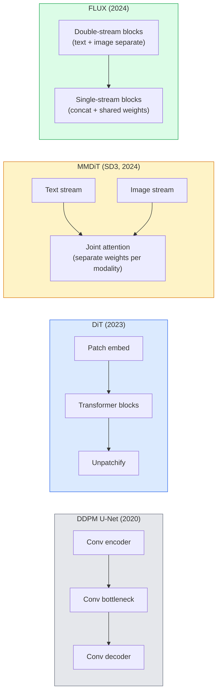

# Khuếch tán Transformers và lưu lượng chỉnh lưu

> U-Net không phải là bí mật của sự khuếch tán. Thay thế nó bằng một transformer, hoán đổi lịch trình nhiễu cho luồng đường thẳng và đột nhiên bạn có SD3, FLUX và mọi model chuyển văn bản thành hình ảnh vào năm 2026.

**Loại:** Tìm hiểu + Xây dựng
**Ngôn ngữ:** Python
**Kiến thức tiên quyết:** Giai đoạn 4 Bài 10 (DDPM khuếch tán), Giai đoạn 4 Bài 14 (ViT), Giai đoạn 7 Bài 02 (Self-Attention)
**Thời lượng:** ~75 phút

## Mục tiêu học tập

- Trace sự phát triển từ U-Net DDPM (Bài 10) sang Transformer khuếch tán (DiT), MMDiT (SD3) và DiT đơn + luồng kép (FLUX)
- Giải thích luồng đã chỉnh lưu: tại sao quỹ đạo đường thẳng giữa nhiễu và dữ liệu cho phép models lấy mẫu trong 20 bước thay vì 1000
- Triển khai một khối DiT nhỏ và một vòng lặp training lưu lượng chỉnh lưu, cả hai đều dưới 100 dòng
- Phân biệt các biến thể model (SD3, FLUX.1-dev, FLUX.1-schnell, Z-Image, Qwen-Image) theo kiến trúc, số lượng parameter và cấp phép

## Vấn đề

Bài 10 đã xây dựng một DDPM với một bộ khử nhiễu U-Net. Công thức đó thống trị giai đoạn 2020-2023: U-Net + lịch trình beta + loss dự đoán nhiễu. Nó tạo ra Stable Diffusion 1.5 và 2.1 và DALL-E 2.

Mọi model chuyển văn bản thành hình ảnh hiện đại vào năm 2026 đều đã vượt qua nó. Khuếch tán ổn định 3, FLUX, SD4, Z-Image, Qwen-Image, Hunyuan-Image - không có gì sử dụng U-Net. Họ sử dụng Transformers khuếch tán (DiT). SD3 và FLUX cũng hoán đổi lịch trình nhiễu DDPM cho dòng chỉnh lưu, giúp làm thẳng đường dẫn từ nhiễu đến dữ liệu và cho phép inference 1-4 bước với tính nhất quán hoặc các biến thể chưng cất.

Sự thay đổi này quan trọng vì đó là lý do tạo hình ảnh dựa trên khuếch tán trở nên có thể kiểm soát được, chính xác prompt (SD3/SD4 kết xuất văn bản được giải quyết) và nhanh production. Hiểu DiT + luồng chỉnh lưu là hiểu stack hình ảnh tổng quát năm 2026.

## Khái niệm

### Từ U-Net đến transformer



- **DiT** (Peebles & Xie, 2023) — thay thế U-Net bằng một transformer giống như ViT trên các bản vá tiềm ẩn. Điều hòa thông qua chuẩn lớp thích ứng (AdaLN).
- **MMDiT** (SD3, Esser và cộng sự, 2024) — hai luồng có trọng số riêng biệt cho các tokens văn bản và hình ảnh có chung một attention.
- **FLUX** (Black Forest Labs, 2024) — khối N đầu tiên tạo luồng kép như SD3, các khối sau đó nối và chia sẻ trọng lượng (luồng đơn) để đạt hiệu quả ở độ sâu cao hơn.
- **Z-Image** (2025) — một DiT một luồng hiệu quả ở parameters 6B thách thức "mở rộng quy mô bằng mọi giá".

### Luồng được chỉnh sửa trong một đoạn văn

DDPM định nghĩa process chuyển tiếp là SDE ồn ào, nơi `x_t` ngày càng bị hỏng. Ngược lại đã học là SDE thứ hai, được giải quyết bằng 1000 bước nhỏ.

Luồng chỉnh lưu xác định nội suy **đường thẳng** giữa dữ liệu sạch và nhiễu thuần túy:

```
x_t = (1 - t) * x_0 + t * epsilon,     t in [0, 1]
```

Huấn luyện mạng để dự đoán vận tốc `v_theta(x_t, t) = epsilon - x_0` - hướng thuận dọc theo đường thẳng từ dữ liệu sạch đến nhiễu (`dx_t/dt`). Trong quá trình sampling, bạn tích hợp vận tốc này ngược lại để bước từ nhiễu sang dữ liệu. ODE kết quả gần với một đường thẳng hơn nhiều, vì vậy cần ít bước tích hợp hơn để lấy mẫu.

SD3 gọi đây là **Đối sánh luồng chỉnh lưu**. FLUX, Z-Image và hầu hết các năm 2026 models sử dụng cùng một mục tiêu. inference điển hình: 20-30 bước Euler (xác định) so với 50+ bước DDIM trong chế độ DDPM cũ. Các biến thể chưng cất / turbo / schnell / LCM giảm xuống còn 1-4 bước.

### Điều hòa AdaLN

Điều kiện DiTs về bước thời gian và class/text thông qua **định mức lớp thích ứng**: dự đoán `scale` và `shift` từ vector điều hòa và áp dụng chúng sau LayerNorm. Sạch hơn nhiều so với điều chế kiểu FiLM trong U-Nets và mặc định trong mọi DiT hiện đại.

```
cond -> MLP -> (scale, shift, gate)
norm(x) * (1 + scale) + shift, then residual add * gate
```

### encoders văn bản trong SD3 và FLUX

- **SD3** sử dụng ba encoders văn bản: hai models CLIP + T5-XXL. Embeddings nối và đưa vào luồng hình ảnh dưới dạng text conditioning.
- **FLUX** sử dụng một CLIP-L + T5-XXL.
- Các biến thể **Qwen-Image / Z-Image** sử dụng encoders văn bản nội bộ của riêng chúng được căn chỉnh với LLMs cơ sở của chúng.

Văn bản encoder là một phần quan trọng lý do tại sao lý do SD3/FLUX về prompts tốt hơn nhiều so với SD1.5. Chỉ riêng T5-XXL là 4,7 tỷ tham số.

### Classifier-free guidance vẫn giữ nguyên

Lưu lượng chỉnh lưu thay đổi bộ lấy mẫu, không phải điều hòa. Classifier-free guidance (thả văn bản với xác suất 10% trong quá trình training, kết hợp các dự đoán có điều kiện và vô điều kiện ở inference) hoạt động giống hệt với luồng được chỉnh lưu. Hầu hết các models năm 2026 sử dụng thang hướng dẫn 3.5-5 - thấp hơn 7.5 của SD1.5 vì models lưu lượng chỉnh lưu tuân theo prompts chặt chẽ hơn theo mặc định.

### Tính nhất quán, Turbo, Schnell, LCM

Bốn tên cho cùng một ý tưởng: chắt lọc một model nhiều bước chậm thành một model vài bước nhanh.

- **LCM (Tính nhất quán tiềm ẩn Model)** — huấn luyện một học sinh dự đoán `x_0` cuối cùng từ bất kỳ `x_t` trung gian nào trong một bước.
- **SDXL Turbo / FLUX schnell** — 1-4 bước models được huấn luyện với distillation khuếch tán đối nghịch.
- **SD Turbo** — Tính nhất quán kiểu OpenAI Models thích ứng với sự khuếch tán tiềm ẩn.

Phục vụ Production của bất kỳ model ships mới nào, cả checkpoint "chất lượng đầy đủ" và biến thể "turbo / schnell". Schnell ("nhanh" trong tiếng Đức, quy ước của Black Forest Labs) chạy theo 1-4 bước và phù hợp với pipelines thời gian thực.

### Model cảnh quan vào năm 2026

| Model | Kích thước | Kiến trúc | Giấy phép |
|-------|------|--------------|---------|
| Khuếch tán ổn định 3 trung bình | 2 tỷ | MMDiT | Cộng đồng SAI |
| Khuếch tán ổn định 3.5 Lớn | 8 tỷ | MMDiT | Cộng đồng SAI |
| FLUX.1-nhà phát triển | 12 tỷ | DiT đôi + luồng đơn | phi thương mại |
| FLUX.1-schnell | 12 tỷ | giống nhau, chưng cất | Apache 2.0 |
| THÔNG LƯỢNG.2 | — | FLUX lặp lại.1 | hỗn hợp |
| Hình ảnh Z | 6 tỷ | S3-DiT (Luồng đơn có thể mở rộng) | Dễ dãi |
| Hình ảnh Qwen | ~20 tỷ | Tháp văn bản DiT + Qwen | Apache 2.0 |
| Hunyuan-Hình ảnh-3.0 | ~80 tỷ | DiT | Nghiên cứu |
| SD4 Turbo | 3 tỷ | DiT + distillation | Thương mại SAI |

FLUX.1-schnell là mặc định mã nguồn mở năm 2026. Z-Image là công ty dẫn đầu về hiệu quả. FLUX.2 và SD4 là những mẹo chất lượng hiện tại.

### Tại sao sự thay đổi giai đoạn này lại quan trọng

DDPM + U-Net đã hoạt động. DiT + luồng chỉnh lưu hoạt động **tốt hơn, nhanh hơn và mở rộng quy mô rõ ràng hơn**. Quá trình chuyển đổi song song với quá trình chuyển đổi từ RNN sang transformers trong NLP: cả hai kiến trúc đều giải quyết cùng một vấn đề, nhưng transformers mở rộng quy mô và hiện đang chiếm ưu thế. Mỗi bài báo năm 2026 về thế hệ hình ảnh, video hoặc 3D đều sử dụng bộ khử nhiễu hình DiT và thường là mục tiêu dòng chảy được chỉnh lưu. U-Net DDPM hiện nay chủ yếu là sư phạm (Bài 10).

## Tự xây dựng

### Bước 1: Khối DiT với AdaLN

```python
import torch
import torch.nn as nn


class AdaLNZero(nn.Module):
    """
    Adaptive LayerNorm with a gate. Predicts (scale, shift, gate) from the conditioning.
    Init such that the whole block starts as identity ("zero init").
    """

    def __init__(self, dim, cond_dim):
        super().__init__()
        self.norm = nn.LayerNorm(dim, elementwise_affine=False)
        self.mlp = nn.Linear(cond_dim, dim * 3)
        nn.init.zeros_(self.mlp.weight)
        nn.init.zeros_(self.mlp.bias)

    def forward(self, x, cond):
        scale, shift, gate = self.mlp(cond).chunk(3, dim=-1)
        h = self.norm(x) * (1 + scale.unsqueeze(1)) + shift.unsqueeze(1)
        return h, gate.unsqueeze(1)


class DiTBlock(nn.Module):
    def __init__(self, dim=192, heads=3, mlp_ratio=4, cond_dim=192):
        super().__init__()
        self.adaln1 = AdaLNZero(dim, cond_dim)
        self.attn = nn.MultiheadAttention(dim, heads, batch_first=True)
        self.adaln2 = AdaLNZero(dim, cond_dim)
        self.mlp = nn.Sequential(
            nn.Linear(dim, dim * mlp_ratio),
            nn.GELU(),
            nn.Linear(dim * mlp_ratio, dim),
        )

    def forward(self, x, cond):
        h, gate1 = self.adaln1(x, cond)
        a, _ = self.attn(h, h, h, need_weights=False)
        x = x + gate1 * a
        h, gate2 = self.adaln2(x, cond)
        x = x + gate2 * self.mlp(h)
        return x
```

`AdaLNZero` bắt đầu dưới dạng ánh xạ danh tính vì trọng số MLP của nó được khởi tạo về không. Training đẩy khối ra khỏi danh tính; Điều này ổn định sự khuếch tán transformer sâu models đáng kể.

### Bước 2: Một DiT nhỏ

```python
def timestep_embedding(t, dim):
    import math
    half = dim // 2
    freqs = torch.exp(-math.log(10000) * torch.arange(half, device=t.device) / half)
    args = t[:, None].float() * freqs[None]
    return torch.cat([args.sin(), args.cos()], dim=-1)


class TinyDiT(nn.Module):
    def __init__(self, image_size=16, patch_size=2, in_channels=3, dim=96, depth=4, heads=3):
        super().__init__()
        self.patch_size = patch_size
        self.num_patches = (image_size // patch_size) ** 2
        self.patch = nn.Conv2d(in_channels, dim, kernel_size=patch_size, stride=patch_size)
        self.pos = nn.Parameter(torch.zeros(1, self.num_patches, dim))
        self.time_mlp = nn.Sequential(
            nn.Linear(dim, dim * 2),
            nn.SiLU(),
            nn.Linear(dim * 2, dim),
        )
        self.blocks = nn.ModuleList([DiTBlock(dim, heads, cond_dim=dim) for _ in range(depth)])
        self.norm_out = nn.LayerNorm(dim, elementwise_affine=False)
        self.head = nn.Linear(dim, patch_size * patch_size * in_channels)

    def forward(self, x, t):
        n = x.size(0)
        x = self.patch(x)
        x = x.flatten(2).transpose(1, 2) + self.pos
        t_emb = self.time_mlp(timestep_embedding(t, self.pos.size(-1)))
        for blk in self.blocks:
            x = blk(x, t_emb)
        x = self.norm_out(x)
        x = self.head(x)
        return self._unpatchify(x, n)

    def _unpatchify(self, x, n):
        p = self.patch_size
        h = w = int(self.num_patches ** 0.5)
        x = x.view(n, h, w, p, p, -1).permute(0, 5, 1, 3, 2, 4).reshape(n, -1, h * p, w * p)
        return x
```

### Bước 3: Chỉnh lưu training

```python
import torch.nn.functional as F

def rectified_flow_train_step(model, x0, optimizer, device):
    model.train()
    x0 = x0.to(device)
    n = x0.size(0)
    t = torch.rand(n, device=device)
    epsilon = torch.randn_like(x0)
    x_t = (1 - t[:, None, None, None]) * x0 + t[:, None, None, None] * epsilon

    target_velocity = epsilon - x0
    pred_velocity = model(x_t, t)

    loss = F.mse_loss(pred_velocity, target_velocity)
    optimizer.zero_grad()
    loss.backward()
    optimizer.step()
    return loss.item()
```

So sánh với loss dự đoán nhiễu của DDPM (Bài 10): cùng cấu trúc, mục tiêu khác nhau. Thay vì dự đoán `epsilon` nhiễu, chúng ta dự đoán `epsilon - x_0` **vận tốc**, trỏ từ dữ liệu đến nhiễu dọc theo nội suy đường thẳng.

### Bước 4: Bộ lấy mẫu Euler

Dòng chỉnh lưu là một ODE. Phương pháp của Euler là đơn giản nhất và đối với một model chỉnh lưu được huấn luyện bài bản, gần như chính xác như các bộ giải bậc cao hơn ở 20+ bước.

```python
@torch.no_grad()
def rectified_flow_sample(model, shape, steps=20, device="cpu"):
    model.eval()
    x = torch.randn(shape, device=device)
    dt = 1.0 / steps
    t = torch.ones(shape[0], device=device)
    for _ in range(steps):
        v = model(x, t)
        x = x - dt * v
        t = t - dt
    return x
```

20 bước. Trên một model được huấn luyện, điều này tạo ra các mẫu tương đương với DDPM 1000 bước.

### Bước 5: Kiểm tra khói từ đầu đến cuối

```python
import numpy as np

def synthetic_blobs(num=200, size=16, seed=0):
    rng = np.random.default_rng(seed)
    out = np.zeros((num, 3, size, size), dtype=np.float32)
    yy, xx = np.meshgrid(np.arange(size), np.arange(size), indexing="ij")
    for i in range(num):
        cx, cy = rng.uniform(4, size - 4, size=2)
        r = rng.uniform(2, 4)
        mask = (xx - cx) ** 2 + (yy - cy) ** 2 < r ** 2
        colour = rng.uniform(-1, 1, size=3)
        for c in range(3):
            out[i, c][mask] = colour[c]
    return torch.from_numpy(out)
```

Huấn luyện một `TinyDiT` về điều này với dòng chảy đã được chỉnh lưu. Sau 500 bước, đầu ra được lấy mẫu sẽ trông giống như các đốm màu mờ.

## Ứng dụng

Để tạo hình ảnh thực với FLUX / SD3 / Z-Image, hãy `diffusers` ships mọi hình ảnh bằng một API thống nhất:

```python
from diffusers import FluxPipeline, StableDiffusion3Pipeline
import torch

pipe = FluxPipeline.from_pretrained(
    "black-forest-labs/FLUX.1-schnell",
    torch_dtype=torch.bfloat16,
).to("cuda")

out = pipe(
    prompt="a golden retriever surfing a tsunami, hyperrealistic, studio lighting",
    guidance_scale=0.0,           # schnell was trained without CFG
    num_inference_steps=4,
    max_sequence_length=256,
).images[0]
out.save("surf.png")
```

Ba dòng. `FLUX.1-schnell` trong bốn bước. Hoán đổi id model lấy `black-forest-labs/FLUX.1-dev` để có chất lượng cao hơn ở 20-30 bước với CFG.

Đối với SD3:

```python
pipe = StableDiffusion3Pipeline.from_pretrained(
    "stabilityai/stable-diffusion-3.5-large",
    torch_dtype=torch.bfloat16,
).to("cuda")
out = pipe(prompt, guidance_scale=3.5, num_inference_steps=28).images[0]
```

## Sản phẩm bàn giao

Bài học này tạo ra:

- `outputs/prompt-dit-model-picker.md` - chọn giữa SD3, FLUX.1-dev, FLUX.1-schnell, Z-Image, SD4 Turbo với các ràng buộc về chất lượng, độ trễ và giấy phép.
- `outputs/skill-rectified-flow-trainer.md` - viết một vòng lặp training hoàn chỉnh cho luồng chỉnh lưu với AdaLN DiT và Euler sampling.

## Bài tập

1. **(Dễ dàng) **Huấn luyện TinyDiT ở trên trên dataset đốm màu tổng hợp trong 500 bước. So sánh các mẫu được tạo ra với các bước 10, 20 và 50 Euler.
2. **(Trung bình)** Thêm text conditioning bằng cách nối một class embedding đã học với thời gian embedding (10 đốm "classes" theo màu). Lấy mẫu với class 0, 5 và 9 và xác minh màu sắc phù hợp.
3. **(Cứng)** Tính toán khoảng cách Fréchet (FID proxy) giữa các mẫu được tạo từ các phiên bản lưu lượng chỉnh lưu và DDPM của mạng cùng kích thước được huấn luyện trên cùng một dữ liệu cho cùng một số bước. Báo cáo cái nào hội tụ nhanh hơn.

## Thuật ngữ chính

| Thuật ngữ | Những gì mọi người nói | Ý nghĩa thực sự của nó |
|------|----------------|----------------------|
| DiT | "Khuếch tán transformer" | Transformer thay thế U-Net làm chất khử khuếch tán; hoạt động trên các tiềm ẩn được vá lỗi |
| AdaLN | "Tiêu chuẩn lớp thích ứng" | Timestep/text điều hòa thông qua thang đo đã học, ca, cổng áp dụng sau LayerNorm; tiêu chuẩn trong mọi DiT hiện đại |
| MMDiT | "DiT đa phương thức (SD3)" | Các luồng trọng lượng riêng biệt cho các tokens văn bản và hình ảnh có chung self-attention |
| Luồng đơn / luồng đôi | "Thủ thuật FLUX" | N đầu tiên chặn luồng kép (trọng số riêng biệt cho mỗi phương thức), sau đó chặn luồng đơn (trọng lượng concat + chia sẻ) để đạt hiệu quả |
| Lưu lượng chỉnh lưu | "Nhiễu đường thẳng thành dữ liệu" | Nội suy tuyến tính giữa dữ liệu và nhiễu; mạng dự đoán vận tốc; cần ít bước ODE hơn khi inference |
| Mục tiêu vận tốc | "Epsilon - x_0" | Mục tiêu hồi quy trong dòng chỉnh lưu; điểm từ dữ liệu sạch đến nhiễu |
| Hướng dẫn CFG | "classifier-free guidance" | Kết hợp các dự đoán có điều kiện và vô điều kiện; vẫn được sử dụng trong models lưu lượng chỉnh lưu |
| Schnell / turbo / LCM | "1-4 bước distillation" | Các biến thể bước nhỏ được chưng cất từ models chất lượng đầy đủ; production thời gian thực |

## Đọc thêm

- [Scalable Diffusion Models with Transformers (Peebles & Xie, 2023)](https://arxiv.org/abs/2212.09748) — bài báo DiT
- [Scaling Rectified Flow Transformers (Esser et al., SD3 paper)](https://arxiv.org/abs/2403.03206) - MMDiT và lưu lượng chỉnh lưu trên quy mô lớn
- [FLUX.1 model card and technical report (Black Forest Labs)](https://huggingface.co/black-forest-labs/FLUX.1-dev) — chi tiết kép + luồng đơn
- [Z-Image: Efficient Image Generation Foundation Model (2025)](https://arxiv.org/html/2511.22699v1) - DiT một luồng ở 6B
- [Elucidating the Design Space of Diffusion (Karras et al., 2022)](https://arxiv.org/abs/2206.00364) — tài liệu tham khảo cho mọi sự đánh đổi thiết kế khuếch tán
- [Latent Consistency Models (Luo et al., 2023)](https://arxiv.org/abs/2310.04378) - cách LCM-LoRA cung cấp cho bạn inference 4 bước
