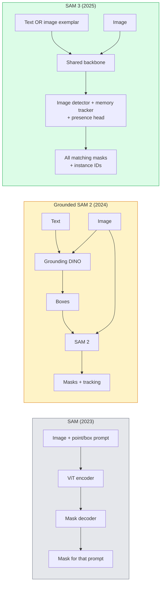

# SAM 3 & Phân đoạn từ vựng mở

> Cung cấp cho model một prompt văn bản và một hình ảnh và nhận mặt nạ cho mọi đối tượng phù hợp. SAM 3 đã biến nó thành một forward pass duy nhất.

**Loại:** Sử dụng + Xây dựng
**Ngôn ngữ:** Python
**Kiến thức tiên quyết:** Giai đoạn 4 Bài 07 (U-Net), Giai đoạn 4 Bài 08 (Mặt nạ R-CNN), Giai đoạn 4 Bài 18 (CLIP)
**Thời lượng:** ~60 phút

## Mục tiêu học tập

- Phân biệt SAM (chỉ prompts trực quan), SAM / SAM 2 nối đất (máy dò + SAM) và SAM 3 (prompts văn bản gốc thông qua Phân đoạn khái niệm có thể nhắc nhở)
- Giải thích kiến trúc SAM 3: đường trục dùng chung + máy dò hình ảnh + trình theo dõi video dựa trên bộ nhớ + đầu hiện diện + thiết kế máy dò tách rời
- Sử dụng tích hợp Hugging Face `transformers` SAM 3 để phát hiện, phân đoạn và theo dõi video theo lời nhắc bằng văn bản
- Chọn giữa SAM 3, Grounded SAM 2, YOLO-World và SAM-MI dựa trên độ trễ, độ phức tạp của khái niệm và mục tiêu triển khai

## Vấn đề

SAM 2023 là một model chỉ prompt hình ảnh: bạn nhấp vào một điểm hoặc vẽ một hộp và nó trả về mặt nạ. Để "đưa cho tôi tất cả các quả cam trong bức ảnh này", bạn cần một máy dò (Grounding DINO) để tạo ra các hộp, sau đó SAM để phân đoạn từng hộp. SAM nối đất đã biến điều này thành một pipeline, nhưng nó là một dòng thác gồm hai models bị đóng băng với sự tích lũy lỗi không thể tránh khỏi.

SAM 3 (Meta, tháng 11 năm 2025, ICLR 2026) đã sụp đổ tầng. Nó chấp nhận một cụm danh từ ngắn hoặc một ví dụ hình ảnh dưới dạng prompt và trả về tất cả các mặt nạ và ID phiên bản phù hợp trong một forward pass duy nhất. Đó là **Phân đoạn khái niệm nhanh chóng (PCS)**. Kết hợp với bản cập nhật Object Multiplex tháng 3 năm 2026 (SAM 3.1), nó theo dõi nhiều phiên bản của cùng một khái niệm thông qua video một cách hiệu quả.

Bài học này nói về sự thay đổi cấu trúc mà điều này đại diện. Phân tích 2D, phát hiện và grounding văn bản-hình ảnh đã merged thành một model. Câu hỏi production không còn là "tôi xâu chuỗi pipeline nào lại với nhau" mà là "model nhanh chóng nào xử lý trường hợp sử dụng của tôi từ đầu đến cuối".

## Khái niệm

### Ba thế hệ



### Phân đoạn khái niệm nhanh chóng

"Khái niệm prompt" là một cụm danh từ ngắn (`"yellow school bus"`, `"striped red umbrella"`, `"hand holding a mug"`) hoặc một hình ảnh ví dụ. model trả về mặt nạ phân đoạn cho mọi phiên bản trong hình ảnh khớp với khái niệm, cộng với một ID phiên bản duy nhất cho mỗi kết quả khớp.

Điều này khác với SAM prompt hình ảnh cổ điển theo ba cách:

1. Không cần prompting cho mỗi phiên bản — một prompt văn bản trả về tất cả các kết quả trùng khớp.
2. Từ vựng mở — khái niệm có thể là bất cứ thứ gì có thể mô tả bằng ngôn ngữ tự nhiên.
3. Trả về nhiều phiên bản cùng một lúc thay vì một mặt nạ mỗi prompt.

### Các công trình kiến trúc chính

- **Xương sống được chia sẻ** — một ViT duy nhất processes hình ảnh. Cả đầu dò và trình theo dõi dựa trên bộ nhớ đều đọc từ nó.
- **Đầu hiện diện** — dự đoán liệu khái niệm có xuất hiện trong hình ảnh hay không. Tách "đây là ở đây?" với "nó ở đâu?". Giảm dương tính giả trên các khái niệm vắng mặt.
- **Máy dò tách rời** — phát hiện mức hình ảnh và theo dõi mức video có các đầu riêng biệt để chúng không gây nhiễu.
- **Ngân hàng bộ nhớ** — lưu trữ features trên mỗi phiên bản trên các khung hình để theo dõi video (cùng một cơ chế mà SAM 2 đã sử dụng).

### Training trên quy mô lớn

SAM 3 được huấn luyện về **4 triệu khái niệm độc đáo** được tạo bởi một công cụ dữ liệu lặp đi lặp lại chú thích và sửa chữa bằng cách sử dụng AI + đánh giá của con người. **SA-CO benchmark** mới chứa 270 nghìn khái niệm độc đáo, lớn hơn 50 lần so với prior benchmarks. SAM 3 đạt 75-80% hiệu suất của con người trên SA-CO và tăng gấp đôi các hệ thống hiện có trên máy tính hình ảnh + video.

### Ghép kênh đối tượng SAM 3.1

Cập nhật tháng 3 năm 2026: **Object Multiplex** giới thiệu cơ chế bộ nhớ dùng chung để theo dõi chung nhiều phiên bản của cùng một khái niệm cùng một lúc. Trước đây, theo dõi N phiên bản có nghĩa là N ngân hàng bộ nhớ riêng biệt. Multiplex thu gọn nó thành một bộ nhớ dùng chung với các truy vấn cho mỗi phiên bản. Kết quả: theo dõi nhiều đối tượng nhanh hơn đáng kể mà không phải hy sinh accuracy.

### Nơi SAM nối đất vẫn quan trọng vào năm 2026

- Khi bạn cần hoán đổi một máy dò từ vựng mở cụ thể (DINO-X, Florence-2).
- Khi giấy phép SAM 3 (được kiểm soát trên HF) là một trình chặn.
- Khi bạn cần kiểm soát nhiều hơn ngưỡng máy dò so với SAM 3 tiếp xúc.
- Đối với công việc nghiên cứu / cắt bỏ trên thành phần máy dò.

Mô-đun pipelines vẫn có một vị trí. Đối với hầu hết các công việc production, SAM 3 là câu trả lời đơn giản hơn.

### YOLO-World so với SAM 3

- **YOLO-World** — chỉ phát hiện từ vựng mở (không đeo khẩu trang). Thời gian thực. Tốt nhất khi bạn cần hộp ở khung hình / giây cao.
- **SAM 3** — phân đoạn đầy đủ + theo dõi. Đầu ra chậm hơn nhưng phong phú hơn.

Production phân tách: YOLO-World cho pipelines chỉ phát hiện nhanh (điều hướng robot, bảng điều khiển nhanh), SAM 3 cho bất kỳ thứ gì cần mặt nạ hoặc theo dõi.

### Hiệu quả SAM-MI

SAM-MI (2025-2026) giải quyết nút thắt cổ chai decoder của SAM. Ý tưởng chính:

- **Điểm thưa thớt prompting **- sử dụng một vài điểm được lựa chọn kỹ lưỡng thay vì prompts dày đặc; Giảm 96% cuộc gọi decoder.
- **Tổng hợp mặt nạ nông** — merges dự đoán mặt nạ thô vào một mặt nạ sắc nét hơn.
- **Tiêm mặt nạ tách rời** — decoder nhận được features mặt nạ được tính toán trước thay vì chạy lại.

Kết quả: Tăng tốc ~1,6× so với Grounded-SAM trên benchmarks từ vựng mở.

### Định dạng đầu ra cho ba models

Tất cả đều trả về cùng một cấu trúc chung (hộp + nhãn + điểm số + mặt nạ + ID), điều này rất hữu ích - pipeline xuôi dòng của bạn không phải branch model chạy trên đó.

## Tự xây dựng

### Bước 1: Prompt thi công

Xây dựng một trình trợ giúp biến câu người dùng thành danh sách các prompts khái niệm SAM 3. Đây là ranh giới mà "những gì người dùng nhập" gặp "những gì model tiêu thụ".

```python
def split_concepts(sentence):
    """
    Heuristic splitter for multi-concept prompts.
    Returns list of short noun phrases.
    """
    for sep in [",", ";", "and", "or", "&"]:
        if sep in sentence:
            parts = [p.strip() for p in sentence.replace("and ", ",").split(",")]
            return [p for p in parts if p]
    return [sentence.strip()]

print(split_concepts("cats, dogs and balloons"))
```

SAM 3 chấp nhận một khái niệm cho mỗi forward pass; Đối với các truy vấn đa khái niệm, hãy lặp lại hoặc batch chúng.

### Bước 2: Trình trợ giúp xử lý hậu kỳ

Biến đầu ra thô của SAM 3 thành một danh sách rõ ràng các phát hiện phù hợp với hợp đồng pipeline Giai đoạn 4 Bài 16 của chúng tôi.

```python
from dataclasses import dataclass
from typing import List

@dataclass
class ConceptDetection:
    concept: str
    instance_id: int
    box: tuple          # (x1, y1, x2, y2)
    score: float
    mask_rle: str       # run-length encoded


def rle_encode(binary_mask):
    flat = binary_mask.flatten().astype("uint8")
    runs = []
    prev, count = flat[0], 0
    for v in flat:
        if v == prev:
            count += 1
        else:
            runs.append((int(prev), count))
            prev, count = v, 1
    runs.append((int(prev), count))
    return ";".join(f"{v}x{c}" for v, c in runs)
```

RLE giữ cho phản hồi payloads nhỏ ngay cả đối với nhiều mặt nạ có độ phân giải cao. Định dạng tương tự hoạt động trên SAM 2, SAM 3, Grounded SAM 2.

### Bước 3: Giao diện phân đoạn từ vựng mở thống nhất

Bao bọc bất kỳ phần phụ trợ nào bạn có (SAM 3, Grounded SAM 2, YOLO-World + SAM 2) đằng sau một phương pháp duy nhất. Mã xuôi dòng của bạn không thay đổi khi chương trình phụ trợ thay đổi.

```python
from abc import ABC, abstractmethod
import numpy as np

class OpenVocabSeg(ABC):
    @abstractmethod
    def detect(self, image: np.ndarray, concept: str) -> List[ConceptDetection]:
        ...


class StubOpenVocabSeg(OpenVocabSeg):
    """
    Deterministic stub used for pipeline testing when real models are not loaded.
    """
    def detect(self, image, concept):
        h, w = image.shape[:2]
        return [
            ConceptDetection(
                concept=concept,
                instance_id=0,
                box=(w * 0.2, h * 0.3, w * 0.5, h * 0.8),
                score=0.89,
                mask_rle="0x100;1x50;0x200",
            ),
            ConceptDetection(
                concept=concept,
                instance_id=1,
                box=(w * 0.55, h * 0.25, w * 0.85, h * 0.75),
                score=0.74,
                mask_rle="0x80;1x40;0x220",
            ),
        ]
```

Lớp con `SAM3OpenVocabSeg` thực sẽ bao bọc `transformers.Sam3Model` và `Sam3Processor`.

### Bước 4: Hugging Face cách sử dụng SAM 3 (tham khảo)

Đối với model thực tế, tích hợp `transformers`:

```python
from transformers import Sam3Processor, Sam3Model
import torch

processor = Sam3Processor.from_pretrained("facebook/sam3")
model = Sam3Model.from_pretrained("facebook/sam3").eval()

inputs = processor(images=pil_image, return_tensors="pt")
inputs = processor.set_text_prompt(inputs, "yellow school bus")

with torch.no_grad():
    outputs = model(**inputs)

masks = processor.post_process_masks(
    outputs.masks, inputs.original_sizes, inputs.reshaped_input_sizes
)
boxes = outputs.boxes
scores = outputs.scores
```

Một prompt, tất cả các kết quả trùng khớp được trả về trong một cuộc gọi.

### Bước 5: Đo lường những gì Grounded SAM 2 cung cấp cho bạn miễn phí

Một benchmark trung thực: điều gì sẽ xảy ra khi bạn thay thế Grounded SAM 2 bằng SAM 3 trong một pipeline thực sự?

- Độ trễ: SAM 3 tiết kiệm một forward pass (không có máy dò riêng biệt) nhưng bản thân model nặng hơn; thường là trung lập mạng hoặc tăng tốc một chút.
- Accuracy: SAM 3 tốt hơn đáng kể về các khái niệm hiếm hoặc sáng tác ("ô sọc đỏ "). Tương tự về các khái niệm một từ phổ biến.
- Tính linh hoạt: SAM 2 nối đất cho phép bạn hoán đổi máy dò (DINO-X, Florence-2, Grounding DINO 1.5); SAM 3 là nguyên khối.

Kết luận: SAM 3 là mặc định cho seg từ vựng mở năm 2026. SAM 2 nối đất vẫn là câu trả lời đúng khi bạn cần sự linh hoạt của máy dò hoặc các điều khoản cấp phép khác nhau.

## Ứng dụng

Production mẫu triển khai:

- **Chú thích thời gian thực** — Nhãn dưới dạng văn bản prompt feature của SAM 3 + CVAT. Người chú thích chọn tên nhãn; SAM 3 gắn nhãn trước mọi phiên bản phù hợp. Xem lại và sửa chữa.
- **Phân tích video** — SAM 3.1 Object Multiplex để theo dõi nhiều đối tượng; nạp khung hình vào trình theo dõi dựa trên bộ nhớ.
- **Robotics** — SAM 3 để thao tác từ vựng mở ("nhặt cốc đỏ"); chạy như một primitive lập kế hoạch.
- **Hình ảnh y tế** — SAM 3 fine-tuned về các khái niệm y tế; yêu cầu yêu cầu truy cập trên HF.

Ultralytics bao bọc SAM 3 trong gói Python của nó:

```python
from ultralytics import SAM

model = SAM("sam3.pt")
results = model(image_path, prompts="yellow school bus")
```

Giao diện tương tự như YOLO và SAM 2.

## Sản phẩm bàn giao

Bài học này tạo ra:

- `outputs/prompt-open-vocab-stack-picker.md` — một prompt chọn SAM 3 / Grounded SAM 2 / YOLO-World / SAM-MI dựa trên độ trễ, độ phức tạp của khái niệm và cấp phép.
- `outputs/skill-concept-prompt-designer.md` — một skill biến lời nói của người dùng thành prompts khái niệm SAM 3 được định dạng tốt (tách, định hướng, dự phòng).

## Bài tập

1. **(Dễ dàng)** Chạy SAM 3 trên 10 hình ảnh với ý tưởng prompts bạn chọn. So sánh với SAM 2 + Grounding DINO 1.5 trên cùng một hình ảnh. Báo cáo những khái niệm mà mỗi model đã bỏ sót.
2. **(Trung bình)** Xây dựng giao diện người dùng "nhấp để bao gồm / nhấp để loại trừ" trên SAM 3: văn bản prompt trả về các phiên bản ứng viên; Nhấp chuột của người dùng giữ cho nhấp chuột nào được tính là tích cực. Xuất ra bộ khái niệm cuối cùng là JSON.
3. **(Cứng)** Fine-tune SAM 3 trên một bộ khái niệm tùy chỉnh (ví dụ: 5 loại linh kiện điện tử) với 20 hình ảnh được dán nhãn. So sánh với zero-shot SAM 3 trên cùng một bộ thử nghiệm; đo lường cải thiện IoU mặt nạ.

## Thuật ngữ chính

| Thuật ngữ | Những gì mọi người nói | Ý nghĩa thực sự của nó |
|------|----------------|----------------------|
| Phân đoạn từ vựng mở | "Phân đoạn theo văn bản" | Tạo mặt nạ cho các đối tượng được mô tả bằng ngôn ngữ tự nhiên, không phải bộ nhãn cố định |
| CÁI | "Phân đoạn khái niệm nhanh chóng" | Nhiệm vụ cốt lõi của SAM 3 — với một cụm danh từ hoặc ví dụ hình ảnh, hãy phân đoạn tất cả các trường hợp phù hợp |
| Khái niệm prompt | "Đầu vào văn bản" | Cụm danh từ ngắn hoặc hình ảnh ví dụ; không phải là một câu đầy đủ |
| Đầu hiện diện | "Nó có ở đây không?" | Mô-đun SAM 3 quyết định xem khái niệm có tồn tại trong hình ảnh hay không trước khi bản địa hóa |
| SA-CO | "SAM 3 benchmark" | benchmark phân đoạn từ vựng mở khái niệm 270K; Lớn hơn 50 lần so với prior benchmarks từ vựng mở |
| Đối tượng Multiplex | "Cập nhật SAM 3.1" | Theo dõi nhiều đối tượng bộ nhớ chia sẻ; Theo dõi chung nhanh chóng của nhiều trường hợp |
| SAM 2 nối đất | "pipeline mô-đun" | Máy dò + SAM 2 tầng; vẫn phù hợp khi hoán đổi máy dò quan trọng |
| SAM-MI | "Biến thể SAM hiệu quả" | Tiêm mặt nạ để tăng tốc gấp 1,6 lần so với Grounded-SAM |

## Đọc thêm

- [SAM 3: Segment Anything with Concepts (arXiv 2511.16719)](https://arxiv.org/abs/2511.16719)
- [SAM 3.1 Object Multiplex (Meta AI, March 2026)](https://ai.meta.com/blog/segment-anything-model-3/)
- [SAM 3 model page on Hugging Face](https://huggingface.co/facebook/sam3)
- [Grounded SAM 2 tutorial (PyImageSearch)](https://pyimagesearch.com/2026/01/19/grounded-sam-2-from-open-set-detection-to-segmentation-and-tracking/)
- [Ultralytics SAM 3 docs](https://docs.ultralytics.com/models/sam-3/)
- [SAM3-I: Instruction-aware SAM (arXiv 2512.04585)](https://arxiv.org/abs/2512.04585)
