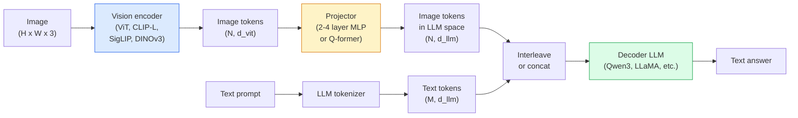

# Vision-Language Models - Mẫu ViT-MLP-LLM

> Tầm nhìn encoder chuyển đổi hình ảnh thành tokens. Máy chiếu MLP ánh xạ những tokens đó vào không gian embedding của LLM. Một ngôn ngữ model thực hiện rest. Mô hình đó - ViT-MLP-LLM - là mọi production VLM vào năm 2026.

**Loại:** Tìm hiểu + Sử dụng
**Ngôn ngữ:** Python
**Kiến thức tiên quyết:** Giai đoạn 4 Bài 14 (ViT), Giai đoạn 4 Bài 18 (CLIP), Giai đoạn 7 Bài 02 (Self-Attention)
**Thời lượng:** ~75 phút

## Mục tiêu học tập

- Nêu kiến trúc ViT-MLP-LLM và giải thích những gì mỗi thành phần trong số ba thành phần đóng góp
- So sánh Qwen3-VL, InternVL3.5, LLaVA-Next và GLM-4.6V về số lượng parameter, độ dài ngữ cảnh và hiệu suất benchmark
- Giải thích DeepStack: tại sao features ViT đa cấp thắt chặt ngôn ngữ tầm nhìn alignment tốt hơn so với một feature lớp cuối cùng
- Đo ảo giác VLM trong production với Tỷ lệ lỗi phương thức chéo (CMER) và tác động theo tín hiệu

## Vấn đề

CLIP (Giai đoạn 4 Bài 18) cung cấp cho bạn một không gian embedding dùng chung cho hình ảnh và văn bản, đủ để phân loại và truy xuất zero-shot. Nó không thể trả lời "có bao nhiêu chiếc xe màu đỏ trong hình ảnh này?" vì CLIP không tạo ra văn bản - nó chỉ ghi điểm tương đồng.

Vision-Language Models (VLMs) — Qwen3-VL, InternVL3.5, LLaVA-Next, GLM-4.6V — bắt vít hình ảnh họ CLIP encoder thành một model ngôn ngữ đầy đủ. model nhìn thấy một hình ảnh cộng với một câu hỏi và tạo ra câu trả lời. Vào năm 2026, VLMs mã nguồn mở cạnh tranh hoặc đánh bại GPT-5 và Gemini-2.5-Pro trên benchmarks đa phương thức (MMMU, MMBench, DocVQA, ChartQA, MathVista, OSWorld).

Bộ ba mảnh (ViT, máy chiếu, LLM) là tiêu chuẩn. Sự khác biệt giữa models là ViT nào, máy chiếu nào, LLM nào, dữ liệu training và công thức alignment. Một khi bạn hiểu mẫu, việc hoán đổi bất kỳ thành phần nào là máy móc.

## Khái niệm

### Kiến trúc ViT-MLP-LLM



1. **Vision encoder** — một biến thể pretrained ViT (CLIP-L/14, SigLIP, DINOv3 hoặc fine-tuned). Sản xuất tokens vá.
2. **Máy chiếu** — một mô-đun nhỏ (MLP 2-4 lớp, hoặc Q-former) ánh xạ tầm nhìn tokens vào kích thước embedding của LLM. Đây là nơi hầu hết các fine-tuning xảy ra.
3. **LLM** — một model ngôn ngữ chỉ dành cho decoder (Qwen3, Llama, Mistral, GLM, InternLM). Đọc tokens thị giác + văn bản theo trình tự, tạo văn bản.

Cả ba tác phẩm đều có thể huấn luyện được về nguyên tắc. Trong thực tế, tầm nhìn encoder và LLM hầu như bị đóng băng trong khi máy chiếu hoạt động - vài tỷ parameters tín hiệu với giá rẻ.

### Ngăn xếp sâu

Phép chiếu vani chỉ sử dụng lớp ViT cuối cùng. Các mẫu DeepStack (Qwen3-VL) features từ nhiều độ sâu ViT và stacks chúng. Các lớp sâu hơn mang ngữ nghĩa cấp cao; Các lớp nông hơn mang thông tin không gian và kết cấu chi tiết. Đưa cả hai vào LLM thu hẹp khoảng cách giữa "hình ảnh chứa gì" (ngữ nghĩa) và "chính xác ở đâu" (grounding không gian).

### Ba giai đoạn training

Huấn luyện VLMs hiện đại theo từng giai đoạn:

1. **Alignment** - đóng băng ViT và LLM. Chỉ huấn luyện máy chiếu về các cặp chú thích hình ảnh. Dạy máy chiếu ánh xạ không gian tầm nhìn vào không gian ngôn ngữ.
2. **training trước **- giải phóng mọi thứ. Huấn luyện dữ liệu văn bản hình ảnh xen kẽ quy mô lớn (500 triệu + cặp). Xây dựng kiến thức trực quan của model.
3. **Điều chỉnh hướng dẫn** — fine-tune trên bộ ba (hình ảnh, câu hỏi, câu trả lời) được tuyển chọn. Dạy hành vi đàm thoại và định dạng nhiệm vụ. Đây là điều biến "LM nhận biết thị giác" thành một trợ lý có thể sử dụng được.

Hầu hết các LoRA tinh chỉnh nhắm mục tiêu vào giai đoạn 3 với một dataset nhỏ được dán nhãn.

### So sánh gia đình Model (đầu năm 2026)

| Model | Tham số | Tầm nhìn encoder | LLM | Bối cảnh | Điểm mạnh |
|-------|--------|----------------|-----|---------|-----------|
| Qwen3-VL-235B-A22B (MoE) | 235 tỷ (22 tỷ đang hoạt động) | ViT + DeepStack tùy chỉnh | Câu 3 | 256 nghìn | Tướng SOTA, GUI agent |
| Qwen3-VL-30B-A3B (MoE) | 30B (3B hoạt động) | ViT + DeepStack tùy chỉnh | Câu 3 | 256 nghìn | Thay thế MoE nhỏ hơn |
| Qwen3-VL-8B (dày đặc) | 8 tỷ | ViT tùy chỉnh | Câu 3 | 128 nghìn | Production mặc định dày đặc |
| Thực tậpVL3.5-38B | 38 tỷ | Thực tập sinhViT-6B | Qwen3 + GPT-OSS | 128 nghìn | MMBench / MMVet mạnh mẽ |
| Thực tậpVL3.5-241B-A28B | 241B (28B đang hoạt động) | Thực tập sinhViT-6B | Câu 3 | 128 nghìn | Cạnh tranh với GPT-4o |
| LLaVA-Tiếp theo 72B | 72 tỷ | SigLIP | Llama-3 · | 32 nghìn | Mở, dễ fine-tune |
| GLM-4.6V | ~70 tỷ | tùy chỉnh | Ánh sáng GLM | 64 nghìn | Mã nguồn mở, OCR mạnh mẽ |
| MiniCPM-V-2.6 | 8 tỷ | SigLIP | CPM tối thiểu | 32 nghìn | Thân thiện với cạnh |

### agents trực quan

Qwen3-VL-235B đạt hiệu suất toàn cầu hàng đầu trên OSWorld - một benchmark dành cho **agents trực quan** vận hành GUI (máy tính để bàn, thiết bị di động, web). model nhìn thấy ảnh chụp màn hình, hiểu giao diện người dùng và phát ra các hành động (nhấp, nhập, cuộn). Kết hợp với các công cụ, nó đóng vòng lặp trên các tác vụ máy tính để bàn phổ biến. Đây là những gì hầu hết các bản demo "AI PC" năm 2026 chạy dưới mui xe.

### Khả năng Agentic + các biến thể RoPE

VLMs cần biết **khi **một khung hình có trong video. Qwen3-VL phát triển từ T-RoPE (vị trí quay thời gian embeddings) thành **alignment thời gian dựa trên văn bản** — văn bản dấu thời gian rõ ràng tokens xen kẽ với các khung video. Người model nhìn thấy "`<timestamp 00:32>` khung, prompt" và có thể lý luận về các mối quan hệ thời gian.

### Vấn đề alignment

12% cặp hình ảnh-văn bản trong một dataset được thu thập dữ liệu chứa nội dung mô tả không hoàn toàn dựa trên hình ảnh. Một VLM được huấn luyện về điều này âm thầm học cách ảo giác - tạo ra đồ vật, đọc sai các con số, phát minh ra các mối quan hệ. Trong production đây là chế độ thất bại chủ đạo.

Skywork.ai đã giới thiệu **Tỷ lệ lỗi phương thức chéo (CMER)** để theo dõi nó:

```
CMER = fraction of outputs where the text confidence is high but the image-text similarity (via a CLIP-family checker) is low
```

CMER cao có nghĩa là model tự tin nói những điều không có cơ sở trong hình ảnh. Giám sát CMER và coi nó như một KPI production giúp giảm tỷ lệ ảo giác ~35% trong quá trình triển khai của họ. Bí quyết không phải là "sửa model" mà là "định tuyến đầu ra CMER cao đến đánh giá của con người".

### Fine-tuning với LoRA / QLoRA

Toàn bộ fine-tuning của VLM 70B nằm ngoài tầm với của hầu hết các đội. LoRA (xếp hạng 16-64) trên các lớp máy chiếu attention + hoặc QLoRA có trọng lượng cơ sở 4 bit, phù hợp với một A100 / H100 duy nhất. Chi phí: 5.000-50.000 ví dụ, $100-$5.000 trong điện toán, 2-10 giờ training.

### Lý luận không gian còn yếu

VLMs hiện tại đạt 50-60% về benchmarks suy luận không gian (trên-dưới, trái-phải, đếm, khoảng cách). Nếu trường hợp sử dụng của bạn phụ thuộc vào "đối tượng nào nằm trên đối tượng nào", hãy xác thực nhiều - hiệu suất chung VLM thấp hơn con người. Các lựa chọn thay thế tốt hơn VLM cho các tác vụ không gian thuần túy: công cụ ước tính điểm chính / tư thế chuyên dụng, model độ sâu hoặc model phát hiện với hình dạng hộp được xử lý hậu kỳ.

## Tự xây dựng

### Bước 1: Máy chiếu

Phần bạn sẽ tập luyện thường xuyên nhất. MLP 2-4 lớp với GELU.

```python
import torch
import torch.nn as nn


class Projector(nn.Module):
    def __init__(self, vit_dim=768, llm_dim=4096, hidden=4096):
        super().__init__()
        self.net = nn.Sequential(
            nn.Linear(vit_dim, hidden),
            nn.GELU(),
            nn.Linear(hidden, llm_dim),
        )

    def forward(self, x):
        return self.net(x)
```

Đầu vào là một `(N_patches, d_vit)` token tensor. Đầu ra là `(N_patches, d_llm)`. LLM coi mọi hàng đầu ra chỉ là một token khác.

### Bước 2: Lắp ráp ViT-MLP-LLM đầu cuối

Bộ xương của forward pass cho một VLM tối thiểu. Mã thực sử dụng `transformers`; Đây là bố cục khái niệm.

```python
class MinimalVLM(nn.Module):
    def __init__(self, vit, projector, llm, image_token_id):
        super().__init__()
        self.vit = vit
        self.projector = projector
        self.llm = llm
        self.image_token_id = image_token_id  # placeholder token in text prompt

    def forward(self, image, input_ids, attention_mask):
        # 1. vision features
        vision_tokens = self.vit(image)                     # (B, N_patches, d_vit)
        vision_embeds = self.projector(vision_tokens)       # (B, N_patches, d_llm)

        # 2. text embeddings
        text_embeds = self.llm.get_input_embeddings()(input_ids)  # (B, M, d_llm)

        # 3. replace image placeholder tokens with vision embeds
        merged = self._merge(text_embeds, vision_embeds, input_ids)

        # 4. run LLM
        return self.llm(inputs_embeds=merged, attention_mask=attention_mask)

    def _merge(self, text_embeds, vision_embeds, input_ids):
        out = text_embeds.clone()
        expected = vision_embeds.size(1)
        for b in range(input_ids.size(0)):
            positions = (input_ids[b] == self.image_token_id).nonzero(as_tuple=True)[0]
            if len(positions) != expected:
                raise ValueError(
                    f"batch item {b} has {len(positions)} image tokens but vision_embeds has {expected} patches."
                    " Every sample in the batch must be pre-padded to the same number of image placeholder tokens.")
            out[b, positions] = vision_embeds[b]
        return out
```

token giữ chỗ `<image>` trong văn bản được thay thế bằng embeddings hình ảnh thực — cùng một mẫu LLaVA, Qwen-VL và InternVL sử dụng.

### Bước 3: Tính toán CMER

Một kiểm tra runtime nhẹ.

```python
import torch.nn.functional as F


def cross_modal_error_rate(image_emb, text_emb, text_confidence, sim_threshold=0.25, conf_threshold=0.8):
    """
    image_emb, text_emb: embeddings of image and generated text (normalised internally)
    text_confidence:     mean per-token probability in [0, 1]
    Returns:             fraction of high-confidence outputs with low image-text alignment
    """
    image_emb = F.normalize(image_emb, dim=-1)
    text_emb = F.normalize(text_emb, dim=-1)
    sim = (image_emb * text_emb).sum(dim=-1)        # cosine similarity
    high_conf_low_sim = (text_confidence > conf_threshold) & (sim < sim_threshold)
    return high_conf_low_sim.float().mean().item()
```

Coi CMER như một KPI production. Giám sát nó theo endpoint, mỗi loại prompt, mỗi khách hàng. CMER tăng cho thấy model đang bắt đầu ảo giác về một số phân phối đầu vào.

### Bước 4: Bộ phân loại VLM đồ chơi (có thể chạy)

Trình diễn các đoàn tàu máy chiếu. "ViT features" giả mạo đi vào; Một token kiểu LLM nhỏ dự đoán một class.

```python
class ToyVLM(nn.Module):
    def __init__(self, vit_dim=32, llm_dim=64, num_classes=5):
        super().__init__()
        self.projector = Projector(vit_dim, llm_dim, hidden=64)
        self.head = nn.Linear(llm_dim, num_classes)

    def forward(self, vision_tokens):
        projected = self.projector(vision_tokens)
        pooled = projected.mean(dim=1)
        return self.head(pooled)
```

Người ta có thể lắp điều này trên các cặp tổng hợp (feature, class) dưới 200 bước - đủ để hiển thị hoạt động của mẫu máy chiếu.

## Ứng dụng

Ba cách production đội sử dụng VLMs vào năm 2026:

- **Được lưu trữ API** — OpenAI Vision, Anthropic Claude Vision, Google Gemini Vision. Không có cơ sở hạ tầng, rủi ro nhà cung cấp.
- **Tự lưu trữ mã nguồn mở **- Qwen3-VL hoặc InternVL3.5 thông qua `transformers` và `vllm`. Kiểm soát hoàn toàn, nỗ lực trước cao hơn.
- **Fine-tune trên miền** — tải Qwen2.5-VL-7B hoặc LLaVA-1.6-7B, LoRA trên các ví dụ tùy chỉnh 5k-50k, phân phát với `vllm` hoặc `TGI`.

```python
from transformers import AutoProcessor, AutoModelForVision2Seq
import torch
from PIL import Image

model_id = "Qwen/Qwen3-VL-8B-Instruct"
processor = AutoProcessor.from_pretrained(model_id)
model = AutoModelForVision2Seq.from_pretrained(model_id, torch_dtype=torch.bfloat16, device_map="auto")

messages = [{
    "role": "user",
    "content": [
        {"type": "image", "image": Image.open("plot.png")},
        {"type": "text", "text": "What does this chart show?"},
    ],
}]
inputs = processor.apply_chat_template(messages, add_generation_prompt=True, tokenize=True, return_dict=True, return_tensors="pt").to("cuda")
generated = model.generate(**inputs, max_new_tokens=256)
answer = processor.decode(generated[0][inputs["input_ids"].shape[1]:], skip_special_tokens=True)
```

`apply_chat_template` ẩn mã hóa trình giữ chỗ `<image>`; model xử lý merge bên trong.

## Sản phẩm bàn giao

Bài học này tạo ra:

- `outputs/prompt-vlm-selector.md` - chọn Qwen3-VL / InternVL3.5 / LLaVA-Next / API với accuracy, độ trễ, độ dài ngữ cảnh và ngân sách.
- `outputs/skill-cmer-monitor.md` - phát ra mã để đo lường một production VLM endpoint với tỷ lệ lỗi đa phương thức, bảng điều khiển trên mỗi endpoint và ngưỡng cảnh báo.

## Bài tập

1. **(Dễ)** Chạy ba prompts ("đây là gì?", "đếm đối tượng", "mô tả cảnh") thông qua bất kỳ VLM mở nào trên năm hình ảnh. Chấm mỗi câu trả lời là đúng / đúng một phần / ảo giác bằng tay. Tính toán tỷ lệ giống như CMER lần đầu tiên.
2. **(Trung bình)** Fine-tune Qwen2.5-VL-3B hoặc LLaVA-1.6-7B với LoRA (hạng 16) trên 500 hình ảnh của một miền mục tiêu có chú thích. So sánh zero-shot và fine-tuned accuracy kiểu MMBench.
3. **(Cứng) **Thay thế encoder hình ảnh của VLM bằng DINOv3 thay vì mặc định SigLIP/CLIP. Chỉ huấn luyện lại máy chiếu (LLM đông lạnh + DINOv3 bị đóng băng). Đo lường xem các nhiệm vụ dự đoán mật độ cao (đếm, suy luận không gian) có cải thiện hay không.

## Thuật ngữ chính

| Thuật ngữ | Những gì mọi người nói | Ý nghĩa thực sự của nó |
|------|----------------|----------------------|
| ViT-MLP-LLM | "Mô hình VLM" | Vision encoder + máy chiếu + ngôn ngữ model; mỗi năm 2026 VLM |
| Máy chiếu | "Cây cầu" | MLP 2-4 lớp (hoặc Q-former) ánh xạ tầm nhìn tokens vào không gian LLM embedding |
| Ngăn xếp sâu | "Thủ thuật feature Qwen3-VL" | ViT đa cấp features xếp chồng lên nhau thay vì chỉ lớp cuối cùng |
| Hình ảnh token | "<image> Trình giữ chỗ" | token đặc biệt trong luồng văn bản được thay thế bằng embeddings tầm nhìn dự kiến |
| CMER | "KPI ảo giác" | Tỷ lệ lỗi đa phương thức; Cao khi độ tin cậy của văn bản cao nhưng độ giống nhau giữa hình ảnh và văn bản thấp |
| agent trực quan | "VLM nhấp chuột" | VLM GUI hoạt động (OSWorld, mobile, web) với các lệnh gọi công cụ |
| Q-trước đây | "Cầu token đếm cố định" | Máy chiếu kiểu BLIP-2 tạo ra một số lượng truy vấn trực quan cố định tokens |
| Điều chỉnh Alignment / training trước / hướng dẫn | "Ba giai đoạn" | VLM training pipeline tiêu chuẩn |

## Đọc thêm

- [Qwen3-VL Technical Report (arXiv 2511.21631)](https://arxiv.org/abs/2511.21631)
- [InternVL3.5 Advancing Open-Source Multimodal Models (arXiv 2508.18265)](https://arxiv.org/html/2508.18265v1)
- [LLaVA-Next series](https://llava-vl.github.io/blog/2024-05-10-llava-next-stronger-llms/)
- [BentoML: Best Open-Source VLMs 2026](https://www.bentoml.com/blog/multimodal-ai-a-guide-to-open-source-vision-language-models)
- [MMMU: Multi-discipline Multimodal Understanding benchmark](https://mmmu-benchmark.github.io/)
- [VLMs in manufacturing (Robotics Tomorrow, March 2026)](https://www.roboticstomorrow.com/story/2026/03/when-machines-learn-to-see-like-experts-the-rise-of-vision-language-models-in-manufacturing/26335/)
