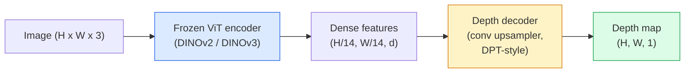

# Ước tính độ sâu và hình học một mắt

> Bản đồ độ sâu là hình ảnh một kênh trong đó mỗi pixel cách máy ảnh một khoảng cách. Dự đoán nó từ một khung RGB từng là không thể nếu không có âm thanh nổi hoặc LiDAR. Vào năm 2026, một encoder ViT đông lạnh cộng với một đầu nhẹ nằm trong vòng vài phần trăm ground truth.

**Loại:** Xây dựng + Sử dụng
**Ngôn ngữ:** Python
**Kiến thức tiên quyết:** Giai đoạn 4 Bài 14 (ViT), Giai đoạn 4 Bài 17 (Thị giác tự giám sát), Giai đoạn 4 Bài 07 (U-Net)
**Thời lượng:** ~60 phút

## Mục tiêu học tập

- Phân biệt độ sâu tương đối và hệ mét và trạng thái mà mỗi production model (MiDaS, Marigold, Depth Anything V3, ZoeDepth) giải quyết
- Sử dụng Depth Anything V3 (đường trục DINOv2) để dự đoán độ sâu cho các hình ảnh đơn lẻ tùy ý mà không cần hiệu chuẩn
- Giải thích lý do tại sao độ sâu một mắt hoạt động từ một hình ảnh duy nhất (tín hiệu phối cảnh, gradients kết cấu, priors đã học) và những gì nó không thể phục hồi (tỷ lệ tuyệt đối, hình học bị che khuất)
- Nâng phát hiện 2D lên các điểm 3D bằng bản đồ độ sâu và nội tại camera lỗ kim

## Vấn đề

Độ sâu là trục còn thiếu trong thị giác máy tính 2D. Với RGB, bạn biết mọi thứ xuất hiện ở đâu trong mặt phẳng hình ảnh; bạn không biết chúng ở bao xa. Cảm biến độ sâu (giàn âm thanh nổi, LiDAR, thời gian bay) giải quyết vấn đề này trực tiếp nhưng đắt tiền, dễ vỡ và phạm vi hạn chế.

Ước tính độ sâu một mắt - dự đoán độ sâu từ một khung RGB duy nhất - được sử dụng để tạo ra đầu ra mờ, không đáng tin cậy. Đến năm 2026, pretrained encoders lớn đã thay đổi điều đó: Depth Anything V3 sử dụng đường trục DINOv2 đông lạnh và tạo ra các bản đồ độ sâu khái quát hóa trên các lĩnh vực trong nhà, ngoài trời, y tế và vệ tinh. Cúc vạn thọ định hình lại độ sâu như một vấn đề khuếch tán có điều kiện. ZoeDepth thoái lui khoảng cách hệ mét thực.

Độ sâu cũng là cầu nối giữa phát hiện 2D và hiểu 3D: nhân các pixel của hộp được phát hiện với độ sâu và bạn nâng đối tượng 2D vào cloud điểm 3D. Đó là cốt lõi của mọi hệ thống che giấu AR, mọi pipeline tránh chướng ngại vật và mọi robot "nhặt cốc".

## Khái niệm

### Độ sâu tương đối so với số liệu

- **Độ sâu tương đối** — các giá trị `z` được sắp xếp theo thứ tự mà không có đơn vị trong thế giới thực. "Pixel A gần hơn pixel B, nhưng tỷ lệ khoảng cách không được neo với mét."
- **Độ sâu hệ mét** — khoảng cách tuyệt đối tính bằng mét từ máy ảnh. Yêu cầu model phải học được mối quan hệ thống kê giữa các tín hiệu hình ảnh và khoảng cách thực.

MiDaS và Depth Anything V3 tạo ra độ sâu tương đối. Cúc vạn thọ tạo ra độ sâu tương đối. ZoeDepth, UniDepth và Metric3D tạo ra độ sâu hệ mét. models hệ mét nhạy cảm với nội tại của máy ảnh; models tương đối thì không.

### Mô hình encoder-decoder



Depth Anything V3 đóng băng encoder và chỉ huấn luyện decoder kiểu DPT. encoder cung cấp features phong phú; decoder nội suy chúng trở lại độ phân giải hình ảnh và thoái lui độ sâu.

### Tại sao một hình ảnh duy nhất tạo ra chiều sâu

Hình ảnh 2D chứa nhiều tín hiệu một mắt tương quan với độ sâu:

- **Phối cảnh** - các đường song song trong 3D hội tụ trong 2D.
- **Kết cấu gradient **- bề mặt ở xa có kết cấu nhỏ hơn, dày đặc hơn.
- **Thứ tự tắc nghẽn** — các vật thể gần hơn che khuất những vật thể xa hơn.
- **Kích thước không ổn định **- các đối tượng đã biết (ô tô, con người) cho tỷ lệ gần đúng.
- **Phối cảnh khí quyển** — các vật thể ở xa xuất hiện mờ hơn và xanh hơn trong các cảnh ngoài trời.

Một ViT được huấn luyện trên hàng tỷ hình ảnh nội bộ các tín hiệu này. Với đủ dữ liệu và xương sống mạnh mẽ, độ sâu một mắt đạt được accuracy hợp lý mà không cần bất kỳ sự giám sát 3D rõ ràng nào.

### Những gì độ sâu một mắt không thể làm được

- **Thang đo hệ mét tuyệt đối** không có nội tại hoặc đối tượng đã biết trong cảnh. Mạng có thể dự đoán "chiếc cốc cách gấp đôi chiếc thìa" mà không cần biết chiếc cốc cách xa 1 m hay 10 m.
- **Hình học bị che khuất** — lưng ghế không thể nhìn thấy và không thể suy ra một cách đáng tin cậy.
- **Bề mặt thực sự không có kết cấu / phản chiếu** - gương, kính, tường đồng nhất. Mạng báo cáo độ sâu hợp lý nhưng sai.

### Depth Anything V3 vào năm 2026

- Vanilla DINOv2 ViT-L/14 như encoder (đông lạnh).
- DPT decoder.
- Được huấn luyện về các cặp hình ảnh tạo dáng từ nhiều nguồn khác nhau (không cần giám sát độ sâu rõ ràng ngoài tính nhất quán trắc quang).
- Dự đoán hình học nhất quán về mặt không gian từ **một số lượng đầu vào hình ảnh tùy ý, có hoặc không có tư thế máy ảnh đã biết**.
- SOTA trên độ sâu một mắt, hình học mọi chế độ xem, kết xuất hình ảnh, ước tính tư thế máy ảnh.

Đây là model thả vào để gọi khi bạn cần chiều sâu vào năm 2026.

### Cúc vạn thọ - khuếch tán cho chiều sâu

Marigold (Ke và cộng sự, CVPR 2024) định hình lại ước tính độ sâu dưới dạng khuếch tán hình ảnh có điều kiện. Điều hòa: RGB. Mục tiêu: bản đồ độ sâu. Sử dụng pretrained Stable Diffusion 2 U-Net làm xương sống. Bản đồ độ sâu đầu ra đặc biệt sắc nét ở ranh giới đối tượng. Đánh đổi: inference chậm hơn so với models chuyển tiếp (10-50 bước khử nhiễu).

### Nội tại và máy ảnh lỗ kim

Để nâng `(u, v)` pixel có độ sâu `d` đến điểm 3D `(X, Y, Z)` trong tọa độ máy ảnh:

```
fx, fy, cx, cy = camera intrinsics
X = (u - cx) * d / fx
Y = (v - cy) * d / fy
Z = d
```

Nội tại đến từ siêu dữ liệu EXIF, mẫu hiệu chuẩn hoặc công cụ ước tính nội tại một mắt (Trường phối cảnh, UniDepth). Nếu không có nội tại, bạn vẫn có thể hiển thị một điểm cloud bằng cách giả định FOV 60-70 ° và các nguyên tắc có độ phân giải trung bình - có thể sử dụng để trực quan hóa chứ không phải để đo lường.

### Đánh giá

Hai chỉ số tiêu chuẩn:

- **AbsRel** (sai số tương đối tuyệt đối): `mean(|d_pred - d_gt| / d_gt)`. Thấp hơn là tốt hơn. 0,05-0,1 cho production models.
- **Delta < 1,25 **(ngưỡng accuracy): Phần pixel `max(d_pred/d_gt, d_gt/d_pred) < 1.25`. Cao hơn là tốt hơn. 0.9+ cho SOTA.

Đối với độ sâu tương đối (Depth Anything V3, MiDaS), đánh giá sử dụng các phiên bản bất biến theo tỷ lệ và dịch chuyển của cả hai chỉ số.

## Tự xây dựng

### Bước 1: Chỉ số độ sâu

```python
import torch

def abs_rel_error(pred, target, mask=None):
    if mask is not None:
        pred = pred[mask]
        target = target[mask]
    return (torch.abs(pred - target) / target.clamp(min=1e-6)).mean().item()


def delta_accuracy(pred, target, threshold=1.25, mask=None):
    if mask is not None:
        pred = pred[mask]
        target = target[mask]
    ratio = torch.maximum(pred / target.clamp(min=1e-6), target / pred.clamp(min=1e-6))
    return (ratio < threshold).float().mean().item()
```

Luôn che các pixel độ sâu không hợp lệ (không, NaN, bão hòa) trước khi đánh giá.

### Bước 2: Mở rộng quy mô và dịch chuyển alignment

Đối với models độ sâu tương đối, hãy căn chỉnh dự đoán theo ground truth trước khi tính toán chỉ số. Phù hợp bình phương nhỏ nhất của `a * pred + b = target`:

```python
def align_scale_shift(pred, target, mask=None):
    if mask is not None:
        p = pred[mask]
        t = target[mask]
    else:
        p = pred.flatten()
        t = target.flatten()
    A = torch.stack([p, torch.ones_like(p)], dim=1)
    coeffs, *_ = torch.linalg.lstsq(A, t.unsqueeze(-1))
    a, b = coeffs[:2, 0]
    return a * pred + b
```

Chạy `align_scale_shift` trước `abs_rel_error` khi đánh giá MiDaS / Depth Anything.

### Bước 3: Nâng độ sâu đến một điểm cloud

```python
import numpy as np

def depth_to_point_cloud(depth, intrinsics):
    H, W = depth.shape
    fx, fy, cx, cy = intrinsics
    v, u = np.meshgrid(np.arange(H), np.arange(W), indexing="ij")
    z = depth
    x = (u - cx) * z / fx
    y = (v - cy) * z / fy
    return np.stack([x, y, z], axis=-1)


depth = np.random.uniform(0.5, 4.0, (240, 320))
intr = (320.0, 320.0, 160.0, 120.0)
pc = depth_to_point_cloud(depth, intr)
print(f"point cloud shape: {pc.shape}  (H, W, 3)")
```

Một chức năng, mọi ứng dụng nâng 3D. Xuất điểm cloud sang `.ply` và mở trong MeshLab hoặc CloudCompare.

### Bước 4: Kiểm tra khói với cảnh độ sâu tổng hợp

```python
def synthetic_depth(size=96):
    yy, xx = np.meshgrid(np.arange(size), np.arange(size), indexing="ij")
    # Floor: linear gradient from near (top) to far (bottom)
    depth = 1.0 + (yy / size) * 4.0
    # Box in the middle: closer
    mask = (np.abs(xx - size / 2) < size / 6) & (np.abs(yy - size * 0.6) < size / 6)
    depth[mask] = 2.0
    return depth.astype(np.float32)


gt = torch.from_numpy(synthetic_depth(96))
pred = gt + 0.3 * torch.randn_like(gt)  # simulated prediction
aligned = align_scale_shift(pred, gt)
print(f"before align  absRel = {abs_rel_error(pred, gt):.3f}")
print(f"after align   absRel = {abs_rel_error(aligned, gt):.3f}")
```

### Bước 5: Sử dụng Depth Anything V3 (tham khảo)

```python
import torch
from transformers import pipeline
from PIL import Image

pipe = pipeline(task="depth-estimation", model="LiheYoung/depth-anything-v2-large")

image = Image.open("street.jpg").convert("RGB")
out = pipe(image)
depth_np = np.array(out["depth"])
```

Ba dòng. `out["depth"]` là thang độ xám PIL; Chuyển đổi sang numpy cho toán học. Cụ thể đối với Depth Anything V3, hãy hoán đổi id model sau khi phát hành; API không thay đổi.

## Ứng dụng

- **Depth Anything V3** (Meta AI / ByteDance, 2024-2026) — mặc định cho độ sâu tương đối. model đường trục lớn ViT nhanh nhất trong production.
- **Cúc vạn thọ** (ETH, 2024) — chất lượng hình ảnh cao nhất, inference chậm.
- **UniDepth** (ETH, 2024) — độ sâu hệ mét với ước tính nội tại của máy ảnh.
- **ZoeDepth** (Intel, 2023) — độ sâu hệ mét; cũ hơn, vẫn đáng tin cậy.
- **MiDaS v3.1** — kế thừa nhưng ổn định; Đường cơ sở tốt để so sánh.

Mẫu tích hợp điển hình:

1. Khung RGB xuất hiện.
2. Độ sâu model tạo ra bản đồ độ sâu.
3. Máy dò sản xuất hộp.
4. Nâng trung tâm hộp qua độ sâu đến 3D; merge với điểm cloud nếu có.
5. Hạ lưu: Che AR, lập kế hoạch đường dẫn, ước tính kích thước đối tượng, thay thế âm thanh nổi.

Để sử dụng trong thời gian thực, Depth Anything V2 Small (lượng tử INT8) đạt ~30 khung hình / giây trên GPU tiêu dùng ở 518x518.

## Sản phẩm bàn giao

Bài học này tạo ra:

- `outputs/prompt-depth-model-picker.md` - chọn giữa Depth Anything V3, Marigold, UniDepth, MiDaS với độ trễ, nhu cầu số liệu so với tương đối và loại cảnh.
- `outputs/skill-depth-to-pointcloud.md` — một skill xây dựng các đám mây điểm từ bản đồ độ sâu với khả năng xử lý nội tại chính xác và xuất sang `.ply`.

## Bài tập

1. **(Dễ dàng)** Chạy Depth Anything V2 trên 10 hình ảnh bàn làm việc của bạn. Lưu độ sâu dưới dạng PNG thang độ xám và kiểm tra. Xác định một đối tượng có độ sâu dự đoán có vẻ sai và giải thích lý do tại sao các tín hiệu một mắt không thành công.
2. **(Trung bình)** Với RGB + độ sâu từ Depth Anything V2, nhấc lên một điểm cloud và kết xuất bằng `open3d`. So sánh hai cảnh (trong nhà / ngoài trời) và lưu ý cảnh nào trông đáng tin hơn.
3. **(Cứng)** Chụp năm cặp ảnh chỉ khác nhau về vị trí của một đối tượng đã biết (ví dụ: chai di chuyển đến gần hơn 30 cm). Sử dụng UniDepth để dự đoán độ sâu chỉ số trên cả hai. Báo cáo khoảng cách delta dự đoán so với 30 cm thực.

## Thuật ngữ chính

| Thuật ngữ | Những gì mọi người nói | Ý nghĩa thực sự của nó |
|------|----------------|----------------------|
| Độ sâu một mắt | "Độ sâu ảnh đơn" | Ước tính độ sâu từ một khung hình RGB, không có âm thanh nổi hoặc LiDAR |
| Độ sâu tương đối | "Độ sâu có trật tự" | Giá trị z được sắp xếp theo thứ tự mà không có đơn vị trong thế giới thực |
| Độ sâu hệ mét | "Khoảng cách tuyệt đối" | Độ sâu tính bằng mét; yêu cầu hiệu chuẩn hoặc model được huấn luyện với giám sát hệ mét |
| AbsRel | "Sai số tương đối tuyệt đối" | Ý nghĩa của | d_pred - d_gt | / d_gt; Số liệu độ sâu tiêu chuẩn |
| Đồng bằng accuracy | "Delta < 1.25" | Phần pixel có dự đoán trong khoảng 25% ground truth |
| Máy ảnh lỗ kim | "FX, FY, CX, CY" | Máy ảnh model sử dụng để nâng (u, v, d) lên (X, Y, Z) |
| DPT | "Dự đoán dày đặc Transformer" | decoder dựa trên chuyển đổi được sử dụng trên encoders ViT đông lạnh để tạo độ sâu |
| Xương sống DINOv2 | "Lý do nó hoạt động" | features tự giám sát khái quát hóa trên các miền mà không có nhãn chiều sâu |

## Đọc thêm

- [Depth Anything V3 paper page](https://depth-anything.github.io/) - Độ sâu một mắt SOTA với encoder DINOv2
- [Marigold (Ke et al., CVPR 2024)](https://marigoldmonodepth.github.io/) - ước tính độ sâu dựa trên khuếch tán
- [UniDepth (Piccinelli et al., 2024)](https://arxiv.org/abs/2403.18913) - độ sâu hệ mét với nội tại
- [MiDaS v3.1 (Intel ISL)](https://github.com/isl-org/MiDaS) — đường cơ sở độ sâu tương đối chuẩn
- [DINOv3 blog post (Meta)](https://ai.meta.com/blog/dinov3-self-supervised-vision-model/) - gia đình encoder nâng chiều sâu accuracy
