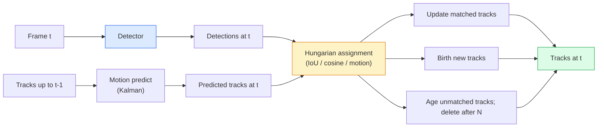

# Theo dõi nhiều đối tượng và bộ nhớ video

> Theo dõi là phát hiện cộng với liên kết. Phát hiện mọi khung hình. Khớp các phát hiện của khung hình này với các rãnh của khung hình cuối cùng theo mã nhận dạng.

**Loại:** Xây dựng
**Ngôn ngữ:** Python
**Kiến thức tiên quyết:** Giai đoạn 4 Bài 06 (Phát hiện YOLO), Giai đoạn 4 Bài 08 (Mặt nạ R-CNN), Giai đoạn 4 Bài 24 (SAM 3)
**Thời lượng:** ~60 phút

## Mục tiêu học tập

- Phân biệt theo dõi bằng cách phát hiện với theo dõi dựa trên truy vấn và đặt tên cho các họ thuật toán (SORT, DeepSORT, ByteTrack, BoT-SORT, SAM 2 memory tracker, SAM 3.1 Object Multiplex)
- Triển khai nhiệm vụ IoU + Hungary từ đầu để theo dõi bằng cách phát hiện cổ điển
- Giải thích ngân hàng bộ nhớ của SAM 2 và lý do tại sao nó xử lý tắc nghẽn tốt hơn so với liên kết dựa trên IoU
- Đọc ba chỉ số theo dõi (MOTA, IDF1, HOTA) và chọn chỉ số nào quan trọng đối với một trường hợp sử dụng nhất định

## Vấn đề

Một máy dò cho bạn biết vị trí của các đối tượng trong một khung hình duy nhất. Trình theo dõi cho bạn biết phát hiện nào trong khung hình `t` cùng đối tượng với phát hiện trong `t-1` khung hình. Nếu không có điều đó, bạn không thể đếm các vật thể vượt qua một vạch đích, đi theo một quả bóng qua một vật tắc nghẽn hoặc biết "xe # 4 đã ở trong làn đường được 8 giây".

Theo dõi là điều cần thiết đối với mọi sản phẩm hiển thị video: phân tích thể thao, giám sát, lái xe tự động, phân tích video y tế, giám sát động vật hoang dã, đếm dấu chữ. Các khối xây dựng cốt lõi được chia sẻ: một máy dò trên mỗi khung hình, một model chuyển động (bộ lọc Kalman hoặc một cái gì đó phong phú hơn), một bước liên kết (thuật toán Hungary về IoU / cosine / features đã học) và vòng đời theo dõi (sinh, cập nhật, chết).

Năm 2026 mang đến hai mẫu mới: **Theo dõi dựa trên bộ nhớ SAM 2** (bộ nhớ feature thay vì liên kết model chuyển động) và **SAM 3.1 Object Multiplex** (bộ nhớ dùng chung cho nhiều phiên bản của cùng một khái niệm). Bài học này đi theo stack cổ điển trước, sau đó là cách tiếp cận dựa trên trí nhớ.

## Khái niệm

### Theo dõi bằng cách phát hiện



Mỗi trình theo dõi bạn sẽ gặp vào năm 2026 là một biến thể của vòng lặp này. Sự khác biệt:

- **SORT** (2016): Bộ lọc Kalman + IoU Hungary. Đơn giản, nhanh chóng, không có ngoại hình model.
- **DeepSORT** (2017): SORT + feature xuất hiện dựa trên CNN cho mỗi bản nhạc (ReID embedding). Xử lý giao nhau tốt hơn.
- **ByteTrack** (2021): liên kết các phát hiện có độ tin cậy thấp như giai đoạn thứ hai; không cần features xuất hiện nhưng có thành tích cao nhất trên MOT17.
- **BoT-SORT** (2022): Byte + bù chuyển động của máy ảnh + ReID.
- **StrongSORT / OC-SORT** — Hậu duệ của ByteTrack với chuyển động và ngoại hình tốt hơn.

### Bộ lọc Kalman trong một đoạn văn

Bộ lọc Kalman duy trì `(x, y, w, h, dx, dy, dw, dh)` trạng thái trên mỗi bản nhạc với hiệp phương sai. Ở mỗi khung hình, **dự đoán** trạng thái bằng cách sử dụng model vận tốc không đổi, sau đó **cập nhật** với phát hiện phù hợp. Bản cập nhật tin tưởng hơn vào việc phát hiện khi độ không chắc chắn dự đoán cao. Điều này mang lại quỹ đạo mượt mà và khả năng tiếp tục đường đua thông qua một khoảng thời gian ngắn (1-5 khung hình).

Mọi trình theo dõi cổ điển đều sử dụng bộ lọc Kalman trong bước dự đoán chuyển động.

### Thuật toán Hungary

Với ma trận chi phí `M x N` (theo dõi x phát hiện), hãy tìm nhiệm vụ một-một giúp giảm thiểu tổng chi phí. Chi phí thường là `1 - IoU(track_bbox, detection_bbox)` hoặc âm về sự giống nhau của cosin features. Runtime là O((M+N)^3); đối với M, N lên đến ~1000, nó đủ nhanh trong Python thông qua `scipy.optimize.linear_sum_assignment`.

### Ý tưởng chính của ByteTrack

Trình theo dõi tiêu chuẩn giảm phát hiện có độ tin cậy thấp (< 0,5). ByteTrack giữ chúng ở vị trí **ứng cử viên giai đoạn thứ hai**: sau khi khớp các bản nhạc với các phát hiện có độ tin cậy cao, các bản nhạc chưa từng có cố gắng khớp các phát hiện có độ tin cậy thấp với ngưỡng IoU lỏng lẻo hơn một chút. Phục hồi các tắc nghẽn ngắn, chuyển đổi ID gần đám đông.

### Theo dõi dựa trên bộ nhớ SAM 2

SAM 2 xử lý video bằng cách giữ một **ngân hàng bộ nhớ** features không gian-thời gian trên mỗi phiên bản. Cho một prompt (nhấp chuột, hộp, văn bản) trên một khung, nó sẽ mã hóa phiên bản vào bộ nhớ. Trên các khung hình tiếp theo, bộ nhớ được giám sát chéo so với features của khung hình mới và decoder tạo mặt nạ cho cùng một phiên bản trong khung hình mới.

Không có bộ lọc Kalman, không có nhiệm vụ Hungary. Sự liên kết này ngầm ẩn trong hoạt động attention bộ nhớ.

Ưu điểm:
- Mạnh mẽ đến tắc nghẽn lớn (bộ nhớ mang danh tính phiên bản trên nhiều khung hình).
- Từ vựng mở khi kết hợp với prompts văn bản của SAM 3.
- Hoạt động mà không cần chuyển động riêng biệt model.

Nhược điểm:
- Chậm hơn ByteTrack để theo dõi nhiều đối tượng.
- Ngân hàng bộ nhớ phát triển; giới hạn context window.

### Ghép kênh đối tượng SAM 3.1

Prior theo dõi SAM 2 / SAM 3 giữ một ngân hàng bộ nhớ riêng cho mỗi phiên bản. Đối với 50 đối tượng, 50 ngân hàng bộ nhớ. Object Multiplex (Tháng 3 năm 2026) thu gọn chúng thành một bộ nhớ dùng chung với **tokens truy vấn cho mỗi phiên bản**. Chi phí thay đổi quy mô tuyến tính theo số lượng phiên bản.

Multiplex là mặc định mới để theo dõi đám đông vào năm 2026: đám đông buổi hòa nhạc, workers nhà kho, giao lộ giao thông.

### Ba số liệu cần biết

- **MOTA (Accuracy theo dõi đa đối tượng)** — 1 - (công tắc FN + FP + ID) / GT. Trọng số theo loại lỗi; một số liệu duy nhất kết hợp lỗi phát hiện và liên kết.
- **IDF1 (ID F1)** — trung bình hài của ID precision và recall. Tập trung cụ thể vào mức độ tốt của mỗi bản nhạc thực tế giữ ID của nó theo thời gian. Tốt hơn MOTA cho các tác vụ nhạy cảm với công tắc ID.
- **HOTA (Theo dõi đơn hàng cao hơn Accuracy)** — phân tách thành accuracy phát hiện (DetA) và accuracy liên kết (AssA). Tiêu chuẩn cộng đồng từ năm 2020; toàn diện nhất.

Đối với giám sát (ai là ai): IDF1 là những gì bạn báo cáo. Đối với phân tích thể thao (đếm đèo): HOTA. Để so sánh học thuật chung: HOTA.

## Tự xây dựng

### Bước 1: Ma trận chi phí dựa trên IoU

```python
import numpy as np


def bbox_iou(a, b):
    """
    a, b: (N, 4) arrays of [x1, y1, x2, y2].
    Returns (N_a, N_b) IoU matrix.
    """
    ax1, ay1, ax2, ay2 = a[:, 0], a[:, 1], a[:, 2], a[:, 3]
    bx1, by1, bx2, by2 = b[:, 0], b[:, 1], b[:, 2], b[:, 3]
    inter_x1 = np.maximum(ax1[:, None], bx1[None, :])
    inter_y1 = np.maximum(ay1[:, None], by1[None, :])
    inter_x2 = np.minimum(ax2[:, None], bx2[None, :])
    inter_y2 = np.minimum(ay2[:, None], by2[None, :])
    inter = np.clip(inter_x2 - inter_x1, 0, None) * np.clip(inter_y2 - inter_y1, 0, None)
    area_a = (ax2 - ax1) * (ay2 - ay1)
    area_b = (bx2 - bx1) * (by2 - by1)
    union = area_a[:, None] + area_b[None, :] - inter
    return inter / np.clip(union, 1e-8, None)
```

### Bước 2: Trình theo dõi kiểu SORT tối thiểu

Vận tốc không đổi cố định Kalman bị bỏ qua để ngắn gọn - chúng tôi sử dụng một liên kết IoU đơn giản ở đây; trong production dự đoán của Kalman là cần thiết. Gói `sort` Python cung cấp phiên bản đầy đủ.

```python
from scipy.optimize import linear_sum_assignment


class Track:
    def __init__(self, tid, bbox, frame):
        self.id = tid
        self.bbox = bbox
        self.last_frame = frame
        self.hits = 1

    def update(self, bbox, frame):
        self.bbox = bbox
        self.last_frame = frame
        self.hits += 1


class SimpleTracker:
    def __init__(self, iou_threshold=0.3, max_age=5):
        self.tracks = []
        self.next_id = 1
        self.iou_threshold = iou_threshold
        self.max_age = max_age

    def step(self, detections, frame):
        if not self.tracks:
            for d in detections:
                self.tracks.append(Track(self.next_id, d, frame))
                self.next_id += 1
            return [(t.id, t.bbox) for t in self.tracks]

        track_boxes = np.array([t.bbox for t in self.tracks])
        det_boxes = np.array(detections) if len(detections) else np.empty((0, 4))

        iou = bbox_iou(track_boxes, det_boxes) if len(det_boxes) else np.zeros((len(track_boxes), 0))
        cost = 1 - iou
        cost[iou < self.iou_threshold] = 1e6

        matched_track = set()
        matched_det = set()
        if cost.size > 0:
            row, col = linear_sum_assignment(cost)
            for r, c in zip(row, col):
                if cost[r, c] < 1.0:
                    self.tracks[r].update(det_boxes[c], frame)
                    matched_track.add(r); matched_det.add(c)

        for i, d in enumerate(det_boxes):
            if i not in matched_det:
                self.tracks.append(Track(self.next_id, d, frame))
                self.next_id += 1

        self.tracks = [t for t in self.tracks if frame - t.last_frame <= self.max_age]
        return [(t.id, t.bbox) for t in self.tracks]
```

60 dòng. Thực hiện phát hiện trên mỗi khung hình, trả về ID bản nhạc trên mỗi khung hình. Các hệ thống thực thêm dự đoán Kalman, trận tái đấu giai đoạn hai của ByteTrack và features xuất hiện.

### Bước 3: Kiểm tra quỹ đạo tổng hợp

```python
def synthetic_frames(num_frames=20, num_objects=3, H=240, W=320, seed=0):
    rng = np.random.default_rng(seed)
    starts = rng.uniform(20, 200, size=(num_objects, 2))
    velocities = rng.uniform(-5, 5, size=(num_objects, 2))
    frames = []
    for f in range(num_frames):
        dets = []
        for i in range(num_objects):
            cx, cy = starts[i] + f * velocities[i]
            dets.append([cx - 10, cy - 10, cx + 10, cy + 10])
        frames.append(dets)
    return frames


tracker = SimpleTracker()
for f, dets in enumerate(synthetic_frames()):
    tracks = tracker.step(dets, f)
```

Ba đối tượng di chuyển theo đường thẳng nên giữ ID của chúng trên tất cả 20 khung hình.

### Bước 4: Chỉ số chuyển đổi ID

```python
def count_id_switches(tracks_per_frame, gt_per_frame):
    """
    tracks_per_frame:  list of list of (track_id, bbox)
    gt_per_frame:      list of list of (gt_id, bbox)
    Returns number of ID switches.
    """
    prev_assignment = {}
    switches = 0
    for tracks, gts in zip(tracks_per_frame, gt_per_frame):
        if not tracks or not gts:
            continue
        t_boxes = np.array([b for _, b in tracks])
        g_boxes = np.array([b for _, b in gts])
        iou = bbox_iou(g_boxes, t_boxes)
        for g_idx, (gt_id, _) in enumerate(gts):
            j = iou[g_idx].argmax()
            if iou[g_idx, j] > 0.5:
                t_id = tracks[j][0]
                if gt_id in prev_assignment and prev_assignment[gt_id] != t_id:
                    switches += 1
                prev_assignment[gt_id] = t_id
    return switches
```

Đây là một số liệu liền kề IDF1 được đơn giản hóa: đếm số lần một đối tượng thực tế cơ bản thay đổi ID theo dõi dự đoán được chỉ định của nó. Công cụ MOTA / IDF1 / HOTA thực tồn tại trong `py-motmetrics` và `TrackEval`.

## Ứng dụng

Production trình theo dõi vào năm 2026:

- `ultralytics` - Tích hợp sẵn YOLOv8 + ByteTrack / BoT-SORT. `results = model.track(source, tracker="bytetrack.yaml")`. Mặc định.
- `supervision` (Roboflow) — Trình bao bọc ByteTrack cộng với các tiện ích chú thích.
- SAM 2 / SAM 3.1 — theo dõi dựa trên bộ nhớ qua `processor.track()`.
- stack tùy chỉnh: máy dò (YOLOv8 / RT-DETR) + `sort-tracker` / `OC-SORT` / `StrongSORT`.

Hái:

- Người đi bộ / ô tô / hộp ở tốc độ 30+ khung hình / giây: **ByteTrack với ultralytics**.
- Nhiều trường hợp của một class trong đám đông: **SAM 3.1 Object Multiplex**.
- Tắc nghẽn nặng với hình thức có thể nhận dạng: **DeepSORT / StrongSORT** (ReID features).
- Thể thao / tương tác phức tạp: **BoT-SORT** hoặc trình theo dõi đã học (MOTRv3).

## Sản phẩm bàn giao

Bài học này tạo ra:

- `outputs/prompt-tracker-picker.md` — chọn SORT / ByteTrack / BoT-SORT / SAM 2 / SAM 3.1 nhất định loại cảnh, kiểu che khuất và ngân sách độ trễ.
- `outputs/skill-mot-evaluator.md` - viết một harness đánh giá hoàn chỉnh cho MOTA / IDF1 / HOTA so với các bản nhạc thực tế.

## Bài tập

1. **(Dễ dàng)** Chạy trình theo dõi tổng hợp ở trên với 3, 10 và 30 đối tượng. Báo cáo số lượng công tắc ID trong từng trường hợp. Xác định nơi liên kết chỉ IoU đơn giản bắt đầu thất bại.
2. **(Trung bình)** Thêm một bước dự đoán vận tốc không đổi của Kalman trước khi liên kết. Cho thấy rằng các tắc khuất ngắn (2-3 khung hình) không còn gây ra chuyển đổi ID nữa.
3. **(Cứng)** Tích hợp trình theo dõi dựa trên bộ nhớ của SAM 2 (thông qua `transformers`) làm phần phụ trợ của trình theo dõi thay thế. Chạy cả SimpleTracker và SAM 2 trên clip 30 giây của đám đông và so sánh số lượng chuyển đổi ID, gắn nhãn thủ công ID thực tế cho 5 người nổi bật.

## Thuật ngữ chính

| Thuật ngữ | Những gì mọi người nói | Ý nghĩa thực sự của nó |
|------|----------------|----------------------|
| Theo dõi bằng cách phát hiện | "Phát hiện rồi liên kết" | Máy dò trên mỗi khung hình + chỉ định tiếng Hungary trên IoU / giao diện |
| Bộ lọc Kalman | "Dự đoán chuyển động" | Động lực học tuyến tính + hiệp phương sai để dự đoán đường đua mượt mà và xử lý tắc nghẽn |
| Thuật toán Hungary | "Phân công tối ưu" | Giải quyết vấn đề đối sánh hai bên chi phí tối thiểu; `scipy.optimize.linear_sum_assignment` |
| Theo dõi ByteTrack | "Đường chuyền thứ hai tự tin thấp" | Khớp lại các bản nhạc chưa từng có với các phát hiện có độ tin cậy thấp để khôi phục các tắc nghẽn ngắn |
| Sắp xếp sâu | "SẮP XẾP + xuất hiện" | Thêm một ReID feature để so khớp khung hình chéo; tốt hơn cho việc bảo quản ID |
| Ngân hàng bộ nhớ | "Thủ thuật SAM 2" | features không gian-thời gian cho mỗi phiên bản được lưu trữ trên các khung hình; cross-attention thay thế liên kết rõ ràng |
| Đối tượng Multiplex | "Bộ nhớ dùng chung SAM 3.1" | Bộ nhớ dùng chung duy nhất với các truy vấn trên mỗi phiên bản để theo dõi nhiều đối tượng nhanh chóng |
| HOTA | "Chỉ số theo dõi hiện đại" | Phân hủy thành accuracy phát hiện và liên kết; Tiêu chuẩn cộng đồng |

## Đọc thêm

- [SORT (Bewley et al., 2016)](https://arxiv.org/abs/1602.00763) — giấy theo dõi bằng cách phát hiện tối thiểu
- [DeepSORT (Wojke et al., 2017)](https://arxiv.org/abs/1703.07402) - thêm feature ngoại hình
- [ByteTrack (Zhang et al., 2022)](https://arxiv.org/abs/2110.06864) - đường chuyền thứ hai có độ tin cậy thấp
- [BoT-SORT (Aharon et al., 2022)](https://arxiv.org/abs/2206.14651) — bù chuyển động của máy ảnh
- [HOTA (Luiten et al., 2020)](https://arxiv.org/abs/2009.07736) — chỉ số theo dõi phân hủy
- [SAM 2 video segmentation (Meta, 2024)](https://ai.meta.com/sam2/) - Trình theo dõi dựa trên bộ nhớ
- [SAM 3.1 Object Multiplex (Meta, March 2026)](https://ai.meta.com/blog/segment-anything-model-3/)
