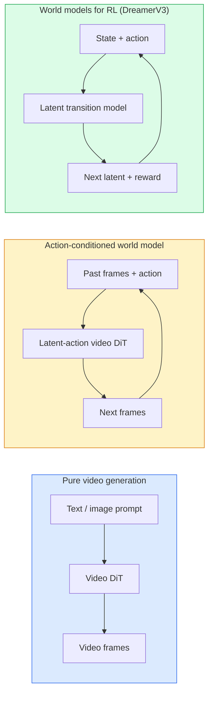

# World Models & Video Diffusion

> Một model video dự đoán những giây tiếp theo của một cảnh là một trình mô phỏng thế giới. Điều kiện dự đoán về hành động và bạn có một công cụ trò chơi đã học.

**Loại:** Tìm hiểu + Xây dựng
**Ngôn ngữ:** Python
**Kiến thức tiên quyết:** Giai đoạn 4 Bài 10 (Khuếch tán), Giai đoạn 4 Bài 12 (Hiểu video), Giai đoạn 4 Bài 23 (DiT + Dòng chỉnh lưu)
**Thời lượng:** ~75 phút

## Mục tiêu học tập

- Giải thích sự khác biệt giữa model tạo video thuần túy (Sora 2) và thế giới có điều kiện hành động model (Genie 3, DreamerV3)
- Mô tả một video DiT: các bản vá không gian-thời gian, mã hóa vị trí 3D, attention nối ngang (T, H, W) tokens
- Trace cách một thế giới model kết nối với robot: VLM kế hoạch → model video mô phỏng → động lực học nghịch đảo phát ra hành động
- Chọn giữa Sora 2, Genie 3, Runway GWM-1 Worlds, Wan-Video và HunyuanVideo cho một trường hợp sử dụng nhất định (video sáng tạo, sim tương tác, tổng hợp lái xe tự động)

## Vấn đề

Tạo video và mô hình hóa thế giới hội tụ vào năm 2026. Một model có thể tạo ra một phút video mạch lạc, theo một nghĩa nào đó, đã học được cách thế giới chuyển động: sự vĩnh cửu của đối tượng, trọng lực, nhân quả, phong cách. Nếu bạn điều chỉnh dự đoán đó về hành động (đi sang trái, mở cửa), video model sẽ trở thành một trình mô phỏng có thể học được có thể thay thế công cụ trò chơi, trình mô phỏng lái xe hoặc môi trường robot.

Tiền cược là cụ thể. Genie 3 tạo ra môi trường có thể chơi được từ một hình ảnh duy nhất. Runway GWM-1 Worlds tổng hợp vô số cảnh có thể khám phá. Sora 2 tạo ra các video dài một phút với âm thanh đồng bộ và vật lý được mô hình hóa. NVIDIA Cosmos-Drive, Wayve Gaia-2 và Tesla DrivingWorld tạo video lái xe thực tế cho dữ liệu training xe tự lái. Mô hình model thế giới đang lặng lẽ tiếp quản mô phỏng thành thực đối với robot.

Bài học này là bài học "bức tranh lớn" cho Giai đoạn 4. Nó kết nối việc tạo hình ảnh, hiểu video và lý luận agentic vào mô hình kiến trúc mà nghiên cứu thống trị đang hướng tới.

## Khái niệm

### Ba gia đình mô hình hóa thế giới



- **Sora 2 **là tạo video thuần túy có điều kiện trên prompts. Không có giao diện hành động. Bạn không thể "lái" nó giữa rollout.
- **Genie 3**, **GWM-1 Worlds**, **Mirage / Magica** là những models thế giới có điều kiện hành động. Suy ra các hành động tiềm ẩn từ video quan sát, sau đó điều chỉnh các dự đoán khung hình trong tương lai về các hành động. Tương tác - bạn nhấn phím hoặc di chuyển máy ảnh và cảnh sẽ phản hồi.
- **DreamerV3** và gia đình cổ điển RL model thế giới dự đoán trong một không gian tiềm ẩn với điều kiện hành động rõ ràng, được huấn luyện trên tín hiệu phần thưởng. Ít trực quan hơn; hữu ích hơn cho RL hiệu quả mẫu.

### Kiến trúc Video DiT

```
Video latent:          (C, T, H, W)
Patchify (spatial):    grid of P_h x P_w patches per frame
Patchify (temporal):   group P_t frames into a temporal patch
Resulting tokens:      (T / P_t) * (H / P_h) * (W / P_w) tokens
```

Mã hóa vị trí là 3D: một embedding quay hoặc đã học trên mỗi tọa độ (t, h, w). Attention có thể là:

- **Chung đầy đủ **- tất cả tokens tham dự tất cả các tokens. O (N ^ 2) với N tokens. Cấm đối với các video dài.
- **Phân chia** — attention thời gian thay thế (cùng vị trí không gian, theo thời gian: `(H*W) * T^2`) và attention không gian (cùng bước thời gian, xuyên không gian: `T * (H*W)^2`). Được sử dụng bởi TimeSformer và hầu hết các video DiT.
- **Cửa sổ **- windows cục bộ vào (t, h, w). Được sử dụng bởi Video Swin.

Mỗi lần khuếch tán video năm 2026 model sử dụng một trong ba mẫu này cộng với điều hòa AdaLN (Bài 23) và luồng chỉnh lưu.

### Điều kiện về hành động: hành động tiềm ẩn models

Genie học một **hành động tiềm ẩn** trên mỗi khung hình bằng cách dự đoán một cách phân biệt hành động giữa một cặp khung hình liên tiếp. Sau đó, model decoder điều kiện về hành động tiềm ẩn được suy ra - không phải trên các phím bàn phím rõ ràng. Tại inference, người dùng có thể chỉ định một hành động tiềm ẩn (hoặc lấy mẫu một hành động từ một prior mới) và model tạo khung tiếp theo phù hợp với hành động đó.

Sora bỏ qua giao diện hành động hoàn toàn. decoder của nó dự đoán tokens không thời gian tiếp theo từ tokens không-thời gian trong quá khứ. Prompt điều kiện bắt đầu; không có gì lèo lái nó ở thế hệ giữa.

### Tính hợp lý vật lý

Bản phát hành năm 2026 của Sora 2 đã quảng cáo rõ ràng **tính hợp lý vật lý**: trọng lượng, cân bằng, tính vĩnh cửu của đối tượng, nguyên nhân và kết quả. Được nhóm đo lường thông qua điểm hợp lý được đánh giá bằng tay; model cải thiện rõ rệt về các vật thể bị rơi, nhân vật va chạm và lỗi cố ý (nhảy trượt) so với Sora 1.

Tính hợp lý vẫn là chế độ thất bại chiếm ưu thế. Các video 2024-2025 về những người ăn mì Ý hoặc uống từ ly cho thấy model thiếu đại diện đối tượng dai dẳng. 2026 models (Sora 2, Runway Gen-5, HunyuanVideo) giảm nhưng không loại bỏ những điều này.

### Thế giới lái xe tự động models

Thế giới lái xe models tạo ra các cảnh đường thực tế dựa trên quỹ đạo, hộp giới hạn hoặc bản đồ điều hướng. Sử dụng:

- **Cosmos-Drive-Dreams** (NVIDIA) — tạo ra vài phút video lái xe cho RL training.
- **Gaia-2** (Wayve) — tổng hợp cảnh có điều kiện quỹ đạo để đánh giá policy.
- **DrivingWorld** (Tesla) — mô phỏng thời tiết, thời gian trong ngày, điều kiện giao thông khác nhau.
- **Vista** (ByteDance) — tổng hợp cảnh lái xe phản ứng.

Chúng thay thế việc thu thập dữ liệu trong thế giới thực đắt tiền cho các trường hợp ở góc - lối đi bộ của người đi bộ vào ban đêm, giao lộ băng giá, các loại phương tiện bất thường - nếu không sẽ đòi hỏi hàng triệu dặm lái xe.

### stack robot: VLM + model video + động lực học nghịch đảo

Vòng lặp robot ba thành phần mới nổi:

1. **VLM** phân tích mục tiêu ("nhặt chiếc cốc màu đỏ"), lên kế hoạch cho một chuỗi hành động cấp cao.
2. **Tạo video model** mô phỏng việc thực hiện mỗi hành động sẽ trông như thế nào - dự đoán các quan sát N khung hình phía trước.
3. **Động lực học nghịch đảo model** trích xuất các lệnh động cơ cụ thể sẽ tạo ra những quan sát đó.

Điều này thay thế định hình phần thưởng và RL nặng mẫu. Thế giới model làm trí tưởng tượng; động lực học nghịch đảo đóng vòng lặp khi kích hoạt. Genie Envisioner là một phiên bản; Nhiều nhóm nghiên cứu đang hội tụ về cấu trúc này.

### Đánh giá

- **Chất lượng hình ảnh** — FVD (Fréchet Video Distance), nghiên cứu người dùng.
- **Prompt alignment** — CLIPScore trên mỗi khung hình, đánh giá kiểu VQA.
- **Tính hợp lý về mặt vật lý** — được đánh giá bằng tay trên bộ benchmark (benchmark nội bộ của Sora 2, VBench).
- **Khả năng điều khiển** (đối với thế giới tương tác models) — hành động → quan sát nhất quán; Bạn có thể trở lại trạng thái prior không?

### Model cảnh quan vào năm 2026

| Model | Sử dụng | Parameters | Đầu ra | Giấy phép |
|-------|-----|------------|--------|---------|
| Sora 2 | Chuyển văn bản thành video, âm thanh | — | 1 phút 1080p + âm thanh | Chỉ API |
| Đường băng Gen-5 | text/image-to-video | — | Clip 10 giây | API |
| Đường băng GWM-1 WORLDS | Thế giới tương tác | — | rollout 3D vô hạn | API |
| Thần đèn 3 | Thế giới tương tác từ hình ảnh | 11 tỷ+ | Khung hình có thể chơi được | Xem trước nghiên cứu |
| Wan-Video 2.1 | Mở văn bản thành video | 14 tỷ | Clip chất lượng cao | phi thương mại |
| HunyuanVideo | Mở văn bản thành video | 13 tỷ | Clip 10 giây | Dễ dãi |
| Cosmos / Vũ trụ-Drive | Sim lái xe tự động | 7-14 tỷ | Cảnh lái xe | NVIDIA mở |
| Ma thuật / Ảo ảnh 2 | Công cụ trò chơi gốc AI | — | Thế giới có thể sửa đổi | Sản phẩm |

## Tự xây dựng

### Bước 1: Vá lỗi 3D cho video

```python
import torch
import torch.nn as nn


class VideoPatch3D(nn.Module):
    def __init__(self, in_channels=4, dim=64, patch_t=2, patch_h=2, patch_w=2):
        super().__init__()
        self.proj = nn.Conv3d(
            in_channels, dim,
            kernel_size=(patch_t, patch_h, patch_w),
            stride=(patch_t, patch_h, patch_w),
        )
        self.patch_t = patch_t
        self.patch_h = patch_h
        self.patch_w = patch_w

    def forward(self, x):
        # x: (N, C, T, H, W)
        x = self.proj(x)
        n, c, t, h, w = x.shape
        tokens = x.reshape(n, c, t * h * w).transpose(1, 2)
        return tokens, (t, h, w)
```

Một conv 3D với sải chân bằng hạt nhân hoạt động như bộ chắp vá không gian-thời gian. `(T, H, W) -> (T/2, H/2, W/2)` lưới tokens.

### Bước 2: Mã hóa vị trí quay 3D

Vị trí quay Embeddings (RoPE) được áp dụng riêng biệt dọc theo các trục `t`, `h` `w`:

```python
def rope_3d(tokens, t_dim, h_dim, w_dim, grid):
    """
    tokens: (N, T*H*W, D)
    grid: (T, H, W) sizes
    t_dim + h_dim + w_dim == D
    """
    T, H, W = grid
    n, seq, d = tokens.shape
    if t_dim + h_dim + w_dim != d:
        raise ValueError(f"t_dim+h_dim+w_dim ({t_dim}+{h_dim}+{w_dim}) must equal D={d}")
    assert seq == T * H * W
    t_idx = torch.arange(T, device=tokens.device).repeat_interleave(H * W)
    h_idx = torch.arange(H, device=tokens.device).repeat_interleave(W).repeat(T)
    w_idx = torch.arange(W, device=tokens.device).repeat(T * H)
    # Simplified: just scale channels by frequencies. Real RoPE rotates pairs.
    freqs_t = torch.exp(-torch.log(torch.tensor(10000.0)) * torch.arange(t_dim // 2, device=tokens.device) / (t_dim // 2))
    freqs_h = torch.exp(-torch.log(torch.tensor(10000.0)) * torch.arange(h_dim // 2, device=tokens.device) / (h_dim // 2))
    freqs_w = torch.exp(-torch.log(torch.tensor(10000.0)) * torch.arange(w_dim // 2, device=tokens.device) / (w_dim // 2))
    emb_t = torch.cat([torch.sin(t_idx[:, None] * freqs_t), torch.cos(t_idx[:, None] * freqs_t)], dim=-1)
    emb_h = torch.cat([torch.sin(h_idx[:, None] * freqs_h), torch.cos(h_idx[:, None] * freqs_h)], dim=-1)
    emb_w = torch.cat([torch.sin(w_idx[:, None] * freqs_w), torch.cos(w_idx[:, None] * freqs_w)], dim=-1)
    return tokens + torch.cat([emb_t, emb_h, emb_w], dim=-1)
```

Dạng phụ gia đơn giản. Real RoPE xoay các kênh được ghép nối ở tần số; Thông tin vị trí là như nhau.

### Bước 3: Chia khối attention

```python
class DividedAttentionBlock(nn.Module):
    def __init__(self, dim=64, heads=2):
        super().__init__()
        self.time_attn = nn.MultiheadAttention(dim, heads, batch_first=True)
        self.space_attn = nn.MultiheadAttention(dim, heads, batch_first=True)
        self.ln1 = nn.LayerNorm(dim)
        self.ln2 = nn.LayerNorm(dim)
        self.ln3 = nn.LayerNorm(dim)
        self.mlp = nn.Sequential(nn.Linear(dim, 4 * dim), nn.GELU(), nn.Linear(4 * dim, dim))

    def forward(self, x, grid):
        T, H, W = grid
        n, seq, d = x.shape
        # time attention: same (h, w), across t
        xt = x.view(n, T, H * W, d).permute(0, 2, 1, 3).reshape(n * H * W, T, d)
        a, _ = self.time_attn(self.ln1(xt), self.ln1(xt), self.ln1(xt), need_weights=False)
        xt = (xt + a).reshape(n, H * W, T, d).permute(0, 2, 1, 3).reshape(n, seq, d)
        # space attention: same t, across (h, w)
        xs = xt.view(n, T, H * W, d).reshape(n * T, H * W, d)
        a, _ = self.space_attn(self.ln2(xs), self.ln2(xs), self.ln2(xs), need_weights=False)
        xs = (xs + a).reshape(n, T, H * W, d).reshape(n, seq, d)
        xs = xs + self.mlp(self.ln3(xs))
        return xs
```

Thời gian attention tham dự trong mỗi vị trí không gian theo thời gian; không gian attention tham dự trong mỗi khung hình trên các vị trí. Hai phép toán O(T^2 + (HW)^2) thay vì một O((THW)^2). Đây là cốt lõi của TimeSformer và mọi video hiện đại DiT.

### Bước 4: Soạn một video nhỏ DiT

```python
class TinyVideoDiT(nn.Module):
    def __init__(self, in_channels=4, dim=64, depth=2, heads=2):
        super().__init__()
        self.patch = VideoPatch3D(in_channels=in_channels, dim=dim, patch_t=2, patch_h=2, patch_w=2)
        self.blocks = nn.ModuleList([DividedAttentionBlock(dim, heads) for _ in range(depth)])
        self.out = nn.Linear(dim, in_channels * 2 * 2 * 2)

    def forward(self, x):
        tokens, grid = self.patch(x)
        for blk in self.blocks:
            tokens = blk(tokens, grid)
        return self.out(tokens), grid
```

Không phải là một trình tạo video đang hoạt động; một bản demo cấu trúc mà mọi mảnh ghép đều định hình chính xác.

### Bước 5: Kiểm tra hình dạng

```python
vid = torch.randn(1, 4, 8, 16, 16)  # (N, C, T, H, W)
model = TinyVideoDiT()
out, grid = model(vid)
print(f"input  {tuple(vid.shape)}")
print(f"tokens grid {grid}")
print(f"output {tuple(out.shape)}")
```

Mong đợi `grid = (4, 8, 8)` và `out = (1, 256, 32)` sau khi vá; Sau đó, phần đầu chiếu đến các bản vá không gian-thời gian trên mỗi token, sẵn sàng được không vá trở lại thành video.

## Ứng dụng

Production mô hình truy cập cho năm 2026:

- **Sora 2 API** (OpenAI) — chuyển văn bản thành video, âm thanh được đồng bộ hóa. Giá cao cấp.
- **Runway Gen-5 / GWM-1** (Runway) — thế giới tương tác, hình ảnh thành video.
- **Wan-Video 2.1 / HunyuanVideo** — tự lưu trữ mã nguồn mở.
- **Cosmos / Cosmos-Drive** (NVIDIA) — lái xe mô phỏng trọng lượng mở.
- **Genie 3** — xem trước nghiên cứu, yêu cầu quyền truy cập.

Để xây dựng một bản demo tương tác model thế giới: bắt đầu với Wan-Video để có chất lượng, lớp trên bộ chuyển đổi hành động tiềm ẩn để tương tác. Đối với mô phỏng lái xe tự động: Cosmos-Drive là tài liệu tham khảo mở năm 2026.

Đối với robot, stack trong tự nhiên:

1. Mục tiêu ngôn ngữ -> VLM (Qwen3-VL) -> kế hoạch cấp cao.
2. Lập kế hoạch > video hành động tiềm ẩn model > tưởng tượng rollout.
3. Rollout -> động lực nghịch đảo model -> các hành động cấp thấp.
4. Các hành động được thực hiện -> quan sát được đưa trở lại bước 1.

## Sản phẩm bàn giao

Bài học này tạo ra:

- `outputs/prompt-video-model-picker.md` - lựa chọn giữa Sora 2 / Runway / Wan / HunyuanVideo / Cosmos được cung cấp nhiệm vụ, giấy phép và độ trễ.
- `outputs/skill-physical-plausibility-checks.md` — một skill xác định kiểm tra tự động (tính vĩnh viễn của đối tượng, trọng lực, tính liên tục) để chạy trên bất kỳ video nào được tạo trước khi shipping.

## Bài tập

1. **(Dễ)** Tính số token cho video 360p dài 5 giây ở patch-t = 2, patch-h = 8, patch-w = 8. Lý do về bộ nhớ cho attention ở kích thước này.
2. **(Trung bình) **Hoán đổi khối attention đã chia ở trên cho một khối attention khớp đầy đủ và đo hình dạng và số lượng parameter. Giải thích lý do tại sao attention chia là cần thiết cho models video thực sự.
3. **(Khó)** Xây dựng một model video hành động tiềm ẩn tối thiểu: thực hiện dataset (frame_t, action_t, frame_{t+1}) bộ ba (bất kỳ trò chơi 2D đơn giản nào), huấn luyện một video nhỏ DiT có điều kiện dựa trên embeddings hành động và cho thấy rằng các hành động khác nhau tạo ra các khung hình tiếp theo khác nhau.

## Thuật ngữ chính

| Thuật ngữ | Những gì mọi người nói | Ý nghĩa thực sự của nó |
|------|----------------|----------------------|
| model thế giới | "Trình mô phỏng đã học" | Một model dự đoán các quan sát trong tương lai cho trạng thái và hành động |
| Video DiT | "Không thời gian transformer" | transformer khuếch tán với sự vá lỗi 3D và phân chia attention |
| Hành động tiềm ẩn | "Kiểm soát suy luận" | Hành động rời rạc hoặc liên tục tiềm ẩn được suy ra từ các cặp khung; Được sử dụng để điều hòa thế hệ khung hình tiếp theo |
| Chia attention | "Thời gian rồi không gian" | Hai phép toán attention trên mỗi khối - qua thời gian sau đó xuyên không gian - để giữ cho O (N ^ 2) có thể quản lý được |
| Vĩnh viễn đối tượng | "Mọi thứ vẫn là thật" | Thuộc tính cảnh mà models video phải tìm hiểu; Chế độ thất bại cổ điển trên thực phẩm, đồ thủy tinh |
| Bệnh viện FVD | "Khoảng cách video Fréchet" | Video tương đương với FID; Chỉ số chất lượng hình ảnh chính |
| Động lực học nghịch đảo model | "Quan sát hành động" | Cho (trạng thái, trạng thái tiếp theo), xuất ra hành động kết nối chúng; Đóng vòng lặp robot |
| Ổ đĩa vũ trụ | "NVIDIA sim lái xe" | Thế giới lái xe tự động có trọng lượng mở model để RL và đánh giá |

## Đọc thêm

- [Sora technical report (OpenAI)](https://openai.com/index/video-generation-models-as-world-simulators/)
- [Genie: Generative Interactive Environments (Bruce et al., 2024)](https://arxiv.org/abs/2402.15391) — thế giới hành động tiềm ẩn models
- [TimeSformer (Bertasius et al., 2021)](https://arxiv.org/abs/2102.05095) - chia attention cho video transformers
- [DreamerV3 (Hafner et al., 2023)](https://arxiv.org/abs/2301.04104) - models thế giới cho RL
- [Cosmos-Drive-Dreams (NVIDIA, 2025)](https://research.nvidia.com/labs/toronto-ai/cosmos-drive-dreams/) - lái xe thế giới model
- [Top 10 Video Generation Models 2026 (DataCamp)](https://www.datacamp.com/blog/top-video-generation-models)
- [From Video Generation to World Model — survey repo](https://github.com/ziqihuangg/Awesome-From-Video-Generation-to-World-Model/)
