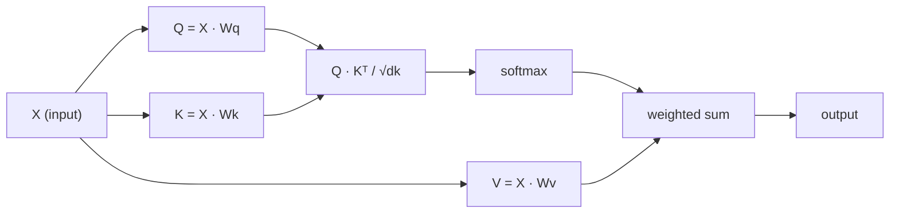

# Self-Attention từ đầu

> Attention là một bảng tra cứu nơi mọi từ hỏi "ai quan trọng với tôi?" - và tìm hiểu câu trả lời.

**Loại:** Xây dựng
**Ngôn ngữ:** Python
**Kiến thức tiên quyết:** Giai đoạn 3 (Deep Learning Core), Giai đoạn 5 Bài 10 (Chuỗi đến trình tự)
**Thời lượng:** ~90 phút

## Mục tiêu học tập

- Triển khai self-attention sản phẩm chấm theo tỷ lệ từ đầu chỉ bằng cách sử dụng NumPy, bao gồm phép chiếu query/key/value và tổng trọng số softmax
- Xây dựng một lớp multi-head attention chia đầu, tính toán attention song song và nối kết quả
- Trace cách ma trận attention nắm bắt các mối quan hệ token và giải thích lý do tại sao tỷ lệ theo sqrt(d_k) ngăn chặn sự bão hòa softmax
- Áp dụng mặt nạ nhân quả để chuyển đổi attention hai chiều thành attention tự hồi quy (kiểu decoder)

## Vấn đề

RNN process trình tự từng token một. Khi bạn đạt đến token 50, thông tin từ token 1 đã được nén qua 50 bước nén. Các phụ thuộc tầm xa bị nghiền nát vào trạng thái ẩn kích thước cố định - một nút cổ chai mà không có cổng LSTM nào giải quyết triệt để.

Bài báo attention Bahdanau năm 2014 đã chỉ ra cách khắc phục: hãy để decoder nhìn lại mọi vị trí encoder và quyết định vị trí nào quan trọng đối với bước hiện tại. Nhưng nó vẫn được bắt vít vào một RNN. Bài báo "Attention là tất cả những gì bạn cần" năm 2017 đã đặt ra một câu hỏi sắc bén hơn: điều gì sẽ xảy ra nếu attention là cơ chế *duy nhất*? Không tái phát. Không có sự tích chập. Chỉ cần attention.

Self-attention cho phép mọi vị trí trong một trình tự tham gia vào mọi vị trí khác trong một bước song song duy nhất. Đó là điều làm cho transformers nhanh, có thể mở rộng và chiếm ưu thế.

## Khái niệm

### Tương tự tra cứu cơ sở dữ liệu

Hãy nghĩ về attention như một tra cứu cơ sở dữ liệu mềm:

```
Traditional database:
  Query: "capital of France"  -->  exact match  -->  "Paris"

Attention:
  Query: "capital of France"  -->  similarity to ALL keys  -->  weighted blend of ALL values
```

Mỗi token tạo ra ba vectors:
- **Truy vấn (Q)**: "Tôi đang tìm kiếm gì?"
- **Chìa khóa (K)**: "Tôi chứa những gì?"
- **Giá trị (V)**: "Tôi sẽ cung cấp thông tin gì nếu được chọn?"

Sản phẩm chấm giữa truy vấn và tất cả các khóa tạo ra điểm số attention. Điểm cao có nghĩa là "khóa này khớp với truy vấn của tôi". Những điểm số đó có trọng số các giá trị. Đầu ra là tổng các giá trị có trọng số.

### Tính toán Q, K, V

Mỗi token embedding được chiếu thông qua ba ma trận trọng lượng đã học:

```
Input embeddings (sequence of n tokens, each d-dimensional):

  X = [x1, x2, x3, ..., xn]       shape: (n, d)

Three weight matrices:

  Wq  shape: (d, dk)
  Wk  shape: (d, dk)
  Wv  shape: (d, dv)

Projections:

  Q = X @ Wq    shape: (n, dk)      each token's query
  K = X @ Wk    shape: (n, dk)      each token's key
  V = X @ Wv    shape: (n, dv)      each token's value
```

Về mặt trực quan, đối với một token:

```
             Wq
  x_i ------[*]------> q_i    "What am I looking for?"
       |
       |     Wk
       +----[*]------> k_i    "What do I contain?"
       |
       |     Wv
       +----[*]------> v_i    "What do I offer?"
```

### Ma trận Attention

Khi bạn có Q, K, V cho tất cả tokens, điểm số attention tạo thành một ma trận:

```
Scores = Q @ K^T    shape: (n, n)

              k1    k2    k3    k4    k5
        +-----+-----+-----+-----+-----+
   q1   | 2.1 | 0.3 | 0.1 | 0.8 | 0.2 |   <- how much q1 attends to each key
        +-----+-----+-----+-----+-----+
   q2   | 0.4 | 1.9 | 0.7 | 0.1 | 0.3 |
        +-----+-----+-----+-----+-----+
   q3   | 0.2 | 0.6 | 2.3 | 0.5 | 0.1 |
        +-----+-----+-----+-----+-----+
   q4   | 0.9 | 0.1 | 0.4 | 1.7 | 0.6 |
        +-----+-----+-----+-----+-----+
   q5   | 0.1 | 0.3 | 0.2 | 0.5 | 2.0 |
        +-----+-----+-----+-----+-----+

Each row: one token's attention over the entire sequence
```

Xem một truy vấn tại một thời điểm quét các khóa: mỗi hàng ghi điểm mỗi token softmax biến điểm số thành trọng số và ngữ cảnh vector là sự kết hợp có trọng số của các giá trị.

```figure
attention-matrix
```

### Tại sao nên mở rộng quy mô?

Các sản phẩm chấm phát triển với kích thước dk. Nếu dk = 64, các tích chấm có thể nằm trong khoảng hàng chục, đẩy softmax vào các vùng mà gradients biến mất. Cách khắc phục: chia cho sqrt (dk).

```
Scaled scores = (Q @ K^T) / sqrt(dk)
```

Điều này giữ các giá trị trong phạm vi mà softmax tạo ra gradients hữu ích.

### Softmax Biến điểm số thành trọng số

Softmax chuyển đổi điểm thô thành phân phối xác suất trên mỗi hàng:

```
Raw scores for q1:   [2.1, 0.3, 0.1, 0.8, 0.2]
                            |
                         softmax
                            |
Attention weights:   [0.52, 0.09, 0.07, 0.14, 0.08]   (sums to ~1.0)
```

Bây giờ mỗi token có một bộ trọng lượng cho biết mỗi token khác phải chú ý bao nhiêu.

### Tổng giá trị có trọng số

Đầu ra cuối cùng cho mỗi token là tổng có trọng số của tất cả các giá trị vectors:

```
output_i = sum( attention_weight[i][j] * v_j  for all j )

For token 1:
  output_1 = 0.52 * v1 + 0.09 * v2 + 0.07 * v3 + 0.14 * v4 + 0.08 * v5
```

### Pipeline đầy đủ



Công thức trong một dòng:

```
Attention(Q, K, V) = softmax( Q @ K^T / sqrt(dk) ) @ V
```

```figure
softmax-attention-scaling
```

## Tự xây dựng

### Bước 1: Softmax lại từ đầu

Softmax chuyển đổi logits thô thành xác suất. Trừ tối đa cho độ ổn định số.

```python
import numpy as np

def softmax(x):
    shifted = x - np.max(x, axis=-1, keepdims=True)
    exp_x = np.exp(shifted)
    return exp_x / np.sum(exp_x, axis=-1, keepdims=True)

logits = np.array([2.0, 1.0, 0.1])
print(f"logits:  {logits}")
print(f"softmax: {softmax(logits)}")
print(f"sum:     {softmax(logits).sum():.4f}")
```

### Bước 2: Chia tỷ lệ attention tích chấm

Chức năng cốt lõi. Lấy ma trận Q, K, V và trả về đầu ra attention cộng với ma trận trọng lượng.

```python
def scaled_dot_product_attention(Q, K, V):
    dk = Q.shape[-1]
    scores = Q @ K.T / np.sqrt(dk)
    weights = softmax(scores)
    output = weights @ V
    return output, weights
```

### Bước 3: Self-attention class với các dự đoán đã học

Một mô-đun self-attention đầy đủ với ma trận trọng lượng Wq, Wk, Wv được khởi tạo với tỷ lệ giống như Xavier.

```python
class SelfAttention:
    def __init__(self, d_model, dk, dv, seed=42):
        rng = np.random.default_rng(seed)
        scale = np.sqrt(2.0 / (d_model + dk))
        self.Wq = rng.normal(0, scale, (d_model, dk))
        self.Wk = rng.normal(0, scale, (d_model, dk))
        scale_v = np.sqrt(2.0 / (d_model + dv))
        self.Wv = rng.normal(0, scale_v, (d_model, dv))
        self.dk = dk

    def forward(self, X):
        Q = X @ self.Wq
        K = X @ self.Wk
        V = X @ self.Wv
        output, weights = scaled_dot_product_attention(Q, K, V)
        return output, weights
```

### Bước 4: Chạy nó trên một câu

Tạo embeddings giả cho một câu và xem trọng lượng attention.

```python
sentence = ["The", "cat", "sat", "on", "the", "mat"]
n_tokens = len(sentence)
d_model = 8
dk = 4
dv = 4

rng = np.random.default_rng(42)
X = rng.normal(0, 1, (n_tokens, d_model))

attn = SelfAttention(d_model, dk, dv, seed=42)
output, weights = attn.forward(X)

print("Attention weights (each row: where that token looks):\n")
print(f"{'':>6}", end="")
for token in sentence:
    print(f"{token:>6}", end="")
print()

for i, token in enumerate(sentence):
    print(f"{token:>6}", end="")
    for j in range(n_tokens):
        w = weights[i][j]
        print(f"{w:6.3f}", end="")
    print()
```

### Bước 5: Trực quan hóa attention với bản đồ nhiệt ASCII

Ánh xạ trọng số attention với các ký tự để có hình ảnh nhanh chóng.

```python
def ascii_heatmap(weights, tokens, chars=" ░▒▓█"):
    n = len(tokens)
    print(f"\n{'':>6}", end="")
    for t in tokens:
        print(f"{t:>6}", end="")
    print()

    for i in range(n):
        print(f"{tokens[i]:>6}", end="")
        for j in range(n):
            level = int(weights[i][j] * (len(chars) - 1) / weights.max())
            level = min(level, len(chars) - 1)
            print(f"{'  ' + chars[level] + '   '}", end="")
        print()

ascii_heatmap(weights, sentence)
```

## Ứng dụng

`nn.MultiheadAttention` của PyTorch thực hiện chính xác những gì chúng tôi đã xây dựng, cộng với việc tách nhiều đầu và chiếu đầu ra:

```python
import torch
import torch.nn as nn

d_model = 8
n_heads = 2
seq_len = 6

mha = nn.MultiheadAttention(embed_dim=d_model, num_heads=n_heads, batch_first=True)

X_torch = torch.randn(1, seq_len, d_model)

output, attn_weights = mha(X_torch, X_torch, X_torch)

print(f"Input shape:            {X_torch.shape}")
print(f"Output shape:           {output.shape}")
print(f"Attention weight shape: {attn_weights.shape}")
print(f"\nAttn weights (averaged over heads):")
print(attn_weights[0].detach().numpy().round(3))
```

Sự khác biệt chính: multi-head attention chạy song song nhiều hàm attention, mỗi hàm có phép chiếu Q, K, V riêng có kích thước dk = d_model / n_heads, sau đó nối các kết quả. Điều này cho phép model tham gia vào các loại mối quan hệ khác nhau cùng một lúc.

## Sản phẩm bàn giao

Bài học này tạo ra:
- `outputs/prompt-attention-explainer.md` - một prompt để giải thích attention thông qua phép so sánh tra cứu cơ sở dữ liệu

## Bài tập

1. Sửa đổi `scaled_dot_product_attention` để chấp nhận ma trận mặt nạ tùy chọn đặt các vị trí nhất định thành vô cực âm trước khi softmax (đây là cách hoạt động của causal/decoder mặt nạ)
2. Thực hiện multi-head attention từ đầu: chia Q, K, V thành `n_heads` khối, chạy attention trên mỗi khối, nối và dự án thông qua ma trận trọng lượng cuối cùng Wo
3. Lấy hai câu khác nhau có cùng độ dài, đưa chúng qua cùng một trường hợp SelfAttention và so sánh các mẫu attention của chúng. Những thay đổi nào? Điều gì vẫn giữ nguyên?

## Thuật ngữ chính

| Thuật ngữ | Những gì mọi người nói | Ý nghĩa thực sự của nó |
|------|----------------|----------------------|
| Truy vấn (Q) | "Câu hỏi vector" | Một phép chiếu đã học về đầu vào đại diện cho thông tin mà token này đang tìm kiếm |
| Chìa khóa (K) | "Nhãn hiệu vector" | Một phép chiếu đã học đại diện cho thông tin mà token này chứa, so khớp với các truy vấn |
| Giá trị (V) | "Nội dung vector" | Một phép chiếu đã học mang thông tin thực tế được tổng hợp dựa trên điểm số attention |
| Các attention tích chấm theo tỷ lệ | "Công thức attention" | softmax (QK ^ T / sqrt (dk)) @ V - tỷ lệ ngăn chặn sự bão hòa softmax ở kích thước cao |
| Self-attention | "Người token nhìn vào chính mình và những người khác" | Attention nơi Q, K, V đều đến từ cùng một trình tự, cho phép mọi vị trí tham gia vào mọi vị trí khác |
| Attention trọng lượng | "Tập trung bao nhiêu" | Phân phối xác suất trên các vị trí, được tạo ra bởi softmax trên các sản phẩm chấm được chia tỷ lệ |
| Multi-head attention | "Song song attention" | Chạy nhiều hàm attention với các phép chiếu khác nhau, sau đó nối các kết quả để biểu diễn phong phú hơn |

## Đọc thêm

- [Attention Is All You Need (Vaswani et al., 2017)](https://arxiv.org/abs/1706.03762) - giấy transformer gốc
- [The Illustrated Transformer (Jay Alammar)](https://jalammar.github.io/illustrated-transformer/) - hướng dẫn trực quan tốt nhất về kiến trúc đầy đủ
- [The Annotated Transformer (Harvard NLP)](https://nlp.seas.harvard.edu/annotated-transformer/) - triển khai PyTorch từng dòng với giải thích
