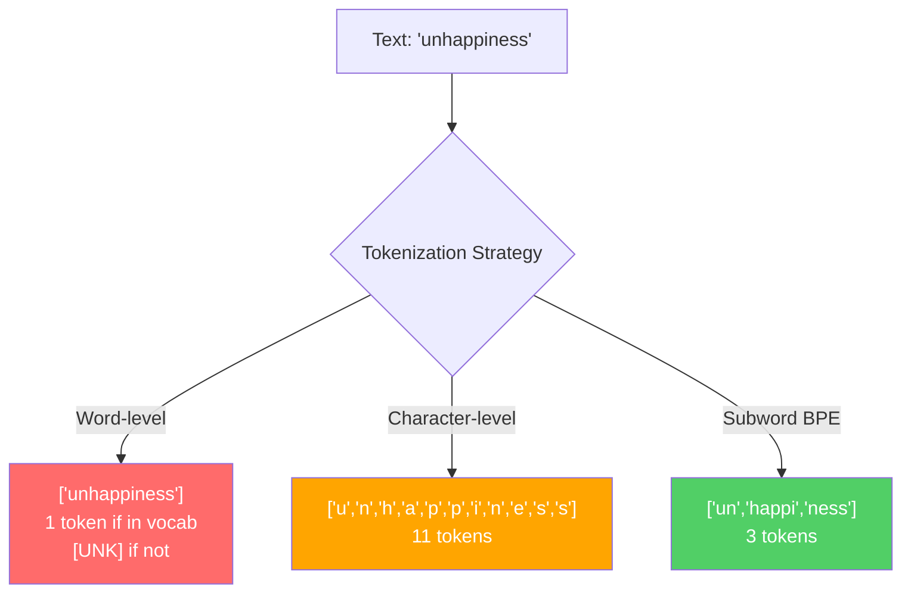
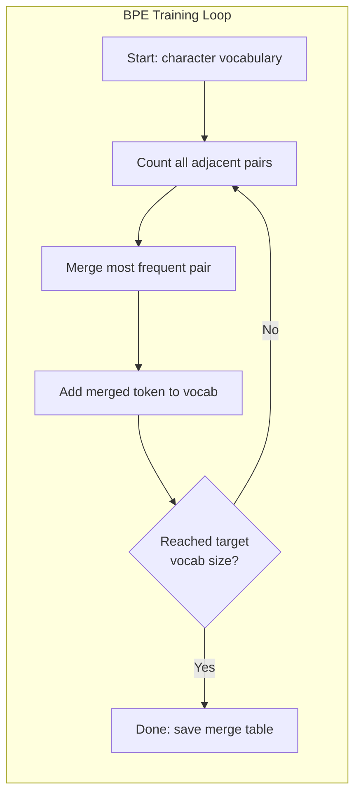
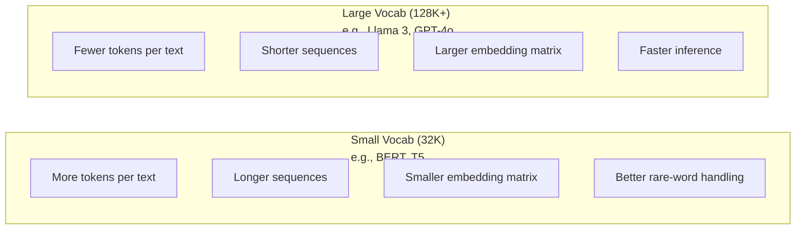

# Tokenizers: BPE, WordPiece, SentencePiece

> LLM của bạn không đọc tiếng Anh. Nó đọc các số nguyên. tokenizer quyết định xem những số nguyên đó mang ý nghĩa hay lãng phí nó.

**Loại:** Xây dựng
**Ngôn ngữ:** Python
**Kiến thức tiên quyết:** Giai đoạn 05 (NLP nền móng)
**Thời lượng:** ~90 phút

## Mục tiêu học tập

- Triển khai các thuật toán BPE, WordPiece và Unigram tokenization từ đầu và so sánh các chiến lược merge của chúng
- Giải thích kích thước từ vựng ảnh hưởng như thế nào đến hiệu quả model: quá nhỏ tạo ra chuỗi dài, lãng phí quá lớn embedding parameters
- Phân tích tokenization artifacts trên các ngôn ngữ và mã, xác định nơi tokenizers cụ thể phân tích
- Sử dụng thư viện tiktoken và sentencepiece để mã hóa văn bản và kiểm tra ID token kết quả

## Vấn đề

LLM của bạn không đọc tiếng Anh. Nó không đọc bất kỳ ngôn ngữ nào. Nó đọc số.

Khoảng cách giữa "Xin chào, thế giới!" và [15496, 11, 995, 0] là tokenizer. Mỗi từ, mỗi khoảng trắng, mọi dấu câu phải được chuyển đổi thành một số nguyên trước khi một model có thể process nó. Sự chuyển đổi này không trung lập. Nó đưa các giả định vào model không thể hoàn tác sau này.

Làm sai điều này và model của bạn lãng phí dung lượng mã hóa các từ phổ biến với nhiều tokens. "Thật không may" trở thành bốn tokens thay vì một. context window 128K của bạn chỉ giảm 75% đối với văn bản nặng trong các từ nhiều âm tiết. Làm đúng và cùng một context window có ý nghĩa gấp đôi. Sự khác biệt giữa "model này xử lý mã tốt" và "model này nghẹt thở Python" thường phụ thuộc vào cách tokenizer được huấn luyện.

Mỗi cuộc gọi API bạn thực hiện đến GPT-4 hoặc Claude đều được định giá theo token. Mỗi token model của bạn tạo ra chi phí tính toán. Càng ít tokens cần thiết để biểu diễn đầu ra thì inference đầu cuối càng nhanh. Tokenization không phải là tiền xử lý. Đó là kiến trúc.

## Khái niệm

### Ba cách tiếp cận thất bại (và một cách chiến thắng)

Có ba cách rõ ràng để chuyển đổi văn bản thành số. Hai trong số chúng không hoạt động trên quy mô lớn.

**tokenization cấp độ từ** phân tách trên khoảng trắng và dấu câu. "Con mèo sat" trở thành ["The", "cat", "sat"]. Đơn giản. Nhưng còn "tokenization" thì sao? Hay "GPT-4o"? Hay một từ ghép tiếng Đức như "Geschwindigkeitsbegrenzung"? Cấp độ từ đòi hỏi một vốn từ vựng khổng lồ để bao quát mọi từ trong mọi ngôn ngữ. Bỏ lỡ một từ và bạn sẽ nhận được `[UNK]` token đáng sợ - cách nói của model "Tôi không biết đây là gì". Chỉ riêng tiếng Anh đã có hơn một triệu dạng từ. Thêm mã, URL, ký hiệu khoa học và 100 ngôn ngữ khác và bạn cần một vốn từ vựng vô hạn.

**tokenization cấp độ ký tự** đi theo hướng khác. "Xin chào" trở thành ["h", "e", "l", "l", "o"]. Từ vựng rất nhỏ (vài trăm ký tự). Không có tokens chưa từng được biết đến. Nhưng trình tự trở nên cực kỳ dài. Một câu có thể là 10 từ cấp tokens trở thành tokens cấp 50 ký tự. Người model phải học rằng "t", "h", "e" cùng nhau có nghĩa là "the" - đốt cháy khả năng attention một cái gì đó mà con người học được khi ba tuổi.

**Từ phụ tokenization** tìm thấy điểm ngọt ngào. Các từ phổ biến vẫn còn nguyên vẹn: "the" là một token. Những từ hiếm phân hủy thành những phần có ý nghĩa: "unhappiness" trở thành ["un", "happi", "ness"]. Từ vựng vẫn có thể quản lý được (30K đến 128K tokens). Trình tự ngắn. Những tokens chưa biết về cơ bản biến mất vì bất kỳ từ nào cũng có thể được xây dựng từ các đoạn phụ.

Mọi LLM hiện đại đều sử dụng từ phụ tokenization. GPT-2, GPT-4, BERT, Llama 3, Claude - tất cả chúng. Câu hỏi là thuật toán nào.



### BPE: Mã hóa cặp byte

BPE là một thuật toán nén tham lam được tái sử dụng cho tokenization. Ý tưởng đủ đơn giản để phù hợp với thẻ chỉ mục.

Bắt đầu với các ký tự riêng lẻ. Đếm mọi cặp liền kề trong kho dữ liệu training. Merge cặp thường xuyên nhất vào một token mới. Lặp lại cho đến khi bạn đạt được kích thước từ vựng mục tiêu của mình.

```figure
tokenizer-bpe
```

Đây là BPE chạy trên một kho dữ liệu nhỏ với các từ "thấp nhất", "thấp nhất" và "mới nhất":

```
Corpus (with word frequencies):
  "lower"  x5
  "lowest" x2
  "newest" x6

Step 0 -- Start with characters:
  l o w e r       (x5)
  l o w e s t     (x2)
  n e w e s t     (x6)

Step 1 -- Count adjacent pairs:
  (e,s): 8    (s,t): 8    (l,o): 7    (o,w): 7
  (w,e): 13   (e,r): 5    (n,e): 6    ...

Step 2 -- Merge most frequent pair (w,e) -> "we":
  l o we r        (x5)
  l o we s t      (x2)
  n e we s t      (x6)

Step 3 -- Recount and merge (e,s) -> "es":
  l o we r        (x5)
  l o we s t      (x2)    <- 'es' only forms from 'e'+'s', not 'we'+'s'
  n e we s t      (x6)    <- wait, the 'e' before 'we' and 's' after 'we'

Actually tracking this precisely:
  After "we" merge, remaining pairs:
  (l,o): 7   (o,we): 7   (we,r): 5   (we,s): 8
  (s,t): 8   (n,e): 6    (e,we): 6

Step 3 -- Merge (we,s) -> "wes" or (s,t) -> "st" (tied at 8, pick first):
  Merge (we,s) -> "wes":
  l o we r        (x5)
  l o wes t       (x2)
  n e wes t       (x6)

Step 4 -- Merge (wes,t) -> "west":
  l o we r        (x5)
  l o west        (x2)
  n e west        (x6)

...continue until target vocab size reached.
```

Bảng merge là tokenizer. Để mã hóa văn bản mới, hãy áp dụng merges theo thứ tự chúng đã học. Kho dữ liệu training xác định merges nào tồn tại và lựa chọn đó định hình vĩnh viễn những gì model nhìn thấy.



### BPE cấp độ byte (GPT-2, GPT-3, GPT-4)

BPE tiêu chuẩn hoạt động trên các ký tự Unicode. BPE cấp byte hoạt động trên các byte thô (0-255). Điều này cung cấp cho bạn vốn từ vựng cơ bản chính xác là 256, xử lý bất kỳ ngôn ngữ hoặc mã hóa nào và không bao giờ tạo ra token không xác định.

GPT-2 giới thiệu cách tiếp cận này. Từ vựng cơ bản bao gồm mọi byte có thể. BPE merges xây dựng dựa trên đó. Thư viện TikToken của OpenAI triển khai BPE cấp byte với các kích thước từ vựng sau:

- GPT-2: 50.257 tokens
- GPT-3.5/GPT-4: ~100.256 tokens (mã hóa cl100k_base)
- GPT-4o: 200.019 tokens (mã hóa o200k_base)

### WordPiece (BERT)

WordPiece trông tương tự như BPE nhưng chọn merges khác nhau. Thay vì tần suất thô, nó tối đa hóa likelihood của dữ liệu training:

```
BPE merge criterion:      count(A, B)
WordPiece merge criterion: count(AB) / (count(A) * count(B))
```

BPE hỏi: "Cặp nào xuất hiện thường xuyên nhất?" WordPiece hỏi: "Cặp nào xuất hiện cùng nhau thường xuyên hơn bạn mong đợi một cách tình cờ?" Sự khác biệt tinh tế này tạo ra các từ vựng khác nhau. WordPiece ủng hộ merges khi sự xuất hiện cùng nhau là đáng ngạc nhiên, không chỉ thường xuyên.

WordPiece cũng sử dụng tiền tố "##" cho các từ phụ tiếp theo:

```
"unhappiness" -> ["un", "##happi", "##ness"]
"embedding"   -> ["em", "##bed", "##ding"]
```

Tiền tố "##" cho bạn biết bài viết này tiếp tục token trước. BERT sử dụng WordPiece với vốn từ vựng là 30.522 tokens. Mọi biến thể BERT - DistilBERT, tokenizer của RoBERTa thực sự là BPE, nhưng bản thân BERT là WordPiece.

### SentencePiece (Llama, T5)

SentencePiece coi đầu vào như một luồng thô của các ký tự Unicode, bao gồm cả khoảng trắng. Không có bước tokenization trước. Không có quy tắc ngôn ngữ cụ thể về ranh giới từ. Điều này làm cho nó thực sự bất khả tri về ngôn ngữ -- nó hoạt động trên các ngôn ngữ Trung Quốc, Nhật Bản, Thái Lan và các ngôn ngữ khác mà khoảng trắng không phân tách các từ.

SentencePiece hỗ trợ hai thuật toán:
- **Chế độ BPE**: Logic merge giống như BPE tiêu chuẩn, áp dụng cho chuỗi ký tự thô
- **Chế độ Unigram**: bắt đầu với một vốn từ vựng lớn và lặp đi lặp lại loại bỏ các tokens ít ảnh hưởng nhất đến likelihood tổng thể. Ngược lại với BPE - cắt tỉa thay vì merge.

Llama 2 sử dụng SentencePiece BPE với vốn từ vựng là 32.000 tokens. T5 sử dụng SentencePiece Unigram với 32.000 tokens. Lưu ý: Llama 3 chuyển sang BPE tokenizer cấp byte dựa trên tiktoken với 128.256 tokens.

### Đánh đổi kích thước từ vựng

Đây là một quyết định kỹ thuật thực sự với những hậu quả có thể đo lường được.



Con số cụ thể. Đối với từ vựng 128K với embeddings 4.096 chiều, chỉ riêng ma trận embedding là 128.000 x 4.096 = 524 triệu parameters. Đối với từ vựng 32K, nó là 131 triệu parameters. Đó là sự khác biệt 400 triệu parameter so với lựa chọn tokenizer.

Nhưng từ vựng lớn hơn nén văn bản mạnh mẽ hơn. Cùng một đoạn văn tiếng Anh mất 100 tokens với vốn từ vựng 32K có thể mất 70 tokens với từ vựng 128K. Điều đó có nghĩa là ít hơn 30% chuyển tiếp trong quá trình tạo. Đối với một model phục vụ hàng triệu yêu cầu, đó là giảm trực tiếp chi phí điện toán.

Xu hướng rất rõ ràng: kích thước từ vựng đang tăng lên. GPT-2 sử dụng 50.257. GPT-4 sử dụng ~100K. Llama 3 sử dụng 128K. GPT-4o sử dụng 200K.

| Model | Kích thước từ vựng | Loại Tokenizer | Tokens trung bình cho mỗi từ tiếng Anh |
|-------|-----------|----------------|---------------------------|
| BERT | 30,522 | WordPiece | ~1,4 |
| GPT-2 | 50,257 | BPE cấp byte | ~1.3 |
| Llama 2 | 32,000 | SentencePiece BPE | ~1,4 |
| GPT-4 | ~100.256 | BPE cấp byte | ~1,2 |
| Llama 3 | 128,256 | BPE cấp độ byte (tiktoken) | ~1.1 |
| GPT-4o | 200,019 | BPE cấp byte | ~1.0 |

### Thuế đa ngôn ngữ

Tokenizers được huấn luyện chủ yếu bằng tiếng Anh là tàn bạo đối với các ngôn ngữ khác. Văn bản tiếng Hàn trong tokenizer của GPT-2 trung bình 2-3 tokens mỗi từ. Tiếng Trung có thể tệ hơn. Điều này có nghĩa là người dùng Hàn Quốc có một context window có kích thước bằng một nửa người dùng tiếng Anh - trả cùng một mức giá cho mật độ thông tin ít hơn.

Đây là lý do tại sao Llama 3 tăng gấp bốn lần vốn từ vựng của mình từ 32K lên 128K. Nhiều tokens dành riêng cho các scripts không phải tiếng Anh có nghĩa là nén công bằng hơn giữa các ngôn ngữ.

```figure
tokenizer-tradeoff
```

## Tự xây dựng

### Bước 1: Tokenizer cấp nhân vật

Bắt đầu từ nền tảng. Một tokenizer cấp ký tự ánh xạ từng ký tự đến điểm mã Unicode của nó. Không cần training. Không có tokens không xác định. Chỉ là một ánh xạ trực tiếp.

```python
class CharTokenizer:
    def encode(self, text):
        return [ord(c) for c in text]

    def decode(self, tokens):
        return "".join(chr(t) for t in tokens)
```

"Xin chào" trở thành [104, 101, 108, 108, 111]. Mỗi nhân vật là token của riêng nó. Đây là cơ sở mà chúng tôi cải thiện.

### Bước 2: BPE Tokenizer từ đầu

Việc triển khai thực sự. Chúng ta huấn luyện trên các byte thô (như GPT-2), đếm cặp merge thường xuyên nhất và ghi lại mọi merge theo thứ tự. Bảng merge là bảng tokenizer.

```python
from collections import Counter

class BPETokenizer:
    def __init__(self):
        self.merges = {}
        self.vocab = {}

    def _get_pairs(self, tokens):
        pairs = Counter()
        for i in range(len(tokens) - 1):
            pairs[(tokens[i], tokens[i + 1])] += 1
        return pairs

    def _merge_pair(self, tokens, pair, new_token):
        merged = []
        i = 0
        while i < len(tokens):
            if i < len(tokens) - 1 and tokens[i] == pair[0] and tokens[i + 1] == pair[1]:
                merged.append(new_token)
                i += 2
            else:
                merged.append(tokens[i])
                i += 1
        return merged

    def train(self, text, num_merges):
        tokens = list(text.encode("utf-8"))
        self.vocab = {i: bytes([i]) for i in range(256)}

        for i in range(num_merges):
            pairs = self._get_pairs(tokens)
            if not pairs:
                break
            best_pair = max(pairs, key=pairs.get)
            new_token = 256 + i
            tokens = self._merge_pair(tokens, best_pair, new_token)
            self.merges[best_pair] = new_token
            self.vocab[new_token] = self.vocab[best_pair[0]] + self.vocab[best_pair[1]]

        return self

    def encode(self, text):
        tokens = list(text.encode("utf-8"))
        for pair, new_token in self.merges.items():
            tokens = self._merge_pair(tokens, pair, new_token)
        return tokens

    def decode(self, tokens):
        byte_sequence = b"".join(self.vocab[t] for t in tokens)
        return byte_sequence.decode("utf-8", errors="replace")
```

Vòng lặp training là cốt lõi của BPE: đếm cặp, merge người chiến thắng, lặp lại. Mỗi merge làm giảm tổng số token. Sau `num_merges` vòng, vốn từ vựng tăng từ 256 (byte cơ sở) lên 256 + num_merges.

Mã hóa áp dụng merges theo thứ tự chính xác mà chúng đã học. Điều này quan trọng. Nếu merge 1 tạo "th" và merge 5 tạo "the", mã hóa phải áp dụng merge 1 trước để "the" có thể hình thành từ "th" + "e" trong merge 5.

Giải mã là nghịch đảo: tra cứu từng ID token trong từ vựng, nối các byte, giải mã thành UTF-8.

### Bước 3: Mã hóa và giải mã khứ hồi

```python
corpus = (
    "The cat sat on the mat. The cat ate the rat. "
    "The dog sat on the log. The dog ate the frog. "
    "Natural language processing is the study of how computers "
    "understand and generate human language. "
    "Tokenization is the first step in any NLP pipeline."
)

tokenizer = BPETokenizer()
tokenizer.train(corpus, num_merges=40)

test_sentences = [
    "The cat sat on the mat.",
    "Natural language processing",
    "tokenization pipeline",
    "unhappiness",
]

for sentence in test_sentences:
    encoded = tokenizer.encode(sentence)
    decoded = tokenizer.decode(encoded)
    raw_bytes = len(sentence.encode("utf-8"))
    ratio = len(encoded) / raw_bytes
    print(f"'{sentence}'")
    print(f"  Tokens: {len(encoded)} (from {raw_bytes} bytes) -- ratio: {ratio:.2f}")
    print(f"  Roundtrip: {'PASS' if decoded == sentence else 'FAIL'}")
```

Tỷ lệ nén cho bạn biết mức độ hiệu quả của tokenizer. Tỷ lệ 0,50 có nghĩa là tokenizer nén văn bản xuống còn một nửa số tokens byte thô. Thấp hơn là tốt hơn. Trên kho dữ liệu training, tỷ lệ sẽ tốt. Trên văn bản ngoài phân phối như "không hạnh phúc" (không xuất hiện trong kho dữ liệu), tỷ lệ sẽ tồi tệ hơn - tokenizer quay trở lại mã hóa cấp ký tự cho các mẫu không nhìn thấy.

### Bước 4: So sánh với tiktoken

```python
import tiktoken

enc = tiktoken.get_encoding("cl100k_base")

texts = [
    "The cat sat on the mat.",
    "unhappiness",
    "Hello, world!",
    "def fibonacci(n): return n if n < 2 else fibonacci(n-1) + fibonacci(n-2)",
    "Geschwindigkeitsbegrenzung",
]

for text in texts:
    our_tokens = tokenizer.encode(text)
    tiktoken_tokens = enc.encode(text)
    tiktoken_pieces = [enc.decode([t]) for t in tiktoken_tokens]
    print(f"'{text}'")
    print(f"  Our BPE:   {len(our_tokens)} tokens")
    print(f"  tiktoken:  {len(tiktoken_tokens)} tokens -> {tiktoken_pieces}")
```

TikToken sử dụng thuật toán giống hệt nhau nhưng được huấn luyện trên hàng trăm gigabyte văn bản với 100.000 merges. Thuật toán giống hệt nhau. Sự khác biệt là dữ liệu training và số lượng merges. tokenizer của bạn được huấn luyện trên một đoạn văn có 40 merges không thể cạnh tranh với 100K merges của tiktoken trên một kho dữ liệu khổng lồ. Nhưng cơ chế là như nhau.

### Bước 5: Phân tích từ vựng

```python
def analyze_vocabulary(tokenizer, test_texts):
    total_tokens = 0
    total_chars = 0
    token_usage = Counter()

    for text in test_texts:
        encoded = tokenizer.encode(text)
        total_tokens += len(encoded)
        total_chars += len(text)
        for t in encoded:
            token_usage[t] += 1

    print(f"Vocabulary size: {len(tokenizer.vocab)}")
    print(f"Total tokens across all texts: {total_tokens}")
    print(f"Total characters: {total_chars}")
    print(f"Avg tokens per character: {total_tokens / total_chars:.2f}")

    print(f"\nMost used tokens:")
    for token_id, count in token_usage.most_common(10):
        token_bytes = tokenizer.vocab[token_id]
        display = token_bytes.decode("utf-8", errors="replace")
        print(f"  Token {token_id:4d}: '{display}' (used {count} times)")

    unused = [t for t in tokenizer.vocab if t not in token_usage]
    print(f"\nUnused tokens: {len(unused)} out of {len(tokenizer.vocab)}")
```

Điều này tiết lộ sự phân phối Zipf trong từ vựng của bạn. Một số tokens chiếm ưu thế (khoảng trắng, "the", "e"). Hầu hết các tokens hiếm khi được sử dụng. Production tokenizers tối ưu hóa cho sự phân phối này - các mẫu phổ biến có ID token ngắn, các mẫu hiếm có biểu diễn dài hơn.

## Ứng dụng

BPE cào của bạn hoạt động. Bây giờ hãy xem các công cụ production trông như thế nào.

### TikToken (OpenAI)

```python
import tiktoken

enc = tiktoken.get_encoding("cl100k_base")

text = "Tokenizers convert text to integers"
tokens = enc.encode(text)
print(f"Tokens: {tokens}")
print(f"Pieces: {[enc.decode([t]) for t in tokens]}")
print(f"Roundtrip: {enc.decode(tokens)}")
```

TikToken được viết bằng Rust với các ràng buộc Python. Nó mã hóa hàng triệu tokens mỗi giây. Cùng thuật toán BPE, triển khai sức mạnh công nghiệp.

### Hugging Face tokenizers

```python
from tokenizers import Tokenizer
from tokenizers.models import BPE
from tokenizers.trainers import BpeTrainer
from tokenizers.pre_tokenizers import ByteLevel

tokenizer = Tokenizer(BPE())
tokenizer.pre_tokenizer = ByteLevel()

trainer = BpeTrainer(vocab_size=1000, special_tokens=["<pad>", "<eos>", "<unk>"])
tokenizer.train(["corpus.txt"], trainer)

output = tokenizer.encode("The cat sat on the mat.")
print(f"Tokens: {output.tokens}")
print(f"IDs: {output.ids}")
```

Thư viện Hugging Face tokenizers cũng được Rust dưới mui xe. Nó huấn luyện BPE trên kho dữ liệu quy mô gigabyte trong vài giây. Đây là những gì bạn sử dụng khi training model của riêng mình.

### Đang tải Tokenizer của Llama

```python
from transformers import AutoTokenizer

tokenizer = AutoTokenizer.from_pretrained("meta-llama/Llama-3.1-8B")

text = "Tokenizers are the unsung heroes of LLMs"
tokens = tokenizer.encode(text)
print(f"Token IDs: {tokens}")
print(f"Tokens: {tokenizer.convert_ids_to_tokens(tokens)}")
print(f"Vocab size: {tokenizer.vocab_size}")

multilingual = ["Hello world", "Hola mundo", "Bonjour le monde"]
for text in multilingual:
    ids = tokenizer.encode(text)
    print(f"'{text}' -> {len(ids)} tokens")
```

Từ vựng 128K của Llama 3 nén văn bản không phải tiếng Anh tốt hơn đáng kể so với từ vựng 50K của GPT-2. Bạn có thể tự xác minh điều này - mã hóa cùng một câu bằng nhiều ngôn ngữ và đếm tokens.

## Sản phẩm bàn giao

Bài học này tạo ra `outputs/prompt-tokenizer-analyzer.md` - một prompt có thể tái sử dụng để phân tích hiệu quả tokenization cho bất kỳ sự kết hợp văn bản và model nào. Cung cấp cho nó một mẫu văn bản và nó cho bạn biết tokenizer nào của model xử lý tốt nhất.

## Bài tập

1. Sửa đổi BPE tokenizer để in từ vựng ở mỗi bước merge. Xem cách "t" + "h" trở thành "th", sau đó "th" + "e" trở thành "the". Theo dõi cách các từ tiếng Anh phổ biến được lắp ráp từng mảnh.

2. Thêm tokens đặc biệt (`<pad>`, `<eos>`, `<unk>`) vào BPE tokenizer. Gán cho họ ID 0, 1, 2 và dịch chuyển tất cả các tokens khác cho phù hợp. Thực hiện bước tokenization trước để tách trên khoảng trắng trước khi chạy BPE.

3. Thực hiện tiêu chí WordPiece merge (tỷ lệ likelihood thay vì tần suất). Huấn luyện cả BPE và WordPiece trên cùng một kho dữ liệu với cùng một số merges. So sánh các từ vựng kết quả - từ vựng nào tạo ra các từ phụ có ý nghĩa ngôn ngữ hơn?

4. Xây dựng một benchmark đa ngôn ngữ tokenizer hiệu quả. Lấy 10 câu bằng tiếng Anh, tiếng Tây Ban Nha, tiếng Trung, tiếng Hàn và tiếng Ả Rập. Mã hóa mỗi câu bằng tiktoken (cl100k_base) và đo tokens trung bình trên mỗi ký tự. Định lượng "thuế đa ngôn ngữ" cho từng ngôn ngữ.

5. Huấn luyện BPE tokenizer của bạn trên một kho dữ liệu lớn hơn (tải xuống một bài viết trên Wikipedia). Điều chỉnh số lượng merges để đạt được tỷ lệ nén trong vòng 10% tiktoken trên cùng một văn bản đó. Điều này buộc bạn phải hiểu mối quan hệ giữa kích thước kho dữ liệu, số lượng merge và chất lượng nén.

## Thuật ngữ chính

| Thuật ngữ | Những gì mọi người nói | Ý nghĩa thực sự của nó |
|------|----------------|----------------------|
| Token | "Một từ" | Một đơn vị trong từ vựng của model - có thể là một ký tự, từ phụ, từ hoặc đoạn nhiều từ |
| BPE | "Một số thứ nén" | Mã hóa cặp byte -- lặp đi lặp lại merge cặp tokens liền kề thường xuyên nhất cho đến khi đạt được kích thước từ vựng mục tiêu |
| WordPiece | "BERT tokenizer" | Giống như BPE nhưng merges tối đa hóa số lượng tỷ lệ likelihood (AB) / (đếm (A) * đếm (B)) thay vì tần số thô |
| SentencePiece | "Thư viện tokenizer" | Một tokenizer bất khả tri ngôn ngữ hoạt động trên Unicode thô mà không cần tokenization trước, hỗ trợ các thuật toán BPE và Unigram |
| Cỡ từ vựng | "Nó biết bao nhiêu từ" | Tổng số tokens duy nhất: GPT-2 có 50.257, BERT có 30.522, Llama 3 có 128.256 |
| Khả năng sinh sản | "Không phải là một thuật ngữ tokenizer" | Số lượng tokens trung bình cho mỗi từ - đo lường hiệu quả tokenizer các ngôn ngữ (1.0 là hoàn hảo, 3.0 có nghĩa là model hoạt động khó hơn gấp ba lần) |
| BPE cấp byte | "GPT tokenizer" | BPE hoạt động trên byte thô (0-255) thay vì ký tự Unicode, đảm bảo không có tokens không xác định cho bất kỳ đầu vào nào |
| Merge bảng | "Tập tin tokenizer" | Danh sách sắp xếp các cặp merges học được trong training - đây là tokenizer và thứ tự quan trọng |
| tokenization trước | "Chia không gian" | Quy tắc áp dụng trước khi tokenization từ phụ: tách khoảng trắng, tách chữ số, xử lý dấu câu |
| Tỷ số nén | "tokenizer hiệu quả như thế nào" | Tokens được tạo ra chia cho byte đầu vào - thấp hơn có nghĩa là nén tốt hơn và inference nhanh hơn |

## Đọc thêm

- [Sennrich et al., 2016 -- "Neural Machine Translation of Rare Words with Subword Units"](https://arxiv.org/abs/1508.07909) - bài báo giới thiệu BPE cho NLP, biến thuật toán nén năm 1994 thành nền tảng của tokenization hiện đại
- [Kudo & Richardson, 2018 -- "SentencePiece: A simple and language independent subword tokenizer"](https://arxiv.org/abs/1808.06226) -- tokenization bất khả tri ngôn ngữ làm cho đa ngôn ngữ models thực tế
- [OpenAI tiktoken repository](https://github.com/openai/tiktoken) -- triển khai production BPE trong Rust với các ràng buộc Python, được sử dụng bởi GPT-3.5/4/4o
- [Hugging Face Tokenizers documentation](https://huggingface.co/docs/tokenizers) - tokenizer training cấp production với hiệu suất Rust
