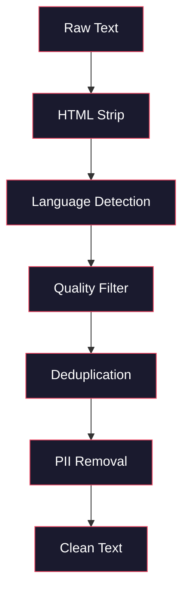
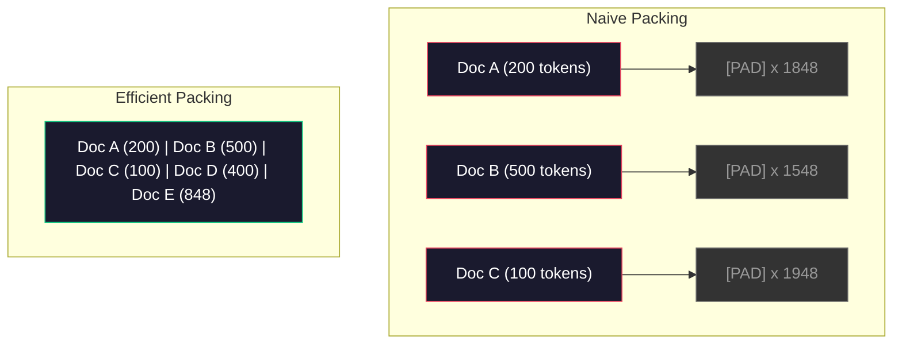

# Pipelines dữ liệu để Training trước

> model là một tấm gương. Nó phản ánh bất kỳ dữ liệu nào bạn cung cấp cho nó. Cho nó ăn rác, nó phản ánh rác với sự trôi chảy hoàn hảo.

**Loại:** Xây dựng
**Ngôn ngữ:** Python
**Kiến thức tiên quyết:** Giai đoạn 10, Bài học 01-02 (Tokenizers, Xây dựng Tokenizer)
**Thời lượng:** ~90 phút

## Mục tiêu học tập

- Xây dựng pipeline dữ liệu streaming mã hóa, phân đoạn, xáo trộn và batches terabyte văn bản mà không cần tải tất cả vào bộ nhớ
- Triển khai các bộ lọc chất lượng dữ liệu (loại bỏ trùng lặp, phát hiện ngôn ngữ, lọc nội dung) được sử dụng trong pre-training pipelines thực tế
- Tạo chuỗi training có độ dài cố định với mặt nạ attention thích hợp và xử lý ranh giới tài liệu
- Cấu hình pipeline thông lượng để đảm bảo dataloader theo kịp tốc độ GPU training

## Vấn đề

Bạn có một tokenizer. Bây giờ bạn cần dữ liệu.

Không phải dataset. Không phải tệp CSV. Terabyte văn bản -- được làm sạch, loại bỏ trùng lặp, lọc chất lượng, mã hóa thành các chuỗi có độ dài cố định và được phân phối trong batches ngẫu nhiên đủ nhanh để cụm 8 GPU của bạn không bao giờ đợi đến batch tiếp theo.

Hầu hết mọi người nghĩ training một LLM là về kiến trúc model. Không phải vậy. Llama 3 sử dụng 15,6 nghìn tỷ tokens. GPT-3 sử dụng 300 tỷ. DeepSeek-V2 sử dụng 8,1 nghìn tỷ. Kiến trúc trên cả ba gần giống nhau: xếp chồng lên nhau transformer khối với các lớp attention và feedforward. Sự khác biệt về chất lượng đầu ra đến từ dữ liệu.

Bài báo Chinchilla từ DeepMind đã làm cho điều này chính xác. Đối với một ngân sách tính toán nhất định, có một tỷ lệ tối ưu là model parameters trên training tokens. Chinchilla cho thấy rằng hầu hết các models vào năm 2022 đều được huấn luyện kém đáng kể - họ có quá nhiều parameters cho lượng dữ liệu mà họ nhìn thấy. Một parameter model 70B được huấn luyện trên 1,4 nghìn tỷ tokens (tối ưu Chinchilla) vượt trội hơn một model 280B được huấn luyện trên 300 tỷ tokens (Gopher).

Dữ liệu của bạn pipeline xác định xem model của bạn học ngôn ngữ hay học nhiễu.

## Khái niệm

### Dữ liệu đến từ đâu

Mọi model ngôn ngữ lớn đều được huấn luyện trên nhiều nguồn. Thành phần chính xác là một bí mật được bảo vệ chặt chẽ đối với hầu hết các phòng thí nghiệm, nhưng chúng tôi biết đủ để hiểu các danh mục.

| Nguồn | Kích thước | Chất lượng | Được sử dụng bởi |
|--------|------|---------|---------|
| Thu thập thông tin chung | ~250 TB thô | Thấp (cần lọc nhiều) | GPT-3, Llama, cởi mở nhất models |
| Wikipedia tiếng Việt | ~20 GB | Cao | Mọi LLM chính |
| Mã GitHub | ~1 TB+ | Trung bình (nhiều bản sao, mã chết) | StarCoder, CodeLlama, DeepSeek-Coder |
| Sách (BookCorpus, Pile) | ~100 GB | Cao | GPT-2, GPT-3, đầu models |
| Bài báo học thuật (arXiv, S2ORC) | ~100 GB | Cao đối với STEM | Llama, Thiên hà |
| StackOverflow, Reddit | ~100 GB | Trung bình | Llama, Chim ưng |
| Web được tuyển chọn (C4, RefinedWeb) | ~5 TB | Trung bình-Cao (lọc trước) | T5, Chim ưng |

Llama 3 tiết lộ hỗn hợp dữ liệu của mình: khoảng 50% dữ liệu web, 25% mã, 13% sách và bài báo học thuật, 8% dữ liệu toán học và 4% dữ liệu web đa ngôn ngữ. Tổng cộng là 15,6 nghìn tỷ tokens từ các nguồn vượt quá 5 TB văn bản thô.

Tỷ lệ này quan trọng như tổng kích thước. Quá nhiều dữ liệu web và dữ liệu model trở thành một con vẹt Reddit. Quá ít mã và nó không thể lập trình. Quá ít toán học và nó không thể suy luận. Làm đúng sự kết hợp này là một trong những phần khó nhất của training một LLM và không có công thức nào - nó đòi hỏi thử nghiệm và đánh giá.

### Làm sạch dữ liệu

Dữ liệu web thô rất bẩn. Một kết xuất Thu thập thông thường điển hình chứa:

- HTML thẻ và JavaScript
- Đầu trang, chân trang, menu điều hướng
- Các trang trùng lặp (chính xác và gần như trùng lặp)
- Thư rác do máy tạo
- Thông tin nhận dạng cá nhân (PII)
- Văn bản chất lượng thấp (danh sách từ khóa, thư rác SEO)
- Nội dung không phải văn bản được mã hóa dưới dạng văn bản

Làm sạch điều này không phải là tùy chọn. Đó là sự khác biệt giữa một model tạo ra các đoạn mạch lạc và một  xuất ra các thẻ HTML trộn với danh sách sản phẩm.



Mỗi bước loại bỏ một loại nhiễu:

**HTML Loại bỏ:** Xóa tất cả đánh dấu. Chỉ giữ nội dung văn bản hiển thị. Các thư viện như `trafilatura` hoặc `readability` trích xuất nội dung bài viết trong khi loại bỏ điều hướng, quảng cáo và nguyên mẫu.

**Phát hiện ngôn ngữ:** Sử dụng model nhận dạng ngôn ngữ của fastText (lid.176.bin) để phân loại từng tài liệu. Lọc theo ngôn ngữ mục tiêu của bạn. Một tài liệu được phân loại là tiếng Anh với độ tin cậy dưới 0,8 có thể không phải là tiếng Anh sạch.

**Lọc chất lượng:** Đây là nơi nó trở nên thú vị. RefinedWeb (dataset đứng sau Falcon) sử dụng bộ lọc dựa trên perplexity: huấn luyện một model ngôn ngữ nhỏ trên Wikipedia, sau đó chấm điểm từng tài liệu. perplexity cao có nghĩa là tài liệu không giống như Wikipedia -- có khả năng là spam, danh sách từ khóa hoặc nội dung do máy tạo ra. Các tài liệu có perplexity trên ngưỡng sẽ bị xóa.

**Loại bỏ trùng lặp:** Bước dọn dẹp có tác động mạnh nhất. Common Crawl chứa một số lượng lớn các trang trùng lặp -- tuyên bố từ chối trách nhiệm pháp lý, thông báo cookie, điều khoản dịch vụ. Training trên các bản sao lãng phí tính toán và có thể khiến model ghi nhớ và nôn lại nguyên văn các đoạn cụ thể.

**Xóa PII:** Tên, địa chỉ email, số điện thoại, số an sinh xã hội. Phát hiện dựa trên biểu thức chính quy cho PII có cấu trúc, NER models cho tên trong ngữ cảnh.

### Loại bỏ trùng lặp với MinHash

Loại bỏ trùng lặp chính xác rất dễ dàng: băm từng tài liệu, loại bỏ các bản trùng lặp. Nhưng gần như trùng lặp là vấn đề thực sự. Hai bản sao của cùng một bài báo với quảng cáo hơi khác nhau xung quanh nó gần như trùng lặp. Nội dung giống hệt nhau 95%, nhưng chúng khác nhau từng byte.

MinHash + Locality-Sensitive Hashing (LSH) giải quyết vấn đề này một cách hiệu quả.


Ý tưởng:

1. **Shingling:** Chuyển đổi mỗi tài liệu thành một tập hợp n-gram (ví dụ: 5 gram từ hoặc ký tự). "The Quick Brown Fox" với 3 từ Shingles trở thành {"The Quick Brown", "Quick Brown Fox"}.

2. **Hàm băm tối thiểu: **Đối với bộ ván lợp của mỗi tài liệu, hãy tính k giá trị băm. Mỗi giá trị băm là giá trị băm tối thiểu trên tất cả các tấm lợp theo một hàm băm khác nhau. Điều này tạo ra một "chữ ký" có kích thước cố định xấp xỉ sự tương đồng của Jaccard giữa hai tài liệu bất kỳ.

3. **LSH:** Nhóm các tài liệu thành các nhóm dựa trên các dải chữ ký MinHash của chúng. Các tài liệu trong cùng một nhóm là các ứng cử viên gần như trùng lặp. Điều này tránh so sánh mọi cặp - bạn chỉ so sánh các ứng cử viên.

4. **Xác minh:** Đối với mỗi cặp ứng viên, hãy tính toán chính xác sự tương đồng của Jaccard. Xóa một bản sao nếu sự tương đồng vượt quá ngưỡng (thường là 0,8).

Nhóm Llama báo cáo đã xóa khoảng 38% dữ liệu web của họ thông qua loại bỏ trùng lặp. Đó là một con số không nhỏ. Hơn một phần ba Thu thập thông thường là nội dung trùng lặp hoặc gần như trùng lặp.

### Đóng gói theo trình tự

model của bạn mong đợi các chuỗi đầu vào có độ dài cố định. Tài liệu của bạn có độ dài thay đổi. Một số là 50 tokens. Một số là 50.000 tokens.

Cách tiếp cận ngây thơ: đệm mọi tài liệu đến độ dài trình tự tối đa. Điều này lãng phí điện toán khổng lồ vào việc đệm tokens không đóng góp gì cho việc học.

Cách tiếp cận tốt hơn: đóng gói nhiều tài liệu thành một trình tự duy nhất, được phân tách bằng tokens cuối trình tự. Một chuỗi 2048-token có thể chứa ba tài liệu ngắn được nối với tokens [EOS] giữa chúng.



Mặt nạ attention phải được đặt chính xác. Tokens từ Tài liệu A không được tham gia vào tokens từ Tài liệu B trong cùng một trình tự đóng gói. Điều này yêu cầu mặt nạ attention theo đường chéo khối.

Các tài liệu dài bị cắt bớt hoặc chia thành các đoạn ở ranh giới trình tự. Điểm phân chia rất quan trọng: việc tách giữa câu buộc model phải nhìn thấy những suy nghĩ không đầy đủ. Một số pipelines căn chỉnh các phần tách theo ranh giới đoạn văn hoặc câu khi có thể.

### Luật quy mô Chinchilla

Đối với ngân sách điện toán cố định C (được đo bằng FLOPs), kích thước model tối ưu N và dataset kích thước D như sau:

```
N_opt ~ C^0.5
D_opt ~ C^0.5
```

Trong thực tế, điều này có nghĩa là bạn nên chia tỷ lệ model kích thước và kích thước dataset gần bằng nhau. Một model có parameters nhiều hơn 10 lần cần thêm khoảng 10 lần training tokens để đạt được cùng một loss.

| Model | Parameters | Training Tokens | Chinchilla-Tối ưu? |
|-------|-----------|----------------|-------------------|
| GPT-3 | 175 tỷ | 300 tỷ | Không (chưa được huấn luyện 3-4x) |
| Chinchilla | 70 tỷ | 1.4 TẤN | Có (theo thiết kế) |
| Llama 2 | 70 tỷ | 2T | Tập luyện quá sức (cố ý) |
| Llama 3 | 70 tỷ | 15 TẤN | Tập luyện quá sức |

Llama 3 cố tình vi phạm định luật Chinchilla. Meta nhận thấy rằng việc huấn luyện quá mức trên nhiều dữ liệu hơn - vượt xa tỷ lệ tính toán-tối ưu - tạo ra models tốt hơn cho inference. Chi phí training bổ sung được trả một lần, nhưng model nhỏ hơn rẻ hơn để phục vụ mãi mãi. Điều này đôi khi được gọi là phương pháp mở rộng quy mô "tối ưu inference" và nó đã trở thành tiêu chuẩn ngành kể từ năm 2024.

## Tự xây dựng

### Bước 1: Dọn dẹp văn bản

Loại bỏ HTML, chuẩn hóa khoảng trắng, loại bỏ nội dung không phải văn bản. Chúng ta sẽ sử dụng một văn bản phạm vi công cộng (Dự án Gutenberg) làm kho dữ liệu nhỏ của chúng ta.

```python
import re

def clean_text(text):
    text = re.sub(r"<[^>]+>", "", text)
    text = re.sub(r"http\S+", "", text)
    text = re.sub(r"[^\x20-\x7E\n]", "", text)
    text = re.sub(r"\n{3,}", "\n\n", text)
    text = re.sub(r" {2,}", " ", text)
    return text.strip()

def quality_filter(text, min_words=50, max_ratio_caps=0.3, max_ratio_special=0.1):
    words = text.split()
    if len(words) < min_words:
        return False
    caps_ratio = sum(1 for w in words if w.isupper()) / len(words)
    if caps_ratio > max_ratio_caps:
        return False
    special_chars = sum(1 for c in text if not c.isalnum() and not c.isspace())
    if special_chars / max(len(text), 1) > max_ratio_special:
        return False
    return True
```

Bộ lọc chất lượng bắt spam SEO (VIẾT HOA TẤT CẢ), nhiễu do máy tạo ra (tỷ lệ ký tự đặc biệt cao) và các trang sơ khai (quá ngắn). Chỉ riêng ba kiểm tra này đã loại bỏ một lượng rác đáng ngạc nhiên khỏi thu thập dữ liệu web.

### Bước 2: Khử trùng lặp MinHash

Triển khai MinHash từ đầu. Không cần thư viện bên ngoài -- chỉ cần `hashlib`.

```python
import hashlib
from collections import defaultdict

def get_shingles(text, k=5):
    words = text.lower().split()
    if len(words) < k:
        return set()
    return {" ".join(words[i:i+k]) for i in range(len(words) - k + 1)}

def minhash_signature(shingles, num_hashes=128):
    signature = []
    for i in range(num_hashes):
        min_hash = float("inf")
        for shingle in shingles:
            h = int(hashlib.sha256(f"{i}:{shingle}".encode()).hexdigest(), 16)
            min_hash = min(min_hash, h)
        signature.append(min_hash)
    return signature

def lsh_buckets(signature, bands=16):
    rows_per_band = len(signature) // bands
    buckets = []
    for b in range(bands):
        start = b * rows_per_band
        band_data = tuple(signature[start:start + rows_per_band])
        bucket_hash = hashlib.md5(str(band_data).encode()).hexdigest()
        buckets.append((b, bucket_hash))
    return buckets

def deduplicate(documents, threshold=0.8, num_hashes=128, bands=16):
    signatures = []
    shingle_sets = []
    for doc in documents:
        shingles = get_shingles(doc)
        shingle_sets.append(shingles)
        signatures.append(minhash_signature(shingles, num_hashes))

    bucket_map = defaultdict(list)
    for doc_idx, sig in enumerate(signatures):
        for band_id, bucket_hash in lsh_buckets(sig, bands):
            bucket_map[(band_id, bucket_hash)].append(doc_idx)

    duplicate_pairs = set()
    for bucket_docs in bucket_map.values():
        if len(bucket_docs) < 2:
            continue
        for i in range(len(bucket_docs)):
            for j in range(i + 1, len(bucket_docs)):
                duplicate_pairs.add((bucket_docs[i], bucket_docs[j]))

    removed = set()
    for i, j in duplicate_pairs:
        if i in removed or j in removed:
            continue
        s1, s2 = shingle_sets[i], shingle_sets[j]
        if not s1 or not s2:
            continue
        jaccard = len(s1 & s2) / len(s1 | s2)
        if jaccard >= threshold:
            removed.add(j)

    return [doc for idx, doc in enumerate(documents) if idx not in removed], len(removed)
```

`num_hashes=128` và `bands=16` parameters kiểm soát sự đánh đổi precision-recall. Nhiều hàm băm hơn cung cấp ước tính tương đồng chính xác hơn. Nhiều dải hơn tăng recall (bắt được nhiều bản sao hơn) với chi phí là nhiều dương tính giả hơn. Các giá trị này hoạt động tốt cho văn bản web điển hình.

### Bước 3: Mã hóa và đóng gói trình tự

Lấy văn bản sạch, đã loại bỏ trùng lặp, mã hóa nó và đóng gói thành các chuỗi có độ dài cố định cho training.

```python
def tokenize_corpus(documents, tokenizer):
    all_tokens = []
    for doc in documents:
        tokens = tokenizer.encode(doc)
        all_tokens.extend(tokens)
        all_tokens.append(tokenizer.eos_id)
    return all_tokens

def pack_sequences(token_ids, seq_length, pad_id=0):
    sequences = []
    attention_masks = []
    for i in range(0, len(token_ids), seq_length):
        seq = token_ids[i:i + seq_length]
        mask = [1] * len(seq)
        if len(seq) < seq_length:
            pad_count = seq_length - len(seq)
            seq = seq + [pad_id] * pad_count
            mask = mask + [0] * pad_count
        sequences.append(seq)
        attention_masks.append(mask)
    return sequences, attention_masks
```

### Bước 4: DataLoader Training

Mang lại batches ngẫu nhiên của các trình tự đóng gói. Đây là những gì vòng lặp training tiêu thụ.

```python
import random

class PreTrainingDataLoader:
    def __init__(self, sequences, attention_masks, batch_size, shuffle=True):
        self.sequences = sequences
        self.attention_masks = attention_masks
        self.batch_size = batch_size
        self.shuffle = shuffle

    def __len__(self):
        return (len(self.sequences) + self.batch_size - 1) // self.batch_size

    def __iter__(self):
        indices = list(range(len(self.sequences)))
        if self.shuffle:
            random.shuffle(indices)
        for start in range(0, len(indices), self.batch_size):
            batch_idx = indices[start:start + self.batch_size]
            batch_seqs = [self.sequences[i] for i in batch_idx]
            batch_masks = [self.attention_masks[i] for i in batch_idx]
            yield batch_seqs, batch_masks
```

### Bước 5: Thống kê Dataset

Tính toán các con số quan trọng: tổng tokens, tokens duy nhất, tỷ lệ nén, phân phối độ dài tài liệu.

```python
from collections import Counter

def compute_statistics(documents, token_ids, sequences, tokenizer_vocab_size):
    total_chars = sum(len(d) for d in documents)
    total_tokens = len(token_ids)
    unique_tokens = len(set(token_ids))
    compression_ratio = total_chars / total_tokens

    doc_lengths = [len(d.split()) for d in documents]
    avg_doc_length = sum(doc_lengths) / max(len(doc_lengths), 1)
    max_doc_length = max(doc_lengths) if doc_lengths else 0
    min_doc_length = min(doc_lengths) if doc_lengths else 0

    token_counts = Counter(token_ids)
    top_tokens = token_counts.most_common(10)

    non_pad_tokens = sum(sum(1 for t in seq if t != 0) for seq in sequences)
    total_positions = sum(len(seq) for seq in sequences)
    utilization = non_pad_tokens / max(total_positions, 1)

    stats = {
        "total_documents": len(documents),
        "total_characters": total_chars,
        "total_tokens": total_tokens,
        "unique_tokens": unique_tokens,
        "vocab_utilization": unique_tokens / tokenizer_vocab_size,
        "compression_ratio": compression_ratio,
        "avg_doc_length_words": avg_doc_length,
        "max_doc_length_words": max_doc_length,
        "min_doc_length_words": min_doc_length,
        "num_sequences": len(sequences),
        "sequence_utilization": utilization,
        "top_10_tokens": top_tokens,
    }
    return stats
```

Tỷ lệ nén cho bạn biết mức độ hiệu quả của tokenizer trên kho dữ liệu này. Văn bản tiếng Anh thường nén xuống khoảng 3-4 ký tự mỗi token. Nếu bạn thấy 1,5 ký tự mỗi token, tokenizer của bạn đang phân tách quá mạnh. Nếu bạn thấy 8+, nó đã học được merges rất cụ thể của miền.

Việc sử dụng trình tự cho bạn biết bao nhiêu trình tự được đóng gói của bạn là dữ liệu thực so với phần đệm. Dưới 90% có nghĩa là việc đóng gói của bạn không hiệu quả -- bạn đang lãng phí điện toán vào tokens đệm.

## Ứng dụng

### So sánh với HuggingFace Datasets

Tải cùng một kho dữ liệu thông qua thư viện datasets của HuggingFace và so sánh tốc độ pipeline.

```python
from datasets import load_dataset
from transformers import AutoTokenizer

ds = load_dataset("wikitext", "wikitext-2-raw-v1", split="train")
tokenizer = AutoTokenizer.from_pretrained("meta-llama/Meta-Llama-3-8B")

import time

start = time.time()
tokenized = ds.map(
    lambda x: tokenizer(x["text"], truncation=True, max_length=2048),
    batched=True,
    num_proc=4,
)
hf_time = time.time() - start
total_tokens = sum(len(t) for t in tokenized["input_ids"])
print(f"HuggingFace: {total_tokens:,} tokens in {hf_time:.2f}s ({total_tokens/hf_time:,.0f} tokens/sec)")
```

HuggingFace pipeline sử dụng Rust tokenizers dưới mui xe và xử lý song song trên 4 lõi. Pure Python pipeline của bạn sẽ chậm hơn 10-50 lần. Khoảng cách đó là lý do tại sao các nhóm production sử dụng tokenizers biên dịch. Thuật toán giống nhau. Ngôn ngữ triển khai là sự khác biệt.

## Sản phẩm bàn giao

Bài học này tạo ra một prompt để xác thực và gỡ lỗi chất lượng dữ liệu trong LLM training pipelines. Xem `outputs/prompt-data-quality-checker.md`.

## Bài tập

1. **Dễ dàng:** Thêm tính năng phát hiện ngôn ngữ vào pipeline dọn dẹp bằng cách sử dụng phương pháp phỏng đoán đơn giản (phân tích bộ ký tự). Chỉ lọc tài liệu tiếng Anh và đo lường số lượng tài liệu bị xóa.
2. **Phương tiện:** Thực hiện loại bỏ trùng lặp chính xác bằng cách sử dụng hàm băm SHA-256 cùng với tính năng gần loại bỏ trùng lặp MinHash. So sánh số lượng trùng lặp được phát hiện bởi mỗi phương thức trên một kho dữ liệu được thu thập trên web.
3. **Khó:** Xây dựng một bộ lọc chất lượng dựa trên perplexity. Huấn luyện một ngôn ngữ bigram nhỏ model văn bản Wikipedia, chấm điểm mỗi tài liệu theo perplexity và loại bỏ 20% dưới cùng. So sánh chất lượng đầu ra model khi training trên dữ liệu được lọc và không được lọc.

## Thuật ngữ chính

| Thuật ngữ | Những gì mọi người nói | Ý nghĩa thực sự của nó |
|------|----------------|----------------------|
| Thu thập thông tin chung | "Internet" | Một tổ chức phi lợi nhuận thu thập dữ liệu web hàng tháng -- ~250TB thô, điểm khởi đầu cho hầu hết dữ liệu LLM training |
| Hàm băm tối thiểu | "Một số thủ thuật băm" | Một kỹ thuật để ước tính sự tương đồng của Jaccard giữa các tập hợp bằng cách sử dụng các chữ ký có kích thước cố định - cho phép phát hiện gần như trùng lặp trên quy mô lớn |
| LSH | "Băm nhạy cảm với địa phương" | Một phương thức để nhóm các mục tương tự vào cùng một nhóm -- giảm so sánh theo cặp từ O (n ^ 2) thành gần tuyến tính |
| Đóng gói theo trình tự | "Nối tài liệu" | Lắp nhiều tài liệu vào các chuỗi có độ dài cố định với mặt nạ attention thích hợp - loại bỏ lãng phí đệm |
| Tỷ lệ Chinchilla | "Huấn luyện về nhiều dữ liệu hơn" | Đối với ngân sách điện toán cố định, hiệu suất tối ưu yêu cầu thay đổi quy mô model và training tokens gần như bằng nhau |
| Khả năng sinh sản | "Tokens mỗi từ" | Số tokens trung bình mỗi từ - 1,3 đối với tiếng Anh trong GPT-4, cao hơn đối với scripts không phải tiếng Latinh |
| Trộn dữ liệu | "Lựa chọn dữ liệu training" | Tỷ lệ giữa mã và văn bản so với toán học và dữ liệu đa ngôn ngữ - không có công thức, cần thử nghiệm |
| Perplexity lọc | "Chấm điểm chất lượng" | Sử dụng một model ngôn ngữ nhỏ để chấm điểm tài liệu - perplexity cao có nghĩa là văn bản không giống như dữ liệu tham chiếu sạch |
| Loại bỏ trùng lặp | "Xóa bản sao" | Loại bỏ các tài liệu chính xác và gần như trùng lặp - thường loại bỏ 30-40% dữ liệu web thô |
| Mặt nạ Attention | "Xem tokens nào" | Mặt nạ nhị phân ngăn attention qua ranh giới tài liệu theo trình tự đóng gói |

## Đọc thêm

- [Hoffmann et al., 2022 -- Training Compute-Optimal Large Language Models (Chinchilla)](https://arxiv.org/abs/2203.15556) -- bài báo đã thay đổi cách chúng ta nghĩ về quy mô dữ liệu
- [Penedo et al., 2023 -- The RefinedWeb Dataset for Falcon LLM](https://arxiv.org/abs/2306.01116) -- cách lọc Common Crawl đến chất lượng cao
- [Touvron et al., 2023 -- Llama 2: Open Foundation and Fine-Tuned Chat Models](https://arxiv.org/abs/2307.09288) -- dữ liệu pipeline chi tiết cho Llama 2
- [Lee et al., 2022 -- Deduplicating Training Data Makes Language Models Better](https://arxiv.org/abs/2107.06499) - tại sao loại bỏ trùng lặp quan trọng hơn bạn nghĩ
- [Broder, 1997 -- On the Resemblance and Containment of Documents](https://ieeexplore.ieee.org/document/666900) -- bài báo gốc của MinHash
- [Meta, 2024 -- Llama 3 Technical Report](https://arxiv.org/abs/2407.21783) - tokens 15,6T, tỷ lệ trộn dữ liệu, pipeline lọc
