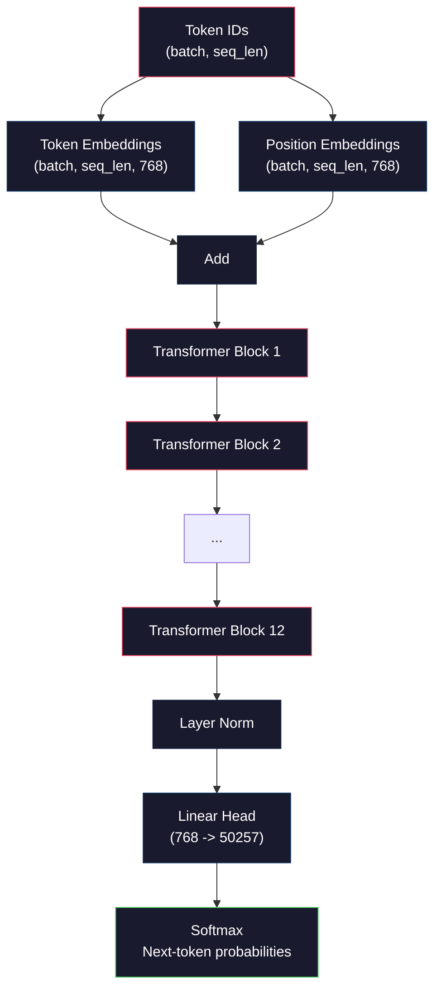
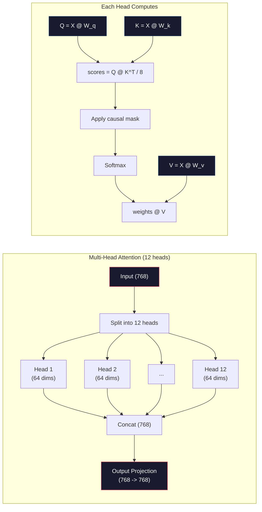
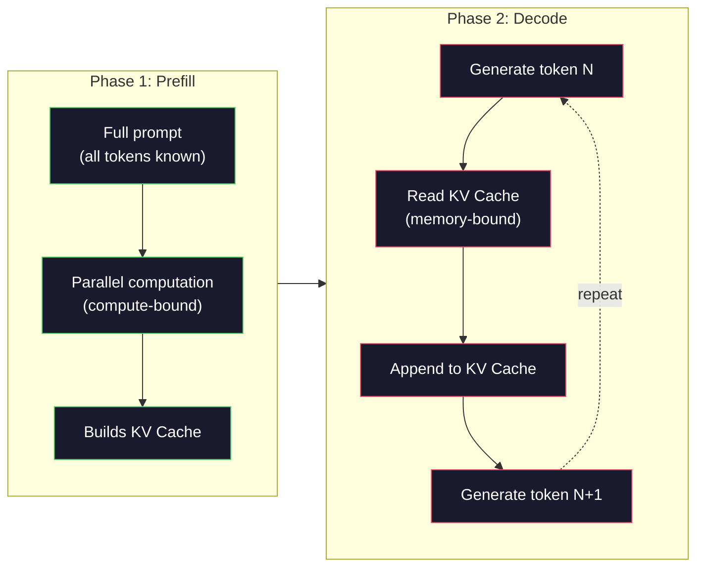

# Training trước một chiếc Mini GPT (124 triệu Parameters)

> GPT-2 Small có 124 triệu parameters. Đó là 12 lớp transformer, 12 đầu attention và embeddings 768 chiều. Bạn có thể huấn luyện nó từ đầu trên một GPU duy nhất trong vài giờ. Hầu hết mọi người không bao giờ làm điều này. Họ sử dụng checkpoints được huấn luyện trước. Nhưng nếu bạn không tự huấn luyện, bạn không thực sự hiểu điều gì đang xảy ra bên trong model bạn đang xây dựng sản phẩm.

**Loại:** Xây dựng
**Ngôn ngữ:** Python (with numpy)
**Kiến thức tiên quyết:** Giai đoạn 10, Bài 01-03 (Tokenizers, Xây dựng Tokenizer, Dữ liệu Pipelines)
**Thời lượng:** ~120 phút

## Mục tiêu học tập

- Triển khai kiến trúc GPT-2 đầy đủ (124M parameters) từ đầu: token embeddings, embeddings vị trí, khối transformer và đầu model ngôn ngữ
- Huấn luyện GPT model trên kho dữ liệu văn bản bằng cách sử dụng dự đoán token tiếp theo với loss entropy chéo
- Triển khai tạo văn bản tự hồi quy với tính năng lọc temperature sampling và top-k/top-p
- Theo dõi các đường cong training loss và xác nhận rằng model học các mẫu ngôn ngữ mạch lạc

## Vấn đề

Bạn biết transformer là gì. Bạn đã đọc các sơ đồ. Bạn có thể đọc thuộc lòng "attention là tất cả những gì bạn cần" và vẽ các hộp có nhãn "Multi-Head Attention" trên bảng trắng.

Không có nghĩa là bạn hiểu điều gì sẽ xảy ra khi model tạo văn bản.

Có 124.438.272 parameters trong GPT-2 Nhỏ (có ràng buộc trọng lượng). Mỗi một trong số chúng được thiết lập bằng cách chạy một vòng lặp training: forward pass, tính toán loss, backward pass, cập nhật trọng số. Mười hai khối transformer. Mười hai attention đầu mỗi khối. Một không gian embedding 768 chiều. Từ vựng 50.257 tokens. Mỗi khi model tạo ra một token, tất cả 124 triệu parameters tham gia vào một chuỗi nhân ma trận duy nhất lấy một chuỗi các ID token và tạo ra phân phối xác suất trong token tiếp theo.

Nếu bạn chưa bao giờ tự xây dựng cái này, bạn đang làm việc với một hộp đen. Bạn có thể sử dụng API. Bạn có thể fine-tune. Nhưng khi điều gì đó xảy ra sai lầm - khi model ảo giác, khi nó lặp lại chính nó, khi nó từ chối tuân theo hướng dẫn - bạn không có model tinh thần cho *tại sao*.

Bài học này xây dựng GPT-2 Small từ đầu. Không phải trong PyTorch. Trong numpy. Mọi phép nhân ma trận đều có thể nhìn thấy. Mọi gradient đều được tính toán bởi mã của bạn. Bạn sẽ thấy chính xác cách 124 triệu số âm mưu dự đoán từ tiếp theo.

## Khái niệm

### Kiến trúc GPT

GPT là một model ngôn ngữ tự hồi quy. "Tự hồi quy" có nghĩa là nó tạo ra một token tại một thời điểm, mỗi tokens có điều kiện trên tất cả các  trước đó. Kiến trúc là một stack của các khối transformer decoder.

Dưới đây là biểu đồ tính toán đầy đủ từ token ID đến xác suất token tiếp theo:

1. Token ID xuất hiện. Hình dạng: (batch_size, seq_len).
2. Token embedding tra cứu. Mỗi mã nhận dạng ánh xạ đến một vector 768 chiều. Hình dạng: (batch_size, seq_len, 768).
3. Vị trí embedding tra cứu. Mỗi vị trí (0, 1, 2, ...) ánh xạ đến một vector 768 chiều. Cùng một hình dạng.
4. Thêm token embeddings + vị trí embeddings.
5. Đi qua 12 khối transformer.
6. Chuẩn hóa lớp cuối cùng.
7. Phép chiếu tuyến tính đến kích thước từ vựng. Hình dạng: (batch_size, seq_len, vocab_size).
8. Softmax để có được xác suất.

Đó là toàn bộ model. Không có chập. Không lặp lại. Chỉ cần embeddings, attention, mạng chuyển tiếp và định mức lớp xếp chồng lên nhau 12 lần.



### Khối Transformer

Mỗi khối trong số 12 khối tuân theo cùng một khuôn mẫu. Kiến trúc pre-norm (GPT-2 sử dụng pre-norm, không phải post-norm như transformer gốc):

1. LayerNorm
2. Self-Attention nhiều đầu
3. Kết nối còn lại (thêm lại đầu vào)
4. LayerNorm
5. Mạng chuyển tiếp nguồn cấp dữ liệu (MLP)
6. Kết nối còn lại (thêm lại đầu vào)

Các kết nối còn lại là rất quan trọng. Nếu không có chúng, gradients biến mất khi chúng đến khối 1 trong quá trình backpropagation. Với chúng, gradients có thể chảy trực tiếp từ loss đến bất kỳ lớp nào thông qua con đường "bỏ qua". Đây là lý do tại sao bạn có thể stack 12, 32 hoặc thậm chí 96 khối (GPT-4 được đồn đại là sử dụng 120).

### Attention: Cơ chế cốt lõi

Self-attention cho phép mọi token xem xét mọi token trước đó và quyết định mức độ quan tâm đến từng cú đích. Đây là phép toán.

Đối với mỗi vị trí token, hãy tính ba vectors từ đầu vào:
- **Truy vấn (Q)**: "Tôi đang tìm kiếm gì?"
- **Chìa khóa (K)**: "Tôi chứa những gì?"
- **Giá trị (V)**: "Tôi mang theo thông tin gì?"

```
Q = input @ W_q    (768 -> 768)
K = input @ W_k    (768 -> 768)
V = input @ W_v    (768 -> 768)

attention_scores = Q @ K^T / sqrt(d_k)
attention_scores = mask(attention_scores)   # causal mask: -inf for future positions
attention_weights = softmax(attention_scores)
output = attention_weights @ V
```

Mặt nạ nhân quả là thứ làm cho GPT tự hồi quy. Vị trí 5 có thể tham gia vào các vị trí 0-5 nhưng không phải 6, 7, 8, v.v. Điều này ngăn model "gian lận" bằng cách nhìn vào tokens trong tương lai trong training.

**Multi-head attention** chia không gian 768 chiều thành 12 đầu, mỗi đầu 64 chiều. Mỗi đầu học một mẫu attention khác nhau. Một đầu có thể theo dõi các mối quan hệ cú pháp (thỏa thuận chủ ngữ-động từ). Một đầu khác có thể theo dõi sự tương đồng về ngữ nghĩa (từ đồng nghĩa). Một đầu khác có thể theo dõi sự gần gũi của vị trí (các từ lân cận). Đầu ra từ tất cả 12 đầu được nối và chiếu trở lại 768 chiều.



Phép chia theo sqrt (d_k) - sqrt (64) = 8 - là tỷ lệ. Nếu không có nó, các sản phẩm chấm phát triển lớn trong high-dimensional vectors, đẩy softmax vào các khu vực mà gradients gần bằng không. Đây là một trong những hiểu biết chính trong bài báo "Attention là tất cả những gì bạn cần" ban đầu.

### KV Cache: Tại sao Inference lại nhanh

Trong training, bạn process toàn bộ chuỗi cùng một lúc. Trong inference, bạn tạo một token tại một thời điểm. Nếu không tối ưu hóa, việc tạo token N yêu cầu tính toán lại attention cho tất cả N-1 tokens trước đó. Đó là O (N ^ 2) trên mỗi token được tạo ra, hoặc tổng O (N ^ 3) cho một dãy có độ dài N.

KV Cache giải quyết vấn đề này. Sau khi tính K và V cho mỗi token, hãy lưu trữ chúng. Khi tạo token N+1, bạn chỉ cần tính toán Q cho token mới và tra cứu K và V được lưu trong bộ nhớ cache từ tất cả các tokens trước đó. Điều này làm giảm chi phí mỗi token từ O(N) đến O(1) cho phép tính K và V. Cách tính điểm attention vẫn là O(N) vì bạn tham gia vào tất cả các vị trí trước đó, nhưng bạn tránh được phép nhân ma trận dư thừa trên đầu vào.

Đối với GPT-2 có 12 lớp và 12 đầu, KV cache lưu trữ 2 (K + V) x 12 lớp x 12 đầu x 64 độ mờ = 18.432 giá trị mỗi token. Đối với chuỗi 1024-token, đó là khoảng 75MB trong FP32. Đối với Llama 3 405B với 128 lớp, KV cache cho một trình tự có thể vượt quá 10GB. Đây là lý do tại sao inference ngữ cảnh dài bị ràng buộc với bộ nhớ.

### Điền trước vs Giải mã: Hai giai đoạn Inference

Khi bạn gửi prompt đến một LLM, inference xảy ra trong hai giai đoạn riêng biệt.

**Điền trước** processes song song toàn bộ prompt của bạn. Tất cả các tokens đều đã biết, vì vậy model có thể tính toán attention cho tất cả các vị trí cùng một lúc. Giai đoạn này bị ràng buộc bởi tính toán -- GPU đang thực hiện phép nhân ma trận ở thông lượng đầy đủ. Đối với 1000 token prompt trên A100, quá trình điền trước mất khoảng 20-50 mili giây.

**Giải mã** tạo tokens từng cái một. Mỗi token mới phụ thuộc vào tất cả các tokens trước đó. Giai đoạn này bị ràng buộc với bộ nhớ - nút cổ chai là đọc trọng số model và KV cache từ bộ nhớ GPU, không phải bản thân toán học ma trận. Các lõi tính toán của GPU hầu như không hoạt động chờ đọc bộ nhớ. Đối với GPT-2, mỗi bước giải mã mất khoảng thời gian giống nhau bất kể matmul yêu cầu bao nhiêu FLOPs, bởi vì băng thông bộ nhớ là ràng buộc.

Sự khác biệt này quan trọng đối với các hệ thống production. Điền trước thang thông lượng bằng GPU tính toán (nhiều FLOPS hơn = điền trước nhanh hơn). Giải mã quy mô thông lượng bằng băng thông bộ nhớ (bộ nhớ nhanh hơn = giải mã nhanh hơn). Đó là lý do tại sao H100 của NVIDIA tập trung vào cải tiến băng thông bộ nhớ so với A100 - nó trực tiếp tăng tốc độ token thế hệ.



### Vòng lặp Training

Training một LLM là dự đoán token tiếp theo. Cho tokens [0, 1, 2, ..., N-1], dự đoán tokens [1, 2, 3, ..., N]. Hàm loss là entropy chéo giữa phân phối xác suất dự đoán của model và token tiếp theo thực tế.

Một bước training:

1. **Forward pass**: Chạy batch qua tất cả 12 khối. Nhận logits (điểm trước khi softmax) cho mỗi vị trí.
2. **Tính toán loss**: Entropy chéo giữa logits và tokens mục tiêu (đầu vào dịch chuyển một vị trí).
3. **Backward pass**: Tính gradients cho tất cả 124 triệu parameters sử dụng backpropagation.
4. **Bước Optimizer**: Cập nhật trọng lượng. GPT-2 sử dụng Adam với learning rate khởi động và phân rã cosin.

Lịch trình learning rate quan trọng hơn bạn có thể mong đợi. GPT-2 nóng lên từ 0 đến đỉnh learning rate trong 2.000 bước đầu tiên, sau đó phân rã theo đường cong cosin. Bắt đầu với learning rate cao khiến model phân kỳ. Giữ tốc độ cao không đổi gây ra dao động trong training sau. Mô hình khởi động sau đó phân rã được sử dụng bởi mọi LLM chính.

### GPT-2 Nhỏ: Những con số

| Thành phần | Hình dạng | Parameters |
|-----------|-------|------------|
| Token embeddings | (50257, 768) | 38,597,376 |
| Vị trí embeddings | (1024, 768) | 786,432 |
| attention mỗi khối (W_q, W_k, W_v, W_out) | 4 x (768, 768) | 2,359,296 |
| FFN trên mỗi khối (lên + xuống) | (768, 3072) + (3072, 768) | 4,718,592 |
| Định mức lớp trên mỗi khối (2x) | 2 x 768 x 2 | 3,072 |
| LayerNorm cuối cùng | 768 x 2 | 1,536 |
| **Tổng số mỗi khối** || **7,080,960** |
| **Tổng số (12 block)** || **85.054.464 + 39.383.808 = 124.438.272** |

Phép chiếu đầu ra (đầu logits) chia sẻ trọng số với ma trận token embedding. Điều này được gọi là ràng buộc trọng lượng - nó làm giảm số lượng parameter xuống 38M và cải thiện hiệu suất vì nó buộc model sử dụng cùng một không gian biểu diễn cho đầu vào và đầu ra.

## Tự xây dựng

### Bước 1: Embedding Layer

Token embeddings ánh xạ từng tokens trong số 50.257 có thể có với một vector 768 chiều. Vị trí embeddings thêm thông tin về vị trí của mỗi token trong chuỗi. Cả hai được tổng hợp.

```python
import numpy as np

class Embedding:
    def __init__(self, vocab_size, embed_dim, max_seq_len):
        self.token_embed = np.random.randn(vocab_size, embed_dim) * 0.02
        self.pos_embed = np.random.randn(max_seq_len, embed_dim) * 0.02

    def forward(self, token_ids):
        seq_len = token_ids.shape[-1]
        tok_emb = self.token_embed[token_ids]
        pos_emb = self.pos_embed[:seq_len]
        return tok_emb + pos_emb
```

Độ lệch chuẩn 0,02 để khởi tạo đến từ bài báo GPT-2. Quá lớn và các đường chuyển tiếp ban đầu tạo ra các giá trị cực đoan làm mất ổn định training. Quá nhỏ và đầu ra ban đầu gần giống nhau đối với tất cả các đầu vào, làm cho các tín hiệu gradient sớm trở nên vô dụng.

### Bước 2: Self-Attention với mặt nạ nhân quả

Một đầu attention trước. Mặt nạ nhân quả đặt các vị trí trong tương lai thành vô cực âm trước khi softmax, đảm bảo mỗi vị trí chỉ có thể tham gia vào chính nó và các vị trí trước đó.

```python
def attention(Q, K, V, mask=None):
    d_k = Q.shape[-1]
    scores = Q @ K.transpose(0, -1, -2 if Q.ndim == 4 else 1) / np.sqrt(d_k)
    if mask is not None:
        scores = scores + mask
    weights = np.exp(scores - scores.max(axis=-1, keepdims=True))
    weights = weights / weights.sum(axis=-1, keepdims=True)
    return weights @ V
```

Việc triển khai softmax trừ đi giá trị lớn nhất trước khi cấp mũ. Nếu không có điều này, exp (large_number) sẽ tràn đến vô cực. Đây là một thủ thuật ổn định số không thay đổi đầu ra vì softmax (x - c) = softmax (x) cho bất kỳ hằng số c nào.

### Bước 3: Multi-Head Attention

Chia đầu vào 768 chiều thành 12 đầu, mỗi đầu 64 chiều. Mỗi đầu tính toán attention độc lập. Nối kết quả và chiếu trở lại 768 chiều.

```python
class MultiHeadAttention:
    def __init__(self, embed_dim, num_heads):
        self.num_heads = num_heads
        self.head_dim = embed_dim // num_heads
        self.W_q = np.random.randn(embed_dim, embed_dim) * 0.02
        self.W_k = np.random.randn(embed_dim, embed_dim) * 0.02
        self.W_v = np.random.randn(embed_dim, embed_dim) * 0.02
        self.W_out = np.random.randn(embed_dim, embed_dim) * 0.02

    def forward(self, x, mask=None):
        batch, seq_len, d = x.shape
        Q = (x @ self.W_q).reshape(batch, seq_len, self.num_heads, self.head_dim).transpose(0, 2, 1, 3)
        K = (x @ self.W_k).reshape(batch, seq_len, self.num_heads, self.head_dim).transpose(0, 2, 1, 3)
        V = (x @ self.W_v).reshape(batch, seq_len, self.num_heads, self.head_dim).transpose(0, 2, 1, 3)

        scores = Q @ K.transpose(0, 1, 3, 2) / np.sqrt(self.head_dim)
        if mask is not None:
            scores = scores + mask
        weights = np.exp(scores - scores.max(axis=-1, keepdims=True))
        weights = weights / weights.sum(axis=-1, keepdims=True)
        attn_out = weights @ V

        attn_out = attn_out.transpose(0, 2, 1, 3).reshape(batch, seq_len, d)
        return attn_out @ self.W_out
```

Điệu nhảy reshape-transpose-reshape là phần khó hiểu nhất của multi-head attention. Đây là những gì xảy ra: (batch, seq_len, 768) tensor trở thành (batch, seq_len, 12, 64), sau đó (batch, 12, seq_len, 64). Bây giờ mỗi cái trong số 12 cái đầu có ma trận (seq_len, 64) riêng để chạy attention. Sau attention, chúng ta đảo ngược process: (batch, 12, seq_len, 64) trở thành (batch, seq_len, 12, 64) trở thành (batch, seq_len, 768).

### Bước 4: Transformer chặn

Một khối transformer hoàn chỉnh: LayerNorm, multi-head attention với dư, LayerNorm, chuyển tiếp với dư.

```python
class LayerNorm:
    def __init__(self, dim, eps=1e-5):
        self.gamma = np.ones(dim)
        self.beta = np.zeros(dim)
        self.eps = eps

    def forward(self, x):
        mean = x.mean(axis=-1, keepdims=True)
        var = x.var(axis=-1, keepdims=True)
        return self.gamma * (x - mean) / np.sqrt(var + self.eps) + self.beta


class FeedForward:
    def __init__(self, embed_dim, ff_dim):
        self.W1 = np.random.randn(embed_dim, ff_dim) * 0.02
        self.b1 = np.zeros(ff_dim)
        self.W2 = np.random.randn(ff_dim, embed_dim) * 0.02
        self.b2 = np.zeros(embed_dim)

    def forward(self, x):
        h = x @ self.W1 + self.b1
        h = np.maximum(0, h)  # GELU approximation: ReLU for simplicity
        return h @ self.W2 + self.b2


class TransformerBlock:
    def __init__(self, embed_dim, num_heads, ff_dim):
        self.ln1 = LayerNorm(embed_dim)
        self.attn = MultiHeadAttention(embed_dim, num_heads)
        self.ln2 = LayerNorm(embed_dim)
        self.ffn = FeedForward(embed_dim, ff_dim)

    def forward(self, x, mask=None):
        x = x + self.attn.forward(self.ln1.forward(x), mask)
        x = x + self.ffn.forward(self.ln2.forward(x))
        return x
```

Mạng feedforward mở rộng đầu vào 768 chiều lên 3.072 chiều (4x), áp dụng tính phi tuyến, sau đó chiếu trở lại 768. Mô hình mở rộng-co lại này cung cấp cho model một biểu diễn bên trong "rộng hơn" để làm việc ở mỗi vị trí. GPT-2 sử dụng GELU kích hoạt, nhưng chúng tôi sử dụng ReLU ở đây để đơn giản hóa - sự khác biệt là nhỏ để hiểu kiến trúc.

### Bước 5: GPT Model đầy đủ

Stack 12 khối transformer. Thêm layer embedding ở phía trước và phép chiếu đầu ra ở phía sau.

```python
class MiniGPT:
    def __init__(self, vocab_size=50257, embed_dim=768, num_heads=12,
                 num_layers=12, max_seq_len=1024, ff_dim=3072):
        self.embedding = Embedding(vocab_size, embed_dim, max_seq_len)
        self.blocks = [
            TransformerBlock(embed_dim, num_heads, ff_dim)
            for _ in range(num_layers)
        ]
        self.ln_f = LayerNorm(embed_dim)
        self.vocab_size = vocab_size
        self.embed_dim = embed_dim

    def forward(self, token_ids):
        seq_len = token_ids.shape[-1]
        mask = np.triu(np.full((seq_len, seq_len), -1e9), k=1)

        x = self.embedding.forward(token_ids)
        for block in self.blocks:
            x = block.forward(x, mask)
        x = self.ln_f.forward(x)

        logits = x @ self.embedding.token_embed.T
        return logits

    def count_parameters(self):
        total = 0
        total += self.embedding.token_embed.size
        total += self.embedding.pos_embed.size
        for block in self.blocks:
            total += block.attn.W_q.size + block.attn.W_k.size
            total += block.attn.W_v.size + block.attn.W_out.size
            total += block.ffn.W1.size + block.ffn.b1.size
            total += block.ffn.W2.size + block.ffn.b2.size
            total += block.ln1.gamma.size + block.ln1.beta.size
            total += block.ln2.gamma.size + block.ln2.beta.size
        total += self.ln_f.gamma.size + self.ln_f.beta.size
        return total
```

Lưu ý trọng lượng ràng buộc: `logits = x @ self.embedding.token_embed.T`. Phép chiếu đầu ra sử dụng lại ma trận token embedding (chuyển vị). Đây không chỉ là một thủ thuật tiết kiệm parameter. Nó có nghĩa là model sử dụng cùng một không gian vector để hiểu tokens (embeddings) và dự đoán chúng (đầu ra).

### Bước 6: Vòng lặp Training

Để chạy training thực sự trên parameters 124M, bạn sẽ cần một GPU và PyTorch. Vòng lặp training này thể hiện cơ chế trên một model nhỏ chạy trong numpy thuần túy. Chúng ta sử dụng một model nhỏ (4 lớp, 4 đầu, 128 độ mờ) để làm cho nó dễ điều khiển.

```python
def cross_entropy_loss(logits, targets):
    batch, seq_len, vocab_size = logits.shape
    logits_flat = logits.reshape(-1, vocab_size)
    targets_flat = targets.reshape(-1)

    max_logits = logits_flat.max(axis=-1, keepdims=True)
    log_softmax = logits_flat - max_logits - np.log(
        np.exp(logits_flat - max_logits).sum(axis=-1, keepdims=True)
    )

    loss = -log_softmax[np.arange(len(targets_flat)), targets_flat].mean()
    return loss


def train_mini_gpt(text, vocab_size=256, embed_dim=128, num_heads=4,
                   num_layers=4, seq_len=64, num_steps=200, lr=3e-4):
    tokens = np.array(list(text.encode("utf-8")[:2048]))
    model = MiniGPT(
        vocab_size=vocab_size, embed_dim=embed_dim, num_heads=num_heads,
        num_layers=num_layers, max_seq_len=seq_len, ff_dim=embed_dim * 4
    )

    print(f"Model parameters: {model.count_parameters():,}")
    print(f"Training tokens: {len(tokens):,}")
    print(f"Config: {num_layers} layers, {num_heads} heads, {embed_dim} dims")
    print()

    for step in range(num_steps):
        start_idx = np.random.randint(0, max(1, len(tokens) - seq_len - 1))
        batch_tokens = tokens[start_idx:start_idx + seq_len + 1]

        input_ids = batch_tokens[:-1].reshape(1, -1)
        target_ids = batch_tokens[1:].reshape(1, -1)

        logits = model.forward(input_ids)
        loss = cross_entropy_loss(logits, target_ids)

        if step % 20 == 0:
            print(f"Step {step:4d} | Loss: {loss:.4f}")

    return model
```

loss bắt đầu gần ln(vocab_size) - đối với từ vựng cấp byte 256 token, đó là ln(256) = 5,55. Một model ngẫu nhiên gán xác suất bằng nhau cho mỗi token. Khi training tiến triển, loss giảm xuống vì model học cách dự đoán các mẫu phổ biến: "th" sau "t", khoảng trắng sau một khoảng thời gian, v.v.

Trong production, bạn sẽ sử dụng Adam optimizer với tích lũy gradient, khởi động learning rate và cắt gradient. Vòng lặp chuyển tiếp loss cập nhật lùi giống hệt nhau. Các optimizer phức tạp hơn.

### Bước 7: Tạo văn bản

Thế hệ sử dụng model được huấn luyện để dự đoán từng token một. Mỗi dự đoán được lấy mẫu từ phân phối đầu ra (hoặc tham lam được coi là argmax).

```python
def generate(model, prompt_tokens, max_new_tokens=100, temperature=0.8):
    tokens = list(prompt_tokens)
    seq_len = model.embedding.pos_embed.shape[0]

    for _ in range(max_new_tokens):
        context = np.array(tokens[-seq_len:]).reshape(1, -1)
        logits = model.forward(context)
        next_logits = logits[0, -1, :]

        next_logits = next_logits / temperature
        probs = np.exp(next_logits - next_logits.max())
        probs = probs / probs.sum()

        next_token = np.random.choice(len(probs), p=probs)
        tokens.append(next_token)

    return tokens
```

Temperature kiểm soát tính ngẫu nhiên. Temperature 1.0 sử dụng phân phối thô. Temperature 0.5 làm sắc nét nó (xác định hơn - model chọn các lựa chọn hàng đầu thường xuyên hơn). Temperature 1.5 làm phẳng nó (ngẫu nhiên hơn - xác suất thấp tokens có cơ hội lớn hơn). Temperature 0.0 là giải mã tham lam (luôn chọn xác suất cao nhất token).

Cửa sổ `tokens[-seq_len:]` là cần thiết vì model có độ dài ngữ cảnh tối đa (1024 cho GPT-2). Khi bạn vượt quá nó, bạn phải bỏ tokens cũ nhất. Đây là "context window" mà mọi người nói đến.

```figure
sampling-decoder
```

## Ứng dụng

### Bản demo thế hệ và Training đầy đủ

```python
corpus = """The transformer architecture has revolutionized natural language processing.
Attention mechanisms allow the model to focus on relevant parts of the input.
Self-attention computes relationships between all pairs of positions in a sequence.
Multi-head attention splits the representation into multiple subspaces.
Each attention head can learn different types of relationships.
The feedforward network provides nonlinear transformations at each position.
Residual connections enable gradient flow through deep networks.
Layer normalization stabilizes training by normalizing activations.
Position embeddings give the model information about token ordering.
The causal mask ensures autoregressive generation during training.
Pre-training on large text corpora teaches the model general language understanding.
Fine-tuning adapts the pre-trained model to specific downstream tasks."""

model = train_mini_gpt(corpus, num_steps=200)

prompt = list("The transformer".encode("utf-8"))
output_tokens = generate(model, prompt, max_new_tokens=100, temperature=0.8)
generated_text = bytes(output_tokens).decode("utf-8", errors="replace")
print(f"\nGenerated: {generated_text}")
```

Trên một kho dữ liệu nhỏ với một model nhỏ, văn bản được tạo ra sẽ là bán mạch lạc tốt nhất. Nó sẽ học một số mẫu cấp byte từ văn bản training nhưng không thể khái quát hóa theo cách GPT-2 làm với 40GB dữ liệu training và kiến trúc parameter 124M đầy đủ. Vấn đề không phải là chất lượng đầu ra. Vấn đề là bạn có thể trace từng bước: tra cứu embedding, tính toán attention, chuyển đổi chuyển tiếp, chiếu logit, softmax và sampling. Mọi hoạt động đều có thể nhìn thấy.

## Sản phẩm bàn giao

Bài học này tạo ra `outputs/prompt-gpt-architecture-analyzer.md` - một prompt phân tích các lựa chọn kiến trúc trong bất kỳ GPT-style model nào. Cung cấp cho nó một thẻ model hoặc báo cáo kỹ thuật và nó chia nhỏ các quyết định phân bổ parameter, thiết kế attention và mở rộng quy mô.

## Bài tập

1. Sửa đổi model để sử dụng 24 lớp và 16 đầu thay vì 12/12. Đếm số parameters. Làm thế nào để tăng gấp đôi chiều sâu so với tăng gấp đôi chiều rộng (embedding kích thước)?

2. Triển khai chức năng kích hoạt GELU (GELU(x) = x * 0.5 * (1 + erf(x / sqrt(2)))) và thay thế ReLU trong mạng chuyển tiếp. Chạy training trong 500 bước với mỗi lần kích hoạt và so sánh loss cuối cùng.

3. Thêm một KV cache vào chức năng tạo. Lưu trữ K và V tensors cho mỗi lớp sau forward pass đầu tiên và sử dụng lại chúng cho các tokens tiếp theo. Đo tốc độ: tạo 200 tokens có và không có bộ nhớ cache và so sánh thời gian đồng hồ treo tường.

4. Thực hiện top-k sampling (chỉ xem xét tokens xác suất cao nhất k) và top-p sampling (sampling hạt nhân: xem xét tập hợp nhỏ nhất của tokens có xác suất tích lũy vượt quá p). So sánh chất lượng đầu ra ở temperature 0,8 với top-k=50 so với top-p=0,95.

5. Xây dựng một máy vẽ đường cong training loss. Huấn luyện model cho 1000 bước và vẽ biểu đồ loss so với bước. Xác định ba giai đoạn: giảm tốc ban đầu nhanh (học các byte phổ biến), giai đoạn giữa chậm hơn (học các mẫu byte) và cao nguyên (overfitting trên kho dữ liệu nhỏ). Hình dạng của đường cong này giống nhau cho dù bạn đang training model 128 mờ hay GPT-4.

## Thuật ngữ chính

| Thuật ngữ | Những gì mọi người nói | Ý nghĩa thực sự của nó |
|------|----------------|----------------------|
| Tự hồi quy | "Nó tạo ra từng từ một" | Mỗi token đầu ra được điều chỉnh trên tất cả các tokens trước đó - model dự đoán P(token_n \ | token_0, ..., token_{n-1}) |
| Mặt nạ nhân quả | "Nó không thể nhìn thấy tương lai" | Một ma trận tam giác trên của các giá trị -vô cực ngăn attention đến các vị trí trong tương lai trong quá trình training |
| Multi-head attention | "Nhiều mẫu attention" | Chia Q, K, V thành các đầu song song (ví dụ: 12 đầu, mỗi đầu 64 độ mờ cho GPT-2) để mỗi đầu có thể học các loại mối quan hệ khác nhau |
| KV Cache | "Bộ nhớ đệm cho tốc độ" | Lưu trữ tensors Khóa và Giá trị được tính toán từ tokens trước để tránh tính toán dư thừa trong quá trình tạo tự hồi quy |
| Điền trước | "Xử lý prompt" | Giai đoạn đầu tiên inference trong đó tất cả các prompt tokens được xử lý song song - ràng buộc tính toán trên GPU FLOPS |
| Giải mã | "Tạo ra tokens" | Giai đoạn thứ hai inference trong đó tokens được tạo ra từng cái một - bộ nhớ bị ràng buộc trên băng thông GPU |
| Buộc trọng lượng | "Chia sẻ embeddings" | Sử dụng cùng một ma trận cho token embeddings đầu vào và đầu chiếu đầu ra - tiết kiệm 38 triệu tham số trong GPT-2 |
| Kết nối còn lại | "Bỏ qua kết nối" | Thêm đầu vào trực tiếp vào đầu ra của một lớp con (x + lớp con (x)) - cho phép luồng gradient trong các mạng sâu |
| Chuẩn hóa lớp | "Bình thường hóa kích hoạt" | Chuẩn hóa trên chiều feature có nghĩa là 0 và variance 1, với thang đo và bias parameters có thể học được |
| loss entropy chéo | "Dự đoán sai như thế nào" | -log(xác suất được gán cho đúng token tiếp theo), tính trung bình trên tất cả các vị trí -- mục tiêu LLM training tiêu chuẩn |

## Đọc thêm

- [Radford et al., 2019 -- "Language Models are Unsupervised Multitask Learners" (GPT-2)](https://cdn.openai.com/better-language-models/language_models_are_unsupervised_multitask_learners.pdf) - bài báo GPT-2 giới thiệu dòng parameter 124 triệu đến 1,5 tỷ
- [Vaswani et al., 2017 -- "Attention Is All You Need"](https://arxiv.org/abs/1706.03762) - giấy transformer ban đầu với attention và multi-head attention sản phẩm chấm được chia tỷ lệ
- [Llama 3 Technical Report](https://arxiv.org/abs/2407.21783) - cách Meta mở rộng kiến trúc GPT lên 405B parameters với 16K GPUs
- [Pope et al., 2022 -- "Efficiently Scaling Transformer Inference"](https://arxiv.org/abs/2211.05102) -- bài báo chính thức hóa việc điền trước so với giải mã và phân tích KV cache
