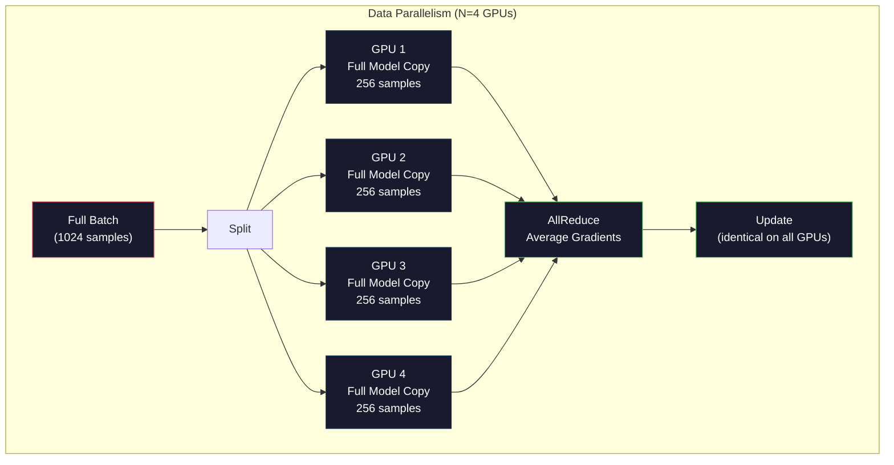
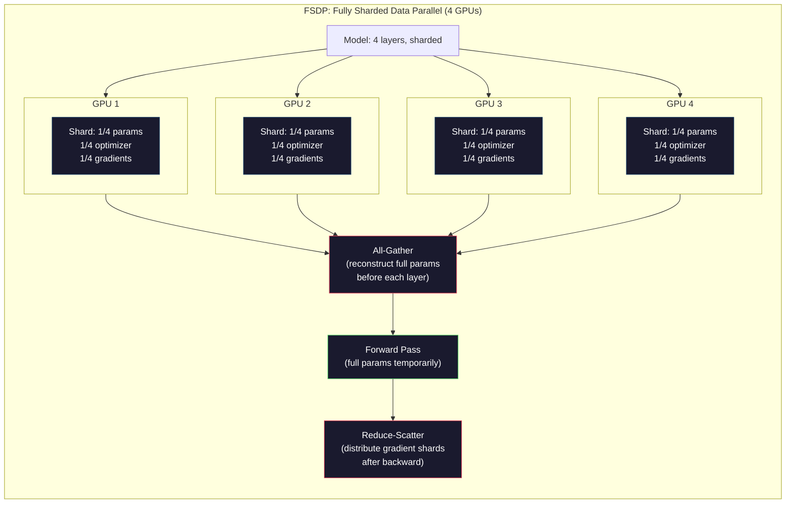
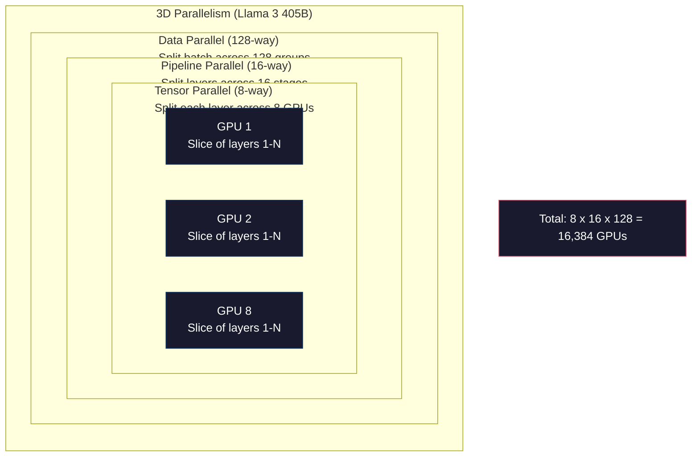

# Mở rộng quy mô: Training phân tán, FSDP, DeepSpeed

> 124 triệu model của bạn được huấn luyện trên một GPU. Bây giờ hãy thử 7 tỷ parameters. model không vừa với bộ nhớ. Dữ liệu mất hàng tuần trên một máy duy nhất. training phân tán không phải là tùy chọn trên quy mô lớn. Đó là con đường duy nhất phía trước.

**Loại:** Xây dựng
**Ngôn ngữ:** Python
**Kiến thức tiên quyết:** Giai đoạn 10, Bài 04 (Training trước một GPT mini)
**Thời lượng:** ~120 phút

## Mục tiêu học tập

- Giải thích ba loại song song (dữ liệu, tensor, pipeline) và khi nào cần thiết dựa trên model và kích thước cụm
- Triển khai training song song dữ liệu bằng DDP PyTorch đồng bộ hóa gradient trên nhiều GPUs
- Tính toán ngân sách bộ nhớ cho một kích thước model nhất định (trọng số + optimizer trạng thái + gradients + kích hoạt) để xác định phần cứng tối thiểu
- Cấu hình FSDP hoặc DeepSpeed ZeRO stages để phân mảnh các trạng thái model trên GPUs và phù hợp với models vượt quá bộ nhớ một GPU

## Vấn đề

Một parameter model 7B trong FP16 chỉ cần 14GB cho trọng lượng. Adam optimizer lưu trữ hai bản sao bổ sung của mỗi parameter (ước tính thời điểm đầu tiên và thứ hai). Đó là 28GB khác. Gradients trong quá trình backpropagation thêm 14GB nữa. Bạn đang ở mức 56GB trước khi một lần kích hoạt được lưu trữ.

Một NVIDIA A100 có 80GB bộ nhớ.

56GB trong số 80GB được tiêu thụ. Điều đó còn lại 24GB cho các kích hoạt -- các giá trị trung gian được tính toán trong forward pass phải được duy trì trong backpropagation. Đối với chuỗi 2048-token với model 4096 chiều, kích hoạt của một lớp sử dụng khoảng 64MB. Với 32 lớp, bạn cần 2GB cho mỗi mẫu. Kích thước batch 8 yêu cầu 16GB. Bạn có 24GB. Kích thước batch 12 sẽ tăng lên.

Bây giờ hãy thử 70B parameters. Trọng lượng một mình: 140GB trong FP16. Không phù hợp với một GPU. Bạn cần ít nhất 2 A100 (2 x 80GB = 160GB) chỉ để giữ trọng lượng. Thêm optimizer trạng thái và gradients và bạn cần nhiều hơn nữa: tối thiểu 3+ GPUs và thực tế là 8-16 tùy thuộc vào chiến lược sharding.

Llama 3 405B được huấn luyện trên 16.384 NVIDIA GPUs H100. Việc chạy training tiêu tốn khoảng $100 million in compute. DeepSeek V3 trained a comparable model for roughly $5,6 triệu do thông minh về kiến trúc (Sự kết hợp của các chuyên gia có nghĩa là chỉ một phần nhỏ parameters kích hoạt mỗi token) và hiệu quả training.

Bài học này bao gồm bốn chiến lược giúp training quy mô lớn trở nên khả thi: song song dữ liệu, song song tensor, song song pipeline và song song dữ liệu phân mảnh hoàn toàn. Bạn sẽ mô phỏng từng chiến lược trong Python thuần túy để hiểu cơ chế trước khi chạm vào training framework phân tán.

## Khái niệm

### Tại sao cần phân phối

Đây là toán học trí nhớ cho models thực. Mọi con số đều được tính toán, không phải ước tính.

| Model | Tham số | Trọng lượng (FP16) | Adam Tiểu bang | Gradients (FP16) | Tổng số (không kích hoạt) |
|-------|--------|----------------|-------------|------------------|----------------------|
| GPT-2 Nhỏ | 124 triệu | 248 MB | 992 MB | 248 MB | 1,5 GB |
| Llama 3 8B | 8 tỷ | 16 GB | 64 GB | 16 GB | 96 GB |
| Llama 3 70B | 70 tỷ | 140 GB | 560 GB | 140 GB | 840 GB |
| Llama 3 405B | 405 tỷ | 810 GB | 3.240 GB | 810 GB | 4.860 GB |

Cột "Adam trạng thái" là kẻ giết người. Adam lưu trữ giá trị trung bình chạy (m) và variance chạy (v) cho mỗi parameter, cả hai đều trong FP32. Đối với model 70B, đó là 70B x 4 byte x 2 = 560GB. Chỉ riêng optimizer cần bảy A100.

Một H100 duy nhất có 80GB. Llama 3 405B cần ít nhất 61 H100 để giữ trọng lượng, optimizer và gradients. Thêm kích hoạt và con số tăng lên hơn nữa. Meta đã sử dụng 16.384 GPUs không phải vì họ muốn - bởi vì họ phải làm vậy.

### Song song dữ liệu

Chiến lược phân tán đơn giản nhất. Sao chép toàn bộ model vào N GPUs. Chia mỗi training batch thành N phần bằng nhau. Mỗi GPU chạy một chuyển tiếp và backward pass trên phân đoạn dữ liệu của nó. Sau khi backward pass, tính trung bình gradients trên tất cả GPUs. Mỗi GPU cập nhật bản sao trọng số của mình với cùng một gradients trung bình, giữ cho tất cả các bản sao được đồng bộ.

**Tốt:** Tỷ lệ thông lượng tuyến tính. N GPUs process N lần dữ liệu nhiều hơn mỗi bước. Giao tiếp bị giới hạn ở gradient tính trung bình, trùng lặp với tính toán.

**Điều xấu: **Mỗi GPU chứa một bản sao hoàn chỉnh của model, trạng thái optimizer và gradients. Đối với model 70B, mỗi GPU cần 840GB. Tính song song dữ liệu không làm giảm bộ nhớ trên mỗi GPU. Nó chỉ làm giảm thời gian training.

**Toán học: **Kích thước batch hiệu quả = per_gpu_batch_size x N. Đối với N = 64 GPUs với mỗi GPU batch là 16, batch hiệu quả là 1,024. Llama 3 sử dụng kích thước batch hiệu quả là 16 triệu tokens mỗi bước.



### Tensor Song song

Chia các lớp riêng lẻ trên GPUs. Một phép nhân ma trận duy nhất được chia cho GPUs, mỗi phần tính toán của kết quả.

Hãy xem xét một ma trận trọng số của hình dạng (8192, 8192) trong một lớp chuyển tiếp. Với tính song song tensor 4 chiều, mỗi GPU chứa một phân đoạn (8192, 2048). Mỗi GPU nhân đầu vào với phân đoạn của nó, tạo ra một kết quả một phần. Các kết quả một phần được kết hợp (thông qua all-reduce hoặc all-gather) để tạo ra đầu ra đầy đủ.

**Tốt:** Giảm bộ nhớ trên mỗi GPU cho model trọng lượng. 70B model chia thành 8 GPUs có nghĩa là mỗi GPU chứa ~8,75B parameters trọng lượng.

**Điều xấu: **Yêu cầu giao tiếp giữa các GPU nhanh sau mỗi lớp. Giảm tất cả sau mỗi matmul làm tăng thêm độ trễ. Điều này hoạt động tốt với NVLink (900 GB/s giữa GPUs trên cùng một nút) nhưng kém trên các nút được kết nối bởi InfiniBand (400 Gb/s, khoảng 50 GB/s). Tensor song song hầu như luôn bị giới hạn trong một nút duy nhất (8 GPUs).

**Sử dụng thực tế: **Megatron-LM đi tiên phong tensor tính song song. Llama 3 405B sử dụng tính song song tensor 8 chiều trong mỗi nút.

### Pipeline Song song

Chia model theo các lớp. GPU 1 chạy các lớp 1-8. GPU 2 chạy các lớp 9-16. GPU 3 chạy các lớp 17-24. GPU 4 chạy các lớp 25-32. Dữ liệu chảy qua pipeline: GPU 1 tính toán các lớp của nó và gửi các kích hoạt đến GPU 2, tính toán các lớp của nó và gửi đến GPU 3, v.v.

**Tốt: **Giao tiếp tối thiểu giữa GPUs - chỉ kích hoạt ở ranh giới lớp, nhỏ so với gradients hoặc trọng lượng. Hoạt động trên các nút vì yêu cầu băng thông thấp.

**Điều xấu: **Pipeline bong bóng. Khi GPU 4 đang tính toán forward pass trên micro-batch 1, GPUs 1, 2 và 3 không hoạt động (chúng đã chuyển tiếp phần của mình). Trong quá trình backward pass, mô hình đảo ngược. Với đường ống ngây thơ, việc sử dụng GPU chỉ 1/N cho N pipeline stages.

**GPipe và PipeDream** giải quyết vấn đề bong bóng bằng cách chia batch thành batches vi mô. GPU 1 bắt đầu trên micro-batch 2 ngay sau khi kết thúc chuyển tiếp micro-batch 1. Điều này chồng chéo tính toán qua các giai đoạn pipeline. Với M micro-batches và N stages, phần bong bóng giảm xuống (N-1) / M. Sử dụng M = 16 micro-batches với N = 4 stages và bong bóng là 3/16 = 18.75% thời gian nhàn rỗi.

### FSDP: Dữ liệu phân mảnh hoàn toàn song song

FSDP kết hợp khả năng mở rộng của tính song song dữ liệu với hiệu quả bộ nhớ của sharding. Thay vì mỗi GPU chứa một bản sao hoàn chỉnh của model, mỗi GPU chỉ chứa 1/N trạng thái parameters, gradients và optimizer.

Trước khi một lớp forward pass, FSDP chạy **all-gather** để thu thập toàn bộ parameters từ tất cả GPUs vào bộ nhớ của mỗi GPU. Sau khi forward pass, mỗi GPU loại bỏ parameters không cục bộ. Trong quá trình lùi, all-gather chạy lại để tái tạo parameters cho gradient tính toán. Sau backward pass, **reduce-scatter** phân phối gradient phân đoạn để mỗi GPU chỉ lưu trữ 1/N gradients.

**Toán học cho một model 70 tỷ vào ngày 8 GPUs:**

| Thành phần | Không có FSDP | Với FSDP |
|-----------|-------------|-----------|
| Trọng lượng (FP16) | 140 GB mỗi GPU | 17,5 GB mỗi GPU |
| Adam tiểu bang (FP32) | 560 GB mỗi GPU | 70 GB mỗi GPU |
| Gradients (FP16) | 140 GB mỗi GPU | 17,5 GB mỗi GPU |
| **Tổng** | **840 GB mỗi GPU** | **105 GB mỗi GPU** |

Nếu không có FSDP, bạn không thể lắp một model 70B trên một GPU 80GB. Với FSDP trên 8 GPUs, mỗi GPU sử dụng 105GB - chờ đã, điều đó vẫn không vừa. Bạn cần ít nhất 16 GPUs để có được dưới 80GB mỗi GPU hoặc bạn kết hợp FSDP với điểm kiểm tra kích hoạt (tính toán lại các kích hoạt trong quá trình lùi thay vì lưu trữ chúng).

Chi phí giao tiếp cao hơn so với song song dữ liệu vani vì tất cả thu thập trước mỗi lớp. Nhưng việc tiết kiệm bộ nhớ khiến việc chạy training trước đây không thể thực hiện được.



### ZeRO tốc độ sâu

ZeRO của DeepSpeed (Zero Redundancy Optimizer) về mặt khái niệm giống với FSDP nhưng được phát triển độc lập bởi Microsoft. Nó xác định ba giai đoạn, mỗi giai đoạn sharding tích cực hơn:

| Sân khấu | Mảnh vỡ | Tiết kiệm bộ nhớ | Giao tiếp |
|-------|--------|---------------|---------------|
| ZeRO-1 · | Chỉ Optimizer trạng thái | Giảm ~4x | Tương tự như song song dữ liệu |
| ZeRO-2 · | + Gradients | Giảm ~8x | Nhiều hơn một chút |
| ZeRO-3 · | + Parameters | ~ Giảm Nx (N GPUs) | Thu thập tất cả mỗi lớp |

ZeRO-3 tương đương với FSDP. Cách đặt tên khác nhau, cơ chế giống nhau. PyTorch đã thêm FSDP làm triển khai gốc sau khi DeepSpeed chứng minh khái niệm này.

DeepSpeed cũng giới thiệu ZeRO-Offload (giảm tải optimizer trạng thái cho CPU RAM, rẻ hơn và lớn hơn) và ZeRO-Infinity (giảm tải cho SSD NVMe). Những tốc độ tính toán này đánh đổi tốc độ tính toán cho dung lượng bộ nhớ - các hoạt động giảm tải chậm hơn nhưng giải phóng bộ nhớ GPU.

### Mixed Precision Training

Modern training sử dụng đồng thời nhiều định dạng dấu phẩy động:

- **Forward pass**: FP16 hoặc BF16 (16-bit). Một nửa bộ nhớ của FP32. Matmuls chạy nhanh hơn 2 lần trên tensor lõi.
- **Trọng lượng chính**: FP32 (32-bit). Được duy trì bởi optimizer cho precision số trong quá trình cập nhật trọng lượng.
- **Loss tỷ lệ**: Nhân loss với một hằng số lớn trước khi backward pass để ngăn gradients FP16 chảy xuống bằng không. Chia cho cùng một hằng số trước bước optimizer.

BF16 (Brain Float 16) có cùng phạm vi số mũ như FP32 (8 bit số mũ) nhưng giảm precision (7 bit mantissa so với 23 bit của FP32). Nó hiếm khi cần loss tỷ lệ vì nó có thể đại diện cho cùng một phạm vi giá trị. FP16 có 5 bit số mũ và 10 bit mantissa - nó có thể biểu diễn các giá trị chi tiết nhưng overflows/underflows ở độ lớn cực lớn.

Google TPUs sử dụng BF16 nguyên bản. A100 và H100 của NVIDIA hỗ trợ cả FP16 và BF16. Ngành công nghiệp phần lớn đã chuyển sang BF16 vì nó loại bỏ loss đau đầu về quy mô.

**So sánh bộ nhớ cho model 7B:**

| Precision | Trọng lượng | Optimizer | Gradients | Tổng cộng |
|-----------|---------|-----------|-----------|-------|
| FP32 ở khắp mọi nơi | 28 GB | 56 GB | 28 GB | 112 GB |
| Hỗn hợp (BF16 + FP32 master) | 14 GB | 56 GB | 14 GB | 84 GB |

Mixed precision tiết kiệm 28GB cho model này. Các trạng thái optimizer vẫn ở FP32 bất kể - đây là nơi hầu hết bộ nhớ đi.

### Megatron-LM và song song 3D

training quy mô lớn thực sự kết hợp cả ba song song:

- **Tính song song dữ liệu** trên các nhóm nút (tỷ lệ batch kích thước)
- **Tensor song song **trong một nút (chia các lớp thành 8 GPUs)
- **Pipeline song song** giữa các nút (phân chia các nhóm lớp trên các máy)

Llama 3 405B trên 16.384 chiếc H100:
- Độ song song tensor 8 chiều trong mỗi nút (8 GPUs mỗi nút)
- Độ song song pipeline 16 chiều giữa các nút (16 pipeline stages)
- Độ song song dữ liệu 128 chiều trên chiều còn lại (16.384 / 8 / 16 = 128)

Phân tách 3D này (8 x 16 x 128 = 16.384) là cách bạn mở rộng quy mô lên hàng nghìn GPUs. Mỗi GPU thấy một phân đoạn dữ liệu khác nhau (dữ liệu song song), giữ một lát cắt của mỗi lớp (tensor song song) và tính toán một tập hợp các lớp khác nhau (pipeline song song).

DeepSeek V3 đã thực hiện một cách tiếp cận khác. Kiến trúc Hỗn hợp các chuyên gia của họ chỉ kích hoạt 37 tỷ trong số 671 tỷ parameters mỗi token. Điều này có nghĩa là mỗi GPU chỉ cần tính toán (và lưu trữ các kích hoạt cho) parameters đang hoạt động. Họ đã huấn luyện trên 2.048 GPUs H800 - ít hơn 1/8 số lượng GPU của Meta - trong $5.6M vs Meta's estimated $100M.



```figure
paged-kv-cache
```

## Tự xây dựng

### Bước 1: Mô phỏng song song dữ liệu

Chia một batch trên các GPUs mô phỏng. Mỗi GPU tính toán một forward pass trên phân đoạn của nó. Tính trung bình "gradients" (chúng tôi mô phỏng chúng dưới dạng giá trị loss).

```python
import numpy as np

def simulate_data_parallelism(data, num_gpus, model_fn):
    batch_size = len(data)
    shard_size = batch_size // num_gpus
    remainder = batch_size % num_gpus

    gpu_losses = []
    gpu_gradients = []

    offset = 0
    for gpu_id in range(num_gpus):
        extra = 1 if gpu_id < remainder else 0
        shard = data[offset:offset + shard_size + extra]
        offset += shard_size + extra

        loss, grad = model_fn(shard)
        gpu_losses.append(loss)
        gpu_gradients.append(grad)

    avg_loss = np.mean(gpu_losses)
    avg_gradient = np.mean(gpu_gradients, axis=0)

    return avg_loss, avg_gradient
```

Thao tác giảm tất cả (trung bình gradients) là giao tiếp duy nhất trong song song dữ liệu. Trong thực tế, điều này sử dụng thư viện NCCL trên NVIDIA GPUs, thực hiện giảm tất cả vòng: mỗi GPU gửi 1/N gradients của nó đến hàng xóm của nó, nhận 1/N từ hàng xóm kia và sau các bước N-1, mỗi GPU đều có giá trị trung bình hoàn toàn. Tổng volume giao tiếp: 2 x gradient_size x (N-1) / N, gần gấp 2 lần kích thước gradient đối với N lớn.

### Bước 2: Mô phỏng Tensor song song

Chia một ma trận trọng số trên GPUs. Mỗi GPU tính toán một phép nhân ma trận từng phần. Kết hợp các kết quả.

```python
def simulate_tensor_parallelism(input_data, weight_matrix, num_gpus):
    d_in, d_out = weight_matrix.shape
    assert d_out % num_gpus == 0, f"d_out {d_out} not divisible by num_gpus {num_gpus}"
    shard_size = d_out // num_gpus

    partial_results = []
    for gpu_id in range(num_gpus):
        start = gpu_id * shard_size
        end = start + shard_size
        weight_shard = weight_matrix[:, start:end]

        partial = input_data @ weight_shard
        partial_results.append(partial)

    full_output = np.concatenate(partial_results, axis=-1)

    direct_output = input_data @ weight_matrix
    error = np.abs(full_output - direct_output).max()

    return full_output, error
```

Sai số phải chính xác bằng không (hoặc epsilon máy). Tensor song song là chính xác về mặt toán học - nó tạo ra kết quả tương tự như tính toán matmul đầy đủ trên một GPU. Sự phân tách dọc theo kích thước đầu ra, vì vậy mỗi GPU tạo ra một đoạn cột khác nhau và nối lại kết quả đầy đủ.

Đối với các lớp tuyến tính song song cột (tách kích thước đầu ra), bạn nối. Đối với song song hàng (tách kích thước đầu vào), bạn tổng. Trong FFN transformer, tuyến tính đầu tiên (mở rộng) sử dụng song song cột và tuyến tính thứ hai (hợp đồng) sử dụng song song hàng. Điều này tránh được sự giảm tất cả giữa hai lớp.

### Bước 3: Mô phỏng Pipeline song song

Chia các lớp của model trên các GPUs ảo. Hiển thị vấn đề bong bóng trong đó giai đoạn đầu không hoạt động trong khi các giai đoạn sau tính toán.

```python
def simulate_pipeline_parallelism(num_layers, num_stages, num_microbatches):
    layers_per_stage = num_layers // num_stages

    timeline = {}
    clock = 0

    for mb in range(num_microbatches):
        for stage in range(num_stages):
            start_time = max(
                timeline.get((stage, mb - 1, "fwd"), (0, 0))[1] if mb > 0 else 0,
                timeline.get((stage - 1, mb, "fwd"), (0, 0))[1] if stage > 0 else 0,
            )
            end_time = start_time + layers_per_stage
            timeline[(stage, mb, "fwd")] = (start_time, end_time)

    last_fwd_end = max(v[1] for v in timeline.values())

    for mb in range(num_microbatches - 1, -1, -1):
        for stage in range(num_stages - 1, -1, -1):
            deps = [last_fwd_end]
            if mb < num_microbatches - 1 and (stage, mb + 1, "bwd") in timeline:
                deps.append(timeline[(stage, mb + 1, "bwd")][1])
            if stage < num_stages - 1 and (stage + 1, mb, "bwd") in timeline:
                deps.append(timeline[(stage + 1, mb, "bwd")][1])
            start_time = max(deps)
            end_time = start_time + layers_per_stage
            timeline[(stage, mb, "bwd")] = (start_time, end_time)

    total_time = max(v[1] for v in timeline.values())
    compute_time = num_microbatches * num_stages * layers_per_stage * 2
    bubble_fraction = 1.0 - compute_time / (total_time * num_stages)

    return timeline, total_time, bubble_fraction
```

Với 4 giai đoạn và 1 batch siêu nhỏ, tỷ lệ bong bóng là 75% - ba trong số bốn GPUs không hoạt động bất cứ lúc nào. Với 16 batches vi mô, nó giảm xuống còn khoảng 19%. Chi phí loại bỏ bong bóng là bộ nhớ: bạn phải lưu trữ các kích hoạt cho tất cả các batches vi mô đang bay cùng một lúc.

### Bước 4: Máy tính bộ nhớ

Tính toán các yêu cầu bộ nhớ chính xác cho training bất kỳ kích thước model nào.

```python
def memory_calculator(
    params_billions,
    precision_bytes=2,
    optimizer="adam",
    num_gpus=1,
    sharding="none",
    sequence_length=2048,
    batch_size_per_gpu=1,
    hidden_dim=None,
    num_layers=None,
):
    params = params_billions * 1e9

    weight_memory = params * precision_bytes

    if optimizer == "adam":
        optimizer_memory = params * 4 * 2
    elif optimizer == "sgd":
        optimizer_memory = params * 4
    else:
        optimizer_memory = 0

    gradient_memory = params * precision_bytes

    total_no_activation = weight_memory + optimizer_memory + gradient_memory

    if hidden_dim and num_layers:
        activation_per_layer = (
            sequence_length * batch_size_per_gpu * hidden_dim * precision_bytes * 4
        )
        activation_memory = activation_per_layer * num_layers
    else:
        activation_memory = params * precision_bytes * 0.5

    if sharding == "fsdp" or sharding == "zero3":
        weight_memory /= num_gpus
        optimizer_memory /= num_gpus
        gradient_memory /= num_gpus
    elif sharding == "zero2":
        optimizer_memory /= num_gpus
        gradient_memory /= num_gpus
    elif sharding == "zero1":
        optimizer_memory /= num_gpus

    per_gpu_total = weight_memory + optimizer_memory + gradient_memory + activation_memory

    return {
        "params_billions": params_billions,
        "weights_gb": weight_memory / 1e9,
        "optimizer_gb": optimizer_memory / 1e9,
        "gradients_gb": gradient_memory / 1e9,
        "activations_gb": activation_memory / 1e9,
        "per_gpu_total_gb": per_gpu_total / 1e9,
        "total_across_gpus_gb": per_gpu_total * num_gpus / 1e9,
        "fits_on_80gb": per_gpu_total / 1e9 <= 80,
        "num_gpus": num_gpus,
        "sharding": sharding,
    }
```

Máy tính này trả lời câu hỏi mà mọi kỹ sư ML hỏi: "Tôi cần bao nhiêu GPUs?" Cung cấp cho nó kích thước model và xem nó có phù hợp hay không. Điều chỉnh chiến lược sharding cho đến khi tổng số GPU giảm xuống dưới 80GB.

### Bước 5: Mô phỏng Mixed Precision

So sánh mức sử dụng bộ nhớ giữa FP32, FP16 và mixed precision training.

```python
def mixed_precision_comparison(params_billions):
    params = params_billions * 1e9

    fp32_weights = params * 4
    fp32_optimizer = params * 4 * 2
    fp32_gradients = params * 4
    fp32_total = fp32_weights + fp32_optimizer + fp32_gradients

    fp16_weights = params * 2
    fp16_master = params * 4
    fp16_optimizer = params * 4 * 2
    fp16_gradients = params * 2
    fp16_total = fp16_weights + fp16_master + fp16_optimizer + fp16_gradients

    mixed_weights = params * 2
    mixed_optimizer = params * 4 * 2
    mixed_gradients = params * 2
    mixed_total = mixed_weights + mixed_optimizer + mixed_gradients

    return {
        "fp32_total_gb": fp32_total / 1e9,
        "fp16_with_master_gb": fp16_total / 1e9,
        "mixed_bf16_gb": mixed_total / 1e9,
        "savings_vs_fp32": 1 - mixed_total / fp32_total,
    }
```

Điều ngạc nhiên lớn nhất đối với hầu hết mọi người: mixed precision không giảm một nửa bộ nhớ. Các trạng thái optimizer (m và v của Adam) vẫn ở FP32 bất kể precision. Đối với model 7B, FP32 training sử dụng 112GB. Mixed precision sử dụng 84GB. Đó là mức giảm 25%, không phải 50%. optimizer chiếm ưu thế.

## Ứng dụng

### Chạy tất cả các mô phỏng

```python
def run_all_demos():
    print("=" * 70)
    print("DATA PARALLELISM SIMULATION")
    print("=" * 70)

    np.random.seed(42)
    data = np.random.randn(64, 32)
    weight = np.random.randn(32, 16)

    def model_fn(batch):
        output = batch @ weight
        loss = np.mean(output ** 2)
        grad = 2 * batch.T @ (batch @ weight) / len(batch)
        return loss, grad

    for n_gpus in [1, 2, 4, 8]:
        loss, grad = simulate_data_parallelism(data, n_gpus, model_fn)
        print(f"  {n_gpus} GPUs: loss={loss:.4f}, grad_norm={np.linalg.norm(grad):.4f}")

    print()
    print("=" * 70)
    print("TENSOR PARALLELISM SIMULATION")
    print("=" * 70)

    x = np.random.randn(4, 8192)
    W = np.random.randn(8192, 8192)

    for n_gpus in [1, 2, 4, 8]:
        output, error = simulate_tensor_parallelism(x, W, n_gpus)
        print(f"  {n_gpus} GPUs: output_shape={output.shape}, max_error={error:.2e}")

    print()
    print("=" * 70)
    print("PIPELINE PARALLELISM SIMULATION")
    print("=" * 70)

    for n_mb in [1, 4, 8, 16, 32]:
        _, total_t, bubble = simulate_pipeline_parallelism(32, 4, n_mb)
        print(f"  {n_mb:2d} micro-batches: total_time={total_t:4d}, bubble={bubble:.1%}")

    print()
    print("=" * 70)
    print("MEMORY CALCULATOR")
    print("=" * 70)

    configs = [
        (7, "none", 1),
        (7, "fsdp", 8),
        (70, "none", 1),
        (70, "fsdp", 8),
        (70, "fsdp", 16),
        (405, "fsdp", 64),
        (405, "fsdp", 128),
    ]

    print(f"  {'Model':>8} {'Sharding':>8} {'GPUs':>5} {'Per-GPU':>10} {'Fits 80GB':>10}")
    print("  " + "-" * 50)
    for params, shard, gpus in configs:
        result = memory_calculator(params, num_gpus=gpus, sharding=shard)
        fits = "Yes" if result["fits_on_80gb"] else "No"
        print(f"  {params:>6}B {shard:>8} {gpus:>5} {result['per_gpu_total_gb']:>8.1f}GB {fits:>10}")

    print()
    print("=" * 70)
    print("MIXED PRECISION COMPARISON")
    print("=" * 70)

    for params_b in [7, 13, 70, 405]:
        result = mixed_precision_comparison(params_b)
        print(f"  {params_b}B: FP32={result['fp32_total_gb']:.0f}GB, "
              f"Mixed BF16={result['mixed_bf16_gb']:.0f}GB, "
              f"Savings={result['savings_vs_fp32']:.0%}")
```

## Sản phẩm bàn giao

Bài học này tạo ra `outputs/prompt-distributed-training-planner.md` - một prompt có kích thước model và phần cứng có sẵn, sau đó tạo ra một kế hoạch training phân tán hoàn chỉnh: chiến lược song song, ngân sách bộ nhớ, chi phí giao tiếp và thông lượng dự kiến.

## Bài tập

1. Sửa đổi máy tính bộ nhớ để bao gồm điểm kiểm tra kích hoạt. Với điểm kiểm tra, chỉ lưu trữ các kích hoạt ở mọi lớp thứ K (điển hình là K = 1, nghĩa là tính toán lại tất cả). Hiển thị sự đánh đổi giữa bộ nhớ và tính toán: điểm kiểm tra tiết kiệm bao nhiêu bộ nhớ và nó làm chậm bao nhiêu training (tính toán nhiều hơn khoảng 33% cho điểm kiểm tra đầy đủ)?

2. Mở rộng mô phỏng song song pipeline để thực hiện lịch trình 1F1B (một tiến, một lùi) được PipeDream sử dụng. So sánh phần bong bóng với lịch trình ngây thơ cho 4 giai đoạn và 8 batches vi mô. Lịch trình 1F1B nên có bộ nhớ đỉnh nhỏ hơn vì nó bắt đầu lùi sớm hơn.

3. Triển khai trình mô phỏng tích lũy gradient. Thay vì giảm tất cả sau mỗi batch vi mô, tích lũy gradients cục bộ cho K bước, sau đó giảm tất cả. Cho thấy điều này làm giảm giao tiếp K lần nhưng tạo ra gradients cuối cùng giống hệt nhau như thế nào (và do đó training giống hệt nhau).

4. Xây dựng công cụ ước tính chi phí. Với kích thước model, số lượng token mục tiêu, loại GPU (A100 tại $2/hr, H100 at $ 3.50/hr) và chiến lược song song, hãy ước tính tổng chi phí training tính bằng đô la. Xác thực dựa trên các chi phí đã biết: Llama 3 405B được báo cáo có chi phí ~$100M, DeepSeek V3 cost ~$5,6 triệu.

5. Thêm ZeRO-Offload vào máy tính bộ nhớ. Giả sử CPU RAM là 512GB cho mỗi nút và NVMe là 2TB. Cho biết cách giảm tải trạng thái optimizer thành CPU cho phép model 70B huấn luyện trên 4 GPUs thay vì 16, với chi phí chậm hơn 30-50% optimizer bước.

## Thuật ngữ chính

| Thuật ngữ | Những gì mọi người nói | Ý nghĩa thực sự của nó |
|------|----------------|----------------------|
| Song song dữ liệu | "Sao chép model cho mọi GPU" | Mỗi GPU processes một phân đoạn dữ liệu khác nhau; gradients được tính trung bình thông qua all-reduce sau mỗi bước |
| Tensor song song | "Tách một lớp trên GPUs" | Ma trận trọng lượng phân vùng để mỗi GPU tính toán một phần của matmul; yêu cầu kết nối NVLink nhanh |
| Pipeline song song | "Chia các lớp trên GPUs" | Mỗi GPU chạy một nhóm lớp khác nhau; dữ liệu chảy qua pipeline với micro-batches để giảm bong bóng |
| FSDP | "Mảnh vỡ mọi thứ" | Song song dữ liệu phân mảnh hoàn toàn -- mỗi GPU chứa 1/N trạng thái trọng số, gradients và optimizer; tất cả trước khi tính toán |
| ZeRO | "Phiên bản FSDP của DeepSpeed" | Zero Redundancy Optimizer với 3 giai đoạn: optimizer phân đoạn (Giai đoạn 1), + gradients (Giai đoạn 2), + parameters (Giai đoạn 3) |
| Giảm tất cả | "Trung bình trên GPUs" | Hoạt động tập thể trong đó mỗi GPU kết thúc bằng tổng (hoặc trung bình) của tất cả các đầu vào của GPUs - thường được thực hiện dưới dạng vòng giảm tất cả |
| Tập hợp tất cả | "Thu thập từ mọi GPUs" | Hoạt động tập thể trong đó mọi GPU kết thúc bằng việc nối tất cả dữ liệu của GPUs - được sử dụng trong FSDP để tái tạo toàn bộ parameters |
| Giảm tán xạ | "Tổng và phân phối" | Hoạt động tập thể làm giảm (tổng) dữ liệu và phân tán các phần khác nhau thành các GPUs khác nhau - được sử dụng trong FSDP cho gradient sharding |
| Mixed precision | "Huấn luyện trong nửa precision" | Sử dụng FP16/BF16 cho forward/backward và FP32 cho optimizer trạng thái -- tiết kiệm ~25% bộ nhớ, không phải 50%, vì optimizer chiếm ưu thế |
| Pipeline bong bóng | "Thời gian nhàn rỗi trong pipeline" | Một phần thời gian GPUs ngồi chờ dữ liệu từ giai đoạn trước - giảm bớt bằng cách sử dụng nhiều batches vi mô hơn |

## Đọc thêm

- [Rajbhandari et al., 2020 -- "ZeRO: Memory Optimizations Toward Training Trillion Parameter Models"](https://arxiv.org/abs/1910.02054) -- bài báo DeepSpeed ZeRO xác định ba giai đoạn sharding
- [Shoeybi et al., 2020 -- "Megatron-LM: Training Multi-Billion Parameter Language Models Using Model Parallelism"](https://arxiv.org/abs/1909.08053) -- NVIDIA là tensor song song đối với transformers
- [Narayanan et al., 2021 -- "Efficient Large-Scale Language Model Training on GPU Clusters Using Megatron-LM"](https://arxiv.org/abs/2104.04473) -- Song song 3D kết hợp dữ liệu, tensor và pipeline
- [Zhao et al., 2023 -- "PyTorch FSDP: Experiences on Scaling Fully Sharded Data Parallel"](https://arxiv.org/abs/2304.11277) -- triển khai FSDP gốc của PyTorch
- [Llama 3 Technical Report](https://arxiv.org/abs/2407.21783) -- 16.384 GPU training với chi tiết song song 3D
- [DeepSeek-V3 Technical Report](https://arxiv.org/abs/2412.19437) -- MoE kiến trúc giảm chi phí training như thế nào
