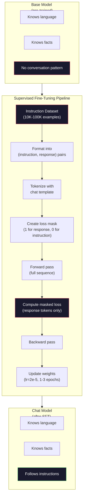

# Điều chỉnh hướng dẫn (SFT)

> Một model cơ sở dự đoán token tiếp theo. Vậy là xong. Nó không làm theo hướng dẫn, trả lời câu hỏi hoặc từ chối các yêu cầu có hại. SFT là cầu nối giữa công cụ dự đoán token và một trợ lý hữu ích. Mọi model bạn từng nói chuyện -- Claude, GPT Llama Chat -- đều trải qua bước này.

**Loại:** Xây dựng
**Ngôn ngữ:** Python (with numpy)
**Kiến thức tiên quyết:** Giai đoạn 10, Bài 04 (Training trước một GPT mini)
**Thời lượng:** ~90 phút

## Mục tiêu học tập

- Triển khai fine-tuning có giám sát (SFT) chuyển đổi model ngôn ngữ cơ sở thành trợ lý làm theo hướng dẫn
- Định dạng dữ liệu training bằng cách sử dụng các mẫu trò chuyện với vai trò hệ thống, người dùng và trợ lý, đồng thời che các loss trên tokens không phải trợ lý
- Giải thích lý do tại sao SFT là cần thiết: cơ sở models tiếp tục văn bản thay vì trả lời câu hỏi
- Đánh giá chất lượng SFT bằng cách so sánh model cơ sở so với fine-tuned model phản hồi trên một tập lệnh được giữ lại

## Vấn đề

Bạn đã huấn luyện một model trong Bài 04. Nó có thể dự đoán token tiếp theo được đưa ra một trình tự. Cung cấp cho nó "Kiến trúc transformer" và nó có thể tiếp tục với "đã cách mạng hóa xử lý ngôn ngữ tự nhiên". Điều đó thật ấn tượng đối với một dự đoán token tiếp theo.

Bây giờ hãy thử điều này: cho nó ăn "Thủ đô của Pháp là gì?" Một model cơ sở không trả lời "Paris". Nó tiếp tục mô hình. Nó có thể tạo ra "Thủ đô của Đức là gì? Thủ đô của Tây Ban Nha là gì?" bởi vì nó học được từ các tài liệu có chứa danh sách các câu hỏi. Hoặc nó có thể tạo ra "là một câu hỏi mà nhiều người hỏi" bởi vì đó là một sự tiếp nối token tiếp theo hợp lý. model không có khái niệm *trả lời*. Nó chỉ biết *tiếp tục*.

Đây là khoảng cách giữa GPT-3 (model cơ sở, phát hành tháng 6 năm 2020) và ChatGPT (điều chỉnh hướng dẫn, phát hành tháng 11 năm 2022). Cùng kiến trúc. Cùng training trước. Sự khác biệt là 20.000 đến 100.000 cặp (hướng dẫn, phản hồi) được tạo cẩn thận đã dạy model tuân theo mô hình hội thoại.

Stanford Alpaca đã chứng minh rằng bạn không cần hàng triệu ví dụ. Vào tháng 3 năm 2023, họ fine-tuned Llama 7B chỉ trên 52.000 cặp phản hồi lệnh được tạo bởi GPT-3.5. Tổng chi phí: $600. The result was a chatbot that could follow instructions, answer questions, and hold conversations. Not as good as ChatGPT, but shockingly close for $600 và vài giờ training.

Llama 2 Chat của Meta chỉ sử dụng ~27.000 ví dụ chất lượng cao cho giai đoạn SFT ban đầu. Thông tin chi tiết quan trọng: chất lượng quan trọng hơn số lượng. 27.000 ví dụ được viết bởi những người chú thích lành nghề đã đánh bại 1 triệu ví dụ ồn ào được thu thập từ internet.

## Khái niệm

### SFT thực sự làm gì

Supervised Fine-Tuning tiếp tục vòng lặp training tương tự từ training trước -- forward pass, tính toán loss, backward pass, cập nhật trọng số -- nhưng trên một loại dữ liệu khác. Thay vì văn bản thô, bạn huấn luyện về các cuộc trò chuyện có cấu trúc:

```json
{
  "system": "You are a helpful assistant.",
  "user": "What is the capital of France?",
  "assistant": "The capital of France is Paris."
}
```

Người model đã biết rằng Paris là thủ đô của Pháp. Nó đã học được điều này trong quá trình training trước trên Wikipedia, sách giáo khoa và các trang web. SFT không dạy model sự thật mới. Nó dạy cho model một hành vi mới: khi bạn nhìn thấy một câu hỏi, hãy đưa ra câu trả lời. Khi bạn nhìn thấy một hướng dẫn, hãy hoàn thành. Khi bạn thấy một yêu cầu có hại, hãy đưa ra một từ chối.

Hãy nghĩ về nó theo cách này. Pre-training cung cấp cho model kiến thức. SFT cung cấp cho model cách cư xử.

### Định dạng dữ liệu

Ba định dạng thống trị ngành. Mỗi định dạng mã hóa cùng một thông tin - ai nói gì - với các dấu phân cách khác nhau.

**Định dạng Alpaca** (Stanford, Tháng Ba 2023):

```json
{
  "instruction": "Summarize the following article in 3 sentences.",
  "input": "The European Central Bank raised interest rates...",
  "output": "The ECB increased rates by 25 basis points..."
}
```

Đơn giản và được sử dụng rộng rãi. Trường `input` là tùy chọn - nhiều hướng dẫn không cần ngữ cảnh bổ sung. Stanford đã phát hành 52.000 ví dụ ở định dạng này, được tạo ra bởi GPT-3.5 với giá 600 đô la. Điều này đã khởi động phong trào điều chỉnh hướng dẫn mã nguồn mở.

**Định dạng ShareGPT** (cộng đồng, 2023):

```json
{
  "conversations": [
    {"from": "system", "value": "You are a helpful assistant."},
    {"from": "human", "value": "What causes tides?"},
    {"from": "gpt", "value": "Tides are caused by the gravitational pull of the Moon..."},
    {"from": "human", "value": "How often do they occur?"},
    {"from": "gpt", "value": "Most coastal areas experience two high tides and two low tides per day..."}
  ]
}
```

Hỗ trợ các cuộc trò chuyện nhiều lượt. Trường "từ" sử dụng "con người" và "gpt" theo quy ước, bất kể model thực tế. Vicuna đã được huấn luyện về 70.000 cuộc trò chuyện ShareGPT được thu thập từ bản ghi ChatGPT do người dùng chia sẻ.

**Định dạng ChatML** (OpenAI, được sử dụng bởi nhiều models mã nguồn mở):

```
<|im_start|>system
You are a helpful assistant.<|im_end|>
<|im_start|>user
What is the capital of France?<|im_end|>
<|im_start|>assistant
The capital of France is Paris.<|im_end|>
```

Sử dụng tokens đặc biệt (`<|im_start|>`, `<|im_end|>`) để phân định vai trò. Những tokens này được thêm vào từ vựng của tokenizer trong quá trình fine-tuning. Qwen, Yi và nhiều models khác sử dụng ChatML.

Cả ba định dạng đều đạt được cùng một điều: chúng nói với model "đây là hướng dẫn, đây là phản ứng, hãy học mô hình này."

### Tại sao nó hoạt động

Người model đã biết ngôn ngữ từ trước khi training. Nó đã thấy hàng tỷ ví dụ về câu hỏi, sau đó là câu trả lời, hướng dẫn, sau đó là hoàn thành và cuộc trò chuyện giữa mọi người. Các mẫu đã được mã hóa trong trọng số.

SFT tập trung khả năng tiềm ẩn này. Thay vì model cần phải tìm ra từ ngữ cảnh liệu nó nên trả lời một câu hỏi hay tiếp tục một tài liệu, SFT huấn luyện rõ ràng về mô hình hội thoại. Sau vài nghìn ví dụ, model học được: khi bạn nhìn thấy điểm đánh dấu vai trò trợ lý, hãy tạo ra một phản hồi hữu ích.

Đây là lý do tại sao 27.000 ví dụ là đủ. Bạn không dạy tiếng Anh model. Bạn không dạy nó sự thật về thế giới. Bạn đang dạy nó một hành vi đơn giản: đáp ứng các hướng dẫn. Kiến thức đã ở đó.

### Mặt nạ Loss

Đây là chi tiết kỹ thuật quan trọng nhất trong SFT và hầu hết các hướng dẫn đều bỏ qua nó.

Trong quá trình training trước, bạn tính toán loss trên mỗi token. model học cách dự đoán mọi token tiếp theo trong chuỗi. Trong SFT, bạn chỉ tính toán loss trên tokens *phản hồi*. Các tokens hướng dẫn ở đó cho ngữ cảnh, nhưng model không bị phạt vì "dự đoán" chúng không chính xác.

Tại sao? Bởi vì bạn không muốn model học cách *tạo ra* hướng dẫn. Bạn muốn nó học cách *phản hồi* hướng dẫn. Nếu bạn tính toán loss trên tokens lệnh, bạn đang training model dự đoán "Thủ đô của Pháp là gì?" như thể đó là người đặt câu hỏi. Điều đó lãng phí tín hiệu gradient và có thể gây nhầm lẫn cho model về vai trò của nó.

Trong thực tế, bạn tạo một mặt nạ loss: 1 cho tokens phản hồi, 0 cho tokens lệnh. Nhân mỗi token loss với mặt nạ này trước khi tính trung bình.

```
Tokens:    [SYS] You are helpful [USER] What is the capital? [ASST] Paris is the capital [EOS]
Loss mask:   0    0    0     0      0     0   0  0     0       1     1    1   1     1      1
```

Chỉ tokens sau `[ASST]` mới đóng góp vào loss. model nhìn thấy toàn bộ cuộc trò chuyện trong forward pass (nó cần hướng dẫn để tạo ra phản hồi đúng) nhưng chỉ cập nhật trọng số của nó dựa trên mức độ dự đoán phản hồi.

### Training Hyperparameters

SFT sử dụng hyperparameters khác biệt đáng kể so với trước khi training. Bạn không training từ đầu. Bạn đang điều chỉnh một model đã hoạt động.

| Parameter | Training trước (Llama 2 7B) | SFT (Trò chuyện Llama 2) |
|-----------|---------------------------|---------------------|
| Learning rate | 3e-4 (đỉnh) | 2E-5 · |
| Epochs | 1 (dữ liệu truyền qua đơn) | 2 |
| Kích thước Batch | 4 triệu tokens | 64 ví dụ |
| Các bước khởi động | 2,000 | 0-100 |
| Giảm cân | 0.1 | 0.0-0.1 |
| Kích thước dữ liệu | tokens 2T | 27.000 ví dụ |

learning rate thấp hơn 15 lần đối với SFT. Điều này rất quan trọng. Một learning rate cao trong fine-tuning phá hủy kiến thức được huấn luyện trước. Người model "quên" những gì nó đã học và quá phù hợp với fine-tuning dataset nhỏ. Đây là sự lãng quên thảm khốc.

Hai epochs có nghĩa là model xem mỗi ví dụ training hai lần. Hơn 3 epochs trên một dataset nhỏ dẫn đến việc ghi nhớ - model bắt đầu tái tạo nguyên văn training ví dụ thay vì khái quát hóa.

### Quên thảm khốc

Fine-tuning có thể phá hủy các khả năng chung. Huấn luyện quá lâu về dữ liệu theo hướng dẫn và model mất khả năng viết mã, làm toán hoặc tạo văn bản sáng tạo. Nó trở nên rất giỏi ở định dạng cụ thể của dữ liệu training và khủng khiếp ở mọi thứ khác.

Ba biện pháp giảm thiểu:

1. **learning rate thấp.** 1e-5 đến 5e-5. Các bản cập nhật nhỏ hơn có nghĩa là ít phá hủy các features được huấn luyện trước.

2. **training ngắn. **1-3 epochs. Dừng lại trước khi model quá khớp.

3. **Kết hợp dữ liệu trước khi training.** Llama 2 Chat đã trộn một tỷ lệ nhỏ (2-5%) dữ liệu trước khi training thô vào dataset SFT. Điều này "nhắc nhở" model về các khả năng chung của nó trong khi tìm hiểu hành vi làm theo hướng dẫn mới.

### Số thực

Fine-tuning model 7B trên 10.000 cặp lệnh chất lượng cao mất khoảng 1 giờ trên một GPU NVIDIA A100 80GB. Đây là phép toán:

- 10.000 ví dụ x 512 tokens trung bình = 5,12 triệu tokens
- 2 epochs = 10,24 triệu tokens tổng
- Thông lượng A100 cho 7B model fine-tuning: ~3.000 tokens/second
- 10,24M / 3.000 = ~3.400 giây = ~57 phút

Đối với GPT mini của chúng tôi (4 lớp, 128 độ mờ), training gần như ngay lập tức. Vấn đề là hiểu cơ học, không phải quy mô.



## Tự xây dựng

### Bước 1: Hướng dẫn Dataset

Tạo một dataset hướng dẫn tổng hợp. Trong production, các công ty như Scale AI và Anthropic sử dụng người chú thích để viết những điều này. Chúng ta sẽ tạo chúng theo chương trình để chứng minh định dạng.

```python
import numpy as np

INSTRUCTION_DATA = [
    {
        "instruction": "What is the capital of France?",
        "response": "The capital of France is Paris."
    },
    {
        "instruction": "Explain gravity in one sentence.",
        "response": "Gravity is the force that attracts objects with mass toward each other."
    },
    {
        "instruction": "Write a haiku about the ocean.",
        "response": "Waves crash on the shore, salt and foam beneath the sun, endless blue expanse."
    },
    {
        "instruction": "What is 15 multiplied by 7?",
        "response": "15 multiplied by 7 is 105."
    },
    {
        "instruction": "Name three programming languages.",
        "response": "Three programming languages are Python, Rust, and TypeScript."
    },
    {
        "instruction": "Summarize photosynthesis.",
        "response": "Photosynthesis converts sunlight, water, and carbon dioxide into glucose and oxygen."
    },
    {
        "instruction": "What year did World War II end?",
        "response": "World War II ended in 1945."
    },
    {
        "instruction": "Define machine learning.",
        "response": "Machine learning is a field where algorithms learn patterns from data to make predictions."
    },
]
```

Tám ví dụ là rất nhỏ. Stanford Alpaca đã sử dụng 52.000. Nhưng cơ chế giống hệt nhau cho dù bạn có 8 hay 52.000: mã hóa, mặt nạ, tính toán loss chỉ trên các phản hồi.

### Bước 2: Tokenize với Chat Template

Chuyển đổi các cặp lệnh-phản hồi thành chuỗi token với các điểm đánh dấu vai trò đặc biệt. Các điểm đánh dấu cho model biết nơi lệnh kết thúc và nơi phản hồi bắt đầu.

```python
SPECIAL_TOKENS = {
    "INST_START": 253,
    "INST_END": 254,
    "RESP_START": 255,
}


def tokenize_instruction_pair(instruction, response, vocab_size=256):
    inst_tokens = list(instruction.encode("utf-8"))
    resp_tokens = list(response.encode("utf-8"))

    inst_tokens = [min(t, vocab_size - 4) for t in inst_tokens]
    resp_tokens = [min(t, vocab_size - 4) for t in resp_tokens]

    tokens = (
        [SPECIAL_TOKENS["INST_START"]]
        + inst_tokens
        + [SPECIAL_TOKENS["INST_END"]]
        + [SPECIAL_TOKENS["RESP_START"]]
        + resp_tokens
    )

    return tokens


def create_loss_mask(tokens):
    mask = np.zeros(len(tokens), dtype=np.float32)
    in_response = False

    for i, token in enumerate(tokens):
        if token == SPECIAL_TOKENS["RESP_START"]:
            in_response = True
            continue
        if in_response:
            mask[i] = 1.0

    return mask
```

Mặt nạ loss là tất cả các số không cho tokens hướng dẫn và tất cả các số không cho tokens phản hồi. Bản thân `RESP_START` token có mặt nạ là 0 vì nó là dấu phân cách, không phải là một phần của nội dung phản hồi.

### Bước 3: Mặt nạ Cross-Entropy Loss

Entropy chéo tiêu chuẩn, nhưng nhân với mặt nạ loss. Chỉ phản ứng tokens góp phần vào gradient.

```python
def masked_cross_entropy_loss(logits, targets, loss_mask):
    batch, seq_len, vocab_size = logits.shape
    logits_flat = logits.reshape(-1, vocab_size)
    targets_flat = targets.reshape(-1)
    mask_flat = loss_mask.reshape(-1)

    max_logits = logits_flat.max(axis=-1, keepdims=True)
    log_softmax = logits_flat - max_logits - np.log(
        np.exp(logits_flat - max_logits).sum(axis=-1, keepdims=True)
    )

    per_token_loss = -log_softmax[np.arange(len(targets_flat)), targets_flat]

    masked_loss = per_token_loss * mask_flat
    num_response_tokens = mask_flat.sum()
    if num_response_tokens == 0:
        return 0.0
    loss = masked_loss.sum() / num_response_tokens

    return loss
```

Mẫu số là `num_response_tokens` chứ không phải `seq_len`. Nếu bạn chia cho tổng độ dài trình tự, các lệnh dài hơn sẽ làm loãng tín hiệu gradient. Chia cho phản hồi token số lượng đảm bảo trọng số cho mỗi phản hồi bằng nhau token bất kể độ dài lệnh.

### Bước 4: Vòng lặp Training SFT

Sử dụng lại MiniGPT từ Bài 04. Vòng lặp training trông gần giống với training trước, nhưng có định dạng lệnh và loss ẩn

```python
import sys
import os
sys.path.insert(0, os.path.join(os.path.dirname(__file__), "..", "..", "04-pre-training-mini-gpt", "code"))
from main import MiniGPT, LayerNorm, FeedForward, MultiHeadAttention, TransformerBlock, Embedding


def sft_train(model, dataset, num_epochs=2, lr=2e-5, seq_len=64):
    formatted_data = []
    for example in dataset:
        tokens = tokenize_instruction_pair(example["instruction"], example["response"])
        mask = create_loss_mask(tokens)
        formatted_data.append((tokens, mask))

    print(f"SFT Training: {len(formatted_data)} examples, {num_epochs} epochs, lr={lr}")
    print(f"Total tokens: {sum(len(t) for t, _ in formatted_data):,}")
    print()

    losses = []

    for epoch in range(num_epochs):
        epoch_loss = 0.0
        num_batches = 0

        indices = np.random.permutation(len(formatted_data))

        for idx in indices:
            tokens, mask = formatted_data[idx]

            if len(tokens) < 3:
                continue
            if len(tokens) > seq_len:
                tokens = tokens[:seq_len]
                mask = mask[:seq_len]

            input_ids = np.array(tokens[:-1]).reshape(1, -1)
            target_ids = np.array(tokens[1:]).reshape(1, -1)
            loss_mask = np.array(mask[1:]).reshape(1, -1)

            logits = model.forward(input_ids)
            loss = masked_cross_entropy_loss(logits, target_ids, loss_mask)

            batch_size, s_len, v_size = logits.shape
            probs = np.exp(logits - logits.max(axis=-1, keepdims=True))
            probs = probs / probs.sum(axis=-1, keepdims=True)
            dlogits = probs.copy()
            dlogits[np.arange(batch_size)[:, None], np.arange(s_len), target_ids] -= 1.0

            mask_expanded = loss_mask[:, :, np.newaxis]
            num_resp = loss_mask.sum()
            if num_resp > 0:
                dlogits = dlogits * mask_expanded / num_resp

            for block in model.blocks:
                block.ffn.W1 -= lr * np.random.randn(*block.ffn.W1.shape) * 0.01
                block.ffn.W2 -= lr * np.random.randn(*block.ffn.W2.shape) * 0.01
                block.ffn.b1 -= lr * np.random.randn(*block.ffn.b1.shape) * 0.01
                block.ffn.b2 -= lr * np.random.randn(*block.ffn.b2.shape) * 0.01

            epoch_loss += loss
            num_batches += 1
            losses.append(loss)

        avg_loss = epoch_loss / max(num_batches, 1)
        print(f"Epoch {epoch + 1}/{num_epochs} | Avg Loss: {avg_loss:.4f}")

    return model, losses
```

learning rate là 2e-5, khớp với Llama 2 Chat. So sánh điều này với 3e-4 được sử dụng trong pre-training - nhỏ hơn 15 lần. gradient được che giấu: hướng dẫn tokens tạo ra gradient bằng không. Chỉ phản hồi tokens đẩy trọng số.

### Bước 5: So sánh Base và SFT Model

Toàn bộ điểm của SFT là thay đổi hành vi. Hãy đo lường nó bằng cách kiểm tra cách model phản hồi với đầu vào định dạng lệnh so với phần tiếp tục văn bản thô.

```python
def generate_response(model, prompt_tokens, max_new_tokens=50, temperature=0.8):
    tokens = list(prompt_tokens)
    seq_len = model.embedding.pos_embed.shape[0]

    for _ in range(max_new_tokens):
        context = np.array(tokens[-seq_len:]).reshape(1, -1)
        logits = model.forward(context)
        next_logits = logits[0, -1, :]

        next_logits = next_logits / max(temperature, 1e-8)
        probs = np.exp(next_logits - next_logits.max())
        probs = probs / probs.sum()
        probs = np.clip(probs, 1e-10, 1.0)
        probs = probs / probs.sum()

        next_token = np.random.choice(len(probs), p=probs)
        tokens.append(int(next_token))

    return tokens


def evaluate_instruction_following(model, instructions):
    print("Evaluating instruction following:")
    print("-" * 50)

    for instruction in instructions:
        tokens = (
            [SPECIAL_TOKENS["INST_START"]]
            + [min(t, 252) for t in list(instruction.encode("utf-8"))]
            + [SPECIAL_TOKENS["INST_END"]]
            + [SPECIAL_TOKENS["RESP_START"]]
        )

        output = generate_response(model, tokens, max_new_tokens=30, temperature=0.6)
        response_start = len(tokens)
        response_tokens = output[response_start:]
        response_bytes = bytes([t for t in response_tokens if t < 128])
        response_text = response_bytes.decode("utf-8", errors="replace")

        print(f"  Q: {instruction}")
        print(f"  A: {response_text[:80]}")
        print()
```

Trên một model nhỏ với 8 ví dụ, các phản hồi sẽ không có ý nghĩa. Đó là điều được mong đợi. Điều quan trọng là *cấu trúc*: model học cách tạo ra đầu ra sau điểm đánh dấu phản hồi thay vì tiếp tục tạo thêm lệnh.

### Bước 6: Đo lường sự lãng quên thảm khốc

So sánh khả năng dự đoán token tiếp theo của model trước và sau SFT. Nếu SFT làm hỏng khả năng chung, loss trên văn bản thô sẽ tăng lên.

```python
def measure_forgetting(model, test_text, seq_len=64):
    tokens = np.array(list(test_text.encode("utf-8")[:512]))

    total_loss = 0.0
    num_windows = 0

    for start in range(0, len(tokens) - seq_len - 1, seq_len):
        input_ids = tokens[start:start + seq_len].reshape(1, -1)
        target_ids = tokens[start + 1:start + seq_len + 1].reshape(1, -1)

        logits = model.forward(input_ids)

        batch, s_len, vocab_size = logits.shape
        logits_flat = logits.reshape(-1, vocab_size)
        targets_flat = target_ids.reshape(-1)

        max_logits = logits_flat.max(axis=-1, keepdims=True)
        log_softmax = logits_flat - max_logits - np.log(
            np.exp(logits_flat - max_logits).sum(axis=-1, keepdims=True)
        )

        loss = -log_softmax[np.arange(len(targets_flat)), targets_flat].mean()
        total_loss += loss
        num_windows += 1

    return total_loss / max(num_windows, 1)
```

Trong fine-tuning thực, bạn sẽ theo dõi chỉ số này trong suốt training. Nếu văn bản thô loss tăng hơn 10-15%, SFT của bạn quá mạnh. Giảm learning rate hoặc giảm số lượng epochs.

## Ứng dụng

### Bản demo SFT Pipeline đầy đủ

```python
if __name__ == "__main__":
    np.random.seed(42)

    test_text = """The transformer architecture processes sequences through self-attention.
Each layer applies multi-head attention followed by a feedforward network.
Residual connections and layer normalization stabilize deep networks.
The model learns to predict the next token given all previous tokens."""

    print("=" * 70)
    print("INSTRUCTION TUNING (SFT) DEMO")
    print("=" * 70)
    print()

    model = MiniGPT(
        vocab_size=256, embed_dim=128, num_heads=4,
        num_layers=4, max_seq_len=128, ff_dim=512
    )
    print(f"Model: {model.count_parameters():,} parameters")
    print(f"Config: 4 layers, 4 heads, 128 dims (mini GPT from Lesson 04)")
    print()

    print("PRE-SFT: Measuring base model loss on raw text")
    base_loss = measure_forgetting(model, test_text)
    print(f"  Base model loss: {base_loss:.4f}")
    print()

    print("=" * 70)
    print("SFT TRAINING")
    print("=" * 70)

    model, losses = sft_train(
        model, INSTRUCTION_DATA, num_epochs=3, lr=2e-5, seq_len=128
    )

    print()
    print("POST-SFT: Measuring fine-tuned model loss on raw text")
    sft_loss = measure_forgetting(model, test_text)
    print(f"  SFT model loss: {sft_loss:.4f}")
    print(f"  Change: {((sft_loss - base_loss) / base_loss * 100):+.1f}%")
    if abs(sft_loss - base_loss) / base_loss < 0.15:
        print("  Minimal forgetting (< 15% change)")
    else:
        print("  Significant forgetting detected")
    print()

    print("=" * 70)
    print("INSTRUCTION FOLLOWING EVALUATION")
    print("=" * 70)
    print()

    test_instructions = [
        "What is the capital of France?",
        "Name a programming language.",
        "Define gravity.",
    ]
    evaluate_instruction_following(model, test_instructions)

    print("=" * 70)
    print("DATA FORMAT EXAMPLES")
    print("=" * 70)
    print()

    for i, example in enumerate(INSTRUCTION_DATA[:3]):
        tokens = tokenize_instruction_pair(example["instruction"], example["response"])
        mask = create_loss_mask(tokens)
        resp_count = int(mask.sum())
        total_count = len(tokens)
        print(f"  Example {i + 1}: {total_count} tokens, {resp_count} response tokens ({resp_count/total_count:.0%} of sequence)")
        print(f"    Instruction: {example['instruction']}")
        print(f"    Response: {example['response']}")
        print()

    print("=" * 70)
    print("TRAINING LOSS CURVE")
    print("=" * 70)
    print()

    if losses:
        window = max(1, len(losses) // 5)
        for i in range(0, len(losses), window):
            chunk = losses[i:i + window]
            avg = sum(chunk) / len(chunk)
            print(f"  Steps {i:3d}-{i + len(chunk) - 1:3d}: avg loss = {avg:.4f}")
```

## Sản phẩm bàn giao

Bài học này tạo ra `outputs/prompt-sft-data-curator.md` - một prompt giúp bạn thiết kế và quản lý datasets hướng dẫn cho SFT. Với khả năng mục tiêu (tạo mã, toán học, hội thoại), nó tạo ra một kế hoạch thu thập dữ liệu với các thông số kỹ thuật định dạng, tiêu chí chất lượng và yêu cầu đa dạng.

## Bài tập

1. Thêm hỗ trợ system prompt. Sửa đổi `tokenize_instruction_pair` để chấp nhận thông báo hệ thống và thêm nó trước lệnh. Tạo 5 ví dụ với các prompts hệ thống khác nhau ("Bạn là một nhà thơ", "Bạn là một gia sư toán") và xác minh model thấy các prompts hệ thống khác nhau trong quá trình training.

2. Triển khai trộn dữ liệu. Tạo một hàm nhận dataset SFT và kho dữ liệu văn bản thô, sau đó tạo training batches trong đó 5% ví dụ là văn bản thô (không che giấu) và 95% là cặp lệnh (được che giấu). Chạy 3 epochs và so sánh chỉ số quên với training SFT thuần túy.

3. Xây dựng công cụ chấm điểm chất lượng dữ liệu. Đối với mỗi cặp lệnh-phản hồi, hãy tính: (a) độ dài phản hồi tính bằng tokens, (b) tỷ lệ lệnh trên phản hồi, (c) đa dạng từ vựng (tokens duy nhất / tổng số tokens). Lọc ra các ví dụ có độ dài phản hồi < 10 tokens hoặc đa dạng < 0,3. Cho biết cách lọc ảnh hưởng đến loss cuối cùng.

4. Thực hiện training hội thoại nhiều lượt. Mở rộng tokenization để xử lý các cuộc trò chuyện 3 lượt (trợ lý người dùng-trợ lý người dùng-trợ lý người dùng-trợ lý người dùng). Mặt nạ loss phải bao phủ cả ba lượt trợ lý. Xác minh mặt nạ là chính xác bằng cách in alignment mặt nạ token cho một người yêu cũample.

5. So sánh tốc độ học tập. Luyện tập cùng một model ba lần với lr = 1e-4, lr = 2e-5 và lr = 1e-6. Vẽ các đường cong loss. Đường chạy 1e-4 sẽ cho thấy độ dốc ban đầu nhanh nhưng loss cuối cùng (overfitting) cao hơn. Đường chạy 1e-6 hầu như không di chuyển. Đường chạy 2e-5 nên là điểm ngọt ngào.

## Thuật ngữ chính

| Thuật ngữ | Những gì mọi người nói | Ý nghĩa thực sự của nó |
|------|----------------|----------------------|
| Mạng SFT | "Fine-tuning về các cuộc trò chuyện" | Fine-Tuning có giám sát: tiếp tục training các cặp (hướng dẫn, phản hồi) với loss chỉ được tính toán khi phản hồi tokens |
| Hướng dẫn điều chỉnh | "Dạy model làm theo chỉ dẫn" | Training trên các cặp hướng dẫn-phản hồi rõ ràng để model cơ sở tìm hiểu mô hình hội thoại chứ không phải kiến thức mới |
| Mặt nạ Loss | "Bỏ qua prompt" | Đặt loss thành không cho tokens hướng dẫn để chỉ gradients luồng từ phản hồi token dự đoán |
| Trò chuyện ML | "Ngôn ngữ đánh dấu trò chuyện" | Định dạng token sử dụng '<\ | im_start\ | >` and `<\ | im_end\ | >' dấu phân cách để đánh dấu vai trò của người nói trong dữ liệu cuộc trò chuyện |
| Định dạng Alpaca | "Định dạng của Stanford" | Định dạng JSON với instruction/input/output trường, được sử dụng cho các ví dụ do GPT-3.5 tạo 52 nghìn có giá 600 đô la |
| Quên thảm khốc | "model trở nên ngu ngốc hơn" | Fine-tuning hủy các khả năng được huấn luyện trước vì các bản cập nhật gradient ghi đè kiến thức chung bằng các mẫu nhiệm vụ cụ thể |
| Buộc trọng lượng | "Chia sẻ embeddings" | Sử dụng cùng một ma trận cho đầu dự đoán token embeddings đầu vào và đầu ra, tiết kiệm parameters và cải thiện tính mạch lạc |
| Mẫu chat | "Cách bạn định dạng prompt" | Trình tự token cụ thể (điểm đánh dấu vai trò, dấu phân cách) cấu trúc một cuộc hội thoại cho model |

## Đọc thêm

- [Ouyang et al., 2022 -- "Training language models to follow instructions with human feedback" (InstructGPT)](https://arxiv.org/abs/2203.02155) -- bài báo giới thiệu điều chỉnh hướng dẫn + RLHF tại OpenAI
- [Taori et al., 2023 -- "Stanford Alpaca: An Instruction-following LLaMA Model"](https://github.com/tatsu-lab/stanford_alpaca) -- 52 nghìn ví dụ hướng dẫn với giá 600 đô la, chứng minh SFT hoạt động trên datasets nhỏ
- [Touvron et al., 2023 -- "Llama 2: Open Foundation and Fine-Tuned Chat Models"](https://arxiv.org/abs/2307.09288) -- SFT + RLHF pipeline của Meta với 27 nghìn ví dụ chất lượng cao
- [Chiang et al., 2023 -- "Vicuna: An Open-Source Chatbot Impressing GPT-4"](https://lmsys.org/blog/2023-03-30-vicuna/) -- training trên 70 nghìn cuộc trò chuyện ShareGPT
- [Zhou et al., 2023 -- "LIMA: Less Is More for Alignment"](https://arxiv.org/abs/2305.11206) -- chứng minh rằng 1.000 ví dụ được tuyển chọn cẩn thận có thể sánh ngang với SFT trên datasets lớn hơn nhiều
