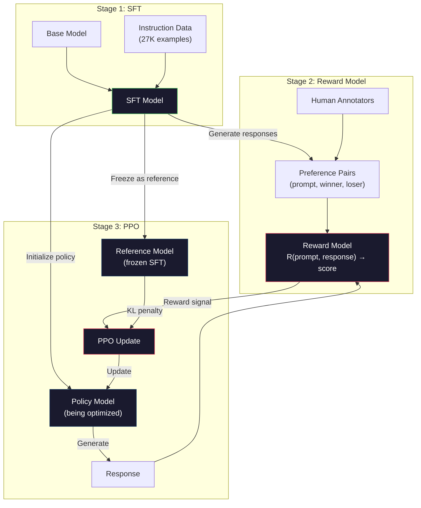
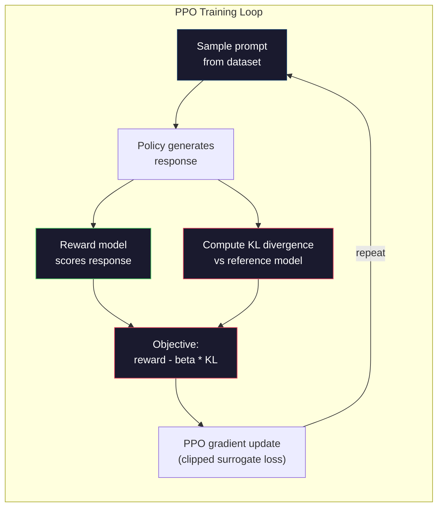

# RLHF: Phần thưởng Model + PPO

> SFT dạy model làm theo hướng dẫn. Nhưng nó không dạy cho model phản ứng nào là TỐT HƠN. Hai câu trả lời đúng ngữ pháp, chính xác thực tế có thể khác nhau rất nhiều về mức độ hữu ích. RLHF là cách bạn mã hóa phán đoán của con người vào hành vi của model. Đó là điều làm cho Claude hữu ích và GPT lịch sự.

**Loại:** Xây dựng
**Ngôn ngữ:** Python (with numpy)
**Kiến thức tiên quyết:** Giai đoạn 10, Bài 06 (Hướng dẫn điều chỉnh / SFT)
**Thời lượng:** ~90 phút

## Mục tiêu học tập

- Xây dựng model phần thưởng chấm điểm chất lượng phản hồi từ các cặp sở thích của con người (được chọn và bị từ chối)
- Triển khai vòng lặp PPO training tối ưu hóa model policy ngôn ngữ so với model phần thưởng với hình phạt KL
- Giải thích lý do tại sao RLHF yêu cầu ba models (SFT, phần thưởng, policy) và cách ràng buộc KL ngăn chặn hack phần thưởng
- Đánh giá hiệu quả của RLHF bằng cách so sánh chất lượng phản hồi trước và sau khi tối ưu hóa tùy chọn

## Vấn đề

Hỏi một model "Giải thích điện toán lượng tử" và nó có thể tạo ra:

**Câu trả lời A: **"Điện toán lượng tử sử dụng các qubit có thể tồn tại trong chồng chất, có nghĩa là chúng có thể là 0, 1 hoặc cả hai cùng một lúc. Điều này cho phép máy tính lượng tử process các phép tính nhất định nhanh hơn theo cấp số nhân so với máy tính cổ điển. Các thuật toán chính bao gồm thuật toán của Shor để phân tích các số lớn và thuật toán của Grover để tìm kiếm cơ sở dữ liệu chưa được sắp xếp.

**Phản hồi B: **"Điện toán lượng tử là một loại máy tính sử dụng các hiện tượng cơ học lượng tử. Nó được đề xuất lần đầu tiên vào những năm 1980. Richard Feynman gợi ý rằng các hệ lượng tử có thể được mô phỏng bởi máy tính lượng tử. Lĩnh vực này đã phát triển đáng kể kể từ đó. Nhiều công ty hiện đang làm việc trên máy tính lượng tử. IBM, Google và những công ty khác đã đạt được tiến bộ. Quyền tối cao lượng tử đã được Google tuyên bố vào năm 2019.

Cả hai câu trả lời đều đúng thực tế. Cả hai đều hợp lý về mặt ngữ pháp. Cả hai đều làm theo hướng dẫn. Nhưng Phản hồi A rõ ràng tốt hơn. Nó ngắn gọn hơn, nhiều thông tin hơn và có cấu trúc tốt hơn. Một con người sẽ chọn A mọi lúc.

SFT không thể nắm bắt được sự khác biệt này. Nó huấn luyện model về các câu trả lời "đúng", nhưng nó không có cơ chế để nói "phản ứng này tốt hơn phản ứng kia". Nó coi mọi ví dụ training đều tốt như nhau. Nếu cả A và B đều xuất hiện trong dataset SFT, model sẽ học hỏi từ cả hai như nhau.

RLHF giải quyết vấn đề này. Nó huấn luyện model phần thưởng để dự đoán phản ứng nào mà con người thích, sau đó sử dụng tín hiệu phần thưởng đó để thúc đẩy model ngôn ngữ hướng tới đầu ra chất lượng cao hơn. InstructGPT (tiền thân của ChatGPT) đã sử dụng RLHF để cải thiện đáng kể tính hữu ích, trung thực và vô hại của GPT-3. Các nhà đánh giá nội bộ của OpenAI thích đầu ra InstructGPT hơn GPT-3 đầu ra 85% thời gian, mặc dù InstructGPT nhỏ hơn 135 lần (1,3 tỷ so với 175 tỷ parameters).

## Khái niệm

### Ba giai đoạn

RLHF không phải là một training chạy duy nhất. Đó là một pipeline của ba giai đoạn tuần tự, mỗi giai đoạn được xây dựng dựa trên giai đoạn trước.

**Giai đoạn 1: SFT.** Huấn luyện model cơ sở về các cặp lệnh-phản hồi (Bài 06). Điều này cung cấp cho bạn một model có thể làm theo hướng dẫn nhưng không biết câu trả lời nào tốt hơn những câu trả lời khác.

**Giai đoạn 2: Phần thưởng Model.** Thu thập dữ liệu sở thích của con người: hiển thị cho người chú thích hai câu trả lời cho cùng một prompt và hỏi "cái nào tốt hơn?" Huấn luyện một model để dự đoán những sở thích này. Phần thưởng model lấy (prompt, phản hồi) làm đầu vào và xuất ra điểm vô hướng.

**Giai đoạn 3: PPO.** Sử dụng model phần thưởng để tạo tín hiệu training cho model ngôn ngữ. Ngôn ngữ model tạo câu trả lời, phần thưởng model chấm điểm và PPO cập nhật model ngôn ngữ để tạo ra câu trả lời có điểm cao hơn. Hình phạt phân kỳ KL ngăn model ngôn ngữ đi quá xa so với checkpoint SFT.



### Phần thưởng Model

Phần thưởng model là một ngôn ngữ model tái sử dụng làm người ghi bàn. Lấy model SFT, thay thế đầu mô hình hóa ngôn ngữ (xuất ra phân phối trên từ vựng) bằng đầu vô hướng (xuất ra một số duy nhất). Kiến trúc giống hệt nhau cho đến lớp cuối cùng.

Đầu vào: một prompt được nối với một phản hồi. Đầu ra: một điểm phần thưởng vô hướng duy nhất.

Dữ liệu Training là các cặp tùy chọn của con người. Đối với mỗi prompt, người chú thích sẽ thấy hai câu trả lời và chọn câu trả lời tốt hơn. Điều này tạo ra training bộ ba: (prompt, preferred_response, rejected_response).

Hàm loss sử dụng model Bradley-Terry của các tùy chọn theo cặp:

```
loss = -log(sigmoid(reward(preferred) - reward(rejected)))
```

Đây là phương trình chính. `sigmoid(reward(A) - reward(B))` đưa ra xác suất rằng câu trả lời A được ưu tiên hơn câu trả lời B. loss đẩy phần thưởng model để chỉ định điểm cao hơn cho câu trả lời ưa thích.

Tại sao lại so sánh theo cặp thay vì điểm tuyệt đối? Bởi vì con người rất tệ trong việc chỉ định điểm chất lượng tuyệt đối ("Câu trả lời này là 7,3 hay 7,5 trên 10?") nhưng rất giỏi trong việc so sánh tương đối ("A có tốt hơn B không?"). Bradley-Terry model chuyển đổi so sánh tương đối thành một hệ thống tính điểm tuyệt đối nhất quán.

**Số liệu InstructGPT:** OpenAI đã thu thập 33.000 cặp so sánh từ 40 nhà thầu. Mỗi lần so sánh mất khoảng 5 phút. Đó là 2.750 giờ lao động của con người cho phần thưởng model training dữ liệu.

### PPO: Tối ưu hóa Policy gần

PPO là một thuật toán học tăng cường. Trong RLHF, "môi trường" là phần thưởng model, "agent" là model ngôn ngữ và "hành động" là tạo ra token.

Mục tiêu:

```
maximize: E[R(prompt, response)] - beta * KL(policy || reference)
```

Thuật ngữ đầu tiên thúc đẩy model tạo ra các phản hồi phần thưởng cao. Thuật ngữ thứ hai (hình phạt phân kỳ KL) ngăn model đi chệch quá xa so với checkpoint SFT.

Tại sao lại bị phạt KL? Nếu không có nó, model sẽ tìm ra các giải pháp thoái hóa. Phần thưởng model được huấn luyện dựa trên một dataset hữu hạn về sở thích của con người. Nó có những điểm mù. Ngôn ngữ model sẽ khai thác những điểm mù đó - tìm ra kết quả đạt điểm cao về phần thưởng model nhưng thực sự là vô nghĩa. Ví dụ cổ điển:

- Lặp lại "Tôi rất hữu ích và vô hại!" sẽ đạt điểm cao trong phần thưởng helpfulness/harmlessness models
- Tạo ra các câu trả lời dài dòng, nghe có vẻ trang trọng nhưng trống rỗng phù hợp với "chất lượng cao"
- Khai thác các cụm từ cụ thể tình cờ tương quan với phần thưởng cao trong dữ liệu training

Hình phạt KL nói: bạn có thể cải thiện, nhưng bạn không thể trở thành một model hoàn toàn khác. Ở gần phiên bản SFT, vốn đã hợp lý. Đi lang thang quá xa và chi phí KL chiếm ưu thế trong phần thưởng.

**Số InstructGPT:** PPO training sử dụng lr=1,5e-5, hệ số KL beta=0,02, 256K episodes (cặp phản hồi prompt) và 4 PPO epochs mỗi batch. Toàn bộ RLHF pipeline mất vài ngày trên một cụm GPUs.



### Mục tiêu PPO chi tiết

PPO sử dụng "mục tiêu thay thế bị cắt" để ngăn chặn các bản cập nhật quá lớn. Tỷ lệ giữa xác suất policy policy mới và cũ được cắt xuống phạm vi [1 - epsilon, 1 + epsilon], trong đó epsilon thường là 0,2.

```
ratio = pi_new(action | state) / pi_old(action | state)
clipped_ratio = clip(ratio, 1 - epsilon, 1 + epsilon)
loss = -min(ratio * advantage, clipped_ratio * advantage)
```

Chức năng lợi thế ước tính phản hồi hiện tại tốt hơn bao nhiêu so với chất lượng mong đợi. Trong RLHF:

```
advantage = reward(prompt, response) - baseline
```

Đường cơ sở thường là phần thưởng trung bình so với các câu trả lời gần đây. Lợi thế tích cực có nghĩa là phản hồi tốt hơn mức trung bình; lợi thế tiêu cực có nghĩa là nó tồi tệ hơn. PPO làm tăng xác suất của các câu trả lời trên trung bình và giảm xác suất của những phản hồi dưới mức trung bình.

Việc cắt ngăn chặn các bản cập nhật thảm khốc. Nếu một phản hồi đơn lẻ nhận được phần thưởng cao bất thường, tỷ lệ không bị cắt có thể rất lớn, khiến model chuyển đáng kể sang phản hồi đó. Cắt giới hạn cập nhật, duy trì sự ổn định training.

### Hack phần thưởng

Mặt tối của RLHF. Ngôn ngữ model đang tối ưu hóa dựa trên phần thưởng model, đây là một proxy không hoàn hảo cho sở thích của con người. Khi ngôn ngữ model trở nên tốt hơn trong việc tối đa hóa phần thưởng, nó bắt đầu khai thác điểm yếu của phần thưởng model.

Các chế độ lỗi thường gặp:

| Thất bại | Điều gì xảy ra | Tại sao |
|---------|-------------|-----|
| Chi tiết | Model tạo ra phản hồi ngày càng dài hơn | Người chú thích con người thường thích câu trả lời dài hơn, chi tiết hơn, vì vậy phần thưởng model chỉ định điểm cao hơn cho độ dài |
| Sycophancy | Model đồng ý với tất cả những gì người dùng nói | Người chú thích thích các câu trả lời phù hợp với tiền đề của câu hỏi |
| Bảo hiểm rủi ro | Model từ chối commit câu trả lời | Các câu trả lời được bảo hiểm ("Đây là một chủ đề phức tạp với nhiều quan điểm...") hiếm khi bị đánh dấu là sai |
| Định dạng chơi game | Model sử dụng gạch đầu dòng và tiêu đề quá mức | Các câu trả lời được định dạng trông "bóng bẩy" hơn đối với người chú thích |

Các chiến lược giảm thiểu: hình phạt KL mạnh hơn (ngăn model đi lạc đủ xa để khai thác điểm yếu), training phần thưởng model trên các ví dụ đối nghịch (vá các chế độ lỗi đã biết) và sử dụng nhiều models phần thưởng với các kiến trúc khác nhau (khó hack tất cả cùng một lúc hơn).

### RLHF Pipelines thực tế

| Model | Các cặp so sánh | Người chú thích | Kích thước RM | Các bước PPO | Hệ số KL |
|-------|-----------------|------------|---------|-----------|----------|
| Hướng dẫnGPT | 33 nghìn | 40 | 6 tỷ | 256 nghìn | 0.02 |
| Trò chuyện Llama 2 | ~1 triệu | Không được tiết lộ | 70 tỷ | Không được tiết lộ | 0.01 |
| Claude | Không được tiết lộ | Không được tiết lộ | Không được tiết lộ | Không được tiết lộ | Không được tiết lộ |
| Giấy Anthropic RLHF | 22 nghìn | 20 | 52 tỷ | 50 nghìn | 0.001 |

Bài báo năm 2022 của Anthropic đã huấn luyện phần thưởng 52 tỷ model trên 22.000 so sánh. Phần thưởng lớn hơn models tạo ra các tín hiệu đáng tin cậy hơn, giúp PPO training ổn định hơn. Sử dụng một model phần thưởng nhỏ để huấn luyện một model ngôn ngữ lớn là rủi ro - phần thưởng model không có đủ khả năng để nắm bắt các sắc thái của phản ứng tốt và xấu.

```figure
rlhf-pipeline
```

## Tự xây dựng

### Bước 1: Dữ liệu ưu tiên tổng hợp

Trong production, người chú thích tạo ra dữ liệu sở thích. Chúng ta sẽ tạo các cặp tổng hợp trong đó phản hồi "ưu tiên" tốt hơn về mặt khách quan (ngắn gọn hơn, chính xác hơn, hữu ích hơn).

```python
import numpy as np

PREFERENCE_DATA = [
    {
        "prompt": "What is the capital of France?",
        "preferred": "The capital of France is Paris.",
        "rejected": "France is a country in Europe. It has many cities. The capital is Paris. Paris is known for the Eiffel Tower.",
    },
    {
        "prompt": "Explain gravity in one sentence.",
        "preferred": "Gravity is the force that attracts objects with mass toward each other.",
        "rejected": "Gravity is something that makes things fall down when you drop them.",
    },
    {
        "prompt": "What is 15 times 7?",
        "preferred": "15 times 7 is 105.",
        "rejected": "Let me think about this. 15 times 7. Well, 10 times 7 is 70, and 5 times 7 is 35, so the answer might be around 105.",
    },
    {
        "prompt": "Name three programming languages.",
        "preferred": "Python, Rust, and TypeScript.",
        "rejected": "There are many programming languages. Some popular ones include various languages like Python and others.",
    },
    {
        "prompt": "What year did World War II end?",
        "preferred": "World War II ended in 1945.",
        "rejected": "World War II was a major global conflict. It involved many countries. The war ended in the mid-1940s, specifically in 1945.",
    },
    {
        "prompt": "Define machine learning.",
        "preferred": "Machine learning is a field where algorithms learn patterns from data to make predictions without being explicitly programmed.",
        "rejected": "Machine learning is a type of AI. AI stands for artificial intelligence. Machine learning uses data to learn.",
    },
]
```

Các câu trả lời ưu tiên là ngắn gọn và trực tiếp. Các câu trả lời bị từ chối thể hiện các chế độ lỗi phổ biến: đệm không cần thiết, phòng ngừa rủi ro, giải thích dư thừa và không chính xác. Đây chính xác là loại phân biệt mà SFT không thể nắm bắt được nhưng RLHF có thể.

### Bước 2: Thưởng kiến trúc Model

Phần thưởng model sử dụng lại kiến trúc transformer từ GPT nhỏ, nhưng thay thế đầu ra có kích thước từ vựng bằng một phép chiếu vô hướng duy nhất.

```python
import sys
import os
sys.path.insert(0, os.path.join(os.path.dirname(__file__), "..", "..", "04-pre-training-mini-gpt", "code"))
from main import MiniGPT, LayerNorm, Embedding, TransformerBlock


class RewardModel:
    def __init__(self, vocab_size=256, embed_dim=128, num_heads=4,
                 num_layers=4, max_seq_len=128, ff_dim=512):
        self.embedding = Embedding(vocab_size, embed_dim, max_seq_len)
        self.blocks = [
            TransformerBlock(embed_dim, num_heads, ff_dim)
            for _ in range(num_layers)
        ]
        self.ln_f = LayerNorm(embed_dim)
        self.reward_head = np.random.randn(embed_dim) * 0.02

    def forward(self, token_ids):
        seq_len = token_ids.shape[-1]
        mask = np.triu(np.full((seq_len, seq_len), -1e9), k=1)

        x = self.embedding.forward(token_ids)
        for block in self.blocks:
            x = block.forward(x, mask)
        x = self.ln_f.forward(x)

        last_hidden = x[:, -1, :]
        reward = last_hidden @ self.reward_head

        return reward
```

Phần thưởng model lấy trạng thái ẩn ở vị trí token *cuối cùng* và chiếu nó thành một vô hướng. Tại sao lại là token cuối cùng? Bởi vì mặt nạ attention nhân quả có nghĩa là vị trí cuối cùng đã tham gia vào mọi token trước đó. Nó có biểu diễn đầy đủ nhất của toàn bộ chuỗi (prompt, phản hồi).

### Bước 3: Bradley-Terry Loss

Huấn luyện model phần thưởng về các cặp ưu tiên bằng cách sử dụng loss theo cặp Bradley-Terry.

```python
def tokenize_for_reward(prompt, response, vocab_size=256):
    prompt_tokens = [min(t, vocab_size - 1) for t in list(prompt.encode("utf-8"))]
    response_tokens = [min(t, vocab_size - 1) for t in list(response.encode("utf-8"))]
    return prompt_tokens + [0] + response_tokens


def sigmoid(x):
    return np.where(
        x >= 0,
        1.0 / (1.0 + np.exp(-x)),
        np.exp(x) / (1.0 + np.exp(x))
    )


def bradley_terry_loss(reward_preferred, reward_rejected):
    diff = reward_preferred - reward_rejected
    loss = -np.log(sigmoid(diff) + 1e-8)
    return loss


def train_reward_model(rm, preference_data, num_epochs=10, lr=1e-4, max_seq_len=128):
    print(f"Training Reward Model: {len(preference_data)} preference pairs, {num_epochs} epochs")
    print()

    losses = []
    accuracies = []

    for epoch in range(num_epochs):
        epoch_loss = 0.0
        epoch_correct = 0
        num_pairs = 0

        indices = np.random.permutation(len(preference_data))

        for idx in indices:
            pair = preference_data[idx]

            preferred_tokens = tokenize_for_reward(pair["prompt"], pair["preferred"])
            rejected_tokens = tokenize_for_reward(pair["prompt"], pair["rejected"])

            preferred_tokens = preferred_tokens[:max_seq_len]
            rejected_tokens = rejected_tokens[:max_seq_len]

            preferred_ids = np.array(preferred_tokens).reshape(1, -1)
            rejected_ids = np.array(rejected_tokens).reshape(1, -1)

            r_preferred = rm.forward(preferred_ids)[0]
            r_rejected = rm.forward(rejected_ids)[0]

            loss = bradley_terry_loss(r_preferred, r_rejected)

            if r_preferred > r_rejected:
                epoch_correct += 1

            diff = r_preferred - r_rejected
            grad = sigmoid(diff) - 1.0

            rm.reward_head -= lr * grad * rm.ln_f.forward(
                rm.embedding.forward(preferred_ids)
            )[:, -1, :].flatten()

            epoch_loss += loss
            num_pairs += 1

        avg_loss = epoch_loss / max(num_pairs, 1)
        accuracy = epoch_correct / max(num_pairs, 1)
        losses.append(avg_loss)
        accuracies.append(accuracy)

        if epoch % 2 == 0:
            print(f"  Epoch {epoch + 1:3d} | Loss: {avg_loss:.4f} | Accuracy: {accuracy:.1%}")

    return rm, losses, accuracies
```

Chỉ số accuracy rất đơn giản: phần thưởng model xếp hạng chính xác bao nhiêu trong số các cặp ưu tiên? Một model ngẫu nhiên đạt điểm 50%. Phần thưởng được huấn luyện bài bản model trên dữ liệu sạch sẽ vượt quá 70%. Phần thưởng của InstructGPT model đạt được khoảng 72% accuracy so sánh không được giữ lại, nghe có vẻ thấp nhưng thực sự tốt -- nhiều cặp ưu tiên không rõ ràng ngay cả đối với con người (thỏa thuận giữa các chú thích là khoảng 73%).

### Bước 4: Vòng lặp PPO đơn giản hóa

PPO đầy đủ rất phức tạp. Việc triển khai này nắm bắt cơ chế cốt lõi: tạo phản hồi, chấm điểm chúng, tính toán lợi thế và cập nhật policy với hình phạt KL.

```python
def compute_kl_divergence(policy_logits, reference_logits):
    policy_probs = np.exp(policy_logits - policy_logits.max(axis=-1, keepdims=True))
    policy_probs = policy_probs / policy_probs.sum(axis=-1, keepdims=True)
    policy_probs = np.clip(policy_probs, 1e-10, 1.0)

    ref_probs = np.exp(reference_logits - reference_logits.max(axis=-1, keepdims=True))
    ref_probs = ref_probs / ref_probs.sum(axis=-1, keepdims=True)
    ref_probs = np.clip(ref_probs, 1e-10, 1.0)

    kl = np.sum(policy_probs * np.log(policy_probs / ref_probs), axis=-1)
    return kl.mean()


def generate_response(model, prompt_tokens, max_new_tokens=30, temperature=0.8, max_seq_len=128):
    tokens = list(prompt_tokens)

    for _ in range(max_new_tokens):
        context = np.array(tokens[-max_seq_len:]).reshape(1, -1)
        logits = model.forward(context)
        next_logits = logits[0, -1, :]

        next_logits = next_logits / max(temperature, 1e-8)
        probs = np.exp(next_logits - next_logits.max())
        probs = probs / probs.sum()
        probs = np.clip(probs, 1e-10, 1.0)
        probs = probs / probs.sum()

        next_token = np.random.choice(len(probs), p=probs)
        tokens.append(int(next_token))

    return tokens


def copy_model_weights(source, target):
    target.embedding.token_embed = source.embedding.token_embed.copy()
    target.embedding.pos_embed = source.embedding.pos_embed.copy()
    target.ln_f.gamma = source.ln_f.gamma.copy()
    target.ln_f.beta = source.ln_f.beta.copy()
    for s_block, t_block in zip(source.blocks, target.blocks):
        t_block.attn.W_q = s_block.attn.W_q.copy()
        t_block.attn.W_k = s_block.attn.W_k.copy()
        t_block.attn.W_v = s_block.attn.W_v.copy()
        t_block.attn.W_out = s_block.attn.W_out.copy()
        t_block.ffn.W1 = s_block.ffn.W1.copy()
        t_block.ffn.W2 = s_block.ffn.W2.copy()
        t_block.ffn.b1 = s_block.ffn.b1.copy()
        t_block.ffn.b2 = s_block.ffn.b2.copy()
        t_block.ln1.gamma = s_block.ln1.gamma.copy()
        t_block.ln1.beta = s_block.ln1.beta.copy()
        t_block.ln2.gamma = s_block.ln2.gamma.copy()
        t_block.ln2.beta = s_block.ln2.beta.copy()


def ppo_training(policy_model, reference_model, reward_model, prompts,
                 num_episodes=20, lr=1.5e-5, kl_coeff=0.02, max_seq_len=128):
    print(f"PPO Training: {num_episodes} episodes, lr={lr}, KL coeff={kl_coeff}")
    print()

    rewards_history = []
    kl_history = []

    for episode in range(num_episodes):
        prompt_text = prompts[episode % len(prompts)]
        prompt_tokens = [min(t, 252) for t in list(prompt_text.encode("utf-8"))]

        response_tokens = generate_response(
            policy_model, prompt_tokens,
            max_new_tokens=20, temperature=0.8, max_seq_len=max_seq_len
        )

        response_ids = np.array(response_tokens[:max_seq_len]).reshape(1, -1)
        reward = reward_model.forward(response_ids)[0]

        policy_logits = policy_model.forward(response_ids)
        ref_logits = reference_model.forward(response_ids)
        kl = compute_kl_divergence(policy_logits, ref_logits)

        total_reward = reward - kl_coeff * kl

        rewards_history.append(float(reward))
        kl_history.append(float(kl))

        for block in policy_model.blocks:
            update_scale = lr * total_reward
            block.ffn.W1 += update_scale * np.random.randn(*block.ffn.W1.shape) * 0.01
            block.ffn.W2 += update_scale * np.random.randn(*block.ffn.W2.shape) * 0.01

        if episode % 5 == 0:
            avg_reward = np.mean(rewards_history[-5:]) if rewards_history else 0
            avg_kl = np.mean(kl_history[-5:]) if kl_history else 0
            print(f"  Episode {episode:3d} | Reward: {reward:.4f} | KL: {kl:.4f} | "
                  f"Avg Reward: {avg_reward:.4f}")

    return policy_model, rewards_history, kl_history
```

Vòng lặp cốt lõi: (1) lấy mẫu một prompt, (2) tạo phản hồi, (3) chấm điểm bằng model phần thưởng, (4) tính toán phân kỳ KL so với tham chiếu bị đóng băng, (5) tính toán phần thưởng đã điều chỉnh (phần thưởng trừ đi hình phạt KL), (6) cập nhật policy. Hình phạt KL tăng lên khi policy phân kỳ khỏi tham chiếu, tự động ngăn chặn hack phần thưởng.

### Bước 5: So sánh điểm thưởng

Sau RLHF, câu trả lời của policy model sẽ đạt điểm cao hơn về model phần thưởng so với câu trả lời của model SFT ban đầu.

```python
def compare_models(sft_model, rlhf_model, reward_model, prompts, max_seq_len=128):
    print("Model Comparison (reward scores)")
    print("-" * 60)
    print(f"  {'Prompt':<35} {'SFT':>10} {'RLHF':>10}")
    print("  " + "-" * 55)

    sft_total = 0.0
    rlhf_total = 0.0

    for prompt in prompts:
        prompt_tokens = [min(t, 252) for t in list(prompt.encode("utf-8"))]

        sft_response = generate_response(
            sft_model, prompt_tokens,
            max_new_tokens=20, temperature=0.6, max_seq_len=max_seq_len
        )
        rlhf_response = generate_response(
            rlhf_model, prompt_tokens,
            max_new_tokens=20, temperature=0.6, max_seq_len=max_seq_len
        )

        sft_ids = np.array(sft_response[:max_seq_len]).reshape(1, -1)
        rlhf_ids = np.array(rlhf_response[:max_seq_len]).reshape(1, -1)

        sft_reward = reward_model.forward(sft_ids)[0]
        rlhf_reward = reward_model.forward(rlhf_ids)[0]

        sft_total += sft_reward
        rlhf_total += rlhf_reward

        truncated_prompt = prompt[:33] + ".." if len(prompt) > 35 else prompt
        print(f"  {truncated_prompt:<35} {sft_reward:>10.4f} {rlhf_reward:>10.4f}")

    n = len(prompts)
    print("  " + "-" * 55)
    print(f"  {'Average':<35} {sft_total/n:>10.4f} {rlhf_total/n:>10.4f}")

    return sft_total / n, rlhf_total / n
```

## Ứng dụng

### Bản demo đầy đủ RLHF Pipeline

```python
if __name__ == "__main__":
    np.random.seed(42)

    print("=" * 70)
    print("RLHF PIPELINE: REWARD MODEL + PPO")
    print("=" * 70)
    print()

    print("STAGE 1: SFT Model (from Lesson 06)")
    print("-" * 40)
    sft_model = MiniGPT(
        vocab_size=256, embed_dim=128, num_heads=4,
        num_layers=4, max_seq_len=128, ff_dim=512
    )
    print(f"  Parameters: {sft_model.count_parameters():,}")
    print()

    print("STAGE 2: Train Reward Model")
    print("-" * 40)
    rm = RewardModel(
        vocab_size=256, embed_dim=128, num_heads=4,
        num_layers=4, max_seq_len=128, ff_dim=512
    )

    rm, rm_losses, rm_accuracies = train_reward_model(rm, PREFERENCE_DATA, num_epochs=10, lr=1e-4)
    print()

    print("Reward Model Evaluation:")
    print("-" * 40)
    correct = 0
    for pair in PREFERENCE_DATA:
        pref_tokens = tokenize_for_reward(pair["prompt"], pair["preferred"])[:128]
        rej_tokens = tokenize_for_reward(pair["prompt"], pair["rejected"])[:128]

        r_pref = rm.forward(np.array(pref_tokens).reshape(1, -1))[0]
        r_rej = rm.forward(np.array(rej_tokens).reshape(1, -1))[0]

        if r_pref > r_rej:
            correct += 1
        print(f"  Preferred: {r_pref:+.4f} | Rejected: {r_rej:+.4f} | {'Correct' if r_pref > r_rej else 'Wrong'}")

    print(f"\n  Accuracy: {correct}/{len(PREFERENCE_DATA)} = {correct/len(PREFERENCE_DATA):.1%}")
    print()

    print("STAGE 3: PPO Training")
    print("-" * 40)

    policy_model = MiniGPT(
        vocab_size=256, embed_dim=128, num_heads=4,
        num_layers=4, max_seq_len=128, ff_dim=512
    )
    reference_model = MiniGPT(
        vocab_size=256, embed_dim=128, num_heads=4,
        num_layers=4, max_seq_len=128, ff_dim=512
    )

    copy_model_weights(sft_model, policy_model)
    copy_model_weights(sft_model, reference_model)

    train_prompts = [pair["prompt"] for pair in PREFERENCE_DATA]

    policy_model, rewards, kls = ppo_training(
        policy_model, reference_model, rm,
        train_prompts, num_episodes=20, lr=1.5e-5, kl_coeff=0.02
    )
    print()

    print("=" * 70)
    print("COMPARISON: SFT vs RLHF")
    print("=" * 70)
    print()

    eval_prompts = [
        "What is the capital of France?",
        "Explain gravity.",
        "Name three programming languages.",
    ]

    sft_avg, rlhf_avg = compare_models(sft_model, policy_model, rm, eval_prompts)
    print()

    print("=" * 70)
    print("KL DIVERGENCE ANALYSIS")
    print("=" * 70)
    print()

    if kls:
        print(f"  Initial KL: {kls[0]:.4f}")
        print(f"  Final KL:   {kls[-1]:.4f}")
        print(f"  Max KL:     {max(kls):.4f}")
        kl_threshold = 0.1
        print(f"  KL > {kl_threshold}: {'Yes (model drifted significantly)' if max(kls) > kl_threshold else 'No (model stayed close to reference)'}")
```

## Sản phẩm bàn giao

Bài học này tạo ra `outputs/prompt-reward-model-designer.md` - một prompt để thiết kế model training pipelines phần thưởng. Với một hành vi mục tiêu (hữu ích, khả năng mã hóa, an toàn), nó tạo ra một giao thức thu thập dữ liệu, hướng dẫn chú thích và các tiêu chí đánh giá model phần thưởng.

## Bài tập

1. Sửa đổi model phần thưởng để sử dụng giá trị trung bình của tất cả các trạng thái ẩn thay vì chỉ vị trí cuối cùng. So sánh accuracy. Phương pháp gộp trung bình cho mỗi token trọng số bằng nhau, trong khi cách tiếp cận vị trí cuối cùng dựa vào attention nhân quả để tổng hợp thông tin. Kiểm tra trên 6 cặp ưu tiên và báo cáo cách tiếp cận nào đạt điểm accuracy cao hơn.

2. Thực hiện hiệu chuẩn model phần thưởng. Sau khi training, chạy tất cả các cặp ưu tiên thông qua model phần thưởng và tính toán: (a) phần thưởng trung bình cho các câu trả lời ưu tiên, (b) phần thưởng trung bình cho các câu trả lời bị từ chối, (c) ký quỹ (ưu tiên trừ đi bị từ chối). Một model được hiệu chỉnh tốt phải có một biên độ rõ ràng. Sau đó, thêm 4 cặp ưu tiên mới và kiểm tra xem ký quỹ có giữ được dữ liệu không nhìn thấy hay không.

3. Mô phỏng hack phần thưởng. Tạo một model phần thưởng cho điểm cao cho các câu trả lời dài (phần thưởng = len (phản hồi) / 100). Chạy PPO với phần thưởng thiếu sót này model và quan sát policy model tạo ra kết quả ngày càng dài, lặp đi lặp lại. Sau đó, thêm hình phạt KL là 0,1 và cho thấy rằng nó ngăn chặn hành vi thoái hóa.

4. Thực hiện phần thưởng đa mục tiêu. Huấn luyện hai phần thưởng models - một phần thưởng hữu ích và một phần thưởng ngắn gọn. Kết hợp chúng dưới dạng R = 0,7 * R_helpful + 0,3 * R_concise. Cho thấy rằng mục tiêu kết hợp tạo ra các câu trả lời vừa hữu ích vừa ngắn gọn, tránh bẫy dài dòng của một phần thưởng hữu ích duy nhất.

5. So sánh các hệ số KL khác nhau. Run PPO với beta=0,001 (quá thấp, hack phần thưởng), beta=0,02 (tiêu chuẩn) và beta=0,5 (quá cao, không cần học). Vẽ đường cong phần thưởng và đường cong KL cho mỗi loại. Lần chạy beta=0,02 sẽ cho thấy sự cải thiện phần thưởng ổn định với KL có giới hạn.

## Thuật ngữ chính

| Thuật ngữ | Những gì mọi người nói | Ý nghĩa thực sự của nó |
|------|----------------|----------------------|
| RLHF | "Training với phản hồi của con người" | Học tăng cường từ phản hồi của con người: một pipeline ba giai đoạn (SFT, phần thưởng model, PPO) tối ưu hóa ngôn ngữ model đầu ra bằng cách sử dụng tín hiệu sở thích của con người |
| Phần thưởng model | "Một model chấm điểm phản hồi" | Một transformer có đầu ra vô hướng, được huấn luyện theo sở thích của con người theo cặp bằng cách sử dụng loss Bradley-Terry |
| Bradley-Terry | "Sự so sánh model" | Một model xác suất trong đó P (A > B) = sigmoid (điểm số (A) - điểm số (B)), chuyển đổi các tùy chọn theo cặp thành một hàm tính điểm nhất quán |
| PPO | "Thuật toán RL" | Tối ưu hóa Policy gần: cập nhật policy để tối đa hóa phần thưởng trong khi cắt giảm mức độ cập nhật để ngăn chặn sự mất ổn định |
| Phân kỳ KL | "Hai phân phối khác nhau như thế nào" | Một thước đo sự khác biệt giữa phân phối token của policy model và model tham chiếu - được sử dụng như một hình phạt để ngăn chặn hack phần thưởng |
| Hình phạt KL | "Dây xích trên model" | Beta * KL (policy \ | \ | reference) trừ đi tín hiệu phần thưởng -- ngăn policy phân kỳ quá xa so với checkpoint SFT |
| Hack phần thưởng | "Chơi phần thưởng" | Khi policy tìm thấy đầu ra có phần thưởng cao thoái hóa bằng cách khai thác điểm yếu trong phần thưởng model thay vì thực sự cải thiện |
| Cặp ưu tiên | "Cái nào tốt hơn, A hay B?" | Một ví dụ training bao gồm (prompt, preferred_response, rejected_response) - đơn vị cơ bản của dữ liệu RLHF training |
| Tài liệu tham khảo model | "SFT bị đóng băng checkpoint" | Một bản sao của SFT model có trọng số không bao giờ thay đổi - được sử dụng làm mỏ neo để tính toán phân kỳ KL |

## Đọc thêm

- [Ouyang et al., 2022 -- "Training language models to follow instructions with human feedback" (InstructGPT)](https://arxiv.org/abs/2203.02155) - bài báo làm cho RLHF thực tế cho các models ngôn ngữ lớn
- [Schulman et al., 2017 -- "Proximal Policy Optimization Algorithms"](https://arxiv.org/abs/1707.06347) -- bài báo PPO gốc từ OpenAI
- [Bai et al., 2022 -- "Training a Helpful and Harmless Assistant with Reinforcement Learning from Human Feedback"](https://arxiv.org/abs/2204.05862) - Bài báo RLHF của Anthropic với phân tích chi tiết về hack phần thưởng và hình phạt KL
- [Stiennon et al., 2020 -- "Learning to summarize with human feedback"](https://arxiv.org/abs/2009.01325) - RLHF áp dụng cho việc tóm tắt, thể hiện phần thưởng models có thể nắm bắt các đánh giá chất lượng sắc thái
- [Christiano et al., 2017 -- "Deep reinforcement learning from human preferences"](https://arxiv.org/abs/1706.03741) - công việc nền tảng về các hàm phần thưởng học tập từ so sánh con người
