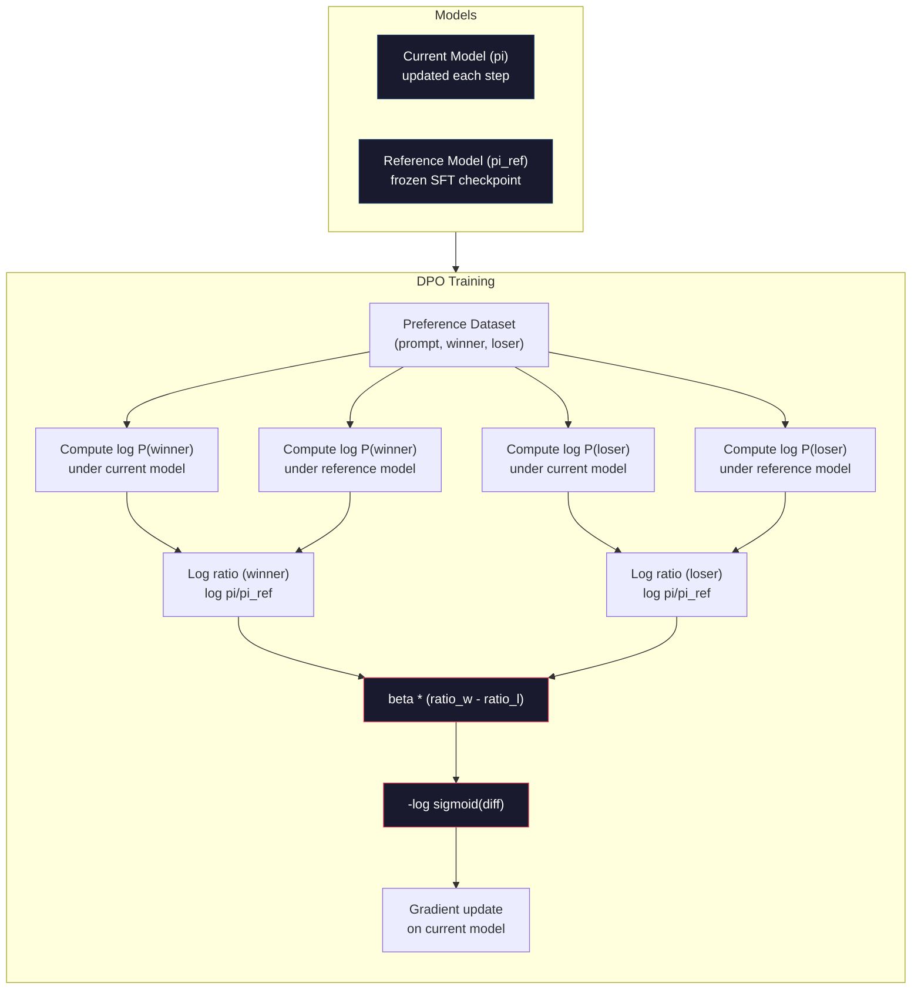

# DPO: Tối ưu hóa tùy chọn trực tiếp

> RLHF hoạt động. Nó cũng yêu cầu training ba models (SFT, model phần thưởng, policy), quản lý sự không ổn định của PPO và điều chỉnh hình phạt KL. DPO hỏi: điều gì sẽ xảy ra nếu bạn có thể bỏ qua tất cả những điều đó? DPO trực tiếp tối ưu hóa model ngôn ngữ trên các cặp ưu tiên. Không có phần thưởng model. Không có PPO. Một vòng lặp training. Kết quả tương tự.

**Loại:** Xây dựng
**Ngôn ngữ:** Python (with numpy)
**Kiến thức tiên quyết:** Giai đoạn 10, Bài 07 (RLHF)
**Thời lượng:** ~90 phút

## Mục tiêu học tập

- Triển khai DPO training trực tiếp tối ưu hóa model ngôn ngữ trên các cặp ưu tiên mà không cần model phần thưởng riêng
- Suy ra hàm DPO loss và giải thích cách nó ngầm đại diện cho phần thưởng model thông qua log probabilities của policy
- So sánh DPO và RLHF về độ ổn định training, chi phí tính toán và số lượng models cần thiết
- Điều chỉnh parameter beta để kiểm soát mức độ phân policy được huấn luyện so với model tham chiếu

## Vấn đề

Bạn đã xây dựng một RLHF pipeline trong Bài 07. Ba giai đoạn. Ba models. model SFT, model phần thưởng và policy model được tối ưu hóa với PPO. Chỉ riêng phần thưởng model yêu cầu hàng nghìn cặp tùy chọn của con người và một vòng lặp training riêng biệt. PPO yêu cầu điều chỉnh cẩn thận hệ số KL, learning rate, tỷ lệ clip và số epochs.

Trong thực tế, PPO training nổi tiếng là không ổn định. Những thay đổi nhỏ hyperparameter khiến training phân kỳ. Phần thưởng model là một proxy không hoàn hảo cho sở thích của con người và policy tìm cách khai thác điểm yếu của nó. Hình phạt KL giúp nhưng yêu cầu điều chỉnh riêng - quá thấp và bạn nhận được phần thưởng hack, quá cao và model hầu như không học được.

Sự phức tạp này là lý do tại sao hầu hết các models mã nguồn mở phải vật lộn với RLHF trong nhiều năm sau khi InstructGPT được xuất bản. pipeline ba giai đoạn rất mỏng manh. Mỗi giai đoạn có chế độ lỗi riêng và lỗi kết hợp.

Vào tháng 5 năm 2023, Rafael Rafailov, Archit Sharma và các đồng nghiệp tại Stanford đã xuất bản "Tối ưu hóa ưu tiên trực tiếp: Model ngôn ngữ của bạn là Model phần thưởng bí mật". Thông tin chi tiết quan trọng: bạn không cần một model phần thưởng riêng biệt. Hàm phần thưởng tối ưu được xác định về mặt toán học bởi xác suất token của chính model ngôn ngữ. Bạn có thể bỏ qua hoàn toàn phần thưởng model và tối ưu hóa model ngôn ngữ trực tiếp trên các cặp ưu tiên.

DPO giảm RLHF xuống còn một bước học có giám sát duy nhất. Một model. Một chức năng loss. Một vòng lặp training. Không học tăng cường. Zephyr-7B, một trong những models đầu tiên sử dụng DPO trên quy mô lớn, phù hợp hoặc đánh bại models được huấn luyện với đầy đủ RLHF trên một số benchmarks. Meta đã sử dụng DPO như một phần của alignment pipeline của Llama 3. Anthropic đã trích dẫn các phương pháp theo phong cách DPO trong nghiên cứu alignment của họ.

## Khái niệm

### Thông tin chi tiết chính

RLHF tối ưu hóa mục tiêu này:

```
maximize: E[R(x, y)] - beta * KL(pi || pi_ref)
```

trong đó R là phần thưởng của model, pi là policy, pi_ref là tham chiếu model và beta là hệ số KL.

Bài báo DPO cho thấy mục tiêu này có một giải pháp tối ưu dạng đóng. Đối với bất kỳ hàm phần thưởng R nào, policy tối ưu là:

```
pi*(y | x) = pi_ref(y | x) * exp(R(x, y) / beta) / Z(x)
```

trong đó Z(x) là một hằng số chuẩn hóa. Sắp xếp lại:

```
R(x, y) = beta * log(pi*(y | x) / pi_ref(y | x)) + beta * log Z(x)
```

Đây là bước đột phá. Phần thưởng được thể hiện hoàn toàn dưới dạng xác suất của policy model và xác suất của model tham chiếu. Bạn không cần phải huấn luyện một model phần thưởng riêng biệt. Phần thưởng là *ngầm* trong tỷ lệ xác suất.

Thay thế điều này vào model ưu tiên Bradley-Terry:

```
P(y_w > y_l | x) = sigmoid(R(x, y_w) - R(x, y_l))
                  = sigmoid(beta * (log pi(y_w|x)/pi_ref(y_w|x) - log pi(y_l|x)/pi_ref(y_l|x)))
```

Các thuật ngữ Z(x) hủy bỏ vì cả hai phản hồi đều có điều kiện trên cùng một prompt x. Những gì còn lại là một hàm chỉ có xác suất log của policy model và xác suất log của model tham chiếu trên các phản hồi ưu tiên và bị từ chối.

### Các DPO Loss

```
L_DPO = -log(sigmoid(beta * (log pi(y_w|x)/pi_ref(y_w|x) - log pi(y_l|x)/pi_ref(y_l|x))))
```

Hãy giải nén từng mảnh:

- **y_w** = phản hồi ưu tiên (chiến thắng)
- **y_l** = phản hồi bị từ chối (thua)
- **x** = prompt
- **pi** = model hiện tại (đang được huấn luyện)
- **pi_ref** = model tham chiếu (SFT checkpoint đông lạnh)
- **beta** = temperature parameter kiểm soát độ lệch so với tham chiếu (thường là 0,1 đến 0,5)

Tỷ lệ `log pi(y|x) / pi_ref(y|x)` là tỷ lệ log-xác suất. Khi tỷ lệ này là dương, model hiện tại gán xác suất đáp ứng y cao hơn so với tham chiếu. Khi âm, model hiện tại gán xác suất thấp hơn.

DPO loss thúc đẩy các model tăng tỷ lệ xác suất log cho các phản hồi ưa thích và giảm nó cho các phản hồi bị từ chối. parameter beta kiểm soát mức độ tích cực của model có thể đi chệch khỏi tham chiếu -- beta nhỏ có nghĩa là cho phép sai lệch lớn, beta lớn giữ model gần với tham chiếu.



### Tại sao DPO đơn giản hơn

| Khía cạnh | RLHF (PPO) | DPO |
|--------|-----------|-----|
| Models huấn luyện | 3 (SFT + phần thưởng + policy) | 1 (chỉ policy) |
| Training vòng lặp | 3 (SFT, RM training, PPO) | 2 (SFT, DPO) |
| Hyperparameters | lr, KL coefficient, tỷ lệ clip, RM lr, epochs x3 | LR, Beta, epochs |
| Phần thưởng model | Bắt buộc (training riêng) | Ngầm trong xác suất model |
| Thuật toán RL | PPO (phức tạp, không ổn định) | Học có giám sát (ổn định) |
| Bộ nhớ GPU | 3-4 models trong bộ nhớ trong quá trình PPO | 2 models (hiện tại + tham chiếu) |
| Training ổn định | Nhạy cảm với hyperparameters | Mạnh mẽ, tương tự như SFT |

DPO cần hai models trong bộ nhớ trong quá trình training - model hiện tại và tham chiếu bị đóng băng. RLHF cần ba hoặc bốn: policy, tham chiếu, phần thưởng model và tùy chọn hàm giá trị cơ sở. Đối với model 70B, mỗi bản sao chiếm 140GB trong FP16. Tiết kiệm bộ nhớ từ việc loại bỏ phần thưởng model là đáng kể.

### Khi DPO Beats RLHF

**datasets nhỏ.** Với 5.000-20.000 cặp ưu tiên, DPO thường phù hợp hoặc vượt quá RLHF. Phần thưởng model trong RLHF cần đủ dữ liệu để khái quát hóa - với dữ liệu hạn chế, nó quá phù hợp và tạo ra các tín hiệu phần thưởng không đáng tin cậy. DPO bỏ qua vấn đề này bằng cách không cần phần thưởng model chút nào.

**Điện toán hạn chế.** DPO yêu cầu khoảng một phần ba tính toán của RLHF đầy đủ (một vòng lặp training thay vì ba). Đối với các nhóm không có cụm GPU lớn, đây là lựa chọn thực tế.

**Lặp lại nhanh chóng.** Bạn muốn thử 10 datasets ưu tiên khác nhau để xem  nào tạo ra model tốt nhất? DPO cho phép bạn chạy mỗi thử nghiệm trong vài giờ. RLHF yêu cầu huấn luyện lại model phần thưởng cho mỗi dataset.

### Khi RLHF Beats DPO

**training quy mô lớn.** Ở quy mô GPT-4 hoặc Claude, model phần thưởng riêng biệt của RLHF có thể nắm bắt các tín hiệu ưu tiên nhiều sắc thái hơn. Phần thưởng model hoạt động như một chức năng loss học được thích ứng với các tiêu chí chất lượng phức tạp.

**Tín hiệu phần thưởng phức tạp.** Khi "tốt hơn" liên quan đến nhiều khía cạnh (hữu ích, vô hại, trung thực), phần thưởng model có thể học được sự đánh đổi đa mục tiêu này. DPO coi mỗi cặp ưu tiên như một tín hiệu nhị phân - một tốt hơn, một kém hơn - mà không mô hình hóa lý do tại sao.

**alignment lặp lại.** RLHF pipelines có thể tạo ra các phản hồi mới với policy hiện tại, yêu cầu con người đánh giá chúng và huấn luyện lại phần thưởng model trong một vòng lặp trực tuyến. DPO hoạt động trên một dataset cố định của các cặp ưu tiên. AI hiến pháp (cách tiếp cận của Anthropic) sử dụng thuộc tính lặp lại này của RLHF một cách rộng rãi.

### Ngoài DPO: KTO, ORPO, SimPO

DPO đã truyền cảm hứng cho một nhóm các phương pháp alignment đơn giản hóa.

**KTO (Tối ưu hóa Kahneman-Tversky, 2024):** Bạn thậm chí không cần cặp. KTO hoạt động với phản hồi không ghép nối - chỉ cần gắn nhãn mỗi phản hồi là "tốt" hoặc "xấu" mà không so sánh nó với một giải pháp thay thế. Điều này đơn giản hóa đáng kể việc thu thập dữ liệu. Thay vì hiển thị cho người chú thích hai câu trả lời và hỏi "cái nào tốt hơn?", bạn hiển thị một câu trả lời và hỏi "cái này có tốt không?" Hàm loss áp dụng loss ác cảm với lý thuyết khách hàng tiềm năng: phản hồi xấu bị phạt nhiều hơn phản hồi tốt được thưởng.

**ORPO (Tối ưu hóa ưu tiên tỷ lệ cược, 2024):** Kết hợp SFT và alignment trong một bước training duy nhất. Thay vì thực hiện SFT trước rồi DPO, ORPO sửa đổi loss SFT để bao gồm tín hiệu ưu tiên. loss có hai thuật ngữ: dự đoán tiêu chuẩn token loss về các câu trả lời ưu tiên, cộng với thuật ngữ tỷ lệ chênh lệch làm tăng khoảng cách giữa xác suất phản hồi ưu tiên và bị từ chối. Một vòng lặp training thay vì hai.

**SimPO (Tối ưu hóa tùy chọn đơn giản, 2024):** Loại bỏ hoàn toàn model tham chiếu. Thay vì tính toán tỷ lệ xác suất nhật ký so với tham chiếu bị đóng băng, SimPO sử dụng xác suất nhật ký trung bình của phản hồi (chuẩn hóa theo độ dài) làm phần thưởng ngầm. Điều này giúp tiết kiệm bộ nhớ (không cần model tham chiếu) và đơn giản hóa training. Chuẩn hóa độ dài ngăn model ưu tiên các phản hồi ngắn hơn.

| Phương pháp | Năm | Models trong bộ nhớ | Cần cặp? | Cần tham khảo? | Vòng lặp Training |
|--------|------|-----------------|-------------|-----------------|----------------|
| RLHF | 2022 | 3-4 | Có (đối với RM) | Có | 3 |
| DPO | 2023 | 2 | Có | Có | 2 |
| KTO | 2024 | 2 | Không (chưa ghép nối) | Có | 2 |
| ORPO | 2024 | 1 | Có | Không | 1 |
| SimPO | 2024 | 1 | Có | Không | 1 |

Xu hướng rất rõ ràng: mỗi phương pháp loại bỏ thêm một phần phức tạp. RLHF cần một phần thưởng model và PPO. DPO loại bỏ cả hai. KTO loại bỏ dữ liệu được ghép nối. ORPO đã loại bỏ giai đoạn SFT riêng biệt. SimPO đã loại bỏ model tham chiếu. Thuế alignment - chi phí tính toán và độ phức tạp của việc chuyển từ model cơ sở sang model căn chỉnh - tiếp tục giảm.

### Triển khai DPO thực

**Zephyr-7B (HuggingFace, tháng 10 năm 2023):** Cơ sở Mistral 7B, SFT trên UltraChat (200 nghìn ví dụ), sau đó DPO trên UltraFeedback (60 nghìn cặp ưu tiên). Đạt 6,47 điểm trên MT-Bench - model 7B cao nhất vào thời điểm đó. Để so sánh, Llama 2 Chat 70B đạt 6,86 điểm, có nghĩa là Zephyr đạt được 6% model gấp 10 lần kích thước của nó chỉ bằng cách sử dụng DPO alignment.

**Llama 3 (Meta, tháng 4 năm 2024):** Được sử dụng DPO sau giai đoạn RLHF ban đầu. Sự kết hợp này cho thấy rằng DPO và RLHF có thể bổ sung cho nhau -- RLHF cho alignment rộng, DPO để tinh chỉnh có mục tiêu.

**Neural Magic / nm-chat (2024):** Áp dụng DPO cho nhiều models mã nguồn mở, liên tục cho thấy sự cải thiện 5-15% trên alignment benchmarks so với đường cơ sở chỉ SFT.

```figure
dpo-loss
```

## Tự xây dựng

### Bước 1: Ưu tiên Dataset

Định dạng tương tự như RLHF -- (prompt, ưu tiên, bị từ chối) bộ ba. DPO tiêu thụ dữ liệu này trực tiếp mà không có model phần thưởng trung gian.

```python
import numpy as np
import sys
import os
sys.path.insert(0, os.path.join(os.path.dirname(__file__), "..", "..", "04-pre-training-mini-gpt", "code"))
from main import MiniGPT, LayerNorm, Embedding, TransformerBlock

PREFERENCE_DATA = [
    {
        "prompt": "What is the capital of France?",
        "preferred": "The capital of France is Paris.",
        "rejected": "France is a country in Europe. It has many cities. The capital is Paris. Paris is known for the Eiffel Tower.",
    },
    {
        "prompt": "Explain gravity in one sentence.",
        "preferred": "Gravity is the force that attracts objects with mass toward each other.",
        "rejected": "Gravity is something that makes things fall down when you drop them.",
    },
    {
        "prompt": "What is 15 times 7?",
        "preferred": "15 times 7 is 105.",
        "rejected": "Let me think about this. 15 times 7. Well, 10 times 7 is 70, and 5 times 7 is 35, so the answer might be around 105.",
    },
    {
        "prompt": "Name three programming languages.",
        "preferred": "Python, Rust, and TypeScript.",
        "rejected": "There are many programming languages. Some popular ones include various languages like Python and others.",
    },
    {
        "prompt": "What year did World War II end?",
        "preferred": "World War II ended in 1945.",
        "rejected": "World War II was a major global conflict. It involved many countries. The war ended in the mid-1940s, specifically in 1945.",
    },
    {
        "prompt": "Define machine learning.",
        "preferred": "Machine learning is a field where algorithms learn patterns from data to make predictions without being explicitly programmed.",
        "rejected": "Machine learning is a type of AI. AI stands for artificial intelligence. Machine learning uses data to learn.",
    },
]
```

### Bước 2: Xác suất nhật ký trình tự

DPO loss yêu cầu tính toán tổng xác suất log của một phản hồi cho một prompt. Điều này có nghĩa là chạy model trên chuỗi đầy đủ (prompt + phản hồi) và tổng xác suất log của mỗi phản hồi token.

```python
def tokenize_sequence(text, vocab_size=256):
    return [min(t, vocab_size - 1) for t in list(text.encode("utf-8"))]


def compute_sequence_log_prob(model, prompt_tokens, response_tokens, max_seq_len=128):
    full_sequence = prompt_tokens + response_tokens
    if len(full_sequence) > max_seq_len:
        full_sequence = full_sequence[:max_seq_len]

    if len(full_sequence) < 2:
        return 0.0

    input_ids = np.array(full_sequence[:-1]).reshape(1, -1)
    target_ids = np.array(full_sequence[1:])

    logits = model.forward(input_ids)
    logits = logits[0]

    max_logits = logits.max(axis=-1, keepdims=True)
    log_probs = logits - max_logits - np.log(
        np.exp(logits - max_logits).sum(axis=-1, keepdims=True)
    )

    prompt_len = len(prompt_tokens)
    response_start = max(0, prompt_len - 1)
    response_end = len(target_ids)

    if response_start >= response_end:
        return 0.0

    response_log_probs = log_probs[response_start:response_end, :]
    response_targets = target_ids[response_start:response_end]

    total_log_prob = 0.0
    for i, target in enumerate(response_targets):
        total_log_prob += response_log_probs[i, target]

    return total_log_prob
```

Chức năng này là công cụ của DPO. Đối với mỗi cặp ưu tiên, nó chạy bốn lần: model về phản hồi ưu tiên, model phản hồi bị từ chối, tham chiếu về phản hồi ưu tiên, tham chiếu về phản hồi bị từ chối. Đó là 4 lần chuyển tiếp cho mỗi ví dụ training so với thế hệ của RLHF + chấm điểm phần thưởng + ước tính giá trị + cập nhật PPO. Đơn giản hơn, nhanh hơn, ổn định hơn.

### Bước 3: Các DPO Loss

Cốt lõi của bài báo trong mã. Một chức năng. Một loss. Không có phần thưởng model.

```python
def sigmoid(x):
    return np.where(
        x >= 0,
        1.0 / (1.0 + np.exp(-x)),
        np.exp(x) / (1.0 + np.exp(x))
    )


def dpo_loss(policy_logprob_preferred, policy_logprob_rejected,
             ref_logprob_preferred, ref_logprob_rejected, beta=0.1):
    preferred_ratio = policy_logprob_preferred - ref_logprob_preferred
    rejected_ratio = policy_logprob_rejected - ref_logprob_rejected

    logit = beta * (preferred_ratio - rejected_ratio)

    loss = -np.log(sigmoid(logit) + 1e-8)

    preferred_reward = beta * preferred_ratio
    rejected_reward = beta * rejected_ratio

    return loss, {
        "preferred_ratio": float(preferred_ratio),
        "rejected_ratio": float(rejected_ratio),
        "logit": float(logit),
        "implicit_preferred_reward": float(preferred_reward),
        "implicit_rejected_reward": float(rejected_reward),
        "reward_margin": float(preferred_reward - rejected_reward),
    }
```

`preferred_ratio` và `rejected_ratio` là tỷ lệ xác suất log-xác suất từ dẫn xuất DPO. Khi model hiện tại gán xác suất cao hơn cho phản hồi ưa thích (so với tham chiếu) và xác suất thấp hơn cho phản hồi bị từ chối, logit dương và loss thấp. Tín hiệu training đẩy model theo chính xác hướng này.

`implicit_preferred_reward` và `implicit_rejected_reward` là phần thưởng mà DPO loss ngầm chỉ định. Bạn có thể trích xuất chúng để xác minh rằng training đang hoạt động - biên độ giữa phần thưởng ưu tiên và phần thưởng bị từ chối sẽ tăng lên theo training.

### Bước 4: DPO Training vòng lặp

Một vòng lặp training được giám sát tiêu chuẩn. Không có PPO. Không có model thưởng. Chỉ cần chuyển tiếp và cập nhật gradient.

```python
def copy_model_weights(source, target):
    target.embedding.token_embed = source.embedding.token_embed.copy()
    target.embedding.pos_embed = source.embedding.pos_embed.copy()
    target.ln_f.gamma = source.ln_f.gamma.copy()
    target.ln_f.beta = source.ln_f.beta.copy()
    for s_block, t_block in zip(source.blocks, target.blocks):
        t_block.attn.W_q = s_block.attn.W_q.copy()
        t_block.attn.W_k = s_block.attn.W_k.copy()
        t_block.attn.W_v = s_block.attn.W_v.copy()
        t_block.attn.W_out = s_block.attn.W_out.copy()
        t_block.ffn.W1 = s_block.ffn.W1.copy()
        t_block.ffn.W2 = s_block.ffn.W2.copy()
        t_block.ffn.b1 = s_block.ffn.b1.copy()
        t_block.ffn.b2 = s_block.ffn.b2.copy()
        t_block.ln1.gamma = s_block.ln1.gamma.copy()
        t_block.ln1.beta = s_block.ln1.beta.copy()
        t_block.ln2.gamma = s_block.ln2.gamma.copy()
        t_block.ln2.beta = s_block.ln2.beta.copy()


def dpo_train(policy_model, reference_model, preference_data,
              num_epochs=5, lr=5e-6, beta=0.1, max_seq_len=128):
    print(f"DPO Training: {len(preference_data)} pairs, {num_epochs} epochs, "
          f"lr={lr}, beta={beta}")
    print()

    losses = []
    margins = []

    for epoch in range(num_epochs):
        epoch_loss = 0.0
        epoch_margin = 0.0
        num_examples = 0

        indices = np.random.permutation(len(preference_data))

        for idx in indices:
            pair = preference_data[idx]

            prompt_tokens = tokenize_sequence(pair["prompt"])
            preferred_tokens = tokenize_sequence(pair["preferred"])
            rejected_tokens = tokenize_sequence(pair["rejected"])

            pi_logprob_w = compute_sequence_log_prob(
                policy_model, prompt_tokens, preferred_tokens, max_seq_len
            )
            pi_logprob_l = compute_sequence_log_prob(
                policy_model, prompt_tokens, rejected_tokens, max_seq_len
            )
            ref_logprob_w = compute_sequence_log_prob(
                reference_model, prompt_tokens, preferred_tokens, max_seq_len
            )
            ref_logprob_l = compute_sequence_log_prob(
                reference_model, prompt_tokens, rejected_tokens, max_seq_len
            )

            loss, metrics = dpo_loss(
                pi_logprob_w, pi_logprob_l,
                ref_logprob_w, ref_logprob_l, beta
            )

            update_direction = 1.0 if metrics["logit"] < 0 else -0.1
            for block in policy_model.blocks:
                block.ffn.W1 += lr * update_direction * np.random.randn(*block.ffn.W1.shape) * 0.01
                block.ffn.W2 += lr * update_direction * np.random.randn(*block.ffn.W2.shape) * 0.01

            epoch_loss += loss
            epoch_margin += metrics["reward_margin"]
            num_examples += 1
            losses.append(float(loss))
            margins.append(metrics["reward_margin"])

        avg_loss = epoch_loss / max(num_examples, 1)
        avg_margin = epoch_margin / max(num_examples, 1)

        print(f"  Epoch {epoch + 1}/{num_epochs} | Loss: {avg_loss:.4f} | "
              f"Avg Margin: {avg_margin:.4f}")

    return policy_model, losses, margins
```

Vòng lặp training đơn giản một cách mới mẻ so với RLHF. Đối với mỗi cặp tùy chọn: tính toán bốn xác suất nhật ký (hai models, hai phản hồi), cắm chúng vào DPO loss, tính toán gradient, cập nhật policy. Không có bước tạo. Không có model inference phần thưởng. Không ước tính lợi thế. Không cắt xén.

### Bước 5: So sánh DPO và RLHF

Đo lường biên phần thưởng ngầm và sự thay đổi xác suất nhật ký để so sánh DPO với RLHF model từ Bài 07.

```python
def evaluate_preference_accuracy(model, reference_model, preference_data, beta=0.1, max_seq_len=128):
    correct = 0
    total = 0

    for pair in preference_data:
        prompt_tokens = tokenize_sequence(pair["prompt"])
        preferred_tokens = tokenize_sequence(pair["preferred"])
        rejected_tokens = tokenize_sequence(pair["rejected"])

        pi_w = compute_sequence_log_prob(model, prompt_tokens, preferred_tokens, max_seq_len)
        pi_l = compute_sequence_log_prob(model, prompt_tokens, rejected_tokens, max_seq_len)
        ref_w = compute_sequence_log_prob(reference_model, prompt_tokens, preferred_tokens, max_seq_len)
        ref_l = compute_sequence_log_prob(reference_model, prompt_tokens, rejected_tokens, max_seq_len)

        preferred_reward = beta * (pi_w - ref_w)
        rejected_reward = beta * (pi_l - ref_l)

        if preferred_reward > rejected_reward:
            correct += 1
        total += 1

    return correct / max(total, 1)


def analyze_implicit_rewards(model, reference_model, preference_data, beta=0.1, max_seq_len=128):
    print("Implicit Reward Analysis:")
    print("-" * 65)
    print(f"  {'Prompt':<30} {'Pref Reward':>12} {'Rej Reward':>12} {'Margin':>10}")
    print("  " + "-" * 60)

    for pair in preference_data:
        prompt_tokens = tokenize_sequence(pair["prompt"])
        preferred_tokens = tokenize_sequence(pair["preferred"])
        rejected_tokens = tokenize_sequence(pair["rejected"])

        pi_w = compute_sequence_log_prob(model, prompt_tokens, preferred_tokens, max_seq_len)
        pi_l = compute_sequence_log_prob(model, prompt_tokens, rejected_tokens, max_seq_len)
        ref_w = compute_sequence_log_prob(reference_model, prompt_tokens, preferred_tokens, max_seq_len)
        ref_l = compute_sequence_log_prob(reference_model, prompt_tokens, rejected_tokens, max_seq_len)

        pref_reward = beta * (pi_w - ref_w)
        rej_reward = beta * (pi_l - ref_l)
        margin = pref_reward - rej_reward

        truncated = pair["prompt"][:28] + ".." if len(pair["prompt"]) > 30 else pair["prompt"]
        print(f"  {truncated:<30} {pref_reward:>12.4f} {rej_reward:>12.4f} {margin:>10.4f}")

    print()
```

### Bước 6: Phân tích độ nhạy beta

parameter beta tương đương với hệ số KL tính bằng RLHF của DPO. Nó kiểm soát mức độ model có thể sai lệch so với tham chiếu. Thử nghiệm này cho thấy hiệu quả của nó.

```python
def beta_sensitivity_analysis(sft_model, preference_data, betas, max_seq_len=128):
    print("Beta Sensitivity Analysis")
    print("-" * 60)
    print(f"  {'Beta':>8} {'Final Loss':>12} {'Final Margin':>14} {'Accuracy':>10}")
    print("  " + "-" * 55)

    results = []

    for beta in betas:
        policy = MiniGPT(
            vocab_size=256, embed_dim=128, num_heads=4,
            num_layers=4, max_seq_len=max_seq_len, ff_dim=512
        )
        reference = MiniGPT(
            vocab_size=256, embed_dim=128, num_heads=4,
            num_layers=4, max_seq_len=max_seq_len, ff_dim=512
        )
        copy_model_weights(sft_model, policy)
        copy_model_weights(sft_model, reference)

        policy, losses, margins_list = dpo_train(
            policy, reference, preference_data,
            num_epochs=3, lr=5e-6, beta=beta, max_seq_len=max_seq_len
        )

        accuracy = evaluate_preference_accuracy(
            policy, reference, preference_data, beta, max_seq_len
        )

        final_loss = losses[-1] if losses else 0
        final_margin = margins_list[-1] if margins_list else 0

        print(f"  {beta:>8.3f} {final_loss:>12.4f} {final_margin:>14.4f} {accuracy:>10.1%}")
        results.append({
            "beta": beta,
            "final_loss": final_loss,
            "final_margin": final_margin,
            "accuracy": accuracy,
        })

        print()

    return results
```

Beta nhỏ (0,01) cho phép model tự do đi chệch khỏi tham chiếu - học nhanh nhưng có nguy cơ thoái hóa các giải pháp. Beta lớn (1,0) giữ model gần với tham chiếu -- học ổn định nhưng học chậm. Điểm ngọt ngào cho hầu hết các ứng dụng là 0,1 đến 0,3.

## Ứng dụng

### Bản demo đầy đủ DPO Pipeline

```python
if __name__ == "__main__":
    np.random.seed(42)

    print("=" * 70)
    print("DPO: DIRECT PREFERENCE OPTIMIZATION")
    print("=" * 70)
    print()

    print("STEP 1: Initialize SFT Model (from Lesson 06)")
    print("-" * 50)
    sft_model = MiniGPT(
        vocab_size=256, embed_dim=128, num_heads=4,
        num_layers=4, max_seq_len=128, ff_dim=512
    )
    print(f"  Parameters: {sft_model.count_parameters():,}")
    print()

    print("STEP 2: DPO Training")
    print("-" * 50)

    policy_model = MiniGPT(
        vocab_size=256, embed_dim=128, num_heads=4,
        num_layers=4, max_seq_len=128, ff_dim=512
    )
    reference_model = MiniGPT(
        vocab_size=256, embed_dim=128, num_heads=4,
        num_layers=4, max_seq_len=128, ff_dim=512
    )
    copy_model_weights(sft_model, policy_model)
    copy_model_weights(sft_model, reference_model)

    policy_model, losses, margins = dpo_train(
        policy_model, reference_model, PREFERENCE_DATA,
        num_epochs=5, lr=5e-6, beta=0.1
    )
    print()

    print("=" * 70)
    print("STEP 3: Evaluate")
    print("=" * 70)
    print()

    pre_accuracy = evaluate_preference_accuracy(
        sft_model, reference_model, PREFERENCE_DATA, beta=0.1
    )
    post_accuracy = evaluate_preference_accuracy(
        policy_model, reference_model, PREFERENCE_DATA, beta=0.1
    )

    print(f"  Preference accuracy (pre-DPO):  {pre_accuracy:.1%}")
    print(f"  Preference accuracy (post-DPO): {post_accuracy:.1%}")
    print()

    analyze_implicit_rewards(policy_model, reference_model, PREFERENCE_DATA, beta=0.1)

    print("=" * 70)
    print("STEP 4: Training Dynamics")
    print("=" * 70)
    print()

    if losses:
        print("  Loss curve:")
        window = max(1, len(losses) // 5)
        for i in range(0, len(losses), window):
            chunk = losses[i:i + window]
            avg = sum(chunk) / len(chunk)
            print(f"    Steps {i:3d}-{i + len(chunk) - 1:3d}: loss = {avg:.4f}")
        print()

    if margins:
        print("  Reward margin curve:")
        window = max(1, len(margins) // 5)
        for i in range(0, len(margins), window):
            chunk = margins[i:i + window]
            avg = sum(chunk) / len(chunk)
            print(f"    Steps {i:3d}-{i + len(chunk) - 1:3d}: margin = {avg:.4f}")
        print()

    print("=" * 70)
    print("STEP 5: Beta Sensitivity")
    print("=" * 70)
    print()

    beta_results = beta_sensitivity_analysis(
        sft_model, PREFERENCE_DATA, betas=[0.01, 0.1, 0.3, 1.0]
    )

    print("=" * 70)
    print("DPO vs RLHF COMPARISON")
    print("=" * 70)
    print()
    print("  DPO advantages:")
    print("    - 1 training loop (vs 3 for RLHF)")
    print("    - 2 models in memory (vs 3-4 for RLHF)")
    print("    - Supervised learning (vs RL, more stable)")
    print("    - No reward model to train or maintain")
    print()
    print("  RLHF advantages:")
    print("    - Separate reward model captures complex preferences")
    print("    - Online learning: generate, rate, retrain")
    print("    - Better for multi-objective alignment")
    print("    - Proven at largest scales (GPT-4, Claude)")
    print()
    print("  Practical guidance:")
    print("    - Start with DPO. It's simpler and often sufficient.")
    print("    - Switch to RLHF if DPO plateaus on your eval metrics.")
    print("    - Many production systems use both: RLHF first, DPO to refine.")
```

## Sản phẩm bàn giao

Bài học này tạo ra `outputs/prompt-alignment-method-selector.md` -- một prompt giúp bạn chọn phương pháp alignment phù hợp (SFT, RLHF, DPO, KTO, ORPO, SimPO) cho trường hợp sử dụng của bạn. Với tính khả dụng của dữ liệu, ngân sách tính toán và mục tiêu alignment của bạn, nó đề xuất một phương pháp và kế hoạch training.

## Bài tập

1. Triển khai KTO (Tối ưu hóa Kahneman-Tversky). KTO không cần cặp - chỉ cần gắn nhãn mỗi phản hồi là "tốt" hoặc "xấu". loss cho một phản hồi tốt là `-log(sigmoid(beta * log_ratio))` và cho một phản hồi xấu là `-log(1 - sigmoid(beta * log_ratio))` với hệ số ác cảm loss (thường là 1,5 lần) trên loss phản hồi xấu. Huấn luyện trên cùng một dữ liệu (coi ưu tiên là "tốt" và bị từ chối là "xấu" một cách độc lập) và so sánh accuracy với DPO.

2. Triển khai DPO chuẩn hóa theo độ dài. Thay vì xác suất nhật ký thô, hãy chia cho số lượng phản hồi tokens: `normalized_logprob = total_logprob / num_tokens`. Điều này ngăn model ưu tiên các phản hồi ngắn hơn (có tổng khả năng nhật ký cao hơn). So sánh biên độ phần thưởng ngầm có và không có chuẩn hóa.

3. Xây dựng loss kết hợp kiểu ORPO. Thêm loss dự đoán token tiếp theo chuẩn trên phản hồi ưu tiên cho DPO loss: `L = L_sft(preferred) + alpha * L_dpo`. Thử các giá trị alpha là 0,1, 0,5 và 1,0. Các loss kết hợp sẽ tạo ra một model vừa tuân theo hướng dẫn (từ thuật ngữ SFT) vừa ưu tiên phản hồi tốt hơn (từ thuật ngữ DPO), loại bỏ sự cần thiết của giai đoạn SFT riêng biệt.

4. Triển khai DPO lặp lại. Chạy DPO trong 3 epochs, sau đó tạo phản hồi mới từ model được huấn luyện, ghép nối chúng với các phản hồi ưu tiên ban đầu dưới dạng cặp tùy chọn mới và chạy lại DPO. Hai vòng "tự phát" này process. So sánh accuracy tùy chọn sau vòng 1 và vòng 2 để xem liệu tinh chỉnh lặp đi lặp lại có hữu ích hay không.

5. So sánh DPO với các models tham chiếu khác nhau. Thay vì sử dụng checkpoint SFT làm tham chiếu, hãy thử: (a) model cơ sở (trước SFT), (b) checkpoint từ epoch 1 của DPO, (c) đường trung bình động hàm mũ của policy model. Báo cáo tham chiếu nào tạo ra accuracy ưu tiên cao nhất và đường cong training ổn định nhất.

## Thuật ngữ chính

| Thuật ngữ | Những gì mọi người nói | Ý nghĩa thực sự của nó |
|------|----------------|----------------------|
| DPO | "RLHF không có RL" | Tối ưu hóa tùy chọn trực tiếp: một thuật toán học tập có giám sát giúp tối ưu hóa model ngôn ngữ trực tiếp trên các cặp ưu tiên, bỏ qua model phần thưởng và PPO |
| Phần thưởng ngầm | "Phần thưởng nằm trong model" | Hàm phần thưởng được xác định bởi tỷ lệ xác suất log giữa policy và models tham chiếu -- không cần phần thưởng riêng model |
| Beta (DPO) | "Người temperature" | Kiểm soát mức độ policy có thể sai lệch so với model tham chiếu -- beta nhỏ cho phép sai lệch lớn, beta lớn giữ model gần |
| Tỷ lệ xác suất nhật ký | "model đã thay đổi bao nhiêu" | nhật ký pi(y\ | x) - nhật ký pi_ref(y\ | x) -- dương có nghĩa là model hiện tại gán xác suất cao hơn tham chiếu |
| Tài liệu tham khảo model | "Những checkpoint đông lạnh" | Một bản sao của SFT model có trọng số không bao giờ thay đổi - đóng vai trò là mỏ neo để tính toán tỷ lệ xác suất |
| KTO | "DPO không cặp" | Tối ưu hóa Kahneman-Tversky: hoạt động với các nhãn "tốt" hoặc "xấu" không được ghép nối thay vì yêu cầu các cặp ưu tiên |
| ORPO | "alignment một bước" | Tối ưu hóa ưu tiên tỷ lệ cược: kết hợp SFT và alignment thành một vòng lặp training duy nhất bằng cách thêm thuật ngữ ưu tiên vào loss SFT |
| SimPO | "Không cần tài liệu tham khảo" | Tối ưu hóa tùy chọn đơn giản: loại bỏ model tham chiếu bằng cách sử dụng xác suất log trung bình chuẩn hóa độ dài làm phần thưởng ngầm |
| Thuế Alignment | "Chi phí để làm models an toàn" | Tính toán, dữ liệu và độ phức tạp bổ sung cần thiết để chuyển từ model cơ sở sang model căn chỉnh -- DPO làm giảm đáng kể điều này |

## Đọc thêm

- [Rafailov et al., 2023 -- "Direct Preference Optimization: Your Language Model is Secretly a Reward Model"](https://arxiv.org/abs/2305.18290) - bài báo DPO đơn giản hóa alignment từ RLHF sang học có giám sát
- [Tunstall et al., 2023 -- "Zephyr: Direct Distillation of LM Alignment"](https://arxiv.org/abs/2310.16944) -- Zephyr-7B, hiển thị DPO trên các trận đấu UltraFeedback RLHF trên benchmarks
- [Ethayarajh et al., 2024 -- "KTO: Model Alignment as Prospect Theoretic Optimization"](https://arxiv.org/abs/2402.01306) -- loại bỏ nhu cầu về các tùy chọn được ghép nối
- [Hong et al., 2024 -- "ORPO: Monolithic Preference Optimization without Reference Model"](https://arxiv.org/abs/2403.07691) - kết hợp SFT và alignment trong một bước
- [Meng et al., 2024 -- "SimPO: Simple Preference Optimization with a Reference-Free Reward"](https://arxiv.org/abs/2405.14734) -- loại bỏ hoàn toàn model tham chiếu
- [Llama 3 Technical Report](https://arxiv.org/abs/2407.21783) - Meta alignment pipeline kết hợp RLHF và DPO
