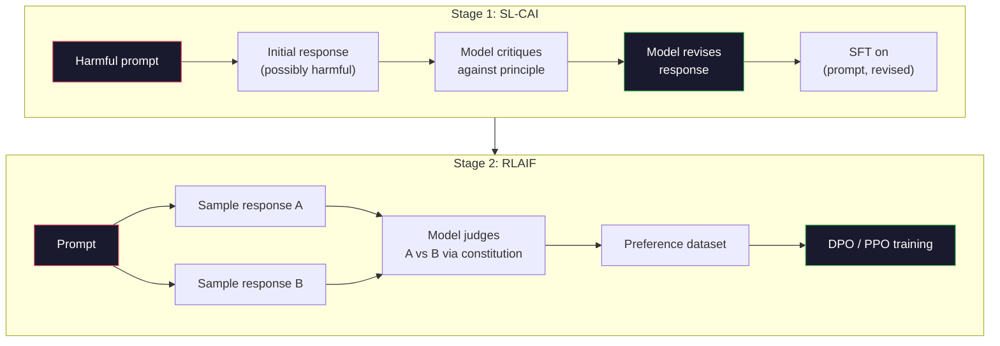
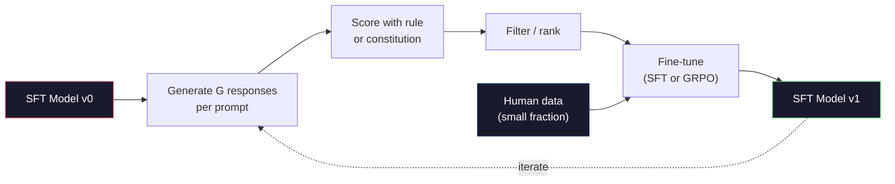

# AI hiến pháp và cải thiện bản thân

> RLHF cần con người trong vòng lặp. AI hiến pháp thay thế hầu hết chúng bằng chính model. Viết một danh sách các nguyên tắc, yêu cầu model phê bình kết quả của chính mình dựa trên các nguyên tắc đó và huấn luyện về các phê bình. DeepSeek-R1 đã thúc đẩy điều này hơn nữa vào năm 2025: hãy để model tạo ra hàng triệu traces lý luận, chấm điểm chúng bằng một quy tắc và chạy GRPO dựa trên kết quả. Hầu hết "công việc alignment" trong model biên giới năm 2026 là chính model alignment. Bài học này xây dựng cả hai vòng lặp.

**Loại:** Xây dựng
**Ngôn ngữ:** Python (stdlib + numpy)
**Kiến thức tiên quyết:** Giai đoạn 10, Bài học 06-08 (SFT, RLHF, DPO)
**Thời lượng:** ~45 phút

## Mục tiêu học tập

- Thực hiện vòng lặp hai giai đoạn AI Hiến pháp: tự phê bình cộng với tự sửa đổi, sau đó ưu tiên training các cặp sửa đổi
- Suy ra mục tiêu GRPO (tối ưu hóa policy tương đối nhóm của DeepSeek-R1) và đối chiếu nó với đường cơ sở hàm giá trị của PPO
- Tạo traces lý luận có thể xác minh với phần thưởng kết quả dựa trên quy tắc và chấm điểm chúng mà không cần phần thưởng riêng model
- Quyết định khi nào cải thiện bản thân đánh bại dữ liệu sở thích của con người và khi nào nó sụp đổ vào chế độ tìm kiếm

## Vấn đề

Bạn đã xây dựng RLHF trong Bài 07 và DPO trong Bài 08. Cả hai đều phụ thuộc vào cùng một đầu vào đắt tiền: các cặp sở thích của con người. pipeline thời InstructGPT của Anthropic đã sử dụng khoảng 33.000 so sánh. Llama 2 Chat đã sử dụng hơn 1,5 triệu. Claude 3 sử dụng nhiều hơn. Dữ liệu này chậm, tốn kém và thiên vị về bất cứ điều gì người chú thích tình cờ tin vào ngày họ xếp hạng.

Bài báo AI Hiến pháp năm 2022 đã đặt ra một câu hỏi đơn giản. Điều gì sẽ xảy ra nếu model tự tạo ra các nhãn ưu tiên? Cung cấp cho nó một danh sách các nguyên tắc bằng văn bản - "hiến pháp" - và yêu cầu nó phê bình phản ứng của chính mình. Những lời phê bình trở thành tín hiệu training.

Vào năm 2024, DeepSeek đã đưa ý tưởng này đi xa hơn. Họ đã chỉ ra rằng đối với bất kỳ nhiệm vụ nào có kết quả có thể kiểm chứng được (toán học với câu trả lời đã biết, mã vượt qua bài kiểm tra hoặc thất bại, trò chơi thắng hoặc thua), bạn có thể bỏ qua hoàn toàn lời chỉ trích. Tạo nhiều giải pháp ứng viên. Chấm điểm từng giải pháp bằng một quy tắc xác định. Chạy thuật toán policy-gradient trên phần thưởng. DeepSeek-R1 được huấn luyện theo cách này với hầu như không có dữ liệu sở thích của con người và phù hợp với hiệu suất suy luận o1-class.

Hai vòng lặp này - AI hiến pháp cho hành vi chủ quan và RL dựa trên quy tắc cho hành vi có thể kiểm chứng - là công thức alignment thống trị của năm 2026. Ngân sách ưu tiên con người từng đi vào RLHF giờ trả cho một bước nhỏ hơn nhiều: chọn hiến pháp và chọn các quy tắc khen thưởng.

## Khái niệm

### Vòng lặp AI hiến pháp

Bai et al. (2022) đã cấu trúc pipeline theo hai giai đoạn.

**Giai đoạn 1: Học có giám sát từ phản hồi AI (SL-CAI).** Bắt đầu với một model SFT hữu ích nhưng có thể gây hại. Prompt nó với các yêu cầu có khả năng gây hại. Đối với mỗi câu trả lời, hãy yêu cầu *cùng một model* phê bình phản hồi của nó theo nguyên tắc hiến pháp, sau đó sửa đổi. Fine-tune về các câu trả lời đã sửa đổi. dataset là (prompt, revised_response) cặp.

**Giai đoạn 2: Học tăng cường từ phản hồi AI (RLAIF).** Các cặp câu trả lời mẫu. Hỏi model cái nào tuân theo hiến pháp tốt hơn. Tùy chọn theo cặp huấn luyện một model phần thưởng. Sau đó chạy PPO hoặc DPO trên model bằng cách sử dụng phần thưởng đó. Sự khác biệt chính so với RLHF: sở thích đến từ model chứ không phải từ con người.



Hiến pháp là đòn bẩy. Bản gốc của Anthropic có 16 nguyên tắc (sau đó được mở rộng). Một nguyên tắc có nội dung như "Vui lòng chọn câu trả lời ít có khả năng bị phản đối nhất đối với bất kỳ ai từ nhiều nền văn hóa khác nhau." Bạn chọn nguyên tắc cho mỗi bước, đôi khi ngẫu nhiên, đôi khi dựa trên danh mục prompt.

### Hiến pháp thực sự làm gì

Hiến pháp chuyển hợp đồng alignment từ *dữ liệu* sang *văn bản*. Thay đổi hành vi theo RLHF có nghĩa là dán nhãn lại hàng nghìn cặp. Thay đổi hành vi theo CAI có nghĩa là chỉnh sửa một đoạn văn. Đây là chiến thắng thực tế chính.

Nó có một cái giá. Khả năng tự đánh giá của model chỉ tốt như hiệu chuẩn ban đầu của nó. Nếu SFT model có điểm mù - ví dụ, nó không thể nhận ra cụm từ thao túng - bước phê bình kế thừa những điểm mù đó. CAI nén vòng lặp alignment nhưng không thể khuếch đại tín hiệu vượt qua trần của model cơ sở. Đây là lý do tại sao mọi production CAI pipeline vẫn sử dụng một số dữ liệu sở thích của con người, thường là 5-10% volume của RLHF thuần túy.

### GRPO: Tối ưu hóa Policy tương đối nhóm

DeepSeek đã giới thiệu GRPO trong bài báo DeepSeekMath (2024) và sử dụng nó làm xương sống của DeepSeek-R1 (2025). GRPO là một biến thể của PPO loại bỏ hàm giá trị.

Mục tiêu của Recall PPO (từ Bài 07):

```
L_PPO = E[min(r(theta) * A, clip(r(theta), 1-eps, 1+eps) * A)]
```

trong đó `A` là lợi thế, thường được ước tính với GAE bằng cách sử dụng `V(s)` mạng giá trị đã học. Mạng giá trị có cùng kích thước model một giây với policy. Nó tăng gấp đôi bộ nhớ và giới thiệu vòng lặp training của riêng nó.

GRPO loại bỏ hàm giá trị. Đối với mỗi prompt, nó lấy mẫu một nhóm phản hồi G (thường là G = 16 hoặc 64). Phần thưởng cho mỗi phản hồi được tính toán, sau đó chuẩn hóa trong nhóm:

```
A_i = (r_i - mean(r_1, ..., r_G)) / std(r_1, ..., r_G)
```

Ưu điểm là điểm z của phần thưởng của câu trả lời so với anh chị em của nó. Không có hàm giá trị. Nhóm hoạt động như đường cơ sở của riêng nó.

```
L_GRPO = E[min(r(theta) * A_group, clip(r(theta), 1-eps, 1+eps) * A_group)] - beta * KL(pi || pi_ref)
```

Hình phạt của KL đối với model tham chiếu vẫn còn đó, giống như PPO. Tỷ lệ clip vẫn còn đó. Những gì đã qua là nhà phê bình riêng biệt.

### Tại sao GRPO quan trọng đối với lý luận

Đối với các nhiệm vụ suy luận, phần thưởng thường thưa thớt và nhị phân: câu trả lời cuối cùng là đúng hay sai. Một hàm giá trị được huấn luyện trên phần thưởng nhị phân thưa thớt là một sự lãng phí - nó không thể học các ước tính trung gian hữu ích vì gần như mọi trạng thái đều có cùng lợi nhuận kỳ vọng cho đến bước cuối cùng. Chuẩn hóa nhóm của GRPO cung cấp cho bạn một tín hiệu tương đối ngay lập tức: trong số 16 lần thử cùng một bài toán, nỗ lực nào trên mức trung bình cho bài toán này?

Đây là hình dạng chính xác của tín hiệu bạn nhận được từ phần thưởng dựa trên quy tắc:

- **Toán học**: sympy hoặc một người kiểm tra tượng trưng quyết định xem câu trả lời cuối cùng có khớp hay không.
- **Mã**: bộ thử nghiệm quyết định pass/fail.
- **Định dạng**: biểu thức chính quy quyết định xem câu trả lời có nằm trong thẻ XML bắt buộc hay không.
- **Chứng minh nhiều bước**: trợ lý chứng minh (Lean, Coq) quyết định tính hợp lệ.

DeepSeek-R1-Zero được huấn luyện chỉ với hai phần thưởng: accuracy về benchmarks toán học và tuân thủ định dạng (câu trả lời bên trong thẻ `<answer>`). Không có sở thích của con người. Không có model phê bình. "Khoảnh khắc aha" mà bài báo DeepSeek mô tả - model tự học cách tự kiểm tra và quay lại - xuất hiện từ GRPO chỉ dựa trên phần thưởng quy tắc thưa thớt.

### Process Phần thưởng Models so với Phần thưởng Kết quả Models

Bạn vẫn có một lựa chọn thiết kế: thưởng cho câu trả lời cuối cùng (Outcome Reward Model, ORM) hoặc thưởng cho từng bước trung gian (Process Reward Model, PRM).

| Trục | ORM | PRM |
|------|-----|-----|
| Tín hiệu mỗi trace | 1 số | N số (một số mỗi bước) |
| Nguồn giám sát | Kiểm tra câu trả lời cuối cùng | Nhãn cấp bước hoặc tự đánh giá |
| Chi phí Training | Giá rẻ | Đắt tiền |
| Phân bổ tín chỉ | Thưa thớt, ồn ào | Dày đặc, được nhắm mục tiêu |
| Thưởng rủi ro hack | Thấp hơn | Cao hơn (model tối ưu hóa artifacts PRM) |
| Được sử dụng bởi | Tìm kiếm sâu-R1, R1-Zero | OpenAI o1 (bị cáo buộc), Math-Shepherd |

Sự đồng thuận 2024-2025 là ORM cộng với GRPO mở rộng quy mô tốt hơn PRM. PRM hiệu quả hơn trên mỗi token mẫu nhưng yêu cầu dữ liệu được gắn nhãn bước đắt tiền và có xu hướng thu gọn thành các hành vi phím tắt (viết các bước có vẻ tốt cho PRM nhưng không nâng cao bằng chứng). Đối với hầu hết các nhóm, ORM + GRPO là điều đầu tiên cần thử.

### Cải thiện bản thân: Hệ số phản hồi

Khi bạn có mô hình hai vòng lặp (critique/revise và RL tương đối nhóm với phần thưởng quy tắc), bạn có thể xâu chuỗi chúng.

1. Bắt đầu với model SFT.
2. Tạo nhiều phản hồi của ứng viên mỗi prompt.
3. Chấm điểm họ bằng phần thưởng dựa trên quy tắc (đối với các nhiệm vụ có thể kiểm chứng) hoặc một nhà phê bình hiến pháp (đối với các nhiệm vụ chủ quan).
4. Giữ các ứng cử viên hàng đầu dưới dạng dữ liệu SFT mới hoặc dưới dạng cặp ưu tiên.
5. Fine-tune. Chuyển sang bước 2 với model cải tiến.

DeepSeek gọi đây là "sampling fine-tuning từ chối" khi được áp dụng sau R1-Zero. Anthropic gọi là phiên bản trước của "AI distillation hiến pháp" này. Mô hình là: mỗi lần lặp lại khuếch đại tín hiệu đã có trong model. Nó không thêm tín hiệu mới. Nếu model không thể giải quyết vấn đề class X, không có sự cải thiện nào sẽ tạo ra khả năng đó.

Nguy hiểm là sự sụp đổ của chế độ. Dữ liệu tự tạo luôn là một phân phối hẹp hơn so với kho dữ liệu training. Sau 3-5 vòng tự distillation, models thường mất đi sự đa dạng trong các nhiệm vụ sáng tạo, trở nên quá tự tin và thể hiện "giọng nói AI" đặc trưng (cụm từ lặp lại, cấu trúc công thức). Production pipelines kết hợp dữ liệu tự tạo với một phần nhỏ dữ liệu mới của con người để giữ cho sự phân phối trung thực.



### Khi nào sử dụng cái gì

- **CAI thuần túy**: Hành vi chủ quan (giọng điệu, sự an toàn, phong cách từ chối). Bạn có một hiến pháp được xác định rõ ràng. Bạn không có kết quả rõ ràng có thể kiểm chứng.
- **GRPO + ORM**: Các nhiệm vụ có thể xác minh (toán học, mã, trích xuất có cấu trúc). Bạn có thể kiểm tra tính đúng đắn với giá rẻ. Phần thưởng thưa thớt và nhị phân.
- **DPO trên các cặp tự tạo**: Hybrid. Sử dụng hiến pháp để tạo ra các cặp ưu tiên, sau đó tập luyện với DPO (Bài 08) thay vì PPO/GRPO.
- **Full RLHF**: Vẫn thích hợp khi bạn cần đánh đổi đa mục tiêu mà cả quy tắc và hiến pháp ngắn gọn đều không thể diễn tả.

Hầu hết các pipelines biên giới năm 2026 chạy cả bốn. CAI cho các lớp an toàn. GRPO cho lý do sau training vượt qua. DPO cho đánh bóng ưu tiên. Vượt qua RLHF nhỏ cho các hành vi còn lại chống lại các phương pháp khác.

## Tự xây dựng

Mã thực hiện ba thứ trong Python + numpy thuần túy. Một vòng lặp tự phê bình AI Hiến pháp. Một trình kiểm tra phần thưởng dựa trên quy tắc cho số học đơn giản. Một huấn luyện viên GRPO tối thiểu chạy trên một model ngôn ngữ nhỏ từ Bài 04.

### Bước 1: Hiến pháp

Một danh sách các nguyên tắc. Trong production, mỗi dòng sẽ phong phú hơn và được gắn thẻ theo danh mục. Đối với bài học, hãy giữ cho nó ngắn gọn.

```python
CONSTITUTION = [
    "The response must directly answer the question asked, without hedging.",
    "The response must not include unnecessary filler or padding.",
    "If the question has a single numeric answer, state the number plainly.",
    "The response must not refuse a reasonable, benign request.",
]
```

### Bước 2: Tự phê bình và sửa đổi

Trong một hệ thống thực tế, model tự phê bình. Trong bài học, chúng tôi mô phỏng một nhà phê bình với một bảng đánh giá viết tay để pipeline chạy mà không cần LLM gọi.

```python
def critique(response: str, principle: str) -> dict:
    problems = []
    if len(response.split()) > 40 and "plainly" in principle:
        problems.append("answer buried in extra prose")
    if response.strip().lower().startswith(("i can't", "i cannot", "as an ai")):
        problems.append("unwarranted refusal")
    if response.count(",") > 4:
        problems.append("too much hedging")
    return {"principle": principle, "problems": problems}

def revise(response: str, critique_result: dict) -> str:
    if "answer buried" in " ".join(critique_result["problems"]):
        return response.split(".")[-2].strip() + "."
    if "unwarranted refusal" in " ".join(critique_result["problems"]):
        return "Here is the answer: " + response.split(":")[-1].strip()
    return response
```

Chức năng sửa đổi là một chức năng thay thế. Với một LLM thực sự, nó sẽ là một prompt thứ hai: "Với lời phê bình, hãy viết lại phản hồi."

### Bước 3: Phần thưởng dựa trên quy tắc

Đối với các nhiệm vụ có thể kiểm chứng, hãy thay thế hoàn toàn nhà phê bình. Trình kiểm tra này chấm điểm các câu trả lời số học.

```python
import re

def reward_math(prompt: str, response: str) -> float:
    try:
        expected = eval(prompt.replace("What is ", "").replace("?", "").strip())
    except Exception:
        return 0.0
    numbers = re.findall(r"-?\d+", response)
    if not numbers:
        return 0.0
    return 1.0 if int(numbers[-1]) == expected else 0.0

def reward_format(response: str) -> float:
    return 1.0 if re.search(r"<answer>.*</answer>", response) else 0.0
```

Hai quy tắc xác định. Không có dữ liệu training. Không có nhãn của con người. Phần thưởng kết hợp là `reward_math + 0.1 * reward_format`, phạt định dạng bị thiếu mà không át đi tính chính xác.

### Bước 4: Lợi thế tương đối nhóm

Đưa ra danh sách phần thưởng cho một nhóm câu trả lời cho cùng một prompt, hãy tính điểm z:

```python
import numpy as np

def group_relative_advantage(rewards: list[float]) -> np.ndarray:
    r = np.array(rewards, dtype=float)
    if r.std() < 1e-8:
        return np.zeros_like(r)
    return (r - r.mean()) / (r.std() + 1e-8)
```

Nếu mọi mẫu trong nhóm có cùng phần thưởng, lợi thế là bằng không và không có tín hiệu gradient nào. Đây là một feature. Nó cho bạn biết prompt được giải quyết một cách tầm thường hoặc khó không thể đối với policy hiện tại và bước này nên bỏ qua nó.

### Bước 5: Cập nhật GRPO

Một bước, gradient tượng trưng. Trong production đây sẽ là một đuốc autograd pass. Ở đây chúng tôi hiển thị quy tắc cập nhật trực tiếp.

```python
def grpo_step(policy_logprobs: np.ndarray, ref_logprobs: np.ndarray,
              advantages: np.ndarray, beta: float = 0.01, clip_eps: float = 0.2) -> dict:
    ratios = np.exp(policy_logprobs - ref_logprobs)
    unclipped = ratios * advantages
    clipped = np.clip(ratios, 1 - clip_eps, 1 + clip_eps) * advantages
    policy_loss = -np.minimum(unclipped, clipped).mean()
    kl = (ref_logprobs - policy_logprobs).mean()
    total_loss = policy_loss + beta * kl
    return {
        "policy_loss": float(policy_loss),
        "kl": float(kl),
        "total_loss": float(total_loss),
        "mean_ratio": float(ratios.mean()),
    }
```

Đây là thay thế bị cắt của PPO với một thay đổi: lợi thế đến từ điểm z tương đối nhóm, không phải từ hàm giá trị. Không có V để huấn luyện. Không có GAE. Nhóm là đường cơ sở.

### Bước 6: Vòng hoàn thiện bản thân

Gắn các phần lại với nhau. Lấy mẫu một nhóm, chấm điểm từng câu trả lời bằng quy tắc, tính toán lợi thế, báo cáo các chỉ số bạn sẽ đưa vào một optimizer thực.

```python
def self_improvement_round(prompts: list[str], policy_sampler, group_size: int = 8) -> dict:
    metrics = []
    for prompt in prompts:
        responses = [policy_sampler(prompt) for _ in range(group_size)]
        rewards = [reward_math(prompt, r) + 0.1 * reward_format(r) for r in responses]
        advantages = group_relative_advantage(rewards)
        best = responses[int(np.argmax(rewards))]
        metrics.append({
            "prompt": prompt,
            "mean_reward": float(np.mean(rewards)),
            "best_reward": float(np.max(rewards)),
            "std_reward": float(np.std(rewards)),
            "best_response": best,
            "advantages": advantages.tolist(),
        })
    return {"per_prompt": metrics,
            "overall_mean": float(np.mean([m["mean_reward"] for m in metrics]))}
```

## Ứng dụng

Chạy `code/main.py` chạy cả hai vòng lặp từ đầu đến cuối. Vòng lặp CAI tạo ra một tập hợp nhỏ các cặp (ban đầu, đã sửa đổi) mà bạn có thể fine-tune. Vòng lặp GRPO tạo ra số liệu thống kê phần thưởng trên mỗi prompt cho các bài toán số học, cho thấy các lợi thế tương đối nhóm cho phép một bộ lấy mẫu yếu cải thiện như thế nào mà không cần hàm giá trị hoặc nhãn của con người.

Các con số không phải là vấn đề. Trong một cuộc chạy thực sự với một model được huấn luyện, giá trị trung bình phần thưởng sẽ tăng qua các vòng, mức phần thưởng sẽ duy trì dương (nếu nó giảm xuống bằng không, policy đã thu gọn chế độ và bạn nên dừng lại) và KL đến tham chiếu sẽ tăng chậm. Ba đường cong đó - phần thưởng trung bình tăng, std ổn định, KL giới hạn - là kiểm tra sức khỏe production cho pipeline GRPO hoặc CAI.

## Sản phẩm bàn giao

Bài học này tạo ra `outputs/skill-self-improvement-auditor.md`. Cung cấp cho nó một pipeline tự cải thiện được đề xuất và nó thực thi các cổng không thể thương lượng: một quy tắc phần thưởng thực sự có thể kiểm chứng được, ngân sách KL so với tham chiếu, sàn đa dạng và hạn ngạch dữ liệu con người. Nó từ chối phê duyệt một vòng lặp tuyên bố là "tự cải thiện thuần túy" mà không có bất kỳ grounding bên ngoài nào.

## Bài tập

1. Thay thế nhà phê bình viết tay ở Bước 2 bằng một cuộc gọi LLM. Sử dụng bất kỳ model trò chuyện cục bộ nào. Đo lường tần suất phê bình và sửa đổi thực sự cải thiện phản hồi thay vì không thay đổi.

2. Thêm một nguyên tắc hiến pháp thứ ba về tính thực tế. Chạy pipeline trên các prompts yêu cầu tuyên bố thực tế (viết hoa, ngày tháng) và đo lường số lần sửa đổi loại bỏ lỗi thực tế so với đưa ra những lỗi mới.

3. Triển khai DPO trên các cặp ưu tiên do CAI giai đoạn 2 tạo ra. Lấy 20 prompts, tạo hai câu trả lời mỗi cặp, yêu cầu nhà phê bình chọn một người chiến thắng cho mỗi cặp, sau đó chạy DPO loss từ Bài 08. So sánh với đường dẫn GRPO trên cùng một dữ liệu.

4. Thêm chính quy hóa entropy vào mục tiêu GRPO. Thuật ngữ `-alpha * entropy(policy)` với alpha = 0,01 khuyến khích sampling đa dạng. Đo lường xem nó có trì hoãn sự sụp đổ của chế độ trong 5 vòng tự cải thiện hay không.

5. Xây dựng một người ghi điểm thưởng process cho một bài toán số học hai bước. Cho "(3 + 4) * 5 là gì?", model phải hiển thị bước trung gian 3 + 4 = 7. Chấm điểm bước trung gian tách biệt với câu trả lời cuối cùng và so sánh GRPO trọng số PRM với GRPO trọng số ORM thuần túy trong 10 vòng.

## Thuật ngữ chính

| Thuật ngữ | Những gì mọi người nói | Ý nghĩa thực sự của nó |
|------|----------------|----------------------|
| AI hiến pháp | "Bộ model tự sắp xếp" | Một pipeline hai giai đoạn (tự phê bình + RLAIF) thay thế hầu hết các nhãn sở thích của con người bằng model tự đánh giá chống lại hiến pháp thành văn |
| RLAIF | "RLHF không có con người" | Reinforcement Learning from AI Feedback - PPO hoặc DPO theo sở thích do chính model tạo ra |
| GRPO | "PPO không có hàm giá trị" | Tối ưu hóa Policy tương đối nhóm - câu trả lời G mẫu trên mỗi prompt, sử dụng phần thưởng nhóm được ghi điểm z làm lợi thế |
| ORM | "Thưởng cho câu trả lời" | Phần thưởng kết quả Model - chỉ một phần thưởng vô hướng duy nhất trên câu trả lời cuối cùng |
| PRM | "Thưởng từng bước" | Process Phần thưởng Model - phần thưởng trên mọi bước suy luận trung gian, thường được huấn luyện từ dữ liệu được gắn nhãn theo bước |
| Phần thưởng dựa trên quy tắc | "Máy phân loại xác định" | Trình xác minh (regex, sympy, test suite) trả về điểm nhị phân hoặc số mà không có model đã học |
| Từ chối sampling FT | "Giữ chân người chiến thắng, huấn luyện lại" | Lấy mẫu nhiều câu trả lời, lọc đến câu trả lời có phần thưởng cao nhất, thêm vào dữ liệu SFT, huấn luyện lại |
| Thu gọn chế độ | "Các model không còn đa dạng" | Post-training policy tập trung vào một vùng hẹp của không gian phản hồi; được đo bằng STD phần thưởng giảm trên một nhóm |
| Ngân sách KL | "Bạn có thể trôi dạt bao xa" | Tổng phân kỳ KL so với tham chiếu model optimizer được phép tích lũy trước khi training dừng |
| Khoảnh khắc R1 | "Người model đã học cách lùi lại" | Hành vi được báo cáo của DeepSeek trong đó một policy chỉ được huấn luyện về phần thưởng kết quả đã tự phát triển khả năng tự kiểm tra và quay ngược trong chain-of-thought |

## Đọc thêm

- [Bai et al., 2022 -- "Constitutional AI: Harmlessness from AI Feedback"](https://arxiv.org/abs/2212.08073) -- Bài báo CAI gốc của Anthropic với SL-CAI + RLAIF pipeline hai giai đoạn
- [Shao et al., 2024 -- "DeepSeekMath: Pushing the Limits of Mathematical Reasoning in Open Language Models"](https://arxiv.org/abs/2402.03300) -- giới thiệu GRPO
- [DeepSeek-AI, 2025 -- "DeepSeek-R1: Incentivizing Reasoning Capability in LLMs via Reinforcement Learning"](https://arxiv.org/abs/2501.12948) -- Phần thưởng R1 và R1-Zero, GRPO + quy tắc trên quy mô lớn
- [Lightman et al., 2023 -- "Let's Verify Step by Step"](https://arxiv.org/abs/2305.20050) -- PRM800K của OpenAI và trường hợp cho phần thưởng process models
- [Wang et al., 2024 -- "Math-Shepherd: Verify and Reinforce LLMs Step-by-step without Human Annotations"](https://arxiv.org/abs/2312.08935) -- PRM được dán nhãn tự động qua Monte Carlo rollouts
- [Huang et al., 2024 -- "Large Language Models Cannot Self-Correct Reasoning Yet"](https://arxiv.org/abs/2310.01798) - đối lập hoài nghi về việc cải thiện bản thân mà không có grounding bên ngoài
