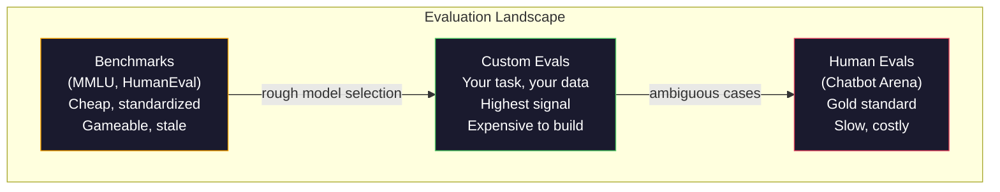
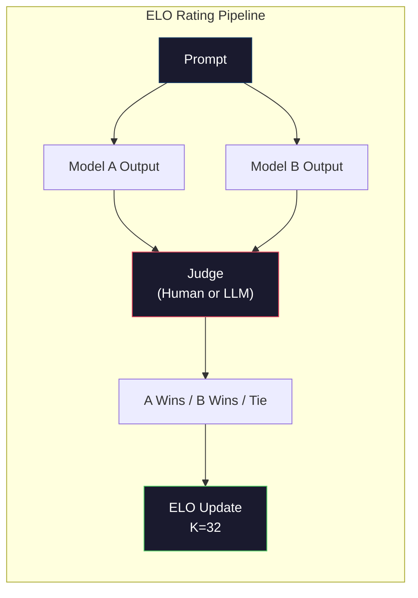

# Đánh giá: Benchmarks, Evals, LM Harness

> Định luật Goodhart: khi một thước đo trở thành mục tiêu, nó không còn là một thước đo tốt. Mọi trò chơi phòng thí nghiệm biên giới đều benchmarks. Điểm MMLU tăng lên trong khi models vẫn không thể đếm một cách đáng tin cậy số R trong "dâu tây". Đánh giá duy nhất quan trọng là đánh giá của BẠN - về nhiệm vụ của BẠN, với dữ liệu của BẠN.

**Loại:** Xây dựng
**Ngôn ngữ:** Python
**Kiến thức tiên quyết:** Giai đoạn 10, Bài học 01-05 (LLMs từ đầu)
**Thời lượng:** ~90 phút

## Mục tiêu học tập

- Xây dựng một harness đánh giá tùy chỉnh chạy các benchmarks trắc nghiệm và kết thúc mở dựa trên một model ngôn ngữ
- Giải thích lý do tại sao benchmarks tiêu chuẩn (MMLU, HumanEval) bão hòa và không phân biệt được models biên giới
- Thực hiện đánh giá theo nhiệm vụ cụ thể với các chỉ số thích hợp: đối sánh chính xác, F1, BLEU và chấm điểm LLM khi đánh giá
- Thiết kế bộ đánh giá tùy chỉnh nhắm mục tiêu vào trường hợp sử dụng cụ thể của bạn thay vì chỉ dựa vào bảng xếp hạng công khai

## Vấn đề

MMLU được xuất bản vào năm 2020 với 15,908 câu hỏi trên 57 môn học. Trong vòng ba năm, frontier models bão hòa nó. GPT-4 đạt 86,4%. Claude 3 Opus đạt 86,8%. Llama 3 405B đạt 88,6%. Bảng xếp hạng được nén thành phạm vi 3 điểm, trong đó sự khác biệt là nhiễu thống kê, không phải khoảng cách năng lực thực sự.

Trong khi đó, những models đó thất bại trong các nhiệm vụ mà một đứa trẻ 10 tuổi xử lý mà không cần suy nghĩ. Claude 3.5 Sonnet, đạt 88,7% trên MMLU, ban đầu không thể đếm các chữ cái trong "dâu tây" - một nhiệm vụ không đòi hỏi kiến thức thế giới và không có lý luận, chỉ cần lặp lại ở cấp độ ký tự. HumanEval kiểm tra việc tạo mã với 164 vấn đề. Models đạt điểm 90%+ trên đó trong khi vẫn tạo ra mã gặp sự cố trong các trường hợp biên mà bất kỳ nhà phát triển có kinh nghiệm nào cũng sẽ bắt được.

Khoảng cách giữa hiệu suất benchmark và độ tin cậy trong thế giới thực là vấn đề trung tâm của đánh giá LLM. Benchmarks cho bạn biết model hoạt động như thế nào trên benchmark. Chúng hầu như không cho bạn biết gì về cách model đó sẽ hoạt động trên nhiệm vụ cụ thể của bạn, với dữ liệu cụ thể của bạn, trong các chế độ lỗi cụ thể của bạn. Nếu bạn đang xây dựng một bot hỗ trợ khách hàng, MMLU không liên quan. Nếu bạn đang xây dựng một trợ lý mã, HumanEval chỉ bao gồm việc tạo cấp độ chức năng - nó không nói gì về việc gỡ lỗi, tái cấu trúc hoặc giải thích mã trên các tệp.

Bạn cần đánh giá tùy chỉnh. Không phải vì benchmarks vô dụng - chúng hữu ích cho việc lựa chọn model sơ bộ - mà vì đánh giá cuối cùng phải khớp chính xác với các điều kiện triển khai của bạn.

## Khái niệm

### Bối cảnh Eval

Có ba loại đánh giá, mỗi loại có chi phí và chất lượng tín hiệu khác nhau.

**Benchmarks** là các bộ kiểm tra tiêu chuẩn. MMLU, HumanEval, SWE-bench, MATH, ARC, HellaSwag. Bạn chạy model với benchmark và nhận được điểm. Ưu điểm: mọi người đều sử dụng cùng một bài kiểm tra, vì vậy bạn có thể so sánh models. Nhược điểm: dữ liệu models và training ngày càng làm ô nhiễm những benchmarks này. Phòng thí nghiệm huấn luyện dựa trên dữ liệu bao gồm các câu hỏi benchmark. Điểm số tăng lên. Khả năng có thể không.

**Đánh giá tùy chỉnh** là bộ kiểm tra mà bạn xây dựng cho trường hợp sử dụng cụ thể của mình. Bạn xác định đầu vào, đầu ra dự kiến và chức năng tính điểm. Trình tóm tắt tài liệu pháp lý được đánh giá trên các tài liệu pháp lý. Trình tạo SQL được đánh giá trên cơ sở dữ liệu của bạn schema. Chúng tốn kém để tạo nhưng chúng là đánh giá duy nhất dự đoán hiệu suất production.

**Đánh giá của con người** sử dụng trình chú thích trả phí để đánh giá kết quả model dựa trên các tiêu chí như tính hữu ích, chính xác, trôi chảy và an toàn. Tiêu chuẩn vàng cho các tác vụ mở khi tính điểm tự động không thành công. Chatbot Arena đã thu thập được hơn 2 triệu phiếu bầu ưu tiên của con người trên 100+ models. Nhược điểm: chi phí ($0.10-$2.00 cho mỗi lần đánh giá) và tốc độ (vài giờ đến vài ngày).



### Tại sao Benchmarks Break

Ba cơ chế khiến điểm số benchmark ngừng phản ánh khả năng thực sự.

**Ô nhiễm dữ liệu.** Training kho dữ liệu cạo internet. Benchmark câu hỏi trực tiếp trên internet. Models thấy câu trả lời trong quá trình training. Đây không phải là gian lận theo nghĩa truyền thống - các phòng thí nghiệm không cố ý bao gồm dữ liệu benchmark. Nhưng việc cạo quy mô web khiến nó gần như không thể loại trừ.

**Dạy bài kiểm tra.** Phòng thí nghiệm tối ưu hóa hỗn hợp training để benchmark hiệu suất. Nếu 5% hỗn hợp training là trắc nghiệm kiểu MMLU, model học định dạng và phân phối câu trả lời. MMLU là trắc nghiệm 4 chiều. Models biết rằng phân phối câu trả lời gần như đồng đều trên A/B/C/D, điều này giúp ích ngay cả khi model không biết câu trả lời.

**Độ bão hòa.** Khi mọi model biên giới đạt điểm 85-90% trên một benchmark, benchmark sẽ ngừng phân biệt. 10-15% câu hỏi còn lại có thể mơ hồ, dán nhãn sai hoặc yêu cầu kiến thức lĩnh vực khó hiểu. Cải thiện từ 87% lên 89% trên MMLU có thể có nghĩa là model ghi nhớ thêm hai câu hỏi khó hiểu, không phải là nó trở nên thông minh hơn.

### Perplexity: Kiểm tra sức khỏe nhanh

Perplexity đo lường mức độ ngạc nhiên của một model bởi một chuỗi tokens. Về mặt hình thức, đó là log-likelihood âm trung bình theo cấp số nhân:

```
PPL = exp(-1/N * sum(log P(token_i | context)))
```

perplexity 10 có nghĩa là model, trung bình, không chắc chắn như chọn đồng nhất trong số 10 tùy chọn ở mỗi vị trí token. Thấp hơn là tốt hơn. GPT-2 nhận được perplexity là ~30 trên WikiText-103. GPT-3 nhận được ~20. Llama 3 8B nhận được ~7.

Perplexity rất hữu ích để so sánh models trên cùng một bộ bài kiểm tra, nhưng nó có điểm mù. Một model có thể có perplexity thấp bằng cách giỏi dự đoán các mẫu phổ biến trong khi rất tệ ở các mẫu hiếm nhưng quan trọng. Nó cũng không nói gì về việc tuân theo hướng dẫn, lý luận hoặc accuracy thực tế. Sử dụng nó như một kiểm tra sự tỉnh táo, không phải là một phán quyết cuối cùng.

### LLM với tư cách là thẩm phán

Sử dụng một model mạnh để đánh giá kết quả của một model yếu hơn. Ý tưởng rất đơn giản: yêu cầu GPT-4o hoặc Claude Sonnet đánh giá phản hồi trên thang điểm 1-5 về tính chính xác, hữu ích và an toàn. Điều này có giá khoảng 0,01 đô la cho mỗi phán đoán với GPT-4o-mini và tương quan tốt một cách đáng ngạc nhiên với phán đoán của con người - khoảng 80% đồng ý về hầu hết các nhiệm vụ.

prompt chấm điểm quan trọng hơn model. Một prompt mơ hồ ("Đánh giá câu trả lời này") tạo ra điểm số nhiễu. Một prompt có cấu trúc với một bảng đánh giá ("Điểm 5 nếu câu trả lời đúng thực tế và trích dẫn một nguồn, 4 nếu đúng nhưng không có nguồn, 3 nếu đúng một phần...") tạo ra điểm nhất quán, có thể lặp lại.

Chế độ thất bại: đánh giá models thể hiện vị trí bias (thích phản hồi đầu tiên trong so sánh theo cặp), bias chi tiết (thích phản hồi dài hơn) và tự ưu tiên (tỷ lệ GPT-4 GPT-4 đầu ra cao hơn đầu ra Claude tương đương). Giảm thiểu: ngẫu nhiên hóa thứ tự, chuẩn hóa độ dài, sử dụng một thẩm phán khác với model đang được đánh giá.

### Xếp hạng ELO từ so sánh theo cặp

Cách tiếp cận của Chatbot Arena. Hiển thị hai phản hồi cho cùng một prompt từ các models khác nhau. Con người (hoặc LLM giám khảo) chọn câu trả lời tốt hơn. Từ hàng ngàn so sánh này, hãy tính xếp hạng ELO cho mỗi model - cùng một hệ thống được sử dụng trong cờ vua.

Ưu điểm của ELO: xếp hạng tương đối đáng tin cậy hơn tính điểm tuyệt đối, xử lý các mối quan hệ một cách duyên dáng và hội tụ với ít so sánh hơn so với việc chấm điểm mọi đầu ra một cách độc lập. Tính đến đầu năm 2026, thứ hạng Chatbot Arena hiển thị GPT-4o, Claude 3.5 Sonnet và Gemini 1.5 Pro trong vòng 20 điểm ELO cách nhau ở đầu bảng.



### Đánh giá Frameworks

**lm-evaluation-harness** (EleutherAI): framework đánh giá mã nguồn mở tiêu chuẩn. Hỗ trợ 200+ benchmarks. Chạy bất kỳ Hugging Face model nào chống lại MMLU, HellaSwag, ARC, v.v. bằng một lệnh. Được sử dụng bởi Bảng xếp hạng Open LLM.

**RAGAS**: đánh giá framework dành riêng cho RAG pipelines. Đo lường mức độ trung thực (câu trả lời có khớp với ngữ cảnh được truy xuất không?), mức độ liên quan (ngữ cảnh được truy xuất có liên quan đến câu hỏi không?) và tính đúng đắn của câu trả lời.

**Promptfoo**: Đánh giá theo hướng config cho kỹ thuật prompt. Xác định các trường hợp thử nghiệm trong YAML, chạy trên nhiều models, nhận báo cáo pass/fail. Hữu ích cho prompts kiểm tra hồi quy -- đảm bảo thay đổi prompt không phá vỡ các trường hợp thử nghiệm hiện có.

### Xây dựng Evals tùy chỉnh

Đánh giá duy nhất quan trọng đối với production. Các process:

1. **Xác định nhiệm vụ.** Chính xác thì model nên làm gì? Hãy chính xác. "Trả lời câu hỏi" quá mơ hồ. "Đưa ra email khiếu nại của khách hàng, trích xuất tên sản phẩm, danh mục vấn đề và cảm xúc" là nhiệm vụ bạn có thể đánh giá.

2. **Tạo các trường hợp thử nghiệm.** Tối thiểu 50 cho một đánh giá nguyên mẫu, 200+ cho production. Mỗi trường hợp thử nghiệm là một cặp (đầu vào, expected_output). Bao gồm các trường hợp biên: đầu vào trống, đầu vào đối nghịch, đầu vào mơ hồ, đầu vào bằng các ngôn ngữ khác.

3. **Xác định tính điểm.** Đối sánh chính xác cho đầu ra có cấu trúc. BLEU/ROUGE cho sự tương đồng của văn bản. LLM như đánh giá cho chất lượng kết thúc mở. F1 cho các tác vụ trích xuất. Kết hợp nhiều chỉ số với trọng số.

4. **Tự động hóa.** Mỗi đánh giá chạy với một lệnh. Không có bước thủ công. Lưu trữ kết quả ở định dạng cho phép so sánh theo thời gian.

5. **Theo dõi theo thời gian.** Điểm đánh giá là vô nghĩa khi cô lập. Bạn cần đường xu hướng. Điểm số có cải thiện sau prompt thay đổi cuối cùng không? Nó có thụt lùi sau khi chuyển đổi models không? Phiên bản đánh giá của bạn cùng với prompts của bạn.

| Loại đánh giá | Chi phí cho mỗi phán đoán | Thỏa thuận với con người | Tốt nhất cho |
|-----------|------------------|----------------------|----------|
| Đối sánh chính xác | ~$0 | 100% (nếu có) | Đầu ra có cấu trúc, phân loại |
| BLEU/ROUGE | ~$0 | ~60% | Dịch thuật, tổng hợp |
| LLM với tư cách là thẩm phán | ~0,01 đô la | ~80% | Thế hệ mở |
| Đánh giá con người | $0.10-$2.00 | N/A (là ground truth) | Nhiệm vụ mơ hồ, rủi ro cao |

```figure
perplexity-loss
```

## Tự xây dựng

### Bước 1: Đánh giá tối thiểu Framework

Xác định các khái niệm trừu tượng cốt lõi. Một trường hợp đánh giá có một đầu vào, một đầu ra dự kiến và một chính tả siêu dữ liệu tùy chọn. Một người ghi điểm lấy một dự đoán và một tham chiếu và trả về điểm số từ 0 đến 1.

```python
import json
from collections import Counter

class EvalCase:
    def __init__(self, input_text, expected, metadata=None):
        self.input_text = input_text
        self.expected = expected
        self.metadata = metadata or {}

class EvalSuite:
    def __init__(self, name, cases, scorers):
        self.name = name
        self.cases = cases
        self.scorers = scorers

    def run(self, model_fn):
        results = []
        for case in self.cases:
            prediction = model_fn(case.input_text)
            scores = {}
            for scorer_name, scorer_fn in self.scorers.items():
                scores[scorer_name] = scorer_fn(prediction, case.expected)
            results.append({
                "input": case.input_text,
                "expected": case.expected,
                "prediction": prediction,
                "scores": scores,
            })
        return results
```

### Bước 2: Chức năng tính điểm

Xây dựng trận đấu chính xác, token F1 và người ghi bàn LLM làm trọng tài mô phỏng.

```python
def exact_match(prediction, expected):
    return 1.0 if prediction.strip().lower() == expected.strip().lower() else 0.0

def token_f1(prediction, expected):
    pred_tokens = set(prediction.lower().split())
    exp_tokens = set(expected.lower().split())
    if not pred_tokens or not exp_tokens:
        return 0.0
    common = pred_tokens & exp_tokens
    precision = len(common) / len(pred_tokens)
    recall = len(common) / len(exp_tokens)
    if precision + recall == 0:
        return 0.0
    return 2 * (precision * recall) / (precision + recall)

def llm_judge_simulated(prediction, expected):
    pred_words = set(prediction.lower().split())
    exp_words = set(expected.lower().split())
    if not exp_words:
        return 0.0
    overlap = len(pred_words & exp_words) / len(exp_words)
    length_penalty = min(1.0, len(prediction) / max(len(expected), 1))
    return round(overlap * 0.7 + length_penalty * 0.3, 3)
```

### Bước 3: Hệ thống đánh giá ELO

Thực hiện so sánh theo cặp với các bản cập nhật ELO. Đây chính xác là hệ thống Chatbot Arena sử dụng để xếp hạng models.

```python
class ELOTracker:
    def __init__(self, k=32, initial_rating=1500):
        self.ratings = {}
        self.k = k
        self.initial_rating = initial_rating
        self.history = []

    def _ensure_player(self, name):
        if name not in self.ratings:
            self.ratings[name] = self.initial_rating

    def expected_score(self, rating_a, rating_b):
        return 1 / (1 + 10 ** ((rating_b - rating_a) / 400))

    def record_match(self, player_a, player_b, outcome):
        self._ensure_player(player_a)
        self._ensure_player(player_b)

        ea = self.expected_score(self.ratings[player_a], self.ratings[player_b])
        eb = 1 - ea

        if outcome == "a":
            sa, sb = 1.0, 0.0
        elif outcome == "b":
            sa, sb = 0.0, 1.0
        else:
            sa, sb = 0.5, 0.5

        self.ratings[player_a] += self.k * (sa - ea)
        self.ratings[player_b] += self.k * (sb - eb)

        self.history.append({
            "a": player_a, "b": player_b,
            "outcome": outcome,
            "rating_a": round(self.ratings[player_a], 1),
            "rating_b": round(self.ratings[player_b], 1),
        })

    def leaderboard(self):
        return sorted(self.ratings.items(), key=lambda x: -x[1])
```

### Bước 4: Tính toán Perplexity

Tính toán perplexity sử dụng token xác suất. Trong thực tế, bạn sẽ nhận được những điều này từ logits của model. Ở đây chúng tôi mô phỏng với một phân phối xác suất.

```python
import numpy as np

def perplexity(log_probs):
    if not log_probs:
        return float("inf")
    avg_neg_log_prob = -np.mean(log_probs)
    return float(np.exp(avg_neg_log_prob))

def token_log_probs_simulated(text, model_quality=0.8):
    np.random.seed(hash(text) % 2**31)
    tokens = text.split()
    log_probs = []
    for i, token in enumerate(tokens):
        base_prob = model_quality
        if len(token) > 8:
            base_prob *= 0.6
        if i == 0:
            base_prob *= 0.7
        prob = np.clip(base_prob + np.random.normal(0, 0.1), 0.01, 0.99)
        log_probs.append(float(np.log(prob)))
    return log_probs
```

### Bước 5: Tổng hợp kết quả

Tính toán số liệu thống kê tóm tắt trong một lần đánh giá: trung bình, trung bình, tỷ lệ đậu ở ngưỡng và phân tích trên mỗi chỉ số.

```python
def summarize_results(results, threshold=0.8):
    all_scores = {}
    for r in results:
        for metric, score in r["scores"].items():
            all_scores.setdefault(metric, []).append(score)

    summary = {}
    for metric, scores in all_scores.items():
        arr = np.array(scores)
        summary[metric] = {
            "mean": round(float(np.mean(arr)), 3),
            "median": round(float(np.median(arr)), 3),
            "std": round(float(np.std(arr)), 3),
            "min": round(float(np.min(arr)), 3),
            "max": round(float(np.max(arr)), 3),
            "pass_rate": round(float(np.mean(arr >= threshold)), 3),
            "n": len(scores),
        }
    return summary

def print_summary(summary, suite_name="Eval"):
    print(f"\n{'=' * 60}")
    print(f"  {suite_name} Summary")
    print(f"{'=' * 60}")
    for metric, stats in summary.items():
        print(f"\n  {metric}:")
        print(f"    Mean:      {stats['mean']:.3f}")
        print(f"    Median:    {stats['median']:.3f}")
        print(f"    Std:       {stats['std']:.3f}")
        print(f"    Range:     [{stats['min']:.3f}, {stats['max']:.3f}]")
        print(f"    Pass rate: {stats['pass_rate']:.1%} (threshold >= 0.8)")
        print(f"    N:         {stats['n']}")
```

### Bước 6: Chạy toàn bộ Pipeline

Kết nối mọi thứ lại với nhau. Xác định một nhiệm vụ, tạo các trường hợp thử nghiệm, mô phỏng hai models, chạy đánh giá, tính toán ELO từ các so sánh theo cặp và in bảng xếp hạng.

```python
def demo_model_good(prompt):
    responses = {
        "What is the capital of France?": "Paris",
        "What is 2 + 2?": "4",
        "Who wrote Hamlet?": "William Shakespeare",
        "What language is PyTorch written in?": "Python and C++",
        "What is the boiling point of water?": "100 degrees Celsius",
    }
    return responses.get(prompt, "I don't know")

def demo_model_bad(prompt):
    responses = {
        "What is the capital of France?": "Paris is the capital city of France",
        "What is 2 + 2?": "The answer is four",
        "Who wrote Hamlet?": "Shakespeare",
        "What language is PyTorch written in?": "Python",
        "What is the boiling point of water?": "212 Fahrenheit",
    }
    return responses.get(prompt, "Unknown")

cases = [
    EvalCase("What is the capital of France?", "Paris"),
    EvalCase("What is 2 + 2?", "4"),
    EvalCase("Who wrote Hamlet?", "William Shakespeare"),
    EvalCase("What language is PyTorch written in?", "Python and C++"),
    EvalCase("What is the boiling point of water?", "100 degrees Celsius"),
]

suite = EvalSuite(
    name="General Knowledge",
    cases=cases,
    scorers={
        "exact_match": exact_match,
        "token_f1": token_f1,
        "llm_judge": llm_judge_simulated,
    },
)

results_good = suite.run(demo_model_good)
results_bad = suite.run(demo_model_bad)

print_summary(summarize_results(results_good), "Model A (concise)")
print_summary(summarize_results(results_bad), "Model B (verbose)")
```

model "tốt" đưa ra câu trả lời chính xác. model "xấu" đưa ra những diễn giải dài dòng. Đối sánh chính xác trừng phạt sự dài dòng model nghiêm khắc. Token F1 và LLM với tư cách là giám khảo dễ tha thứ hơn. Điều này minh họa tại sao lựa chọn số liệu lại quan trọng: model giống nhau trông tuyệt vời hay khủng khiếp tùy thuộc vào cách bạn chấm điểm.

### Bước 7: Giải đấu ELO

Chạy so sánh theo cặp giữa các models trong nhiều vòng.

```python
elo = ELOTracker(k=32)

for case in cases:
    pred_a = demo_model_good(case.input_text)
    pred_b = demo_model_bad(case.input_text)

    score_a = token_f1(pred_a, case.expected)
    score_b = token_f1(pred_b, case.expected)

    if score_a > score_b:
        outcome = "a"
    elif score_b > score_a:
        outcome = "b"
    else:
        outcome = "tie"

    elo.record_match("model_a_concise", "model_b_verbose", outcome)

print("\nELO Leaderboard:")
for name, rating in elo.leaderboard():
    print(f"  {name}: {rating:.0f}")
```

### Bước 8: So sánh Perplexity

So sánh perplexity trên "models" của các mức chất lượng khác nhau.

```python
test_text = "The quick brown fox jumps over the lazy dog in the garden"

for quality, label in [(0.9, "Strong model"), (0.7, "Medium model"), (0.4, "Weak model")]:
    log_probs = token_log_probs_simulated(test_text, model_quality=quality)
    ppl = perplexity(log_probs)
    print(f"  {label} (quality={quality}): perplexity = {ppl:.2f}")
```

## Ứng dụng

### lm-evaluation-harness (EleutherAI)

Công cụ tiêu chuẩn để chạy benchmarks trên bất kỳ model nào.

```python
# pip install lm-eval
# Command line:
# lm_eval --model hf --model_args pretrained=meta-llama/Llama-3.1-8B --tasks mmlu --batch_size 8

# Python API:
# import lm_eval
# results = lm_eval.simple_evaluate(
#     model="hf",
#     model_args="pretrained=meta-llama/Llama-3.1-8B",
#     tasks=["mmlu", "hellaswag", "arc_easy"],
#     batch_size=8,
# )
# print(results["results"])
```

### Promptfoo

Đánh giá dựa trên Config cho kỹ thuật prompt. Xác định các thử nghiệm trong YAML và chạy trên nhiều nhà cung cấp.

```yaml
# promptfoo.yaml
providers:
  - openai:gpt-4o-mini
  - anthropic:claude-3-haiku

prompts:
  - "Answer in one word: {{question}}"

tests:
  - vars:
      question: "What is the capital of France?"
    assert:
      - type: contains
        value: "Paris"
  - vars:
      question: "What is 2 + 2?"
    assert:
      - type: equals
        value: "4"
```

### RAGAS để đánh giá RAG

```python
# pip install ragas
# from ragas import evaluate
# from ragas.metrics import faithfulness, answer_relevancy, context_precision
#
# result = evaluate(
#     dataset,
#     metrics=[faithfulness, answer_relevancy, context_precision],
# )
# print(result)
```

RAGAS đo lường những gì các đánh giá chung bỏ sót: liệu câu trả lời của model có dựa trên ngữ cảnh được truy xuất hay không, chứ không chỉ là câu trả lời có "đúng" trong bản tóm tắt hay không.

## Sản phẩm bàn giao

Bài học này tạo ra `outputs/prompt-eval-designer.md` -- một prompt có thể tái sử dụng để thiết kế các bộ đánh giá tùy chỉnh cho bất kỳ nhiệm vụ nào. Cung cấp cho nó một mô tả nhiệm vụ và nó tạo ra các trường hợp kiểm thử, chức năng chấm điểm và đề xuất ngưỡng pass/fail.

Nó cũng tạo ra `outputs/skill-llm-evaluation.md` - một quyết định framework để chọn chiến lược đánh giá phù hợp dựa trên loại nhiệm vụ, ngân sách và yêu cầu độ trễ của bạn.

## Bài tập

1. Thêm một công cụ ghi điểm "nhất quán" chạy cùng một đầu vào thông qua model 5 lần và đo lường tần suất các kết quả đầu ra khớp. Câu trả lời không nhất quán về đầu vào xác định cho thấy cài đặt prompts mỏng manh hoặc temperature cao.

2. Mở rộng trình theo dõi ELO để hỗ trợ nhiều chức năng của giám khảo (đối sánh chính xác, F1, LLM với tư cách là giám khảo) và cân nặng chúng. So sánh cách bảng xếp hạng thay đổi khi bạn cân nhắc đối sánh chính xác với trọng lượng F1 nhiều.

3. Xây dựng bộ đánh giá cho một nhiệm vụ cụ thể: phân loại email thành 5 danh mục. Tạo 100 trường hợp thử nghiệm với các ví dụ đa dạng bao gồm các trường hợp biên (email có thể thuộc nhiều danh mục, email trống, email bằng ngôn ngữ khác). Đo lường mức độ hoạt động của các "models" khác nhau (dựa trên quy tắc, đối sánh từ khóa, LLM mô phỏng).

4. Thực hiện phát hiện ô nhiễm: đưa ra một tập hợp các câu hỏi đánh giá và kho dữ liệu training, hãy kiểm tra tỷ lệ phần trăm câu hỏi đánh giá (hoặc diễn giải gần) xuất hiện trong dữ liệu training. Đây là cách các nhà nghiên cứu kiểm tra tính hợp lệ benchmark.

5. Xây dựng một công cụ "model diff". Với kết quả đánh giá từ hai phiên bản model, hãy làm nổi bật trường hợp thử nghiệm cụ thể nào đã được cải thiện, trường hợp nào thoái lui và trường hợp nào vẫn giữ nguyên. Đây là đánh giá tương đương với code diff -- cần thiết để hiểu liệu một thay đổi có ích hay gây tổn thương.

## Thuật ngữ chính

| Thuật ngữ | Những gì mọi người nói | Ý nghĩa thực sự của nó |
|------|----------------|----------------------|
| MMLU | "Người benchmark" | Hiểu ngôn ngữ đa nhiệm lớn - 15.908 câu hỏi trắc nghiệm trên 57 môn học, bão hòa trên 88% vào năm 2025 |
| Đánh giá con người | "Đánh giá mã" | 164 Python các vấn đề hoàn thành hàm từ OpenAI, chỉ kiểm tra việc tạo hàm riêng lẻ |
| SWE-băng ghế | "Đánh giá mã hóa thực sự" | 2.294 GitHub sự cố từ 12 Python repos, đo lường sửa lỗi từ đầu đến cuối bao gồm cả việc tạo thử nghiệm |
| Perplexity | "model bối rối làm sao" | exp(-avg(log P(token_i ngữ cảnh đã cho))) -- thấp hơn có nghĩa là model gán xác suất cao hơn cho tokens thực tế |
| Xếp hạng ELO | "Xếp hạng cờ vua cho models" | Xếp hạng skill tương đối được tính từ các bản ghi win/loss theo cặp, được Chatbot Arena sử dụng để xếp hạng 100+ models |
| LLM với tư cách là thẩm phán | "Sử dụng AI để chấm điểm AI" | Mộtmodelđiểm yếu hơnmodelđầu ra của so với một bảng đánh giá, ~80% thỏa thuận với các thẩm phán con người ở mức ~$0.01/judgment |
| Ô nhiễm dữ liệu | "Người model đã xem bài kiểm tra" | Dữ liệu Training bao gồm các câu hỏi benchmark, thổi phồng điểm số mà không cải thiện khả năng thực tế |
| Bộ đánh giá | "Một loạt các bài kiểm tra" | Một tập hợp các phiên bản gồm bộ ba (đầu vào, expected_output, người ghi bàn) đo lường một khả năng cụ thể |
| Tỷ lệ đậu | "Bao nhiêu phần trăm nó đúng" | Tỷ lệ các trường hợp đánh giá đạt điểm trên ngưỡng -- có thể hành động hơn điểm trung bình vì nó đo lường độ tin cậy |
| Đấu trường Chatbot | "Trang web xếp hạng Model" | Nền tảng LMSYS với 2 triệu + phiếu bầu ưu tiên của con người, tạo ra bảng xếp hạng LLM đáng tin cậy nhất thông qua xếp hạng ELO |

## Đọc thêm

- [Hendrycks et al., 2021 -- "Measuring Massive Multitask Language Understanding"](https://arxiv.org/abs/2009.03300) - bài báo MMLU, vẫn được trích dẫn nhiều nhất LLM benchmark mặc dù nó đã bão hòa
- [Chen et al., 2021 -- "Evaluating Large Language Models Trained on Code"](https://arxiv.org/abs/2107.03374) -- bài báo HumanEval từ OpenAI, đã thiết lập phương pháp đánh giá tạo mã
- [Zheng et al., 2023 -- "Judging LLM-as-a-Judge"](https://arxiv.org/abs/2306.05685) - phân tích có hệ thống về việc sử dụng LLMs để đánh giá LLMs, bao gồm bias vị trí và độ chi tiết bias phát hiện
- [LMSYS Chatbot Arena](https://chat.lmsys.org/) - nền tảng so sánh model cộng đồng với 2 triệu + phiếu bầu, bảng xếp hạng LLM trong thế giới thực đáng tin cậy nhất
