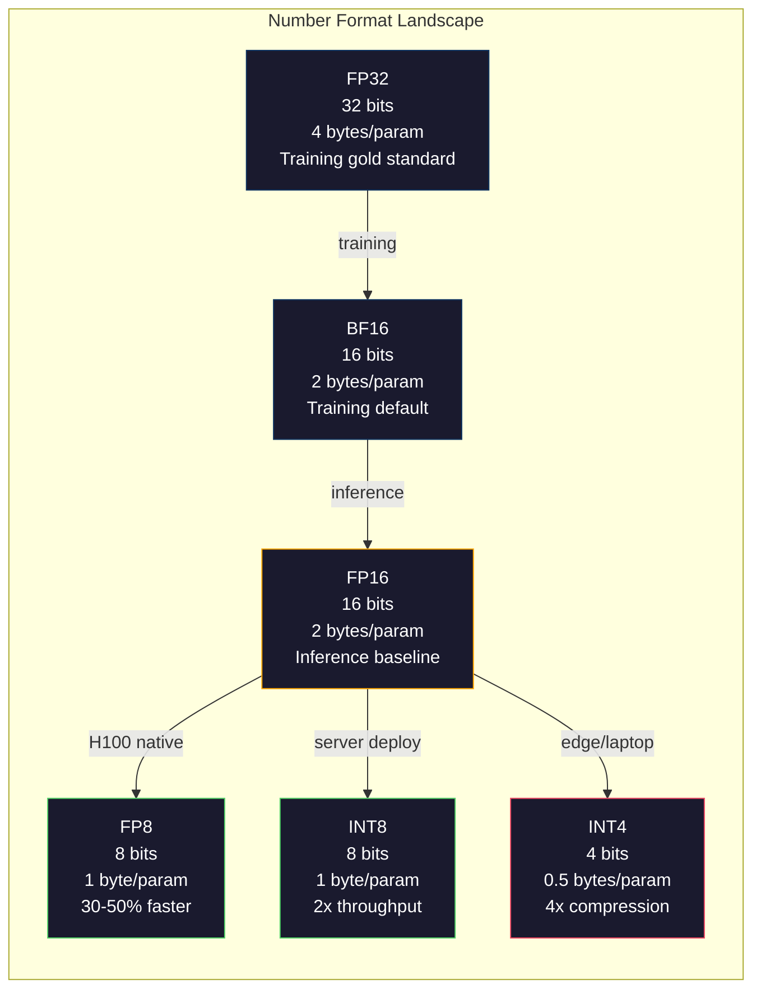
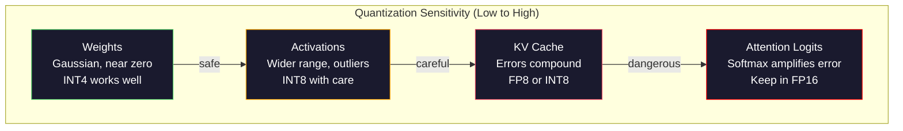
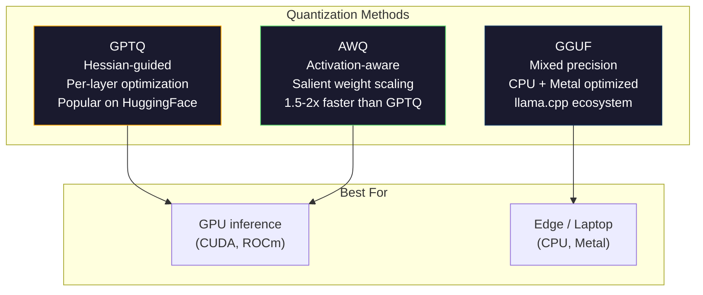

# Quantization: Làm cho Models phù hợp

> Một model 70B trong FP16 cần 140GB. Hai A100 chỉ dành cho trọng lượng. Lượng tử hóa thành FP8: một GPU 80GB. INT4: một MacBook.

**Loại:** Xây dựng
**Ngôn ngữ:** Python (with numpy)
**Kiến thức tiên quyết:** Giai đoạn 10, Bài 01-10 (LLMs từ đầu)
**Thời lượng:** ~120 phút

## Mục tiêu học tập

- Triển khai quantization đối xứng và không đối xứng từ FP16 đến INT8 và INT4, bao gồm tỷ lệ trên mỗi tensor và trên mỗi kênh
- Tính toán mức tiết kiệm bộ nhớ từ quantization và xác định precision nào phù hợp với VRAM của GPU nhất định
- Giải thích sự khác biệt giữa training nhận biết sau training quantization (PTQ) và nhận thức quantization (QAT)
- Áp dụng GPTQ hoặc AWQ để lượng tử hóa một model thực và đo lường sự đánh đổi accuracy-bộ nhớ trên một benchmark

## Vấn đề

Llama3 70B có 70 tỷparameters. Mỗiparameterlà một số dấu phẩy động 16 bit. Đó là 140 tỷ byte. 140GB. Một A100 có 80GBVRAM. Bạn thậm chí không thể tải tạ, chứ đừng nói đến việc chạyinference, trên mộtGPU. Bạn cần hai chiếc A100 với giá $2/hourmỗi người chỉ để phục vụ mộtmodel.

Nhưng 16 bit mỗi parameter là lãng phí. Hầu hết các trọng số trong một cụm mạng nơ-ron gần bằng không. Dải động đầy đủ của FP16 (từ 0,000000059 đến 65,504) gần như hoàn toàn không được sử dụng. Nếu bạn đo sự phân bố thực tế của trọng số trong Llama 3 70B, 95% trong số chúng nằm trong khoảng từ -0,1 đến +0,1. Bạn đang ghi 16 bit để biểu thị các giá trị có thể phù hợp với 4.

Quantization thay thế các số có precision cao bằng các số có precision thấp hơn. FP16 đến FP8 cắt giảm một nửa bộ nhớ. FP16 đến INT4 cắt giảm nó xuống còn một phần tư. model 140GB đó trở thành 35GB. Nó phù hợp với một GPU tiêu dùng duy nhất. Đẩy lên quantization 2-bit (tích cực, mất dữ liệu, nhưng có thể sử dụng được cho một số tác vụ) và model tương tự chạy trên máy tính xách tay 16GB.

Chi phí là accuracy. Mỗi bit bạn loại bỏ sẽ phá hủy thông tin. Câu hỏi đặt ra là bạn mất bao nhiêu accuracy và ở đâu. Một model INT4 được lượng tử hóa tốt vẫn giữ được 95-99% chất lượng của bản gốc trên hầu hết các benchmarks. Một quantization ngây thơ đối với INT4 có thể phá hủy hoàn toàn model. Sự khác biệt là kỹ thuật.

Lượng tử hóa cộng đồng từ Llama 3 đến INT4 với GPTQ cho thấy khoảng 1-2 điểm perplexity bị mất trên WikiText. Mistral đã phát hành FP8 checkpoints của Mixtral 8x22B với loss chất lượng không đo lường được trên MMLU. Định dạng GGUF cung cấp năng lượng cho llama.cpp, chạy 70B models trên MacBook với chip M-series. Quantization không phải là một bản hack. Đây là đường dẫn triển khai tiêu chuẩn cho mọi model lớn hơn 7B.

## Khái niệm

### Định dạng số: Mỗi bit làm gì

Mỗi số dấu phẩy động có ba phần: dấu, số mũ và mantissa (còn được gọi là dấu hiệu). Dấu là một bit. Số mũ xác định phạm vi (số có thể lớn hay nhỏ). Mantissa xác định precision (bạn nhận được bao nhiêu chữ số thập phân).

```
FP32:  [1 sign] [8 exponent] [23 mantissa]  = 32 bits
FP16:  [1 sign] [5 exponent] [10 mantissa]  = 16 bits
BF16:  [1 sign] [8 exponent] [7  mantissa]  = 16 bits
FP8:   [1 sign] [4 exponent] [3  mantissa]  = 8  bits (E4M3)
FP8:   [1 sign] [5 exponent] [2  mantissa]  = 8  bits (E5M2)
INT8:  [1 sign] [7 value]                   = 8  bits (uniform steps)
INT4:  [1 sign] [3 value]                   = 4  bits (16 levels total)
```

**FP32** đầy precision. 23 bit mantissa cung cấp cho bạn khoảng 7 chữ số thập phân của precision. Phạm vi: khoảng 1.2 x 10^-38 đến 3.4 x 10^38. Training từng xảy ra độc quyền trong FP32. Nó vẫn làm cho tích lũy (chạy tổng trong quá trình nhân ma trận).

**FP16** giảm một nửa số bit. 10 bit mantissa cho khoảng 3,3 chữ số thập phân. Số mũ thu nhỏ xuống còn 5 bit, giảm đáng kể phạm vi (giá trị tối đa ~65,504). Điều này tốt đối với trọng số (cụm gần bằng không) nhưng nguy hiểm cho các kích hoạt và gradients có thể tăng đột biến trong quá trình training. FP16 training yêu cầu loss tỷ lệ để ngăn chặn dòng chảy.

**BF16 **(Brain Float 16) giữ số mũ 8 bit từ FP32 nhưng thu nhỏ mantissa xuống 7 bit. Phạm vi tương tự như FP32, ít precision hơn FP16. Google đã thiết kế nó đặc biệt cho học sâu. Trực giác: phạm vi quan trọng hơn precision đối với mạng nơ-ron. Một gradient 10 ^ -20 tràn xuống không trong FP16 vẫn tồn tại trong BF16. Trọng số 0,07342 làm tròn thành 0,0734 trong BF16 là đủ gần. Mọi training hiện đại đều sử dụng BF16 hoặc hỗn hợp BF16/FP32.

**FP8** có hai hương vị. E4M3 (4 số mũ, 3 bọ ngựa) được sử dụng cho trọng lượng và kích hoạt trong quá trình inference. E5M2 (5 số mũ, 2 bọ ngựa) được sử dụng để gradients trong training khi phạm vi quan trọng hơn precision. FP8 inference trên H100 GPUs đạt được tốc độ tăng 30-50% so với FP16 với chất lượng loss không đáng kể.

**INT8** là định dạng số nguyên. Không có số mũ, không có bọ ngựa. Chỉ có 256 giá trị cách đều nhau từ -128 đến 127. Bạn cần một hệ số tỷ lệ để ánh xạ trọng số dấu phẩy động vào phạm vi này. Ưu điểm: số học số nguyên nhanh hơn và tiết kiệm năng lượng hơn dấu phẩy động. Phép nhân ma trận INT8 trên A100 chạy ở mức 624 TOPS so với 312 TFLOPS đối với FP16.

**INT4** đẩy xa hơn. Chỉ có 16 giá trị có thể. Hệ số tỷ lệ thực hiện việc nâng vật nặng. Chất lượng phụ thuộc hoàn toàn vào cách bạn chọn cân và trọng lượng bạn định lượng. Các phương pháp INT4 hiện đại (GPTQ, AWQ) giữ lại 95%+ chất lượng model ban đầu.



### Cách thức hoạt động của Quantization

Thao tác cốt lõi rất đơn giản. Lấy tensor các giá trị dấu phẩy động, tìm hệ số tỷ lệ, nhân, làm tròn đến số nguyên gần nhất và lưu trữ các số nguyên cộng với hệ số tỷ lệ.

**Lượng hóa:**
```
scale = max(abs(tensor)) / max_int_value
quantized = round(tensor / scale)
```

**Giải lượng tử:**
```
reconstructed = quantized * scale
```

Đối với INT8 có phạm vi đối xứng (-127 đến 127):
```
scale = max(abs(tensor)) / 127
quantized = clamp(round(tensor / scale), -128, 127)
```

Lỗi là lỗi làm tròn. Mỗi giá trị có thể bị lệch tối đa `scale / 2`. Tổng sai số trên một lớp phụ thuộc vào số lượng trọng số bạn có và mức độ nhạy cảm của model với nhiễu loạn trong các trọng số đó.

**quantization trên mỗi tensor so với mỗi kênh.** Mỗi tensor sử dụng một hệ số tỷ lệ cho toàn bộ ma trận trọng lượng. Đơn giản nhưng mất dữ liệu: nếu một cột có giá trị lớn và cột khác có giá trị nhỏ, các giá trị nhỏ sẽ mất hầu hết precision của chúng. Mỗi kênh sử dụng một hệ số tỷ lệ cho mỗi kênh đầu ra (mỗi hàng hoặc cột của ma trận trọng lượng). Nhiều chi phí hơn (bạn lưu trữ N hệ số tỷ lệ thay vì 1) nhưng chất lượng tốt hơn đáng kể. Mỗi phương pháp production quantization đều sử dụng độ chi tiết trên mỗi kênh hoặc mịn hơn.

**quantization không đối xứng** thêm độ lệch điểm không: `quantized = round(tensor / scale) + zero_point`. Điều này xử lý các phân phối không được căn giữa bằng không. Ví dụ: ReLU kích hoạt luôn không âm. quantization đối xứng lãng phí một nửa phạm vi số nguyên vào các giá trị âm không bao giờ xuất hiện. quantization bất đối xứng ánh xạ phạm vi thực tế [tối thiểu, tối đa] với phạm vi số nguyên đầy đủ.

### Hệ thống phân cấp độ nhạy

Không phải mọi thứ trong một model đều chịu đựng quantization như nhau. Có một hệ thống phân cấp rõ ràng.

**Trọng số (mạnh mẽ nhất).** Trọng số Model thay đổi chậm trong quá trình training và tuân theo phân phối Gaussian gần như trung tâm bằng không. Chúng lượng tử hóa tốt. Trọng lượng INT8 với cân trên mỗi kênh tạo ra kết quả gần như không mất dữ liệu. INT4 yêu cầu các phương pháp phức tạp hơn nhưng hoạt động.

**Kích hoạt (độ nhạy trung bình).** Kích hoạt là các giá trị trung gian chảy qua mạng trong quá trình inference. Chúng có dải động rộng hơn trọng số và chứa các giá trị ngoại lệ. Một đầu attention duy nhất có thể tạo ra các giá trị kích hoạt lớn hơn 100 lần so với giá trị trung bình. Những giá trị ngoại lệ này rất quan trọng đối với chất lượng model. Lượng tử hóa chúng phá hủy thông tin một cách ngây thơ. Giải pháp: giữ các kênh ngoại lệ ở precision cao hơn (LLM.int8()), sử dụng thang kích hoạt trên mỗi token hoặc trên mỗi kênh.

**KV cache (độ nhạy cao).** Bộ nhớ đệm khóa-giá trị lưu trữ trạng thái attention cho tất cả các tokens trước đó. Ở độ dài ngữ cảnh dài, KV cache chiếm ưu thế trong bộ nhớ. Đối với model 70B ở ngữ cảnh 32K, chỉ riêng KV cache là 40GB trong FP16. Lượng tử hóa KV cache thành FP8 hoặc INT8 giúp tiết kiệm bộ nhớ lớn nhưng bất kỳ lỗi nào cũng ảnh hưởng đến tất cả các tính toán attention trong tương lai. Tác động chất lượng theo độ dài trình tự.

**Attention logits (nhạy cảm nhất).** softmax trong attention rất nhạy cảm với những thay đổi nhỏ trong đầu vào của nó. Sai số quantization 0,01 trong softmax logit trước có thể thay đổi phân phối attention một cách có ý nghĩa. Hầu hết các sơ đồ quantization giữ tính toán attention ở precision cao hơn (FP16 hoặc BF16) ngay cả khi mọi thứ khác đều được lượng tử hóa.



### PTQ so với QAT

**Post-Training Quantization (PTQ)** định lượng một model đã được huấn luyện. Không huấn luyện lại. Bạn lấy trọng số FP16, tính toán hệ số tỷ lệ, làm tròn và triển khai. Nhanh (vài phút đến vài giờ) và rẻ. Hoạt động tốt cho INT8 và FP8. Đối với INT4, PTQ ngây thơ thường bị lỗi nghiêm trọng vì lỗi làm tròn tích lũy. Các phương pháp PTQ nâng cao (GPTQ, AWQ) sử dụng dữ liệu hiệu chuẩn để giảm thiểu lỗi quantization.

**Quantization-Aware Training (QAT)** chèn các phép toán quantization giả vào forward pass trong quá trình training. model học cách đặt trọng số của nó ở nơi có lỗi làm tròn nhỏ. Gradients luồng qua quantization giả bằng cách sử dụng công cụ ước tính thẳng (STE): giả sử thao tác làm tròn có gradient 1. QAT tạo ra models INT4 và INT2 tốt hơn PTQ nhưng yêu cầu chạy training đầy đủ. Google đã sử dụng QAT để phân phát hiệu quả Gemini. Meta đã sử dụng QAT cho một số mục tiêu triển khai Llama.

| Khía cạnh | PTQ | QAT |
|--------|-----|-----|
| Phí Tổn | Phút đến giờ | Chạy training đầy đủ |
| Chất lượng tại INT8 | Xuất sắc (< 0.1% loss) | Thông minh |
| Chất lượng tại INT4 | Tốt với GPTQ/AWQ (1-3% loss) | Tốt hơn (< 1% loss) |
| Chất lượng tại INT2 | Nghèo | Có thể sử dụng cho một số nhiệm vụ |
| Dữ liệu hiệu chuẩn | 128-1024 ví dụ | training dataset đầy đủ |
| Trường hợp sử dụng | Triển khai, lặp lại | Chất lượng tối đa ở độ rộng bit thấp |

### GPTQ, AWQ, GGUF

**GPTQ (GPT Quantization)** là một phương pháp PTQ one-shot. Nó lượng tử hóa trọng số từng lớp một, sử dụng một dataset hiệu chuẩn nhỏ (điển hình là 128 ví dụ) để đo Hessian (thông tin bậc hai về mức độ nhạy cảm của đầu ra đối với mỗi trọng lượng). Trọng số mà Hessian nói là quan trọng được lượng tử hóa cẩn thận hơn. GPTQ là phương pháp đầu tiên làm cho INT4 quantization thực tế cho LLMs. TheBloke trên Hugging Face phổ biến GPTQ bằng cách phát hành các phiên bản lượng tử hóa của hàng trăm models.

**AWQ (Activation-Aware Weight Quantization)** quan sát thấy rằng một phần nhỏ trọng số (khoảng 1%) quan trọng không tương xứng vì chúng nhân lên với các giá trị kích hoạt lớn. AWQ xác định các trọng số nổi bật này bằng cách sử dụng dữ liệu hiệu chuẩn và tăng tỷ lệ chúng trước khi quantization (sau đó giảm tỷ lệ kích hoạt tương ứng). Điều này giữ cho các trọng số quan trọng trong phạm vi mà quantization INT4 là chính xác. AWQ thường phù hợp hoặc đánh bại một chút chất lượng GPTQ trong khi áp dụng nhanh hơn 1,5-2 lần.

**GGUF (GPT-Generated Định dạng hợp nhất)** là định dạng tệp được sử dụng bởi llama.cpp và hệ sinh thái của nó. Nó hỗ trợ quantization hỗn hợp: các lớp khác nhau có độ rộng bit khác nhau. Các lớp đầu tiên và cuối cùng (embedding và đầu ra) thường được giữ ở precision cao hơn. Các lớp giữa nhận INT4 hoặc INT3. Các tệp GGUF khép kín: trọng số, tokenizer, siêu dữ liệu tất cả trong một tệp. Định dạng này được thiết kế cho CPU inference và Apple Silicon, trong đó tải toàn bộ model vào bộ nhớ và chạy phép nhân ma trận trên CPU hoặc Metal GPU là đường dẫn tiêu chuẩn. Q4_K_M là biến thể GGUF quantization phổ biến nhất, cân bằng giữa chất lượng và kích thước.



### Đo lường chất lượng

Làm thế nào để bạn biết liệu model lượng tử của bạn có còn tốt hay không?

**Perplexity.** Số liệu phổ biến nhất. Thấp hơn là tốt hơn. Tính toán perplexity trên một dataset được giữ lại (WikiText-2 là tiêu chuẩn) cho cả model gốc và lượng tử hóa. Delta cho bạn biết quantization đã phá hủy bao nhiêu thông tin. Quy tắc ngón tay cái: delta < 0.5 là tuyệt vời, 0.5-1.0 là tốt, 1.0-2.0 là chấp nhận được cho hầu hết các tác vụ > 2.0 có nghĩa là có sự cố.

**benchmarks cụ thể theo nhiệm vụ.** Chạy model lượng tử hóa trên MMLU, HumanEval, GSM8K hoặc bộ đánh giá tùy chỉnh của bạn. So sánh với bản gốc. Quantization ảnh hưởng không đồng đều đến các khả năng khác nhau. Các tác vụ toán học và mã nhạy cảm với precision loss hơn kiến thức chung.

**So sánh đầu ra.** Tạo phản hồi từ cả hai models trên cùng một prompts và so sánh. LLM-as-judge (Bài 10) hoạt động tốt ở đây. Tính tỷ lệ thắng: phần nào của model prompts lượng tử hóa khớp hoặc đánh bại bản gốc?

**Độ trễ và thông lượng.** Quantization tồn tại để làm cho models nhanh hơn và rẻ hơn. Đo tokens mỗi giây, thời gian đến token đầu tiên và mức sử dụng bộ nhớ. Một model lượng tử hóa chậm hơn bản gốc còn tệ hơn là vô dụng.

| Model | Định dạng | Kích thước | Perplexity (WikiText-2) | MMLU | Tokens/sec (A100) |
|-------|--------|------|------------------------|------|-------------------|
| Llama 3 70B | FP16 | 140GB | 3.12 | 79.5% | 38 |
| Llama 3 70B | FP8 | 70GB | 3.14 | 79.3% | 55 |
| Llama 3 70B | GPTQ INT4 | 35 GB | 4.32 | 77.8% | 72 |
| Llama 3 70B | AWQ INT4 | 35 GB | 4.18 | 78.1% | 75 |
| Llama 3 70B | GGUF Q4_K_M | 40GB | 4.25 | 77.9% | 28 (CPU) |

Mô hình: FP8 gần như miễn phí. INT4 tốn 1-2 điểm MMLU nhưng tăng gấp đôi thông lượng và bộ nhớ quý. Sự đánh đổi là xứng đáng cho hầu hết mọi triển khai.

### Số thực

FP16 đến FP8 trên H100: Tăng tốc inference 30-50%, loss chất lượng < 0.1%. Đây là quantization không cần bàn cãi. Mọi triển khai H100 nên sử dụng nó.

FP16 đến INT8 (LLM.int8()): Giảm bộ nhớ gấp 2 lần, < loss chất lượng 0,5%. Cách tiếp cận hỗn hợp precision giữ features ngoại lệ trong FP16 trong khi lượng tử hóa mọi thứ khác thành INT8.

FP16 đến INT4 (GPTQ/AWQ): giảm bộ nhớ gấp 4 lần, chất lượng 1-3% loss tùy thuộc vào model và phương pháp. Cho phép models 70B trên một GPU 48GB duy nhất.

FP16 đến INT4 (GGUF Q4_K_M): Giảm bộ nhớ 3,5 lần, chất lượng loss 1-2%. Tối ưu hóa cho CPU inference. model 70B ở Q4_K_M là khoảng 40GB và chạy ở tốc độ 10-15 tokens/second trên M3 Max với 64GB.

FP16 đến INT2: Giảm bộ nhớ 8 lần, chất lượng 5-15% loss. Chỉ khả thi cho các nhiệm vụ hẹp cụ thể mà bạn có thể chịu được sự xuống cấp. Nghiên cứu biên giới, không sẵn sàng production để sử dụng chung.

```figure
quantization
```

## Tự xây dựng

### Bước 1: Biểu diễn định dạng số

Xây dựng biểu diễn cấp bit của từng định dạng để xem chính xác dấu hiệu, số mũ và mantissa làm gì.

```python
import numpy as np


def float_to_fp32_bits(value):
    bits = np.float32(value).view(np.uint32)
    sign = (bits >> 31) & 1
    exponent = (bits >> 23) & 0xFF
    mantissa = bits & 0x7FFFFF
    return {"sign": int(sign), "exponent": int(exponent), "mantissa": int(mantissa),
            "exponent_bits": format(int(exponent), '08b'),
            "mantissa_bits": format(int(mantissa), '023b'),
            "value": float(value),
            "actual_exponent": int(exponent) - 127}


def float_to_fp16_bits(value):
    fp16 = np.float16(value)
    bits = fp16.view(np.uint16)
    sign = (bits >> 15) & 1
    exponent = (bits >> 10) & 0x1F
    mantissa = bits & 0x3FF
    return {"sign": int(sign), "exponent": int(exponent), "mantissa": int(mantissa),
            "exponent_bits": format(int(exponent), '05b'),
            "mantissa_bits": format(int(mantissa), '010b'),
            "value": float(fp16),
            "actual_exponent": int(exponent) - 15}


def float_to_bf16_bits(value):
    fp32_bits = np.float32(value).view(np.uint32)
    bf16_bits = (fp32_bits >> 16).astype(np.uint16)
    sign = (bf16_bits >> 15) & 1
    exponent = (bf16_bits >> 7) & 0xFF
    mantissa = bf16_bits & 0x7F
    reconstructed = np.uint32(bf16_bits.astype(np.uint32) << 16).view(np.float32)
    return {"sign": int(sign), "exponent": int(exponent), "mantissa": int(mantissa),
            "exponent_bits": format(int(exponent), '08b'),
            "mantissa_bits": format(int(mantissa), '07b'),
            "value": float(reconstructed),
            "actual_exponent": int(exponent) - 127}


def simulate_fp8_e4m3(value):
    sign = 1 if value < 0 else 0
    abs_val = abs(value)
    max_val = 448.0
    abs_val = min(abs_val, max_val)
    if abs_val == 0:
        return {"sign": sign, "exponent": 0, "mantissa": 0, "value": 0.0,
                "exponent_bits": "0000", "mantissa_bits": "000"}
    exp = int(np.floor(np.log2(abs_val)))
    exp = max(-6, min(8, exp))
    mantissa_val = abs_val / (2.0 ** exp) - 1.0
    mantissa_quant = round(mantissa_val * 8) / 8
    mantissa_quant = max(0, min(0.875, mantissa_quant))
    reconstructed = (1.0 + mantissa_quant) * (2.0 ** exp)
    if sign:
        reconstructed = -reconstructed
    mantissa_int = int(round(mantissa_quant * 8))
    return {"sign": sign, "exponent": exp + 7, "mantissa": mantissa_int,
            "exponent_bits": format(exp + 7, '04b'),
            "mantissa_bits": format(mantissa_int, '03b'),
            "value": float(reconstructed),
            "actual_exponent": exp}


def display_format_comparison(value):
    fp32 = float_to_fp32_bits(value)
    fp16 = float_to_fp16_bits(value)
    bf16 = float_to_bf16_bits(value)
    fp8 = simulate_fp8_e4m3(value)

    print(f"\n  Value: {value}")
    print(f"  {'Format':<8} {'Stored Value':>14} {'Error':>12} {'Sign':>5} {'Exp Bits':>10} {'Man Bits':>25}")
    print(f"  {'-'*76}")
    print(f"  {'FP32':<8} {fp32['value']:>14.6f} {abs(fp32['value'] - value):>12.8f} {fp32['sign']:>5} {fp32['exponent_bits']:>10} {fp32['mantissa_bits']:>25}")
    print(f"  {'FP16':<8} {fp16['value']:>14.6f} {abs(fp16['value'] - value):>12.8f} {fp16['sign']:>5} {fp16['exponent_bits']:>10} {fp16['mantissa_bits']:>25}")
    print(f"  {'BF16':<8} {bf16['value']:>14.6f} {abs(bf16['value'] - value):>12.8f} {bf16['sign']:>5} {bf16['exponent_bits']:>10} {bf16['mantissa_bits']:>25}")
    print(f"  {'FP8e4m3':<8} {fp8['value']:>14.6f} {abs(fp8['value'] - value):>12.8f} {fp8['sign']:>5} {fp8['exponent_bits']:>10} {fp8['mantissa_bits']:>25}")
```

### Bước 2: Quantization đối xứng (mỗi Tensor và mỗi kênh)

Các hoạt động quantization cơ bản. Mỗi tensor sử dụng một thang đo cho toàn bộ ma trận. Mỗi kênh sử dụng một thang đo cho mỗi hàng hoặc cột.

```python
def quantize_symmetric(tensor, num_bits=8):
    qmin = -(2 ** (num_bits - 1))
    qmax = 2 ** (num_bits - 1) - 1
    abs_max = np.max(np.abs(tensor))
    if abs_max == 0:
        return np.zeros_like(tensor, dtype=np.int32), 1.0
    scale = abs_max / qmax
    quantized = np.clip(np.round(tensor / scale), qmin, qmax).astype(np.int32)
    return quantized, float(scale)


def dequantize_symmetric(quantized, scale):
    return quantized.astype(np.float64) * scale


def quantize_per_channel(tensor, num_bits=8, axis=0):
    qmin = -(2 ** (num_bits - 1))
    qmax = 2 ** (num_bits - 1) - 1

    if axis == 0:
        abs_max = np.max(np.abs(tensor), axis=1, keepdims=True)
    else:
        abs_max = np.max(np.abs(tensor), axis=0, keepdims=True)

    abs_max = np.where(abs_max == 0, 1.0, abs_max)
    scales = abs_max / qmax
    quantized = np.clip(np.round(tensor / scales), qmin, qmax).astype(np.int32)
    return quantized, scales.squeeze()


def dequantize_per_channel(quantized, scales, axis=0):
    if axis == 0:
        return quantized.astype(np.float64) * scales.reshape(-1, 1)
    else:
        return quantized.astype(np.float64) * scales.reshape(1, -1)


def quantize_asymmetric(tensor, num_bits=8):
    qmin = 0
    qmax = 2 ** num_bits - 1
    t_min = np.min(tensor)
    t_max = np.max(tensor)
    if t_max == t_min:
        return np.zeros_like(tensor, dtype=np.int32), 1.0, 0
    scale = (t_max - t_min) / (qmax - qmin)
    zero_point = int(np.round(qmin - t_min / scale))
    zero_point = max(qmin, min(qmax, zero_point))
    quantized = np.clip(np.round(tensor / scale + zero_point), qmin, qmax).astype(np.int32)
    return quantized, float(scale), int(zero_point)


def dequantize_asymmetric(quantized, scale, zero_point):
    return (quantized.astype(np.float64) - zero_point) * scale
```

### Bước 3: Đo lường chất lượng

Đo lượng thông tin quantization phá hủy. Sai số bình phương trung bình, tỷ lệ tín hiệu trên nhiễu và sự tương đồng cosin giữa tensors gốc và tái tạo.

```python
def quantization_error(original, reconstructed):
    diff = original - reconstructed
    mse = float(np.mean(diff ** 2))
    rmse = float(np.sqrt(mse))
    max_error = float(np.max(np.abs(diff)))
    signal_power = float(np.mean(original ** 2))
    snr_db = 10 * np.log10(signal_power / max(mse, 1e-20))

    orig_flat = original.flatten()
    recon_flat = reconstructed.flatten()
    norm_orig = np.linalg.norm(orig_flat)
    norm_recon = np.linalg.norm(recon_flat)
    if norm_orig == 0 or norm_recon == 0:
        cosine_sim = 0.0
    else:
        cosine_sim = float(np.dot(orig_flat, recon_flat) / (norm_orig * norm_recon))

    return {"mse": mse, "rmse": rmse, "max_error": max_error,
            "snr_db": float(snr_db), "cosine_similarity": cosine_sim}


def compare_quantization_methods(tensor, num_bits=8):
    q_pt, s_pt = quantize_symmetric(tensor, num_bits)
    recon_pt = dequantize_symmetric(q_pt, s_pt)
    err_pt = quantization_error(tensor, recon_pt)

    q_pc, s_pc = quantize_per_channel(tensor, num_bits, axis=0)
    recon_pc = dequantize_per_channel(q_pc, s_pc, axis=0)
    err_pc = quantization_error(tensor, recon_pc)

    q_asym, s_asym, zp = quantize_asymmetric(tensor, num_bits)
    recon_asym = dequantize_asymmetric(q_asym, s_asym, zp)
    err_asym = quantization_error(tensor, recon_asym)

    print(f"\n  Quantization Comparison ({num_bits}-bit, tensor shape {tensor.shape}):")
    print(f"  {'Method':<20} {'MSE':>12} {'SNR (dB)':>10} {'Cosine Sim':>12} {'Max Error':>12}")
    print(f"  {'-'*68}")
    print(f"  {'Per-tensor sym':<20} {err_pt['mse']:>12.8f} {err_pt['snr_db']:>10.2f} {err_pt['cosine_similarity']:>12.8f} {err_pt['max_error']:>12.8f}")
    print(f"  {'Per-channel sym':<20} {err_pc['mse']:>12.8f} {err_pc['snr_db']:>10.2f} {err_pc['cosine_similarity']:>12.8f} {err_pc['max_error']:>12.8f}")
    print(f"  {'Asymmetric':<20} {err_asym['mse']:>12.8f} {err_asym['snr_db']:>10.2f} {err_asym['cosine_similarity']:>12.8f} {err_asym['max_error']:>12.8f}")

    return {"per_tensor": err_pt, "per_channel": err_pc, "asymmetric": err_asym}
```

### Bước 4: Quét chiều rộng bit

Lượng tử hóa cùng một tensor ở các độ rộng bit khác nhau (2, 3, 4, 8, 16) và đo lường chất lượng ở mỗi cấp độ. Điều này cho thấy chính xác vị trí của vách đá chất lượng.

```python
def bit_width_sweep(tensor):
    print(f"\n  Bit-Width Sweep (tensor shape {tensor.shape}):")
    print(f"  {'Bits':>6} {'Levels':>8} {'MSE':>14} {'SNR (dB)':>10} {'Cosine Sim':>12} {'Compression':>12}")
    print(f"  {'-'*64}")

    results = []
    for bits in [2, 3, 4, 8, 16]:
        q, s = quantize_per_channel(tensor, bits, axis=0)
        recon = dequantize_per_channel(q, s, axis=0)
        err = quantization_error(tensor, recon)
        levels = 2 ** bits
        compression = 32.0 / bits

        print(f"  {bits:>6} {levels:>8} {err['mse']:>14.8f} {err['snr_db']:>10.2f} {err['cosine_similarity']:>12.8f} {compression:>11.1f}x")
        results.append({"bits": bits, "levels": levels, "error": err, "compression": compression})

    return results
```

### Bước 5: Thí nghiệm độ nhạy

Mô phỏng lượng tử hóa các phần khác nhau của transformer và đo lường thành phần nào nhạy cảm nhất. Điều này thể hiện hệ thống phân cấp độ nhạy: trọng số < kích hoạt < KV cache < attention.

```python
def simulate_transformer_layer(input_data, weights, kv_scale=1.0):
    hidden = input_data @ weights["qkv"]
    seq_len = hidden.shape[1]
    d_model = weights["qkv"].shape[1] // 3
    q, k, v = hidden[:, :, :d_model], hidden[:, :, d_model:2*d_model], hidden[:, :, 2*d_model:]

    attn_scores = (q @ k.transpose(0, 2, 1)) / np.sqrt(d_model) * kv_scale
    attn_max = np.max(attn_scores, axis=-1, keepdims=True)
    attn_exp = np.exp(attn_scores - attn_max)
    attn_weights = attn_exp / np.sum(attn_exp, axis=-1, keepdims=True)

    attn_output = attn_weights @ v
    output = attn_output @ weights["out"]
    return output, {"q": q, "k": k, "v": v, "attn_scores": attn_scores,
                    "attn_weights": attn_weights, "attn_output": attn_output}


def sensitivity_experiment(batch_size=2, seq_len=16, d_model=64, num_bits=8):
    np.random.seed(42)
    input_data = np.random.randn(batch_size, seq_len, d_model) * 0.1

    weights = {
        "qkv": np.random.randn(d_model, 3 * d_model) * (2.0 / d_model) ** 0.5,
        "out": np.random.randn(d_model, d_model) * (2.0 / d_model) ** 0.5,
    }

    baseline_output, baseline_internals = simulate_transformer_layer(input_data, weights)

    experiments = {}

    q_qkv, s_qkv = quantize_per_channel(weights["qkv"], num_bits, axis=0)
    q_out, s_out = quantize_per_channel(weights["out"], num_bits, axis=0)
    quantized_weights = {
        "qkv": dequantize_per_channel(q_qkv, s_qkv, axis=0),
        "out": dequantize_per_channel(q_out, s_out, axis=0),
    }
    weight_quant_output, _ = simulate_transformer_layer(input_data, quantized_weights)
    experiments["Weights only"] = quantization_error(baseline_output, weight_quant_output)

    _, fresh_internals = simulate_transformer_layer(input_data, weights)
    q_act, s_act = quantize_per_channel(
        fresh_internals["attn_output"].reshape(-1, d_model), num_bits, axis=0
    )
    quant_attn_out = dequantize_per_channel(q_act, s_act, axis=0).reshape(batch_size, seq_len, d_model)
    act_quant_output = quant_attn_out @ weights["out"]
    experiments["Activations only"] = quantization_error(baseline_output, act_quant_output)

    q_k, s_k = quantize_per_channel(fresh_internals["k"].reshape(-1, d_model), num_bits, axis=0)
    q_v, s_v = quantize_per_channel(fresh_internals["v"].reshape(-1, d_model), num_bits, axis=0)
    quant_k = dequantize_per_channel(q_k, s_k, axis=0).reshape(batch_size, seq_len, d_model)
    quant_v = dequantize_per_channel(q_v, s_v, axis=0).reshape(batch_size, seq_len, d_model)
    attn_scores_kv = (fresh_internals["q"] @ quant_k.transpose(0, 2, 1)) / np.sqrt(d_model)
    attn_max_kv = np.max(attn_scores_kv, axis=-1, keepdims=True)
    attn_exp_kv = np.exp(attn_scores_kv - attn_max_kv)
    attn_weights_kv = attn_exp_kv / np.sum(attn_exp_kv, axis=-1, keepdims=True)
    kv_quant_output = (attn_weights_kv @ quant_v) @ weights["out"]
    experiments["KV cache only"] = quantization_error(baseline_output, kv_quant_output)

    noise_scale = np.std(fresh_internals["attn_scores"]) * 0.05
    noisy_scores = fresh_internals["attn_scores"] + np.random.randn(*fresh_internals["attn_scores"].shape) * noise_scale
    noisy_max = np.max(noisy_scores, axis=-1, keepdims=True)
    noisy_exp = np.exp(noisy_scores - noisy_max)
    noisy_weights = noisy_exp / np.sum(noisy_exp, axis=-1, keepdims=True)
    attn_quant_output = (noisy_weights @ fresh_internals["v"]) @ weights["out"]
    experiments["Attention logits (5% noise)"] = quantization_error(baseline_output, attn_quant_output)

    print(f"\n  Sensitivity Experiment ({num_bits}-bit quantization):")
    print(f"  {'Component':<30} {'MSE':>14} {'SNR (dB)':>10} {'Cosine Sim':>12}")
    print(f"  {'-'*68}")
    for name, err in sorted(experiments.items(), key=lambda x: x[1]["mse"]):
        print(f"  {name:<30} {err['mse']:>14.8f} {err['snr_db']:>10.2f} {err['cosine_similarity']:>12.8f}")

    return experiments
```

### Bước 6: Mô phỏng GPTQ

GPTQ lượng tử hóa từng cột một, sử dụng Hessian để quyết định cách phân phối sai số làm tròn. Đây là phiên bản đơn giản hóa nắm bắt được ý tưởng cốt lõi: sử dụng dữ liệu hiệu chuẩn để đo lường tầm quan trọng của trọng lượng, sau đó lượng tử hóa các trọng số ít quan trọng nhất một cách tích cực hơn.

```python
def simulated_gptq(weight_matrix, calibration_inputs, num_bits=4):
    n_in, n_out = weight_matrix.shape
    qmin = -(2 ** (num_bits - 1))
    qmax = 2 ** (num_bits - 1) - 1

    H = np.zeros((n_in, n_in))
    for x in calibration_inputs:
        x = x.reshape(-1, 1) if x.ndim == 1 else x
        for row in range(x.shape[0]):
            xi = x[row].reshape(-1, 1)
            H += xi @ xi.T
    H /= len(calibration_inputs)
    H += np.eye(n_in) * 1e-4

    weight_importance = np.diag(H)

    quantized = np.zeros_like(weight_matrix, dtype=np.int32)
    scales = np.zeros(n_out)
    errors = np.zeros(n_out)

    W = weight_matrix.copy()

    for col in range(n_out):
        w_col = W[:, col]
        abs_max = np.max(np.abs(w_col))
        if abs_max == 0:
            scales[col] = 1.0
            continue
        scale = abs_max / qmax
        scales[col] = scale

        q_col = np.clip(np.round(w_col / scale), qmin, qmax).astype(np.int32)
        quantized[:, col] = q_col

        quant_error = w_col - q_col * scale
        errors[col] = np.sqrt(np.mean(quant_error ** 2))

        if col < n_out - 1:
            importance_weights = weight_importance / (np.max(weight_importance) + 1e-10)
            for next_col in range(col + 1, min(col + 4, n_out)):
                compensation = quant_error * importance_weights * 0.1
                W[:, next_col] += compensation

    return quantized, scales, {"column_errors": errors,
                               "mean_error": float(np.mean(errors)),
                               "max_error": float(np.max(errors))}


def dequantize_gptq(quantized, scales):
    result = np.zeros_like(quantized, dtype=np.float64)
    for col in range(quantized.shape[1]):
        result[:, col] = quantized[:, col] * scales[col]
    return result
```

### Bước 7: Mô phỏng AWQ

AWQ xác định trọng số nổi bật (những trọng số nhân lên với các kích hoạt lớn) và bảo vệ chúng bằng cách mở rộng quy mô trước khi quantization.

```python
def simulated_awq(weight_matrix, calibration_inputs, num_bits=4, salient_fraction=0.01):
    n_in, n_out = weight_matrix.shape
    qmin = -(2 ** (num_bits - 1))
    qmax = 2 ** (num_bits - 1) - 1

    activation_magnitudes = np.zeros(n_in)
    for x in calibration_inputs:
        if x.ndim == 1:
            activation_magnitudes += np.abs(x)
        else:
            activation_magnitudes += np.mean(np.abs(x), axis=0)
    activation_magnitudes /= len(calibration_inputs)

    n_salient = max(1, int(n_in * salient_fraction))
    salient_indices = np.argsort(activation_magnitudes)[-n_salient:]

    scale_factors = np.ones(n_in)
    for idx in salient_indices:
        col_max = np.max(np.abs(weight_matrix[idx, :]))
        if col_max > 0:
            scale_factors[idx] = min(4.0, 1.0 / (col_max + 1e-8) * np.mean(np.abs(weight_matrix)))

    scaled_weights = weight_matrix * scale_factors.reshape(-1, 1)

    quantized, scales = quantize_per_channel(scaled_weights, num_bits, axis=0)
    dequantized = dequantize_per_channel(quantized, scales, axis=0)

    result = dequantized / scale_factors.reshape(-1, 1)

    err = quantization_error(weight_matrix, result)

    return result, {"salient_indices": salient_indices,
                    "scale_factors": scale_factors[salient_indices],
                    "error": err,
                    "n_salient": n_salient}
```

### Bước 8: Pipeline đầy đủ

Nối mọi thứ lại với nhau. So sánh quantization ngây thơ, mỗi kênh, GPTQ và AWQ trên cùng một ma trận trọng lượng.

```python
def full_quantization_comparison(d_in=256, d_out=512, num_bits=4, n_calibration=32):
    np.random.seed(42)

    weight = np.random.randn(d_in, d_out) * 0.02
    outlier_rows = np.random.choice(d_in, size=5, replace=False)
    weight[outlier_rows] *= 10

    calibration = [np.random.randn(8, d_in) * 0.1 for _ in range(n_calibration)]

    q_naive, s_naive = quantize_symmetric(weight, num_bits)
    recon_naive = dequantize_symmetric(q_naive, s_naive)
    err_naive = quantization_error(weight, recon_naive)

    q_pc, s_pc = quantize_per_channel(weight, num_bits, axis=0)
    recon_pc = dequantize_per_channel(q_pc, s_pc, axis=0)
    err_pc = quantization_error(weight, recon_pc)

    q_gptq, s_gptq, gptq_info = simulated_gptq(weight, calibration, num_bits)
    recon_gptq = dequantize_gptq(q_gptq, s_gptq)
    err_gptq = quantization_error(weight, recon_gptq)

    recon_awq, awq_info = simulated_awq(weight, calibration, num_bits)
    err_awq = awq_info["error"]

    print(f"\n  Full Quantization Comparison ({num_bits}-bit, {d_in}x{d_out} matrix)")
    print(f"  Matrix has {len(outlier_rows)} outlier rows (10x scale)")
    print()
    print(f"  {'Method':<20} {'MSE':>14} {'SNR (dB)':>10} {'Cosine Sim':>12}")
    print(f"  {'-'*58}")
    print(f"  {'Naive per-tensor':<20} {err_naive['mse']:>14.8f} {err_naive['snr_db']:>10.2f} {err_naive['cosine_similarity']:>12.8f}")
    print(f"  {'Per-channel':<20} {err_pc['mse']:>14.8f} {err_pc['snr_db']:>10.2f} {err_pc['cosine_similarity']:>12.8f}")
    print(f"  {'Simulated GPTQ':<20} {err_gptq['mse']:>14.8f} {err_gptq['snr_db']:>10.2f} {err_gptq['cosine_similarity']:>12.8f}")
    print(f"  {'Simulated AWQ':<20} {err_awq['mse']:>14.8f} {err_awq['snr_db']:>10.2f} {err_awq['cosine_similarity']:>12.8f}")

    test_input = np.random.randn(4, d_in) * 0.1
    baseline = test_input @ weight
    output_naive = test_input @ recon_naive
    output_pc = test_input @ recon_pc
    output_gptq = test_input @ recon_gptq
    output_awq = test_input @ recon_awq

    print(f"\n  End-to-End Output Error (matmul with test input):")
    print(f"  {'Method':<20} {'Output MSE':>14} {'Output Cosine':>14}")
    print(f"  {'-'*50}")
    for name, output in [("Naive", output_naive), ("Per-channel", output_pc),
                          ("GPTQ", output_gptq), ("AWQ", output_awq)]:
        out_err = quantization_error(baseline, output)
        print(f"  {name:<20} {out_err['mse']:>14.8f} {out_err['cosine_similarity']:>14.8f}")

    return {"naive": err_naive, "per_channel": err_pc, "gptq": err_gptq, "awq": err_awq}


def memory_calculator(num_params_billions, bits_per_param):
    bytes_per_param = bits_per_param / 8
    total_bytes = num_params_billions * 1e9 * bytes_per_param
    total_gb = total_bytes / (1024 ** 3)
    return total_gb


def print_memory_table():
    print("\n  Memory Requirements by Model and Precision:")
    print(f"  {'Model':<15} {'FP32':>8} {'FP16':>8} {'FP8':>8} {'INT8':>8} {'INT4':>8} {'INT2':>8}")
    print(f"  {'-'*64}")
    for name, params in [("7B", 7), ("13B", 13), ("34B", 34), ("70B", 70), ("405B", 405)]:
        fp32 = memory_calculator(params, 32)
        fp16 = memory_calculator(params, 16)
        fp8 = memory_calculator(params, 8)
        int8 = memory_calculator(params, 8)
        int4 = memory_calculator(params, 4)
        int2 = memory_calculator(params, 2)
        print(f"  {name:<15} {fp32:>7.1f}G {fp16:>7.1f}G {fp8:>7.1f}G {int8:>7.1f}G {int4:>7.1f}G {int2:>7.1f}G")


if __name__ == "__main__":
    np.random.seed(42)

    print("=" * 70)
    print("QUANTIZATION: MAKING MODELS FIT")
    print("=" * 70)

    print("\nSTEP 1: Number Format Comparison")
    print("-" * 50)
    for val in [0.1, 3.14159, -0.00073, 42.5, 0.0000012]:
        display_format_comparison(val)

    print("\n\nSTEP 2: Memory Requirements")
    print("-" * 50)
    print_memory_table()

    print("\n\nSTEP 3: Quantization Methods Comparison")
    print("-" * 50)
    weight_matrix = np.random.randn(128, 256) * 0.02
    weight_matrix[0] *= 15
    weight_matrix[42] *= 8
    compare_quantization_methods(weight_matrix, num_bits=8)
    compare_quantization_methods(weight_matrix, num_bits=4)

    print("\n\nSTEP 4: Bit-Width Sweep")
    print("-" * 50)
    sweep_tensor = np.random.randn(64, 128) * 0.05
    bit_width_sweep(sweep_tensor)

    print("\n\nSTEP 5: Sensitivity Experiment")
    print("-" * 50)
    print("\n  INT8:")
    sensitivity_experiment(num_bits=8)
    print("\n  INT4:")
    sensitivity_experiment(num_bits=4)

    print("\n\nSTEP 6: GPTQ vs AWQ vs Naive (INT4)")
    print("-" * 50)
    full_quantization_comparison(d_in=256, d_out=512, num_bits=4)

    print("\n\nSTEP 7: Distribution Analysis")
    print("-" * 50)
    np.random.seed(0)
    simulated_weights = np.random.randn(1000) * 0.02
    abs_vals = np.abs(simulated_weights)
    pct_in_range = np.mean(abs_vals < 0.1) * 100
    print(f"\n  Simulated weight distribution (1000 params, std=0.02):")
    print(f"  Weights in [-0.1, 0.1]: {pct_in_range:.1f}%")
    print(f"  Weights in [-0.05, 0.05]: {np.mean(abs_vals < 0.05) * 100:.1f}%")
    print(f"  Weights in [-0.01, 0.01]: {np.mean(abs_vals < 0.01) * 100:.1f}%")
    print(f"  Max absolute value: {np.max(abs_vals):.6f}")
    print(f"  Mean absolute value: {np.mean(abs_vals):.6f}")

    histogram = np.histogram(simulated_weights, bins=20)
    print(f"\n  Weight histogram:")
    max_count = max(histogram[0])
    for i in range(len(histogram[0])):
        bar_len = int(histogram[0][i] / max_count * 40)
        lo = histogram[1][i]
        hi = histogram[1][i + 1]
        print(f"  [{lo:>7.4f}, {hi:>7.4f}] {'#' * bar_len} ({histogram[0][i]})")

    print("\n\n" + "=" * 70)
    print("DONE")
    print("=" * 70)
```

## Ứng dụng

### Lượng tử hóa với AutoGPTQ

```python
# pip install auto-gptq transformers
# from auto_gptq import AutoGPTQForCausalLM, BaseQuantizeConfig
# from transformers import AutoTokenizer
#
# model_id = "meta-llama/Llama-3.1-8B"
# quantize_config = BaseQuantizeConfig(
#     bits=4,
#     group_size=128,
#     desc_act=False,
# )
#
# tokenizer = AutoTokenizer.from_pretrained(model_id)
# model = AutoGPTQForCausalLM.from_pretrained(model_id, quantize_config)
#
# calibration = [tokenizer(t, return_tensors="pt") for t in calibration_texts[:128]]
# model.quantize(calibration)
# model.save_quantized("llama-8b-gptq-int4")
```

### Định lượng hóa với AutoAWQ

```python
# pip install autoawq
# from awq import AutoAWQForCausalLM
# from transformers import AutoTokenizer
#
# model_id = "meta-llama/Llama-3.1-8B"
# model = AutoAWQForCausalLM.from_pretrained(model_id)
# tokenizer = AutoTokenizer.from_pretrained(model_id)
#
# model.quantize(tokenizer, quant_config={"zero_point": True, "q_group_size": 128, "w_bit": 4})
# model.save_quantized("llama-8b-awq-int4")
```

### Chuyển đổi sang GGUF

```bash
# pip install llama-cpp-python
# python convert_hf_to_gguf.py meta-llama/Llama-3.1-8B --outtype q4_k_m --outfile llama-8b-q4km.gguf
# llama-server -m llama-8b-q4km.gguf -c 4096 -ngl 99
```

### Phục vụ với vLLM

```python
# pip install vllm
# vllm serve model-awq --quantization awq --dtype half --max-model-len 8192
```

vLLM hỗ trợ models AWQ và GPTQ nguyên bản. Nó xử lý việc khử lượng tử hóa trong quá trình nhân ma trận và sử dụng attention được phân trang cho KV cache. Đối với FP8 trên H100, hãy thêm `--dtype float8_e4m3fn`.

## Sản phẩm bàn giao

Bài học này tạo ra `outputs/skill-quantization.md`, một quyết định framework để chọn chiến lược quantization phù hợp. Với kích thước model, phần cứng mục tiêu và yêu cầu chất lượng của bạn, nó cho bạn biết định dạng, phương pháp và các bước xác thực nào sẽ sử dụng. Nó bao gồm tính toán ngân sách bộ nhớ, đề xuất precision cho mỗi thành phần và công thức triển khai cho vLLM, llama.cpp và TensorRT-LLM.

## Bài tập

1. Triển khai quantization nhóm. Thay vì một thang đo cho mỗi kênh, hãy sử dụng một thang đo cho mỗi nhóm 128 trọng lượng trong một kênh. Đây là những gì GPTQ và AWQ thực sự sử dụng. So sánh kích thước nhóm 32, 64, 128 và 256 trên cùng một ma trận trọng lượng. Các nhóm nhỏ hơn cho chất lượng tốt hơn nhưng chi phí lưu trữ nhiều hơn cho các hệ số tỷ lệ.

2. Xây dựng bộ định lượng hỗn hợp precision. Lượng tử hóa các lớp đầu tiên và cuối cùng của mạng nhiều lớp ở INT8 trong khi lượng tử hóa các lớp giữa ở INT4. So sánh chất lượng đầu ra đầu cuối với INT4 đồng nhất và INT8 đồng nhất. Đo lường mức tiết kiệm bộ nhớ so với INT8 toàn bộ.

3. Triển khai công cụ ước tính thẳng (STE) cho training nhận biết quantization. Chèn các phép toán quantize/dequantize giả vào forward pass của một mạng hai lớp đơn giản được huấn luyện về một nhiệm vụ hồi quy. So sánh loss cuối cùng giữa một model được huấn luyện bình thường (sau đó PTQ đến INT4) với một model được huấn luyện với QAT ngay từ đầu.

4. Xây dựng bộ lượng tử nhận biết ngoại lệ lấy cảm hứng từ LLM.int8(). Phát hiện các kênh có cường độ kích hoạt vượt quá 6 lần mức trung bình. Giữ các kênh đó trong FP16 và lượng tử hóa mọi thứ khác thành INT8. Đo chất lượng đầu cuối trên lớp transformer từ Bước 5 với các ngưỡng ngoại lệ khác nhau (3x, 6x, 10x).

5. Triển khai bảng điều khiển chất lượng quantization. Cho một ma trận trọng số, tính toán và hiển thị: biểu đồ phân bố trọng số, phân bố lỗi quantization, hệ số tỷ lệ trên mỗi kênh, các kênh lượng tử hóa tồi tệ nhất (lỗi tái tạo cao nhất) và sự tương đồng cosin giữa đầu ra gốc và lượng tử hóa trên 100 đầu vào ngẫu nhiên. Xác định kênh nào nên được giữ ở precision cao hơn.

## Thuật ngữ chính

| Thuật ngữ | Những gì mọi người nói | Ý nghĩa thực sự của nó |
|------|----------------|----------------------|
| FP16 | "Nửa precision" | Float 16 bit với 5 bit số mũ và 10 bit mantissa, giá trị tối đa 65.504, định dạng inference tiêu chuẩn |
| BF16 | "Nổi não" | Float 16 bit với 8 bit hàm mũ (cùng phạm vi với FP32) và 7 bit mantissa, được Google thiết kế cho training |
| FP8 | "Float tám bit" | Hai biến thể: E4M3 (inference, precision hơn) và E5M2 (training, phạm vi hoạt động hơn), có nguồn gốc trên H100 |
| INT8 | "Số nguyên tám bit" | 256 giá trị cách đều nhau từ -128 đến 127, cần hệ số tỷ lệ để ánh xạ từ phao |
| INT4 | "Số nguyên bốn bit" | Tổng cộng 16 cấp độ, yêu cầu các phương pháp phức tạp (GPTQ, AWQ) để duy trì chất lượng |
| quantization trên mỗi kênh | "Một thang đo mỗi hàng" | Sử dụng hệ số tỷ lệ riêng biệt cho từng kênh đầu ra thay vì một cho toàn bộ tensor, giảm đáng kể lỗi |
| GPTQ | "Phương pháp Hessian" | Sau training quantization sử dụng thông tin bậc hai để giảm thiểu lỗi đầu ra, từng lớp một |
| AWQ | "Nhận biết kích hoạt" | Cân trọng lượng nổi bật (được nhân với các kích hoạt lớn) trước khi quantization để bảo vệ chúng |
| GGUF | "Định dạng llama.cpp" | Tệp model khép kín với các lớp precision hỗn hợp, được tối ưu hóa cho CPU và Apple Silicon inference |
| PTQ | "Lượng tử hóa sau training" | Chuyển đổi tạ của model được huấn luyện thành precision thấp hơn mà không cần tập lại, nhanh nhưng hạn chế ở độ nén cực cao |
| QAT | "Lượng tử hóa trong training" | Chèn quantization giả vào forward pass để model học cách chịu được việc làm tròn, INT4/INT2 tốt hơn |
| Dữ liệu hiệu chuẩn | "128 ví dụ" | Một dataset nhỏ chạy qua model để tính toán số liệu thống kê kích hoạt để thiết lập các hệ số tỷ lệ |
| Hệ số tỷ lệ | "Hệ số nhân" | Chuyển đổi giữa phạm vi dấu phẩy động và phạm vi số nguyên: `float_val = int_val * scale` |
| Perplexity đồng bằng | "Tệ hơn bao nhiêu" | Sự khác biệt về perplexity giữa model gốc và lượng tử hóa, < 0,5 là tuyệt vời > 2,0 là một vấn đề |

## Đọc thêm

- [Frantar et al., 2022 -- "GPTQ: Accurate Post-Training Quantization for Generative Pre-trained Transformers"](https://arxiv.org/abs/2210.17323) -- bài báo làm cho INT4 quantization thực tế cho LLMs sử dụng làm tròn trọng lượng hướng dẫn Hessian
- [Lin et al., 2023 -- "AWQ: Activation-aware Weight Quantization for LLM Compression and Acceleration"](https://arxiv.org/abs/2306.00978) -- bảo vệ trọng lượng nổi bật bằng cách chia tỷ lệ trước khi quantization, khớp hoặc đánh bại GPTQ
- [Dettmers et al., 2022 -- "LLM.int8(): 8-bit Matrix Multiplication for Transformers at Scale"](https://arxiv.org/abs/2208.07339) - INT8 precision hỗn hợp giữ features ngoại lệ trong FP16, cho phép INT8 inference mà không cần loss chất lượng
- [Xiao et al., 2023 -- "SmoothQuant: Accurate and Efficient Post-Training Quantization for Large Language Models"](https://arxiv.org/abs/2211.10438) -- di chuyển quantization độ khó từ kích hoạt sang trọng số để triển khai W8A8
- [Micikevicius et al., 2022 -- "FP8 Formats for Deep Learning"](https://arxiv.org/abs/2209.05433) -- bài báo NVIDIA/ARM/Intel xác định các định dạng E4M3 và E5M2 hiện có trên H100
