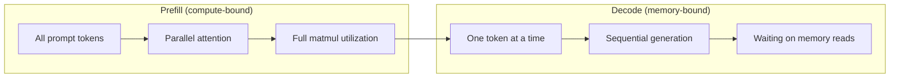
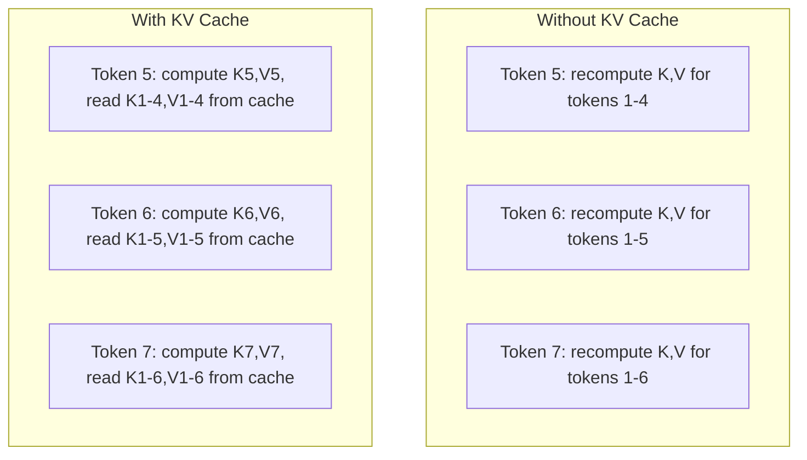
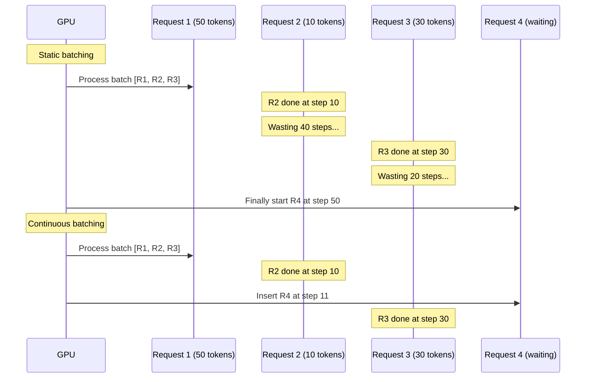
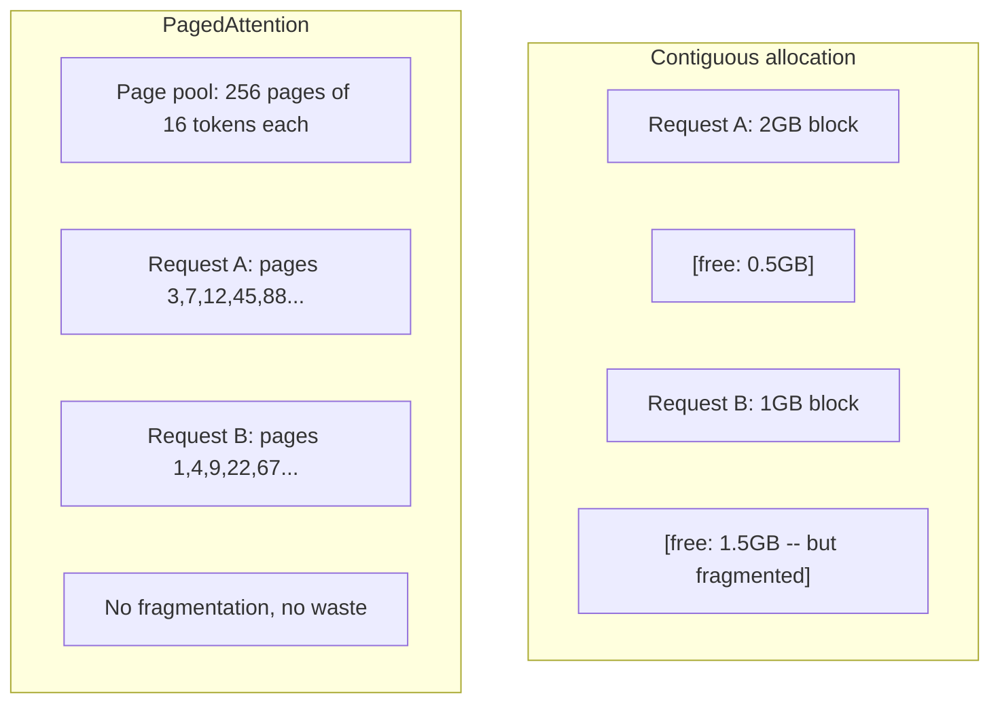
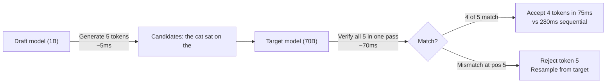

# Tối ưu hóa Inference

> Hai giai đoạn xác định LLM inference. Điền trước processes prompt của bạn song song -- ràng buộc điện toán. Giải mã tạo ra tokens từng cái một -- ràng buộc bộ nhớ. Mọi tối ưu hóa nhắm mục tiêu vào một hoặc cả hai.

**Loại:** Xây dựng
**Ngôn ngữ:** Python
**Kiến thức tiên quyết:** Giai đoạn 10, Bài 01-08 (Transformer kiến trúc, attention)
**Thời lượng:** ~120 phút

## Mục tiêu học tập

- Triển khai KV-cache để loại bỏ tính toán dư thừa trong quá trình tạo token tự hồi quy
- Giải thích các giai đoạn điền trước và giải mã của LLM inference và lý do tại sao mỗi giai đoạn có các nút thắt cổ chai khác nhau (ràng buộc điện toán và ràng buộc bộ nhớ)
- Triển khai các khái niệm PagedAttention và hàng loạt liên tục để tối đa hóa việc sử dụng GPU theo các yêu cầu đồng thời
- So sánh các kỹ thuật tối ưu hóa inference (bộ nhớ đệm KV, giải mã đầu cơ, attention flash) và sự đánh đổi throughput/latency của chúng

## Vấn đề

Bạn triển khai Llama 3 70B trên GPUs 4xA100. Một người dùng nhận được ~50 tokens mỗi giây. Cảm thấy nhanh. Sau đó, 100 người dùng đồng thời truy cập endpoint. Thông lượng giảm xuống còn 3 tokens/second/user. Hóa đơn 25.000/month GPU đô la của bạn đang phục vụ phản hồi chậm hơn so với loại người.

Bản thân model không thay đổi giữa 1 người dùng và 100 người dùng. Cùng trọng số, cùng kiến trúc, cùng toán học. Điều thay đổi là cách bạn lên lịch công việc. Naive inference lãng phí 90%+ điện toán có sẵn GPU. Người dùng chờ token 47 giữ toàn bộ khe cắm batch mở trong khi bus bộ nhớ GPU nằm không hoạt động giữa các matmul. Trong khi đó, 2.000 token prompt của người dùng mới có thể lấp đầy thời gian chết đó bằng tính toán hữu ích.

Đây không phải là vấn đề mở rộng quy mô. Đó là một vấn đề lập lịch trình. Các kỹ thuật trong bài học này -- bộ nhớ đệm KV, hàng loạt liên tục, PagedAttention, giải mã suy đoán, bộ nhớ đệm tiền tố -- là những gì phân biệt một $25k/month inference bill from a $ 5k/month phục vụ cùng một lưu lượng truy cập.

vLLM phục vụ Llama 3 70B trên 4xA100-80GB đạt ~50 tokens/second/user ở mức đồng thời thấp và duy trì 15-25 TPS/user ở 100 yêu cầu đồng thời thông qua hàng loạt liên tục và PagedAttention. Nếu không có các tối ưu hóa này, cùng một phần cứng sẽ phục vụ 5 TPS/user ở thời điểm đồng thời đó. Cùng GPUs, cùng model, thông lượng gấp 4 lần.

## Khái niệm

### Điền trước vs Giải mã

Mỗi yêu cầu LLM inference có hai giai đoạn riêng biệt.

**Điền trước** processes toàn bộ prompt đầu vào. Tất cả các tokens đều đã biết, vì vậy attention có thể được tính toán song song trên toàn bộ dãy số. Đây là một phép nhân ma trận lớn -- GPU lõi vẫn bận rộn. Nút thắt cổ chai là tính toán: phần cứng của bạn có thể phân phối bao nhiêu FLOPS mỗi giây. A100 thực hiện 312 TFLOPS (BF16). Điền trước cho 4.096-token prompt trên 70B model mất ~400ms trên một A100.

**Giải mã** tạo ra từng tokens đầu ra một. Mỗi token mới tham gia vào tất cả các tokens trước đó, nhưng chỉ có một token được tạo ra trên mỗi forward pass. Các ma trận trọng lượng có cùng kích thước như trong quá trình điền trước, nhưng bạn đang nhân chúng với một vector duy nhất thay vì ma trận. Các lõi GPU kết thúc trong micro giây, sau đó đợi batch trọng số tiếp theo đến từ bộ nhớ. Nút thắt cổ chai là băng thông bộ nhớ: tốc độ bạn có thể truyền tải trọng số model từ HBM đến các đơn vị tính toán. A100 có băng thông 2 TB/s. model 70B trong FP16 là 140 GB. Đọc toàn bộ model một lần mất 70ms - đó là sàn của bạn cho một bước giải mã duy nhất.



Tỷ lệ **ops:byte** (còn được gọi là cường độ số học) nắm bắt được sự đánh đổi này. Nó đo lường số lượng thao tác bạn thực hiện trên mỗi byte được tải từ bộ nhớ.

```
ops:byte ratio = FLOPs per token / bytes read from memory
```

Trong quá trình điền trước với batch 4.096 tokens, bạn thực hiện ~4.096 thao tác nhân tích lũy cho mỗi trọng lượng được tải. Tỷ lệ này cao -- bạn bị ràng buộc tính toán. Trong quá trình giải mã với batch size 1, bạn thực hiện ~1 thao tác cho mỗi trọng lượng được tải. Tỷ lệ này thấp -- bạn bị ràng buộc với bộ nhớ.

Thông tin chi tiết cơ bản: *giải mã bị ràng buộc bởi bộ nhớ vì bạn đọc toàn bộ model để tạo ra một token duy nhất*. Mọi tối ưu hóa dưới đây đều làm giảm nội dung bạn đọc, tăng batch tokens được xử lý trên mỗi lần đọc hoặc tránh hoàn toàn các lần đọc.

### KV Cache

Trong quá trình attention, truy vấn của mỗi token sẽ tham gia vào vectors khóa và giá trị của mọi token trước đó. Nếu không có bộ nhớ đệm, việc tạo token N yêu cầu tính toán lại các dự báo khóa và giá trị cho tất cả N-1 trước tokens. Token 1 được chiếu khi tạo token 2, sau đó một lần nữa cho token 3, sau đó lại cho token 4. Đến token 1.000, bạn đã dự đoán token 1 tổng cộng 999 lần.

KV cache lưu trữ các dự báo khóa và giá trị từ tất cả các tokens trước đó. Khi tạo token N, bạn chỉ tính toán khóa và giá trị cho token N, sau đó nối chúng với K/V được lưu trong bộ nhớ đệm từ tokens 1 đến N-1.



**Công thức bộ nhớ cho KV cache:**

```
KV cache size = 2 * num_layers * num_kv_heads * head_dim * seq_len * bytes_per_param
```

Đối với Llama 3 70B (80 lớp, đầu 8 KV với GQA, head_dim = 128, BF16):

```
per token: 2 * 80 * 8 * 128 * 2 bytes = 327,680 bytes = 320 KB
at 4,096 tokens: 320 KB * 4,096 = 1.28 GB
at 128K tokens: 320 KB * 131,072 = 40 GB
```

Một cuộc hội thoại ngữ cảnh 128K duy nhất cho Llama 3 70B tiêu tốn 40 GB KV cache - một nửa bộ nhớ của A100. Với 100 người dùng đồng thời ở 4K tokens mỗi người, chỉ riêng KV cache cần 128 GB. Đây là lý do tại sao quản lý KV cache là thách thức trung tâm của việc tối ưu hóa inference.

### Lô liên tục

Batching tĩnh đợi cho đến khi một batch N yêu cầu đến, processes chúng lại với nhau và đợi cho đến khi *tất cả* hoàn tất trước khi chấp nhận các yêu cầu mới. Nếu một yêu cầu cần 500 tokens và một yêu cầu khác cần 10 yêu cầu, yêu cầu ngắn sẽ không hoạt động trong 490 bước giải mã sau khi hoàn tất.

Batching liên tục (còn được gọi là batching cấp độ lặp) chèn các yêu cầu mới vào batch ngay sau khi bất kỳ yêu cầu nào hoàn tất. Các batch được đánh giá lại ở mỗi bước giải mã. Một yêu cầu kết thúc sau 10 tokens ngay lập tức được thay thế bằng một yêu cầu chờ.



Cải thiện thông lượng phụ thuộc vào độ dài đầu ra khác nhau. Với độ dài đồng đều, lô liên tục phù hợp với lô tĩnh. Với độ dài thay đổi (trường hợp phổ biến), lô liên tục có thể mang lại thông lượng cao hơn 2-5 lần vì các khe GPU không bao giờ trống.

### PagedChú ý

KV cache cho mỗi yêu cầu là một khối bộ nhớ liền kề. Khi các yêu cầu đến và rời đi, các mảnh bộ nhớ - giống hệt như RAM phân mảnh trong hệ điều hành. Yêu cầu 4K-token cần 1,28 GB liền kề. Ngay cả khi bạn có tổng cộng 2 GB trống, bạn có thể không có 1,28 GB *liền kề*. Bạn lãng phí bộ nhớ hoặc từ chối yêu cầu.

PagedAttention (từ vLLM) áp dụng bộ nhớ ảo kiểu hệ điều hành cho KV cache. Thay vì phân bổ một khối liền kề cho mỗi yêu cầu, nó phân bổ các "trang" có kích thước cố định (thường là 16 tokens mỗi trang). Các trang có thể ở bất kỳ đâu trong bộ nhớ GPU vật lý. Bảng trang ánh xạ các vị trí trình tự logic của mỗi yêu cầu với các vị trí trang vật lý.



PagedAttention cũng cho phép **copy-on-write** cho các tiền tố được chia sẻ. Nếu 50 yêu cầu chia sẻ cùng một system prompt, các trang KV cache cho system prompt đó được lưu trữ một lần và được tham chiếu bởi tất cả 50 yêu cầu. Chỉ khi một yêu cầu phân kỳ (các thông báo người dùng khác nhau) thì nó mới có các trang riêng. Điều này cắt giảm đáng kể việc sử dụng bộ nhớ đối với các ứng dụng có prompts hệ thống dùng chung.

vLLM báo cáo lãng phí bộ nhớ gần như bằng không (~4% so với ~60-80% trong phân bổ ngây thơ) thông qua PagedAttention.

### Giải mã suy đoán

Giải mã chậm vì nó tuần tự - bạn tạo một token, phản hồi lại, tạo ra  tiếp theo. Nhưng điều gì sẽ xảy ra nếu bạn có thể đoán 5 tokens tiếp theo với giá rẻ, sau đó xác minh tất cả chúng cùng một lúc?

Giải mã suy đoán sử dụng một **model nháp** nhỏ, nhanh để tạo ra K ứng cử viên tokens. Sau đó, **mục tiêu lớn model** processes tất cả K ứng cử viên trong một forward pass duy nhất (trông giống như một điền trước -- song song, ràng buộc tính toán, hiệu quả). Nếu model mục tiêu đồng ý với dự đoán của model nháp, bạn chấp nhận tất cả K tokens trong thời gian của một forward pass mục tiêu. Nếu nó không đồng ý ở vị trí j, bạn chấp nhận tokens từ 1 đến j-1 và loại bỏ rest.



Tăng tốc phụ thuộc vào **tỷ lệ chấp nhận** -- tần suất dự đoán của model nháp khớp với mục tiêu. Đối với bản nháp Llama 3 8B cho Llama 3 70B, tỷ lệ chấp nhận 70-85% là điển hình trên ngôn ngữ tự nhiên. Điều này có nghĩa là tăng tốc độ giải mã 2-3 lần.

Ba cách tiếp cận để giải mã suy đoán:

| Phương pháp | Nguồn nháp | Tỷ lệ chấp nhận | Trên cao |
|--------|-------------|-----------------|----------|
| Mục tiêu dự thảo (Leviathan và cộng sự) | Riêng biệt model nhỏ | 70-85% | Bộ nhớ model nháp |
| EAGLE (Li và cộng sự) | Đánh đầu nhẹ vào mục tiêu | 75-90% | ~1% parameters bổ sung |
| Tra cứu N-gram | Token bảng n-gram | 40-60% | Không đáng kể |

**EAGLE** huấn luyện một đầu tự hồi quy nhỏ trên các trạng thái ẩn của model mục tiêu. Nó dự đoán embedding của token tiếp theo bằng cách sử dụng features lớp thứ hai đến cuối cùng của model mục tiêu. Bởi vì nó hoạt động trên các biểu diễn riêng của model mục tiêu (không phải của model riêng biệt), nó đạt được tỷ lệ chấp nhận cao hơn với bộ nhớ bổ sung tối thiểu. EAGLE-2 thêm một cây nháp động điều chỉnh số lượng ứng cử viên dựa trên ngữ cảnh.

**Giải mã suy đoán N-gram** duy trì một bảng các phần tiếp tục n-gram từ ngữ cảnh hiện tại hoặc một kho dữ liệu được tạo sẵn. Nếu bản nháp khớp với những gì đã xuất hiện trước đó trong cùng một cuộc trò chuyện (các mẫu lặp lại, mã, đầu ra có cấu trúc), nó sẽ kích hoạt mà không có chi phí mạng nơ-ron. Tỷ lệ chấp nhận trung bình thấp hơn nhưng chi phí cho mỗi lần suy đoán về cơ bản là miễn phí.

Giải mã suy đoán là *chính xác về mặt toán học* -- phân phối đầu ra giống hệt với phân phối của model đích. Nó không phải là một xấp xỉ. Bước xác minh đảm bảo rằng mọi token được chấp nhận đều có xác suất chính xác mà model mục tiêu sẽ chỉ định.

### Bộ nhớ đệm tiền tố

Nhiều yêu cầu có cùng tiền tố. Một chatbot system prompt. Một khối ngữ cảnh RAG. Một bộ ví dụ few-shot. Không có bộ nhớ đệm tiền tố, mọi yêu cầu sẽ tính toán lại KV cache cho các tokens dùng chung này từ đầu.

Bộ nhớ đệm tiền tố lưu trữ KV cache cho các tiền tố phổ biến và sử dụng lại nó trên các yêu cầu. Khi một yêu cầu mới đến với một tiền tố đã biết, hệ thống sẽ sao chép (hoặc tham chiếu) các mục KV được lưu trong bộ nhớ cache và chỉ tính toán KV cho hậu tố duy nhất.

Đối với 2.000 token system prompt được chia sẻ trên tất cả các yêu cầu, bộ nhớ đệm tiền tố loại bỏ ~400 mili giây điền trước cho mỗi yêu cầu. Ở tốc độ 100 requests/second, điều đó giúp tiết kiệm 40 giây điện toán GPU mỗi giây -- nhiều hơn một GPU công việc.

RadixAttention của SGLang triển khai bộ nhớ đệm tiền tố với cây cơ số (trie) lập chỉ mục tiền tố theo nội dung token của chúng. Bất kỳ yêu cầu nào khớp với tiền tố được lưu trữ đều được KV cache miễn phí. Cây cho phép khớp tiền tố một phần -- nếu bạn chia sẻ 1.500 trong số 2.000 tiền tố tokens với một mục nhập được lưu trong bộ nhớ đệm, bạn sử dụng lại 1.500 tiền tố đó và chỉ tính toán lại 500.

### Động cơ Inference

Ba động cơ chiếm ưu thế production LLM phục vụ:

| Động cơ | Đổi mới chính | Tốt nhất cho |
|--------|---------------|----------|
| vLLM | PagedChú ý, hàng loạt liên tục | Phục vụ đa năng, khả năng tương thích cao nhất |
| SGLang | RadixAttention (bộ nhớ đệm tiền tố), tạo có cấu trúc | Chatbot nhiều lượt, giải mã hạn chế |
| TensorRT-LLM | NVIDIA hợp nhất hạt nhân, FP8 quantization | Thông lượng một GPU tối đa trên phần cứng NVIDIA |

**vLLM** là điểm bắt đầu mặc định. Nó hỗ trợ phạm vi models rộng nhất, chạy trên bất kỳ nhà cung cấp GPU nào (NVIDIA, AMD, Intel) và đạt được thông lượng mạnh mẽ thông qua PagedAttention + hàng loạt liên tục. API tương thích với OpenAI có nghĩa là bạn có thể thả nó vào để thay thế cho bất kỳ cuộc gọi OpenAI API nào.

**SGLang** được xây dựng trên nền tảng tương tự như vLLM nhưng bổ sung RadixAttention cho bộ nhớ đệm tiền tố và ngôn ngữ dành riêng cho miền cho các chương trình LLM có cấu trúc. Nếu khối lượng công việc của bạn liên quan đến các cuộc trò chuyện nhiều lượt, sử dụng công cụ hoặc giải mã hạn chế (đầu ra JSON, tạo theo hướng dẫn regex), SGLang thường vượt trội hơn vLLM gấp 2-5 lần thông qua việc sử dụng lại tiền tố.

**TensorRT-LLM** biên dịch models thành các hạt nhân NVIDIA GPU được tối ưu hóa. Nó hợp nhất các hoạt động (attention + tuyến tính + kích hoạt trong một nhân), sử dụng FP8 trên GPUs H100 và tích hợp với Inference Server Triton NVIDIA để triển khai production. Nó đạt được thông lượng một GPU cao nhất trên phần cứng NVIDIA nhưng yêu cầu thiết lập nhiều hơn và chỉ hoạt động trên NVIDIA GPUs.

Số trong thế giới thực cho Llama 3 70B (4xA100-80GB, BF16):

| Số liệu | vLLM | SGLang | TensorRT-LLM |
|--------|------|--------|---------------|
| Thông lượng (1 người dùng) | ~50 TPS | ~55 TPS | ~65 TPS |
| Thông lượng (100 người dùng) | ~2,500 tổng số TPS | ~3,200 tổng số TPS | ~3,000 tổng số TPS |
| Thời gian token đầu tiên | ~400 mili giây | ~300ms (truy cập tiền tố) | ~350 mili giây |
| Ngữ cảnh tối đa | 128 nghìn | 128 nghìn | 128 nghìn |

### Hoạt động: Byte Framework

Bạn không thể tối ưu hóa những gì bạn không đo lường. Tỷ lệ ops:byte cho bạn biết bạn bị ràng buộc với điện toán hay bị ràng buộc với bộ nhớ, điều này xác định mức tối ưu hóa nào quan trọng.

```
Compute roof: peak FLOPS of the GPU
Memory roof:  peak bandwidth * ops:byte ratio
```

Khi ops:byte thấp (giải mã, batches nhỏ), bạn sẽ gặp phải mái băng thông bộ nhớ. Thêm nhiều điện toán hơn (xung nhịp cao hơn, nhiều lõi hơn) không giúp ích gì. Bạn cần giảm số lần đọc bộ nhớ (quantization, KV cache nén) hoặc tăng kích thước batch để khấu hao các lần đọc trong các công việc hữu ích hơn.

Khi ops:byte cao (lấp đầy trước, batches lớn), bạn sẽ đạt được mức điện toán. Tối ưu hóa băng thông bộ nhớ không giúp ích gì. Bạn cần GPUs nhanh hơn, hợp nhất hạt nhân hoặc giảm precision để thu hút nhiều FLOPS hơn.

| Kịch bản | hoạt động:byte | Ràng buộc | Tối ưu hóa với |
|----------|----------|-------|---------------|
| Điền trước, batch = 1 | ~4.096 | Điện toán | Hợp nhất nhân, FP8 |
| Giải mã, batch = 1 | ~1 | Bộ nhớ | Quantization, nén KV |
| Giải mã, batch = 32 | ~32 | Bộ nhớ | batch lớn hơn, trộn liên tục |
| Giải mã, batch = 256 | ~256 | Chuyển đổi | Cả hai đều quan trọng |
| Giải mã, batch = 1024 | ~1.024 | Điện toán | Hợp nhất hạt nhân, tensor song song |

Điểm giao nhau trên A100 là khoảng ops:byte = 156 (312 TFLOPS / 2 TB/s). Dưới 156, bạn bị ràng buộc bộ nhớ. Trên 156, bạn bị ràng buộc tính toán. Đẩy hàng loạt liên tục giải mã về phía giao nhau này bằng cách đóng gói nhiều tokens hơn cho mỗi lần lặp.

```figure
context-window-slide
```

## Tự xây dựng

### Bước 1: KV Cache từ đầu

Chúng ta xây dựng một KV cache nhiều đầu lưu trữ các dự báo khóa và giá trị trên mỗi lớp, trên mỗi đầu và thể hiện mô hình tăng trưởng bộ nhớ.

```python
import numpy as np

class KVCache:
    def __init__(self, num_layers, num_heads, head_dim, max_seq_len, dtype=np.float16):
        self.num_layers = num_layers
        self.num_heads = num_heads
        self.head_dim = head_dim
        self.max_seq_len = max_seq_len
        self.dtype = dtype

        self.k_cache = np.zeros(
            (num_layers, num_heads, max_seq_len, head_dim), dtype=dtype
        )
        self.v_cache = np.zeros(
            (num_layers, num_heads, max_seq_len, head_dim), dtype=dtype
        )
        self.seq_len = 0

    def update(self, layer_idx, new_keys, new_values):
        num_new = new_keys.shape[1]
        end = self.seq_len + num_new
        self.k_cache[layer_idx, :, self.seq_len:end, :] = new_keys
        self.v_cache[layer_idx, :, self.seq_len:end, :] = new_values
        return (
            self.k_cache[layer_idx, :, :end, :],
            self.v_cache[layer_idx, :, :end, :]
        )

    def advance(self, num_tokens):
        self.seq_len += num_tokens

    def memory_bytes(self):
        return self.k_cache.nbytes + self.v_cache.nbytes

    def used_bytes(self):
        per_token = 2 * self.num_layers * self.num_heads * self.head_dim * np.dtype(self.dtype).itemsize
        return per_token * self.seq_len
```

### Bước 2: Attention với KV Cache

Một multi-head attention đơn giản hóa sử dụng KV cache cho các bước giải mã.

```python
def scaled_dot_product_attention(query, keys, values):
    head_dim = query.shape[-1]
    scores = np.matmul(query, keys.transpose(0, 1, 3, 2)) / np.sqrt(head_dim)
    seq_len_q = scores.shape[-2]
    seq_len_k = scores.shape[-1]
    if seq_len_q > 1:
        mask = np.triu(np.ones((seq_len_q, seq_len_k), dtype=np.float32), k=seq_len_k - seq_len_q + 1)
        scores = scores + mask * (-1e9)
    max_scores = np.max(scores, axis=-1, keepdims=True)
    exp_scores = np.exp(scores - max_scores)
    attn_weights = exp_scores / np.sum(exp_scores, axis=-1, keepdims=True)
    return np.matmul(attn_weights, values)


class MultiHeadAttention:
    def __init__(self, d_model, num_heads):
        self.num_heads = num_heads
        self.head_dim = d_model // num_heads
        scale = np.sqrt(2.0 / d_model)
        self.W_q = np.random.randn(d_model, d_model).astype(np.float32) * scale
        self.W_k = np.random.randn(d_model, d_model).astype(np.float32) * scale
        self.W_v = np.random.randn(d_model, d_model).astype(np.float32) * scale
        self.W_o = np.random.randn(d_model, d_model).astype(np.float32) * scale

    def forward(self, x, kv_cache=None, layer_idx=0):
        batch, seq_len, d_model = x.shape
        Q = np.matmul(x, self.W_q).reshape(batch, seq_len, self.num_heads, self.head_dim).transpose(0, 2, 1, 3)
        K = np.matmul(x, self.W_k).reshape(batch, seq_len, self.num_heads, self.head_dim).transpose(0, 2, 1, 3)
        V = np.matmul(x, self.W_v).reshape(batch, seq_len, self.num_heads, self.head_dim).transpose(0, 2, 1, 3)

        if kv_cache is not None:
            K_full, V_full = kv_cache.update(layer_idx, K[0], V[0])
            K = K_full[np.newaxis, :, :, :]
            V = V_full[np.newaxis, :, :, :]
            if seq_len == 1:
                kv_cache.advance(1)

        attn_out = scaled_dot_product_attention(Q, K, V)
        attn_out = attn_out.transpose(0, 2, 1, 3).reshape(batch, -1, d_model)
        return np.matmul(attn_out, self.W_o)
```

### Bước 3: Trình mô phỏng lô liên tục

Điều này mô phỏng sự khác biệt về lịch trình giữa lô tĩnh và liên tục.

```python
import heapq

class Request:
    def __init__(self, request_id, prompt_tokens, output_tokens, arrival_step):
        self.request_id = request_id
        self.prompt_tokens = prompt_tokens
        self.output_tokens = output_tokens
        self.arrival_step = arrival_step
        self.tokens_generated = 0
        self.start_step = None
        self.end_step = None

    def is_done(self):
        return self.tokens_generated >= self.output_tokens


def simulate_static_batching(requests, batch_size):
    step = 0
    completed = []
    queue = list(requests)
    queue.sort(key=lambda r: r.arrival_step)

    while queue:
        batch = []
        while queue and len(batch) < batch_size:
            r = queue.pop(0)
            r.start_step = max(step, r.arrival_step)
            batch.append(r)

        if batch:
            step = max(step, max(r.start_step for r in batch))
            max_output = max(r.output_tokens for r in batch)
            for r in batch:
                r.tokens_generated = r.output_tokens
                r.end_step = step + max_output
            step += max_output
            completed.extend(batch)

    return completed


def simulate_continuous_batching(requests, batch_size):
    step = 0
    completed = []
    queue = sorted(requests, key=lambda r: r.arrival_step)
    queue_idx = 0
    active = []
    waiting = []

    while queue_idx < len(queue) or active or waiting:
        while queue_idx < len(queue) and queue[queue_idx].arrival_step <= step:
            waiting.append(queue[queue_idx])
            queue_idx += 1

        while waiting and len(active) < batch_size:
            r = waiting.pop(0)
            r.start_step = step
            active.append(r)

        if not active:
            if waiting:
                step += 1
                continue
            elif queue_idx < len(queue):
                step = queue[queue_idx].arrival_step
                continue
            else:
                break

        for r in active:
            r.tokens_generated += 1

        done = [r for r in active if r.is_done()]
        for r in done:
            r.end_step = step + 1
            completed.append(r)
        active = [r for r in active if not r.is_done()]

        step += 1

    return completed


def batching_stats(completed):
    latencies = [r.end_step - r.arrival_step for r in completed]
    total_time = max(r.end_step for r in completed) - min(r.arrival_step for r in completed)
    total_tokens = sum(r.output_tokens for r in completed)
    return {
        "avg_latency": np.mean(latencies),
        "p50_latency": np.median(latencies),
        "p99_latency": np.percentile(latencies, 99),
        "total_time": total_time,
        "throughput": total_tokens / total_time if total_time > 0 else 0,
    }
```

### Bước 4: Tiền tố Cache

Bộ nhớ đệm tiền tố dựa trên trie lưu trữ các mục KV cho các tiền tố được chia sẻ.

```python
class TrieNode:
    def __init__(self):
        self.children = {}
        self.kv_data = None
        self.hit_count = 0


class PrefixCache:
    def __init__(self, max_entries=1000):
        self.root = TrieNode()
        self.max_entries = max_entries
        self.total_entries = 0
        self.hits = 0
        self.misses = 0

    def _walk(self, token_ids):
        node = self.root
        depth = 0
        for tid in token_ids:
            if tid not in node.children:
                break
            node = node.children[tid]
            depth += 1
        return node, depth

    def lookup(self, token_ids):
        node, depth = self._walk(token_ids)
        if depth > 0:
            self.hits += 1
            current = self.root
            for tid in token_ids[:depth]:
                current = current.children[tid]
                current.hit_count += 1
            kv_entries = []
            current = self.root
            for tid in token_ids[:depth]:
                current = current.children[tid]
                if current.kv_data is not None:
                    kv_entries.append(current.kv_data)
            return depth, kv_entries
        self.misses += 1
        return 0, []

    def insert(self, token_ids, kv_per_token):
        node = self.root
        for i, tid in enumerate(token_ids):
            if tid not in node.children:
                if self.total_entries >= self.max_entries:
                    return i
                node.children[tid] = TrieNode()
                self.total_entries += 1
            node = node.children[tid]
            if i < len(kv_per_token):
                node.kv_data = kv_per_token[i]
        return len(token_ids)

    def hit_rate(self):
        total = self.hits + self.misses
        return self.hits / total if total > 0 else 0.0
```

### Bước 5: Trình mô phỏng giải mã suy đoán

Chúng ta mô phỏng giải mã đầu cơ mục tiêu nháp với tỷ lệ chấp nhận có thể định cấu hình.

```python
class DraftModel:
    def __init__(self, vocab_size, acceptance_rate=0.8):
        self.vocab_size = vocab_size
        self.acceptance_rate = acceptance_rate

    def generate(self, context, num_tokens):
        tokens = np.random.randint(0, self.vocab_size, size=num_tokens)
        return tokens

    def get_probs(self, context, token):
        probs = np.random.dirichlet(np.ones(self.vocab_size))
        return probs


class TargetModel:
    def __init__(self, vocab_size):
        self.vocab_size = vocab_size

    def get_probs(self, context, tokens=None):
        if tokens is not None:
            return [np.random.dirichlet(np.ones(self.vocab_size)) for _ in tokens]
        return np.random.dirichlet(np.ones(self.vocab_size))


def speculative_decode(draft_model, target_model, context, num_speculative=5,
                       draft_cost=1.0, target_cost=10.0, verify_cost=12.0):
    total_tokens = 0
    total_cost = 0.0
    accepted_counts = []
    context = list(context)

    max_tokens = 100

    while total_tokens < max_tokens:
        draft_tokens = draft_model.generate(context, num_speculative)
        total_cost += draft_cost * num_speculative

        target_probs = target_model.get_probs(context, draft_tokens)
        total_cost += verify_cost

        accepted = 0
        for i, token in enumerate(draft_tokens):
            draft_p = draft_model.get_probs(context + list(draft_tokens[:i]), token)
            target_p = target_probs[i]

            r = np.random.random()
            acceptance_prob = min(1.0, target_p[token] / (draft_p[token] + 1e-10))

            if r < draft_model.acceptance_rate:
                accepted += 1
                context.append(token)
                total_tokens += 1
            else:
                new_token = np.random.choice(draft_model.vocab_size, p=target_p)
                context.append(new_token)
                total_tokens += 1
                break

        accepted_counts.append(accepted)

        if accepted == num_speculative:
            bonus_probs = target_model.get_probs(context)
            bonus_token = np.random.choice(draft_model.vocab_size, p=bonus_probs)
            context.append(bonus_token)
            total_tokens += 1

    sequential_cost = total_tokens * target_cost
    return {
        "total_tokens": total_tokens,
        "speculative_cost": total_cost,
        "sequential_cost": sequential_cost,
        "speedup": sequential_cost / total_cost if total_cost > 0 else 1.0,
        "avg_accepted": np.mean(accepted_counts),
        "acceptance_rate": np.mean(accepted_counts) / num_speculative,
    }


def compare_speculation_strategies(vocab_size=1000, num_trials=20):
    results = {}

    for name, acceptance_rate, spec_tokens in [
        ("Draft-target (8B->70B)", 0.78, 5),
        ("EAGLE", 0.85, 6),
        ("N-gram", 0.50, 4),
        ("No speculation", 0.0, 0),
    ]:
        if spec_tokens == 0:
            results[name] = {
                "speedup": 1.0,
                "acceptance_rate": 0.0,
                "avg_accepted": 0.0,
            }
            continue

        trial_results = []
        for _ in range(num_trials):
            draft = DraftModel(vocab_size, acceptance_rate=acceptance_rate)
            target = TargetModel(vocab_size)
            context = list(np.random.randint(0, vocab_size, size=10))
            result = speculative_decode(draft, target, context, num_speculative=spec_tokens)
            trial_results.append(result)

        results[name] = {
            "speedup": np.mean([r["speedup"] for r in trial_results]),
            "acceptance_rate": np.mean([r["acceptance_rate"] for r in trial_results]),
            "avg_accepted": np.mean([r["avg_accepted"] for r in trial_results]),
        }

    return results
```

### Bước 6: Trình phân tích bộ nhớ KV Cache

Yêu cầu tính toán KV cache bộ nhớ cho cấu hình model thực.

```python
MODEL_CONFIGS = {
    "Llama-3-8B": {
        "num_layers": 32, "num_kv_heads": 8, "head_dim": 128,
        "model_params_b": 8, "gqa": True,
    },
    "Llama-3-70B": {
        "num_layers": 80, "num_kv_heads": 8, "head_dim": 128,
        "model_params_b": 70, "gqa": True,
    },
    "Llama-3-405B": {
        "num_layers": 126, "num_kv_heads": 8, "head_dim": 128,
        "model_params_b": 405, "gqa": True,
    },
    "Mistral-7B": {
        "num_layers": 32, "num_kv_heads": 8, "head_dim": 128,
        "model_params_b": 7, "gqa": True,
    },
    "GPT-4-est": {
        "num_layers": 120, "num_kv_heads": 96, "head_dim": 128,
        "model_params_b": 1800, "gqa": False,
    },
}


def kv_cache_memory(config, seq_len, dtype_bytes=2):
    per_token = 2 * config["num_layers"] * config["num_kv_heads"] * config["head_dim"] * dtype_bytes
    total = per_token * seq_len
    return {
        "per_token_bytes": per_token,
        "per_token_kb": per_token / 1024,
        "total_bytes": total,
        "total_mb": total / (1024 ** 2),
        "total_gb": total / (1024 ** 3),
    }


def memory_budget(config, gpu_memory_gb, model_dtype_bytes=2, kv_dtype_bytes=2):
    model_memory_gb = config["model_params_b"] * 1e9 * model_dtype_bytes / (1024 ** 3)
    overhead_gb = gpu_memory_gb * 0.1
    available_for_kv = gpu_memory_gb - model_memory_gb - overhead_gb

    if available_for_kv <= 0:
        return {"error": "Model does not fit in GPU memory", "model_memory_gb": model_memory_gb}

    per_token = 2 * config["num_layers"] * config["num_kv_heads"] * config["head_dim"] * kv_dtype_bytes
    max_tokens = int(available_for_kv * (1024 ** 3) / per_token)

    return {
        "gpu_memory_gb": gpu_memory_gb,
        "model_memory_gb": round(model_memory_gb, 1),
        "overhead_gb": round(overhead_gb, 1),
        "available_for_kv_gb": round(available_for_kv, 1),
        "max_total_tokens": max_tokens,
        "max_users_at_2k": max_tokens // 2048,
        "max_users_at_4k": max_tokens // 4096,
        "max_users_at_32k": max_tokens // 32768,
    }
```

## Ứng dụng

Với vLLM:

```python
from vllm import LLM, SamplingParams

llm = LLM(
    model="meta-llama/Llama-3-70B-Instruct",
    tensor_parallel_size=4,
    enable_prefix_caching=True,
    max_model_len=8192,
    gpu_memory_utilization=0.9,
)

params = SamplingParams(temperature=0.7, max_tokens=256)
outputs = llm.generate(["Explain inference optimization in one paragraph."], params)
```

Với SGLang cho bộ nhớ đệm tiền tố + đầu ra có cấu trúc:

```python
import sglang as sgl

@sgl.function
def classify(s, text):
    s += sgl.system("You are a classifier. Output JSON only.")
    s += sgl.user(f"Classify this text: {text}")
    s += sgl.assistant(sgl.gen("result", regex=r'\{"label": "(positive|negative|neutral)"\}'))

runtime = sgl.Runtime(model_path="meta-llama/Llama-3-70B-Instruct", tp_size=4)
sgl.set_default_backend(runtime)

results = classify.run_batch([
    {"text": "This product is amazing!"},
    {"text": "Terrible experience."},
    {"text": "It was okay I guess."},
])
```

Với TensorRT-LLM:

```python
import tensorrt_llm
from tensorrt_llm.runtime import ModelRunner

runner = ModelRunner.from_dir("./llama-70b-trt-engine/", rank=0)

outputs = runner.generate(
    batch_input_ids=[tokenizer.encode("Explain KV caching.")],
    max_new_tokens=256,
    temperature=0.7,
)
```

## Sản phẩm bàn giao

Bài học này tạo ra:
- `outputs/skill-inference-optimization.md` -- một skill để chẩn đoán và tối ưu hóa LLM inference phục vụ

## Bài tập

1. Sửa đổi trình phân tích KV cache để so sánh FP16 so với FP8 và INT4 KV cache quantization. Đối với Llama 3 70B ở ngữ cảnh 4K, hãy tính toán số người dùng đồng thời tối đa cho mỗi người trên 4xA100-80GB. KV quantization đến INT4 phải gấp khoảng 4 lần dung lượng người dùng.

2. Mở rộng trình mô phỏng lô liên tục để theo dõi việc sử dụng GPU (phần nhỏ của batch vị trí được lấp đầy trên mỗi bước). Sử dụng biểu đồ theo thời gian cho cả lô tĩnh và liên tục với 50 yêu cầu có độ dài đầu ra tuân theo phân phối Pareto (hình dạng = 1,5, tỷ lệ = 20). Phân lô liên tục nên duy trì mức sử dụng >80%.

3. Triển khai phiên bản attention truy vấn nhóm (GQA) của KV cache nơi `num_kv_heads < num_query_heads`. Llama 3 70B sử dụng 64 đầu truy vấn nhưng chỉ có 8 đầu KV. Tính toán mức tiết kiệm bộ nhớ so với multi-head attention đầy đủ (giảm 8 lần kích thước KV cache).

4. Xây dựng bộ nhớ đệm tiền tố sử dụng tính năng loại bỏ LRU. Đặt max_entries thành 500 và tạo 1.000 yêu cầu trong đó 60% chia sẻ một trong 5 tiền tố phổ biến. Đo lường tỷ lệ truy cập và so sánh với bộ nhớ đệm không giới hạn. Với khả năng loại bỏ tốt, tỷ lệ truy cập sẽ ở trên 55%.

5. Mở rộng trình mô phỏng giải mã suy đoán để thực hiện suy đoán dựa trên cây (kiểu EAGLE-2). Thay vì một chuỗi K draft tokens duy nhất, hãy tạo một cây ứng cử viên (ví dụ: 2 branches ở mỗi cấp độ trong số 3 cấp = 8 ứng cử viên lá). So sánh tổng số tokens được chấp nhận trong mỗi vòng xác minh so với suy đoán tuyến tính.

## Thuật ngữ chính

| Thuật ngữ | Những gì mọi người nói | Ý nghĩa thực sự của nó |
|------|----------------|----------------------|
| Điền trước | "Xử lý prompt" | Tính toán attention trên tất cả các tokens đầu vào song song -- ràng buộc tính toán vì phép nhân ma trận đầy đủ khiến các lõi GPU bận rộn |
| Giải mã | "Tạo ra tokens" | Tạo ra một token mỗi forward pass, đọc toàn bộ trọng số model mỗi lần - bị ràng buộc bởi bộ nhớ vì tính toán kết thúc trước khi trọng số tiếp theo đến |
| KV cache | "Bộ nhớ đệm attention trạng thái" | Lưu trữ các dự báo khóa và giá trị cho tất cả các tokens trước đó để chúng không được tính toán lại ở mỗi bước giải mã -- đổi bộ nhớ để tính toán |
| Lô liên tục | "Batching động" | Chèn các yêu cầu mới vào batch đang chạy ngay sau khi bất kỳ yêu cầu nào kết thúc, được đánh giá ở mỗi lần lặp lại giải mã thay vì chờ đợi toàn bộ batch |
| PagedChú ý | "Bộ nhớ ảo cho KV cache" | Phân bổ KV cache trong các trang có kích thước cố định thay vì các khối liền kề, loại bỏ phân mảnh bộ nhớ và cho phép sao chép khi ghi cho các tiền tố được chia sẻ |
| Giải mã suy đoán | "Soạn thảo và xác minh" | Sử dụng model nháp nhanh để đề xuất nhiều tokens, sau đó xác minh tất cả chúng trong một model forward pass mục tiêu - chính xác về mặt toán học, tăng tốc gấp 2-3 lần |
| ĐẠI BÀNG | "Giải mã tự suy đoán" | Một biến thể giải mã suy đoán huấn luyện một cái đầu nhẹ trên các trạng thái ẩn của chính model mục tiêu, đạt được tỷ lệ chấp nhận cao hơn so với một model nháp riêng biệt |
| Bộ nhớ đệm tiền tố | "Tái sử dụng system prompt KV" | Lưu trữ các mục KV cache được tính toán cho các tiền tố phổ biến (prompts hệ thống, few-shot ví dụ) và sử dụng lại chúng trên các yêu cầu để bỏ qua việc điền trước dư thừa |
| Tỷ lệ hoạt động: byte | "Cường độ số học" | Tỷ lệ giữa các hoạt động tính toán với số byte bộ nhớ được đọc -- xác định xem khối lượng công việc bị ràng buộc bởi tính toán (tỷ lệ cao) hay bị ràng buộc với bộ nhớ (tỷ lệ thấp) |
| Thời gian token đầu tiên | "TTFT" | Độ trễ từ khi nhận yêu cầu đến token đầu ra đầu tiên - bị chi phối bởi thời gian nạp trước trong prompts dài |

## Đọc thêm

- Kwon và cộng sự, "Quản lý bộ nhớ hiệu quả cho Model phân phát ngôn ngữ lớn với PagedAttention" (2023) - bài báo vLLM giới thiệu quản lý KV cache phân phối theo trang, hiện là tiêu chuẩn ngành để phân phát inference
- Leviathan và cộng sự, "Inference nhanh từ Transformers thông qua Giải mã đầu cơ" (2023) - bài báo cơ bản chứng minh rằng suy đoán xác minh dự thảo tạo ra phân phối model mục tiêu chính xác trong khi đạt được tốc độ gấp 2-3 lần
- Li và cộng sự, "EAGLE: Suy đoán Sampling đòi hỏi phải suy nghĩ lại Feature sự không chắc chắn" (2024) - đạt được tỷ lệ chấp nhận cao hơn bằng cách training đầu vào mục tiêu features của chính model thay vì sử dụng một model dự thảo riêng biệt
- Zheng và cộng sự, "SGLang: Thực thi hiệu quả các chương trình Model ngôn ngữ có cấu trúc" (2024) - giới thiệu RadixAttention cho bộ nhớ đệm tiền tố và model lập trình cho các chương trình LLM nhiều cuộc gọi
- Williams và cộng sự, "Roofline: An Insightful Visual Performance Model for Multicore Architectures" (2009) - bài báo Roofline ban đầu chính thức hóa framework ops:byte để suy luận về tắc nghẽn máy tính và bộ nhớ
