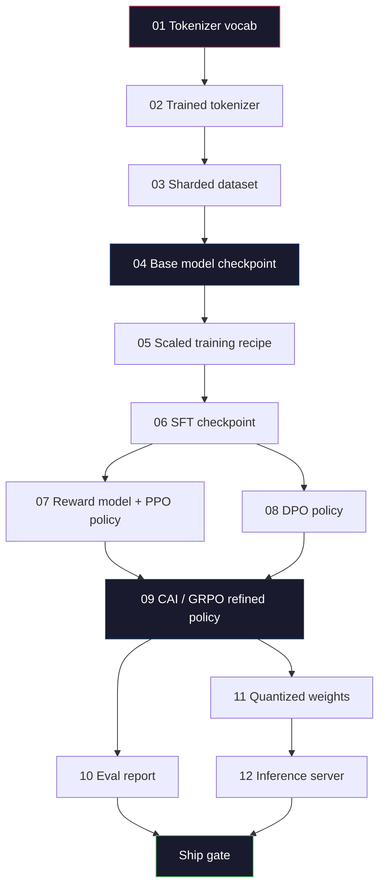
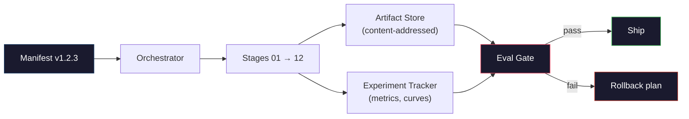

# Xây dựng một LLM Pipeline hoàn chỉnh

> Tất cả mọi thứ từ Bài học 01 đến 12 là một giai đoạn của một pipeline. Bài học này là giàn giáo biến các giai đoạn đó thành một giai đoạn đầu đến cuối duy nhất: mã hóa, huấn luyện trước, mở rộng quy mô, SFT, căn chỉnh, đánh giá, lượng tử hóa, phục vụ. Bạn sẽ không huấn luyện model 70B trên máy tính xách tay. Bạn sẽ tạo lớp orchestration, bản kê khai, cổng đánh giá và kế hoạch rollback mà nhóm biên giới năm 2026 sử dụng để quyết định những gì shipped. Đây là điểm mấu chốt.

**Loại:** Xây dựng
**Ngôn ngữ:** Python (stdlib)
**Kiến thức tiên quyết:** Tất cả các bài học Giai đoạn 10 01-12
**Thời lượng:** ~120 phút

## Mục tiêu học tập

- Soạn mười một bài học prior (tokenizer, dữ liệu, training trước, chia tỷ lệ, SFT, RLHF, DPO, CAI, eval, quantization, inference) thành một thông số kỹ thuật pipeline có thể tái tạo duy nhất
- Xác định hợp đồng artifact giữa các giai đoạn: mỗi giai đoạn tiêu thụ gì, sản xuất gì và giai đoạn tiếp theo xác minh đầu vào như thế nào
- Xây dựng một trình điều phối theo dõi các thử nghiệm, băm artifacts và cổng ship quyết định về ngưỡng đánh giá
- Thiết kế kế hoạch rollback: artifacts nào rẻ để chạy lại, cái nào đắt và giá checkpoint bị hỏng là bao nhiêu

## Vấn đề

Các bài học trước mỗi bài hoạt động. Tokenizer được huấn luyện. Tiny GPT được huấn luyện trước. SFT dataset lắp ráp. Phần thưởng model huấn luyện. DPO chạy. Eval được đo. Trọng lượng lượng tử hóa được xuất. Inference server quay lên. Mỗi cái là một sổ tay. Mỗi cái có quy ước riêng, đường dẫn đầu ra riêng, hạt giống riêng.

Một training chạy biên giới không phải là một cuốn sổ tay. Llama 3 405B mất 30 triệu H100 giờ trong khoảng 54 ngày. DeepSeek-V3 sử dụng khoảng 2,8 triệu H800 giờ. Trong thời gian đó, một checkpoint bị hỏng, một lần nhiễm bẩn dữ liệu, một hồi quy đánh giá có thể khiến một nhóm mất một tuần đồng hồ treo tường và một tháng ngân sách GPU. Cách các nhóm tồn tại điều này là thông qua vệ sinh pipeline: mỗi giai đoạn đều có đầu vào xác định, đầu ra xác định, bản kê khai, băm và cổng.

Đây là capstone. Bạn sẽ không chạy pipeline end-to-end trên máy tính xách tay. Bạn sẽ viết trình điều phối điều phối các giai đoạn, tệp kê khai mô tả quá trình chạy, trình xác minh đưa ra quyết định ship và kế hoạch phát lại cho phép bên thứ ba chạy lại công việc của bạn từ một tệp duy nhất. Mã nhỏ; kỷ luật lớn.

Tỷ lệ mẫu từ 100M đến 1T parameters không thay đổi. Bốn thành phần giống nhau - manifest, orchestrator, eval gate artifact store - chạy Llama 3 và cũng chạy GPT sở thích của bạn. Sự khác biệt là kích thước của các con số bên trong config của mỗi giai đoạn, không phải hình dạng của pipeline.

## Khái niệm

### Mười hai giai đoạn

Mỗi bài học Giai đoạn 10 là một giai đoạn. Đây là biểu đồ phụ thuộc đầy đủ.



Giai đoạn 07 và 08 có thể chạy song song. Mọi thứ khác là một phụ thuộc cứng. Thay đổi trong giai đoạn 02 (tokenizer) sẽ vô hiệu hóa mọi artifact xuôi dòng. Thay đổi trong giai đoạn 10 (đánh giá) chỉ làm mất hiệu lực của quyết định ship.

### Bản kê khai

Tệp kê khai là một tệp duy nhất mô tả một lần chạy hoàn toàn đủ để phát lại nó. Không có gì mà pipeline tạo ra nên phụ thuộc vào trạng thái không có trong tệp kê khai. Các trường này rất nhàm chán và bắt buộc.

```
pipeline_version: 1.2.3
seed: 42
git_commit: a1b2c3d4
stages:
  01_tokenizer:
    recipe: bpe_32k
    input_hash: sha256:...
    output_hash: sha256:...
    wall_clock_sec: 3600
    cost_usd: 12
```

Hàm băm đầu ra của giai đoạn N là hàm băm đầu vào của giai đoạn N + 1. Bất kỳ sai lệch nào và pipeline dừng lại. Đây là cách bạn phát hiện sớm sự cố hỏng dữ liệu. Đó cũng là cách một đồng đội ở một lục địa khác xác minh rằng bản phát lại của họ đã tạo ra artifact giống như của bạn.

Trong thực tế, các đội sử dụng một YAML schema nhỏ cộng với một công cụ kiểm tra bản kê khai khác với lần chạy thành công trước đó. Bất kỳ delta nào bên ngoài các trường dự kiến (chi phí, đồng hồ treo tường) đều là một dấu hiệu đỏ.

### Artifact Gõ

Đầu ra của mỗi giai đoạn là một artifact được nhập. Không phải là blob thư mục, không phải dưa chua, mà là một kiểu được đặt tên với một schema đã biết.

| Sân khấu | Loại Artifact | Các lĩnh vực chính |
|-------|--------------|-----------|
| 01-02 | Tokenizer | từ vựng. json, merges.txt, config. json, băm |
| 03 | Dataset | phân đoạn[], số hàng, số token, số liệu thống kê khử trùng |
| 04-05 | Checkpoint | trọng lượng. Safetensors, config. json, trạng thái optimizer, số bước |
| 06 | SFT Model | Công thức checkpoint + SFT + hỗn hợp dữ liệu |
| 07 | Phần thưởng Model | RM checkpoint + hàm băm dữ liệu tùy chọn |
| 08-09 | Policy | checkpoint + hàm băm tham chiếu + beta + ngân sách KL được sử dụng |
| 10 | Báo cáo đánh giá | Điểm benchmark + chênh lệch hồi quy + hàm băm dữ liệu đánh giá |
| 11 | Model lượng tử hóa | quả cân lượng tử hóa + dữ liệu hiệu chuẩn + accuracy delta so với FP16 |
| 12 | Server Thông số kỹ thuật | endpoint + hàm băm model + config + observability hooks |

Việc gõ ngăn chặn chế độ lỗi phổ biến nhất: sử dụng đầu ra giai đoạn 08 làm đầu vào giai đoạn 06 shipping model được huấn luyện DPO thông qua đường dẫn SFT. Chữ ký giai đoạn artifacts được nhập và nhập làm cho các lỗi này trở thành lỗi thời gian biên dịch, không phải lỗi ngày thứ năm.

### Cổng Eval

Shipping không phải là "training đã hoàn thành". Shipping là "training đã hoàn thành và cổng đánh giá đã được thông qua". Cổng được xác định trước khi cuộc chạy bắt đầu.

```
gates:
  mmlu:      >= baseline + 0.5   # no regression
  humaneval: >= baseline + 1.0
  truthfulqa: >= baseline         # no drop
  safety_refusal_rate: <= 0.05
  kl_from_reference: <= 25.0
  cost_total_usd: <= 50000
```

Mỗi cổng là một ngưỡng số. Không có cổng "trông đẹp". Không có dấu hiệu chủ quan. Nếu mọi cổng đi qua, artifact được đánh dấu là có thể gửi được. Nếu bất kỳ cổng nào bị lỗi, quá trình chạy sẽ bị giữ trong khi chờ ghi đè rõ ràng bởi một người đánh giá được đặt tên, bản thân cổng này được ghi lại trong tệp kê khai.

Hai cổng bắt được hầu hết các thảm họa. Một cổng *hồi quy* (model mới ít nhất phải tốt như cổng trước đó trên benchmarks lõi) bắt training lỗi. Một cổng *KL budget* (policy thẳng hàng không được trôi xa hơn X so với tham chiếu của nó) bắt được alignment quá chín. Mỗi production pipeline đều có cả hai.

### Người dàn nhạc

Một đoạn mã nhỏ đọc bản kê khai, gửi các giai đoạn, theo dõi artifacts và tạm dừng bất kỳ vi phạm hợp đồng nào. Đây không phải là Airflow. Đây không phải là Kubeflow. Để vệ sinh pipeline, bạn muốn một cái gì đó nhàm chán mà bạn đã viết.

Công việc của người điều phối rất hẹp:

1. Phân giải DAG từ tệp kê khai.
2. Đối với mỗi giai đoạn, hãy kiểm tra xem đầu ra dự kiến đã tồn tại ở hàm băm chính xác chưa (bỏ qua nếu có).
3. Điều hành sân khấu, nắm bắt stdout/stderr, đo đồng hồ treo tường và chi phí.
4. Xác minh hàm băm đầu ra so với hàm băm đầu vào dự kiến của giai đoạn hạ lưu.
5. Khi thất bại, hãy viết một tệp kê khai một phần với giai đoạn thất bại chính xác và thoát khỏi non zero.

Đó là 200 dòng Python. Nó sẽ trông giống như tệp `code/main.py` trong bài học này. Dưới mui xe, pipeline thực sử dụng `torchrun` hoặc `ray` để thực hiện các giai đoạn riêng lẻ trên các cụm, nhưng bản thân trình điều phối chạy trên một hộp duy nhất.

### Theo dõi thử nghiệm và lưu trữ Artifact

Hai hệ thống bên ngoài neo pipeline.

**Trình theo dõi thử nghiệm (wandb, neptune, mlflow). **Nhật ký loss đường cong, chỉ số đánh giá, telemetry hệ thống trên mỗi giai đoạn. Trình theo dõi là nơi bạn đến khi bạn cần so sánh chạy A với chạy B ba tuần sau đó. Các nhóm hầu như luôn sử dụng trình theo dõi được lưu trữ cho việc này - viết thời gian mất của riêng bạn nên đi vào training.

**Artifact lưu trữ (S3, R2, GCS).** Lưu trữ đối tượng bất biến cho các báo cáo checkpoints, datasets, tokenizers, đánh giá. Artifacts được giải quyết bằng hàm băm, không phải bằng tên tệp. Tên tệp như `latest.pt` là súng chân; `ckpt-7b-step-20000-sha256:abc123.safetensors` là hợp đồng.

Người điều phối viết cho cả hai. Trình theo dõi dành cho con người nhìn vào biểu đồ. Cửa hàng artifact dành cho giai đoạn tiếp theo tra cứu đầu vào.

### Chi phí

Một cuộc chạy biên giới có một số đô la đính kèm. Kỷ luật ngân sách xảy ra ở hai nơi.

**Ước tính trước khi chạy.** Từ bảng kê khai, tính toán FLOPs dự kiến (đối với trước khi training: 6 x tham số x tokens), GPU giờ dự kiến (FLOPs / thông lượng cao nhất / mức sử dụng) và chi phí đô la theo mức giá thuê hiện tại. Nếu ước tính vượt quá cổng ngân sách, pipeline từ chối bắt đầu.

**Theo dõi trong quá trình chạy.** Đồng hồ treo tường và chi phí từng giai đoạn được ghi vào bản kê khai. Sau mỗi giai đoạn, ngân sách còn lại được kiểm tra. Nếu một giai đoạn vượt quá, cổng của giai đoạn tiếp theo sẽ được đánh giá với ngân sách còn lại mới. Bạn không phát hiện ra mình hết tiền khi VC gọi.

Chi phí được báo cáo của Llama 3 là $61M. DeepSeek-V3 reported $5,6 triệu cho lần chạy trước training chính. Tỷ lệ chủ yếu là hiệu quả phần cứng cộng với sự kết hợp của các chuyên gia - nhưng chi phí cụ thể có thể nhìn thấy vì cả hai đội đều theo dõi nó trên mỗi giai đoạn, không phải mỗi lần chạy.

### Khả năng tái tạo so với Quyết định luận

Chúng không giống nhau. *Reproducible* có nghĩa là cùng một tệp kê khai cộng với cùng một mã cộng với cùng một cơ sở hạ tầng tạo ra một checkpoint với các chỉ số xuôi dòng tương đương. *Deterministic* có nghĩa là đầu ra giống hệt bit.

LLM training hiện đại có thể tái tạo nhưng không xác định. Thứ tự rút gọn của training phân tán, tính không xác định hạt nhân GPU (cuBLAS, flash-attn) và làm tròn mixed precision kết hợp để tạo ra các float khác nhau ở mức 1e-5 giữa các lần chạy. Điều này tốt cho các số liệu cuối cùng, không di chuyển. Nó sẽ gây tử vong nếu bạn đang cố gắng gỡ lỗi với các diff mức bit. Cách khắc phục là ghi lại các chỉ số băm đầu vào, băm đầu ra và tiêu đề của mọi giai đoạn -- nếu chúng khớp, quá trình chạy sẽ được "tái tạo" ngay cả khi trọng số không giống hệt bit.



### Kế hoạch Rollback

Trước khi bắt đầu chạy, hãy viết ra những gì xảy ra khi thất bại của mỗi giai đoạn. Ba loại.

- **Chạy lại rẻ **(giờ): tokenizer, đánh giá, quantization, inference server. Chỉ cần chạy lại.
- **Trung bình** (ngày): SFT, DPO, CAI. Giữ cơ sở model; chỉ chạy lại alignment stages.
- **Đắt tiền** (vài tuần và hàng triệu đô la): trước khi training. Kế hoạch rollback ở đây không phải là "chạy lại". Đó là "sử dụng checkpoint tốt cuối cùng và chạy lại các giai đoạn hạ nguồn rẻ hơn với dữ liệu sửa đổi."

Vì các phụ thuộc giai đoạn được nhập và băm, người điều phối có thể tự động tính toán bộ rollback: vô hiệu hóa giai đoạn thất bại cộng với mọi hậu duệ. Lỗi ở giai đoạn 06 (SFT) sẽ làm mất hiệu lực 06, 07, 08, 09, 10, 11, 12. Lỗi ở giai đoạn 11 (quantization) chỉ làm mất hiệu lực 11 và 12. Đặt tên trước để tránh ứng biến trong khi nhóm kiệt sức lúc 4 giờ sáng.

### Production công thức nấu ăn được quan sát vào năm 2026

Hầu hết các đội biên giới hội tụ trên cùng một bộ xương.

- Tokenizer: 128k BPE với dự phòng byte. Được huấn luyện trên một lát cắt đa ngôn ngữ nhỏ, cân bằng.
- Tiền training: 10-20T tokens, chủ yếu là web cộng với mã cộng với tổng hợp. Muon hoặc AdamW optimizer. FSDP2 hoặc DeepSpeed ZeRO-3. Gradient điểm kiểm tra. Trọng lượng BF16, FP32 master.
- SFT: Các cặp hướng dẫn 500k-2M, hỗn hợp giữa người và tổng hợp, với sự dedup nghiêm ngặt đối với bộ đánh giá.
- Alignment: DPO hoặc CAI + GRPO. Chỉ RLHF khi tín hiệu ưu tiên quá đa chiều để DPO.
- Đánh giá: MMLU-Pro, MATH, HumanEval+, GPQA, SWE-Bench Verified, LiveBench, cộng với một bộ riêng tư mà công chúng không bao giờ nhìn thấy.
- Quantization: GPTQ hoặc AWQ 4-bit để phân phát, 8-bit để đánh giá an toàn trong đó accuracy delta quan trọng.
- Phục vụ: vLLM, TensorRT-LLM hoặc nội bộ. Phân phối liên tục. Giải mã đầu cơ. KV cache trục xuất.

Các con số thay đổi sáu tháng một lần. Bộ xương thì không.

```figure
beam-search
```

## Tự xây dựng

Mã của bài học là một trình điều phối và một trình kiểm tra tệp kê khai, không phải mười hai training scripts. Mỗi giai đoạn được mô phỏng với một trình giữ chỗ tạo ra một artifact đầu ra với hình dạng và hàm băm chính xác. Chạy trình điều phối từ đầu đến cuối chứng minh hệ thống ống nước của pipeline hoạt động trước khi bạn đốt tiền GPU trên các giai đoạn thực.

Xem `code/main.py` để biết cách triển khai đầy đủ. Các phần chính:

- `Manifest` lớp dữ liệu: phiên bản pipeline, hạt giống, git commit, giai đoạn, cổng.
- `Stage` lớp dữ liệu: tên, loại, đầu vào (băm), đầu ra (băm), đồng hồ treo tường, chi phí.
- `Orchestrator.run()`: giải quyết DAG, gửi các giai đoạn, xác minh hàm băm, cập nhật tệp kê khai.
- `EvalGate.check()`: đọc ngưỡng, so sánh với báo cáo đánh giá mới nhất, trả về pass/fail.
- `ArtifactStore` (sơ khai trong bộ nhớ): put/get bằng hàm băm, mô phỏng S3.
- `CostTracker`: mỗi giai đoạn và tích lũy, dừng lại khi vượt quá giới hạn.

pipeline trong `main.py` chạy mười hai giai đoạn giữ chỗ, tạo ra một bản kê khai và thực hiện một cổng đánh giá không thành công để hiển thị một lần chạy được giữ trông như thế nào. Hoán đổi từng trình giữ chỗ cho training script thực từ bài học tương ứng và bạn có bộ xương một biên giới thực sự mà pipeline sử dụng.

## Ứng dụng

Quy trình làm việc chính tắc có ba lệnh.

```
python code/main.py plan    # validate manifest, compute cost estimate, print DAG
python code/main.py run     # execute stages, writing to manifest.out.yaml
python code/main.py gate    # read manifest.out.yaml, apply eval gates, ship-or-hold
```

Chạy `plan` trước mọi lúc. Hầu hết các lỗi pipeline xuất hiện tại thời điểm lập kế hoạch -- thiếu ngưỡng cổng, hàm băm cũ, vượt ngân sách. Chạy `plan` là miễn phí. Chạy `run` rất tốn kém. Tiết kiệm tiền bằng cách bắt lỗi ở khía cạnh rẻ.

Kết quả của `gate` là `SHIP` hoặc `HOLD: <reason>`. Chạy bị giữ không phải là thất bại; đó là một điểm quyết định. Người đánh giá được chỉ định ghi đè (và ghi đè) hoặc họ phê duyệt rollback.

## Sản phẩm bàn giao

Bài học này tạo ra `outputs/skill-llm-pipeline-reviewer.md`. Cung cấp cho nó một bản kê khai pipeline được đề xuất và nó kiểm tra tất cả các hợp đồng: gõ giai đoạn, chuỗi băm, cổng, kế hoạch rollback, ước tính chi phí. Nó từ chối phê duyệt một bản kê khai bị thiếu cổng đánh giá, ngân sách KL không giới hạn hoặc một lần chạy kết hợp dữ liệu đánh giá và training.

## Bài tập

1. Mở rộng trình điều phối để hỗ trợ thực thi song song các giai đoạn 07 và 08. Sử dụng mô-đun `concurrent.futures` stdlib. Xác nhận tệp kê khai cuối cùng ghi lại đầu ra của cả hai giai đoạn và hàm băm đầu vào của giai đoạn 09 là sự kết hợp xác định của cả hai.

2. Thêm cổng "kiểm tra ô nhiễm". Với hàm băm dataset đánh giá và các phân đoạn training dataset, hãy tính toán sự chồng chéo (khớp chính xác với chuỗi hoặc khớp 13 gram). Cổng không thành công nếu độ trùng lặp vượt quá 0,1%. Cung cấp cho nó một bộ training bị ô nhiễm và xác nhận cổng giữ đường chạy.

3. Thực hiện dự toán chi phí từ các nguyên tắc đầu tiên. Đối với giai đoạn 04 (trước.training), ước tínhFLOPsdưới dạng 6 x tham số xtokens, giả sử 40% MFU (model FLOPssử dụng) trên H100 tại 989TFLOPsBF16, với $2.50/GPU-hour.Báo cáo ước tính cho 7 tỷmodelđược huấn luyện về 2Ttokens. So sánh với đã xuất bảnLlama2 số.

4. Xây dựng một phần rollback. Mô phỏng lỗi ở giai đoạn 09 (CAI), sau đó chạy lại các giai đoạn 09 đến 12 trong khi để 01-08 được lưu trong bộ nhớ đệm. Người điều phối nên phát hiện artifacts được lưu trong bộ nhớ đệm bằng hàm băm và bỏ qua chúng. Đo đồng hồ treo tường đã lưu so với chạy lại đầy đủ.

5. Thêm observability. Phát ra spans OpenTelemetry cho từng giai đoạn, với các thuộc tính cho tham số, tokens đã xem, loss và chi phí. Chuyển spans đến bộ sưu tập cục bộ. Vấn đề không phải là bảng thông tin; vấn đề là tình trạng của mọi giai đoạn đều có thể theo dõi được từ một ID trace duy nhất.

## Thuật ngữ chính

| Thuật ngữ | Những gì mọi người nói | Ý nghĩa thực sự của nó |
|------|----------------|----------------------|
| Bản kê khai | "Tập tin công thức" | YAML hoặc JSON mô tả pipeline phiên bản, hạt giống, config mỗi giai đoạn và ngưỡng cổng - đủ để phát lại một lần chạy |
| Địa chỉ nội dung | "Bằng hàm băm không phải tên" | Artifacts SHA-256 lưu trữ nội dung của chúng, vì vậy bạn không bao giờ có thể nhầm lẫn phiên bản A với phiên bản B |
| Cổng đánh giá | "Tiêu chí ship" | Ngưỡng số về số liệu benchmark và điểm an toàn phải vượt qua trước khi artifact được đánh dấu là có thể vận chuyển |
| Ngân sách KL | "alignment trôi dạt bao xa" | Giới hạn trên KL(policy tích lũy || tham khảo) qua alignment giai đoạn, được thực thi như một cổng |
| MFU | "Bạn đã sử dụng bao nhiêu GPU" | Model FLOPs Sử dụng - đạt được FLOPs chia cho đỉnh lý thuyết. 40% là điển hình ở thang điểm 70B, 55% ở thang điểm 7B |
| Kế hoạch Rollback | "Chúng ta làm gì khi nó bị hỏng" | Tập hợp các hành động được viết sẵn cho mỗi giai đoạn khi thất bại: chạy lại, dự phòng, huấn luyện lại với đầu vào đã sửa đổi |
| Điều phối viên | "Nhạc trưởng" | process đọc bản kê khai, gửi các giai đoạn, xác minh hàm băm, tạm dừng bất kỳ vi phạm hợp đồng nào |
| Cửa hàng Artifact | "Phiên bản S3 cho tạ" | Kho lưu trữ đối tượng địa chỉ nội dung bất biến — nguồn tin cậy duy nhất cho các báo cáo checkpoints, datasets, đánh giá |
| Có thể tái tạo | "Các chỉ số tương tự khi phát lại" | Trọng số cấp bit khác nhau nhưng các chỉ số xuôi dòng tương đương — mục tiêu thực tế cho LLM training phân tán |
| Cổng chi phí | "Bạn không thể vượt quá X" | Ước tính chi phí trước khi chạy cộng với trình theo dõi đang chạy - pipeline từ chối bắt đầu nếu ước tính vượt quá ngân sách |

## Đọc thêm

- [Dubey et al., 2024 -- "The Llama 3 Herd of Models"](https://arxiv.org/abs/2407.21783) -- mô tả công khai chi tiết nhất về một pipeline biên giới bao gồm dữ liệu, training, alignment, đánh giá
- [DeepSeek-AI, 2024 -- "DeepSeek-V3 Technical Report"](https://arxiv.org/abs/2412.19437) - pipeline ưu tiên hiệu quả với chi phí gần 1/10th Llama 3 class training
- [Kaplan et al., 2020 -- "Scaling Laws for Neural Language Models"](https://arxiv.org/abs/2001.08361) -- mối quan hệ mở rộng quy mô compute-data-params ban đầu
- [Hoffmann et al., 2022 -- "Training Compute-Optimal Large Language Models (Chinchilla)"](https://arxiv.org/abs/2203.15556) - sự điều chỉnh đối với Kaplan đã hiệu chỉnh lại ngân sách dữ liệu hiện đại
- [PyTorch FSDP2 documentation](https://pytorch.org/docs/stable/fsdp.html) -- training primitive phân tán thay thế FSDP1 trong PyTorch 2.4+
- [Weights & Biases LLM Reports](https://wandb.ai/site/llms) -- tệp kê khai thực và đầu ra trình theo dõi thử nghiệm để chạy LLM mã nguồn mở, hữu ích như các mẫu có thể đạo văn
