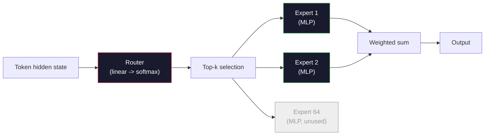

# Mở Models: Hướng dẫn kiến trúc

> Bạn đã xây dựng một GPT-2 Small từ đầu trong Bài 04. Frontier open models vào năm 2026 là cùng một gia đình với năm hoặc sáu thay đổi cụ thể. RMSNorm thay vì LayerNorm. SwiGLU thay vì GELU. RoPE thay vì các vị trí đã học. GQA hoặc MLA thay vì MHA đầy đủ. Hỗn hợp các chuyên gia trên quy mô lớn. Toán học bạn đã biết bao gồm 95% trong số đó. Bài học này đọc Llama 3, DeepSeek-V3, Mixtral, Qwen và Gemma cạnh nhau và đặt tên cho đường chính xác nơi mỗi kiến trúc phân kỳ.

**Loại:** Học
**Ngôn ngữ:** Python (stdlib)
**Kiến thức tiên quyết:** Giai đoạn 10, Bài 04, 05, 12 (Tiền training, Mở rộng quy mô, Inference)
**Thời lượng:** ~45 phút

## Mục tiêu học tập

- Đọc config. json của Llama 3, Mistral, Mixtral, Gemma 2, Qwen 2.5 và DeepSeek-V3 và giải thích mọi trường
- Đặt tên cho sự thay đổi kiến trúc cụ thể mà mỗi model thực hiện so với GPT-2 Nhỏ và biện minh cho nó từ các nguyên tắc đầu tiên
- Tính toán số lượng parameter, kích thước KV cache và bộ nhớ kích hoạt cho bất kỳ model mở nào chỉ từ config của nó
- Chọn model mở phù hợp cho mục tiêu triển khai với các hạn chế về độ trễ, bộ nhớ và khả năng

## Vấn đề

Trong Bài 04, bạn đã viết 350 dòng numpy và có một model hình GPT-2. Llama 3 405B có một báo cáo kỹ thuật dài 200 trang. Bản năng của bạn là đây là những con thú khác nhau. Không phải vậy. 200 trang mô tả cùng một đối tượng với năm hoặc sáu sửa đổi có động cơ tốt, cộng với hàng nghìn chi tiết triển khai về tỷ lệ. Bộ xương - embedding, khối transformer, attention, MLP, định mức, đầu - không thay đổi.

Bài học này là một sự khác biệt. Đối với mỗi gia đình model mở lớn, chúng tôi liệt kê chính xác những gì đã thay đổi so với GPT-2, tại sao và chi phí của nó. Khi bạn hoàn tất, bạn có thể đọc một thẻ model mới và dịch nó trở lại đường cơ sở GPT-2.

Phần thưởng thực tế là khi Meta phát hành Llama 5 hoặc DeepSeek phát hành V4, bạn sẽ không cần một model tinh thần mới. Bạn sẽ nhìn vào config, xem nút nào nổi tiếng đã di chuyển và biết ý nghĩa hạ nguồn là gì. Kiến trúc 2026 là một hộp công cụ hữu hạn. Mỗi model mới chọn một tập hợp con khác nhau.

## Khái niệm

### Lõi bất biến

Tất cả các models mở tự hồi quy đều chia sẻ:

- Token embedding ma trận (vocab_size x hidden_dim).
- Stack khối N decoder: định mức, self-attention, dư, định mức, MLP, dư.
- Định mức cuối cùng và đầu tuyến tính chiếu đến vocab_size (thường gắn trọng lượng với embeddings).
- Mặt nạ nhân quả, loss entropy chéo token tiếp theo.

Đó là hình dạng. rest là núm núm.

### Sáu núm thực sự di chuyển

Trong mỗi model mở biên giới 2024-2026, sáu lựa chọn thiết kế giống nhau được chọn đi chọn lại:

1. **Chuẩn hóa.** LayerNorm -> RMSNorm.
2. **Mã hóa vị trí.** Học RoPE -> tuyệt đối (cộng với các biến thể: YaRN, NTK).
3. **Kích hoạt.** GELU -> SwiGLU (hoặc GeGLU).
4. **Attention chia sẻ đầu.** MHA -> GQA -> MQA -> MLA.
5. **MLP dày đặc và thưa thớt.** Hỗn hợp chuyên gia > dày đặc.
6. **Vị trí trước định mức. **Trước định mức vẫn còn. Sau tiêu chuẩn đã biến mất.

Mọi thứ khác (learning rate lịch, hỗn hợp dữ liệu, kích thước batch, độ dài ngữ cảnh) đều nằm trong training config chứ không phải kiến trúc. Sáu núm.

### Núm 1: RMSNorm

LayerNorm trừ giá trị trung bình, chia cho std, thang đo và dịch chuyển. RMSNorm chỉ giữ thang đo:

```
RMSNorm(x) = x / sqrt(mean(x^2) + eps) * gamma
```

Không có phép trừ trung bình. Không có bias. Ít hơn một matmul mỗi token. Zhang và Sennrich (2019) lập luận rằng nó phù hợp với LayerNorm về dịch máy trong khi nhanh hơn 10%. Mọi model mở hiện đại đều chạy nó.

Chi phí: không có. Lợi ích: thông lượng nhỏ thắng, mã đơn giản hơn.

### Núm 2: RoPE

Vị trí đã học embeddings là bảng tra cứu 1024 vị trí trong GPT-2. Ngữ cảnh 1025 nằm ngoài cuối bảng. Models không thể ngoại suy vượt quá độ dài training của chúng.

Vị trí quay Embedding (RoPE, Su et al. 2021) đưa vào vị trí bằng cách xoay từng vector Q và K theo cặp trước tích chấm attention. Góc quay là một hàm xác định của vị trí, vì vậy không có gì học được và không có gì để cạn kiệt. Với các thủ thuật chia tỷ lệ (nội suy nhận biết NTK, YaRN), một model được huấn luyện về ngữ cảnh 8k có thể kéo dài đến 128k ở inference với độ accuracy loss khiêm tốn.

```
q_rotated = rotate(q, angle(pos))
k_rotated = rotate(k, angle(pos))
score = q_rotated . k_rotated
```

Mỗi Llama, Mistral, Qwen, DeepSeek và Gemma đều sử dụng RoPE. Gemma 2 sử dụng kết hợp (RoPE trên hầu hết các lớp, cửa sổ trượt cục bộ attention trên các lớp khác).

### Núm 3: SwiGLU

MLP của GPT-2 là `x -> gelu(xW1 + b1) -> (...)W2 + b2`. SwiGLU (Shazeer 2020) thay thế kích hoạt bằng một sản phẩm có cổng:

```
SwiGLU(x) = (xW1) * sigmoid(xW1) * xV
```

Hai phép chiếu song song thay vì một, được kiểm soát bởi kích hoạt Swish. Mạnh hơn về mặt kinh nghiệm về perplexity mỗi parameter. Llama 2 chấp nhận nó, mọi người đều làm theo. Kích thước ẩn của MLP thường được đặt sao cho tổng số parameter khớp với MLP dày đặc ban đầu: nếu GPT-2 sử dụng `ff_dim = 4 * hidden`, SwiGLU sử dụng `ff_dim = (2/3) * 4 * hidden = 8/3 * hidden`.

### Núm 4: Chia sẻ đầu Attention

GPT-2 sử dụng **Multi-Head Attention (MHA)**: mỗi đầu đều có phép chiếu Q, K, V riêng.

**Multi-Query Attention (MQA, Shazeer 2019) **chia sẻ một K và một V trên tất cả các đầu. Giảm KV cache num_heads, giảm từ 12 đến 32 lần so với một model điển hình. Accuracy giảm nhẹ khi benchmarks cứng.

**Grouped-Query Attention (GQA, Ainslie et al. 2023) **là nền tảng trung gian: Nhóm G của đầu Q chia sẻ một K và một V. Llama 3 8B sử dụng GQA với 32 đầu Q và 8 đầu KV (G = 8), vì vậy KV cache co lại 4 lần so với MHA đầy đủ.

**Multi-Head Latent Attention (MLA, DeepSeek 2024)** nén K và V thành một tiềm ẩn cấp thấp được chia sẻ, chiếu chúng trở lại trên mỗi đầu. Giảm hơn nữa KV cache trong khi vẫn duy trì khả năng biểu cảm trên mỗi đầu. DeepSeek-V2 và V3 dựa vào điều này để có hiệu suất ngữ cảnh dài của chúng.

| Đề án | Đầu KV | KV Cache | Accuracy |
|--------|----------|----------|----------|
| MHA | num_heads | đầy đủ | tốt nhất |
| GQA | num_groups (G < num_heads) | Giảm num_heads / G | gần-MHA |
| MQA | 1 | Giảm num_heads | Cú đánh nhỏ |
| MLA | giải nén tiềm ẩn, trên mỗi đầu | nhỏ hơn MQA | gần-MHA |

Đối với bất kỳ model nào trên ~13B parameters, GQA hoặc MLA là bắt buộc một cách hiệu quả. MHA đầy đủ trên quy mô lớn là một thảm họa KV cache.

### Núm 5: Sự kết hợp của các chuyên gia

Một MLP dày đặc kích hoạt tất cả các parameters của nó cho mỗi token. MLP MoE có K chuyên gia trên mỗi khối và một bộ định tuyến chọn top-k chuyên gia mỗi token (thường là top 2). Chỉ những trọng số của các chuyên gia đó mới thấy forward pass cho token đó.

```
router_logits = xW_r
indices, weights = top_k(router_logits, k=2)
output = sum_i weights[i] * expert[indices[i]](x)
```

Sức hấp dẫn: bạn có thể có 64 chuyên gia có kích thước 7B mỗi người (vì vậy tổng số tham số là rất lớn) trong khi chỉ chạy 2 trong số họ mỗi token (vì vậy tính toán trên mỗi token khớp với model 7B dày đặc). Mixtral 8x7B có tổng số parameters 47B nhưng chỉ kích hoạt 13B mỗi token. DeepSeek-V3 có tổng cộng 671 tỷ parameters nhưng chỉ kích hoạt 37B mỗi token.



Ưu điểm: cùng một tính toán, nhiều parameters hơn, dung lượng tốt hơn. Nhược điểm: bộ nhớ chuyên gia vẫn phải ở đâu đó (vì vậy việc phục vụ cần nhiều VRAM hơn so với bộ nhớ tương đương dày đặc), cân bằng tải bộ định tuyến rất khó và fine-tuning bộ định tuyến trong alignment là lĩnh vực nghiên cứu riêng của nó.

### Núm 6: Giữ nguyên định mức trước

Tiêu chuẩn ban đầu transformer áp dụng định mức lớp sau mỗi lớp con. Mọi model mở kể từ GPT-2 đặt nó * trước * mỗi lớp con. Chuẩn trước hoàn toàn dễ dàng hơn để huấn luyện ở độ sâu. Không có gì để tranh cãi.

### Model-by-Model khác biệt

Đây là bảng làm cho tất cả những điều này trở nên cụ thể.

| Model | Năm | Tổng số tham số | Tham số hoạt động | Định mức | Kích hoạt | Chức vụ | Attention | MoE | Bối cảnh |
|-------|------|-------------|---------------|------|-----------|----------|-----------|-----|---------|
| GPT-2 Nhỏ | 2019 | 124 triệu | 124 triệu | LayerNorm | GELU | Đã học | MHA (12 đầu) | Không | 1k |
| Llama 3 8B | 2024 | 8 tỷ | 8 tỷ | RMSNorm | SwiGLU | Dây thừng | GQA (32/8) | Không | 128 nghìn |
| Llama 3 70B | 2024 | 70 tỷ | 70 tỷ | RMSNorm | SwiGLU | Dây thừng | GQA (64/8) | Không | 128 nghìn |
| Llama 3 405B | 2024 | 405 tỷ | 405 tỷ | RMSNorm | SwiGLU | Dây thừng | GQA (128/16) | Không | 128 nghìn |
| Mistral 7B | 2023 | 7,2 tỷ | 7,2 tỷ | RMSNorm | SwiGLU | Dây thừng | GQA | Không | 32 nghìn |
| Hỗn hợp 8x7B | 2023 | 47 tỷ | 13 tỷ | RMSNorm | SwiGLU | Dây thừng | GQA | Có (8 chuyên gia, top-2) | 32 nghìn |
| Đá quý 2 9B | 2024 | 9 tỷ | 9 tỷ | RMSNorm (trước + sau) | GeGLU | RoPE + trượt | GQA | Không | 8 nghìn |
| Qwen 2.5 72B | 2024 | 72 tỷ | 72 tỷ | RMSNorm | SwiGLU | Dây thừng (YaRN) | GQA (64/8) | Không | 128 nghìn |
| Tìm sâu V2 236B | 2024 | 236 tỷ | 21 tỷ | RMSNorm | SwiGLU | Dây thừng | MLA | Có (160 chuyên gia, TOP-6) | 128 nghìn |
| Tìm sâu V3 | 2024 | 671 tỷ | 37 tỷ | RMSNorm | SwiGLU | Dây thừng | MLA | Có (256 chuyên gia, top-8) | 128 nghìn |

Quét các cột. RMSNorm là phổ quát. SwiGLU hoặc người anh em họ GeGLU của nó là phổ quát. RoPE là phổ quát. GQA là phổ biến trên 7B ngoại trừ khi được thay thế bằng MLA. MoE là điểm khác biệt ở đầu trên cùng.

### Đọc một config. json

Llama 3 8B config:

```
{
  "hidden_size": 4096,
  "intermediate_size": 14336,
  "num_hidden_layers": 32,
  "num_attention_heads": 32,
  "num_key_value_heads": 8,
  "max_position_embeddings": 131072,
  "rope_theta": 500000.0,
  "rms_norm_eps": 1e-5,
  "vocab_size": 128256
}
```

Mọi trường tương ứng với một cái gì đó bạn đã thực hiện.

- `hidden_size`: Kích thước embedding.
- `intermediate_size`: Kích thước ẩn MLP (ẩn 3,5x -- SwiGLU toán học).
- `num_hidden_layers`: stack độ sâu.
- `num_attention_heads`: Đầu Q.
- `num_key_value_heads`: Đầu KV (GQA).
- `max_position_embeddings`: training độ dài ngữ cảnh.
- `rope_theta`: Tần số cơ bản của RoPE. Meta đã chia tỷ lệ từ 10k mặc định lên 500k để ngoại suy ngữ cảnh dài.
- `rms_norm_eps`: ổn định số.
- `vocab_size`: tokens.

Chỉ từ những thứ này, bạn tính toán tổng parameters, KV cache và bộ nhớ kích hoạt đỉnh. Xem `code/main.py` để biết các công thức chính xác.

### Ngân sách bộ nhớ kích hoạt

Kích hoạt thống trị bộ nhớ training trên vài tỷ parameters. Quy tắc ngón tay cái cho training trước (với điểm kiểm tra gradient):

```
activation_mem ~ batch_size * seq_len * hidden_size * num_layers * bytes_per_element
```

Đối với Llama 3 8B ở batch 1, seq 8192, BF16, 32 lớp, ẩn 4096: khoảng 8 GB chỉ để kích hoạt với điểm kiểm tra, 40 GB không có. Đây là lý do tại sao flash-attention và ring-attention quan trọng - chúng viết lại tính toán attention để kích hoạt phù hợp.

### KV Cache ngân sách

Đối với inference ở ngữ cảnh tối đa:

```
kv_cache = 2 * num_layers * num_kv_heads * head_dim * max_seq_len * bytes_per_element
```

Llama 3 8B ở ngữ cảnh 128k, BF16, head_dim = ẩn / num_heads = 128:
`2 * 32 * 8 * 128 * 131072 * 2 = 17.2 GB` cho mỗi trình tự.

Trọng lượng 8B là 16 GB trong BF16. KV cache cho một chuỗi 128k lớn hơn trọng lượng. Đây là áp lực bộ nhớ thúc đẩy nghiên cứu GQA, MLA và KV cache quantization.

### Khi mỗi Model chiến thắng

- **GPU 80GB đơn, không có MoE**: Llama 3 8B, Mistral 7B, Gemma 2 9B. Dễ phục vụ, dụng cụ rộng.
- **Nút đơn (8x80GB), dung lượng lớn**: Llama 3 70B, Qwen 2.5 72B. Khả năng mở dày đặc cao nhất.
- **Khả năng mở lớn nhất, chấp nhận MoE độ phức tạp**: DeepSeek V3, Mixtral 8x22B. Khả năng tốt nhất trên mỗi FLOP đang hoạt động.
- **Nhu cầu ngữ cảnh dài**: Llama 3 (128k với tỷ lệ RoPE), DeepSeek (lợi thế MLA).
- **Phân phối độ trễ thấp**: Gemma 2 9B (cửa sổ trượt cắt điện toán ngữ cảnh dài).

```figure
rmsnorm-vs-layernorm
```

## Tự xây dựng

Mã của bài học là một máy tính. Cho bất kỳ config nào. json, nó in số lượng parameter theo thành phần, KV cache ở ngữ cảnh tối đa, tỷ lệ MLP SwiGLU và một phán quyết ngắn về kiến trúc (dày đặc / GQA / MLA / MoE).

```python
config = {
    "hidden_size": 4096, "intermediate_size": 14336,
    "num_hidden_layers": 32, "num_attention_heads": 32,
    "num_key_value_heads": 8, "vocab_size": 128256,
    "max_position_embeddings": 131072,
}
```

script đi theo lĩnh vực kiến trúc theo trường, tính toán số lượng tham số cho embedding, attention (với GQA giảm), MLP (với SwiGLU mở rộng), layernorms và head. Sau đó, nó tính toán KV cache ở độ dài ngữ cảnh đã nêu và in một bản tóm tắt.

Xem `code/main.py` để thực hiện.

## Ứng dụng

Chạy máy tính trên các cấu hình Llama 3 8B, Mistral 7B, Mixtral 8x7B và DeepSeek V3 đi kèm trong script. So sánh các phân tích parameter. Lưu ý rằng MoE models có tổng số tham số làm lùn models dày đặc nhưng số lượng tham số hoạt động thường nhỏ hơn. Lưu ý rằng KV cache của DeepSeek V3 nhỏ hơn Llama 3 405B mặc dù có tổng parameters nhiều hơn - đó là MLA đang hoạt động.

Sau đó, cắm một config cho bất kỳ model nào bạn có cục bộ, đọc tóm tắt và quyết định xem nó có phù hợp với GPU của bạn hay không.

## Sản phẩm bàn giao

Bài học này tạo ra `outputs/skill-open-model-picker.md`. Với mục tiêu triển khai (loại GPU, VRAM, độ dài ngữ cảnh, ngân sách độ trễ) và hồ sơ tác vụ (trò chuyện, mã, suy luận, ngữ cảnh dài), nó đề xuất một model mở, một sơ đồ quantization từ Bài 11 và một inference stack từ Bài 12, với lý do rõ ràng về sáu núm kiến trúc.

## Bài tập

1. Đọc config Qwen 2.5 72B từ HuggingFace. Tính toán tổng parameters từ đầu. So sánh với giá trị do HF báo cáo và xác định bất kỳ delta nào đến từ đâu (làm tròn độ mờ đầu, hệ số chia sẻ KV, v.v.).

2. DeepSeek V3 sử dụng 256 chuyên gia với định tuyến top 8. Tính toán tỷ lệ các chuyên gia được kích hoạt trên tổng số chuyên gia và so sánh với top 2 của Mixtral 8x7B. Sự thay đổi từ thưa thớt (25%) sang thưa thớt dày đặc hơn (3%) ngụ ý gì về dung lượng trên mỗi FLOP?

3. Tính toán KV cache cho Llama 3 405B ở ngữ cảnh 128k trong FP8 và BF16. Ở FP8, nó bằng một nửa số BF16. Bạn có thể phân phát bao nhiêu chuỗi song song trên một nút 8xH100 (80GB mỗi thứ = tổng cộng 640GB, trừ đi trọng lượng bộ nhớ)?

4. Gemma 2 xen kẽ các layer full-attention và sliding-window-attention. Viết phép toán cho KV cache khi một nửa số layer sử dụng cửa sổ trượt 4096 token thay vì ngữ cảnh đầy đủ. Điều đó tiết kiệm được bao nhiêu bộ nhớ ở tổng ngữ cảnh 8k?

5. Tìm một model mở biên giới gần đây được phát hành sau khi bài học này được viết. Xác định nó đã chọn núm nào trong số sáu núm và liệu nó có giới thiệu núm thứ bảy hay không. Chương trình giảng dạy sẽ cảm thấy lỗi thời khi một kiến trúc mới ships - mục tiêu là cập nhật bảng của bạn mà không xây dựng lại model tinh thần của bạn.

## Thuật ngữ chính

| Thuật ngữ | Những gì mọi người nói | Ý nghĩa thực sự của nó |
|------|----------------|----------------------|
| RMSNorm | "LayerNorm mà không có ý nghĩa" | Chuẩn hóa chỉ bằng bình phương trung bình gốc, với thang đo đã học - rẻ hơn và có thể so sánh với LayerNorm |
| Dây thừng | "Vị trí quay" | Xoay từng vector Q và K trong các cặp 2D theo một góc phụ thuộc vào vị trí - ngoại suy vượt quá chiều dài training bằng các thủ thuật chia tỷ lệ |
| SwiGLU | "Kích hoạt MLP mới" | Đơn vị tuyến tính có cổng với Swish: `(xW1) * sigmoid(xW1) * xV` - tiêu chuẩn trong mọi model mở 2024+ |
| GQA | "attention trung gian" | Truy vấn nhóm Attention: Nhóm G của đầu Q chia sẻ một đầu K và một đầu V - thu nhỏ KV cache mà không có accuracy của MQA |
| MLA | "attention của DeepSeek" | Attention tiềm ẩn nhiều đầu: nén K/V thành một tiềm ẩn cấp thấp được chia sẻ, giải nén trên mỗi đầu - KV cache nhỏ nhất cho models lớn |
| MoE | "Chuyên gia thưa thớt" | Sự kết hợp của các chuyên gia: N MLP trên mỗi khối, bộ định tuyến chọn top-k trên mỗi token - tổng số tham số khổng lồ, tham số hoạt động nhỏ |
| Định tuyến Top-k | "Chọn k chuyên gia mỗi token" | Bộ định tuyến tính điểm cho mỗi chuyên gia và kích hoạt k cao nhất - k điển hình là 2 (Mixtral) đến 8 (DeepSeek) |
| YaRN | "Dây căng thẳng" | Tuy nhiên, một phần mở rộng RoPE khác - nội suy các góc quay để mở rộng ngữ cảnh từ 8k lên 128k + tại inference thời điểm |
| Cửa sổ trượt attention | "Đừng quan tâm đến mọi thứ" | Mỗi token chỉ tham gia vào W tokens cuối cùng - giới hạn attention chi phí ở mức O (W) mỗi token, được sử dụng trong Gemma 2 và Mistral đầu tiên |
| Tham số hoạt động | "Những gì chạy trên mỗi token" | Đối với MoE models, số lượng parameter có forward pass trên token (nhỏ hơn nhiều so với tổng số tham số) - chi phối trên mỗi token FLOPs |

## Đọc thêm

- [Dubey et al., 2024 -- "The Llama 3 Herd of Models"](https://arxiv.org/abs/2407.21783) -- tài liệu tham khảo kiến trúc và training cho họ Llama 3 dày đặc
- [DeepSeek-AI, 2024 -- "DeepSeek-V3 Technical Report"](https://arxiv.org/abs/2412.19437) - MLA cộng với cân bằng tải không loss phụ trợ cộng với MoE 671B
- [Jiang et al., 2024 -- "Mixtral of Experts"](https://arxiv.org/abs/2401.04088) -- giấy model mở MoE chuẩn
- [Su et al., 2021 -- "RoFormer: Enhanced Transformer with Rotary Position Embedding"](https://arxiv.org/abs/2104.09864) -- giấy RoPE
- [Shazeer, 2020 -- "GLU Variants Improve Transformer"](https://arxiv.org/abs/2002.05202) -- SwiGLU, GeGLU và bạn bè
- [Ainslie et al., 2023 -- "GQA: Training Generalized Multi-Query Transformer Models"](https://arxiv.org/abs/2305.13245) -- bài báo GQA
- [Gemma 2 Team, 2024 -- "Gemma 2: Improving Open Language Models at a Practical Size"](https://arxiv.org/abs/2408.00118) - Kết hợp đầy đủ + attention trượt, trước + sau định mức
- [Qwen Team, 2024 -- "Qwen 2.5 Technical Report"](https://arxiv.org/abs/2412.15115) -- Mở rộng ngữ cảnh YaRN và công thức nấu ăn training ngữ cảnh dài
