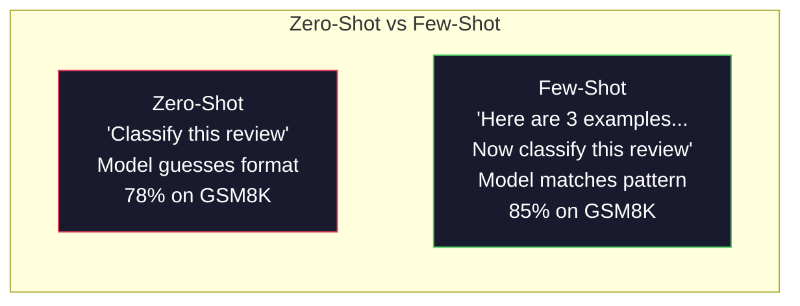
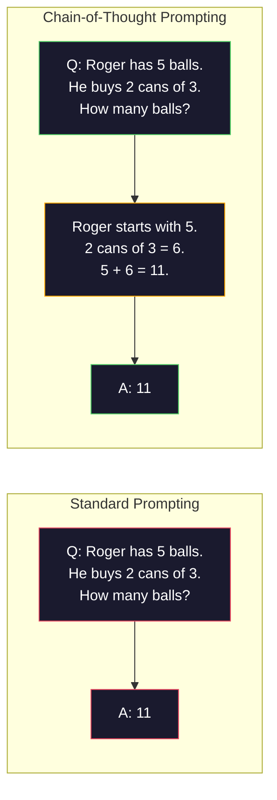
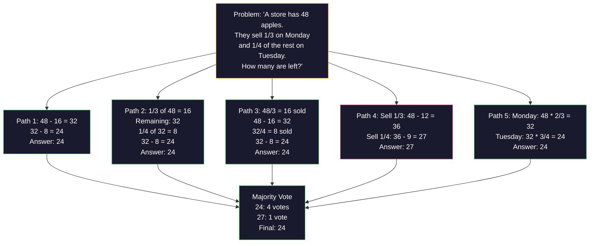
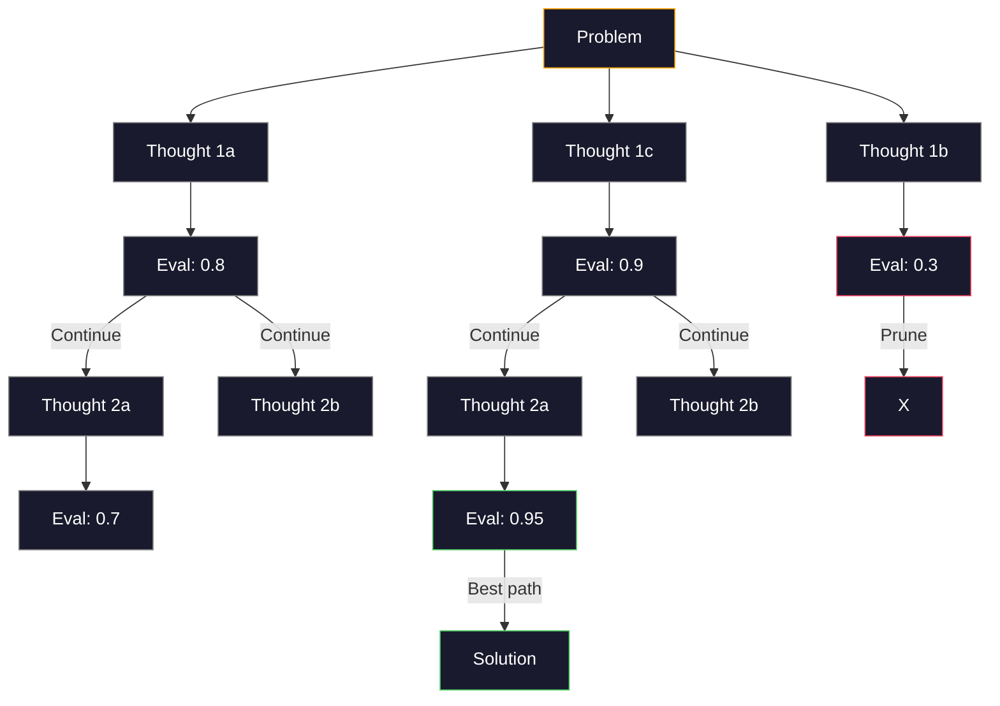

# Few-Shot, Chain-of-Thought, Cây tư tưởng

> Nói với một model phải làm gì là prompting. Chỉ cho nó cách suy nghĩ là kỹ thuật. Khoảng cách giữa 78% và 91% accuracy trên cùng một model, cùng một nhiệm vụ, cùng một dữ liệu không phải là một model tốt hơn. Đó là một chiến lược lý luận tốt hơn.

**Loại:** Xây dựng
**Ngôn ngữ:** Python
**Kiến thức tiên quyết:** Bài 11.01 (Kỹ thuật Prompt)
**Thời lượng:** ~45 phút

## Mục tiêu học tập

- Triển khai few-shot prompting bằng cách chọn và định dạng các minh họa ví dụ để tối đa hóa accuracy tác vụ
- Áp dụng lý luận chain-of-thought (CoT) để cải thiện accuracy đối với các vấn đề nhiều bước như bài toán từ
- Xây dựng một prompt cây tư tưởng khám phá nhiều con đường lý luận và chọn con đường tốt nhất
- Đo lường sự cải thiện accuracy từ zero-shot so với few-shot so với CoT trên một benchmark tiêu chuẩn

## Vấn đề

Bạn xây dựng một ứng dụng dạy kèm toán. prompt của bạn nói: "Giải bài toán từ này." GPT-5 làm đúng 94% thời gian trên GSM8K, benchmark toán tiêu chuẩn của trường tiểu học. Bạn nghĩ rằng bạn đã đạt đỉnh. Bạn không - chain-of-thought vẫn thêm 3-4 điểm.

Thêm năm từ - "Hãy suy nghĩ từng bước" - và accuracy nhảy lên 91%. Thêm một vài ví dụ đã làm việc và nó đạt 95%. Cùng model. Cùng temperature. Cùng chi phí API. Sự khác biệt duy nhất là bạn đã đưa cho model giấy nháp.

Đây không phải là một hack. Đó là cách lý luận hoạt động. Con người không giải quyết các vấn đề nhiều bước trong một bước nhảy vọt về tinh thần. transformers cũng vậy. Khi bạn buộc một model tạo ra tokens trung gian, những tokens đó sẽ trở thành một phần của ngữ cảnh cho token tiếp theo. Mỗi bước suy luận cung cấp cho bước tiếp theo. model tính toán theo đúng nghĩa đen theo cách của nó để đưa ra câu trả lời.

Nhưng "suy nghĩ từng bước" là khởi đầu chứ không phải kết thúc. Điều gì sẽ xảy ra nếu bạn lấy mẫu năm con đường suy luận và bỏ phiếu đa số? Điều gì sẽ xảy ra nếu bạn để model khám phá một cây khả năng, đánh giá và cắt tỉa branches? Điều gì sẽ xảy ra nếu bạn xen kẽ lý luận với việc sử dụng công cụ? Đây không phải là giả thuyết. Chúng là các kỹ thuật được công bố với những cải tiến được đo lường và bạn sẽ xây dựng tất cả chúng trong bài học này.

## Khái niệm

### Zero-Shot vs Few-Shot: Khi các ví dụ đánh bại hướng dẫn

Zero-shot prompting giao cho model một nhiệm vụ và không có gì khác. Few-shot prompting đưa ra ví dụ trước.

Wei et al. (2022) đã đo lường điều này trong 8 benchmarks. Đối với các nhiệm vụ đơn giản như phân loại cảm xúc, zero-shot và few-shot thực hiện trong vòng 2% so với nhau. Đối với các nhiệm vụ phức tạp như số học nhiều bước và suy luận biểu tượng, few-shot cải thiện accuracy từ 10-25%.

Trực giác: ví dụ là các hướng dẫn nén. Thay vì mô tả định dạng đầu ra, bạn hiển thị nó. Thay vì giải thích lý do process, bạn chứng minh nó. model khớp mẫu trên các ví dụ đáng tin cậy hơn so với diễn giải các hướng dẫn trừu tượng.



**Khi few-shot thắng:** các tác vụ nhạy cảm với định dạng, phân loại, trích xuất có cấu trúc, biệt ngữ dành riêng cho miền, bất kỳ nhiệm vụ nào mà model cần khớp với một mẫu cụ thể.

**Khi zero-shot thắng:** các câu hỏi thực tế đơn giản, nhiệm vụ sáng tạo trong đó các ví dụ hạn chế sự sáng tạo, các nhiệm vụ mà việc tìm kiếm các ví dụ tốt khó hơn viết hướng dẫn tốt.

### Ví dụ về lựa chọn: Nhịp điệu tương tự ngẫu nhiên

Không phải tất cả các ví dụ đều như nhau. Chọn các ví dụ tương tự như đầu vào mục tiêu vượt trội hơn lựa chọn ngẫu nhiên từ 5-15% đối với các nhiệm vụ phân loại (Liu và cộng sự, 2022). Ba nguyên tắc:

1. **Tương tự ngữ nghĩa**: chọn ví dụ gần nhất với đầu vào trong không gian embedding
2. **Đa dạng nhãn**: bao gồm tất cả các danh mục đầu ra trong ví dụ của bạn
3. **Khớp độ khó**: phù hợp với mức độ phức tạp của bài toán mục tiêu

Số lượng ví dụ tối ưu cho hầu hết các nhiệm vụ là 3-5. Dưới 3, model không có đủ tín hiệu để trích xuất mẫu. Trên 5, bạn đạt được lợi nhuận giảm dần và lãng phí context window tokens. Để phân loại có nhiều nhãn, hãy sử dụng một ví dụ cho mỗi nhãn.

### Chain-of-Thought: Cho Models giấy nháp

Chain-of-Thought (CoT) prompting được giới thiệu bởi Wei et al. (2022) tại Google Brain. Ý tưởng rất đơn giản: thay vì chỉ yêu cầu model trả lời, hãy yêu cầu nó đưa ra các bước lý luận của mình trước.



Tại sao điều này hoạt động một cách máy móc? Mỗi token mà một transformer tạo ra sẽ trở thành ngữ cảnh cho token tiếp theo. Nếu không có CoT, các model phải nén tất cả các lý luận vào trạng thái ẩn của một forward pass duy nhất. Với CoT, các model bên ngoài hóa các tính toán trung gian dưới dạng tokens. Mỗi suy luận token mở rộng chiều sâu tính toán hiệu quả.

**GSM8K benchmarks (toán tiểu học, bài toán 8.5K):**

| Model | Zero-Shot | Zero-Shot CoT | Few-Shot CoT |
|-------|-----------|---------------|--------------|
| GPT-4o | 78% | 91% | 95% |
| GPT-5 | 94% | 97% | 98% |
| o4-mini (lý luận) | 97% | — | — |
| Claude Opus 4.7 | 93% | 97% | 98% |
| Gemini 3 chuyên nghiệp | 92% | 96% | 98% |
| Llama 4 70B | 80% | 89% | 94% |
| Tìm kiếm sâu-V3.1 | 89% | 94% | 96% |

**Lưu ý về lý luận models.** Models như o-series của OpenAI (o3, o4-mini) và DeepSeek-R1 chạy chain-of-thought nội bộ trước khi đưa ra câu trả lời của họ. Thêm "Hãy suy nghĩ từng bước" vào một model lý luận là dư thừa và đôi khi phản tác dụng - họ đã làm điều đó.

Hai hương vị của CoT:

**Zero-shot CoT**: thêm "Hãy suy nghĩ từng bước" vào prompt. Không cần ví dụ. Kojima et al. (2022) cho thấy câu duy nhất này cải thiện accuracy trong các nhiệm vụ suy luận số học, thông thường và biểu tượng.

**Few-shot CoT**: cung cấp các ví dụ bao gồm các bước suy luận. Hiệu quả hơn zero-shot CoT vì model nhìn thấy định dạng suy luận chính xác mà bạn mong đợi.

**Khi CoT bị tổn thương**: recall thực tế đơn giản ("Thủ đô của Pháp là gì?"), phân loại một bước, các nhiệm vụ mà tốc độ quan trọng hơn accuracy. CoT thêm 50-200 tokens chi phí suy luận cho mỗi truy vấn. Đối với các tác vụ thông lượng cao, độ phức tạp thấp, đó là chi phí lãng phí.

### Tính nhất quán: Lấy mẫu nhiều, bỏ phiếu một lần

Wang et al. (2023) đã giới thiệu tính tự nhất quán. Thông tin chi tiết: một đường dẫn CoT duy nhất có thể chứa các lỗi suy luận. Nhưng nếu bạn lấy mẫu N đường dẫn suy luận độc lập (sử dụng temperature > 0) và bỏ phiếu đa số cho câu trả lời cuối cùng, lỗi sẽ bị hủy bỏ.



Tính nhất quán đã cải thiện accuracy GSM8K từ 56,5% (CoT đơn) lên 74,4% với N = 40 trên các thí nghiệm PaLM 540B ban đầu. Trên GPT-5 sự cải thiện là nhỏ (97% đến 98%) vì accuracy cơ bản đã bão hòa. Kỹ thuật này tỏa sáng nhất trên models với 60-85% CoT cơ sở accuracy - điểm ngọt ngào trong đó lỗi đường dẫn đơn thường xuyên nhưng không có hệ thống. Để suy luận models tính nhất quán (o-series, R1) tự nhất quán được gộp vào sampling bên trong tích hợp.

Sự đánh đổi: N mẫu có nghĩa là Nx chi phí và độ trễ API. Trong thực tế, N=5 nắm bắt hầu hết lợi ích. N=3 là mức tối thiểu cho một phiếu bầu có ý nghĩa. N > 10 có lợi nhuận giảm dần cho hầu hết các nhiệm vụ.

### Tree-of-Thought: Khám phá phân nhánh

Yao et al. (2023) đã giới thiệu Tree-of-Thought (ToT). Trong trường hợp CoT đi theo một con đường suy luận tuyến tính, ToT khám phá nhiều branches và đánh giá cái nào hứa hẹn nhất trước khi tiếp tục.



ToT có ba thành phần:

1. **Tạo tư duy**: tạo ra nhiều ứng cử viên bước tiếp theo
2. **Đánh giá trạng thái**: chấm điểm từng ứng viên (có thể sử dụng chính LLM làm người đánh giá)
3. **Thuật toán tìm kiếm**: BFS hoặc DFS thông qua cây, cắt tỉa branches điểm thấp

Trong nhiệm vụ Game of 24 (kết hợp 4 số sử dụng số học để tạo thành 24), GPT-4 với prompting tiêu chuẩn giải quyết được 7,3% vấn đề. Với CoT, 4,0% (CoT thực sự đau ở đây vì không gian tìm kiếm rộng). Với ToT, 74%.

ToT đắt tiền. Mỗi nút trong cây yêu cầu một cuộc gọi LLM. Một cây có hệ số phân nhánh 3 và độ sâu 3 yêu cầu tối đa 39 LLM cuộc gọi. Chỉ sử dụng nó cho các vấn đề mà không gian tìm kiếm lớn nhưng có thể đánh giá được - lập kế hoạch, giải câu đố, giải quyết vấn đề sáng tạo với các ràng buộc.

### ReAct: Suy nghĩ + Làm

Yao et al. (2022) kết hợp lý luận traces với hành động. model xen kẽ giữa tư duy (tạo ra lý luận) và hành động (gọi công cụ, tìm kiếm, tính toán).

```mermaid
graph LR
    Q["Question:\nWhat is the\npopulation of the\ncountry where\nthe Eiffel Tower\nis located?"]
    T1["Thought: I need to\nfind which country\nhas the Eiffel Tower"]
    A1["Action: search\n'Eiffel Tower location'"]
    O1["Observation:\nParis, France"]
    T2["Thought: Now I need\nFrance's population"]
    A2["Action: search\n'France population 2024'"]
    O2["Observation:\n68.4 million"]
    T3["Thought: I have\nthe answer"]
    F["Answer:\n68.4 million"]

    Q --> T1 --> A1 --> O1 --> T2 --> A2 --> O2 --> T3 --> F

    style Q fill:#1a1a2e,stroke:#ffa500,color:#fff
    style T1 fill:#1a1a2e,stroke:#51cf66,color:#fff
    style A1 fill:#1a1a2e,stroke:#e94560,color:#fff
    style O1 fill:#1a1a2e,stroke:#808080,color:#fff
    style T2 fill:#1a1a2e,stroke:#51cf66,color:#fff
    style A2 fill:#1a1a2e,stroke:#e94560,color:#fff
    style O2 fill:#1a1a2e,stroke:#808080,color:#fff
    style T3 fill:#1a1a2e,stroke:#51cf66,color:#fff
    style F fill:#1a1a2e,stroke:#51cf66,color:#fff
```



ReAct vượt trội hơn CoT thuần túy trong các nhiệm vụ chuyên sâu về kiến thức vì nó có thể dựa trên suy luận của nó trong dữ liệu thực. Trên HotpotQA (trả lời câu hỏi nhiều bước nhảy), ReAct với GPT-4 đạt được 35,1% khớp chính xác so với 29,4% chỉ cho CoT. Sức mạnh thực sự là các lỗi suy luận được sửa chữa bằng các quan sát - model có thể cập nhật kế hoạch của mình giữa quá trình thực hiện.

ReAct là nền tảng của AI agents hiện đại. Mỗi agent framework (LangChain, CrewAI, AutoGen) triển khai một số biến thể của vòng lặp Suy nghĩ-Hành động-Quan sát. Bạn sẽ xây dựng toàn bộ agents trong Giai đoạn 14. Bài học này bao gồm mô hình prompting.

### Prompting có cấu trúc: Thẻ XML, dấu phân cách, tiêu đề

Khi prompts trở nên phức tạp, cấu trúc ngăn model gây nhầm lẫn cho các phần. Ba cách tiếp cận:

**Thẻ XML** (hoạt động tốt nhất với Claude, rắn ở mọi nơi):
```
<context>
You are reviewing a pull request.
The codebase uses TypeScript and React.
</context>

<task>
Review the following diff for bugs, security issues, and style violations.
</task>

<diff>
{diff_content}
</diff>

<output_format>
List each issue with: file, line, severity (critical/warning/info), description.
</output_format>
```

**Tiêu đề Markdown** (phổ quát):
```
## Role
Senior security engineer at a fintech company.

## Task
Analyze this API endpoint for vulnerabilities.

## Input
{api_code}

## Rules
- Focus on OWASP Top 10
- Rate each finding: critical, high, medium, low
- Include remediation steps
```

**Dấu phân cách** (tối thiểu nhưng hiệu quả):
```
---INPUT---
{user_text}
---END INPUT---

---INSTRUCTIONS---
Summarize the above in 3 bullet points.
---END INSTRUCTIONS---
```

### Prompt Chaining: Phân hủy tuần tự

Một số nhiệm vụ quá phức tạp đối với một prompt. Prompt chuỗi chia chúng thành các bước, trong đó đầu ra của một prompt trở thành đầu vào của  tiếp theo.


Chuỗi đánh bại một prompt vì ba lý do:

1. **Mỗi bước đơn giản hơn**: model xử lý một nhiệm vụ tập trung thay vì tung hứng mọi thứ
2. **Đầu ra trung gian có thể kiểm tra được**: bạn có thể xác thực và sửa chữa giữa các bước
3. **Các bước khác nhau có thể sử dụng các models khác nhau**: sử dụng model rẻ tiền để trích xuất, một  đắt tiền để suy luận

### So sánh hiệu suất

| Kỹ thuật | Tốt nhất cho | Accuracy GSM8K (GPT-5) | Cuộc gọi API | Token trên cao | Độ phức tạp |
|-----------|----------|------------------------|-----------|----------------|------------|
| Zero-Shot | Nhiệm vụ đơn giản | 94% | 1 | Không có | Tầm thường |
| Few-Shot | Đối sánh định dạng | 96% | 1 | 200-500 tokens | Thấp |
| Zero-Shot CoT | Tăng cường suy luận nhanh chóng | 97% | 1 | 50-200 tokens | Tầm thường |
| Few-Shot CoT | accuracy cuộc gọi tối đa | 98% | 1 | 300-600 tokens | Thấp |
| Tự nhất quán (N = 5) | Lý luận đặt cược cao | 98.5% | 5 | Chi phí token gấp 5 lần | Trung bình |
| Lý luận model (o4-mini) | Thay thế CoT thả vào | 97% | 1 | ẩn (2-10x nội bộ) | Tầm thường |
| Cây tư tưởng | Search/planning vấn đề | N/A (74% trong Game of 24) | 10-40+ | Chi phí token 10-40x | Cao |
| Hành động lại | Lý luận dựa trên kiến thức | N/A (35.1% trên HotpotQA) | 3-10+ | Biến | Cao |
| Prompt Chuỗi | Nhiệm vụ nhiều bước phức tạp | 96% (pipeline) | 2-5 | Chi phí token gấp 2-5 lần | Trung bình |

Kỹ thuật phù hợp phụ thuộc vào ba yếu tố: yêu cầu accuracy, ngân sách độ trễ và khả năng chịu chi phí. Đối với hầu hết các hệ thống production, few-shot CoT với dự phòng tự nhất quán 3 mẫu bao gồm 90% các trường hợp sử dụng.

## Tự xây dựng

Chúng ta sẽ xây dựng một công cụ giải quyết vấn đề toán học kết hợp few-shot prompting, lý luận chain-of-thought và bỏ phiếu tự nhất quán thành một pipeline duy nhất. Sau đó, chúng ta sẽ thêm cây tư tưởng cho các vấn đề khó.

Việc triển khai đầy đủ đang được `code/advanced_prompting.py`. Dưới đây là các thành phần chính.

### Bước 1: Few-Shot cửa hàng ví dụ

Thành phần đầu tiên quản lý few-shot ví dụ và chọn những ví dụ phù hợp nhất cho một vấn đề nhất định.

```python
GSM8K_EXAMPLES = [
    {
        "question": "Janet's ducks lay 16 eggs per day. She eats three for breakfast every morning and bakes muffins for her friends every day with four. She sells every egg at the farmers' market for $2. How much does she make every day at the farmers' market?",
        "reasoning": "Janet's ducks lay 16 eggs per day. She eats 3 and bakes 4, using 3 + 4 = 7 eggs. So she has 16 - 7 = 9 eggs left. She sells each for $2, so she makes 9 * 2 = $18 per day.",
        "answer": "18"
    },
    ...
]
```

Mỗi ví dụ có ba phần: câu hỏi, chuỗi lý luận và câu trả lời cuối cùng. Chuỗi lý luận là thứ biến một ví dụ few-shot thông thường thành ví dụ few-shot CoT.

### Bước 2: Trình tạo Chain-of-Thought Prompt

Trình tạo prompt tập hợp một thông báo hệ thống, few-shot các ví dụ với chuỗi suy luận và câu hỏi mục tiêu thành một prompt duy nhất.

```python
def build_cot_prompt(question, examples, num_examples=3):
    system = (
        "You are a math problem solver. "
        "For each problem, show your step-by-step reasoning, "
        "then give the final numerical answer on the last line "
        "in the format: 'The answer is [number]'."
    )

    example_text = ""
    for ex in examples[:num_examples]:
        example_text += f"Q: {ex['question']}\n"
        example_text += f"A: {ex['reasoning']} The answer is {ex['answer']}.\n\n"

    user = f"{example_text}Q: {question}\nA:"
    return system, user
```

Ràng buộc định dạng ("Câu trả lời là [số]") là rất quan trọng. Nếu không có nó, tính nhất quán không thể trích xuất và so sánh câu trả lời giữa các mẫu.

### Bước 3: Tự bỏ phiếu nhất quán

Mẫu N đường dẫn suy luận và lấy câu trả lời đa số.

```python
def self_consistency_solve(question, examples, client, model, n_samples=5):
    system, user = build_cot_prompt(question, examples)

    answers = []
    reasonings = []
    for _ in range(n_samples):
        response = client.chat.completions.create(
            model=model,
            messages=[
                {"role": "system", "content": system},
                {"role": "user", "content": user}
            ],
            temperature=0.7
        )
        text = response.choices[0].message.content
        reasonings.append(text)
        answer = extract_answer(text)
        if answer is not None:
            answers.append(answer)

    vote_counts = Counter(answers)
    best_answer = vote_counts.most_common(1)[0][0] if vote_counts else None
    confidence = vote_counts[best_answer] / len(answers) if best_answer else 0

    return best_answer, confidence, reasonings, vote_counts
```

Temperature 0,7 là quan trọng. Ở temperature 0,0, tất cả N mẫu sẽ giống hệt nhau, đánh bại mục đích. Bạn cần đủ ngẫu nhiên cho các con đường suy luận đa dạng nhưng không quá nhiều đến mức model tạo ra vô nghĩa.

### Bước 4: Trình giải cây tư tưởng

Đối với các vấn đề mà suy luận tuyến tính thất bại, ToT khám phá nhiều cách tiếp cận và đánh giá hướng nào hứa hẹn nhất.

```python
def tree_of_thought_solve(question, client, model, breadth=3, depth=3):
    thoughts = generate_initial_thoughts(question, client, model, breadth)
    scored = [(t, evaluate_thought(t, question, client, model)) for t in thoughts]
    scored.sort(key=lambda x: x[1], reverse=True)

    for current_depth in range(1, depth):
        next_thoughts = []
        for thought, score in scored[:2]:
            extensions = extend_thought(thought, question, client, model, breadth)
            for ext in extensions:
                ext_score = evaluate_thought(ext, question, client, model)
                next_thoughts.append((ext, ext_score))
        scored = sorted(next_thoughts, key=lambda x: x[1], reverse=True)

    best_thought = scored[0][0] if scored else ""
    return extract_answer(best_thought), best_thought
```

Bản thân người đánh giá là một cuộc gọi LLM. Bạn hỏi model: "Trên thang điểm từ 0,0 đến 1,0, con đường suy luận này hứa hẹn như thế nào để giải quyết vấn đề?" Đây là cái nhìn sâu sắc quan trọng của ToT - model đánh giá các giải pháp từng phần của chính nó.

### Bước 5: Đầy đủ Pipeline

pipeline kết hợp tất cả các kỹ thuật với chiến lược leo thang.

```python
def solve_with_escalation(question, examples, client, model):
    system, user = build_cot_prompt(question, examples)
    single_response = call_llm(client, model, system, user, temperature=0.0)
    single_answer = extract_answer(single_response)

    sc_answer, confidence, _, _ = self_consistency_solve(
        question, examples, client, model, n_samples=5
    )

    if confidence >= 0.8:
        return sc_answer, "self_consistency", confidence

    tot_answer, _ = tree_of_thought_solve(question, client, model)
    return tot_answer, "tree_of_thought", None
```

Logic leo thang: thử giá rẻ (CoT đơn) trước. Nếu độ tin cậy của bản thân dưới 0,8 (ít hơn 4 trong số 5 mẫu đồng ý), hãy leo thang lên ToT. Điều này cân bằng chi phí và accuracy - hầu hết các vấn đề được giải quyết với giá rẻ, các vấn đề khó được tính toán nhiều hơn.

## Ứng dụng

### Với LangChain

LangChain cung cấp hỗ trợ tích hợp cho các mẫu prompt và phân tích cú pháp đầu ra giúp đơn giản hóa các mẫu few-shot và CoT:

```python
from langchain_core.prompts import FewShotPromptTemplate, PromptTemplate
from langchain_openai import ChatOpenAI

example_prompt = PromptTemplate(
    input_variables=["question", "reasoning", "answer"],
    template="Q: {question}\nA: {reasoning} The answer is {answer}."
)

few_shot_prompt = FewShotPromptTemplate(
    examples=examples,
    example_prompt=example_prompt,
    suffix="Q: {input}\nA: Let's think step by step.",
    input_variables=["input"]
)

llm = ChatOpenAI(model="gpt-4o", temperature=0.7)
chain = few_shot_prompt | llm
result = chain.invoke({"input": "If a train travels 120 km in 2 hours..."})
```

LangChain cũng có `ExampleSelector` classes để lựa chọn điểm tương đồng ngữ nghĩa:

```python
from langchain_core.example_selectors import SemanticSimilarityExampleSelector
from langchain_openai import OpenAIEmbeddings

selector = SemanticSimilarityExampleSelector.from_examples(
    examples,
    OpenAIEmbeddings(),
    k=3
)
```

### Với DSPy

DSPy coi các chiến lược prompting là các mô-đun có thể tối ưu hóa. Thay vì tạo thủ công prompts CoT, bạn xác định chữ ký và để DSPy tối ưu hóa prompt:

```python
import dspy

dspy.configure(lm=dspy.LM("openai/gpt-4o", temperature=0.7))

class MathSolver(dspy.Module):
    def __init__(self):
        self.solve = dspy.ChainOfThought("question -> answer")

    def forward(self, question):
        return self.solve(question=question)

solver = MathSolver()
result = solver(question="Janet's ducks lay 16 eggs per day...")
```

`ChainOfThought` của DSPy tự động thêm traces lý luận. `dspy.majority` thực hiện tính tự nhất quán:

```python
result = dspy.majority(
    [solver(question=q) for _ in range(5)],
    field="answer"
)
```

### So sánh: From-Scratch vs Frameworks

| Feature | Từ đầu (bài học này) | Chuỗi LangChain | DSPy |
|---------|--------------------------|-----------|------|
| Kiểm soát định dạng prompt | Đầy đủ | Dựa trên mẫu | Tự động |
| Tự nhất quán | Bỏ phiếu thủ công | Hướng dẫn sử dụng | Tích hợp sẵn (`dspy.majority`) |
| Lựa chọn ví dụ | Logic tùy chỉnh | `ExampleSelector` | `dspy.BootstrapFewShot` |
| Cây tư tưởng | Tìm kiếm cây tùy chỉnh | Chuỗi cộng đồng | Không tích hợp sẵn |
| Tối ưu hóa Prompt | Lặp lại thủ công | Hướng dẫn sử dụng | Biên dịch tự động |
| Tốt nhất cho | Học tập, pipelines tùy chỉnh | Quy trình làm việc tiêu chuẩn | Nghiên cứu, tối ưu hóa |

## Sản phẩm bàn giao

Bài học này tạo ra hai artifacts.

**1. Chuỗi lý luận Prompt** (`outputs/prompt-reasoning-chain.md`): một mẫu prompt sẵn sàng production cho các CoT few-shot với tính nhất quán. Cắm các ví dụ và miền vấn đề của bạn.

**2. Lựa chọn mẫu CoT Skill** (`outputs/skill-cot-patterns.md`): một quyết định framework để lựa chọn kỹ thuật suy luận phù hợp dựa trên loại nhiệm vụ, yêu cầu accuracy và hạn chế về chi phí.

## Bài tập

1. **Đo khoảng cách**: Lấy 10 bài toán GSM8K. Giải quyết từng bài toán bằng zero-shot, few-shot, zero-shot CoT và few-shot CoT. Ghi lại accuracy cho từng bài toán. Kỹ thuật nào mang lại sức nâng lớn nhất cho model của bạn?

2. **Thử nghiệm lựa chọn ví dụ**: Đối với cùng 10 vấn đề, hãy so sánh lựa chọn ví dụ ngẫu nhiên với các ví dụ tương tự được chọn thủ công. Đo lường sự khác biệt accuracy. Tại thời điểm nào chất lượng ví dụ quan trọng hơn số lượng ví dụ?

3. **Đường cong chi phí tự nhất quán**: Chạy tự nhất quán với N = 1, 3, 5, 7, 10 trên 20 bài toán GSM8K. Biểu đồ accuracy so với chi phí (tổng tokens). Đầu gối của đường cong cho model của bạn ở đâu?

4. **Xây dựng vòng lặp ReAct**: Mở rộng pipeline bằng công cụ máy tính. Khi model tạo biểu thức toán học, hãy thực hiện biểu thức đó bằng `eval()` của Python (trong sandbox) và trả lại kết quả. Đo lường xem suy luận dựa trên công cụ có vượt trội hơn CoT thuần túy hay không.

5. **ToT cho các nhiệm vụ sáng tạo**: Điều chỉnh trình giải Tree-of-Thought cho một nhiệm vụ viết sáng tạo: "Viết một câu chuyện 6 từ vừa hài hước vừa buồn." Sử dụng LLM làm công cụ đánh giá. Khám phá phân nhánh có tạo ra kết quả sáng tạo tốt hơn so với tạo một lần không?

## Thuật ngữ chính

| Thuật ngữ | Những gì mọi người nói | Ý nghĩa thực sự của nó |
|------|----------------|----------------------|
| Few-shot prompting | "Hãy đưa ra một số ví dụ" | Bao gồm các trình diễn đầu vào-đầu ra trong prompt để neo định dạng và hành vi đầu ra của model |
| Chain-of-Thought | "Làm cho nó suy nghĩ từng bước" | Gợi ra các tokens lý luận trung gian để mở rộng tính toán hiệu quả của model trước khi đưa ra câu trả lời cuối cùng |
| Tự nhất quán | "Chạy nhiều lần" | Sampling N con đường suy luận đa dạng ở temperature > 0 và chọn câu trả lời cuối cùng phổ biến nhất bằng đa số phiếu bầu |
| Cây tư tưởng | "Hãy để nó khám phá các lựa chọn" | Tìm kiếm có cấu trúc trên suy luận branches nơi mỗi giải pháp từng phần được đánh giá và chỉ mở rộng các đường dẫn đầy hứa hẹn |
| Hành động lại | "Tư duy + sử dụng công cụ" | Xen kẽ suy luận traces với các hành động bên ngoài (tìm kiếm, tính toán API cuộc gọi) trong vòng lặp Suy nghĩ-Hành động-Quan sát |
| Prompt chuỗi | "Chia nó thành các bước" | Phân tách một tác vụ phức tạp thành prompts tuần tự trong đó mỗi đầu ra cung cấp đầu vào tiếp theo |
| Zero-shot CoT | "Chỉ cần thêm 'suy nghĩ từng bước'" | Thêm một cụm từ trigger lý luận vào một prompt mà không có bất kỳ ví dụ nào, dựa vào khả năng suy luận tiềm ẩn của model |

## Đọc thêm

- [Chain-of-Thought Prompting Elicits Reasoning in Large Language Models](https://arxiv.org/abs/2201.11903) -- Wei và cộng sự 2022. Bài báo CoT gốc từ Google Brain. Đọc phần 2-3 để biết kết quả cốt lõi.
- [Self-Consistency Improves Chain of Thought Reasoning in Language Models](https://arxiv.org/abs/2203.11171) -- Wang và cộng sự, 2023. Bài báo tự nhất quán. Bảng 1 có tất cả các con số bạn cần.
- [Tree of Thoughts: Deliberate Problem Solving with Large Language Models](https://arxiv.org/abs/2305.10601) -- Yao và cộng sự. 2023. Giấy ToT. Kết quả Trò chơi 24 trong phần 4 là điểm nổi bật.
- [ReAct: Synergizing Reasoning and Acting in Language Models](https://arxiv.org/abs/2210.03629) -- Yao và cộng sự 2022. Nền tảng của AI agents hiện đại. Phần 3 giải thích vòng lặp Suy nghĩ-Hành động-Quan sát.
- [Large Language Models are Zero-Shot Reasoners](https://arxiv.org/abs/2205.11916) -- Kojima và cộng sự, 2022. Bài báo "Hãy suy nghĩ từng bước". Hiệu quả đáng ngạc nhiên vì nó đơn giản như thế nào.
- [DSPy: Compiling Declarative Language Model Calls into Self-Improving Pipelines](https://arxiv.org/abs/2310.03714) -- Khattab và cộng sự 2023. Coi prompting như một vấn đề biên dịch. Đọc nếu bạn muốn vượt ra ngoài kỹ thuật thủ công prompt.
- [OpenAI — Reasoning models guide](https://platform.openai.com/docs/guides/reasoning) -- hướng dẫn của nhà cung cấp về thời điểm chain-of-thought trở thành chế độ "suy luận" nội bộ, định giá cho mỗi token so với thủ thuật cấp prompt.
- [Lightman et al., "Let's Verify Step by Step" (2023)](https://arxiv.org/abs/2305.20050) -- process models phần thưởng (PRM) chấm điểm từng bước của chuỗi; tín hiệu giám sát lý luận thành công phần thưởng chỉ kết quả.
- [Snell et al., "Scaling LLM Test-Time Compute Optimally" (2024)](https://arxiv.org/abs/2408.03314) - nghiên cứu có hệ thống về độ dài CoT, sampling tính nhất quán và MCTS; nơi "suy nghĩ từng bước" đi khi accuracy quan trọng hơn độ trễ.
